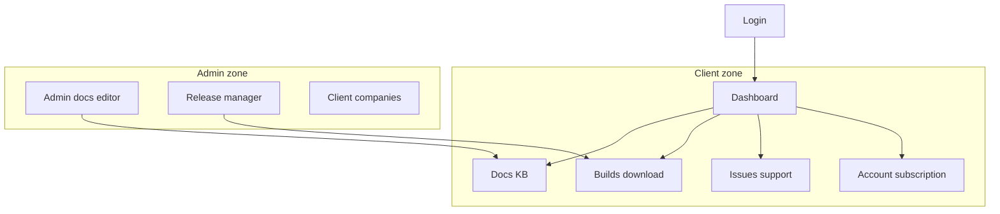

# VCP Topcoat scaffolding

## Goal

Stand up a runnable **Topcoat** app that mirrors the mockup information architecture in [`.cursor/mockups/Concept/`](.cursor/mockups/Concept/), wired to **Toasty + PostgreSQL**, Topcoat sessions, and a Casbin-ready permission catalogue — without implementing full CRUD business logic yet (stubs + shell + tenancy core).

## Product IA (from mockups — source of truth)



Org-scoped paths (module router target):

| Path | Surface |
|------|---------|
| `/login` | Auth (no org) |
| `/{org}/` | Dashboard |
| `/{org}/docs` | Documentation KB |
| `/{org}/builds` | Certified builds |
| `/{org}/issues` | Issue tracker (+ report form stub) |
| `/{org}/account` | Account and subscription |
| `/{org}/admin/docs` | Documentation editor |
| `/{org}/admin/releases` | Release manager |
| `/{org}/admin/companies` | Client companies |

## Scaffold deliverables

### 1. Cargo project

- Root binary crate **`vcp`** (single package first; no multi-crate workspace yet).
- Pin: `topcoat` (no `websocket`), `tokio`, `toasty` with **PostgreSQL** driver, `casbin` (+ adapter as needed), `chrono` / `chrono-tz`, `secrecy`, `argon2` for password hashes.
- Tooling files: `rust-toolchain.toml` (MSRV aligned with Topcoat when practical), `rustfmt.toml`, `clippy.toml` (warnings as errors in CI later), `.env.example` with `DATABASE_URL`, `COOKIE_KEY` / session secrets placeholders.
- `README.md` (U.S. English): how to run Postgres, `topcoat dev`, env vars.

### 2. Module / router tree

Match [`web-stack`](.cursor/skills/web-stack/SKILL.md) + mockups:

```text
src/
  main.rs
  db.rs
  models/
  auth/          # current_user, require_*, login/logout routes
  perms.rs       # PermissionContext + Casbin load
  layout.rs      # shell: dark rail, breadcrumb, org context
  app.rs         # discover root
  app/
    login.rs
    org.rs                 # /{org} layout + dashboard
    org/
      docs.rs
      builds.rs
      issues.rs
      account.rs
      admin.rs             # admin layout gate
      admin/
        docs.rs
        releases.rs
        companies.rs
```

- `.cookies()` + `.sessions(SessionConfig::default())` + `.app_context(Db)` + `.app_context(Key)` + assets/tailwind as needed.
- Include `topcoat::dev::script()` in the shell for `topcoat dev`.
- Admin nest: fail-closed via `require_perms` / `admin_view` (or resource flags) before any admin page body.

### 3. Data model (Toasty, minimal)

Enough for login + tenant + mockup entities as **tables/stubs** (fields can be thin; no full workflows):

- `User` (email, password hash, display name)
- `Session` (`token_hash`, `user_id`, `expires_at`)
- `Organization` (name, slug, address, vat, plan fields for account card)
- `Membership` (user, org, role string for Casbin subject)
- Stub models (empty or seed rows): `DocArticle`, `Release`/`Build`, `Issue` — enough for list pages to render “empty” or seed data without full editors.

Business rules encoded as comments / constants where already known from mockups (e.g. **max 5 users per company**).

### 4. Auth and tenancy skeleton

- `POST /login` → verify credentials → `session::start` → persist `TokenHash`.
- `POST /logout` → `session::stop` → delete session row.
- `current_user` / `require_auth` / `require_org(slug)` / `require_perms` as `cx` helpers + `#[memoize]`.
- Active org from path `{org}` + membership check (404 if cross-tenant).
- Casbin: `config/access/vcp_policy.csv` (VCP catalogue, not bastion) + `PermissionContext` fields aligned to mockups:

| Resource | Actions |
|----------|---------|
| `docs` | `read`, `write` |
| `builds` | `read`, `download` |
| `releases` | `manage` |
| `issues` | `read`, `write` |
| `companies` | `manage` |
| `account` | `read` |
| `admin` | `view` |

### 5. UI shell (mockup-faithful, not pixel-perfect)

- Dark left rail, light content, accent teal ~`#117a6b`.
- Breadcrumb `portal / {org} / {section}`.
- Client vs Admin rail sections; org initials control → account.
- Page stubs: titles/subtitles from mockups; tables/lists as empty states or seed rows.
- Tailwind via Topcoat `tailwind` feature; optional `topcoat ui` init for button/card primitives.
- Responsive: follow [`responsive-ui.mdc`](.cursor/rules/responsive-ui.mdc).

### 6. Out of scope for this scaffold

- Full issue workflow, doc CMS editor, binary upload/signing, time-limited download tokens, payment/PSP.
- TLS terminator in-process (document reverse-proxy / follow-on; keep `tls-post-quantum.mdc`).
- WebSockets, bastion IPC, Diesel.

## Cursor rules / skills adaptations (same PR or immediate follow-up commit)

1. [`project-overview.mdc`](.cursor/rules/project-overview.mdc) — replace vague purpose list with mockup IA (dashboard, docs, builds, issues, account; admin docs/releases/companies).
2. [`casbin-permissions.mdc`](.cursor/rules/casbin-permissions.mdc) — replace draft catalogue (`licenses`/`billing`/…) with the table above; note tenant layer on `{org}` paths.
3. [`web-stack/SKILL.md`](.cursor/skills/web-stack/SKILL.md) — document the concrete `src/app/` tree and shell conventions (rail, breadcrumb, accent).
4. [`topcoat/SKILL.md`](.cursor/skills/topcoat/SKILL.md) — point first models/routes at this scaffold.
5. Short note in [`quality-assurance/SKILL.md`](.cursor/skills/quality-assurance/SKILL.md): smoke `topcoat dev` + Postgres; first E2E target = login + org dashboard denial (wrong slug).

## Validation (scaffold DoD)

- `cargo fmt` / `clippy -D warnings` / `cargo test` (unit: password hash, permission catalogue drift pin if CSV exists).
- App boots with `DATABASE_URL` against local Postgres; login with seed user reaches `/{org}/` dashboard stub.
- Admin routes 403/redirect without admin permission.
- Wrong org slug does not leak another tenant’s data (404).

## Suggested vertical order of work

1. Docs adaptations (IA + Casbin catalogue) so agents stay aligned while coding.
2. `cargo new` + deps + `db` + models + seed.
3. Router shell + auth + org gate.
4. Stub pages for all mockup routes.
5. Validation cycle + seed README.
