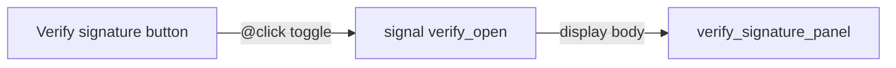

# Verify signature panel + release SHA-256 catalog

## Decisions (locked)

- **DB field:** rename `signature_prefix` → `sha256` (migration `0005`, model, snapshots, all create sites). Admin create default: `sha256: "pending"`.
- **Package name:** keep DB `version` with leading `v`; [`package_file_name`](src/app/org/builds/ephemeral.rs) strips one leading `v`/`V` so LTS → `vauban-1.0.0+LTS.pkg`, else → `vauban-0.9.35.pkg`.
- **Channels:** `1.0.*` LTS; `0.9.*` Stable; `< 0.9` EOL. Private `v0.8.6-acme1` kept (Acme-targeted), invented 64-hex `sha256`, channel EOL to match `< 0.9`.
- **Verify UI:** Topcoat signal toggle only (no POST). Same body chrome as ephemeral (url-row + cmd + copy); **no** countdown, Revoke, fetch/cURL segment.
- **Surface:** extend existing **builds_entitlement** (checks, tests, runbook) — do not invent a new surface name.

## Data layer

1. **Model / migration** — [`src/models/mod.rs`](src/models/mod.rs): `sha256: String`. New [`toasty/migrations/0005_release_sha256.sql`](toasty/migrations/0005_release_sha256.sql): rename column (Postgres `ALTER TABLE ... RENAME COLUMN`). Refresh Toasty snapshot per project convention.
2. **Sizes** — keep `size_mb` as display string; derive from bytes with one decimal MiB (`bytes / 1048576`, `{:.1}`). Helper `fn size_mb_from_bytes(u64) -> String` next to package naming (unit-tested).
3. **Catalog seed** — rewrite GA list in [`src/db.rs`](src/db.rs) (`seed_if_empty` + `ensure_demo_catalog`) to the full set below. **`ensure_demo_catalog` upserts** known GA versions (insert if missing; if present, update `channel`, `released_on`, `size_mb`, `sha256`, `status`) so existing demo DBs pick up full hashes (today it only insert-if-absent and leaves stale prefixes).

| version | channel | size_mb (from bytes) | sha256 |
|---------|---------|----------------------|--------|
| v1.0.2 | LTS | 21.5 | `ccff72c6…5bca6657` |
| v1.0.1 | LTS | 21.5 | `9fef561c…786c8336` |
| v1.0.0 | LTS | 21.4 | `c2b1f7df…75d2fc26` |
| v0.9.35 … v0.9.4 | Stable | from listing | from listing |
| v0.8.7 … v0.2.0 | EOL | from listing | from listing |
| v0.8.6-acme1 | EOL | keep ~20.5 / invent | invent 64 hex (e.g. `a11ce000…` padded) |

`released_on` from the `ls` dates (year **2026**). Drop the obsolete Stable duplicate `v0.8.6` path that never wins against the old LTS seed.

4. **Call sites** — update every `signature_prefix:` create/assert in tests + admin ([`admin/releases/new.rs`](src/app/admin/releases/new.rs), `builds_*`, `portal_shell_*`, `auth_tenant_*`, etc.).

## UI ([`src/app/org/builds.rs`](src/app/org/builds.rs) + [`styles.css`](styles.css))



1. Replace inert `<span class="vb-btn muted …">Verify signature</span>` with `<button type="button" class="vb-btn outline …">` that toggles `signal verify_open` (scoped per open build panel — one signal in the open branch is enough because only one row is expanded).
2. New component `verify_signature_panel(sha256, package_name)`:
   - Wrapper reuse `.vb-ephemeral` (same width/padding as regenerate zone) **without** countdown/revoke bar — title e.g. `PACKAGE SIGNATURE`.
   - Row 1: mono hash + Copy (`data-copy` = full sha256).
   - Row 2: `$ sha256 <pkg>` + `ico_copy` (`data-copy` = `sha256 {pkg}`); **no** `.vb-eph-seg`.
   - Clipboard handlers: same Topcoat function-expr pattern as ephemeral (`current_target.inner` + `navigator.clipboard.writeText`).
3. Table signature column: show first 7 hex of `sha256` + `…` (keep visual ellipsis).
4. Download button label already uses `size_mb` — picks up new sizes automatically.

## Pyramid (surface: builds_entitlement)

| Layer | Deliverable |
|-------|-------------|
| **Unit** | In [`ephemeral.rs`](src/app/org/builds/ephemeral.rs) tests: `package_file_name` strips `v` / LTS suffix; `size_mb_from_bytes`; optional `sha256_cmd(pkg)`. |
| **Invariants** | Extend [`scripts/check_builds_entitlement.sh`](scripts/check_builds_entitlement.sh) + [`builds_entitlement_invariants_test.rs`](tests/integration_tests/builds_entitlement_invariants_test.rs): Verify is a `button` (not muted span); `signal verify_open` / `verify_signature_panel`; no POST route for verify; verify panel must not contain `use_curl` / countdown / Revoke; model has `sha256`; migration `0005` renames column; `package_file_name` strips leading `v`. |
| **Proptest** | Extend [`builds_entitlement_proptest.rs`](tests/integration_tests/builds_entitlement_proptest.rs): for a table of (version, channel, expected_pkg), `package_file_name` matches; seeded GA hashes in a const table are all len 64 hex. |
| **Battle** | Extend [`builds_entitlement_battle_test.rs`](tests/integration_tests/builds_entitlement_battle_test.rs): parallel GETs of builds list/detail still OK and bodies contain `Verify signature` + `vb-ephemeral` / verify panel class hook when a release exists. |
| **E2E** | Extend [`builds_entitlement_e2e_test.rs`](tests/integration_tests/builds_entitlement_e2e_test.rs): fixture release with known `sha256` + LTS channel; open build HTML contains full hash in `data-copy`, `sha256 vauban-…+LTS.pkg` command copy target, and **does not** put fetch/cURL segment inside the verify block; Verify control is a button. |
| **Smoke** | Extend [`docs/runbooks/builds_entitlement_smoke_test.md`](docs/runbooks/builds_entitlement_smoke_test.md) section **E -- Verify signature**: click Verify → panel opens with hash + `sha256` command; no countdown/revoke; collapse on second click; package name matches channel. |

## Validation

```bash
just fmt
just clippy
bash scripts/check_builds_entitlement.sh
just test builds_entitlement_
# plus unit filter for package_file_name / size_mb_from_bytes if needed
```

Apply Toasty migrate on dev/test DBs after `0005`.

## Out of scope

- Real artifact download / signature crypto verification server-side.
- Changing ephemeral POST/PRG flow or fetch/cURL tabs on the regenerate panel.
- Re-adding Concept mockups to git.
