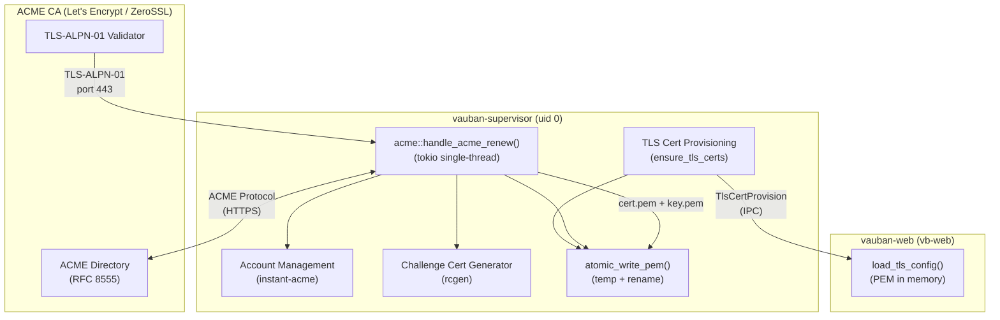
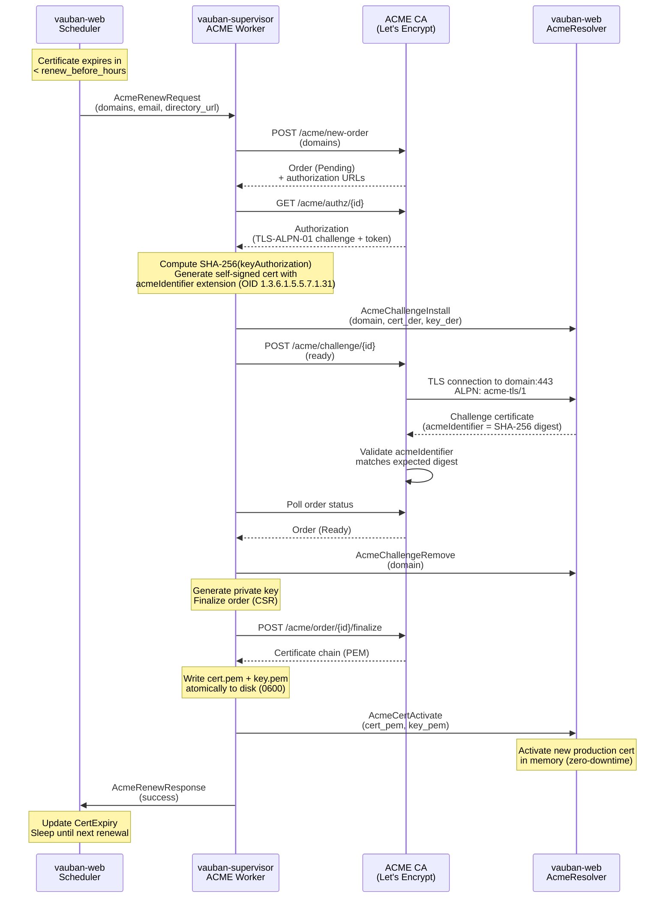
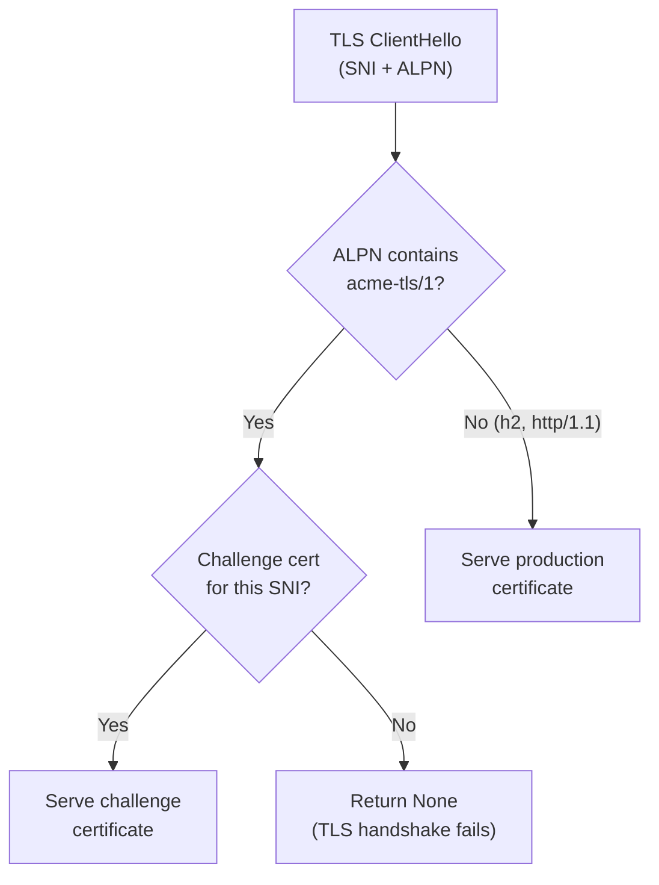
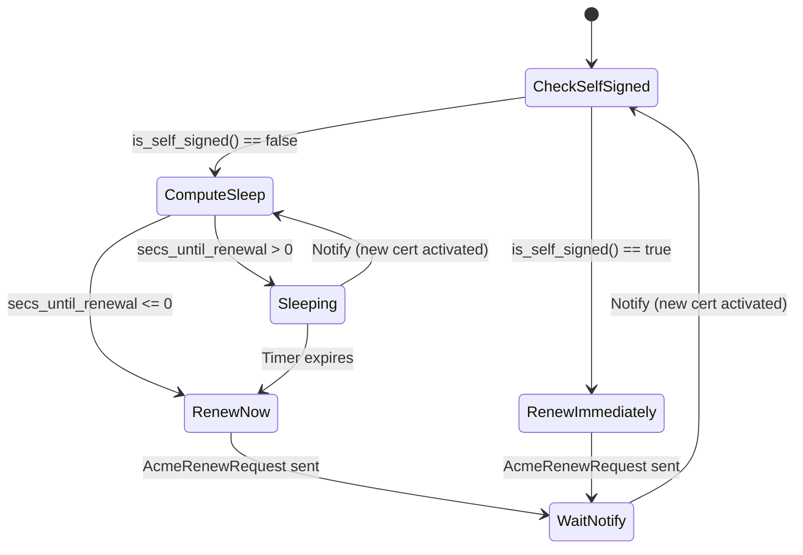
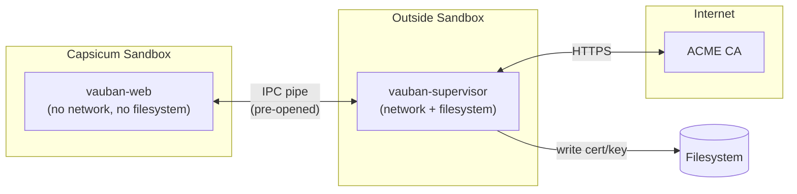
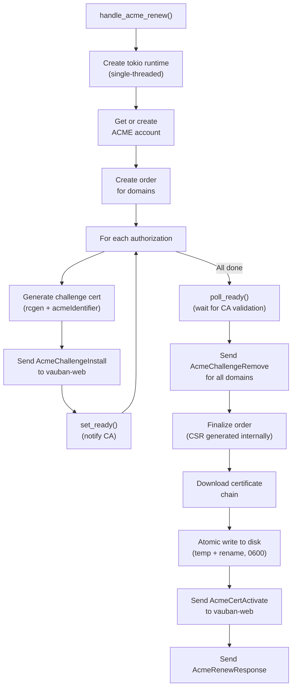
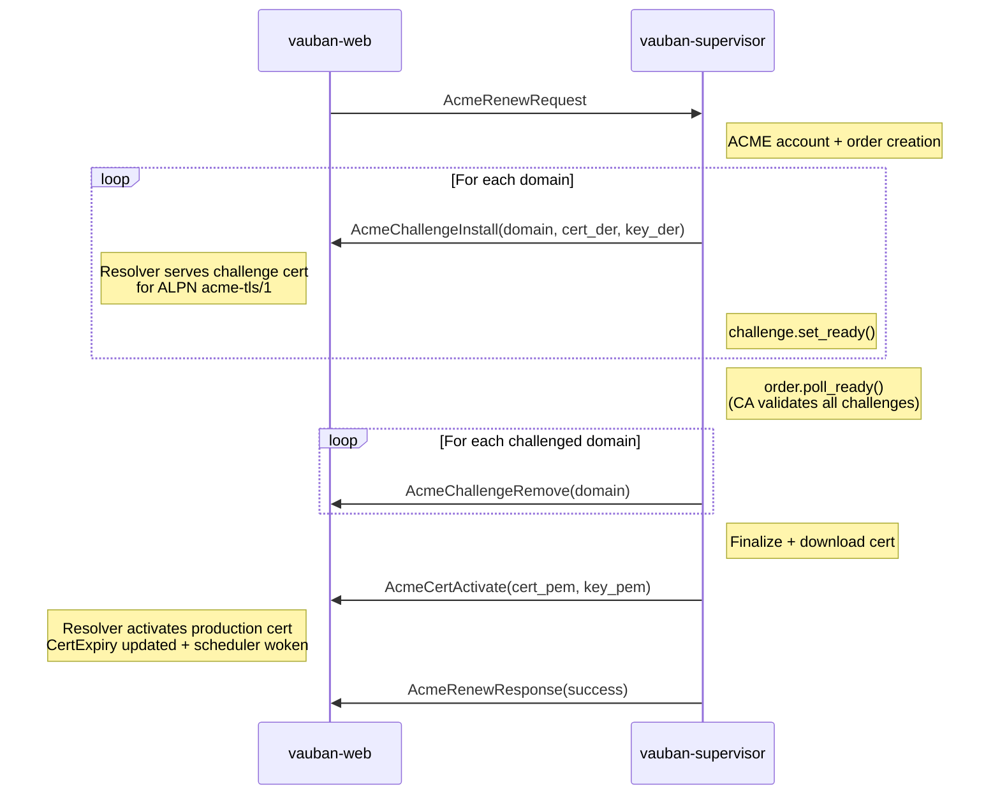
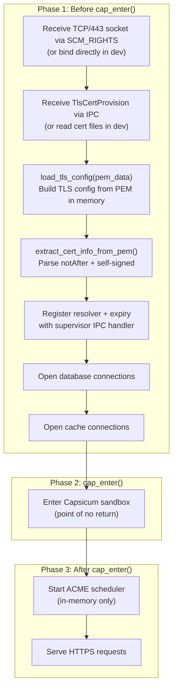
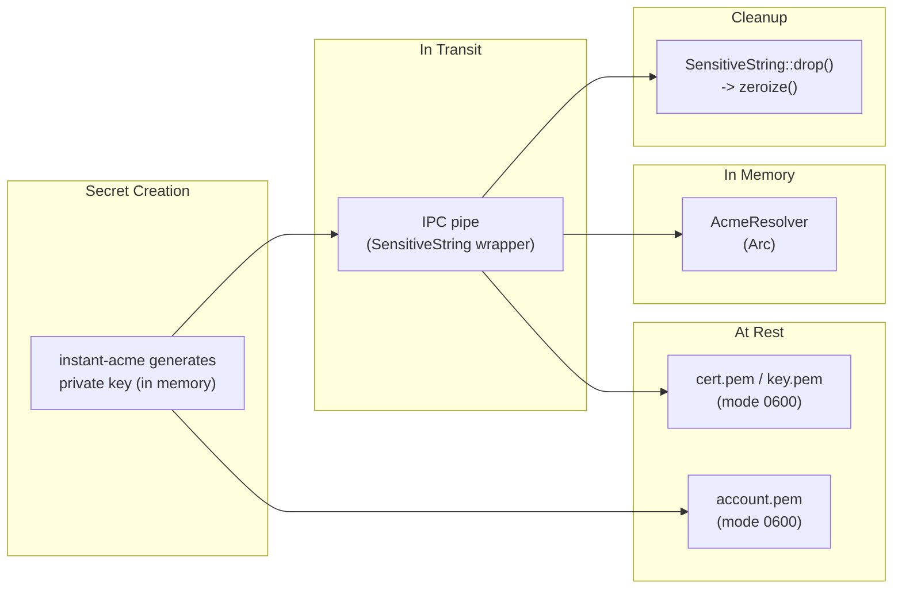

# Vauban ACME TLS Certificate Architecture

**Version:** 1.0  
**Date:** 27 February 2026  
**Author:** Richard Ben Aleya

---

## Table of Contents

1. [Introduction](#1-introduction)
2. [Architecture Overview](#2-architecture-overview)
3. [TLS-ALPN-01 Challenge Protocol](#3-tls-alpn-01-challenge-protocol)
4. [Dynamic Certificate Resolution](#4-dynamic-certificate-resolution)
5. [Renewal Scheduler](#5-renewal-scheduler)
6. [Supervisor ACME Worker](#6-supervisor-acme-worker)
7. [IPC Message Protocol](#7-ipc-message-protocol)
8. [Capsicum Sandbox Integration](#8-capsicum-sandbox-integration)
9. [Configuration](#9-configuration)
10. [Security Analysis](#10-security-analysis)
11. [Testing Strategy](#11-testing-strategy)
12. [Architecture Decisions](#12-architecture-decisions)

---

## 1. Introduction

### 1.1 Background

TLS certificates issued by ACME providers (Let's Encrypt, ZeroSSL) expire after 90 days. Without automation, certificate renewal is a manual, error-prone process that can cause service outages.

Traditional solutions rely on external tools:

| Approach | Drawback |
|----------|----------|
| `certbot` (system client) | External dependency, cron-based, requires root for port 80 |
| Reverse proxy (nginx/Apache) | Additional process, configuration complexity, separate TLS termination |
| DNS-01 challenge | Requires DNS API integration, provider-specific |
| HTTP-01 challenge | Requires port 80 open, separate HTTP listener |

None of these fit Vauban's architecture: a single-binary Rust bastion with Capsicum sandboxing, no reverse proxy, and no external dependencies.

### 1.2 Design Goals

| Goal | Approach |
|------|----------|
| No external dependencies | ACME protocol built into Vauban itself |
| No port 80 | TLS-ALPN-01 challenge on port 443 only |
| Capsicum-compatible | Network operations in unsandboxed supervisor |
| Zero-downtime renewal | In-memory certificate rotation, no server restart |
| Automatic bootstrap | Self-signed certificates replaced immediately at first start |
| Provider-agnostic | Let's Encrypt, ZeroSSL, or any RFC 8555-compliant CA |

### 1.3 Scope

This document covers the ACME TLS certificate management subsystem spanning three crates: `vauban-supervisor` (ACME protocol execution), `vauban-web` (TLS resolver and renewal scheduler), and `shared` (IPC message definitions). It is a companion to the [Privilege Separation Architecture](Vauban_Privsep_Architecture_EN(1.2).md) which describes the overall system design.

### 1.4 Threat Model

| Threat | Mitigation |
|--------|------------|
| Man-in-the-middle during ACME | TLS to ACME directory, key authorization digest in challenge cert |
| Private key exposure in logs | `SensitiveString` wrapper, `Debug` always shows `[REDACTED]` |
| Private key exposure on disk | File permissions `0600`, atomic write (temp + rename) |
| Stale challenge certificate served to users | Challenge certs removed after CA validation; `acme-tls/1` ALPN required |
| Capsicum bypass for ACME network calls | ACME runs in supervisor (unsandboxed); web never makes outbound connections |
| Self-signed cert served indefinitely | Detected at startup via issuer==subject comparison; triggers immediate renewal |
| Certificate file corruption | Atomic write: write to `.tmp`, `fsync()`, rename over target |

---

## 2. Architecture Overview

### 2.1 Component Diagram



**Key architectural property:** `vauban-web` (running as unprivileged user `vb-web`) never accesses certificate files on disk. The supervisor reads/generates certs as root and sends PEM data via IPC (`TlsCertProvision` message). This eliminates all ACLs on the certs directory.

### 2.2 Module Structure

```
vauban-web/
├── src/
│   ├── acme/
│   │   ├── mod.rs            # Module declaration
│   │   └── resolver.rs       # AcmeResolver (ResolvesServerCert)
│   ├── tasks/
│   │   ├── mod.rs            # Public exports
│   │   └── acme.rs           # CertExpiry, scheduler, ASN.1 parser
│   ├── ipc/
│   │   └── supervisor.rs     # ACME IPC message handlers
│   ├── config.rs             # AcmeConfig
│   └── main.rs               # TLS setup, ACME bootstrap

vauban-supervisor/
└── src/
    ├── acme.rs               # ACME workflow (instant-acme + rcgen)
    └── main.rs               # AcmeRenewRequest dispatcher

shared/
└── src/
    └── messages.rs           # ACME IPC message definitions
```

### 2.3 Dependencies

**vauban-web** (TLS integration, no ACME protocol):

| Crate | Purpose |
|-------|---------|
| `rustls` | TLS 1.3 server, `ResolvesServerCert` trait |
| `rustls-pki-types` | Certificate/key DER/PEM parsing |
| `rcgen` 0.14 | Self-signed bootstrap certificate generation when files are missing |
| `chrono` | Timestamp calculation for renewal scheduling |
| `tokio` | Async scheduler, `Notify` for wakeup |

**vauban-supervisor** (ACME protocol execution):

| Crate | Purpose |
|-------|---------|
| `instant-acme` 0.8 | ACME RFC 8555 client (account, orders, challenges) |
| `rcgen` 0.14 | Self-signed challenge certificate generation (acmeIdentifier extension) |
| `sha2` | SHA-256 digest of key authorization for TLS-ALPN-01 |
| `serde_json` | ACME account credential persistence |
| `tokio` | Async runtime for ACME HTTP calls (single-threaded, per-renewal) |

**Explicitly excluded:**

- `certbot`, `acme-client` -- external system tools, not embeddable
- `x509-parser` -- too heavy; a minimal ASN.1 parser extracts only `notAfter` and issuer/subject
- `openssl` -- Vauban uses `rustls` exclusively (`cargo deny` bans `openssl`)

---

## 3. TLS-ALPN-01 Challenge Protocol

### 3.1 Why TLS-ALPN-01

ACME (RFC 8555) defines three challenge types for domain validation:

| Challenge | Port | Requirement | Vauban Fit |
|-----------|------|-------------|------------|
| HTTP-01 | TCP/80 | HTTP server on port 80 | No -- port 80 not open, no HTTP listener |
| DNS-01 | -- | DNS TXT record via API | No -- requires DNS provider integration |
| **TLS-ALPN-01** | **TCP/443** | **TLS handshake with special cert** | **Yes -- reuses existing HTTPS port** |

TLS-ALPN-01 (RFC 8737) is the only challenge type that operates entirely on port 443, which is already bound by `vauban-web`. No additional ports, no DNS integration.

### 3.2 Protocol Flow



### 3.3 Challenge Certificate Structure

The TLS-ALPN-01 challenge certificate is a self-signed X.509 certificate with specific properties mandated by RFC 8737:

```
Certificate:
    Subject Alternative Name: domain being validated
    ALPN Protocol: acme-tls/1
    Extension (critical):
        OID: 1.3.6.1.5.5.7.1.31 (id-pe-acmeIdentifier)
        Value: ASN.1 OCTET STRING containing SHA-256(keyAuthorization)
    Key: ECDSA P-256 (ephemeral, generated per challenge)
    Validity: Short-lived (rcgen default)
    Self-signed: Yes (not issued by any CA)
```

The `acmeIdentifier` extension proves to the CA that the server controls both the domain (via TLS on port 443) and the ACME account (via the key authorization hash).

---

## 4. Dynamic Certificate Resolution

### 4.1 The AcmeResolver

`AcmeResolver` implements `rustls::server::ResolvesServerCert`, allowing `vauban-web` to dynamically select which certificate to serve based on the TLS handshake:



### 4.2 Internal State

```rust
struct ResolverState {
    production_cert: Option<Arc<CertifiedKey>>,
    challenge_certs: HashMap<String, Arc<CertifiedKey>>,
}

pub struct AcmeResolver {
    state: RwLock<ResolverState>,
}
```

Design rationale:

- **`RwLock`** (not `Mutex`): TLS handshakes (reads) vastly outnumber certificate updates (writes). `RwLock` allows concurrent handshakes without contention.
- **`Arc<CertifiedKey>`**: Certificates are reference-counted so they can be replaced without invalidating in-flight handshakes.
- **`HashMap<String, ...>`** for challenges: Multiple domains can be validated simultaneously (SAN certificates).

### 4.3 ALPN Configuration

The TLS server advertises three ALPN protocols:

```rust
server_config.alpn_protocols = vec![
    b"h2".to_vec(),           // HTTP/2 (normal traffic)
    b"http/1.1".to_vec(),     // HTTP/1.1 (fallback)
    b"acme-tls/1".to_vec(),   // TLS-ALPN-01 (ACME validation only)
];
```

Only ACME CA validators will negotiate `acme-tls/1`. Regular browsers and HTTP clients negotiate `h2` or `http/1.1` and receive the production certificate.

### 4.4 Zero-Downtime Certificate Rotation

When a new certificate arrives via `AcmeCertActivate`:

1. PEM certificate chain and private key are parsed into a `CertifiedKey`
2. The resolver's `production_cert` is atomically replaced under the write lock
3. In-flight TLS connections that already completed the handshake are unaffected
4. New connections immediately use the new certificate

No server restart, no connection drop, no downtime.

---

## 5. Renewal Scheduler

### 5.1 Design: Precise Sleep vs. Polling

An earlier design polled certificate expiry every 12 hours. This was replaced with a precise scheduler that calculates exactly when renewal is needed:

| Approach | CPU Usage | Latency | Complexity |
|----------|-----------|---------|------------|
| Polling every N hours | Wakes up unnecessarily | Up to N hours late | Simple |
| **Precise sleep + Notify** | **Zero until needed** | **Immediate** | **Moderate** |

The scheduler sleeps until exactly `notAfter - renew_before_hours`, then wakes and requests renewal. If a new certificate is activated while sleeping, the `Notify` mechanism wakes the scheduler to recalculate.

### 5.2 State Machine



### 5.3 CertExpiry: Shared Atomic State

```rust
pub struct CertExpiry {
    not_after_epoch: AtomicI64,   // Unix timestamp of certificate expiry
    self_signed: AtomicBool,      // issuer == subject in DER
    waker: Notify,                // Wakes scheduler on certificate update
}
```

This structure is shared between:

- **The scheduler** (reads `not_after_epoch` and `self_signed` to decide when to renew)
- **The IPC handler** (writes new values when `AcmeCertActivate` arrives)

`AtomicI64`/`AtomicBool` avoid locking entirely for reads and writes. The `Notify` channel wakes the scheduler via `tokio::select!` when the certificate changes.

### 5.4 Self-Signed Certificate Detection

At startup, the certificate's raw DER bytes are parsed with a minimal ASN.1 parser. If the `issuer` and `subject` fields are byte-identical, the certificate is self-signed:

```
TBSCertificate ::= SEQUENCE {
    version       [0] EXPLICIT INTEGER,
    serialNumber       INTEGER,
    signature          AlgorithmIdentifier,
    issuer             Name,        <-- capture raw TLV bytes
    validity           Validity,    <-- extract notAfter
    subject            Name,        <-- capture raw TLV bytes
    ...
}

if issuer_bytes == subject_bytes => self-signed
```

This handles the common deployment scenario: the administrator generates a self-signed certificate with `generate-dev-certs.sh`, starts `vauban-web`, and ACME immediately replaces it with a real certificate.

### 5.5 Automatic Bootstrap Certificate Generation

In **production** (under supervisor), `vauban-supervisor` (running as root) generates the bootstrap certificate:

1. `ensure_tls_certs()` checks if `cert_path`/`key_path` files exist
2. If missing, calls `generate_self_signed_cert()` which creates an ECDSA P-256 key pair via `rcgen`
3. Writes both files atomically to disk with `0600` permissions (root-only)
4. Reads back the PEM data and sends it to `vauban-web` via `TlsCertProvision` IPC message
5. `vauban-web` receives the PEM data in memory and builds its TLS config without filesystem access

```
vauban-supervisor (root):
    ensure_tls_certs(cert_path, key_path)
        │
        ├── cert_path exists? ──── yes ──> read PEM from disk
        │
        └── no
             │
             └── generate_self_signed_cert(cert_path, key_path)
                  ├── rcgen::KeyPair::generate_for(ECDSA_P256)
                  ├── CertificateParams::new(["localhost"]).self_signed(&key)
                  ├── atomic_write_pem(cert_path, cert_pem)   // 0600 root-only
                  └── atomic_write_pem(key_path, key_pem)     // 0600 root-only
        │
        └── send TlsCertProvision(cert_pem, key_pem) to vauban-web

vauban-web (vb-web):
    recv TlsCertProvision ──> load_tls_config(pem_data) ──> serve HTTPS
```

In **development** (without supervisor), `vauban-web` retains the ability to read certificate files directly from disk and generate self-signed certs via `generate_self_signed_cert()` in `acme/resolver.rs`.

This eliminates the need for ACLs on `/usr/local/etc/vauban/certs`: the directory is `chmod 700 root:wheel`, inaccessible to all service users.

### 5.6 Why a Custom ASN.1 Parser

The certificate metadata extraction requires only two pieces of information from a DER-encoded X.509 certificate: the `notAfter` timestamp and whether `issuer == subject`. A full X.509 parser (`x509-parser`, `webpki`) would add significant dependency weight for minimal gain.

The custom parser (~120 lines) walks the DER structure through exactly 6 fields (version, serialNumber, signature, issuer, validity, subject) using three primitives: `parse_tag_length`, `skip_tlv`, and `parse_asn1_time`. It is covered by 26 unit tests including boundary conditions (Y2K pivot, GeneralizedTime, malformed inputs).

---

## 6. Supervisor ACME Worker

### 6.1 Why the Supervisor

After `cap_enter()`, `vauban-web` is forbidden from:

- Opening new network connections (required for ACME HTTP calls)
- Opening new files (required to write the certificate to disk)
- Creating new sockets

The supervisor (`vauban-supervisor`) runs **outside** the Capsicum sandbox. It is the natural place for ACME operations that require network and filesystem access.



### 6.2 ACME Workflow Implementation

The supervisor uses `instant-acme` (v0.8) for the ACME protocol and `rcgen` for challenge certificate generation:

```rust
pub struct AcmeRenewParams {
    pub request_id: u64,
    pub directory_url: String,
    pub domains: Vec<String>,
    pub email: String,
    pub account_key_path: String,
    pub cert_path: String,
    pub key_path: String,
    pub eab_kid: Option<String>,
    pub eab_hmac_key: Option<SensitiveString>,
}
```

The workflow runs in a dedicated single-threaded tokio runtime (`Builder::new_current_thread()`) to avoid interfering with the supervisor's synchronous main loop:



### 6.3 Account Persistence

ACME accounts are persisted as JSON credentials (the `AccountCredentials` type from `instant-acme`):

- **First run**: A new account is created with the CA, and credentials are saved to `account_key_path`
- **Subsequent runs**: Credentials are loaded from disk, avoiding re-registration

For ZeroSSL, External Account Binding (EAB) is supported via `eab_kid` and `eab_hmac_key` configuration parameters.

### 6.4 Atomic File Writes

Certificates and keys are written atomically to prevent serving partial or corrupted files:

```
1. Create temp file:  cert.pem.tmp
2. Set permissions:   chmod 0600 cert.pem.tmp
3. Write content:     write_all(data)
4. Sync to disk:      fsync()
5. Atomic rename:     rename(cert.pem.tmp, cert.pem)
```

If the process crashes between steps 1-4, the original `cert.pem` is unchanged. Step 5 is atomic on POSIX filesystems.

---

## 7. IPC Message Protocol

### 7.1 Message Definitions

Six IPC messages coordinate TLS certificate management between `vauban-web` and `vauban-supervisor`:

| Message | Direction | Purpose |
|---------|-----------|---------|
| `TlsCertProvision` | Supervisor -> Web | Provide cert/key PEM data at startup (bootstrap) |
| `AcmeRenewRequest` | Web -> Supervisor | Request certificate renewal |
| `AcmeRenewResponse` | Supervisor -> Web | Report renewal result |
| `AcmeChallengeInstall` | Supervisor -> Web | Install challenge cert in resolver |
| `AcmeChallengeRemove` | Supervisor -> Web | Remove challenge cert from resolver |
| `AcmeCertActivate` | Supervisor -> Web | Activate new production cert in memory |

### 7.2 Message Flow Timing



### 7.3 Secret Protection in Messages

| Field | Type | Protection |
|-------|------|------------|
| `eab_hmac_key` | `Option<SensitiveString>` | Zeroize-on-drop, `Debug` shows `[REDACTED]` |
| `key_pem` (response) | `Option<SensitiveString>` | Zeroize-on-drop, `Debug` shows `[REDACTED]` |
| `key_pem` (activate) | `SensitiveString` | Zeroize-on-drop, `Debug` shows `[REDACTED]` |
| `challenge_key_der` | `Vec<u8>` | Ephemeral (per-challenge), not persisted |

All private key material is wrapped in `SensitiveString` (which implements `Zeroize` and `ZeroizeOnDrop`) and redacted in `Debug`/`Display` output to prevent leakage in logs.

---

## 8. Capsicum Sandbox Integration

### 8.1 The Sandbox Constraint

On FreeBSD, `vauban-web` enters Capsicum capability mode (`cap_enter()`) early in startup. After this point:

- No new file descriptors can be opened
- No new network connections can be made
- No filesystem access (even for reading)

This creates a fundamental constraint for ACME: certificate metadata must be read **before** entering the sandbox.

### 8.2 Pre-Sandbox Resource Loading



Under supervisor, `vauban-web` never opens any certificate files. All cert/key data arrives via `TlsCertProvision` IPC message, parsed directly from PEM bytes in memory.

### 8.3 What Happens Inside the Sandbox

After `cap_enter()`, the ACME subsystem operates entirely in memory:

| Operation | How |
|-----------|-----|
| Check certificate expiry | `CertExpiry` atomic state (pre-loaded) |
| Request renewal | Send IPC message to supervisor (pre-opened pipe) |
| Install challenge cert | Update `AcmeResolver` `HashMap` (in memory) |
| Activate production cert | Update `AcmeResolver` `production_cert` (in memory) |
| Write cert to disk | **Supervisor** writes (outside sandbox) |

### 8.4 Fallback When Certificate Files Are Missing

If `extract_cert_info()` fails (file not found, invalid PEM), the scheduler initializes with:

```rust
CertInfo {
    not_after_epoch: 0,     // Already expired
    self_signed: true,      // Force immediate renewal
}
```

This ensures that even if no certificate file exists at startup, ACME renewal is triggered immediately to obtain one.

---

## 9. Configuration

### 9.1 TOML Schema

```toml
[server.tls.acme]
enabled = false                           # Master switch
email = ""                                # Contact email for CA notifications
domains = []                              # Domains to obtain certificates for
renew_before_hours = 24                   # Renew N hours before expiration
account_key_path = "acme/account.pem"     # ACME account credentials (JSON)
staging = false                           # Use staging CA (for testing)
directory_url = "https://acme-v02.api.letsencrypt.org/directory"
staging_directory_url = "https://acme-staging-v02.api.letsencrypt.org/directory"
# ZeroSSL ACME URLs (requires EAB credentials from dashboard):
# directory_url = "https://acme.zerossl.com/v2/DV90"
# staging_directory_url = ""              # ZeroSSL has no staging environment
# eab_kid = "your_kid_here"              # External Account Binding
# eab_hmac_key = "your_hmac_key_here"    # EAB HMAC key
```

### 9.2 Environment Defaults

| Environment | `enabled` | Rationale |
|-------------|-----------|-----------|
| `default.toml` | `false` | Safe default, no ACME unless explicitly enabled |
| `development.toml` | `false` | Developers use self-signed certs |
| `testing.toml` | `false` | Tests use self-signed certs |
| `production.toml` | `true` | Production requires real certificates |

### 9.3 Validation Rules

`AcmeConfig::validate()` enforces:

| Rule | Error |
|------|-------|
| `email` is non-empty | "ACME email is required" |
| `domains` is non-empty | "ACME domains list cannot be empty" |
| `account_key_path` is non-empty | "ACME account_key_path is required" |
| `eab_kid` and `eab_hmac_key` must both be set or both absent | "eab_kid and eab_hmac_key must both be set or both be absent" |

### 9.4 No Hardcoded URLs

ACME directory URLs are **not hardcoded** in application code. They are configured via TOML, making it possible to use any RFC 8555-compliant CA without code changes. Only test code contains hardcoded URLs for assertions.

---

## 10. Security Analysis

### 10.1 Attack Surface Reduction

| Property | Implementation |
|----------|---------------|
| No port 80 | TLS-ALPN-01 on port 443 only |
| No reverse proxy | Certificate management built into application |
| No external tools | No `certbot`, no `acme.sh`, no cron scripts |
| No filesystem access after sandbox | Certificate metadata pre-loaded |
| Minimal dependencies | `instant-acme` + `rcgen` (supervisor), `rcgen` (web bootstrap) |

### 10.2 Secret Lifecycle



### 10.3 TLS Configuration

| Setting | Value | Justification |
|---------|-------|---------------|
| Protocol versions | TLS 1.3 only | TLS 1.2 and below disabled |
| Client auth | None required | Public-facing web application |
| ALPN | `h2`, `http/1.1`, `acme-tls/1` | HTTP/2 preferred, ACME challenge support |
| Certificate resolver | Dynamic (`AcmeResolver`) | Supports hot rotation |

### 10.4 Challenge Certificate Isolation

Challenge certificates are **never served to regular users**:

1. They are only returned when the ALPN is exactly `acme-tls/1`
2. Regular browsers negotiate `h2` or `http/1.1` and receive the production certificate
3. Challenge certificates are removed as soon as the CA completes validation
4. If no challenge certificate is installed for the requested SNI, the handshake fails (returns `None`)

---

## 11. Testing Strategy

### 11.1 Test Coverage

| Component | Unit Tests | What is Tested |
|-----------|-----------|---------------|
| ASN.1 parser | 15 tests | UTCTime, GeneralizedTime, Y2K pivot, malformed inputs, tag/length parsing |
| `parse_x509_cert_info` | 3 tests | Self-signed detection, CA-signed detection, invalid DER |
| `CertExpiry` | 7 tests | State management, atomic updates, `Notify` wakeup, self-signed flag |
| `extract_cert_info` | 4 tests | Valid PEM, nonexistent file, empty file, garbage content |
| `AcmeResolver` | 19 tests | Challenge lifecycle, production cert rotation, ALPN selection, Debug format |
| `generate_self_signed_cert` | 5 tests | File creation, parent dir creation, empty domains, reloadability, Unix permissions |
| `certified_key_from_pem/der` | 5 tests | Valid certs, empty input, garbage input |
| Supervisor `acme.rs` | 5 tests | OID constant, challenge cert generation, atomic writes, parent dir creation |
| IPC messages | 10 tests | Serialization roundtrip, Debug redaction for private keys |

**Total: 68 ACME-specific tests.**

### 11.2 Test Certificate Generation

Tests use `rcgen` to generate real X.509 certificates:

- **Self-signed certificates**: `CertificateParams::self_signed()` for testing self-signed detection
- **CA-signed certificates**: `CertificateParams::signed_by()` with a test CA for testing issuer != subject

This avoids hardcoded DER blobs and ensures tests reflect real certificate structures.

---

## 12. Architecture Decisions

### 12.1 TLS-ALPN-01 over HTTP-01

**Decision:** Use TLS-ALPN-01 exclusively, never HTTP-01.

**Context:** Vauban only binds port 443. Opening port 80 for HTTP-01 would expand the attack surface and require a separate HTTP listener.

**Consequences:**
- ✅ No port 80, reduced attack surface
- ✅ Single port for all traffic
- ✅ Works behind firewalls that block port 80
- ⚠️ Requires custom `ResolvesServerCert` implementation
- ⚠️ Some CAs may not support TLS-ALPN-01 (rare)

### 12.2 Supervisor Executes ACME Protocol

**Decision:** The ACME protocol runs in `vauban-supervisor`, not in `vauban-web`.

**Context:** After `cap_enter()`, `vauban-web` cannot make outbound network connections or write files. The ACME protocol requires both.

**Consequences:**
- ✅ Clean separation: web serves TLS, supervisor manages certificates
- ✅ Compatible with Capsicum sandbox model
- ✅ Supervisor already has network access for other tasks
- ⚠️ Adds 5 IPC messages to the protocol
- ⚠️ Challenge certificates must cross the IPC boundary

### 12.3 In-Memory Certificate Rotation

**Decision:** New certificates are activated in memory without restarting the server.

**Context:** Restarting `vauban-web` would drop all active connections (WebSocket sessions, SSH sessions, RDP sessions).

**Consequences:**
- ✅ Zero downtime during certificate renewal
- ✅ Active sessions continue uninterrupted
- ✅ New connections immediately use the new certificate
- ⚠️ Requires dynamic `ResolvesServerCert` implementation
- ⚠️ Requires `Arc<CertifiedKey>` reference counting

### 12.4 Precise Sleep over Polling

**Decision:** The scheduler sleeps until exactly `notAfter - renew_before_hours` instead of polling periodically.

**Context:** A 90-day certificate with 24-hour renewal threshold means the scheduler has nothing to do for ~89 days.

**Consequences:**
- ✅ Zero CPU usage between renewals
- ✅ Renewal happens at the exact right moment
- ✅ `Notify` allows immediate recalculation when a new cert arrives
- ⚠️ Requires `tokio::select!` for concurrent sleep + notify

### 12.5 Custom ASN.1 Parser over x509-parser

**Decision:** Use a minimal (~120 lines) ASN.1 parser to extract `notAfter` and issuer/subject.

**Context:** Full X.509 parsing crates (`x509-parser`, `webpki`) add significant dependency weight. Vauban only needs two pieces of information from the certificate DER.

**Consequences:**
- ✅ Minimal dependency footprint
- ✅ No transitive dependencies
- ✅ Fully covered by 26 unit tests
- ⚠️ Cannot parse arbitrary X.509 extensions
- ⚠️ Custom code requires careful testing (handled by test suite)

### 12.6 Self-Signed Detection for Automatic Bootstrap

**Decision:** If the initial certificate is self-signed, trigger ACME renewal immediately.

**Context:** A common deployment scenario is: install `vauban-web`, configure ACME in TOML, start server. Without detection, the system would need pre-existing certificates.

**Consequences:**
- ✅ Automatic bootstrap from self-signed to ACME certificate
- ✅ No manual intervention required after first deploy
- ✅ When certificate files are missing and ACME is enabled, `rcgen` auto-generates a self-signed bootstrap certificate written to `cert_path`/`key_path` with `0600` permissions
- ✅ The scheduler detects the self-signed certificate (issuer == subject) and triggers immediate ACME renewal
- ⚠️ Requires issuer/subject comparison in DER (handled by ASN.1 parser)
- ⚠️ Must run before `cap_enter()` for file I/O access

### 12.7 No Hardcoded Directory URLs

**Decision:** ACME directory URLs are configured via TOML, not hardcoded in application code.

**Context:** Hardcoded URLs would make it impossible to use alternative CAs without code changes.

**Consequences:**
- ✅ Support any RFC 8555-compliant CA
- ✅ Easy to switch between staging and production
- ✅ No code change needed for new providers
- ⚠️ Requires TOML configuration per provider

### 12.8 Supervisor-Provided TLS Certificates

**Decision:** The supervisor (root) reads or generates TLS certificates and provides them to `vauban-web` via a `TlsCertProvision` IPC message containing PEM data. `vauban-web` never accesses certificate files on disk in production.

**Context:** The previous architecture required `vauban-web` (running as user `vbwebfront`, now `vb-web` in current packages) to read certificate files from `/usr/local/etc/vauban/certs/`. This required:
- ACLs (`setfacl`) on the certs directory for that unprivileged web service user
- ACLs on individual cert/key files
- Bootstrap certificate generation in `+POST_INSTALL` (run as root during pkg install)
- Complex ACL logic to support both POSIX.1e (UFS) and NFSv4 (ZFS) filesystems

These ACLs were fragile: `sed -i` operations on other config files could destroy them (FreeBSD creates a new file), and the dual UFS/ZFS ACL code was a recurring source of deployment issues.

**Consequences:**
- ✅ Eliminates all ACLs on `/usr/local/etc/vauban/certs/` (directory is `0700 root:wheel`)
- ✅ Eliminates bootstrap certificate generation from `+POST_INSTALL`
- ✅ `vb-web` has zero filesystem access to certificates
- ✅ Certificate data never touches the filesystem from `vauban-web`'s perspective
- ✅ Simpler packaging: no `setfacl` calls for certs directory
- ✅ Works identically on UFS and ZFS without ACL-type detection
- ⚠️ Adds one IPC message (`TlsCertProvision`) to the startup protocol
- ⚠️ Dev mode (without supervisor) still reads files directly (unchanged behavior)
