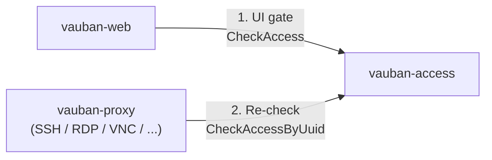
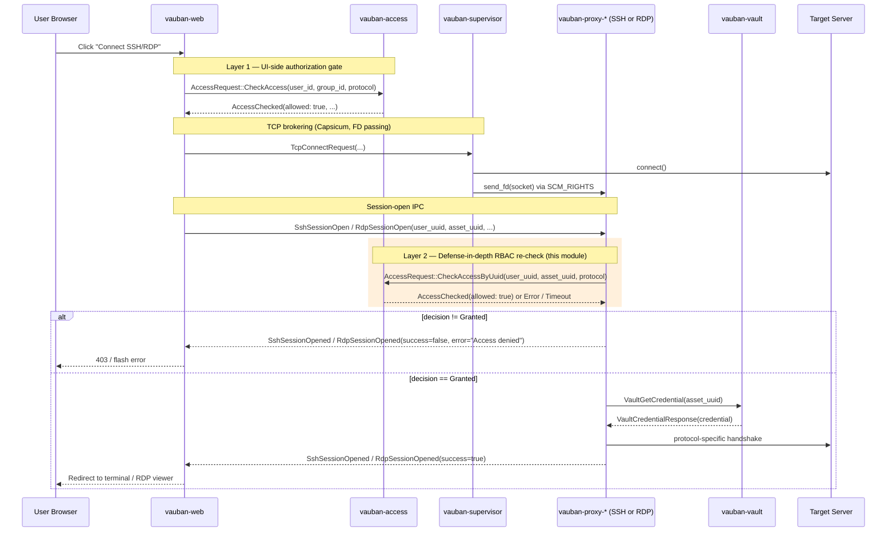
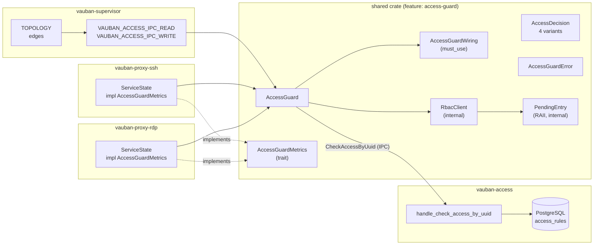
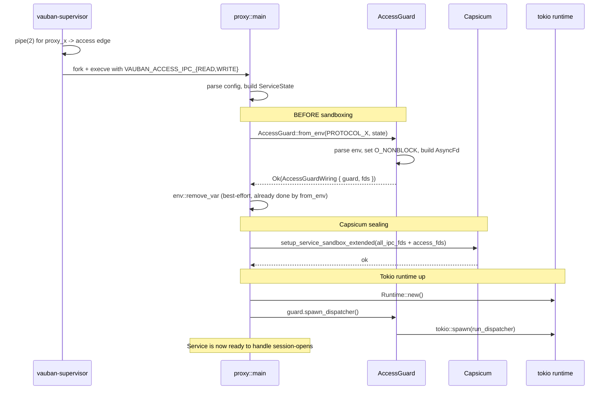
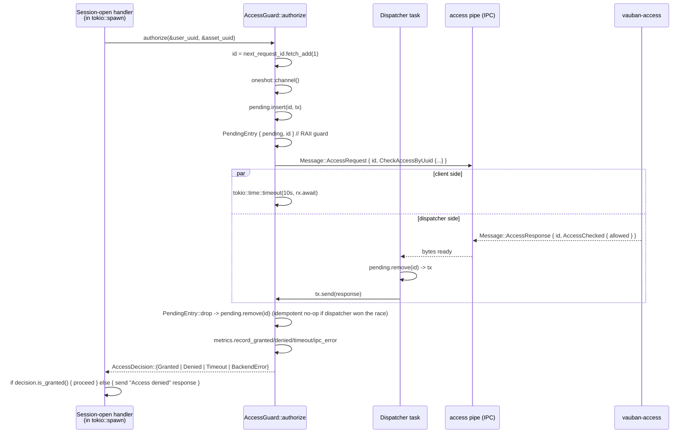

# Vauban AccessGuard Architecture

**Version:** 1.0  
**Date:** 21 April 2026  
**Author:** Richard Ben Aleya

---

## Table of Contents

1. [Introduction](#1-introduction)
2. [Architecture Overview](#2-architecture-overview)
3. [Public Module API](#3-public-module-api)
4. [Lifecycle](#4-lifecycle)
5. [Threat Model](#5-threat-model)
6. [The Pending-Map RAII Fix (post-incident)](#6-the-pending-map-raii-fix-post-incident)
7. [Type-System Invariants](#7-type-system-invariants)
8. [Battle-Tested Test Suite](#8-battle-tested-test-suite)
9. [Wiring a New Proxy (Cookbook)](#9-wiring-a-new-proxy-cookbook)
10. [Operational Telemetry and Tuning](#10-operational-telemetry-and-tuning)
11. [Related Documents](#11-related-documents)

---

## 1. Introduction

### 1.1 Purpose

`shared::access_guard` is the **single, factorised, fail-closed gate** that
every Vauban proxy (`vauban-proxy-ssh`, `vauban-proxy-rdp`, future VNC and
industrial-protocol proxies) MUST run against `vauban-access` before
opening an upstream session, regardless of any verdict already produced
by `vauban-web`.

It implements the **defense-in-depth RBAC re-check** layer of the IAM
authorisation model documented in
[Vauban_IAM_Architecture_EN(1.0).md](Vauban_IAM_Architecture_EN(1.0).md):



A successful response from `vauban-web -> vauban-access` is **not**
sufficient: the proxy must independently re-confirm the same verdict
against the same authoritative service before it touches any upstream
network resource.

### 1.2 Why a shared module?

Before this module existed, `vauban-proxy-ssh` carried its own copy of
the IPC client + boot wiring + timeout + counters + structural tests
(approx. 250 LOC).

When the time came to wire `vauban-proxy-rdp` to the same gate, the
options were:

1. **Duplicate** the SSH client into the RDP crate (DRY violation,
   guaranteed drift over time, two places to forget the timeout, two
   places to silently regress to fail-open).
2. **Factorise** the gate into `shared/`, expose a small, fail-closed-by-
   default API, and have every current and future proxy consume it.

Option 2 was selected. The module is feature-gated
(`shared = { features = ["access-guard"] }`) so non-proxy crates do not
pull in the `tokio` dependency.

### 1.3 Background incident

On 20 April 2026 a topology mismatch in `vauban-access` (a missing peer
binding for the `proxy_ssh -> access` IPC pipe) caused every SSH session
open to time out at the proxy's RBAC re-check. That timeout in turn
blocked the proxy's main loop, which missed the supervisor's heartbeat
and was force-restarted. The post-mortem produced three hardenings, all
captured here:

- The 10-second hard timeout (`RBAC_RECHECK_TIMEOUT`) and the
  `tokio::spawn` wrapping pattern moved into `shared::access_guard`,
- A boot-time peer-count check on `vauban-access`
  (`TOPOLOGY mismatch: expected 4 incoming peers ...`),
- An operational runbook
  ([`docs/runbooks/ipc_topology_debugging.md`](../runbooks/ipc_topology_debugging.md))
  cross-referenced from this document.

### 1.4 Scope

This document describes:

- The public API surface of `shared::access_guard`,
- The lifecycle each proxy must follow (`from_env` -> Capsicum ->
  `spawn_dispatcher` -> per-session `authorize`),
- The threat model the module defends against,
- The pending-map resource-leak bug fixed by the RAII `PendingEntry`
  guard,
- The 30+ tests (happy path, structural, threat-model, concurrency,
  pipe-death, cleanup invariants) that pin the contract.

It does NOT describe:

- Casbin policy authoring (see
  [Vauban_IAM_Architecture_EN(1.0).md §5](Vauban_IAM_Architecture_EN(1.0).md)),
- The `access_rules` table schema (see
  [Vauban_IAM_Architecture_EN(1.0).md §6 & §7](Vauban_IAM_Architecture_EN(1.0).md)),
- The supervisor's pipe-creation logic (see
  [Vauban_Privsep_Architecture_EN(1.2).md §3](Vauban_Privsep_Architecture_EN(1.2).md)).

---

## 2. Architecture Overview

### 2.1 Position in the request flow



The orange band is the entire surface owned by `shared::access_guard`.
Everything else is unchanged from the per-protocol architecture
documents.

### 2.2 Module topology



### 2.3 Where the FDs come from

The supervisor declares three things at boot:

1. A TOPOLOGY edge `proxy_ssh -> Service::Access` (and one for
   `proxy_rdp`),
2. A `pipe(2)` per edge, kept open for the supervisor's lifetime,
3. Per-child env vars `VAUBAN_ACCESS_IPC_READ` and
   `VAUBAN_ACCESS_IPC_WRITE` carrying the raw FDs.

The proxy's `main.rs` calls
[`AccessGuard::from_env`](#31-accessguardfrom_env) which:

- Parses both env vars (refuses to start if either is missing — this is
  the **fail-closed boot** invariant),
- Removes them from the environment so they cannot leak to children
  spawned later,
- Returns an `AccessGuardWiring { guard, fds }` whose `fds` MUST be
  enrolled in the Capsicum sandbox before the proxy seals itself in.

See [Vauban_Privsep_Architecture_EN(1.2).md §3](Vauban_Privsep_Architecture_EN(1.2).md)
for the supervisor side.

---

## 3. Public Module API

The whole public surface is in `shared/src/access_guard.rs`. Anything
NOT listed here is intentionally private.

### 3.1 `AccessGuard::from_env`

```rust
pub fn from_env(
    protocol: &'static str,
    metrics: Arc<dyn AccessGuardMetrics>,
) -> Result<AccessGuardWiring, AccessGuardError>
```

The **only** documented constructor for production use. Behaviour:

| Step | Action | Failure mode |
|------|--------|--------------|
| 1 | Parse `VAUBAN_ACCESS_IPC_READ` as `RawFd` | `MissingEnvVar` / `InvalidEnvVar` (boot refuses to start) |
| 2 | Parse `VAUBAN_ACCESS_IPC_WRITE` as `RawFd` | same |
| 3 | `unsafe { remove_var }` for both | (none — best-effort cleanup) |
| 4 | Build internal `RbacClient` (sets `O_NONBLOCK` on `read_fd`, wraps in `AsyncFd`) | `Io` |
| 5 | Wrap into `Arc<AccessGuard>` | (infallible) |
| 6 | Return `AccessGuardWiring { guard, fds: [read_fd, write_fd] }` | — |

`Result::Err` at boot is the only acceptable failure mode: a misconfigured
proxy MUST refuse to come up, never silently fall back to a fail-open
behaviour.

### 3.2 `AccessGuard::spawn_dispatcher`

```rust
pub fn spawn_dispatcher(self: &Arc<Self>) -> tokio::task::JoinHandle<()>
```

MUST be called **exactly once**, **after** the tokio runtime is up,
**after** Capsicum sealing. Spawns the background task that:

- Polls the access pipe via `AsyncFd::ready(Interest::READABLE)`,
- For every `Message::AccessResponse { request_id, response }`:
  - Looks up `pending[request_id]` and forwards the response on its
    `oneshot::Sender`,
  - If the request is unknown, logs `warn!` and drops the message
    (covered by [§5](#5-threat-model) and the
    `test_forged_unknown_request_id_does_not_disturb_dispatcher` test).
- For non-`AccessResponse` messages on the access pipe: logs and
  continues (defends against operator misconfig where two pipes are
  cross-wired).

If this task ever exits, every subsequent `authorize()` call will
fail closed via timeout. The supervisor's restart loop is the
recovery path — there is no in-process self-healing by design (a
silently-respawned dispatcher would mask a real fault).

### 3.3 `AccessGuard::authorize`

```rust
pub async fn authorize(&self, user_uuid: &str, asset_uuid: &str)
    -> AccessDecision
```

The single hot-path entry point. Contract:

- NEVER blocks longer than `RBAC_RECHECK_TIMEOUT` (10 seconds);
- NEVER returns `Result` (`?` cannot accidentally fail-open past it);
- Increments **exactly one** of the four `AccessGuardMetrics` callbacks
  per call;
- Returns one of four [`AccessDecision`](#34-accessdecision-enum)
  variants — **only `Granted` may be treated as authorisation**.

Recommended call site shape (verbatim from `vauban-proxy-ssh` and
`vauban-proxy-rdp`):

```rust
let access_guard_clone = Arc::clone(&access_guard);
tokio::spawn(async move {
    let decision = access_guard_clone.authorize(&user_uuid, &asset_uuid).await;
    if !decision.is_granted() {
        let _ = response_tx.send(Message::SshSessionOpened {
            success: false,
            error: Some("Access denied".to_string()),
            ..
        });
        return;
    }
    // ... credential lookup + upstream connect
});
```

Two non-negotiable invariants hidden in this snippet:

1. The call MUST live inside a `tokio::spawn` body so the proxy's
   main loop is never blocked on it. Without the spawn, the
   pre-incident regression returns immediately.
2. The error message returned to the client is intentionally generic
   (`"Access denied"`). The code MUST NOT distinguish between
   `Denied`, `Timeout`, and `BackendError` to the user — that would be
   an information disclosure (an attacker could probe service health
   from outside).

### 3.4 `AccessDecision` enum

```rust
#[derive(Debug, Clone)]
pub enum AccessDecision {
    Granted,                  // vauban-access explicitly allowed
    Denied,                   // vauban-access explicitly denied (policy)
    Timeout,                  // vauban-access did not respond within RBAC_RECHECK_TIMEOUT
    BackendError(String),     // IPC layer error (broken pipe, malformed reply, ...)
}

impl AccessDecision {
    pub fn is_granted(&self) -> bool { matches!(self, AccessDecision::Granted) }
}
```

Semantics:

| Variant | Caller MUST | Metric incremented | User sees |
|---------|-------------|--------------------|-----------|
| `Granted` | proceed with credential lookup + upstream connect | `record_granted` | terminal / RDP viewer |
| `Denied` | abort, generic "Access denied" | `record_denied` | "Access denied" |
| `Timeout` | abort, generic "Access denied" | `record_timeout` | "Access denied" |
| `BackendError(_)` | abort, generic "Access denied" | `record_ipc_error` | "Access denied" |

Three deliberate omissions from the type:

- **No `Default` impl.** `let d: AccessDecision = Default::default()` would
  be a footgun of the worst kind: a Default that returned `Granted`
  would silently authorise. A Default that returned `Denied` would mask
  bugs where someone forgot to call `authorize` at all. The
  `test_access_decision_does_not_default_to_granted` test in §8 pins
  this invariant.
- **No `From<bool>` impl.** A `bool::from(decision)` round-trip would
  conflate every non-Granted variant.
- **No `?` operator support.** `authorize` returns `AccessDecision`,
  not `Result<AccessDecision, _>`. A `?` would fail-open past the
  gate; the type system makes this impossible. The
  `test_authorize_signature_returns_decision_not_result` test pins
  this.

### 3.5 `AccessGuardMetrics` trait

```rust
pub trait AccessGuardMetrics: Send + Sync + 'static {
    fn record_granted(&self);
    fn record_denied(&self);
    fn record_timeout(&self);
    fn record_ipc_error(&self);
}
```

Each proxy implements this on its own `ServiceState`, typically by
incrementing `AtomicU64` counters that its Pong / health endpoint
exposes. Implementations MUST be cheap and infallible — they are
called from `authorize` exactly once per call, on the hot path.

Reference implementations:
- `vauban-proxy-ssh/src/main.rs::impl AccessGuardMetrics for ServiceState`
- `vauban-proxy-rdp/src/main.rs::impl AccessGuardMetrics for ServiceState`

### 3.6 `AccessGuardWiring`

```rust
#[must_use = "AccessGuardWiring carries the FDs and Arc that the proxy must \
              install in its sandbox and dispatcher; dropping it silently \
              would leak the access pipe FDs and disable the re-check"]
pub struct AccessGuardWiring {
    pub guard: Arc<AccessGuard>,
    pub fds: Vec<RawFd>,
}
```

A returned-and-must-be-consumed bundle. The `#[must_use]` attribute is
NOT decorative: dropping a `AccessGuardWiring` without consuming it
silently disables the entire defense-in-depth layer. A structural
test (`test_must_use_attribute_on_access_guard_wiring`, §8) inspects
the source verbatim to ensure the attribute remains attached to the
struct across refactors.

Consumer pattern:

```rust
let access_wiring: AccessGuardWiring =
    AccessGuard::from_env(PROTOCOL_SSH, Arc::clone(&state) as Arc<dyn AccessGuardMetrics>)
        .expect("AccessGuard wiring failed (boot must abort)");

let access_guard = Arc::clone(&access_wiring.guard);
let mut ipc_fds = collect_other_ipc_fds();
ipc_fds.extend(&access_wiring.fds);   // Capsicum sandbox enrolment
setup_service_sandbox_extended(&ipc_fds)?;

let _dispatcher_handle = access_guard.spawn_dispatcher();
```

### 3.7 `AccessGuardError`

```rust
pub enum AccessGuardError {
    MissingEnvVar(&'static str),       // boot abort
    InvalidEnvVar(&'static str, String), // boot abort
    Io(std::io::Error),                // boot abort (AsyncFd / fcntl)
}
```

Construction-time only. The hot path (`authorize`) intentionally never
returns `Result` — see §3.4 above.

### 3.8 Constants

```rust
pub const RBAC_RECHECK_TIMEOUT: Duration = Duration::from_secs(10);
pub const PROTOCOL_SSH: &str = "ssh";
pub const PROTOCOL_RDP: &str = "rdp";
```

- `RBAC_RECHECK_TIMEOUT` — bumped from 5s to 10s after the first
  production soak. The handler in `vauban-access` does three sequential
  DB queries on a `current_thread` runtime; under DB load p99 reaches
  1–2s and 10s leaves comfortable headroom below the supervisor's
  ~20s heartbeat threshold. **Do NOT raise it past ~15s** without
  also revisiting the supervisor watchdog timing — past that point a
  saturated access tier cascades into restart loops.
- `PROTOCOL_*` — canonical strings stored verbatim in
  `access_rules.protocols`. Adding a new protocol means adding a
  `PROTOCOL_<X>` constant here so typos at the call site fail at
  compile time. The
  `test_protocol_constants_are_lowercase_and_canonical` and
  `test_protocol_constants_match_db_strings` tests pin both
  invariants.

---

## 4. Lifecycle

### 4.1 Boot sequence (per proxy)



Order matters:

| # | Step | Reason |
|---|------|--------|
| 1 | `from_env` BEFORE sandbox | env access is restricted under Capsicum; the supervisor-provided FDs must be opened pre-sealing |
| 2 | `from_env` BEFORE tokio | `from_env` itself is sync; doing it earlier shrinks the pre-tokio surface |
| 3 | sandbox enrolment of `access_wiring.fds` | otherwise the dispatcher can't read; structural tests in each proxy enforce this |
| 4 | `spawn_dispatcher` AFTER tokio | the dispatcher is `tokio::spawn`'d |

If any of these steps fails or is skipped, the proxy's structural
tests refuse to build (see [§9](#9-wiring-a-new-proxy-cookbook) for the
template).

### 4.2 Per-session sequence



Three exit paths, all funnelled through the same RAII cleanup:

| Path | Who removes `pending[id]` |
|------|---------------------------|
| Happy: dispatcher delivers response | dispatcher (then `PendingEntry::drop` is a no-op) |
| Timeout fired | `PendingEntry::drop` on `authorize`'s frame teardown |
| Caller cancelled (e.g. `tokio::spawn` aborted) | `PendingEntry::drop` on the cancelled future's drop |
| `channel.send` failed | `PendingEntry::drop` on early return |

This funnel is the entire point of [§6](#6-the-pending-map-raii-fix-post-incident).

---

## 5. Threat Model

### 5.1 In scope

| Threat | Mitigation in `shared::access_guard` |
|--------|--------------------------------------|
| `vauban-web` is compromised and grants sessions it should not | Layer 2 re-check against `vauban-access` is independent and authoritative |
| `vauban-web` is buggy and skips the UI gate | Same — proxy is not a transitive trust |
| `vauban-access` is wedged or saturated (DB pool, slow query) | Hard 10 s timeout + `Timeout` decision (fail-closed) |
| `vauban-access` is dead / pipe broken | `BackendError` decision (fail-closed) + dispatcher exits + supervisor restart |
| `vauban-access` is malicious / buggy and emits a `request_id` we never issued ("forged orphan") | Dispatcher logs `warn!` and drops; never delivered to any caller. Test `test_forged_unknown_request_id_does_not_disturb_dispatcher` |
| `vauban-access` replies AFTER our caller already timed out ("stale post-timeout reply") | `PendingEntry` already cleared the slot; dispatcher drops the late reply. Test `test_stale_response_after_timeout_does_not_grant_anything` |
| `vauban-access` ships a future / unknown `AccessResponse` variant on the wire | Collapses to `Denied` (fail-closed). Test `test_unexpected_response_variant_collapses_to_denied` |
| Cross-wiring: a stray non-`AccessResponse` message arrives on the access pipe | Logged and ignored; dispatcher keeps serving. Test `test_dispatcher_ignores_non_access_response_messages` |
| Caller cancels `authorize` (user closed tab, abort) and a sustained vauban-access outage follows | RAII `PendingEntry` removes the slot synchronously on drop; the pending map size stays bounded. Tests `test_pending_cleared_when_caller_dropped`, `test_pending_does_not_leak_under_repeated_timeouts` |
| Concurrent session-opens cross-wires (caller A receives caller B's verdict) | `request_id` demultiplex via `pending` HashMap; tested at N=64 with reverse-order replies |
| Accidental fail-open via `?` operator on a `Result` | `authorize` returns `AccessDecision`, never `Result` — type-system pin via `test_authorize_signature_returns_decision_not_result` |
| Accidental fail-open via `Default::default()` | `AccessDecision` has no `Default` impl — runtime + structural pin |
| Operator forgets to plumb `AccessGuardWiring` into the sandbox | `#[must_use]` attribute → compile-time warning; structural test pins the attribute presence |
| Information disclosure between "policy denial" vs "service down" | `authorize` collapses all non-Granted variants to a single `"Access denied"` string at the call site — documented contract, no per-variant error in user-facing response |
| `std::sync::Mutex` poisoning in the pending map after an unrelated panic | Both lock sites call `unwrap_or_else(|p| p.into_inner())` — recovery, not abort |

### 5.2 Out of scope

| Threat | Why out of scope |
|--------|------------------|
| `vauban-supervisor` is compromised and exports rogue FDs | Whole bastion is game over; supervisor is the TCB |
| Bypassing the proxy entirely (network access to target) | Network policy + firewall, not this module |
| Casbin policy bugs in `vauban-access` | Owned by `vauban-access` and Casbin policy tests |
| `access_rules` table is wrong (operator misconfiguration) | Operator UX problem; the module honestly reports `Denied` |
| Side-channel timing attacks on the IPC pipe | Threat model assumes the bastion processes are mutually trusted at the OS level |

### 5.3 Non-goals

- **No in-process caching.** Every `authorize` call hits
  `vauban-access`. A 1-second TTL cache is on the table for a future
  release if `rbac_recheck_timeouts` ever climbs in production
  ([runbook §4.3](../runbooks/ipc_topology_debugging.md)), but it
  must be opt-in and observable.
- **No retry inside `authorize`.** A single timeout with a clean
  fail-closed verdict beats opaque retry behaviour. Retries are the
  caller's job — and the caller almost always shouldn't retry, because
  the client is waiting on a UI spinner.
- **No fallback path.** If `vauban-access` is unreachable, the bastion
  refuses sessions. This is the entire point of the gate.

---

## 6. The Pending-Map RAII Fix (post-incident)

### 6.1 The bug

The first version of the module used `tokio::sync::Mutex` for the
`pending` map and removed entries inline on the happy path:

```rust
// pre-fix (buggy)
self.pending.lock().await.insert(request_id, tx);
self.channel.send(&msg)?;
let response = rx.await?;
self.pending.lock().await.remove(&request_id);    // only on success
```

Three exit paths leaked the entry:

1. `tokio::time::timeout(...)` firing dropped the future before
   `rx.await` returned — the `remove` line never executed.
2. The surrounding `tokio::spawn` body being aborted (user closed
   their tab; supervisor cancelling the task) — same.
3. `channel.send` returning `Err` → `?` → `remove` skipped.

Under a **sustained `vauban-access` outage** combined with **steady
traffic**, the `pending` HashMap grew unboundedly. The 10-second
caller-side timeout protected the user-facing latency, but it did
**nothing** for the proxy's RAM. Every leaked entry held an
`oneshot::Sender` that was destined to never be consumed.

This is a real DoS surface against the proxy itself.

### 6.2 The fix

```rust
// post-fix
use std::sync::Mutex as StdMutex;

struct RbacClient {
    // ...
    pending: StdMutex<HashMap<u64, oneshot::Sender<AccessResponse>>>,
}

struct PendingEntry<'a> {
    pending: &'a StdMutex<HashMap<u64, oneshot::Sender<AccessResponse>>>,
    id: u64,
}

impl Drop for PendingEntry<'_> {
    fn drop(&mut self) {
        if let Ok(mut map) = self.pending.lock() {
            map.remove(&self.id);   // idempotent: missing key is a no-op
        }
        // poisoned mutex on a Drop path is intentionally swallowed:
        // unwinding here would abort the whole proxy.
    }
}
```

In `check_access_by_uuid`:

```rust
self.pending
    .lock()
    .unwrap_or_else(|p| p.into_inner())   // poisoning recovery
    .insert(request_id, tx);
let _entry = PendingEntry { pending: &self.pending, id: request_id };
// ... every subsequent exit path triggers PendingEntry::drop
```

Two design choices worth calling out:

#### Why `std::sync::Mutex`, not `tokio::sync::Mutex`?

`PendingEntry::drop` runs synchronously from `Drop` and cannot
`.await`. Critical sections are O(1) HashMap operations with no await
held inside, so blocking the executor for ~µs is acceptable. The
synchronous lock is what makes the cleanup invariant possible at all.

#### Why poisoning recovery instead of `expect`?

Workspace clippy lints reject `expect` in production code, but more
fundamentally: a poisoned mutex still holds a valid `HashMap`.
Poisoning only signals that some other thread panicked while holding
the lock. Fail-closed denial **already** is the behaviour on every
non-Granted path — escalating an unrelated panic into a permanent
"access denied for everyone until restart" makes the system *less*
available without being any more secure.

`unwrap_or_else(|p| p.into_inner())` recovers the inner map and
keeps serving. Worst case: a single entry might be in an
inconsistent state; the RAII drop still cleans it up.

### 6.3 Tests pinning the fix

Four cleanup-invariant tests (all in §8) prove the fix:

- `test_pending_cleared_after_granted_response` — happy path leaves
  pending count at 0.
- `test_pending_cleared_after_real_timeout` — real (not virtual-time)
  timeout drains pending synchronously on drop.
- `test_pending_cleared_when_caller_dropped` — `tokio::spawn`'d
  authorize that gets `.abort()`'d still cleans up.
- `test_pending_does_not_leak_under_repeated_timeouts` — 50 sequential
  timeouts leave pending count at 0.

If any of these regresses, the fix is broken.

---

## 7. Type-System Invariants

The module leans heavily on Rust's type system to make fail-open
configurations either unrepresentable or unattainable through casual
refactors.

### 7.1 `authorize` returns `AccessDecision`, never `Result`

| Hypothetical signature | Risk |
|-----------------------|------|
| `Result<bool, _>` | A `?` after the call would propagate the error up and skip the gate entirely on `Timeout` / `BackendError`. |
| `Result<AccessDecision, _>` | Same — `?` past it shortcircuits the deny path. |
| `bool` | No `Timeout` / `BackendError` distinction; metrics impossible. |
| `AccessDecision` (current) | `?` doesn't apply; caller MUST `match` or call `.is_granted()` explicitly. |

The structural test:

```rust
#[allow(dead_code)]
fn _pins_return_type(g: &AccessGuard)
    -> impl std::future::Future<Output = AccessDecision> + '_
{
    g.authorize("", "")
}
```

If anyone changes `authorize` to return `Result<AccessDecision, _>`,
the `Output = AccessDecision` bound stops matching and the helper fails
to compile.

### 7.2 `AccessDecision` has no `Default`

A `Default::default()` for `AccessDecision` is either:
- `Granted` → silent fail-open (catastrophic),
- `Denied` → silent fail-closed but masks bugs where someone forgot to
  call `authorize` at all,
- something else → arbitrary, surprising.

The right answer is "no Default at all". Every construction site has
to explicitly pick a variant, which forces the question "did I
actually run the gate?" into code review.

### 7.3 `#[must_use]` on `AccessGuardWiring`

```rust
#[must_use = "AccessGuardWiring carries the FDs and Arc that the proxy must \
              install in its sandbox and dispatcher; dropping it silently \
              would leak the access pipe FDs and disable the re-check"]
pub struct AccessGuardWiring { ... }
```

Dropping the wiring would:
- close the access pipe FDs (the supervisor still holds the other end,
  but the proxy can no longer talk),
- never spawn the dispatcher,
- never enrol the FDs in Capsicum.

The compiler warning is the first line of defence; the structural
test (`test_must_use_attribute_on_access_guard_wiring`) is the
second.

### 7.4 Protocol constants

`PROTOCOL_SSH` and `PROTOCOL_RDP` are `&'static str` constants whose
values match `access_rules.protocols` in PostgreSQL **byte-for-byte**.
A typo at the call site produces a compile error
(`PROTOCOL_SSHH` undefined) instead of a silent runtime denial.

The `test_protocol_constants_are_lowercase_and_canonical` test
guarantees the strings stay lowercase and ASCII-alphanumeric; the
`test_protocol_constants_match_db_strings` test pins the actual values
to the DB convention.

### 7.5 Boot fail-closed

`AccessGuard::from_env` returns `Result<_, AccessGuardError>`. Both
proxies' `main.rs` end with `.expect(...)`-with-message: refusing to
boot is the correct behaviour when the supervisor failed to wire the
pipe. There is no path that turns a `MissingEnvVar` into a running
proxy.

---

## 8. Battle-Tested Test Suite

`shared/src/access_guard.rs` ships 30+ tests organised in three tiers.
All tests run by default; `cargo test -p shared --features access-guard`
takes ~2.6 s.

### 8.1 Tier 1: API & happy-path (unit)

| Test | What it pins |
|------|--------------|
| `test_set_nonblocking_sets_o_nonblock` | `set_nonblocking` actually sets `O_NONBLOCK` |
| `test_set_nonblocking_preserves_other_flags` | Other `fcntl` flags are preserved |
| `test_access_decision_is_granted` | Only `Granted` returns true from `is_granted()` |
| `test_protocol_constants_match_db_strings` | `PROTOCOL_SSH = "ssh"`, `PROTOCOL_RDP = "rdp"` |
| `test_authorize_granted_increments_granted_metric_only` | Metric routing for `Granted` |
| `test_authorize_policy_denial_increments_denied_metric_only` | Metric routing for `Denied` |
| `test_authorize_backend_error_collapses_to_backend_error_metric` | `AccessResponse::Error` collapses to `Denied` (documented contract) |
| `test_authorize_demultiplexes_concurrent_requests` | Two interleaved requests get the right verdict |
| `test_authorize_timeout_when_backend_silent` | Virtual-time timeout test (post-incident regression guard) |
| `test_from_env_reports_missing_read_fd` | Boot fails closed on missing env var |
| `test_from_env_reports_invalid_fd` | Boot fails closed on unparseable env var |

### 8.2 Tier 2: Cleanup invariants (post-bug RAII)

| Test | Bug it would catch |
|------|--------------------|
| `test_pending_cleared_after_granted_response` | Dispatcher forgets to remove on happy path |
| `test_pending_cleared_after_real_timeout` | RAII guard removed; pending leaks on timeout |
| `test_pending_cleared_when_caller_dropped` | RAII guard removed; pending leaks on cancel |
| `test_pending_does_not_leak_under_repeated_timeouts` | Cumulative leak under sustained timeout (50 iterations) |

These four tests collectively prove the §6 fix.

### 8.3 Tier 3: Threat model & wire hardening

| Test | Threat scenario |
|------|-----------------|
| `test_forged_unknown_request_id_does_not_disturb_dispatcher` | `vauban-access` ships a `request_id` we never issued — must be dropped, dispatcher must survive |
| `test_stale_response_after_timeout_does_not_grant_anything` | Late `allowed=true` reply for a timed-out request must NOT contaminate the next authorize |
| `test_unexpected_response_variant_collapses_to_denied` | Future / unknown `AccessResponse` variant must collapse to `Denied` |
| `test_dispatcher_ignores_non_access_response_messages` | Stray `Control::Ping` on the access pipe must be ignored, dispatcher must keep serving |
| `test_authorize_after_pipe_death_fails_closed_no_panic` | Pipe killed mid-flight; next `authorize` must fail closed (`BackendError` or `Timeout`), no panic |

### 8.4 Tier 4: Concurrency stress & protocol propagation

| Test | What it pins |
|------|--------------|
| `test_authorize_64_concurrent_requests_demultiplexed_correctly` | 64 concurrent authorizes, replies in REVERSE order, every caller gets the right verdict (asset-N → allow iff N%2==0) |
| `test_protocol_string_propagated_to_backend_ssh_and_rdp` | The `protocol` field on `CheckAccessByUuid` matches the constant the guard was built with — guarantees the RDP guard cannot accidentally authorise SSH access and vice versa |

### 8.5 Tier 5: Structural anti-regression

| Test | Refactor it would catch |
|------|-------------------------|
| `test_access_decision_does_not_default_to_granted` | Someone derives `Default` on `AccessDecision` |
| `test_authorize_signature_returns_decision_not_result` | Someone changes `authorize` to return `Result<AccessDecision, _>` |
| `test_must_use_attribute_on_access_guard_wiring` | Someone removes `#[must_use]` from `AccessGuardWiring` |
| `test_protocol_constants_are_lowercase_and_canonical` | Someone capitalises `PROTOCOL_SSH` (would silently degrade every authorize to `Denied`) |

In addition, each proxy ships **structural tests against its own
`main.rs`** (`vauban-proxy-ssh::tests::structural`,
`vauban-proxy-rdp::tests::structural`) that read their own source via
`include_str!` and assert:

- `shared::access_guard` is imported,
- `AccessGuard::from_env(PROTOCOL_X, ...)` is called BEFORE Capsicum sealing,
- `access_wiring.fds` is enrolled in the sandbox,
- `spawn_dispatcher()` is called exactly once,
- The session-open handler calls `access_guard_clone.authorize(...)` inside a `tokio::spawn` body,
- No legacy in-crate `AccessRbacClient` definition resurfaces.

A casual refactor that loses any of these invariants fails in CI
before it can ship.

---

## 9. Wiring a New Proxy (Cookbook)

This is the **only supported path** for adding a new protocol (VNC,
Modbus, OPC-UA, ...). Do NOT re-implement an in-crate RBAC client.

### 9.1 Supervisor side

In `vauban-supervisor/src/main.rs`:

1. Add an entry to `TOPOLOGY`:
   ```rust
   TopologyEdge { from: Service::ProxyVnc, to: Service::Access, .. },
   ```
2. The supervisor will automatically create the pipe and export
   `VAUBAN_ACCESS_IPC_READ` / `VAUBAN_ACCESS_IPC_WRITE` to the new
   proxy.

### 9.2 vauban-access side

In `vauban-access/src/main.rs`:

1. Bump `EXPECTED_PEER_COUNT`.
2. Add `parse_topology_channel("PROXY_VNC")` (do NOT prefix the
   binding with `_` — the FDs would close at end of statement; see
   [runbook §4.2](../runbooks/ipc_topology_debugging.md)).
3. Push the channel into `peer_channels`.
4. Update the structural test
   `test_access_main_binds_all_topology_incoming_peers`.

### 9.3 Shared crate

In `shared/src/access_guard.rs`:

```rust
pub const PROTOCOL_VNC: &str = "vnc";
```

Add it to `test_protocol_constants_are_lowercase_and_canonical` and
`test_protocol_constants_match_db_strings`. If your DB stores anything
else (uppercase, hyphenated), reconcile it BEFORE merging — the
constant is the source of truth.

### 9.4 Proxy crate

#### 9.4.1 `Cargo.toml`

```toml
[dependencies]
shared = { path = "../shared", features = ["access-guard"] }
```

#### 9.4.2 `src/main.rs` template (verbatim from `vauban-proxy-rdp`)

```rust
use shared::access_guard::{
    AccessGuard, AccessGuardMetrics, AccessGuardWiring, PROTOCOL_VNC,
};

struct ServiceState {
    requests_handled: AtomicU64,
    requests_failed: AtomicU64,
    rbac_recheck_timeouts: AtomicU64,
    // ... protocol-specific state
}

impl AccessGuardMetrics for ServiceState {
    fn record_granted(&self)   { /* no-op or dedicated counter */ }
    fn record_denied(&self)    { self.requests_failed.fetch_add(1, Ordering::Relaxed); }
    fn record_timeout(&self)   {
        self.requests_failed.fetch_add(1, Ordering::Relaxed);
        self.rbac_recheck_timeouts.fetch_add(1, Ordering::Relaxed);
    }
    fn record_ipc_error(&self) { self.requests_failed.fetch_add(1, Ordering::Relaxed); }
}

fn run_service() -> anyhow::Result<()> {
    let state = Arc::new(ServiceState::default());

    // ── BEFORE sandbox ───────────────────────────────────────────────
    let access_wiring: AccessGuardWiring =
        AccessGuard::from_env(PROTOCOL_VNC,
                              Arc::clone(&state) as Arc<dyn AccessGuardMetrics>)
            .expect("AccessGuard wiring (boot must abort if the supervisor \
                     did not provide VAUBAN_ACCESS_IPC_{READ,WRITE})");
    let access_guard = Arc::clone(&access_wiring.guard);

    let mut ipc_fds = collect_other_ipc_fds();
    ipc_fds.extend(&access_wiring.fds);
    setup_service_sandbox_extended(&ipc_fds)?;

    // ── AFTER sandbox, tokio runtime up ───────────────────────────────
    let rt = tokio::runtime::Runtime::new()?;
    rt.block_on(async move {
        let _dispatcher = access_guard.spawn_dispatcher();
        main_loop(state, access_guard).await
    })
}

async fn handle_session_open(
    state: Arc<ServiceState>,
    access_guard: Arc<AccessGuard>,
    user_uuid: String,
    asset_uuid: String,
    response_tx: mpsc::UnboundedSender<Message>,
) {
    let access_guard_clone = Arc::clone(&access_guard);
    tokio::spawn(async move {
        let decision = access_guard_clone.authorize(&user_uuid, &asset_uuid).await;
        if !decision.is_granted() {
            let _ = response_tx.send(Message::VncSessionOpened {
                success: false,
                error: Some("Access denied".to_string()),
                ..
            });
            return;
        }
        // ... credential lookup + upstream connect
    });
}
```

### 9.5 Structural tests

Mirror `vauban-proxy-rdp/src/tests/structural.rs`: every assertion
there should also exist for the new proxy, with `PROTOCOL_VNC` /
`VncSessionOpen` substituted.

### 9.6 Runbook update

Update [`docs/runbooks/ipc_topology_debugging.md`](../runbooks/ipc_topology_debugging.md):

- Bump the expected `peer_count` in §3,
- Add the new proxy to the symptoms table in §2,
- Add the new `PROTOCOL_VNC` to §7 "Related code".

---

## 10. Operational Telemetry and Tuning

### 10.1 What to monitor

Each proxy's `ServiceState` exposes (via its existing Pong / health
endpoint) at least:

| Counter | What it means | Alert threshold |
|---------|---------------|-----------------|
| `requests_failed` | Sum of `denied + timeout + ipc_error` | Step change → investigate |
| `rbac_recheck_timeouts` | `record_timeout` only | > 0 sustained → see runbook §4.3 |
| Per-process RSS | Pending-map leak detection | Steady linear growth → §6 regression suspected |

The `AccessGuard` log lines are structured and prefixed with the
protocol:

```
INFO   protocol="ssh"  AccessGuard dispatcher started
DEBUG  protocol="ssh" user_uuid=… asset_uuid=…  AccessGuard granted
WARN   protocol="rdp" user_uuid=… asset_uuid=…  AccessGuard denied (policy)
ERROR  protocol="ssh" timeout_secs=10           AccessGuard timeout - denying fail-closed
ERROR  protocol="rdp" error="…"                 AccessGuard IPC error - denying fail-closed
```

### 10.2 Tuning `RBAC_RECHECK_TIMEOUT`

| Symptom | Action |
|---------|--------|
| `rbac_recheck_timeouts > 0` and `vauban-access` DB pool is healthy | Topology regression — see [runbook §4.1/§4.2](../runbooks/ipc_topology_debugging.md) |
| `rbac_recheck_timeouts > 0` and DB pool is exhausted | Promote `vauban-access` to a multi-thread tokio runtime, or grow the pool |
| Sustained timeouts after both fixes above | Add a small in-memory TTL cache (~1 s) inside `AccessGuard` itself — single change, every proxy benefits |
| Tempting to bump the constant past 15 s | DON'T. Supervisor heartbeat threshold is ~20 s; cascading restarts will follow |

### 10.3 Boot-time sanity check

On startup, every proxy logs:

```
INFO  AccessGuard initialised (defense-in-depth RBAC re-check)
INFO  AccessGuard dispatcher started   protocol="ssh"
```

`vauban-access` logs:

```
INFO  vauban-access ready  peers=["web", "auth", "proxy_ssh", "proxy_rdp"]  peer_count=4
```

If `peer_count != 4` (or != N when more proxies are added), boot is
refused with `TOPOLOGY mismatch: expected N incoming peers ...`. This
is the **single most important production health signal** — see
[runbook §3](../runbooks/ipc_topology_debugging.md).

---

## 11. Related Documents

### 11.1 Internal

- [`Vauban_IAM_Architecture_EN(1.0).md`](Vauban_IAM_Architecture_EN(1.0).md)
  — the IAM model (Casbin RBAC + instance-level access rules) that
  `vauban-access` enforces.
- [`Vauban_Privsep_Architecture_EN(1.2).md`](Vauban_Privsep_Architecture_EN(1.2).md)
  — supervisor topology, pipe creation, Capsicum sandboxing, IPC
  protocol.
- [`Vauban_RDP_Architecture_EN(1.0).md`](Vauban_RDP_Architecture_EN(1.0).md)
  — RDP session lifecycle, including the AccessGuard re-check on
  `RdpSessionOpen`.
- [`docs/runbooks/ipc_topology_debugging.md`](../runbooks/ipc_topology_debugging.md)
  — operational runbook for the topology / RBAC re-check failure
  mode.

### 11.2 Source of truth (code)

- `shared/src/access_guard.rs` — module + tests
- `shared/Cargo.toml` — `access-guard` feature flag
- `vauban-proxy-ssh/src/main.rs` — SSH consumer
- `vauban-proxy-rdp/src/main.rs` — RDP consumer
- `vauban-access/src/handlers.rs::handle_check_access_by_uuid` —
  authoritative server-side handler
- `vauban-access/src/main.rs::run_service` — peer binding + boot-time
  topology check
- `vauban-supervisor/src/main.rs::TOPOLOGY` — edge declarations

---
