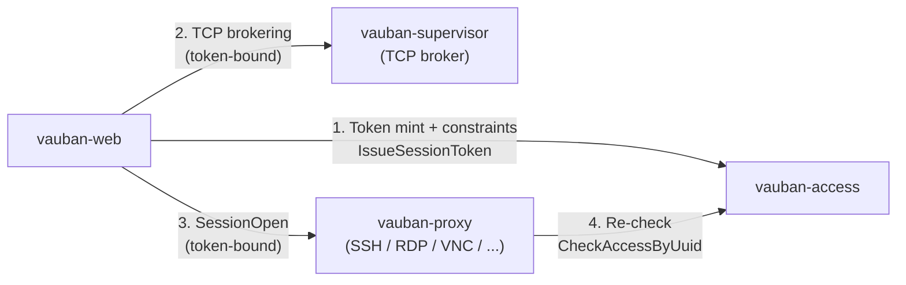
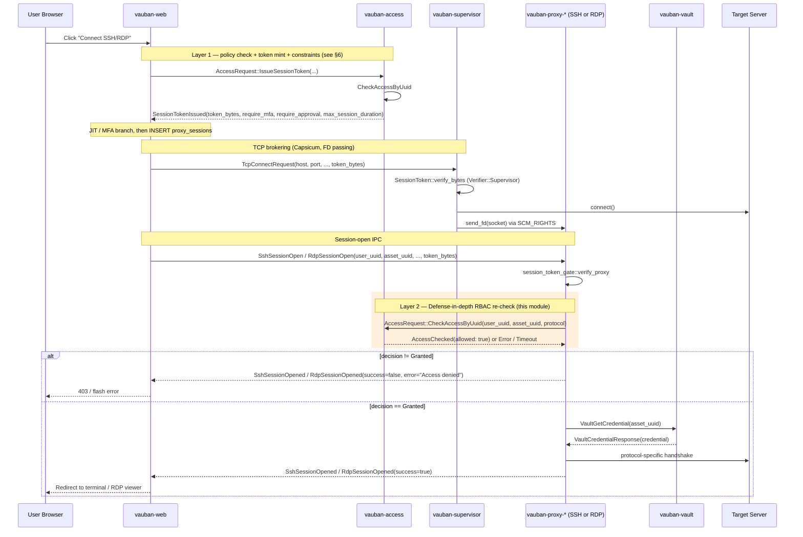
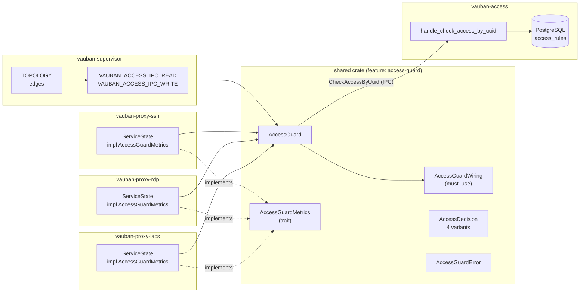
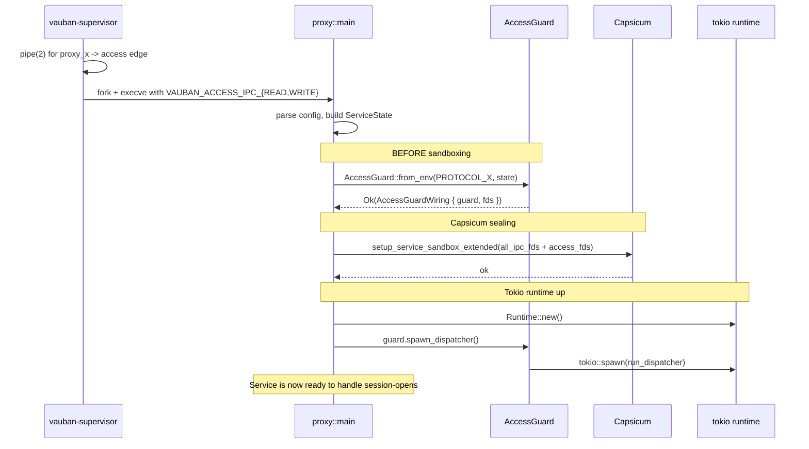
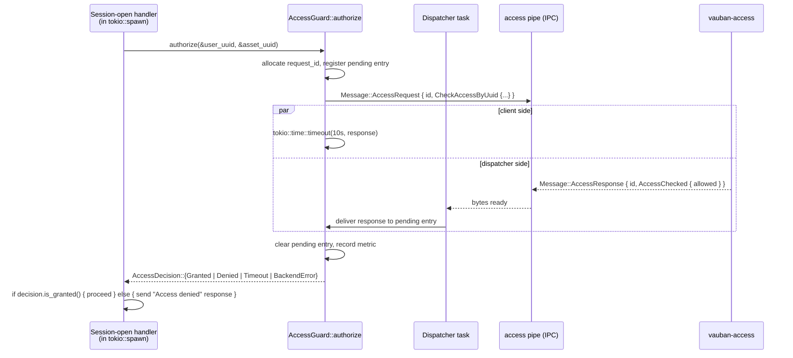
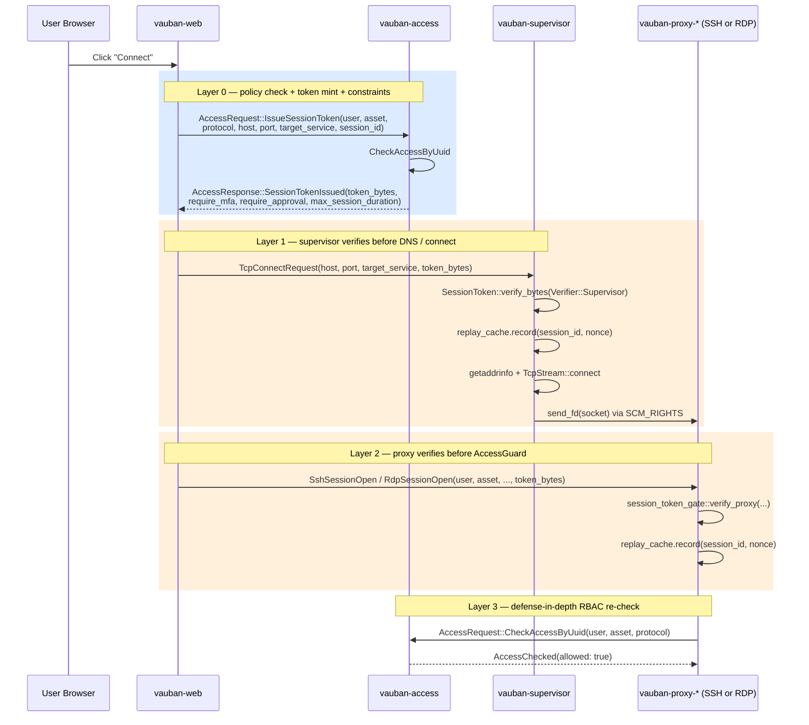
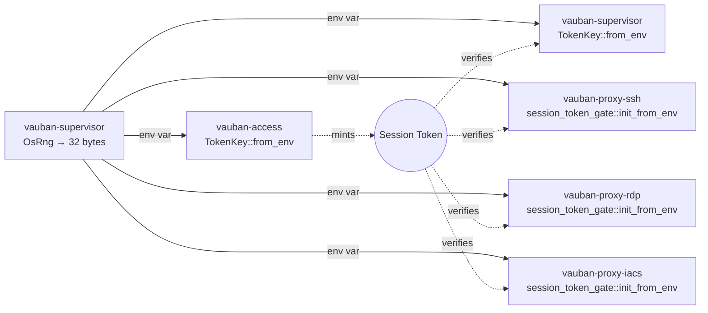

# Vauban AccessGuard Architecture

**Version:** 1.0  
**Date:** 21 April 2026  
**Author:** Richard Ben Aleya

---

## Table of Contents

1. [Introduction](#1-introduction)
2. [Architecture Overview](#2-architecture-overview)
3. [Public API](#3-public-api)
4. [Lifecycle](#4-lifecycle)
5. [Threat Model](#5-threat-model)
6. [Cryptographic Session-Token Gate](#6-cryptographic-session-token-gate)
7. [Design Notes](#7-design-notes)
8. [Adding a New Proxy](#8-adding-a-new-proxy)
9. [Observability](#9-observability)
10. [Related Documents](#10-related-documents)

---

## 1. Introduction

### 1.1 Purpose

`shared::access_guard` is the single, factorized, fail-closed gate that
every Vauban proxy (`vauban-proxy-ssh`, `vauban-proxy-rdp`, future VNC
and industrial-protocol proxies) runs against `vauban-access` before
opening an upstream session, regardless of any verdict already produced
by `vauban-web`.

It implements the **defense-in-depth RBAC re-check** layer of the IAM
authorization model. A second, complementary layer — the
**cryptographic session-token gate** described in
[§6](#6-cryptographic-session-token-gate) — closes the residual gap
that pure RBAC re-checks cannot close on their own (UUID swap from a
compromised web tier, supervisor TCP broker used as a network probe).
The two layers are designed together and ship together; this document
covers both.



SSH/RDP connect performs **two** policy evaluations against
`vauban-access` on the happy path (policy eval 3→2): one inside
`IssueSessionToken` (which also returns MFA/JIT/duration constraints
on `SessionTokenIssued`), and one proxy-side `AccessGuard` re-check.
A preceding `CheckAccessMulti` / `can_access_asset` trip is no longer
used on connect. Deploy web and access together when upgrading past
this wire shape.

A successful response from `vauban-web -> vauban-access` is **not**
sufficient: the proxy must independently re-confirm the same verdict
against the same authoritative service before it touches any upstream
network resource.

### 1.2 Why a shared module

The gate is **identical** for every proxy: same IPC envelope, same
timeout, same fail-closed semantics, same metric shape. Factoring it
into a single, feature-gated module guarantees that all proxies — current
and future — share one provably-correct implementation, instead of N
copies that drift over time. Non-proxy crates do not pay the cost of
the dependency thanks to the `access-guard` feature flag.

### 1.3 Scope

This document describes:

- The position of the gate in the request flow,
- The public API surface of `shared::access_guard` (types, signatures,
  semantics),
- The lifecycle each proxy follows (`from_env` → Capsicum →
  `spawn_dispatcher` → per-session `authorize`),
- The threat model the module defends against,
- The design choices that make fail-open configurations
  unrepresentable,
- The complementary cryptographic session-token gate
  (`shared::session_token`), its format, mint / verify flow, key
  dissemination, and the threat classes it closes that an RBAC
  re-check alone cannot.

It does NOT describe:

- Casbin policy authoring or the `access_rules` schema
  (see [IAM Architecture](Vauban_IAM_Architecture_EN(1.0).md)),
- The supervisor's pipe-creation logic
  (see [Privsep Architecture](Vauban_Privsep_Architecture_EN(1.2).md)),
- Operational triage and tuning
  (see [`docs/runbooks/ipc_topology_debugging.md`](../runbooks/ipc_topology_debugging.md)).

---

## 2. Architecture Overview

### 2.1 Position in the request flow



The orange band is the entire surface owned by `shared::access_guard`.
Everything else is unchanged from the per-protocol architecture
documents.

### 2.2 Module topology



### 2.3 How the gate is wired

The supervisor declares one TOPOLOGY edge per proxy (`proxy_x -> Access`),
creates a `pipe(2)` for each edge and exposes the raw FDs to the child
through two environment variables (`VAUBAN_ACCESS_IPC_READ` and
`VAUBAN_ACCESS_IPC_WRITE`). The proxy's `main.rs` consumes them through
`AccessGuard::from_env`, which:

- Parses both env vars (refuses to start if either is missing — the
  fail-closed boot invariant),
- Removes them from the environment so they cannot leak to children
  spawned later,
- Returns an `AccessGuardWiring { guard, fds }` whose `fds` are then
  enrolled in the Capsicum sandbox before the proxy seals itself in.

See [Privsep Architecture §3](Vauban_Privsep_Architecture_EN(1.2).md)
for the supervisor side.

---

## 3. Public API

The whole public surface lives in `shared/src/access_guard.rs`.
Anything not listed below is intentionally private.

### 3.1 Constructor — `AccessGuard::from_env`

```rust
pub fn from_env(
    protocol: &'static str,
    metrics: Arc<dyn AccessGuardMetrics>,
) -> Result<AccessGuardWiring, AccessGuardError>
```

The only documented constructor for production use. It is the **only**
function in the module that may return `Result`; failure here means the
proxy refuses to come up. The returned `AccessGuardWiring` carries the
`Arc<AccessGuard>` and the FDs that must be enrolled in Capsicum.

### 3.2 Dispatcher — `AccessGuard::spawn_dispatcher`

```rust
pub fn spawn_dispatcher(self: &Arc<Self>) -> tokio::task::JoinHandle<()>
```

Spawns the background task that demultiplexes responses arriving on the
access pipe and delivers each one to the matching pending caller, keyed
by `request_id`. Called exactly once, after the tokio runtime is up and
after Capsicum sealing.

### 3.3 Hot path — `AccessGuard::authorize`

```rust
pub async fn authorize(&self, user_uuid: &str, asset_uuid: &str)
    -> AccessDecision
```

The single entry point on the session-open hot path. Contract:

- Never blocks longer than `RBAC_RECHECK_TIMEOUT` (10 s);
- Never returns `Result` — `?` cannot accidentally propagate past the
  gate;
- Increments exactly one `AccessGuardMetrics` callback per call;
- Returns one of four `AccessDecision` variants — only `Granted` may be
  treated as authorization.

### 3.4 Verdict — `AccessDecision`

```rust
pub enum AccessDecision {
    Granted,                  // vauban-access explicitly allowed
    Denied,                   // vauban-access explicitly denied (policy)
    Timeout,                  // no response within RBAC_RECHECK_TIMEOUT
    BackendError(String),     // IPC error (broken pipe, malformed reply, ...)
}

impl AccessDecision {
    pub fn is_granted(&self) -> bool { /* matches!(self, Granted) */ }
}
```

| Variant | Caller behavior | Metric | User-facing message |
|---------|------------------|--------|---------------------|
| `Granted` | proceed with credential lookup + upstream connect | `record_granted` | terminal / RDP viewer |
| `Denied` | abort, generic "Access denied" | `record_denied` | "Access denied" |
| `Timeout` | abort, generic "Access denied" | `record_timeout` | "Access denied" |
| `BackendError(_)` | abort, generic "Access denied" | `record_ipc_error` | "Access denied" |

The user-facing message is intentionally **uniform** across the three
non-Granted variants: surfacing the distinction would let an attacker
probe service health from outside. The distinction is preserved in
metrics and logs only.

### 3.5 Metrics trait — `AccessGuardMetrics`

```rust
pub trait AccessGuardMetrics: Send + Sync + 'static {
    fn record_granted(&self);
    fn record_denied(&self);
    fn record_timeout(&self);
    fn record_ipc_error(&self);
}
```

Implemented by each proxy's `ServiceState` (typically over `AtomicU64`
counters exposed on the proxy's health endpoint). Implementations are
required to be cheap and infallible — they are called once per
`authorize` on the hot path.

### 3.6 Wiring bundle — `AccessGuardWiring`

```rust
#[must_use = "AccessGuardWiring carries the FDs and Arc that the proxy must \
              install in its sandbox and dispatcher; dropping it silently \
              would leak the access pipe FDs and disable the re-check"]
pub struct AccessGuardWiring {
    pub guard: Arc<AccessGuard>,
    pub fds:   Vec<RawFd>,
}
```

The `#[must_use]` attribute is part of the contract: dropping the
wiring would leave the access pipe unread and the dispatcher unspawned,
silently disabling the entire defense-in-depth layer.

### 3.7 Construction error — `AccessGuardError`

```rust
pub enum AccessGuardError {
    MissingEnvVar(&'static str),
    InvalidEnvVar(&'static str, String),
    Io(std::io::Error),
}
```

Construction-time only. The hot path (`authorize`) never returns a
`Result` — see §3.3.

### 3.8 Constants

```rust
pub const RBAC_RECHECK_TIMEOUT: Duration = Duration::from_secs(10);
pub const PROTOCOL_SSH: &str = "ssh";
pub const PROTOCOL_RDP: &str = "rdp";
pub const PROTOCOL_IACS_TUNNEL: &str = "iacs_tunnel";
```

`PROTOCOL_*` are the canonical strings used in `access_rules.protocols`.
Adding a new protocol means adding a `PROTOCOL_<X>` constant here, so
typos at the call site fail at compile time.

---

## 4. Lifecycle

### 4.1 Boot sequence (per proxy)



Order matters:

| # | Step | Reason |
|---|------|--------|
| 1 | `from_env` BEFORE sandbox | env access is restricted under Capsicum; the supervisor-provided FDs must be opened pre-sealing |
| 2 | sandbox enrollment of `access_wiring.fds` | otherwise the dispatcher cannot read |
| 3 | `spawn_dispatcher` AFTER tokio | the dispatcher is `tokio::spawn`'d |

### 4.2 Per-session sequence



Three exit paths — happy delivery, timeout, caller cancellation — all
funnel through the same cleanup. See §6.1.

The session-open handler runs the `authorize` call inside a
`tokio::spawn` body so the proxy's main loop is never blocked on the
re-check.

---

## 5. Threat Model

### 5.1 In scope

| Threat | Mitigation in `shared::access_guard` |
|--------|--------------------------------------|
| `vauban-web` is compromised and grants sessions it should not | Layer 2 re-check against `vauban-access` is independent and authoritative |
| `vauban-web` is buggy and skips the UI gate | Same — proxy is not a transitive trust |
| `vauban-access` is wedged or saturated | Hard 10 s timeout → `Timeout` decision (fail-closed) |
| `vauban-access` is dead / pipe broken | `BackendError` decision (fail-closed); supervisor restart is the recovery path |
| Forged `request_id` we never issued | Dispatcher logs and drops; never delivered to any caller |
| Stale reply arriving after the caller already timed out | Pending slot already cleared; reply is dropped |
| Future / unknown `AccessResponse` variant | Collapses to `Denied` (fail-closed) |
| Cross-wiring: a non-`AccessResponse` message on the access pipe | Logged and ignored; dispatcher keeps serving |
| Caller cancels `authorize` (closed tab, abort) during an outage | Pending slot cleared synchronously on drop; map size stays bounded |
| Concurrent session-opens crossing verdicts | `request_id` demultiplex via the pending map |
| Accidental fail-open via `?` on a `Result` | `authorize` returns `AccessDecision`, never `Result` |
| Accidental fail-open via `Default::default()` | `AccessDecision` has no `Default` impl |
| Operator forgets to plumb `AccessGuardWiring` | `#[must_use]` attribute → compile-time warning |
| Information disclosure (policy denial vs service down) | All non-Granted variants collapse to a single `"Access denied"` user-facing string |

### 5.2 Out of scope

| Threat | Why out of scope |
|--------|------------------|
| `vauban-supervisor` is compromised | The supervisor is the TCB; if it falls, the bastion is game over |
| Bypassing the proxy entirely (network access to target) | Network policy + firewall, not this module |
| Casbin policy bugs in `vauban-access` | Owned by `vauban-access` and its own policy tests |
| `access_rules` table is wrong (operator misconfiguration) | The module honestly reports `Denied`; UX problem upstream |
| Side-channel timing attacks on the IPC pipe | Threat model assumes the bastion processes are mutually trusted at the OS level |

### 5.3 Non-goals

- **No in-process caching.** Every `authorize` call hits
  `vauban-access`. A short-TTL cache is conceivable for a future
  release if the metric warrants it, but it must be opt-in and
  observable.
- **No retry inside `authorize`.** A single timeout with a clean
  fail-closed verdict beats opaque retry behavior. Retries are the
  caller's concern.
- **No fallback path.** If `vauban-access` is unreachable, the bastion
  refuses sessions. This is the entire point of the gate.

### 5.4 What `AccessGuard` alone does NOT defend against

The defense-in-depth re-check is necessary, but it is not
sufficient. The proxy receives `(user_uuid, asset_uuid)` from
`vauban-web` over the session-open IPC and verifies that pair against
`vauban-access`. Two attack classes survive a clean re-check verdict:

**(a) Session piggyback / UUID swap from a compromised `vauban-web`.**
The web tier resolves the user identity from a session cookie, but it
is also the tier most exposed to the network and the largest attack
surface in the bastion. A compromised `vauban-web` could send a
perfectly well-formed `SshSessionOpen { user_uuid: U_target,
asset_uuid: A_target }` for a `(U_target, A_target)` pair that
genuinely *is* allowed by Casbin policy — but for which **the live
HTTP session does not belong to `U_target`**. The proxy's RBAC
re-check answers "is `U_target` allowed on `A_target`?" with `Granted`
in good faith, because that is the only question it can ask. The
attacker has piggybacked on a valid policy edge.

**(b) Network enumeration via the supervisor's TCP broker.** The
supervisor's TCP brokering primitive (`TcpConnectRequest`) is the only
component in the privsep topology with the right to `connect(2)`
arbitrary `(host, port)` tuples — the proxies are sealed under
Capsicum and cannot reach the network themselves. If `vauban-web` is
compromised, the broker becomes an unauthenticated network probe
inside the trusted side of the bastion: the attacker can iterate over
internal address space and discover live hosts long before any
`AccessGuard` check is reached, because brokering happens *before* the
session-open IPC the proxy validates.

Both classes share the same root cause: the messages crossing the
internal IPC boundary carry **only declarative identifiers**, with no
proof that the corresponding `(user, asset, host, port, protocol)`
tuple was actually approved by `vauban-access` for *this specific*
session opening. The cryptographic session-token gate described in
[§6](#6-cryptographic-session-token-gate) closes that gap by attaching
a short-lived, MAC-bound proof of authorization to every brokered
connection and every session-open IPC. With the token in place, both
the supervisor's TCP broker and the proxy's `AccessGuard` are
re-anchored on the same authoritative decision made by
`vauban-access`, and neither can be tricked by a compromised
`vauban-web` into acting on declarative identifiers alone.

---

## 6. Cryptographic Session-Token Gate

### 6.1 Purpose and complementarity with `AccessGuard`

`AccessGuard` answers the policy question: *is this `(user, asset,
protocol)` triple allowed?* It does so authoritatively by querying
`vauban-access`. What it cannot answer — by construction, because the
proxy only sees the IPC payload from `vauban-web` — is the *binding*
question: *does this specific session opening correspond to a real,
unrevoked, in-flight authorization that `vauban-access` actually
issued for the live HTTP session, against the exact target the
supervisor is being asked to broker?*

The cryptographic session-token gate adds that missing binding. It is
**not** a replacement for `AccessGuard`; it is a complementary layer
that:

- proves to the supervisor's TCP broker that the requested `(host,
  port, protocol, target_service)` tuple was just blessed by
  `vauban-access` for a specific session,
- proves to the proxy that the `(user_uuid, asset_uuid, protocol)`
  triple it is about to RBAC-re-check was issued by `vauban-access`
  for a specific session, before `AccessGuard` even touches the IPC
  pipe,
- collapses fail-closed in the same way as `AccessGuard` (single,
  uniform `"Access denied"` user-facing string).

### 6.2 Token format

A session token is a fixed-layout, deterministic byte sequence
authenticated with a BLAKE3 keyed MAC over its full body. The
client-side payload (browser, web tier) never sees or handles tokens —
they are minted, transported, and verified entirely between trusted
backend services.

| Field | Width | Role |
|-------|-------|------|
| `version` | 1 byte | Wire-format version. Mismatched versions fail-closed. |
| `session_id` | length-prefixed `&str` | Logical session identifier (HTTP session for user-initiated sessions; synthetic `fetch-hostkey-{request_id}` for the host-key fetch path). Used as the anti-replay key. |
| `user_uuid` | length-prefixed `&str` | The principal `vauban-access` authorized. |
| `asset_uuid` | length-prefixed `&str` | The asset `vauban-access` authorized. |
| `protocol` | length-prefixed `&str` | One of `PROTOCOL_*`. |
| `host` | length-prefixed `&str` | The exact destination the supervisor is asked to dial. |
| `port` | 2 bytes | The exact destination port. |
| `target_service` | 1 byte discriminant | The service the supervisor must hand the FD to. Same `Service` enum as IPC topology; `Service::Mailer` is discriminant **9** (sealed SMTP leaf -- not an AccessGuard consumer; listed so operators do not reuse Web for SMTP broker gates). |
| `issued_at` | 8 bytes | Mint timestamp (Unix seconds). |
| `expires_at` | 8 bytes | `issued_at + TOKEN_TTL_SECONDS` (short, single-digit minutes). |
| `nonce` | `NONCE_LENGTH` bytes | `OsRng`-generated; (`session_id`, `nonce`) is the anti-replay key. |
| `mac` | `MAC_LENGTH` bytes | BLAKE3 keyed MAC over the deterministic encoding of all preceding fields. |

The MAC is computed with a domain-separated input prefix to prevent
any cross-protocol collision with other BLAKE3 use sites.

### 6.3 Verifier roles

Different verification points must enforce different field bindings,
because a compromised `vauban-web` can lie about *different* facts
depending on which IPC it tampers with:

| Verifier | Bound fields (in addition to MAC + freshness + anti-replay) |
|----------|--------------------------------------------------------------|
| `Verifier::Supervisor` | `host`, `port`, `protocol`, `target_service`, `session_id` — the broker only knows where it is being asked to connect. |
| `Verifier::Proxy` | `user_uuid`, `asset_uuid`, `protocol`, `session_id` — the proxy only knows the principal/asset pair the session-open claims. |

Splitting the verifier role this way is itself a defense: even if the
attacker controls one IPC, the field they would need to forge is
checked at a *different* hop where they have no leverage.

### 6.4 Mint / verify flow



Layer 0 (mint) is gated by the same Casbin policy as `AccessGuard`'s
re-check. It is the **only** web→access policy trip on SSH/RDP connect
(policy eval 3→2): constraints for MFA/JIT/duration travel on
`SessionTokenIssued` so a preceding `CheckAccessMulti` is unnecessary.
Layers 1 and 2 each re-anchor a different boundary on that single mint
decision; Layer 3 (`AccessGuard`) remains in place as the
authoritative re-check on the policy itself.

### 6.5 Key dissemination

The MAC key is 32 bytes of `OsRng` material, generated once by
`vauban-supervisor` at boot and published to the five services that
need it (`vauban-supervisor` itself, `vauban-access`, `vauban-proxy-ssh`,
`vauban-proxy-rdp`, `vauban-proxy-iacs`) through the
`VAUBAN_SESSION_TOKEN_KEY_*` environment variables, exactly like the
existing `VAUBAN_ACCESS_IPC_*` channel.



The same boot-order invariant as `AccessGuard` applies: each consumer
calls `TokenKey::from_env` (or its proxy wrapper
`shared::session_token::proxy_gate::init_from_env`) **before**
Capsicum sealing, because reading and clearing the env var is
impossible once the process is in capability mode. `vauban-web`
deliberately does **not** hold the key — it cannot mint, only request
mints from `vauban-access`.

For the same reason `AccessGuard` is a single shared module, the
proxy-side cryptographic gate is factorized into
`shared::session_token::proxy_gate` and consumed verbatim by
`vauban-proxy-ssh`, `vauban-proxy-rdp`, and any future protocol
proxy. Anti-regression structural tests in each proxy assert that no
private re-implementation may sneak back in.

### 6.6 Anti-replay

Each verifier (supervisor, SSH proxy, RDP proxy) maintains a private,
in-memory LRU cache of recently seen `(session_id, nonce)` pairs,
bounded by `MAX_ENTRIES` (4096) and aged out by token TTL plus a
small clock-skew tolerance. The first verification of a token records
the pair; any subsequent verification with the same pair fails-closed.
The cache implementation lives in `shared::session_token::replay_cache`
and is consumed identically by the supervisor (mounted directly) and
by the proxies (mounted indirectly through
`shared::session_token::proxy_gate`).

Replay caches are deliberately **per-process and not shared**: cross-
service replay is already prevented by the verifier role splitting
fields differently (a token replayed at the SSH proxy after being
consumed at the supervisor still encodes a `host`/`port` the proxy
does not check, and vice versa). Sharing a cache across services would
add coupling without security benefit.

### 6.7 Threat model — what the token gate adds

The crypto gate composes with `AccessGuard` to defend against the
attack classes called out in [§5.4](#54-what-accessguard-alone-does-not-defend-against):

| Threat | Mitigation |
|--------|------------|
| Compromised `vauban-web` opens sessions on behalf of arbitrary users with valid policy edges (UUID swap) | Proxy `Verifier::Proxy` rejects any `(user_uuid, asset_uuid, session_id)` triple not blessed by `vauban-access` for this session |
| Compromised `vauban-web` uses the supervisor's TCP broker as an unauthenticated network probe | Supervisor `Verifier::Supervisor` rejects any `(host, port, target_service, session_id)` tuple not blessed by `vauban-access` for this session |
| Replayed legitimate token (recording + replaying a captured IPC) | Per-verifier LRU cache keyed by `(session_id, nonce)` |
| Stale token (long-running compromise of the IPC path) | `expires_at` fail-closed comparison with `CLOCK_SKEW_TOLERANCE_SECONDS` budget |
| Cross-protocol token confusion (an SSH-issued token replayed at the RDP proxy) | `protocol` field is bound by both verifier roles |
| Cross-target token confusion (a token for `host_a:22` replayed at `host_b:22`) | `host`, `port`, `target_service` are bound by `Verifier::Supervisor` |
| Cross-MAC confusion (BLAKE3 used elsewhere in the codebase) | Domain-separated MAC input prefix |
| Forged token without the key | BLAKE3 keyed MAC over deterministic encoding; constant-time comparison |
| Token theft via env var leak to a child process | `from_env` clears the env var after parsing, exactly like `AccessGuard` |
| Token minting from a compromised non-`vauban-access` service | Only `vauban-access` holds the key for minting; supervisor and proxies hold it solely to verify |
| Host-key fetch path bypassing the gate | `fetch_host_key` mints its own short-lived token under a synthetic `fetch-hostkey-{request_id}` session id and threads it through the broker |

Argued in detail:

- **UUID swap closure.** Without the token, a compromised `vauban-web`
  needs only to know two valid UUIDs and a valid policy edge between
  them to ride the proxy's `AccessGuard` `Granted` verdict and open a
  shell as any user. With the token, that same payload now requires a
  *fresh*, *MAC-bound* attestation that `vauban-access` agreed to mint
  for those exact UUIDs in the context of the live session — which a
  compromised `vauban-web` cannot produce. The blast radius of a web
  compromise drops from "any policy edge in the system" to "only what
  `vauban-access` would approve for the user `vauban-web` is logged in
  as".

- **Broker-as-probe closure.** Without the token, the supervisor's TCP
  broker is the only network primitive on the trusted side and accepts
  any `(host, port)` from `vauban-web`. With the token, the broker
  refuses to dial anything `vauban-access` did not pre-approve,
  closing the lateral-movement reconnaissance path that previously
  existed inside the bastion's own privsep boundary.

- **Replay closure.** The combination of short TTL, MAC over a
  random nonce, and per-verifier LRU cache means that an attacker who
  records a legitimate session-open IPC cannot re-use it to open a
  second session, even within the TTL window.

- **Defense-in-defense.** A failure mode of any single layer
  (`AccessGuard` mis-wired, broker bug, web compromise) does not
  collapse the other two. The three layers (token mint, token verify,
  RBAC re-check) all answer the same authoritative question and must
  all agree before an upstream socket is touched.

What the gate explicitly does **not** defend against is unchanged
from §5.2: a compromised `vauban-supervisor` (the TCB), a compromised
`vauban-access` (the only minter), or a compromised target server.

---

## 7. Design Notes

### 7.1 Pending-map cleanup (RAII)

The dispatcher and the caller race for the same pending entry: the
dispatcher removes it when a response arrives; the caller removes it
when the future is dropped (timeout, cancellation, error). Both paths
must always clear the slot, otherwise a sustained `vauban-access`
outage combined with steady traffic would grow the pending map without
bound.

The module enforces this with an internal RAII guard that owns the
removal in its `Drop` impl. The dispatcher's removal is idempotent: if
it wins the race it removes the entry, and the RAII drop becomes a
no-op; if it loses (timeout / cancel) the RAII drop performs the
removal. The pending map is therefore strictly bounded by the number of
in-flight requests at any instant, regardless of failure mode.

### 7.2 Choice of `std::sync::Mutex` for the pending map

The pending map is wrapped in `std::sync::Mutex`, not `tokio::sync::Mutex`,
for two reasons:

1. The RAII cleanup runs from `Drop` and cannot `.await`, so an async
   mutex is unusable there.
2. Critical sections are O(1) HashMap operations with no `.await` held
   inside, so the synchronous lock is acceptable for the executor.

Lock sites tolerate poisoning (`unwrap_or_else(|p| p.into_inner())`):
poisoning only signals that another thread panicked while holding the
lock; the inner `HashMap` is still valid, and turning poisoning into a
permanent denial-for-everyone would reduce availability without
improving security.

### 7.3 Virtual "All assets" group resolution

`AccessGuard` is the proxy-side re-check for a per-(user, asset, protocol)
verdict. The decision it receives from `vauban-access` covers every
matching `access_rules` row, including rows that target the
**virtual "All assets" group** — a system-managed singleton in
`asset_groups` (`kind = 'all'`, reserved UUID
`00000000-0000-0000-0000-000000000a11`) whose membership is dynamic
rather than recorded in `asset_asset_groups`.

The shape of the decision does not change; the resolution path
upstream of `AccessGuard` does:

| Property | Behaviour |
|----------|-----------|
| **Dynamic property** | The virtual group resolves at decision time to `SELECT id FROM assets WHERE is_deleted = false`; an asset created after a virtual rule is still covered on the next `CheckAccessByUuid`. |
| **Soft-delete eviction** | Soft-deleted assets are excluded from the resolution set (same `is_deleted` filter as static-rule resolution). |
| **Protocol filter** | The rule's `allowed_protocols` is honoured exactly as for static rules: a virtual rule with `allowed_protocols = ['ssh']` does NOT grant RDP. |
| **OR-aggregation across overlapping rules** | When a virtual rule overlaps a static rule on the same asset, the verdict's `require_mfa`, `require_approval`, and `allowed` flags are OR-aggregated. The conservative bit wins: an MFA-required static rule cannot be undermined by a no-MFA virtual rule. |
| **`min` aggregation on session duration** | `max_session_duration` is the per-rule cap; the per-asset cap is the **minimum** across all matching rules (virtual + static). Tightest cap wins. |
| **Inactivity / time bounds** | `is_active = false` and `valid_until < now()` exclude the virtual rule from the candidate set, identically to static rules. |

The upshot for `AccessGuard`: every property the gate already enforces
for static rules (fail-closed on absence of a rule, fail-closed on the
denied verdict, defense-in-depth re-check) applies unchanged when the
verdict was produced via a virtual rule. The Tier 3 policy-resolution
suite asserts this parity end-to-end (`p30_accessguard_parity_for_virtual_rule`,
`p31_accessguard_denies_wrong_protocol_on_virtual_rule`) for both SSH
and RDP proxies.

### 7.4 Type-system invariants

The module leans on Rust's type system to make fail-open configurations
either unrepresentable or unattainable through casual refactors:

| Invariant | How it is enforced |
|-----------|---------------------|
| `authorize` cannot accidentally fail-open via `?` | Returns `AccessDecision`, not `Result<_, _>`; the `?` operator does not apply |
| No silent `Default` verdict | `AccessDecision` deliberately has no `Default` impl; every construction site must pick a variant explicitly |
| Wiring cannot be silently dropped | `AccessGuardWiring` is `#[must_use]` with a non-trivial message |
| Protocol typos cannot reach runtime | `PROTOCOL_SSH` / `PROTOCOL_RDP` are `&'static str` constants; a typo at the call site is a compile error |
| Boot cannot silently fall back to fail-open | `AccessGuard::from_env` returns `Result`; both proxies' `main.rs` end with `.expect(...)`. There is no path that turns a `MissingEnvVar` into a running proxy |

---

## 8. Adding a New Proxy

The cookbook for a new protocol (VNC, Modbus, OPC-UA, …) re-uses the
shared module verbatim — an in-crate RBAC client must not be
re-implemented.

### 8.1 Supervisor

In `vauban-supervisor`, declare a TOPOLOGY edge
`Service::ProxyVnc -> Service::Access`. The supervisor will create the
pipe and export `VAUBAN_ACCESS_IPC_READ` / `VAUBAN_ACCESS_IPC_WRITE` to
the new proxy.

### 8.2 vauban-access

Bind the new peer in `vauban-access::run_service`, bump the expected
peer count for the boot-time topology check, and update the
corresponding structural test
(`test_access_main_binds_all_topology_incoming_peers`).

### 8.3 shared crate

Add the canonical protocol constant:

```rust
pub const PROTOCOL_VNC: &str = "vnc";
```

The string must match `access_rules.protocols` in the database. The
existing protocol-constant tests pin the casing and the DB-string
mapping.

### 8.4 Proxy crate

The proxy:

1. Declares `shared = { path = "../shared", features = ["access-guard", "session-token"] }`.
2. Implements `AccessGuardMetrics` on its own `ServiceState`.
3. Brings the shared cryptographic gate into scope:
   `use shared::session_token::proxy_gate as session_token_gate;`
4. Calls `session_token_gate::init_from_env()` **before** Capsicum
   sealing (loads the BLAKE3 MAC key and prepares the per-proxy
   anti-replay cache).
5. Calls `AccessGuard::from_env(PROTOCOL_VNC, state)` **before**
   Capsicum sealing.
6. Enrolls `access_wiring.fds` in the Capsicum sandbox.
7. Calls `access_guard.spawn_dispatcher()` after the tokio runtime is
   up.
8. In its session-open handler, calls
   `session_token_gate::verify_proxy(&token, &user, &asset, PROTOCOL_VNC, &session_id)`
   first, fail-closes on `false`, then runs `authorize` inside a
   `tokio::spawn` body and treats anything other than
   `AccessDecision::Granted` as `"Access denied"`.

The new proxy adds **zero** lines of crypto code — every byte of the
gate lives in `shared`. `vauban-proxy-rdp/src/main.rs` is the
canonical reference implementation for steps 2–8.

### 8.5 Runbook update

Bump the expected peer count in
[`docs/runbooks/ipc_topology_debugging.md`](../runbooks/ipc_topology_debugging.md)
and add the new proxy to its symptoms table.

---

## 9. Observability

### 9.1 Metrics

Each proxy's `ServiceState` exposes the four counters routed by
`AccessGuardMetrics` through its existing health endpoint:

| Counter | Meaning |
|---------|---------|
| `access_granted` | `record_granted` calls |
| `access_denied`  | `record_denied` calls (policy denial) |
| `rbac_recheck_timeouts` | `record_timeout` calls (`vauban-access` silent for 10 s) |
| `access_ipc_errors` | `record_ipc_error` calls (pipe / parse failures) |

The relative balance of these counters is the primary health signal of
the gate; absolute values are meaningful only relative to total session
attempts.

### 9.2 Logs

`AccessGuard` log lines are structured and prefixed with the protocol:

```
INFO   protocol="ssh"  AccessGuard dispatcher started
DEBUG  protocol="ssh" user_uuid=… asset_uuid=…  AccessGuard granted
WARN   protocol="rdp" user_uuid=… asset_uuid=…  AccessGuard denied (policy)
ERROR  protocol="ssh" timeout_secs=10           AccessGuard timeout - denying fail-closed
ERROR  protocol="rdp" error="…"                 AccessGuard IPC error - denying fail-closed
```

### 9.3 Boot-time signals

On startup, every proxy logs:

```
INFO  AccessGuard initialised (defense-in-depth RBAC re-check)
INFO  AccessGuard dispatcher started   protocol="ssh"
```

`vauban-access` logs the peer set it has bound:

```
INFO  vauban-access ready  peers=["web", "auth", "proxy_ssh", "proxy_rdp", "proxy_iacs"]  peer_count=5
```

If the peer count does not match the supervisor topology, `vauban-access`
refuses to come up. This is the most important boot-time invariant — it
guarantees the gate is wired before any traffic is served. Triage steps
live in the
[`ipc_topology_debugging.md`](../runbooks/ipc_topology_debugging.md)
runbook.

---

## 10. Related Documents

### 10.1 Internal

- [`Vauban_IAM_Architecture_EN(1.0).md`](Vauban_IAM_Architecture_EN(1.0).md)
  — IAM model (Casbin RBAC + instance-level access rules) enforced by
  `vauban-access`.
- [`Vauban_Privsep_Architecture_EN(1.2).md`](Vauban_Privsep_Architecture_EN(1.2).md)
  — supervisor topology, pipe creation, Capsicum sandboxing, IPC
  protocol.
- [`Vauban_RDP_Architecture_EN(1.0).md`](Vauban_RDP_Architecture_EN(1.0).md)
  — RDP session lifecycle, including the AccessGuard re-check.
- [`docs/runbooks/ipc_topology_debugging.md`](../runbooks/ipc_topology_debugging.md)
  — operational runbook for the topology / RBAC re-check failure mode.
- [`Vauban_IAM_Architecture_EN(1.0).md` §15.9](Vauban_IAM_Architecture_EN(1.0).md#159-approval-audit--separation-of-duties)
  — JIT approval audit and separation-of-duties model (T1–T9 threat
  catalog, append-only log, mono-admin handling).
- [`docs/runbooks/approval_audit.md`](../runbooks/approval_audit.md)
  — operator queries against `approval_audit_log` (per-actor /
  per-requester / per-asset windows, CSV export, mono-admin recovery).

### 10.2 Source of truth

- `shared/src/access_guard.rs` — module + tests
- `shared/src/session_token/mod.rs` — `SessionToken`, `TokenKey`,
  `Verifier`, `TokenError` (wire-format primitives + tier-1 unit tests)
- `shared/src/session_token/replay_cache.rs` — bounded, TTL-aware
  anti-replay LRU shared by every verifier (supervisor + proxies)
- `shared/src/session_token/proxy_gate.rs` — single, factorized
  proxy-boundary gate (`init_from_env`, `verify_proxy`) consumed
  verbatim by every protocol proxy
- `shared/Cargo.toml` — `access-guard` and `session-token` feature flags
- `vauban-proxy-ssh/src/main.rs`, `vauban-proxy-rdp/src/main.rs`,
  `vauban-proxy-iacs/src/main.rs` — consumers (both gates) via
  `use shared::session_token::proxy_gate as session_token_gate`
- `vauban-access/src/handlers.rs::handle_check_access_by_uuid` —
  authoritative server-side handler
- `vauban-access/src/handlers.rs::handle_issue_session_token` — token
  minter
- `vauban-supervisor/src/main.rs::TOPOLOGY` — edge declarations
- `vauban-supervisor/src/main.rs::handle_tcp_connect_request` —
  supervisor-side token verification before DNS / connect (uses
  `shared::session_token::replay_cache::ReplayCache`)
- `vauban-web/src/ipc/access.rs::issue_session_token` — web-tier mint
  request

---
