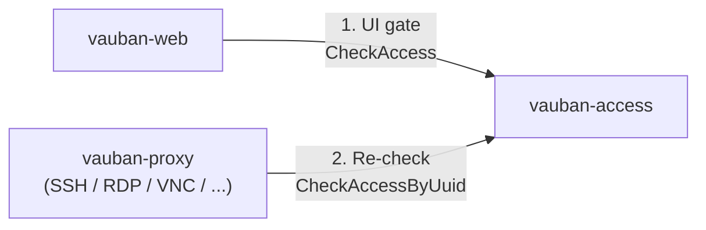
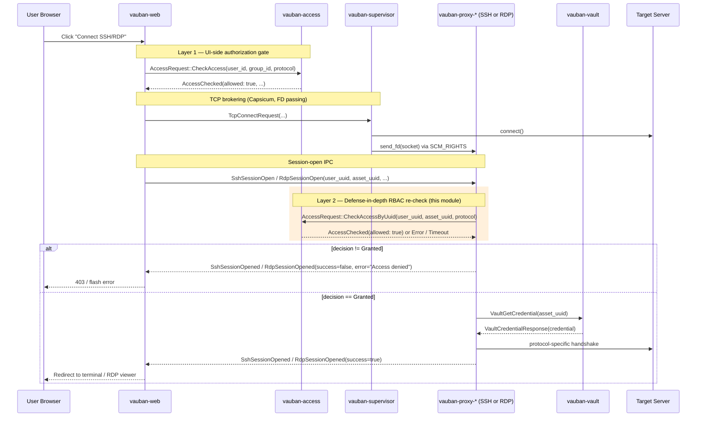
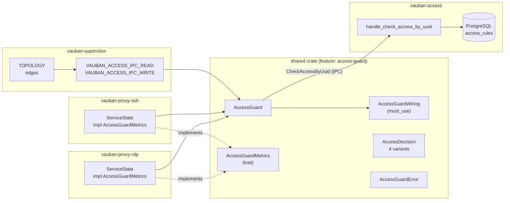
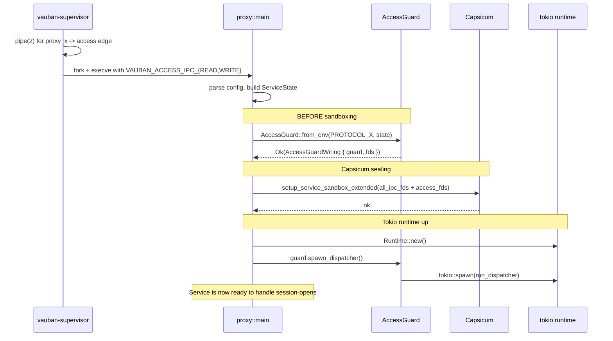
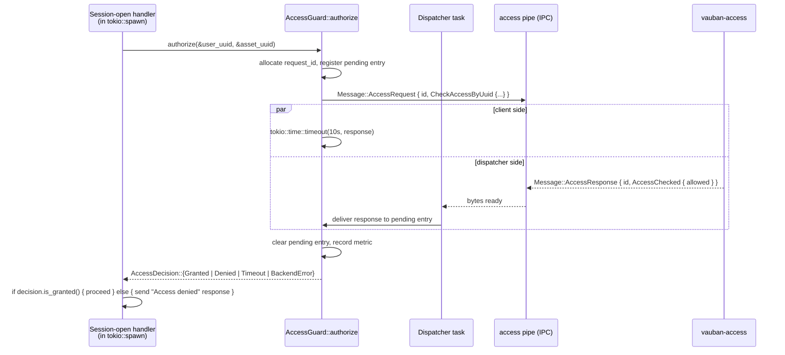

# Vauban AccessGuard Architecture

**Version:** 1.0  
**Date:** 21 April 2026  
**Author:** Richard Ben Aleya

---

## Table of Contents

1. [Introduction](#1-introduction)
2. [Architecture Overview](#2-architecture-overview)
3. [Public API](#3-public-api)
4. [Lifecycle](#4-lifecycle)
5. [Threat Model](#5-threat-model)
6. [Design Notes](#6-design-notes)
7. [Adding a New Proxy](#7-adding-a-new-proxy)
8. [Observability](#8-observability)
9. [Related Documents](#9-related-documents)

---

## 1. Introduction

### 1.1 Purpose

`shared::access_guard` is the single, factorised, fail-closed gate that
every Vauban proxy (`vauban-proxy-ssh`, `vauban-proxy-rdp`, future VNC
and industrial-protocol proxies) runs against `vauban-access` before
opening an upstream session, regardless of any verdict already produced
by `vauban-web`.

It implements the **defense-in-depth RBAC re-check** layer of the IAM
authorisation model:



A successful response from `vauban-web -> vauban-access` is **not**
sufficient: the proxy must independently re-confirm the same verdict
against the same authoritative service before it touches any upstream
network resource.

### 1.2 Why a shared module

The gate is **identical** for every proxy: same IPC envelope, same
timeout, same fail-closed semantics, same metric shape. Factoring it
into a single, feature-gated module guarantees that all proxies — current
and future — share one provably-correct implementation, instead of N
copies that drift over time. Non-proxy crates do not pay the cost of
the dependency thanks to the `access-guard` feature flag.

### 1.3 Scope

This document describes:

- The position of the gate in the request flow,
- The public API surface of `shared::access_guard` (types, signatures,
  semantics),
- The lifecycle each proxy follows (`from_env` → Capsicum →
  `spawn_dispatcher` → per-session `authorize`),
- The threat model the module defends against,
- The design choices that make fail-open configurations
  unrepresentable.

It does NOT describe:

- Casbin policy authoring or the `access_rules` schema
  (see [IAM Architecture](Vauban_IAM_Architecture_EN(1.0).md)),
- The supervisor's pipe-creation logic
  (see [Privsep Architecture](Vauban_Privsep_Architecture_EN(1.2).md)),
- Operational triage and tuning
  (see [`docs/runbooks/ipc_topology_debugging.md`](../runbooks/ipc_topology_debugging.md)).

---

## 2. Architecture Overview

### 2.1 Position in the request flow



The orange band is the entire surface owned by `shared::access_guard`.
Everything else is unchanged from the per-protocol architecture
documents.

### 2.2 Module topology



### 2.3 How the gate is wired

The supervisor declares one TOPOLOGY edge per proxy (`proxy_x -> Access`),
creates a `pipe(2)` for each edge and exposes the raw FDs to the child
through two environment variables (`VAUBAN_ACCESS_IPC_READ` and
`VAUBAN_ACCESS_IPC_WRITE`). The proxy's `main.rs` consumes them through
`AccessGuard::from_env`, which:

- Parses both env vars (refuses to start if either is missing — the
  fail-closed boot invariant),
- Removes them from the environment so they cannot leak to children
  spawned later,
- Returns an `AccessGuardWiring { guard, fds }` whose `fds` are then
  enrolled in the Capsicum sandbox before the proxy seals itself in.

See [Privsep Architecture §3](Vauban_Privsep_Architecture_EN(1.2).md)
for the supervisor side.

---

## 3. Public API

The whole public surface lives in `shared/src/access_guard.rs`.
Anything not listed below is intentionally private.

### 3.1 Constructor — `AccessGuard::from_env`

```rust
pub fn from_env(
    protocol: &'static str,
    metrics: Arc<dyn AccessGuardMetrics>,
) -> Result<AccessGuardWiring, AccessGuardError>
```

The only documented constructor for production use. It is the **only**
function in the module that may return `Result`; failure here means the
proxy refuses to come up. The returned `AccessGuardWiring` carries the
`Arc<AccessGuard>` and the FDs that must be enrolled in Capsicum.

### 3.2 Dispatcher — `AccessGuard::spawn_dispatcher`

```rust
pub fn spawn_dispatcher(self: &Arc<Self>) -> tokio::task::JoinHandle<()>
```

Spawns the background task that demultiplexes responses arriving on the
access pipe and delivers each one to the matching pending caller, keyed
by `request_id`. Called exactly once, after the tokio runtime is up and
after Capsicum sealing.

### 3.3 Hot path — `AccessGuard::authorize`

```rust
pub async fn authorize(&self, user_uuid: &str, asset_uuid: &str)
    -> AccessDecision
```

The single entry point on the session-open hot path. Contract:

- Never blocks longer than `RBAC_RECHECK_TIMEOUT` (10 s);
- Never returns `Result` — `?` cannot accidentally propagate past the
  gate;
- Increments exactly one `AccessGuardMetrics` callback per call;
- Returns one of four `AccessDecision` variants — only `Granted` may be
  treated as authorisation.

### 3.4 Verdict — `AccessDecision`

```rust
pub enum AccessDecision {
    Granted,                  // vauban-access explicitly allowed
    Denied,                   // vauban-access explicitly denied (policy)
    Timeout,                  // no response within RBAC_RECHECK_TIMEOUT
    BackendError(String),     // IPC error (broken pipe, malformed reply, ...)
}

impl AccessDecision {
    pub fn is_granted(&self) -> bool { /* matches!(self, Granted) */ }
}
```

| Variant | Caller behaviour | Metric | User-facing message |
|---------|------------------|--------|---------------------|
| `Granted` | proceed with credential lookup + upstream connect | `record_granted` | terminal / RDP viewer |
| `Denied` | abort, generic "Access denied" | `record_denied` | "Access denied" |
| `Timeout` | abort, generic "Access denied" | `record_timeout` | "Access denied" |
| `BackendError(_)` | abort, generic "Access denied" | `record_ipc_error` | "Access denied" |

The user-facing message is intentionally **uniform** across the three
non-Granted variants: surfacing the distinction would let an attacker
probe service health from outside. The distinction is preserved in
metrics and logs only.

### 3.5 Metrics trait — `AccessGuardMetrics`

```rust
pub trait AccessGuardMetrics: Send + Sync + 'static {
    fn record_granted(&self);
    fn record_denied(&self);
    fn record_timeout(&self);
    fn record_ipc_error(&self);
}
```

Implemented by each proxy's `ServiceState` (typically over `AtomicU64`
counters exposed on the proxy's health endpoint). Implementations are
required to be cheap and infallible — they are called once per
`authorize` on the hot path.

### 3.6 Wiring bundle — `AccessGuardWiring`

```rust
#[must_use = "AccessGuardWiring carries the FDs and Arc that the proxy must \
              install in its sandbox and dispatcher; dropping it silently \
              would leak the access pipe FDs and disable the re-check"]
pub struct AccessGuardWiring {
    pub guard: Arc<AccessGuard>,
    pub fds:   Vec<RawFd>,
}
```

The `#[must_use]` attribute is part of the contract: dropping the
wiring would leave the access pipe unread and the dispatcher unspawned,
silently disabling the entire defense-in-depth layer.

### 3.7 Construction error — `AccessGuardError`

```rust
pub enum AccessGuardError {
    MissingEnvVar(&'static str),
    InvalidEnvVar(&'static str, String),
    Io(std::io::Error),
}
```

Construction-time only. The hot path (`authorize`) never returns a
`Result` — see §3.3.

### 3.8 Constants

```rust
pub const RBAC_RECHECK_TIMEOUT: Duration = Duration::from_secs(10);
pub const PROTOCOL_SSH: &str = "ssh";
pub const PROTOCOL_RDP: &str = "rdp";
```

`PROTOCOL_*` are the canonical strings used in `access_rules.protocols`.
Adding a new protocol means adding a `PROTOCOL_<X>` constant here, so
typos at the call site fail at compile time.

---

## 4. Lifecycle

### 4.1 Boot sequence (per proxy)



Order matters:

| # | Step | Reason |
|---|------|--------|
| 1 | `from_env` BEFORE sandbox | env access is restricted under Capsicum; the supervisor-provided FDs must be opened pre-sealing |
| 2 | sandbox enrolment of `access_wiring.fds` | otherwise the dispatcher cannot read |
| 3 | `spawn_dispatcher` AFTER tokio | the dispatcher is `tokio::spawn`'d |

### 4.2 Per-session sequence



Three exit paths — happy delivery, timeout, caller cancellation — all
funnel through the same cleanup. See §6.1.

The session-open handler runs the `authorize` call inside a
`tokio::spawn` body so the proxy's main loop is never blocked on the
re-check.

---

## 5. Threat Model

### 5.1 In scope

| Threat | Mitigation in `shared::access_guard` |
|--------|--------------------------------------|
| `vauban-web` is compromised and grants sessions it should not | Layer 2 re-check against `vauban-access` is independent and authoritative |
| `vauban-web` is buggy and skips the UI gate | Same — proxy is not a transitive trust |
| `vauban-access` is wedged or saturated | Hard 10 s timeout → `Timeout` decision (fail-closed) |
| `vauban-access` is dead / pipe broken | `BackendError` decision (fail-closed); supervisor restart is the recovery path |
| Forged `request_id` we never issued | Dispatcher logs and drops; never delivered to any caller |
| Stale reply arriving after the caller already timed out | Pending slot already cleared; reply is dropped |
| Future / unknown `AccessResponse` variant | Collapses to `Denied` (fail-closed) |
| Cross-wiring: a non-`AccessResponse` message on the access pipe | Logged and ignored; dispatcher keeps serving |
| Caller cancels `authorize` (closed tab, abort) during an outage | Pending slot cleared synchronously on drop; map size stays bounded |
| Concurrent session-opens crossing verdicts | `request_id` demultiplex via the pending map |
| Accidental fail-open via `?` on a `Result` | `authorize` returns `AccessDecision`, never `Result` |
| Accidental fail-open via `Default::default()` | `AccessDecision` has no `Default` impl |
| Operator forgets to plumb `AccessGuardWiring` | `#[must_use]` attribute → compile-time warning |
| Information disclosure (policy denial vs service down) | All non-Granted variants collapse to a single `"Access denied"` user-facing string |

### 5.2 Out of scope

| Threat | Why out of scope |
|--------|------------------|
| `vauban-supervisor` is compromised | The supervisor is the TCB; if it falls, the bastion is game over |
| Bypassing the proxy entirely (network access to target) | Network policy + firewall, not this module |
| Casbin policy bugs in `vauban-access` | Owned by `vauban-access` and its own policy tests |
| `access_rules` table is wrong (operator misconfiguration) | The module honestly reports `Denied`; UX problem upstream |
| Side-channel timing attacks on the IPC pipe | Threat model assumes the bastion processes are mutually trusted at the OS level |

### 5.3 Non-goals

- **No in-process caching.** Every `authorize` call hits
  `vauban-access`. A short-TTL cache is conceivable for a future
  release if the metric warrants it, but it must be opt-in and
  observable.
- **No retry inside `authorize`.** A single timeout with a clean
  fail-closed verdict beats opaque retry behaviour. Retries are the
  caller's concern.
- **No fallback path.** If `vauban-access` is unreachable, the bastion
  refuses sessions. This is the entire point of the gate.

---

## 6. Design Notes

### 6.1 Pending-map cleanup (RAII)

The dispatcher and the caller race for the same pending entry: the
dispatcher removes it when a response arrives; the caller removes it
when the future is dropped (timeout, cancellation, error). Both paths
must always clear the slot, otherwise a sustained `vauban-access`
outage combined with steady traffic would grow the pending map without
bound.

The module enforces this with an internal RAII guard that owns the
removal in its `Drop` impl. The dispatcher's removal is idempotent: if
it wins the race it removes the entry, and the RAII drop becomes a
no-op; if it loses (timeout / cancel) the RAII drop performs the
removal. The pending map is therefore strictly bounded by the number of
in-flight requests at any instant, regardless of failure mode.

### 6.2 Choice of `std::sync::Mutex` for the pending map

The pending map is wrapped in `std::sync::Mutex`, not `tokio::sync::Mutex`,
for two reasons:

1. The RAII cleanup runs from `Drop` and cannot `.await`, so an async
   mutex is unusable there.
2. Critical sections are O(1) HashMap operations with no `.await` held
   inside, so the synchronous lock is acceptable for the executor.

Lock sites tolerate poisoning (`unwrap_or_else(|p| p.into_inner())`):
poisoning only signals that another thread panicked while holding the
lock; the inner `HashMap` is still valid, and turning poisoning into a
permanent denial-for-everyone would reduce availability without
improving security.

### 6.3 Type-system invariants

The module leans on Rust's type system to make fail-open configurations
either unrepresentable or unattainable through casual refactors:

| Invariant | How it is enforced |
|-----------|---------------------|
| `authorize` cannot accidentally fail-open via `?` | Returns `AccessDecision`, not `Result<_, _>`; the `?` operator does not apply |
| No silent `Default` verdict | `AccessDecision` deliberately has no `Default` impl; every construction site must pick a variant explicitly |
| Wiring cannot be silently dropped | `AccessGuardWiring` is `#[must_use]` with a non-trivial message |
| Protocol typos cannot reach runtime | `PROTOCOL_SSH` / `PROTOCOL_RDP` are `&'static str` constants; a typo at the call site is a compile error |
| Boot cannot silently fall back to fail-open | `AccessGuard::from_env` returns `Result`; both proxies' `main.rs` end with `.expect(...)`. There is no path that turns a `MissingEnvVar` into a running proxy |

---

## 7. Adding a New Proxy

The cookbook for a new protocol (VNC, Modbus, OPC-UA, …) re-uses the
shared module verbatim — an in-crate RBAC client must not be
re-implemented.

### 7.1 Supervisor

In `vauban-supervisor`, declare a TOPOLOGY edge
`Service::ProxyVnc -> Service::Access`. The supervisor will create the
pipe and export `VAUBAN_ACCESS_IPC_READ` / `VAUBAN_ACCESS_IPC_WRITE` to
the new proxy.

### 7.2 vauban-access

Bind the new peer in `vauban-access::run_service`, bump the expected
peer count for the boot-time topology check, and update the
corresponding structural test
(`test_access_main_binds_all_topology_incoming_peers`).

### 7.3 shared crate

Add the canonical protocol constant:

```rust
pub const PROTOCOL_VNC: &str = "vnc";
```

The string must match `access_rules.protocols` in the database. The
existing protocol-constant tests pin the casing and the DB-string
mapping.

### 7.4 Proxy crate

The proxy:

1. Declares `shared = { path = "../shared", features = ["access-guard"] }`.
2. Implements `AccessGuardMetrics` on its own `ServiceState`.
3. Calls `AccessGuard::from_env(PROTOCOL_VNC, state)` **before**
   Capsicum sealing.
4. Enrols `access_wiring.fds` in the Capsicum sandbox.
5. Calls `access_guard.spawn_dispatcher()` after the tokio runtime is
   up.
6. In its session-open handler, runs `authorize` inside a
   `tokio::spawn` body and treats anything other than
   `AccessDecision::Granted` as `"Access denied"`.

`vauban-proxy-rdp/src/main.rs` is the canonical reference
implementation for steps 2–6.

### 7.5 Runbook update

Bump the expected peer count in
[`docs/runbooks/ipc_topology_debugging.md`](../runbooks/ipc_topology_debugging.md)
and add the new proxy to its symptoms table.

---

## 8. Observability

### 8.1 Metrics

Each proxy's `ServiceState` exposes the four counters routed by
`AccessGuardMetrics` through its existing health endpoint:

| Counter | Meaning |
|---------|---------|
| `access_granted` | `record_granted` calls |
| `access_denied`  | `record_denied` calls (policy denial) |
| `rbac_recheck_timeouts` | `record_timeout` calls (`vauban-access` silent for 10 s) |
| `access_ipc_errors` | `record_ipc_error` calls (pipe / parse failures) |

The relative balance of these counters is the primary health signal of
the gate; absolute values are meaningful only relative to total session
attempts.

### 8.2 Logs

`AccessGuard` log lines are structured and prefixed with the protocol:

```
INFO   protocol="ssh"  AccessGuard dispatcher started
DEBUG  protocol="ssh" user_uuid=… asset_uuid=…  AccessGuard granted
WARN   protocol="rdp" user_uuid=… asset_uuid=…  AccessGuard denied (policy)
ERROR  protocol="ssh" timeout_secs=10           AccessGuard timeout - denying fail-closed
ERROR  protocol="rdp" error="…"                 AccessGuard IPC error - denying fail-closed
```

### 8.3 Boot-time signals

On startup, every proxy logs:

```
INFO  AccessGuard initialised (defense-in-depth RBAC re-check)
INFO  AccessGuard dispatcher started   protocol="ssh"
```

`vauban-access` logs the peer set it has bound:

```
INFO  vauban-access ready  peers=["web", "auth", "proxy_ssh", "proxy_rdp"]  peer_count=4
```

If the peer count does not match the supervisor topology, `vauban-access`
refuses to come up. This is the most important boot-time invariant — it
guarantees the gate is wired before any traffic is served. Triage steps
live in the
[`ipc_topology_debugging.md`](../runbooks/ipc_topology_debugging.md)
runbook.

---

## 9. Related Documents

### 9.1 Internal

- [`Vauban_IAM_Architecture_EN(1.0).md`](Vauban_IAM_Architecture_EN(1.0).md)
  — IAM model (Casbin RBAC + instance-level access rules) enforced by
  `vauban-access`.
- [`Vauban_Privsep_Architecture_EN(1.2).md`](Vauban_Privsep_Architecture_EN(1.2).md)
  — supervisor topology, pipe creation, Capsicum sandboxing, IPC
  protocol.
- [`Vauban_RDP_Architecture_EN(1.0).md`](Vauban_RDP_Architecture_EN(1.0).md)
  — RDP session lifecycle, including the AccessGuard re-check.
- [`docs/runbooks/ipc_topology_debugging.md`](../runbooks/ipc_topology_debugging.md)
  — operational runbook for the topology / RBAC re-check failure mode.

### 9.2 Source of truth

- `shared/src/access_guard.rs` — module + tests
- `shared/Cargo.toml` — `access-guard` feature flag
- `vauban-proxy-ssh/src/main.rs`, `vauban-proxy-rdp/src/main.rs` —
  consumers
- `vauban-access/src/handlers.rs::handle_check_access_by_uuid` —
  authoritative server-side handler
- `vauban-supervisor/src/main.rs::TOPOLOGY` — edge declarations

---
