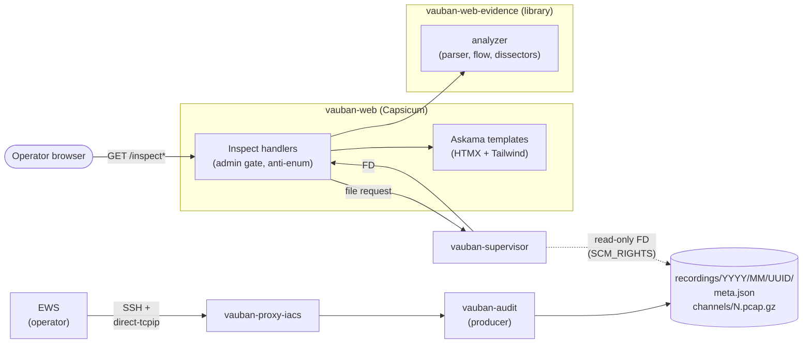
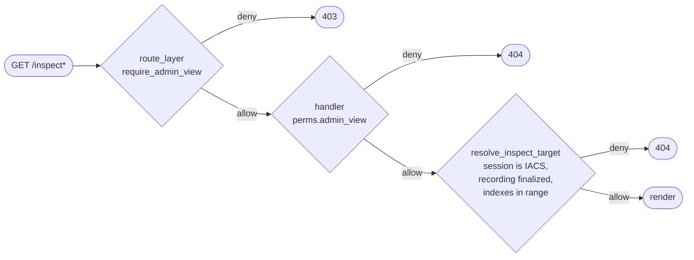
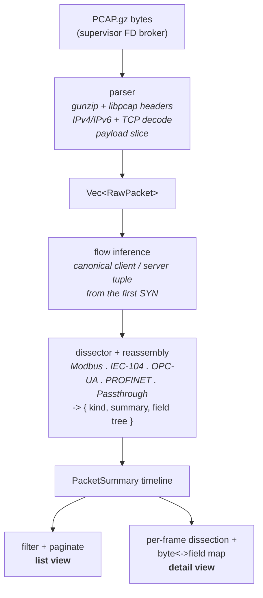

# Vauban IACS Inspect Capture Architecture

**Version:** 1.1  
**Date:** 21 July 2026  
**Author:** Richard Ben Aleya

---

## Table of Contents

1. [Introduction](#1-introduction)
2. [Architecture Overview](#2-architecture-overview)
3. [Authorization Model](#3-authorization-model)
4. [Pipeline](#4-pipeline)
5. [Dissector Architecture](#5-dissector-architecture)
6. [UI Architecture](#6-ui-architecture)
7. [Resource Bounds & Resilience](#7-resource-bounds--resilience)
8. [Threat Model](#8-threat-model)
9. [Limitations & Future Work](#9-limitations--future-work)
10. [Appendix A -- Module Layout](#appendix-a----module-layout)
11. [Appendix B -- API Surface](#appendix-b----api-surface)
12. [Appendix C -- Related Documents](#appendix-c----related-documents)
13. [Appendix D -- Changelog](#appendix-d----changelog)

---

## 1. Introduction

Vauban records every IACS tunnel between an Engineering Workstation
(EWS) and an industrial asset as a per-channel PCAP bundle (cf.
*Session Recording Architecture* § 5). The artefact is forensically
sound but, by itself, only consumable through an out-of-band tool such
as Wireshark: the operator has to download the bundle, mount the right
decoder, and find the segment of interest. The audit feedback loop is
measured in minutes.

**Inspect Capture** turns the same artefact into a navigable,
in-browser, industrial-protocol-aware analyzer. Where Wireshark is
generic, Inspect Capture is opinionated: it knows which peer is the
EWS and which is the asset, classifies each application frame as
*read* / *cmd* / *exception* against the asset's industrial protocol,
and links every parsed field to its byte range in the raw dump. The
investigator workflow becomes one click from the recording detail
page.

The view is **read-only**, **server-rendered** (HTMX + Tailwind, with a
small declarative Alpine binding for the tree<->hex highlight), and
intentionally narrower than Wireshark: no decryption, no replay, no
decoder for every exotic protocol -- only the dimensions Vauban ops
actually pivot on (direction, kind, free-text search across
dissector summaries).

### 1.1 Design Goals

| Goal | Approach |
|------|----------|
| Zero re-parse on the operator's machine | Server parses + dissects on every request |
| Wireshark-grade fidelity for supported protocols | Same byte format as `vauban-audit::iacs_pcap_synth`; Inspect Capture is its inverse |
| Industrial-protocol awareness | Direction-aware (EWS<->asset) + per-protocol classification (read / cmd / exception) |
| No client-side parser | Pagination + per-frame detail fetched on demand via HTMX |
| CSP-strict | No inline `<script>`; only a tiny declarative Alpine `x-data` |
| Bounded memory | Hard caps on record size, record count, decompressed bytes |
| Anti-enumeration | All "not eligible" outcomes collapse to a single generic 404 |
| Same trust boundary as replay | Capsicum-sandboxed; FDs brokered via `vauban-supervisor` |

### 1.2 Services in the Inspect Path

| Service | Role | Sandbox |
|---------|------|---------|
| `vauban-web` | Hosts the analyzer service, the three handlers, the templates; never opens a file directly | Capsicum |
| `vauban-supervisor` | Brokers read-only file descriptors for `meta.json` and each `channels/N.pcap.gz` over `SCM_RIGHTS` | Root |
| `vauban-audit` | Producer of the artefact (no role at inspection time); shares the synthetic L3/L4 byte format consumed by the analyzer | Capsicum |

Inspect Capture introduces **no new IPC surface**, **no new wire
protocol**, and **no new persistence**: it is a strictly read-side
consumer of the recording bundle.

---

## 2. Architecture Overview

### 2.1 Position in the Vauban Architecture



The analyzer lives in the workspace crate `vauban-web-evidence` and is
re-exported from web as `services::iacs_packet_analyzer`. Handlers and
templates stay in `vauban-web` at the same Capsicum trust boundary as
the rest of the audit-replay surface. The analyzer never opens files
directly: each request fetches `meta.json` and the targeted channel
PCAP through the supervisor's existing FD broker, exactly like the
SSH / RDP replay viewers (cf. *Privilege Separation Architecture*
§ FD broker).

### 2.2 Stateless by Design

Each handler call re-parses the channel PCAP from scratch. There is
no in-memory cache, no on-disk side state, no per-session worker. As
a consequence:

- The view is always rendered from the same byte artefact that the
  integrity hash in `meta.json` covers; the operator cannot see a
  stale or de-synchronised tree.
- A poll-storm cannot exhaust supervisor FDs: each request opens and
  drops one `meta.json` FD plus one channel PCAP FD synchronously.
- A redeploy is transparent: there is no warmup, no cache priming,
  no migration step.

---

## 3. Authorization Model

Inspect Capture composes three independent layers; none of them
substitutes for the others.



1. **Route layer** -- `require_admin_view` rejects non-admins before
   any handler runs. This is the primary capability gate.
2. **Handler re-check** -- the same Casbin permission is evaluated
   inside each handler body. A misconfiguration of either layer is
   caught by the other.
3. **Anti-enumeration** -- every "not found / not IACS / not
   finalized / index out of range" outcome collapses to the same
   generic 404. The URL space cannot be used as an oracle for
   session existence.

Inspect Capture is read-only by construction: the surface contains
no session-creation paths, no terminal / RDP / WebSocket route, no
access-request endpoint. The same structural invariant that protects
`/assets/manage/*` from leaking session hooks applies here.

---

## 4. Pipeline



The pipeline has four stages, each with a narrow contract:

1. **Parse** -- gunzip the channel PCAP, walk the libpcap global and
   record headers, decode L3/L4 with `etherparse`. The parser is the
   strict inverse of the synthesiser used by `vauban-audit` to wrap
   captured chunks; the two crates share no code but pin the same
   byte format through cross-crate fixture tests.
2. **Flow inference** -- promote one of the two endpoints to "client"
   (EWS) and the other to "server" (asset) by looking at the first
   SYN of the channel. This is what lets the rest of the pipeline
   answer "EWS->asset" vs "asset->EWS" deterministically, without
   having to consult `meta.json` again at every frame.
3. **Reassembly + dissection** -- per-direction TCP stream buffers
   reassemble length-framed PDUs (Modbus, OPC-UA, IEC-104) with hard
   caps (`64 KiB`, `64` segments). Incomplete fragments are dissected
   through the passthrough floor (never `Cmd`). Complete PDUs are
   dispatched on the asset's industrial profile. Each dissector
   returns a small, uniform structure: a classification
   (`read` / `cmd` / `exception`), a one-line summary for the list
   view, and a tree of fields with absolute byte offsets for the
   detail view.
4. **Project** -- two views are derived from the timeline. The list
   view applies an optional filter (direction, kind, free-text
   search on the summary) and pages the result. The detail view
   re-runs the dissector on a single frame and emits a
   byte-to-field map for the tree<->hex highlight.

---

## 5. Dissector Architecture

A dissector is a small module that turns a TCP application payload
into a `Dissection { kind, summary, tree }` triple. The dispatcher
selects one based on the asset's `industrial_protocol` column,
mapped to a typed `ExpectedProfile`. The mapping is exhaustive at
compile time -- adding a new variant breaks the build until a
classifier is provided.

### 5.1 Classification Contract

| Kind        | Meaning                                                | Example  |
|-------------|--------------------------------------------------------|----------|
| `Tcp`       | Pure transport / control frame, no application payload | SYN, FIN, ACK |
| `Read`      | Observation of asset state                             | Modbus FC03, IEC-104 monitoring direction |
| `Cmd`       | Modification of asset state                            | Modbus FC06, IEC-104 control direction |
| `Exception` | Negative response, busy, unknown                       | Modbus FC \| 0x80, IEC-104 negative COT |

`Cmd` is the dimension that sets Inspect Capture apart from a generic
PCAP viewer: the operator can scan a 10 000-frame capture and see at
a glance every state-changing intent the EWS sent to the asset.

### 5.2 Built-in Dissectors

| Profile                                              | Dissector     | Coverage |
|------------------------------------------------------|---------------|----------|
| Modbus/TCP                                           | `modbus`      | MBAP header, function code, request- vs response-shaped sub-tree, exception bit |
| IEC 60870-5-104                                      | `iec104`      | APCI start byte / format / sequence numbers, ASDU type ID, Cause of Transmission |
| OPC-UA Binary (UA TCP)                               | `opcua`       | Message type header, heuristic service-id classification for `MSG` frames |
| PROFINET DCE/RPC                                     | `profinet`    | CO PDU version / ptype / frag length |
| EtherNet/IP explicit (CIP/TCP)                       | `enip`        | Encapsulation command, session handle, status; CIP Set / Forward_Open → `Cmd` |
| DNP3 (IEEE 1815 / TCP)                               | `dnp3`        | Link `05 64`, dest/src; Write / Select / Operate → `Cmd` |
| IEC 61850 MMS/TCP                                    | `iec61850`    | TPKT + COTP; MMS Read / Initiate → `Read`; Write → `Cmd`; S7-shaped TPKT stays `Read` |
| BACnet/SC                                            | `bacnet_sc`   | TLS handshake / HTTP upgrade → `Read`; ciphertext **never** `Cmd` |
| MQTT/TLS, S7, BACnet/IP, generic                     | `passthrough` | byte count + ASCII preview |

### 5.3 The Passthrough Floor

Protocols outside the v1.0 catalogue fall back to `passthrough`. The
fallback is deliberately conservative:

- It **never** classifies a frame as `Cmd`. A protocol the analyzer
  cannot parse must not be allowed to silently mis-attribute a
  state-changing operation.
- It surfaces a one-line summary (byte count + short ASCII preview)
  so the operator can still triage the timeline.
- It points the operator at the offline Wireshark workflow for
  deeper analysis.

This gives the analyzer a useful answer for every IACS recording,
including those produced before a given dissector existed.

---

## 6. UI Architecture

### 6.1 No-JS Philosophy

The page ships with **no inline `<script>`** and no bespoke
JavaScript bundle. Two libraries handle the entire interactivity
budget:

- **HTMX** drives every state change that touches the server: filter
  changes, channel switch, pagination, packet selection, initial
  auto-paint. Each interaction is a normal `GET` returning an
  HTML fragment; the URL is pushed via `hx-push-url` so the
  back/forward buttons restore the previous filter combination.
- **Alpine** carries one declarative `x-data` scope for the
  tree<->hex bidirectional highlight (~10 lines, no `eval`,
  CSP-compatible). Tree nodes and hex bytes share a `field_id` and
  the same `highlight` reactive variable.

This is enforced by a CI lint that fails on any `<script>` under
the Inspect templates.

### 6.2 Color Discipline

Colors carry semantic meaning, not decoration. The palette mirrors
Bastion Watch (the supervisor dashboard) so an operator who already
reads Vauban dashboards reads Inspect Capture without retraining.

| Visual cue                  | Meaning                                |
|-----------------------------|----------------------------------------|
| amber (rows)                | `Cmd` -- state-changing intent         |
| rose (rows)                 | `Exception` -- negative / busy / unknown |
| blue (rows)                 | `Read` -- observation                  |
| neutral gray (rows)         | `Tcp` control / handshake              |
| amber border-l on the row   | EWS -> asset direction                 |
| emerald border-l on the row | asset -> EWS direction                 |
| persistent amber banner     | Replay-safety notice (read-only view)  |

### 6.3 Responsive

Mobile-first. The shell uses a `grid-cols-1 lg:grid-cols-12`
layout: panes stack on phones, sit side-by-side on desktop. Every
top-level container in every Inspect partial carries at least one
Tailwind breakpoint class; this is pinned by a CI lint so a
regression cannot ship.

### 6.4 Tree<->Hex Contract

The bidirectional highlight is the analyzer's signature feature:
hovering a parsed field in the tree highlights the corresponding
bytes in the hex dump, and vice versa. The contract is:

- The dissector is the single source of truth for `field_id`s and
  byte offsets; both the tree partial and the hex partial render
  `data-field=` from the view-model only (no literal field ids in
  templates).
- The `byte_field_ids` map produced by the analyzer covers every
  byte of the payload exactly once (partition invariant).

A CI lint and the partition test pin both halves so the highlight
cannot silently misalign.

---

## 7. Resource Bounds & Resilience

The analyzer is invoked on operator-supplied inputs (a UUID and a
filter combination); the underlying artefacts are themselves
operator-recorded. Three hard caps prevent a malicious or
mis-truncated PCAP from exhausting memory:

| Bound                     | Purpose |
|---------------------------|---------|
| Per-record size cap       | Reject impossibly large pcap records before allocation |
| Per-channel record cap    | Hard ceiling on the number of frames the analyzer materialises in one pass |
| Decompressed bytes cap    | Limit gunzip output for a single channel |
| TCP reassembly cap        | `64 KiB` buffer + `64` segment ceiling per direction; overflow flushes as incomplete fragment (never `Cmd`) |

Beyond these caps the parser returns a typed `TooLarge` error and
the handler falls back to the generic 404. The recording itself is
not corrupted -- the operator is invited to use the offline
Wireshark workflow on those (rare) edge cases.

The same statelessness that makes the surface trivial to reason
about also makes it trivial to recover from: there is no cache to
invalidate, no worker to restart, no migration to run. If a
deployment ships a fix, every subsequent request picks it up.

---

## 8. Threat Model

| Threat                                                         | Mitigation |
|----------------------------------------------------------------|------------|
| Non-admin enumerates session UUIDs via `/inspect*`             | Casbin `admin:view` (route layer + handler) + generic 404 on every "not eligible" path |
| Crafted PCAP claiming a 4 GB record                            | Per-record / per-channel / decompressed-bytes caps |
| Truncated or corrupt PCAP                                      | Typed parser error -> generic 404; the worker is never crashed |
| Asymmetric channel fools the direction classifier              | First-SYN priority + canonical client/server tuple; fallback heuristic only for late-joining frames |
| Operator clicks Inspect on a still-recording session           | `recording_finalized_at IS NULL` -> generic 404; no partially-written file is ever read |
| XSS via inline `<script>`                                      | CI lint forbids any `<script>` in Inspect templates; CSP `script-src` does not allow `'unsafe-inline'` |
| Supervisor FD exhaustion via poll-storm                        | One `meta.json` FD + one channel PCAP FD per request, dropped synchronously; no long-lived FD |
| Tree<->hex highlight desynchronised (wrong byte highlighted)   | Dissector is the only source of truth for `field_id` + offsets; partition invariant pinned by tests + lint |
| Replay against a live asset                                    | Inspect Capture is read-only; no upstream socket is ever opened from this surface |

The replay-safety doctrine is reasserted in two places: the
persistent banner on the page, and the structural absence of any
upstream-network code in the analyzer module. Inspect Capture
**cannot** replay; the only output of every handler is HTML.

---

## 9. Limitations & Future Work

- **Protocol coverage.** v1.1 (amended ADR 006) ships dissectors for
  Modbus/TCP, IEC-60870-5-104, OPC-UA Binary, PROFINET DCE/RPC,
  EtherNet/IP explicit, DNP3, IEC 61850 MMS/TCP, and BACnet/SC
  (TLS handshake only). MQTT/TLS, S7, BACnet/IP, and other exotic
  profiles still fall back to `passthrough`. MMS is not GOOSE/SV;
  TPKT on port 102 is not automatically S7comm.
- **BACnet/SC honesty.** The peek and the dissector confirm TLS (or
  an HTTP/WebSocket upgrade), not a BACnet APDU. Encrypted records
  never classify as `Cmd`.
- **TCP cross-segment reassembly.** Bounded per-direction reassembly
  is implemented for length-framed protocols (Modbus, OPC-UA,
  IEC-104, ENIP, DNP3, IEC 61850 TPKT, TLS records). PROFINET and
  passthrough treat each TCP segment as an atomic PDU unless a
  partial DCE header is detected. Incomplete fragments never
  classify as `Cmd`.
- **Filter expressiveness.** Filters are bounded to direction, kind,
  and free-text search on summaries. BPF-style expressions are
  intentionally out of scope for v1.0.
- **Live tail.** The analyzer operates exclusively on finalized
  recordings; the channel PCAP is gzipped only at channel close.
  Live streaming of in-flight industrial traffic would require a
  different surface.
- **Filtered export.** Exporting a sub-PCAP that matches the current
  filter is a natural extension; v1.0 keeps the surface read-only.

---

## Appendix A -- Module Layout

```
vauban-web-evidence/src/analyzer/
    parser.rs               libpcap + etherparse decode (inverse of audit's synthesiser)
    flow.rs                 canonical client/server endpoint inference
    reassembly.rs           bounded per-direction TCP PDU reassembly
    dissectors/
        mod.rs              registry, classification contract
        modbus.rs           Modbus/TCP
        iec104.rs           IEC 60870-5-104
        opcua.rs            OPC-UA Binary (UA TCP)
        profinet.rs         PROFINET DCE/RPC
        enip.rs             EtherNet/IP explicit (CIP/TCP)
        dnp3.rs             IEEE 1815 / DNP3
        iec61850.rs         IEC 61850 MMS/TCP (TPKT + COTP)
        bacnet_sc.rs        BACnet/SC TLS / WS (never `Cmd` on ciphertext)
        passthrough.rs      conservative fallback (never `Cmd`)
    types.rs                PacketSummary, FieldNode, filters, paging
    mod.rs                  analyze_channel, page_summaries, analyze_packet

vauban-web/src/services/mod.rs
    pub use vauban_web_evidence::analyzer as iacs_packet_analyzer

vauban-web/src/handlers/web/sessions.rs
    resolve_inspect_target  shared admin gate + DB lookup + anti-enumeration
    inspect_capture         shell page (initial paint)
    inspect_capture_packet_list    list fragment (HTMX)
    inspect_capture_packet_detail  detail fragment (HTMX)

vauban-web/src/templates/sessions/inspect_capture.rs
                            view-models (recursive tree flattened for Askama)

vauban-web/templates/sessions/inspect/
    shell.html              page shell, 3-pane responsive grid
    _channel_selector.html  HTMX tabs (no JS state)
    _filter_chips.html      direction / kind / search
    _packet_list.html       filtered, paginated list
    _packet_detail.html     dissection tree + Alpine highlight
    _hex_dump.html          hex dump with `data-field=` per byte
```

Storage layout follows the recording bundle (cf. *Session Recording
Architecture* Appendix A); Inspect Capture writes nothing.

---

## Appendix B -- API Surface

| Method | Path                                                              | Purpose |
|--------|-------------------------------------------------------------------|---------|
| GET    | `/sessions/recordings/{uuid}/inspect`                             | Initial full-page paint |
| GET    | `/sessions/recordings/{uuid}/inspect/channels/{n}/packets`        | List fragment (HTMX) |
| GET    | `/sessions/recordings/{uuid}/inspect/channels/{n}/packets/{idx}`  | Detail fragment (HTMX) |

Channel index `n` and frame index `idx` are 1-based; `idx == 0` is
rejected with the generic 404. The shell page auto-loads the first
frame of the first channel via HTMX so the operator lands on a
populated view without a second click.

List query parameters:

| Name        | Type   | Notes |
|-------------|--------|-------|
| `direction` | enum   | `ews_to_asset` or `asset_to_ews` |
| `kind`      | enum   | `tcp` / `read` / `cmd` / `exception` |
| `q`         | string | free-text, case-insensitive, matched against the dissector summary |
| `page`      | int    | 1-based |
| `page_size` | int    | clamped to a service-side maximum |

URL state is pushed via `hx-push-url`; the back/forward buttons
restore the previous filter combination.

---

## Appendix C -- Related Documents

| Document | Relevance |
|----------|-----------|
| [Session Recording Architecture](Vauban_Recording_Architecture_EN(1.9).md) | PCAP file format, `meta.json`, integrity hash, FD broker contract |
| [IACS Proxy Architecture](Vauban_IACS_Proxy_Architecture_EN(1.1).md) | Upstream proxy that produced the PCAP; protocol gates |
| [Privilege Separation Architecture](Vauban_Privsep_Architecture_EN(1.3).md) | Supervisor FD broker, Capsicum sandboxing |
| [IAM Architecture](Vauban_IAM_Architecture_EN(1.1).md) | Casbin / `PermissionContext`, three-layer authorization |

---

## Appendix D -- Changelog

This appendix is informational; the current sections describe the
*current* architecture.

### 1.1 (amended 17 August 2026) -- crate 0.9.37

- ADR 006 profiles: EtherNet/IP explicit, DNP3, IEC 61850 MMS/TCP,
  BACnet/SC (TLS handshake / opaque records). Ciphertext and
  incomplete fragments still never classify as `Cmd`.
- Catalogue limits documented: MMS ≠ GOOSE/SV; TPKT ≠ S7comm;
  BACnet/SC peek confirms TLS, not a BACnet APDU.

### 1.1 (21 July 2026)

- OPC-UA Binary (UA TCP) and PROFINET DCE/RPC dissectors.
- Bounded per-direction TCP reassembly (`64 KiB`, `64` segments) for
  length-framed protocols; incomplete fragments never classify as `Cmd`.
- E2E and property tests for reassembly + new dissectors.

### 1.0 (25 May 2026)

- Initial release alongside Vauban 0.7.21.
- In-browser PCAP analyzer with Modbus/TCP and IEC-60870-5-104
  dissectors and a conservative passthrough fallback.
- `admin:view` route layer + handler re-check + anti-enumeration
  funnel.
- Server-rendered HTMX + Tailwind UI; declarative Alpine binding
  for the tree<->hex highlight; no inline JavaScript.
- Hard caps on per-record size, per-channel record count, and
  decompressed bytes; statelessly re-parsed on every request.
- Recording List and Recording Details surface a contextual
  Inspect action on finalized IACS recordings.
