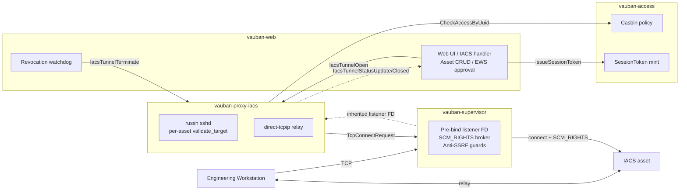
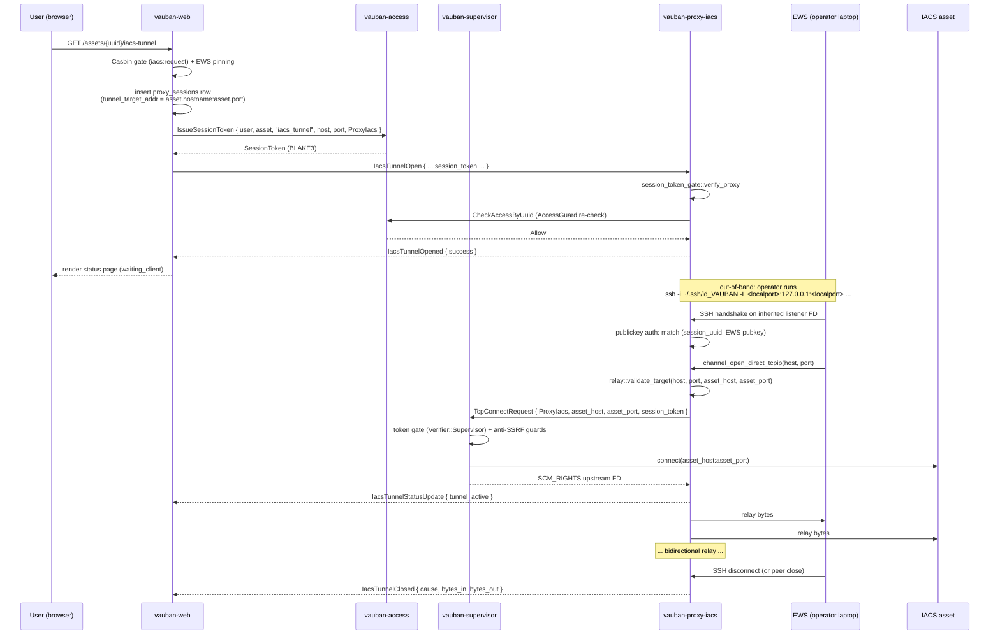

# Vauban IACS Proxy Architecture

**Version:** 1.0
**Date:** 15 May 2026
**Author:** Richard Ben Aleya

---

## Table of Contents

1. [Purpose](#1-purpose)
2. [Position in the Vauban architecture](#2-position-in-the-vauban-architecture)
3. [Per-asset target resolution contract](#3-per-asset-target-resolution-contract)
4. [Process model and sandboxing](#4-process-model-and-sandboxing)
5. [IPC surface](#5-ipc-surface)
6. [Three-layer authorization](#6-three-layer-authorization)
7. [Anti-SSRF guards on the supervisor TCP broker](#7-anti-ssrf-guards-on-the-supervisor-tcp-broker)
8. [Lifecycle of an IACS tunnel session](#8-lifecycle-of-an-iacs-tunnel-session)
9. [Revocation watchdog (DB-driven, IPC-dispatched)](#9-revocation-watchdog-db-driven-ipc-dispatched)
10. [Real-time status fan-out (WebSocket)](#10-real-time-status-fan-out-websocket)
11. [Threat model](#11-threat-model)
12. [Test coverage](#12-test-coverage)
13. [Source of truth](#13-source-of-truth)

---

## 1. Purpose

`vauban-proxy-iacs` is a dedicated, sandboxed russh sshd that serves as the bastion-side endpoint for **Engineering Workstations (EWS)** opening tunnels to **IACS assets** (Modbus, OPC-UA, DNP3, IEC-104, BACnet/SC, MQTT/TLS, Profinet IO). It replaces the pre-v0.7.8 in-process IACS sshd that ran inside `vauban-web`.

The split delivers three things the in-process design could not:

1. **Per-asset target resolution.** Every IACS tunnel session pins a per-session `(asset.hostname, asset.port)` target derived from the asset row at session-creation time. The pre-v0.7.8 implementation hard-coded `127.0.0.1:4321` as the upstream, ignoring the asset's `Hostname` and `Port` columns -- a single-asset MVP shortcut that needed to be removed before the IACS surface could go to production.
2. **Capsicum-grade sandboxing.** The proxy never holds a database connection, never mints a session token, never re-evaluates Casbin policy. It accepts EWS SSH handshakes and relays bytes between the operator's `direct-tcpip` channel and the upstream TCP socket brokered by the supervisor. Everything else is upstream of the pipe boundary.
3. **Privilege separation symmetry with SSH and RDP.** The IACS surface now follows the same `vauban-web -> vauban-access (mint) -> vauban-supervisor (broker) -> vauban-proxy-* (relay)` pattern as the existing `vauban-proxy-ssh` and `vauban-proxy-rdp`. The same audit, the same key dissemination, the same `AccessGuard` re-check.

## 2. Position in the Vauban architecture



`vauban-proxy-iacs` sits in the proxy tier alongside `vauban-proxy-ssh` and `vauban-proxy-rdp`. It speaks only to: the supervisor (broker + listener FD), `vauban-access` (RBAC re-check), `vauban-audit` (session events), and `vauban-web` (IACS tunnel open / terminate / status fan-out). It never touches the database or external networks directly.

## 3. Per-asset target resolution contract

The pre-v0.7.8 contract was: every IACS tunnel relayed traffic to a fixed `target_addr` declared in `vauban.conf` (default `127.0.0.1:4321`). The post-v0.7.8 contract is:

> Every IACS tunnel relays traffic to **the per-asset `(asset.hostname, asset.port)`** captured at session creation time. The pinned target travels end-to-end through three layers, and each layer enforces it independently.

| Layer | Storage / wire | Enforced by |
|---|---|---|
| Persistence | `proxy_sessions.tunnel_target_addr = format!("{}:{}", asset.hostname, asset.port)` | Set in `handlers/web/iacs_tunnel.rs` at the only `NewProxySession` build site. |
| Cryptographic binding | `SessionToken { host, port, target_service: ProxyIacs, protocol: "iacs_tunnel" }` | Minted by `vauban-access` on `IssueSessionToken`; verified at the supervisor (`Verifier::Supervisor`) and at the proxy (`Verifier::Proxy`). |
| Per-session pin | `IacsTunnelOpenRequest { asset_host, asset_port }` -> `PendingTunnel { asset_host, asset_port }` | Stored in `vauban-proxy-iacs::auth::PendingSessions` keyed by session UUID. |
| Runtime enforcement | `relay::validate_target(requested_host, requested_port, expected_host, expected_port)` | Called on every `channel_open_direct_tcpip` before the supervisor broker is invoked. Loopback-equivalence is permitted only when BOTH sides are loopback. |
| Network enforcement | Anti-SSRF guards on `Service::ProxyIacs` targets | See §7. |

A regression that reintroduces a process-wide `target_addr` is caught at compile time by the structural pin tests (`vauban-proxy-iacs/tests/per_asset_target_test.rs`) and at lint time by `vauban-proxy-iacs/scripts/check_no_hardcoded_target.sh`.

### 3.1 Privileged-port unprivilegisation (EWS-side concern)

The bastion-side per-asset target contract above pins the **upstream** `(asset_host, asset_port)`. There is a complementary **EWS-side** contract that decouples the operator's local-bind port (the LHS of `ssh -L LP:asset:AP`) from the upstream port: most IACS protocols listen on `< 1024` (Modbus 502, MMS 102) and binding privileged ports requires root on Unix and "increased priority" on Windows. Forcing every operator to run `ssh` as root is not acceptable.

Helper [`derive_local_forward_port`](mdc:vauban-web/src/services/iacs_tunnel/port_mapping.rs):

```text
local_forward_port = asset_port            if asset_port >= 1024
                   = 50_000 + asset_port   if asset_port <  1024
```

The mapping is deterministic, injective on the privileged range, collision-free, and stable across releases (operator muscle memory: "Modbus -> :50502" must keep working). The status template renders three independent fields (`local_forward_port`, `target_host`, `target_port`) so the SSH command is `ssh -L <LP>:<asset_host>:<asset_port>` (NOT the legacy `ssh -L <port>:127.0.0.1:<port>`). The bastion's `validate_target` does NOT participate in the rewrite -- it only validates the upstream pair.

Pinned end-to-end by [`vauban-web/tests/web/iacs_local_forward_port_test.rs`](mdc:vauban-web/tests/web/iacs_local_forward_port_test.rs) (Modbus 502 -> 50502, OPC-UA 4840 unchanged, IPv6 host preserved verbatim, boundary 1023/1024, malformed `tunnel_target_addr` defensive fallback).

## 4. Process model and sandboxing

`vauban-proxy-iacs` follows the standard Vauban privsep boot sequence:

1. **Supervisor pre-fork**:
   - Read `industrial.iacs_tunnel.bind_addr` from `vauban.conf`.
   - `bind(2)` a TCP listening socket. The privileged `bind` step lives here so the proxy can stay sandboxed.
   - `mem::forget` the `TcpListener` so the kernel keeps the FD open across the `forget`; export the raw FD via `VAUBAN_IACS_LISTENER_FD`.
2. **Supervisor fork** the proxy as `vauban_iacs:vauban_iacs` (uid 908, gid 908).
3. **Proxy boot**:
   - Read `VAUBAN_IACS_LISTENER_FD` BEFORE `cap_enter`.
   - Initialize `shared::session_token::proxy_gate::init_from_env` (consumes and clears `VAUBAN_SESSION_TOKEN_KEY_*`).
   - Initialize `shared::access_guard::AccessGuard::from_env(PROTOCOL_IACS_TUNNEL, state)` (consumes and clears `VAUBAN_ACCESS_IPC_*`).
   - Call `shared::capsicum::setup_service_sandbox_with_listeners(...)` to grant the listener FD `cap_listen | cap_accept` and enter Capsicum capability mode.
4. **Steady state**:
   - The russh sshd accepts on the inherited listener FD. No `bind()`, no `socket()`, no `connect()` -- all forbidden by Capsicum on FreeBSD production.
   - Every upstream TCP goes through `SupervisorBrokerOpener` (a `TcpConnectRequest` over the supervisor pipe with the session-bound token, answered by an `OwnedFd` over `SCM_RIGHTS`).

On Linux/macOS dev hosts the sandbox is a no-op (`cap_enter` is skipped); the proxy still goes through the same broker and pin-test contracts so CI exercises the production path identically.

## 5. IPC surface

The proxy exposes four message variants (`shared::messages::Message`):

| Verb | Direction | Purpose |
|---|---|---|
| `IacsTunnelOpen` | `web -> proxy_iacs` | Open a pending session on the proxy. Payload: `session_id`, `user_uuid`, `asset_uuid`, `ews_uuid`, `ews_pubkey_fp`, `asset_host`, `asset_port`, `industrial_protocol`, `ttl_seconds`, `session_token`. |
| `IacsTunnelOpened` | `proxy_iacs -> web` | Acknowledge / refuse. `success`, optional `error`. |
| `IacsTunnelStatusUpdate` | `proxy_iacs -> web` | State machine transition (`waiting_client -> tunnel_active -> terminated`); fan-out to the WebSocket layer. |
| `IacsTunnelClosed` | `proxy_iacs -> web` | Final close event (cause, total bytes). |
| `IacsTunnelTerminate` | `web -> proxy_iacs` | Force-close a session (revocation watchdog or admin kill). |

The proxy also speaks the existing supervisor surface (`TcpConnectRequest` / `TcpConnectResponse`) for upstream brokering, and the existing `CheckAccessByUuid` surface against `vauban-access` for the re-check.

## 6. Three-layer authorization

Three independent layers gate every IACS tunnel session:

1. **Casbin / `PermissionContext`** (functional capability). `vauban-web`'s IACS handler is gated by Casbin permissions through the `PermissionContext` middleware. A user without the `iacs:request` permission can never reach the handler.
2. **Cryptographic session-token gate**. `vauban-web` mints a BLAKE3-keyed token bound to `(session_id, user_uuid, asset_uuid, host, port, protocol="iacs_tunnel", target_service=ProxyIacs)`. The supervisor verifies the token before any DNS / connect (`Verifier::Supervisor`); the proxy verifies it again on `IacsTunnelOpen` (`Verifier::Proxy`). A token minted for SSH cannot be replayed on the IACS surface (the protocol binding rejects it). A token minted for asset A cannot be replayed against asset B (the `(host, port)` binding rejects it).
3. **AccessGuard re-check**. After the token verifies, `vauban-proxy-iacs` runs `AccessGuard::authorize(&user_uuid, &asset_uuid)` against `vauban-access`. This re-checks the access-rule layer (a Casbin grant is necessary but not sufficient: an access rule restricts *which assets* the user can reach with the IACS protocol). A mid-flight access-rule revoke between token mint and `IacsTunnelOpen` is caught here.

The three layers are checked in order, fail-closed; any failure refuses the tunnel.

## 7. Anti-SSRF guards on the supervisor TCP broker

The supervisor's `handle_tcp_connect_request` enforces TWO additional guards on every request that targets `Service::ProxyIacs`:

- **Anti-self-listener.** A request whose `(target_host, target_port)` equals the IACS sshd's own listening address is rejected. Without this guard, an EWS owner could ask the proxy to tunnel back to itself, creating an infinite SSH-in-SSH loop and exhausting fds. Pinned by `tests::test_iacs_broker_anti_self_listener_guard_exists`.
- **Anti-loopback (default-deny).** A request whose resolved IP is loopback (`127.0.0.0/8`, `::1`) is rejected unless `industrial.iacs_tunnel.allow_loopback_targets = true`. Loopback assets give an EWS oracular access to colocated services (e.g. PostgreSQL on the bastion host); production deployments MUST keep this knob `false`. Pinned by `tests::test_iacs_broker_anti_loopback_guard_exists`.

Both guards log a structured `target_resolved_ip` field so an operator can pivot on `journalctl -u vauban-supervisor -g target_resolved_ip` to triage a denied tunnel. Guards are constructed once per spawn from `IacsTunnelGuards::from_config(&config.industrial.iacs_tunnel)` and threaded through `process_service_messages`.

## 8. Lifecycle of an IACS tunnel session



## 9. Revocation watchdog (DB-driven, IPC-dispatched)

The watchdog still lives inside `vauban-web` (DB-resident logic) but no longer manipulates an in-process registry. The Lot 5 refactor introduced `services::iacs_tunnel::revocation::spawn_watchdog_with_proxy_iacs` which takes an `Option<Arc<ProxyIacsClient>>`. Each tick:

1. Query the DB for sessions whose anchor (`ews`, `users`, `access_rules`) has been revoked or whose `waiting_client` TTL is exceeded.
2. For every session that must die, send an `IacsTunnelTerminate` IPC to the proxy.
3. The proxy's `direct-tcpip` relay tasks read the broadcast cancellation, drain the relay, persist the closed state, and emit `IacsTunnelClosed`.
4. The watchdog updates the `proxy_sessions` row to `terminated` (or `expired` for TTL-based transitions) and appends a `tunnel_closed` row to `ews_audit_log`.

Operator triage when "an offboarded EWS still has an open tunnel" lives in [docs/runbooks/iacs_ews_onboarding.md](../runbooks/iacs_ews_onboarding.md).

## 10. Real-time status fan-out (WebSocket)

`vauban-web` runs a dedicated task that pumps `IacsTunnelStatusUpdate` and `IacsTunnelClosed` from the proxy into the `BroadcastService`:

- `notifications` channel (low cardinality) for the supervisor admin views;
- `session:<uuid>` channel (high cardinality) for the per-tunnel detail page.

The pump is `ProxyIacsClient::process_incoming_with_broadcast(b)` and is spawned once on `AppState` initialization. Cardinality routing follows the [`websocket-logging`](../../.cursor/rules/websocket-logging.mdc) convention: status updates on the singleton `notifications` channel log at `info!`; per-session updates on `session:<uuid>` log at `debug!`.

## 11. Threat model

| Threat | Mitigation | Pinned by |
|---|---|---|
| Compromised `vauban-web` mints `IacsTunnelOpen` for a forbidden asset. | Cryptographic session-token gate on the proxy boundary (`Verifier::Proxy`). The token's `(host, port, asset_uuid)` binding is set by `vauban-access`, NOT by `vauban-web`. | `iacs_handler_mints_session_token_with_per_asset_binding` (web pin) + `iacs_tunnel_open_handler_verifies_session_token` (proxy pin). |
| Cross-asset target swap. EWS opens `direct-tcpip` to `10.0.0.2:502` on a session minted for `10.0.0.1:502`. | `relay::validate_target` rejects the open before brokering. | `cross_asset_target_swap_rejected`. |
| Cross-protocol replay. Token minted for SSH replayed on IACS. | Token's `protocol` field bound at mint and re-verified at proxy boundary. | Same gate, different label. |
| EWS asks the proxy to tunnel to itself. | Supervisor anti-self-listener guard on `Service::ProxyIacs`. | `test_iacs_broker_anti_self_listener_guard_exists`. |
| EWS asks for a loopback target on the bastion host. | Supervisor anti-loopback guard (default-deny). | `test_iacs_broker_anti_loopback_guard_exists`. |
| Mid-session access-rule revoke. | DB-driven watchdog dispatches `IacsTunnelTerminate` to the proxy within `revocation_poll_interval_seconds`. | `iacs_revocation_watchdog_test::watchdog_closes_tunnels_when_*`. |
| Compromised proxy attempts a direct `connect()`. | Capsicum `cap_enter` post-listener-fd setup; every outbound goes through the supervisor broker. Lint catches `TcpStream::connect(` / `TcpListener::bind(` in `vauban-proxy-iacs/src/`. | `proxy_iacs_does_not_call_socket_or_bind`. |
| Anti-replay of a captured `TcpConnectRequest`. | Token's session-id is consumed by the supervisor's bounded `replay_cache`. | Existing replay-cache tests in `shared/src/session_token/replay_cache.rs`. |
| Legacy in-process IACS sshd silently still running. | Spawn gated on `!proxy_iacs_present`; lint catches reintroduction. | `legacy_in_process_iacs_sshd_is_gated_behind_proxy_iacs_absence`. |

## 12. Test coverage

| Scope | File | What it pins |
|---|---|---|
| Per-asset target unit | `vauban-proxy-iacs/tests/per_asset_target_test.rs` | `validate_target` matches per-session pin; cross-asset swap rejected; legacy fixed target rejected for remote asset; loopback-equivalence semantics. |
| Per-asset target structural | same | Source-grep pins on `validate_target`, `Service::ProxyIacs`, `Message::TcpConnectRequest`, `verify_proxy`, `access_guard.authorize`, `VAUBAN_IACS_LISTENER_FD`, `setup_service_sandbox_with_listeners`. Lint pin: no `TcpStream::connect` / `TcpListener::bind` anywhere in `src/`. |
| Per-asset target lint | `vauban-proxy-iacs/scripts/check_no_hardcoded_target.sh` | No `127.0.0.1:4321` literal anywhere in `vauban-proxy-iacs/src/`. |
| Web wiring structural | `vauban-web/tests/web/iacs_per_asset_target_pin_test.rs` | `tunnel_target_addr` derived from `asset.hostname:asset.port`; `SessionTokenParams` carries per-asset binding; IPC `IacsTunnelOpenRequest` carries `asset_host` / `asset_port`; rollback on token mint failure AND proxy-iacs refusal; legacy in-process sshd suppressed when proxy-iacs is wired; watchdog uses proxy-iacs-aware spawn; broadcast pump forwards `IacsTunnelStatusUpdate` and `IacsTunnelClosed`. |
| Supervisor anti-SSRF | `vauban-supervisor/src/main.rs::tests::test_iacs_broker_*` | Anti-self-listener and anti-loopback guards exist, log `target_resolved_ip`, threaded through `process_service_messages`. |
| Watchdog | `vauban-web/tests/web/iacs_revocation_watchdog_test.rs` | EWS disabled / offboarded / user deactivated / TTL expired -> tunnel killed; user A's revoke does not touch user B's tunnel; `tunnel_closed` audit row appended. |
| Adversarial sshd | `vauban-web/tests/web/iacs_tunnel_handler_test.rs` | publickey-only auth; every other surface refused (password, kbd-int, session/x11/forwarded-tcpip, second `direct-tcpip`, wrong target, shell/exec/subsystem/pty/agent, tcpip-forward, streamlocal-forward). |
| Drift | `vauban-web/tests/web/iacs_drift_test.rs` | Asset-type CHECK matches Rust `AssetType::ALL`; `proxy_sessions_iacs_consistency` CHECK exists; `ews_audit_log_event_chk` admits IACS events; `all_iacs` virtual asset_group seeded. |

## 13. Source of truth

- `vauban-proxy-iacs/` -- the proxy crate (russh sshd + relay + supervisor broker glue + per-session pinning)
- `vauban-supervisor/src/main.rs` -- `IacsTunnelGuards`, listener pre-bind (`VAUBAN_IACS_LISTENER_FD`), `Service::ProxyIacs` routing in `handle_tcp_connect_request`
- `vauban-supervisor/src/config.rs` -- `IacsTunnelSupervisorConfig { enabled, bind_addr, allow_loopback_targets }`
- `vauban-web/src/handlers/web/iacs_tunnel.rs` -- per-asset `tunnel_target_addr` + token mint + `IacsTunnelOpenRequest` dispatch
- `vauban-web/src/ipc/proxy_iacs.rs` -- `ProxyIacsClient` (`open_tunnel`, `terminate_tunnel`, `process_incoming_with_broadcast`)
- `vauban-web/src/services/iacs_tunnel/revocation.rs` -- `spawn_watchdog_with_proxy_iacs`
- `shared/src/messages.rs` -- `Service::ProxyIacs` + `IacsTunnel*` message variants
- `shared/src/access_guard.rs` -- `PROTOCOL_IACS_TUNNEL`
- `shared/src/session_token/proxy_gate.rs` -- factorized `init_from_env` / `verify_proxy` consumed verbatim by the proxy
- `config/default.toml`, `config/vauban.conf` -- `[services.proxy_iacs]` + `[industrial.iacs_tunnel] allow_loopback_targets`
- `docs/runbooks/iacs_ews_onboarding.md` -- operator runbook (kill-switch, audit queries, lifecycle troubleshooting, recovery paths, IACS proxy section).

---

## Change log

| Version | Date | Notes |
|---------|------|-------|
| 1.0 | 2026-05-15 | Initial release: per-asset target resolution, three-layer authorization, anti-SSRF guards, supervisor broker via SCM_RIGHTS, DB-driven IPC-dispatched revocation watchdog, real-time WebSocket fan-out. |
