# Vauban IAM Architecture

**Version:** 1.0  
**Date:** 1 April 2026  
**Author:** Richard Ben Aleya

---

## Table of Contents

1. [Introduction](#1-introduction)
2. [Architecture Overview](#2-architecture-overview)
3. [Authentication Service (vauban-auth)](#3-authentication-service-vauban-auth)
4. [Access Control Service (vauban-access)](#4-access-control-service-vauban-access)
5. [RBAC Layer: Casbin Policy Engine](#5-rbac-layer-casbin-policy-engine)
6. [Instance-Level Access Control](#6-instance-level-access-control)
7. [Database Schema](#7-database-schema)
8. [IPC Protocol](#8-ipc-protocol)
9. [Web Integration](#9-web-integration)
10. [Capsicum Sandboxing](#10-capsicum-sandboxing)
11. [Configuration](#11-configuration)
12. [Security Analysis](#12-security-analysis)
13. [Testing Strategy](#13-testing-strategy)
14. [Architecture Decisions](#14-architecture-decisions)
15. [Just-In-Time (JIT) Access Approval](#15-just-in-time-jit-access-approval)

---

## 1. Introduction

### 1.1 Background

Prior to version 0.3.0, Vauban handled authentication and authorization inline within `vauban-web`:

- **Password hashing** (Argon2id) ran inside the web process, exposing cryptographic material to the same address space as HTTPS handlers.
- **Role checks** were hardcoded `is_superuser` / `is_staff` guards scattered across handlers, with no centralized policy engine.
- **Access control** was coarse-grained: users either had access to all assets or none, with no per-protocol or per-asset-group granularity.

### 1.2 Motivation for Change

The migration was driven by three goals:

1. **Privilege Separation**: Move security-critical operations (password hashing, authorization decisions) into dedicated sandboxed processes, following the OpenSSH privsep model documented in [Vauban_Privsep_Architecture_EN(1.2).md](Vauban_Privsep_Architecture_EN(1.2).md).

2. **Centralized Policy Engine**: Replace inline role guards with a Casbin-based RBAC engine that enforces a single policy file, making authorization auditable and configurable without code changes.

3. **Instance-Level Access Control**: Introduce fine-grained authorization linking user groups to asset groups with per-protocol granularity, time-based validity windows, MFA requirements, and priority-based evaluation.

### 1.3 Evolution Timeline

| Version | Milestone | Scope |
|---------|-----------|-------|
| 0.2.x | Inline auth and role checks | All in `vauban-web` |
| 0.3.0 | Dedicated `vauban-auth` and `vauban-rbac` services | Privsep for auth + Casbin RBAC |
| 0.4.0 | Rename `vauban-rbac` to `vauban-access`, add instance-level rules, DB isolation | Full IAM architecture |
| 0.6.0 | Just-In-Time access approval, session duration enforcement | JIT workflow with `expires_at` |

### 1.4 Related Documents

- [Vauban_Privsep_Architecture_EN(1.2).md](Vauban_Privsep_Architecture_EN(1.2).md) -- Pipe topology, Capsicum sandboxing, supervisor architecture
- [Vauban_Vault_Architecture_EN(1.0).md](Vauban_Vault_Architecture_EN(1.0).md) -- Secrets management (MFA secrets, credential encryption)
- [Vauban_RDP_Architecture_EN(1.0).md](Vauban_RDP_Architecture_EN(1.0).md) -- RDP proxy implementation

---

## 2. Architecture Overview

### 2.1 Two-Layer Authorization Model

Vauban implements a **dual-layer** authorization model:

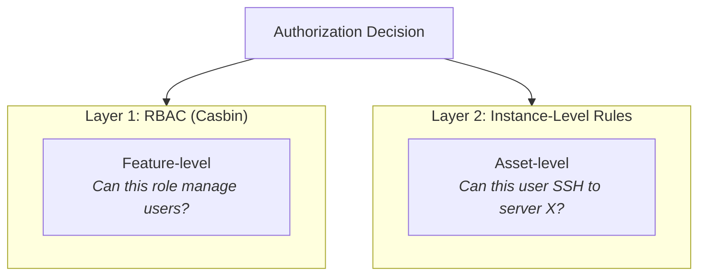

| Layer | Engine | Scope | Example |
|-------|--------|-------|---------|
| **RBAC** | Casbin (model.conf + policy.csv) | Feature access | "Can `role:staff` write `users`?" |
| **Instance-Level** | Diesel DSL queries (access_rules table) | Asset access | "Can user 42 SSH to asset group 'Production'?" |

Both layers are evaluated by a single service (`vauban-access`), which owns all authorization state and exposes it exclusively via IPC.

### 2.2 Service Responsibilities

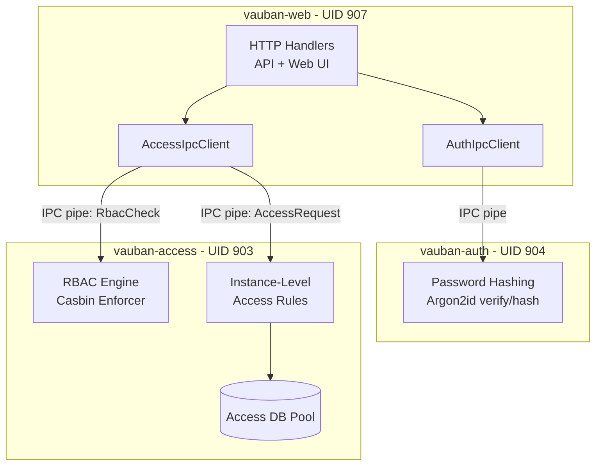

| Service | UID/GID | Responsibilities | Database |
|---------|---------|-----------------|----------|
| `vauban-auth` | 904/904 | Argon2id password hashing and verification | None (stateless) |
| `vauban-access` | 903/903 | Casbin RBAC + instance-level access rules | Dedicated pool (4 connections) |

### 2.3 IPC Topology

Both services participate in the supervisor's pipe topology:

| Pipe | Direction | Status | Purpose |
|------|-----------|--------|---------|
| `web` <-> `auth` | Bidirectional | Implemented | Password verify/hash requests |
| `web` <-> `access` | Bidirectional | Implemented | RBAC checks + access rule CRUD + access evaluation |
| `auth` <-> `access` | Bidirectional | Future | Role verification during authentication |
| `proxy-ssh` <-> `access` | Bidirectional | Future | Session authorization before SSH connect |
| `proxy-rdp` <-> `access` | Bidirectional | Future | Session authorization before RDP connect |

> **Note:** Currently, only the `web <-> auth` and `web <-> access` pipes are implemented. The proxy and cross-service pipes are planned for a future version. Proxy services currently rely on `vauban-web` to perform access checks before brokering connections.

---

## 3. Authentication Service (vauban-auth)

### 3.1 Purpose

`vauban-auth` is a **synchronous, sandboxed service** dedicated to password hashing. By isolating Argon2id operations in a separate process:

- The web process never touches plaintext passwords or hash parameters.
- A compromise of `vauban-web` does not expose the hashing capability.
- Argon2id CPU/memory-intensive operations do not block the async web server.

### 3.2 Supported Operations

| Operation | Request Message | Response Message | Description |
|-----------|----------------|------------------|-------------|
| Verify password | `AuthVerifyPassword` | `AuthVerifyPasswordResponse` | Compare plaintext against stored Argon2id hash |
| Hash password | `AuthHashPassword` | `AuthHashPasswordResponse` | Generate new Argon2id hash from plaintext |
| Authenticate user | `AuthRequest` | `AuthResponse` | Full authentication flow (future: SSO, LDAP) |
| Verify MFA | `MfaVerify` | `MfaVerifyResponse` | TOTP/HOTP code verification (future) |

### 3.3 Argon2id Configuration

Parameters are injected by the supervisor via environment variables before sandbox entry:

| Parameter | Environment Variable | Default | Description |
|-----------|---------------------|---------|-------------|
| Memory cost | `VAUBAN_ARGON2_MEMORY_KB` | 19,456 KB (~19 MB) | Memory usage per hash |
| Iterations | `VAUBAN_ARGON2_ITERATIONS` | 2 | Time cost (number of passes) |
| Parallelism | `VAUBAN_ARGON2_PARALLELISM` | 1 | Degree of parallelism |

These defaults follow the OWASP minimum recommendations for Argon2id. Production deployments typically increase `memory_size_kb` to 65,536 KB (64 MB) via `config/default.toml`.

### 3.4 Password Verification Flow

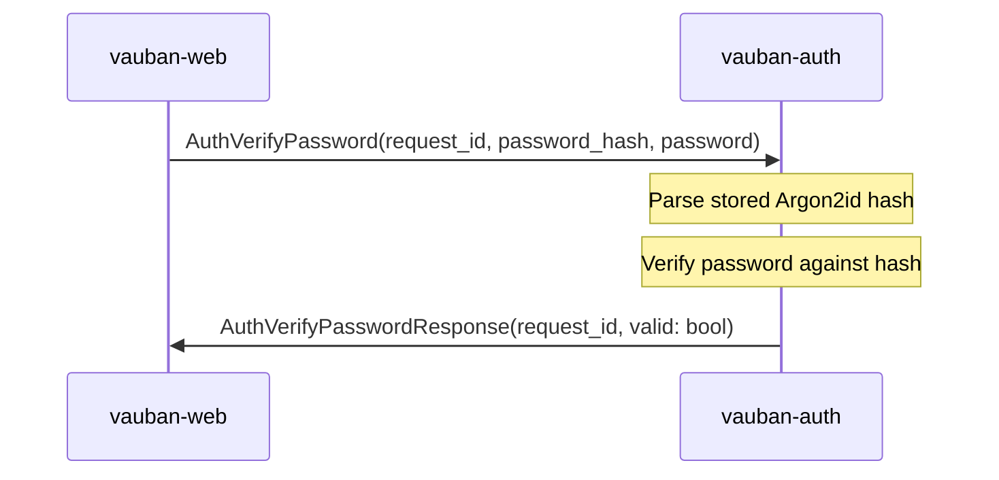

The `password` field uses `SensitiveString`, which:
- Zeroizes backing memory on drop (prevents credential remnants)
- Redacts output in Debug formatting (`[REDACTED]`)
- Is serde-transparent for bincode serialization compatibility

### 3.5 Password Hashing Flow

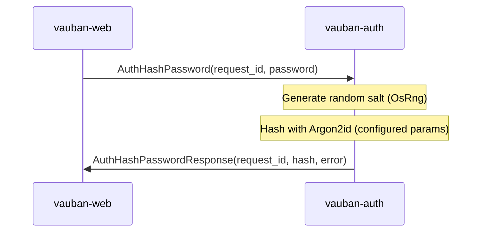

### 3.6 Service Architecture

```rust
// Core service state
struct ServiceState {
    start_time: Instant,
    requests_processed: u64,
    requests_failed: u64,
    draining: bool,
    shutdown_requested: bool,
    argon2_params: Argon2Params,
}
```

The service follows the standard Vauban synchronous service pattern:

1. **Read environment** -- IPC FDs, Argon2 params, topology channels
2. **Clear environment** -- Remove all env vars before sandbox entry
3. **Enter Capsicum sandbox** -- `cap_enter()` on FreeBSD
4. **Main loop** -- `poll(2)` on supervisor + peer channels, dispatch messages

### 3.7 Dependencies

| Crate | Purpose |
|-------|---------|
| `argon2 0.5` | Argon2id password hashing |
| `rand 0.8` | Cryptographic salt generation (OsRng) |
| `shared` | IPC channel, messages, Capsicum wrappers |

`vauban-auth` has **no database dependency** and **no async runtime**. It is purely synchronous and stateless.

---

## 4. Access Control Service (vauban-access)

### 4.1 Purpose

`vauban-access` (formerly `vauban-rbac`) is the **centralized authorization service**. It handles two distinct concerns:

1. **Feature-level RBAC** via the Casbin policy engine (role-based checks like "can this role manage users?")
2. **Instance-level access rules** via Diesel DSL queries against its dedicated database (asset-level checks like "can this user SSH to this asset group?")

### 4.2 Evolution from vauban-rbac

| Aspect | v0.3.0 (vauban-rbac) | v0.4.0 (vauban-access) |
|--------|---------------------|----------------------|
| Name | `vauban-rbac` | `vauban-access` |
| Service enum | `Service::Rbac` | `Service::Access` |
| Config section | `[rbac]` | `[access]` |
| Config directory | `config/rbac/` | `config/access/` |
| Capabilities | Casbin RBAC only | Casbin RBAC + instance-level access rules |
| Database | None | Dedicated pool (4 connections) |
| Tables owned | None | `access_rules`, `vauban_groups`, `asset_groups`, `user_groups` |
| IPC messages | `RbacCheck` / `RbacResponse` | `RbacCheck` + 25 `AccessRequest` + 17 `AccessResponse` variants |

### 4.3 Dual-Engine Architecture

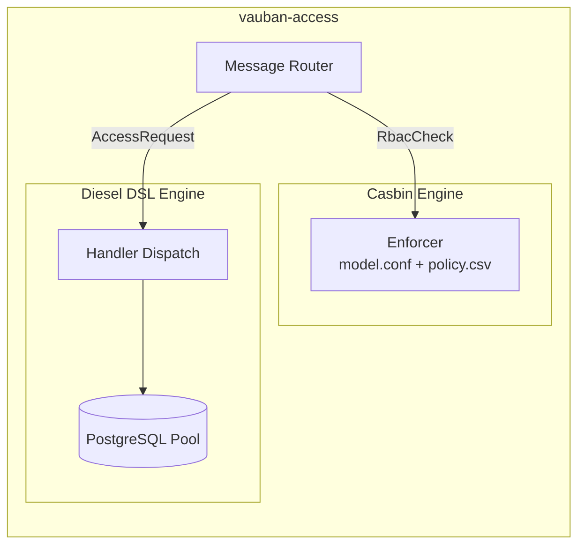

### 4.4 Service State

```rust
struct ServiceState {
    start_time: Instant,
    requests_processed: u64,
    requests_failed: u64,
    draining: bool,
    shutdown_requested: bool,
    enforcer: Option<Enforcer>,           // Casbin policy engine
    db_pool: Option<db::DbPool>,          // Async PG pool (diesel-async)
    rt: Option<tokio::runtime::Runtime>,  // Single-threaded Tokio RT
}
```

Unlike `vauban-auth`, `vauban-access` requires a **minimal Tokio runtime** (`current_thread`) because `diesel-async` requires an async executor for database queries. This runtime is created once at startup and used via `rt.block_on()` in the synchronous main loop.

### 4.5 Startup Sequence

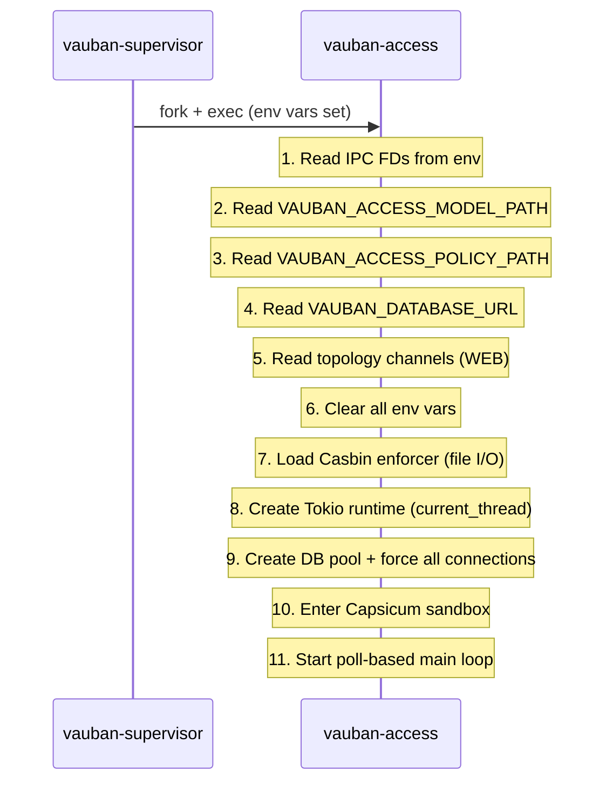

### 4.6 Dependencies

| Crate | Purpose |
|-------|---------|
| `casbin` | RBAC policy engine |
| `diesel` + `diesel-async` | PostgreSQL ORM (async) |
| `deadpool` | Connection pool management |
| `tokio` (rt feature only) | Minimal async runtime for diesel-async |
| `chrono`, `uuid` | Timestamp and UUID handling |
| `shared` | IPC channel, messages, Capsicum wrappers |

---

## 5. RBAC Layer: Casbin Policy Engine

### 5.1 Model Definition

The Casbin model uses a standard RBAC pattern with wildcards:

```ini
[request_definition]
r = sub, obj, act

[policy_definition]
p = sub, obj, act

[role_definition]
g = _, _

[policy_effect]
e = some(where (p.eft == allow))

[matchers]
m = g(r.sub, p.sub) && (p.obj == "*" || r.obj == p.obj) && (p.act == "*" || r.act == p.act)
```

The matcher supports wildcard matching for both objects and actions, enabling the `superuser` role to have unrestricted access via a single policy line.

### 5.2 Default Policy

```csv
p, role:superuser, *, *
p, role:staff, users, read
p, role:staff, users, write
p, role:staff, assets, read
p, role:staff, assets, write
p, role:staff, sessions, read
p, role:staff, sessions, write
p, role:staff, groups, read
p, role:staff, groups, write
p, role:staff, access_rules, read
p, role:staff, access_rules, write
p, role:staff, admin, view
p, role:user, assets, read
p, role:user, sessions, read
p, role:user, sessions, create
p, role:user, profile, read
p, role:user, profile, write
```

### 5.3 Role Hierarchy

| Role | Capabilities | Typical Usage |
|------|-------------|---------------|
| `role:superuser` | Full access (`*, *`) | System administrators |
| `role:staff` | Manage users, assets, sessions, groups, access rules; view admin UI | IT operators |
| `role:user` | Read assets, read/create sessions, manage own profile | End users connecting to assets |

### 5.4 Evaluation Flow

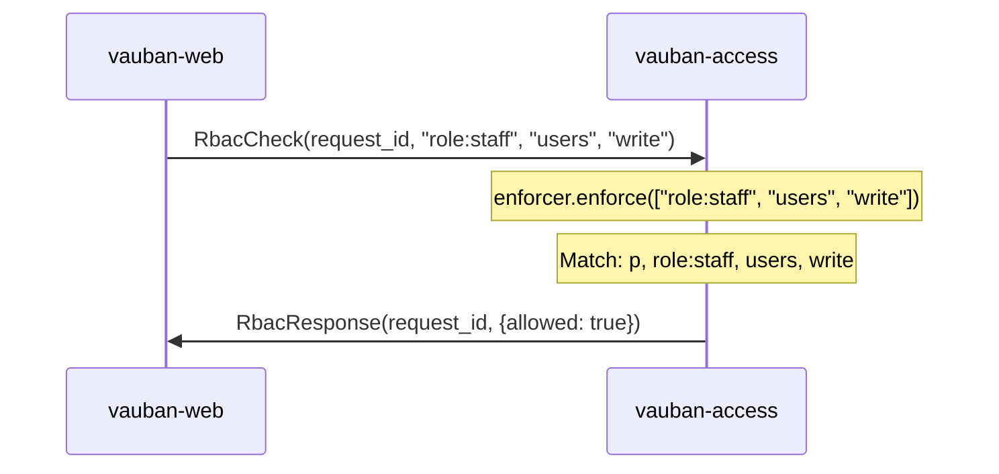

### 5.5 Fallback Behavior

When no Casbin enforcer is loaded (dev mode without supervisor):

| Build Mode | Behavior | Rationale |
|------------|----------|-----------|
| `debug_assertions` (dev) | Allow all requests | Developer convenience |
| Release | Deny all requests | Fail-closed security |

```rust
#[cfg(debug_assertions)]
{
    // Allow all in dev mode
    RbacResult { allowed: true, reason: None }
}
#[cfg(not(debug_assertions))]
{
    // Deny-by-default in production
    RbacResult { allowed: false, reason: Some("RBAC policy engine not configured") }
}
```

### 5.6 RBAC Integration Points

RBAC checks gate access to UI features and API endpoints:

| Resource | Actions | Used By |
|----------|---------|---------|
| `users` | `read`, `write` | User management (list, create, edit, delete) |
| `assets` | `read`, `write` | Asset management |
| `sessions` | `read`, `write`, `create` | Session listing, connection initiation |
| `groups` | `read`, `write` | Group management (vauban_groups, asset_groups) |
| `access_rules` | `read`, `write` | Access rule CRUD |
| `admin` | `view` | Admin sidebar visibility, dashboard |
| `profile` | `read`, `write` | User's own profile management |

---

## 6. Instance-Level Access Control

### 6.1 Concept

While RBAC controls *feature* access ("can this role manage users?"), instance-level access controls *asset* access ("can this specific user connect to this specific server via SSH?").

Access rules link **user groups** to **asset groups** with constraints:

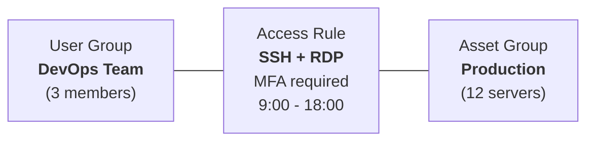

### 6.2 Access Rule Properties

| Property | Type | Description |
|----------|------|-------------|
| `name` | varchar(100) | Human-readable rule name |
| `description` | text | Optional description |
| `user_group_id` | FK -> vauban_groups | Group of users this rule applies to |
| `asset_group_id` | FK -> asset_groups | Group of assets this rule grants access to |
| `allowed_protocols` | text[] | List of allowed protocols: `ssh`, `rdp` |
| `valid_from` | timestamptz | Start of validity window (NULL = no start constraint) |
| `valid_until` | timestamptz | End of validity window (NULL = no end constraint) |
| `require_mfa` | bool | Whether MFA is required for connections |
| `require_approval` | bool | Whether admin approval (JIT) is required before connection |
| `max_session_duration` | int | Maximum session duration in minutes (NULL = unlimited) |
| `is_active` | bool | Whether the rule is currently active |
| `priority` | int | Priority for conflict resolution (higher = more important) |

### 6.3 Evaluation Logic

When a user attempts to connect to an asset, `vauban-access` evaluates access by:

1. **Identify asset group**: The target asset belongs to an `asset_group`
2. **Find matching rules**: Query `access_rules` where:
   - The user is a member of the rule's `user_group` (via `user_groups` join table)
   - The rule's `asset_group_id` matches the target
   - The rule is active (`is_active = true`)
   - The current time falls within `[valid_from, valid_until]`
   - The requested protocol is in `allowed_protocols`
3. **Aggregate constraints**: If any matching rules exist, access is granted with the most restrictive constraints:
   - `require_mfa` = true if **any** matching rule requires MFA
   - `require_approval` = true if **any** matching rule requires approval
   - `max_session_duration` = **minimum** across all matching rules

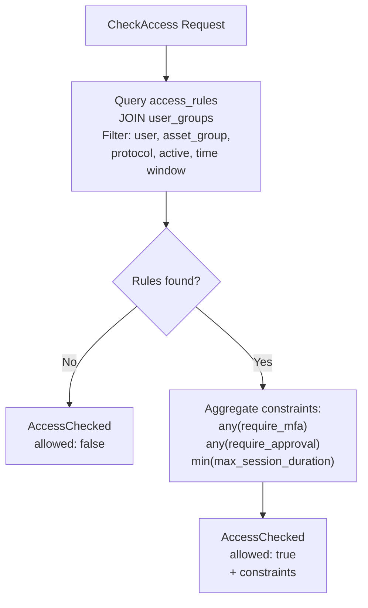

### 6.4 Access Check Query (Diesel DSL)

The core evaluation query uses the Diesel DSL with small `sql::<SqlBool>` fragments for PostgreSQL-specific time window expressions:

```rust
let matching_rules = access_rules::table
    .inner_join(user_groups::table.on(
        user_groups::group_id.eq(access_rules::user_group_id),
    ))
    .filter(user_groups::user_id.eq(user_id))
    .filter(access_rules::asset_group_id.eq(asset_group_id))
    .filter(access_rules::is_active.eq(true))
    .filter(sql::<SqlBool>("(valid_from IS NULL OR valid_from <= NOW())"))
    .filter(sql::<SqlBool>("(valid_until IS NULL OR valid_until >= NOW())"))
    .filter(access_rules::allowed_protocols.contains(vec![Some(protocol.to_string())]))
    .select((
        access_rules::require_mfa,
        access_rules::require_approval,
        access_rules::max_session_duration,
    ))
    .load::<(bool, bool, Option<i32>)>(conn)
    .await;
```

All CRUD operations in `vauban-access` use the Diesel DSL exclusively. The only raw SQL fragments are the `valid_from`/`valid_until` time window checks, which use `sql::<SqlBool>` because Diesel does not have a native DSL expression for `IS NULL OR column <= NOW()` in a single filter.

### 6.5 Accessible Groups Listing

For the asset list UI, `vauban-access` can return all asset groups a user has access to, along with the allowed protocols for each:

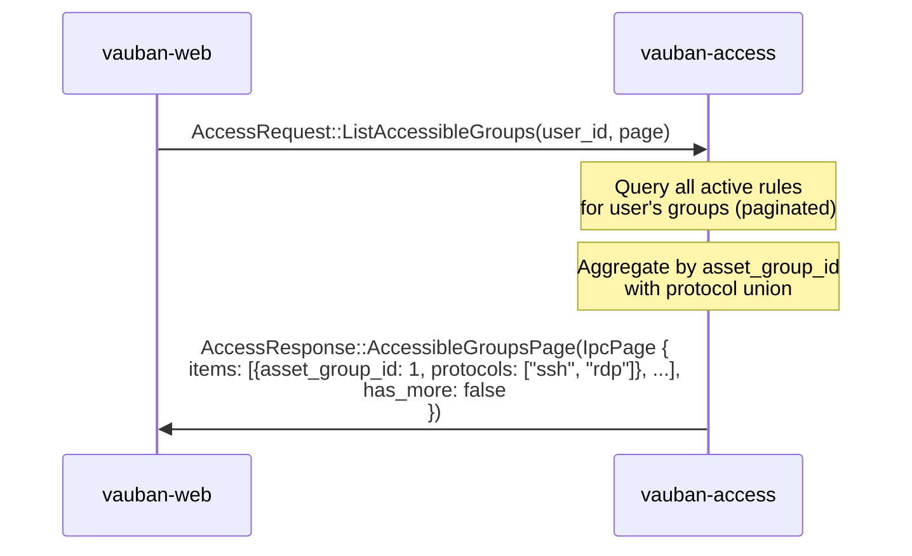

Results are paginated via `IpcPageParams`. The web client iterates pages until `has_more` is `false` to collect the full list of accessible groups.

This enables the web UI to filter the asset list, showing only assets the user can actually connect to, with the appropriate protocol buttons.

---

## 7. Database Schema

### 7.1 Table Ownership

`vauban-access` exclusively owns four tables that can optionally reside in a **separate PostgreSQL instance** from `vauban-web`:

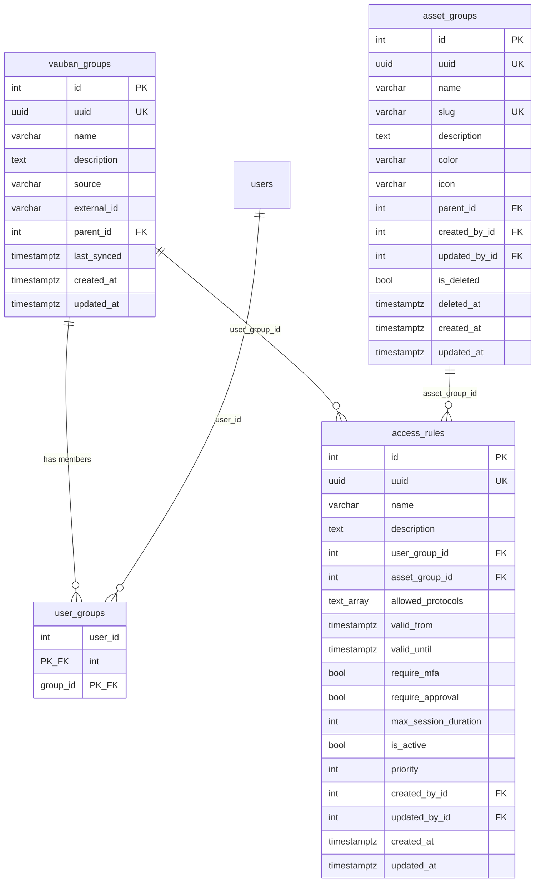

### 7.2 Database Separation

The FK from `assets.group_id` to `asset_groups(id)` was deliberately dropped (migration `20260312000000_drop_asset_group_fk`) to enable running `vauban-access` against a separate PostgreSQL instance:

```sql
-- Enable DB separation: referential integrity enforced at application/IPC level
ALTER TABLE assets DROP CONSTRAINT IF EXISTS assets_group_id_fkey;
```

This design allows:
- `vauban-web` to have its own database with user/asset/session tables
- `vauban-access` to have a dedicated database with group/rule tables
- Cross-references resolved via IPC rather than SQL JOINs

### 7.3 vauban_groups (User Groups)

User groups support both local and external sources:

| Field | Description |
|-------|-------------|
| `source` | `"local"` for manually created groups, or `"ldap"`, `"oidc"` for synced groups |
| `external_id` | Original identifier in the external directory |
| `last_synced` | Timestamp of the last directory sync |
| `parent_id` | Hierarchical group nesting (future) |

### 7.4 access_rules Indexes

```sql
CREATE INDEX idx_access_rules_uuid ON access_rules(uuid);
CREATE INDEX idx_access_rules_user_group ON access_rules(user_group_id);
CREATE INDEX idx_access_rules_asset_group ON access_rules(asset_group_id);
CREATE INDEX idx_access_rules_active ON access_rules(is_active) WHERE is_active = true;
```

The partial index on `is_active` optimizes the most frequent query pattern (evaluating active rules during connection attempts).

---

## 8. IPC Protocol

### 8.1 Authentication Messages

```rust
// Web -> Auth: Verify a password against a stored hash
AuthVerifyPassword {
    request_id: u64,
    password_hash: String,         // Stored Argon2id hash
    password: SensitiveString,     // Plaintext password (zeroized on drop)
}
AuthVerifyPasswordResponse {
    request_id: u64,
    valid: bool,
}

// Web -> Auth: Hash a new password
AuthHashPassword {
    request_id: u64,
    password: SensitiveString,
}
AuthHashPasswordResponse {
    request_id: u64,
    hash: Option<String>,          // Argon2id hash string
    error: Option<String>,
}

// Web -> Auth: Full authentication (future: SSO, LDAP)
AuthRequest {
    request_id: u64,
    username: String,
    credential: Vec<u8>,
    source_ip: IpAddr,
}
AuthResponse {
    request_id: u64,
    result: AuthResult,            // Success | Failure | MfaRequired
}

// Web -> Auth: MFA verification (future)
MfaVerify {
    request_id: u64,
    challenge_id: String,
    code: String,
}
MfaVerifyResponse {
    request_id: u64,
    success: bool,
    session_id: Option<String>,
}
```

### 8.2 RBAC Messages

```rust
// Web/Proxy -> Access: Feature-level authorization check
RbacCheck {
    request_id: u64,
    subject: String,   // e.g., "role:staff"
    object: String,    // e.g., "users"
    action: String,    // e.g., "write"
}
RbacResponse {
    request_id: u64,
    result: RbacResult {
        allowed: bool,
        reason: Option<String>,
    },
}
```

### 8.3 Access Control Messages

The `AccessRequest` enum contains **25 variants** and `AccessResponse` contains **17 variants**, organized into six categories. Most list operations accept an `IpcPageParams { limit, offset }` parameter for cursor-based pagination and return `IpcPage<T> { items, has_more }` responses:

#### Evaluation

| Request | Response | Description |
|---------|----------|-------------|
| `CheckAccess { user_id, asset_group_id, protocol }` | `AccessChecked(AccessCheckResult)` | Evaluate if a user can access an asset group with a protocol |
| `CheckAccessMulti { user_id, asset_group_ids, protocol }` | `AccessCheckedMulti(Vec<AccessCheckResultEntry>)` | Batch-evaluate access for multiple asset groups in a single query |
| `ListAccessibleGroups { user_id, page }` | `AccessibleGroupsPage(IpcPage<AccessibleGroupEntry>)` | List all accessible asset groups for a user (paginated) |

#### Access Rule CRUD

| Request | Response | Description |
|---------|----------|-------------|
| `CreateAccessRule { data }` | `AccessRule(Result<AccessRuleInfo, String>)` | Create a new access rule |
| `GetAccessRule { uuid }` | `AccessRule(Result<AccessRuleInfo, String>)` | Get rule by UUID |
| `ListAccessRules { page }` | `AccessRulePage(IpcPage<AccessRuleInfo>)` | List rules (paginated) |
| `UpdateAccessRule { uuid, data }` | `AccessRule(Result<AccessRuleInfo, String>)` | Update existing rule |
| `DeleteAccessRule { uuid }` | `Deleted(Result<(), String>)` | Delete rule |

#### User Group CRUD

| Request | Response | Description |
|---------|----------|-------------|
| `CreateVaubanGroup { name, description }` | `VaubanGroup(Result<VaubanGroupInfo, String>)` | Create user group |
| `GetVaubanGroup { uuid }` | `VaubanGroup(Result<VaubanGroupInfo, String>)` | Get group by UUID |
| `GetVaubanGroupById { id }` | `VaubanGroup(Result<VaubanGroupInfo, String>)` | Get group by integer ID |
| `ListVaubanGroups { page }` | `VaubanGroupPage(IpcPage<VaubanGroupInfo>)` | List user groups (paginated) |
| `UpdateVaubanGroup { uuid, name, description }` | `VaubanGroup(Result<VaubanGroupInfo, String>)` | Update group |
| `DeleteVaubanGroup { uuid }` | `Deleted(Result<(), String>)` | Delete group |

#### Group Membership

| Request | Response | Description |
|---------|----------|-------------|
| `AddGroupMember { group_id, user_id }` | `Ok` | Add user to group |
| `RemoveGroupMember { group_id, user_id }` | `Ok` | Remove user from group |
| `ListGroupMembers { group_id, page }` | `MemberListPage(IpcPage<i32>)` | List member user IDs (paginated) |
| `ListUserGroups { user_id, page }` | `UserGroupPage(IpcPage<VaubanGroupInfo>)` | List groups for a user (paginated) |

#### Asset Group CRUD

| Request | Response | Description |
|---------|----------|-------------|
| `CreateAssetGroup { name, slug, description, color, icon }` | `AssetGroup(Result<AssetGroupInfo, String>)` | Create asset group |
| `GetAssetGroup { uuid }` | `AssetGroup(Result<AssetGroupInfo, String>)` | Get asset group |
| `ListAssetGroups { page }` | `AssetGroupPage(IpcPage<AssetGroupInfo>)` | List asset groups (paginated) |
| `UpdateAssetGroup { uuid, ... }` | `AssetGroup(Result<AssetGroupInfo, String>)` | Update asset group |
| `DeleteAssetGroup { uuid }` | `Deleted(Result<(), String>)` | Delete asset group |

#### Group Options (Form Dropdowns)

| Request | Response | Description |
|---------|----------|-------------|
| `ListUserGroupOptions { page }` | `UserGroupOptionsPage(IpcPage<GroupOption>)` | Minimal user group list for dropdowns (paginated) |
| `ListAssetGroupOptions { page }` | `AssetGroupOptionsPage(IpcPage<GroupOption>)` | Minimal asset group list for dropdowns (paginated) |

### 8.4 Data Types

```rust
/// Pagination parameters for IPC list requests.
pub struct IpcPageParams {
    pub limit: u32,   // 0 = use DEFAULT_IPC_PAGE_LIMIT (256)
    pub offset: u32,
}

/// One page of list results from vauban-access.
pub struct IpcPage<T> {
    pub items: Vec<T>,
    pub has_more: bool,
}

/// Result of an instance-level access check.
pub struct AccessCheckResult {
    pub allowed: bool,
    pub require_mfa: bool,
    pub require_approval: bool,
    pub max_session_duration: Option<i32>,
}

/// Entry for batch access check (CheckAccessMulti).
pub struct AccessCheckResultEntry {
    pub asset_group_id: i32,
    pub result: AccessCheckResult,
}

/// Full info about an access rule.
pub struct AccessRuleInfo {
    pub uuid: String,
    pub name: String,
    pub description: Option<String>,
    pub user_group_id: i32,
    pub user_group_uuid: String,
    pub user_group_name: String,
    pub asset_group_id: i32,
    pub asset_group_uuid: String,
    pub asset_group_name: String,
    pub allowed_protocols: Vec<String>,
    pub valid_from: Option<String>,
    pub valid_until: Option<String>,
    pub require_mfa: bool,
    pub require_approval: bool,
    pub max_session_duration: Option<i32>,
    pub is_active: bool,
    pub priority: i32,
    pub created_at: String,
    pub updated_at: String,
}

/// Info about a user group.
pub struct VaubanGroupInfo {
    pub id: i32,
    pub uuid: String,
    pub name: String,
    pub description: Option<String>,
    pub source: String,          // "local", "ldap", "oidc"
    pub external_id: Option<String>,
    pub created_at: String,
    pub updated_at: String,
    pub last_synced: Option<String>,
    pub member_count: i64,
}

/// Info about an asset group.
pub struct AssetGroupInfo {
    pub id: i32,
    pub uuid: String,
    pub name: String,
    pub slug: String,
    pub description: Option<String>,
    pub color: String,
    pub icon: String,
    pub created_at: String,
    pub updated_at: String,
}

/// Minimal group info for form dropdown options.
pub struct GroupOption {
    pub id: i32,
    pub uuid: String,
    pub name: String,
}
```

---

## 9. Web Integration

### 9.1 IPC Clients

`vauban-web` communicates with auth and access services via async IPC clients that bridge the Tokio-based web server with synchronous pipe-based services.

#### AuthIpcClient

```rust
// Usage in login handler
let valid = state.auth_client
    .verify_password(password, &user.password_hash)
    .await?;

// Usage in user creation/password change
let hash = state.auth_client
    .hash_password(new_password)
    .await?;
```

#### AccessIpcClient

```rust
// RBAC check in handler middleware
let allowed = state.access_client
    .check_permission("role:staff", "users", "write")
    .await?;

// Instance-level access check before SSH/RDP connection
let result = state.access_client
    .check_access(user_id, asset_group_id, "ssh")
    .await?;

// Access rule CRUD (delegated to vauban-access)
let rules = state.access_client
    .list_access_rules()
    .await?;
```

### 9.2 IPC Client Architecture

Both clients follow the same pattern:

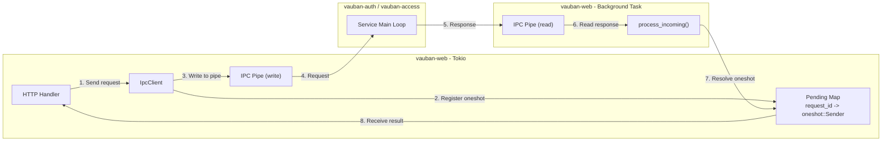

Key design elements:
- **Request/response correlation** via monotonically increasing `request_id`
- **Async bridging** via `tokio::sync::oneshot` channels
- **Non-blocking pipe I/O** via `tokio::io::unix::AsyncFd`
- **Background task** (`process_incoming()`) continuously reads the pipe and dispatches responses

### 9.3 No SQL Fallback — vauban-web is IPC-only

Earlier revisions of Vauban shipped a dual-path design in which `vauban-web`
could degrade to direct SQL access (and a `#[cfg(debug_assertions)]` allow-all
RBAC stub) when the IPC clients were unavailable. This fallback has been
**removed entirely**: Casbin is the single source of truth for authorization,
and `vauban-web` cannot run standalone.

| Operation | Current behavior |
|-----------|----------|
| Password verify | `AuthIpcClient::verify_password()` (mandatory) |
| Password hash | `AuthIpcClient::hash_password()` (mandatory) |
| RBAC check | `AccessIpcClient::check_permission()` → Casbin `enforce()` in `vauban-access` |
| Access check | `AccessIpcClient::check_access()` (mandatory) |
| Access rule CRUD | `AccessIpcClient::create_access_rule()` etc. (mandatory) |
| Vauban / asset groups CRUD | IPC calls to `vauban-access` (mandatory) |

Concretely:

1. `vauban-web`'s `init_access_client()` **hard-fails at startup** unless both
   `VAUBAN_ACCESS_IPC_READ` and `VAUBAN_ACCESS_IPC_WRITE` are set and point to
   live pipes. The process exits before opening its HTTP listener.
2. `AppState::access_client` is typed `Arc<AccessIpcClient>`, not
   `Option<_>`. There is no code path left in production where it can be
   `None`.
3. `check_rbac()` (`vauban-web/src/auth/permissions.rs`) calls Casbin via IPC
   and fails closed on any IPC error. It never short-circuits on
   `is_superuser`/`is_staff`: those attributes are only used to pick the
   subject (`role:superuser`, `role:staff`, `role:user`) that Casbin then
   evaluates against the policy file.
4. `vauban-access` itself hard-fails at startup if
   `VAUBAN_ACCESS_MODEL_PATH` or `VAUBAN_ACCESS_POLICY_PATH` are missing, and
   denies every check at runtime if — through an unexpected test-only path —
   the enforcer is `None`.
5. Integration tests spin up an in-process `vauban-access` backed by a real
   `casbin::Enforcer` loaded from
   `config/access/{model.conf,default_policy.csv}`. Tests exercise the actual
   Casbin policy, not a mock.

Consequences:

- **vauban-web cannot be executed in standalone mode.** It must be launched
  by `vauban-supervisor`, which spawns `vauban-auth` and `vauban-access` and
  wires up the IPC channels via pre-opened file descriptors.
- Attempting to run `./target/debug/vauban-web` directly terminates with an
  explicit error referencing the missing IPC environment variables.
- Local development and CI therefore always exercise the same authorization
  path as production.

### 9.4 Asset List Filtering

The web UI filters the asset list based on instance-level access:

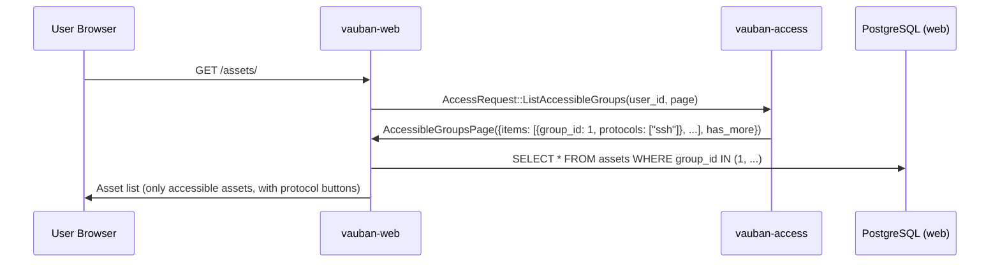

Superusers and staff see all assets; regular users see only assets in groups they have access to via active access rules.

### 9.5 CSRF Protection

Access rule forms use the Alpine.js double-submit cookie pattern for CSRF protection:

1. Server generates a CSRF token and sets it as a cookie
2. Alpine.js reads the cookie and includes the token in the form submission
3. Server validates that the form token matches the cookie token

### 9.6 PermissionContext (Casbin-backed UI gating)

To eliminate hardcoded `is_staff || is_superuser` shortcuts (issue #1) that
silently bypass custom Casbin policies, every authorization decision in
`vauban-web` — both inside Axum handlers and inside Askama templates — flows
through a single `PermissionContext` struct (`vauban-web/src/auth/permissions.rs`).

> **Deployment precondition.** `vauban-web` can only run as a child of
> `vauban-supervisor`, next to `vauban-auth` and `vauban-access`. There is no
> standalone mode: if the IPC channels to `vauban-access` are not wired up at
> startup, `vauban-web` terminates before serving any request. See §9.3.

#### Lifecycle of a request

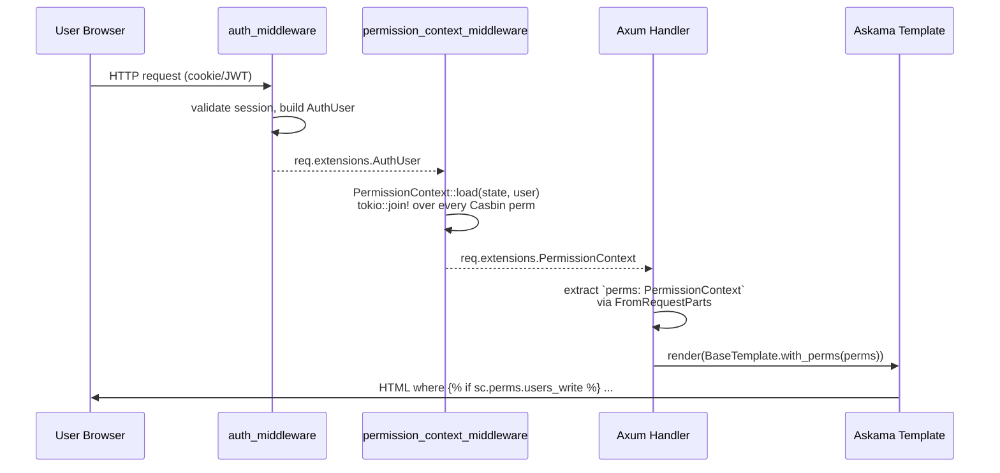

`PermissionContext` is a flat struct of pre-computed booleans
(`users_read`, `users_write`, `groups_read`, `groups_write`,
`access_rules_read`, `access_rules_write`, `assets_read`, `assets_write`,
`admin_view`, `auth_sessions_read`, `auth_sessions_write`,
`sessions_read`, `sessions_write`, `profile_read`, `profile_write`).
All checks for one user happen **once per request**, in parallel via
`tokio::join!`, regardless of how many handlers / template branches read them.

#### Handler usage

```rust
pub async fn user_detail(
    State(state): State<AppState>,
    auth_user: WebAuthUser,
    perms: crate::auth::PermissionContext, // <- extractor
    axum::extract::Path(uuid): axum::extract::Path<String>,
) -> Result<impl IntoResponse, AppError> {
    if !perms.users_read {
        return Err(AppError::Authorization("...".into()));
    }
    let can_edit = perms.users_write && (!is_target_superuser || auth_user.is_superuser);
    // ...
}
```

There is no longer any per-handler `check_rbac(&state, &user, "X", "Y").await`
call: those round-trips are consolidated into the middleware's single parallel
load. Handlers may still inspect `auth_user.is_superuser` for *target-vs-actor*
business rules (e.g. only a superuser may edit another superuser), but never to
gate visibility.

#### Template usage

The sidebar context (`SidebarContentTemplate`) carries a `perms` field of type
`PermissionContext`. Templates gate UI on `sc.perms.<resource>_<action>`:

```askama

  <!-- Administration block -->



  <a href="/accounts/groups">Groups</a>

```

Per-page templates may opt into a `perms: PermissionContext` field of their own
(see `ProfileTemplate`) when a gate is needed outside the sidebar.

`UserContext.is_staff` and `UserContext.is_superuser` remain available **for
display only** (role badges, account-management forms). Using them inside
`` directives to hide actionable controls is forbidden by the
structural lint `vauban-web/scripts/check_no_template_role_gates.sh`, which
detects:

1. The legacy `is_staff || is_superuser` (or symmetric) chain in any
   `if`/`elif` directive.
2. `sc.user.is_staff` / `sc.user.is_superuser` in any `if`/`elif` directive.

#### Why PermissionContext, not ad-hoc checks

| Concern | Old pattern (`is_staff || is_superuser`) | New pattern (`PermissionContext`) |
|---|---|---|
| Custom Casbin policy (e.g. `role:custom` with `users:write` only) | Ignored: UI hides the action even though the server allows it (or vice-versa) | Honoured: UI mirrors the exact server gate |
| Number of round-trips per request | 1 per template branch + 1 per handler check | 1 parallel join per request, regardless of branch count |
| Test coverage | Required redundant `is_staff` flips in fixtures | Single `PermissionContext::default()` plus targeted overrides |
| Drift between server and template | Frequent: easy to gate one but forget the other | Impossible: same struct is consulted on both sides |

---

## 10. Capsicum Sandboxing

### 10.1 vauban-auth Sandbox

`vauban-auth` has the simplest sandbox profile:

| Resource | Capability Rights |
|----------|------------------|
| Supervisor IPC (read) | `CAP_READ`, `CAP_EVENT` |
| Supervisor IPC (write) | `CAP_WRITE` |
| Web peer IPC (read) | `CAP_READ`, `CAP_EVENT` |
| Web peer IPC (write) | `CAP_WRITE` |

No database, no file system, no network. After `cap_enter()`, the process can only hash passwords and communicate via its pre-opened IPC pipes.

### 10.2 vauban-access Sandbox

`vauban-access` has a slightly more complex profile due to its database requirement:

| Resource | Capability Rights |
|----------|------------------|
| Supervisor IPC (read) | `CAP_READ`, `CAP_EVENT` |
| Supervisor IPC (write) | `CAP_WRITE` |
| Web peer IPC (read) | `CAP_READ`, `CAP_EVENT` |
| Web peer IPC (write) | `CAP_WRITE` |
| Database socket | `CAP_READ`, `CAP_WRITE`, `CAP_CONNECT` |

All 4 database connections are pre-established before `cap_enter()`. If a connection is lost post-sandbox, it cannot be re-established.

### 10.3 Pre-Sandbox Resource Loading

Both services load all configuration before entering the sandbox:

| Resource | When Loaded | Service |
|----------|------------|---------|
| Argon2 parameters | From env vars at startup | `vauban-auth` |
| Casbin model + policy files | `DefaultModel::from_file()` before `cap_enter()` | `vauban-access` |
| Database connections | `force_create_all_connections()` before `cap_enter()` | `vauban-access` |
| IPC pipe FDs | From env vars at startup | Both |

---

## 11. Configuration

### 11.1 Supervisor Configuration

The supervisor injects configuration via environment variables at service spawn time:

#### Auth Service Environment

| Variable | Source | Default |
|----------|--------|---------|
| `VAUBAN_IPC_READ` | Supervisor pipe FD | Required |
| `VAUBAN_IPC_WRITE` | Supervisor pipe FD | Required |
| `VAUBAN_WEB_IPC_READ` | Topology channel FD | Optional |
| `VAUBAN_WEB_IPC_WRITE` | Topology channel FD | Optional |
| `VAUBAN_ARGON2_MEMORY_KB` | `[auth].argon2_memory_kb` | 19456 |
| `VAUBAN_ARGON2_ITERATIONS` | `[auth].argon2_iterations` | 2 |
| `VAUBAN_ARGON2_PARALLELISM` | `[auth].argon2_parallelism` | 1 |

#### Access Service Environment

| Variable | Source | Default |
|----------|--------|---------|
| `VAUBAN_IPC_READ` | Supervisor pipe FD | Required |
| `VAUBAN_IPC_WRITE` | Supervisor pipe FD | Required |
| `VAUBAN_WEB_IPC_READ` | Topology channel FD | Optional |
| `VAUBAN_WEB_IPC_WRITE` | Topology channel FD | Optional |
| `VAUBAN_ACCESS_MODEL_PATH` | `[access].model_path` | `config/access/model.conf` |
| `VAUBAN_ACCESS_POLICY_PATH` | `[access].policy_path` | `config/access/default_policy.csv` |
| `VAUBAN_DATABASE_URL` | `[access].database_url` | Optional |

### 11.2 TOML Configuration

Argon2 parameters are configured in two places:

- **`[auth]`** in the supervisor config: read by `vauban-supervisor` and injected as env vars into `vauban-auth` at spawn time. Defaults in Rust code: `19456 KB`, `2 iterations`, `1 parallelism`.
- **`[security.argon2]`** in `config/default.toml`: historically used by `vauban-web` for a local password-hashing fallback. That fallback has been removed alongside the RBAC one; `vauban-web` now always delegates hashing and verification to `vauban-auth`. The section is kept for backward compatibility with older configuration files but has no runtime effect. Production values used by `vauban-auth` remain `65536 KB`, `3 iterations`, `1 parallelism`.

```toml
# config/default.toml

[access]
model_path = "config/access/model.conf"
policy_path = "config/access/default_policy.csv"

[auth]
# Supervisor-side Argon2 parameters (injected into vauban-auth)
# argon2_memory_kb = 19456    # Rust default if section absent
# argon2_iterations = 2
# argon2_parallelism = 1

[security.argon2]
# Historical web-side Argon2 parameters (no longer used: vauban-web always
# delegates hashing and verification to vauban-auth via IPC).
memory_size_kb = 65536
iterations = 3
parallelism = 1
```

### 11.3 Environment Variable Cleanup

Both services clear all environment variables immediately after reading them, before entering the sandbox. This prevents leaked credentials if the process memory is dumped:

```rust
unsafe {
    std::env::remove_var("VAUBAN_IPC_READ");
    std::env::remove_var("VAUBAN_IPC_WRITE");
    std::env::remove_var("VAUBAN_ACCESS_MODEL_PATH");
    std::env::remove_var("VAUBAN_ACCESS_POLICY_PATH");
    std::env::remove_var("VAUBAN_DATABASE_URL");
    // ... all topology channel vars
}
```

---

## 12. Security Analysis

### 12.1 Threat Model

| Threat | Mitigation |
|--------|-----------|
| Web process compromise | Password hashing isolated in `vauban-auth`; authorization logic isolated in `vauban-access` |
| Password hash exposure | Plaintext passwords use `SensitiveString` (zeroize on drop, redacted Debug) |
| Credential remnants in memory | Argon2 params and IPC FDs cleared from env immediately; `SensitiveString` zeroizes on drop |
| Authorization bypass | RBAC deny-by-default in release builds; instance-level access fail-closed on IPC error |
| Policy tampering | Casbin model/policy loaded from files before sandbox; no file access after `cap_enter()` |
| Database injection | All queries use Diesel ORM with parameterized queries |
| Privilege escalation | Services run as separate UIDs (903, 904); Capsicum prevents new resource acquisition |
| IPC spoofing | Unix pipes are process-local; no network exposure |

### 12.2 Defense in Depth

Authorization is enforced at multiple layers:

1. **Web middleware**: RBAC check via `AccessIpcClient::check_permission()` before handler execution
2. **Web handler**: Instance-level access check via `AccessIpcClient::check_access()` before session creation
3. **Proxy service**: Independent access check via direct IPC to `vauban-access` before protocol handshake
4. **Database**: Row-level constraints (UNIQUE, FK, NOT NULL) prevent invalid data

### 12.3 Fail-Closed Behavior

| Scenario | Behavior |
|----------|----------|
| `vauban-auth` unreachable | Login fails (password cannot be verified) |
| `vauban-access` unreachable (RBAC) | Release: all actions denied; Debug: all actions allowed |
| `vauban-access` unreachable (access rules) | Connection denied (fail-closed) |
| Database connection lost in `vauban-access` | `AccessResponse::Error` returned; web shows error page |
| Invalid Casbin policy file | Service fails to start; supervisor does not respawn indefinitely |

### 12.4 Audit Trail

All authorization decisions are logged via the `tracing` framework with structured fields:

```
INFO vauban_access: RBAC check subject="role:staff" object="users" action="write" allowed=true
INFO vauban_access: Access granted user_id=42 asset_group_id=1 protocol="ssh" rule_count=2
INFO vauban_access: Access denied: no matching rules user_id=99 asset_group_id=5 protocol="rdp"
```

---

## 13. Testing Strategy

### 13.1 vauban-auth Tests

| Test Category | Count | Description |
|---------------|-------|-------------|
| ServiceState | 3 | Default values, uptime tracking, Argon2 params |
| Control messages | 2 | Ping/Pong, Drain/DrainComplete |
| Auth request/response | 4 | AuthRequest, MfaVerify, unexpected messages, message routing |
| Argon2id hashing | 3 | Hash + verify, wrong password, invalid hash format |
| Multiple requests | 1 | Sequential request processing |
| ServiceStats | 1 | Statistics tracking |
| Graceful shutdown regression | 7 | No `process::exit()`, shutdown flag, main loop checks, env var cleanup, structural patterns |

### 13.2 vauban-access Tests

| Test Category | Count | Description |
|---------------|-------|-------------|
| Service state | 1 | Default values |
| Control messages | 3 | Ping/Pong, Drain, Control via handle_message |
| RBAC hard-fail | 1 | `load_casbin_enforcer()` errors out when model/policy paths are missing |
| Casbin enforcer | 8 | Load success/failure, superuser wildcard, staff permissions, user restrictions, unknown role denial |
| Request ID preservation | 1 | Response echoes request_id correctly |
| Counter tracking | 1 | requests_processed incremented per check |
| Structural regression | 4 | cfg(debug_assertions) guard, Casbin integration, graceful shutdown patterns |

### 13.3 Handler Tests (vauban-access)

Database integration tests in `vauban-access/src/handlers.rs`:

| Test Category | Count | Description |
|---------------|-------|-------------|
| Vauban group CRUD | 6 | Create, get, get not found, list, delete, pagination equivalence |
| Asset group CRUD | 5 | Create, list, pagination equivalence, offset beyond end, many pages volume test |
| Access rule CRUD | 3 | Create, list, pagination equivalence |
| Membership | 3 | Add/list/remove members, member pagination equivalence, user groups pagination equivalence |
| Access evaluation | 4 | Denied (no rule), allowed, wrong protocol denied, CheckAccessMulti with constraint merging |
| Accessible groups | 3 | List with protocol aggregation, pagination equivalence, multi-rule protocol merge |
| Group options | 3 | User group options, asset group options, pagination equivalence |
| Edge cases | 4 | Empty page has_more=false, limit zero uses default, max limit clamped, exact page boundary |

### 13.4 Web Integration Tests

Tests in `vauban-web/tests/`:

| Test File | Scope |
|-----------|-------|
| `api/access_rules_test.rs` | REST API CRUD for access rules |
| `api/access_control_test.rs` | API-level access control enforcement |
| `web/access_rules_crud_web_test.rs` | Web form CRUD for access rules |
| `web/access_control_web_test.rs` | Web UI access control enforcement |
| `ipc/access_ipc_test.rs` | IPC client communication with vauban-access |
| `security/security_test.rs` | RBAC guard enforcement across all endpoints |

---

## 14. Architecture Decisions

### 14.1 Summary of Key Decisions

| Decision | Choice | Rationale |
|----------|--------|-----------|
| Separate auth service | Dedicated `vauban-auth` | Isolate cryptographic operations from web process |
| Unified access service | `vauban-access` = RBAC + instance-level | Single source of truth for all authorization decisions |
| Casbin for RBAC | File-based policy engine | Auditable, configurable without code changes, proven engine |
| Diesel DSL for instance-level | Diesel-async + PostgreSQL | Compile-time verified queries (JOINs, array containment); `sql::<SqlBool>` fragments for time window checks |
| Async runtime in sync service | Single-threaded Tokio | Required by `diesel-async`; minimal overhead in current_thread mode |
| SensitiveString | Custom zeroizing wrapper | Prevent credential leaks in logs and memory dumps |
| Drop FK for DB separation | `ALTER TABLE assets DROP CONSTRAINT` | Enable separate PostgreSQL instances for web and access data |
| No dual fallback mode | Casbin mandatory at runtime | Avoid drift between dev and prod; Casbin is the single source of truth |
| Priority-based rules | `priority` column | Explicit conflict resolution for overlapping access rules |
| Protocol-level granularity | `text[]` column | Single rule can grant SSH but not RDP (or vice versa) |

### 14.2 Why Not Separate RBAC and Instance-Level Services?

Combining both authorization layers in `vauban-access` was chosen over two separate services because:

1. **Single authorization authority**: All "can user X do Y?" questions go to one service, simplifying the architecture
2. **Fewer IPC pipes**: One pipe pair instead of two reduces topology complexity
3. **Shared context**: Instance-level checks may need role information (future), avoiding cross-service IPC
4. **Operational simplicity**: One service to monitor, one database to manage

### 14.3 Why Argon2id in a Separate Service?

Password hashing is isolated in `vauban-auth` rather than inline in `vauban-web` because:

1. **CPU isolation**: Argon2id is intentionally CPU/memory-intensive; isolating it prevents DoS against the web server
2. **Memory safety**: Password material (plaintext + hash) never enters the web process address space
3. **Principle of least privilege**: The web process does not need the ability to hash passwords
4. **Future expansion**: `vauban-auth` will handle SSO (OIDC/SAML), LDAP sync, and advanced MFA, which benefit from dedicated process isolation

### 14.4 Why a Tokio Runtime in a "Synchronous" Service?

`vauban-access` uses a single-threaded Tokio runtime despite being classified as a synchronous service because:

1. `diesel-async` (the async Diesel adapter) requires an async executor
2. The `current_thread` runtime has minimal overhead (no thread pool, no work stealing)
3. Casbin's `DefaultModel::from_file()` is also async (uses tokio::fs)
4. The runtime is used exclusively via `block_on()` in the synchronous main loop, maintaining the sequential request processing guarantee

---

## 15. Just-In-Time (JIT) Access Approval

### 15.1 Overview

JIT access adds an approval workflow to the instance-level access control described in Section 6. When an access rule has `require_approval = true`, users must submit a justified request that an administrator approves before they can connect. Approved sessions can be time-limited via `max_session_duration`, which is enforced at runtime by an automatic cleanup task.

### 15.2 Session Lifecycle

| Step | Trigger | Status | `connected_at` | `expires_at` |
|------|---------|--------|----------------|--------------|
| 1. Access request | User submits justification on asset detail page | `pending` | NULL | NULL |
| 2. Admin approval | Staff/superuser approves via sessions UI | `approved` | NULL | NULL |
| 3. Connection initiation | User clicks "Connect SSH/RDP" | `connecting` | NULL | NULL |
| 4. WebSocket established | Terminal/RDP WebSocket opens | `active` | `now()` | `now() + max_session_duration` (or NULL) |
| 5a. Voluntary disconnect | User closes terminal or RDP tab | `disconnected` | preserved | preserved |
| 5b. Duration exceeded | Cleanup task detects `expires_at <= now()` | `terminated` | preserved | preserved |
| 5c. Admin termination | Staff terminates session via UI | `terminated` | preserved | preserved |
| 6. Request expired | Pending request older than 24h (TTL) | `expired` | NULL | NULL |

### 15.3 Duration Source and Resolution

The `max_session_duration` (in seconds) is defined on the `access_rules` table and configured by administrators when creating or editing an access rule. When multiple rules match a given user/asset/protocol combination, the **shortest** duration wins:

```
max_session_duration = matching_rules.filter_map(|r| r.max_session_duration).min()
```

This value flows through the system as follows:

1. **Access rule** (`access_rules.max_session_duration`) -- source of truth
2. **Access check result** (`AccessCheckResult.max_session_duration`) -- resolved minimum
3. **Pending session** (`proxy_sessions.max_session_duration`) -- stored at request time
4. **Active session** (`proxy_sessions.expires_at`) -- computed at activation as `connected_at + max_session_duration`

If no rule specifies a duration (all values are NULL), the session has no time limit.

### 15.4 Session Activation

When a WebSocket connection is established for an SSH terminal or RDP desktop, the `activate_proxy_session` function in `websocket.rs`:

1. Reads `max_session_duration` from the proxy session record
2. Sets `status = 'active'` and `connected_at = now()`
3. Computes `expires_at = now() + max_session_duration` (if duration is set)
4. Writes all three fields in a single `UPDATE`

This is the only point in the code that transitions a session to `active` status.

### 15.5 Enforcement

The `terminate_expired_proxy_sessions` cleanup task in `tasks/cleanup.rs` runs every 30 seconds and enforces session duration limits using Diesel DSL:

```rust
diesel::update(proxy_sessions::table)
    .filter(proxy_sessions::status.eq("active"))
    .filter(proxy_sessions::expires_at.le(now))
    .set((
        proxy_sessions::status.eq("terminated"),
        proxy_sessions::disconnected_at.eq(Some(now)),
        proxy_sessions::updated_at.eq(now),
    ))
    .execute(&mut conn)
    .await;
```

Stale pending requests (older than 24 hours) are also expired automatically by `expire_stale_pending_requests` in the same cleanup loop, using the same Diesel DSL pattern:

```rust
diesel::update(proxy_sessions::table)
    .filter(proxy_sessions::status.eq("pending"))
    .filter(proxy_sessions::created_at.lt(cutoff))
    .set((
        proxy_sessions::status.eq("expired"),
        proxy_sessions::updated_at.eq(Utc::now()),
    ))
    .execute(&mut conn)
    .await;
```

### 15.6 Database Columns

The JIT workflow uses four columns added to `proxy_sessions` by migrations `20260328000000_jit_access_columns` and `20260329000000_refactor_jit_columns`:

| Column | Type | Purpose |
|--------|------|---------|
| `approved_by_id` | `INTEGER` (FK -> users) | Administrator who approved the request |
| `approved_at` | `TIMESTAMPTZ` | Timestamp of approval |
| `max_session_duration` | `INTEGER` | Maximum session duration in seconds (from access rule, overridable at approval) |
| `expires_at` | `TIMESTAMPTZ` | Computed deadline (`connected_at + max_session_duration`) |

An index on `(expires_at) WHERE expires_at IS NOT NULL AND status = 'active'` ensures the cleanup query remains efficient as the sessions table grows.

### 15.7 Approval Flow Sequence

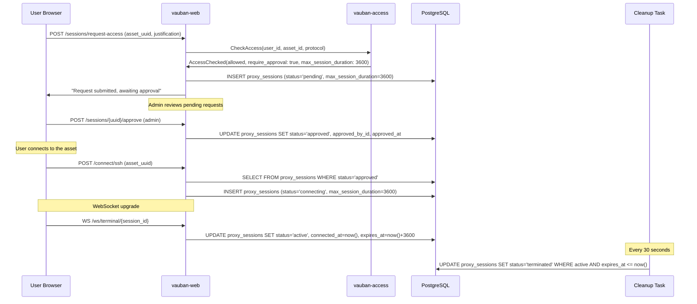

### 15.8 Duration Override at Approval

When approving a JIT access request, administrators can override the default `max_session_duration` that was copied from the access rule at request time. This allows case-by-case adjustments without modifying the underlying access rule.

#### Mechanism

The approval form (`/sessions/approvals` and `/sessions/approvals/{uuid}`) includes optional duration fields:

- **duration_value**: numeric input (minimum 1)
- **duration_unit**: "minutes" or "hours"

When submitted:

1. If both fields are empty, the existing `max_session_duration` is preserved unchanged.
2. If a value is provided, it is converted to seconds and written to `proxy_sessions.max_session_duration`, replacing the original value from the access rule.

#### Priority Chain

```
admin override at approval > access_rule default > unlimited (NULL)
```

#### Validation Constraints

| Constraint | Value |
|------------|-------|
| Minimum duration | 60 seconds (1 minute) |
| Maximum duration | 86,400 seconds (24 hours) |
| Integer overflow | Prevented via `checked_mul` |
| Invalid unit | Rejected with flash error |
| Zero or negative value | Rejected with flash error |

Invalid values cause the approval to fail with a flash error message (PRG pattern redirect), leaving the session in `pending` status so the administrator can retry with a valid duration.

#### Data Flow

```
access_rules.max_session_duration
  -> proxy_sessions.max_session_duration (copied at request time)
  -> [optional] admin override at approval (updates proxy_sessions.max_session_duration)
  -> proxy_sessions.expires_at (computed at WebSocket activation as connected_at + max_session_duration)
  -> cleanup task enforces expires_at
```

---

## Appendix A: Complete Login Flow

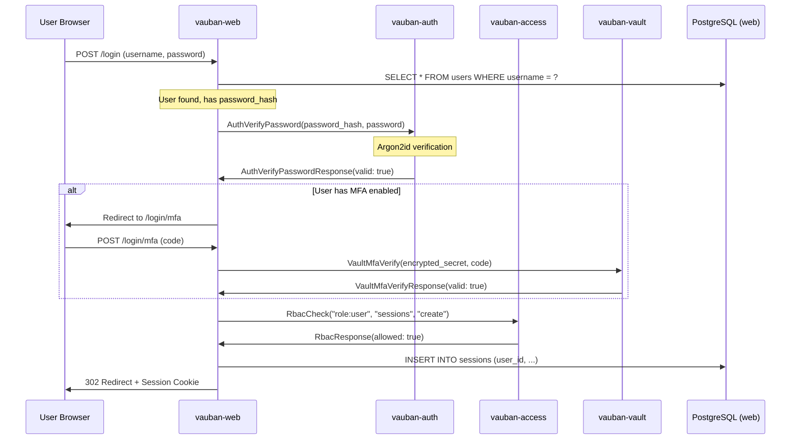

---

## Appendix B: Complete SSH Connection Authorization Flow

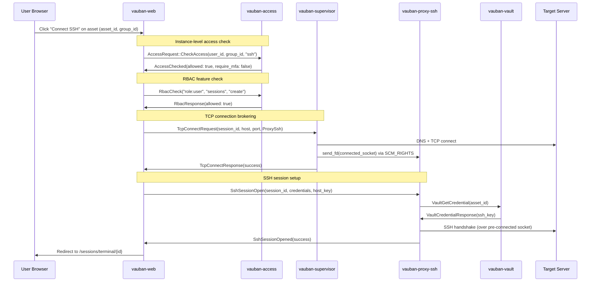

---

## Appendix C: Workspace Structure (IAM-related)

```
/Users/mnemonic/Code/Vauban/
├── config/
│   └── access/
│       ├── model.conf              # Casbin RBAC model definition
│       └── default_policy.csv      # Default three-role policy
├── shared/src/
│   └── messages.rs                 # AccessRequest, AccessResponse, Auth messages
├── vauban-auth/
│   ├── Cargo.toml                  # argon2 0.5, rand 0.8
│   └── src/
│       └── main.rs                 # Auth service (password hash/verify)
├── vauban-access/
│   ├── Cargo.toml                  # casbin, diesel-async, deadpool
│   └── src/
│       ├── main.rs                 # Service entry (Casbin + message dispatch)
│       ├── lib.rs                  # Library crate exports
│       ├── handlers.rs             # 25 AccessRequest handlers (Diesel DSL)
│       └── db.rs                   # Connection pool (sandbox-compatible)
│       # NOTE: Diesel schema is re-exported from vauban-db (pub use vauban_db::schema)
├── vauban-db/src/
│   └── schema.rs                   # Diesel schema (all tables, including access_rules, etc.)
├── vauban-web/
│   ├── src/
│   │   ├── ipc/
│   │   │   ├── auth.rs             # AuthIpcClient (verify/hash)
│   │   │   └── access.rs           # AccessIpcClient (RBAC + access rules)
│   │   ├── services/
│   │   │   ├── rbac.rs             # RbacService wrapper (thin shim over AccessIpcClient; Casbin is the single source of truth)
│   │   │   └── access.rs           # Access service (IPC-only; the Diesel DSL fallback has been removed)
│   │   ├── handlers/
│   │   │   ├── web/access_rules.rs # Web form handlers (CSRF + RBAC)
│   │   │   └── api/access_rules.rs # REST API handlers
│   │   ├── models/
│   │   │   └── access_rule.rs      # Diesel model + API DTOs
│   │   └── templates/assets/
│   │       ├── access_list.rs      # Access rules list template
│   │       ├── access_rule_create.rs
│   │       ├── access_rule_detail.rs
│   │       └── access_rule_edit.rs
│   └── migrations/
│       ├── 20260311000000_access_rules/
│       │   └── up.sql              # CREATE TABLE access_rules
│       └── 20260312000000_drop_asset_group_fk/
│           └── up.sql              # DROP FK for DB separation
└── vauban-supervisor/src/
    └── config.rs                   # AuthConfig, AccessConfig
```

---
