# Vauban IAM Architecture

**Version:** 1.1  
**Date:** 24 July 2026  
**Author:** Richard Ben Aleya

> Supersedes
> [Vauban_IAM_Architecture_EN(1.0).md](Vauban_IAM_Architecture_EN(1.0).md).
>
> **1.1 factual repayment (architecture scorecard §9.2 / §10.15):** Casbin
> enforcer absent is **fail-closed** in all builds (no debug allow-all stub);
> RBAC catalogue matches `PermissionContext` / BAC nests (`assets:manage`,
> user-groups vs asset-groups); `vauban-access` has **5** TOPOLOGY peers
> (incl. `proxy_iacs`); web / AccessGuard IPC via `CorrelatedIpcCore`;
> session-open policy eval **3→2** (0.9.27).

---

## Table of Contents

1. [Introduction](#1-introduction)
2. [Architecture Overview](#2-architecture-overview)
3. [Authentication Service (vauban-auth)](#3-authentication-service-vauban-auth)
4. [Access Control Service (vauban-access)](#4-access-control-service-vauban-access)
5. [RBAC Layer: Casbin Policy Engine](#5-rbac-layer-casbin-policy-engine)
6. [Instance-Level Access Control](#6-instance-level-access-control)
7. [Database Schema](#7-database-schema)
8. [IPC Protocol](#8-ipc-protocol)
9. [Web Integration](#9-web-integration)
10. [Capsicum Sandboxing](#10-capsicum-sandboxing)
11. [Configuration](#11-configuration)
12. [Security Analysis](#12-security-analysis)
13. [Testing Strategy](#13-testing-strategy)
14. [Architecture Decisions](#14-architecture-decisions)
15. [Just-In-Time (JIT) Access Approval](#15-just-in-time-jit-access-approval)
16. Appendices: [A — Login Flow](#appendix-a-complete-login-flow), [B — SSH Authorization Flow](#appendix-b-complete-ssh-connection-authorization-flow), [C — Workspace Structure](#appendix-c-workspace-structure-iam-related), [D — Step-Up MFA Flow](#appendix-d-step-up-mfa-flow-password-rotation)

---

## 1. Introduction

### 1.1 Background

Prior to version 0.3.0, Vauban handled authentication and authorization inline within `vauban-web`:

- **Password hashing** (Argon2id) ran inside the web process, exposing cryptographic material to the same address space as HTTPS handlers.
- **Role checks** were hardcoded `is_superuser` / `is_staff` guards scattered across handlers, with no centralized policy engine.
- **Access control** was coarse-grained: users either had access to all assets or none, with no per-protocol or per-asset-group granularity.

### 1.2 Motivation for Change

The migration was driven by three goals:

1. **Privilege Separation**: Move security-critical operations (password hashing, authorization decisions) into dedicated sandboxed processes, following the OpenSSH privsep model documented in [Vauban_Privsep_Architecture_EN(1.3).md](Vauban_Privsep_Architecture_EN(1.3).md).

2. **Centralized Policy Engine**: Replace inline role guards with a Casbin-based RBAC engine that enforces a single policy file, making authorization auditable and configurable without code changes.

3. **Instance-Level Access Control**: Introduce fine-grained authorization linking user groups to asset groups with per-protocol granularity, time-based validity windows, MFA requirements, and priority-based evaluation.

### 1.3 Evolution Timeline

| Version | Milestone | Scope |
|---------|-----------|-------|
| 0.2.x | Inline auth and role checks | All in `vauban-web` |
| 0.3.0 | Dedicated `vauban-auth` and `vauban-rbac` services | Privsep for auth + Casbin RBAC |
| 0.4.0 | Rename `vauban-rbac` to `vauban-access`, add instance-level rules, DB isolation | Full IAM architecture |
| 0.6.0 | Just-In-Time access approval, session duration enforcement | JIT workflow with `expires_at` |
| 0.7.0 | Mandatory TOTP step-up on sensitive operations (issue #11) | Password rotation and user deletion gated by single-use operator TOTP, vault-aware dispatch |
| 0.9.27 | Session-open policy eval 3→2 | Early `IssueSessionToken` carries MFA/JIT/duration; drop redundant `can_access_asset` before connect; AccessGuard kept |
| July 2026 | BAC hardening (admin nests) | `require_users_read` / `require_groups_read` / `require_access_rules_read` / `require_assets_manage` route layers + handler re-checks |

### 1.4 Related Documents

- [Vauban_Privsep_Architecture_EN(1.3).md](Vauban_Privsep_Architecture_EN(1.3).md) -- Pipe topology, Capsicum sandboxing, supervisor architecture
- [Vauban_Vault_Architecture_EN(1.2).md](Vauban_Vault_Architecture_EN(1.2).md) -- Secrets management (MFA secrets, credential encryption)
- [Vauban_RDP_Architecture_EN(1.0).md](Vauban_RDP_Architecture_EN(1.0).md) -- RDP proxy implementation
- [Vauban_AccessGuard_Architecture_EN(1.0).md](Vauban_AccessGuard_Architecture_EN(1.0).md) -- Defense-in-depth RBAC re-check (`shared::access_guard`) shared by every proxy
- [docs/runbooks/ipc_topology_debugging.md](../runbooks/ipc_topology_debugging.md) -- Operational runbook for the proxy <-> access pipe / RBAC re-check failure mode

---

## 2. Architecture Overview

### 2.1 Two-Layer Authorization Model

Vauban implements a **dual-layer** authorization model:

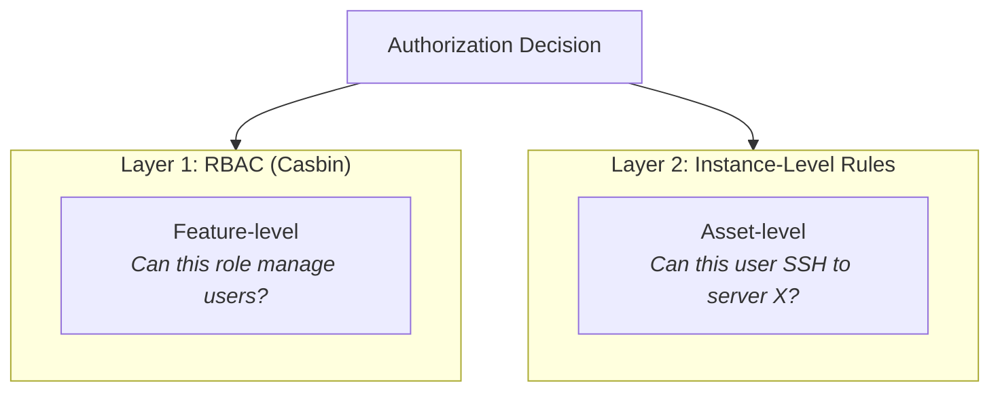

| Layer | Engine | Scope | Example |
|-------|--------|-------|---------|
| **RBAC** | Casbin (model.conf + policy.csv) | Feature access | "Can `role:staff` write `users`?" |
| **Instance-Level** | Diesel DSL queries (access_rules table) | Asset access | "Can user 42 SSH to asset group 'Production'?" |

Both layers are evaluated by a single service (`vauban-access`), which owns all authorization state and exposes it exclusively via IPC.

### 2.2 Service Responsibilities

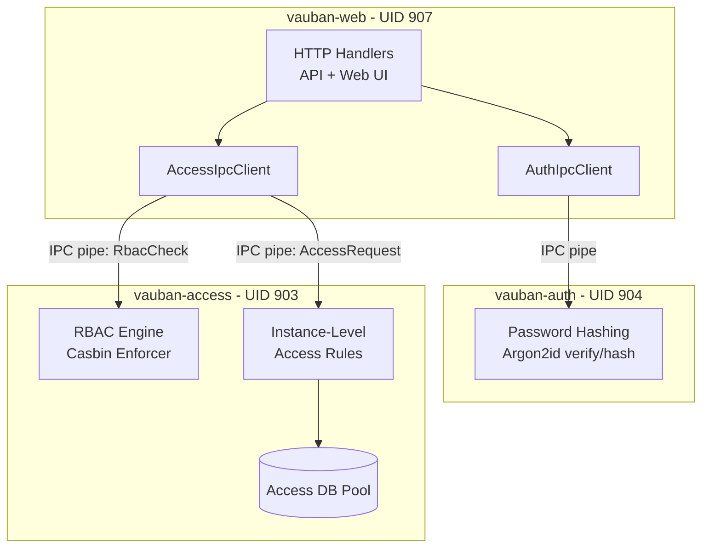

| Service | UID/GID | Responsibilities | Database |
|---------|---------|-----------------|----------|
| `vauban-auth` | 904/904 | Argon2id password hashing and verification | None (stateless) |
| `vauban-access` | 903/903 | Casbin RBAC + instance-level access rules | Dedicated pool (4 connections) |

### 2.3 IPC Topology

Both services participate in the supervisor's pipe topology:

| Pipe | Direction | Status | Purpose |
|------|-----------|--------|---------|
| `web` <-> `auth` | Bidirectional | Implemented | Password verify/hash requests |
| `web` <-> `access` | Bidirectional | Implemented | RBAC checks + access rule CRUD + access evaluation + cryptographic session-token mint (`IssueSessionToken`) |
| `auth` <-> `access` | Bidirectional | Future | Role verification during authentication |
| `proxy-ssh` <-> `access` | Bidirectional | **Implemented** (defense-in-depth re-check) | Session authorization re-check before SSH connect — see [Vauban_AccessGuard_Architecture_EN(1.0).md](Vauban_AccessGuard_Architecture_EN(1.0).md) |
| `proxy-rdp` <-> `access` | Bidirectional | **Implemented** (defense-in-depth re-check) | Session authorization re-check before RDP connect — see [Vauban_AccessGuard_Architecture_EN(1.0).md](Vauban_AccessGuard_Architecture_EN(1.0).md) |
| `proxy-iacs` <-> `access` | Bidirectional | **Implemented** (defense-in-depth re-check) | Session authorization re-check before IACS tunnel open — same AccessGuard path |

`vauban-access` boot-pins **five** incoming TOPOLOGY peers
(`web`, `auth`, `proxy_ssh`, `proxy_rdp`, `proxy_iacs`;
`EXPECTED_PEER_COUNT = 5`). Missing peers → `bail!` at startup.

> **Defense-in-depth model.** Proxies (`vauban-proxy-ssh`, `vauban-proxy-rdp`,
> and `vauban-proxy-iacs`) independently re-check authorization against
> `vauban-access` (via `AccessRequest::CheckAccessByUuid`) before opening any
> upstream session, regardless of any verdict already produced by
> `vauban-web`. The shared module `shared::access_guard` (backed by
> `CorrelatedIpcCore`) factorizes this gate so every current and future proxy
> consumes the same fail-closed code path. A compromised or buggy
> `vauban-web` therefore cannot grant sessions that the authoritative
> `vauban-access` would deny. The complete API, threat model, RAII
> pending-map fix, type-system invariants, and 30+ test inventory are
> documented in [Vauban_AccessGuard_Architecture_EN(1.0).md](Vauban_AccessGuard_Architecture_EN(1.0).md).
>
> **Cryptographic session-token gate.** A complementary cryptographic layer closes the residual gaps that pure RBAC re-checks cannot close on their own (UUID swap from a compromised web tier, supervisor TCP broker used as an unauthenticated network probe). `vauban-access` is the sole minter of short-lived, BLAKE3-keyed session tokens (`AccessRequest::IssueSessionToken`); `vauban-supervisor` verifies them before any DNS / `connect(2)`; both proxies verify them before `AccessGuard.authorize()`. Format, mint / verify flow, key dissemination, anti-replay, and a detailed threat-model argumentation live in [Vauban_AccessGuard_Architecture_EN(1.0).md §6](Vauban_AccessGuard_Architecture_EN(1.0).md#6-cryptographic-session-token-gate).

---

## 3. Authentication Service (vauban-auth)

### 3.1 Purpose

`vauban-auth` is a **synchronous, sandboxed service** dedicated to password hashing. By isolating Argon2id operations in a separate process:

- The web process never touches plaintext passwords or hash parameters.
- A compromise of `vauban-web` does not expose the hashing capability.
- Argon2id CPU/memory-intensive operations do not block the async web server.

### 3.2 Supported Operations

| Operation | Request Message | Response Message | Description |
|-----------|----------------|------------------|-------------|
| Verify password | `AuthVerifyPassword` | `AuthVerifyPasswordResponse` | Compare plaintext against stored Argon2id hash |
| Hash password | `AuthHashPassword` | `AuthHashPasswordResponse` | Generate new Argon2id hash from plaintext |
| Authenticate user | `AuthRequest` | `AuthResponse` | Full authentication flow (future: SSO, LDAP) |
| Verify MFA | `MfaVerify` | `MfaVerifyResponse` | TOTP/HOTP code verification (future) |

### 3.3 Argon2id Configuration

Parameters are injected by the supervisor via environment variables before sandbox entry:

| Parameter | Environment Variable | Default | Description |
|-----------|---------------------|---------|-------------|
| Memory cost | `VAUBAN_ARGON2_MEMORY_KB` | 19,456 KB (~19 MB) | Memory usage per hash |
| Iterations | `VAUBAN_ARGON2_ITERATIONS` | 2 | Time cost (number of passes) |
| Parallelism | `VAUBAN_ARGON2_PARALLELISM` | 1 | Degree of parallelism |

These defaults follow the OWASP minimum recommendations for Argon2id. Production deployments typically increase `memory_size_kb` to 65,536 KB (64 MB) via `config/default.toml`.

### 3.4 Password Verification Flow

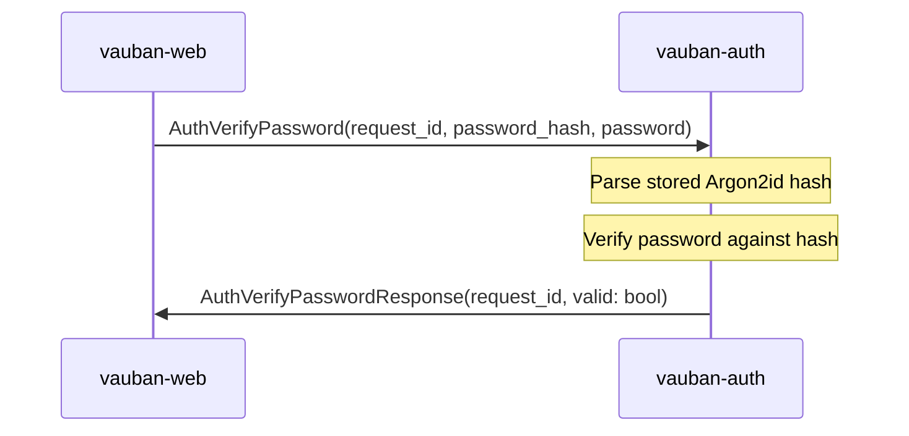

The `password` field uses `SensitiveString`, which:
- Zeroizes backing memory on drop (prevents credential remnants)
- Redacts output in Debug formatting (`[REDACTED]`)
- Is serde-transparent for bincode serialization compatibility

### 3.5 Password Hashing Flow

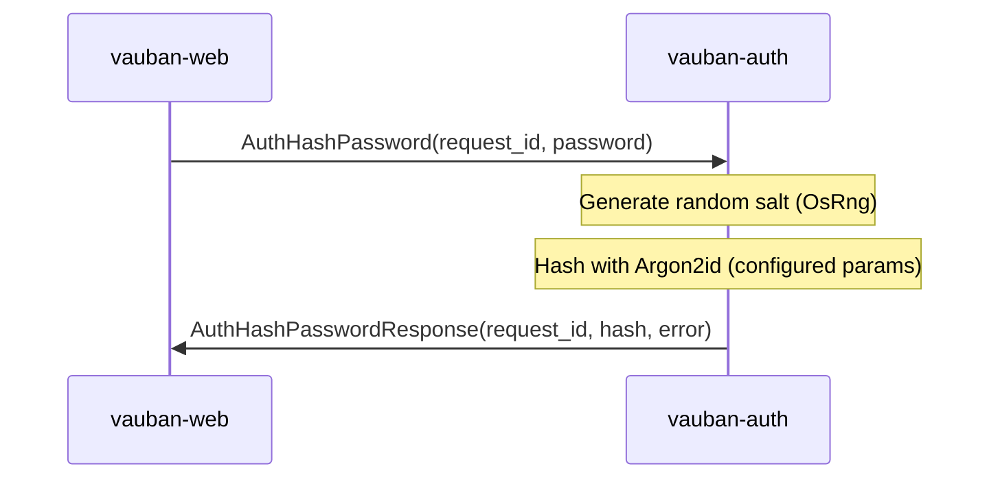

### 3.6 Service Architecture

```rust
// Core service state
struct ServiceState {
    start_time: Instant,
    requests_processed: u64,
    requests_failed: u64,
    draining: bool,
    shutdown_requested: bool,
    argon2_params: Argon2Params,
}
```

The service follows the standard Vauban synchronous service pattern:

1. **Read environment** -- IPC FDs, Argon2 params, topology channels
2. **Clear environment** -- Remove all env vars before sandbox entry
3. **Enter Capsicum sandbox** -- `cap_enter()` on FreeBSD
4. **Main loop** -- `poll(2)` on supervisor + peer channels, dispatch messages

### 3.7 Dependencies

| Crate | Purpose |
|-------|---------|
| `argon2 0.5` | Argon2id password hashing |
| `rand 0.8` | Cryptographic salt generation (OsRng) |
| `shared` | IPC channel, messages, Capsicum wrappers |

`vauban-auth` has **no database dependency** and **no async runtime**. It is purely synchronous and stateless.

### 3.8 Step-Up Authentication for Sensitive Operations

Since 0.7.0 (issue #11), a small set of high-impact operations require a **fresh proof of the operator's strongest enrolled second factor** in addition to a valid session — i.e. the "step-up" pattern (NIST SP 800-63B AAL2/3, RFC 9470 OAuth Step-Up).

#### 3.8.1 Gated operations

| Operation | Handler | Why it is gated |
|-----------|---------|-----------------|
| Rotate any user's password (incl. self) | `update_user_web` (POST `/accounts/users/{uuid}`) when the `password` field is non-empty | A stolen session cookie should not be enough to seize a target account. |
| Delete a user (soft-delete) | `delete_user_web` (POST `/accounts/users/{uuid}/delete`) | Account destruction is irreversible from the operator UI. |

Operations that only mutate non-credential metadata (e.g. toggling `is_active`, editing email) keep going through the regular RBAC path without step-up.

#### 3.8.2 Policy choices

- **TOTP-only** for now. Passkeys / ITSME / eID hooks land in a future release and will negotiate inside the same helper.
- **No password fallback.** Operators without an enrolled TOTP factor (`mfa_enabled = false` or `mfa_secret IS NULL/''`) are refused outright with an actionable redirect to `/accounts/mfa/setup`. This avoids a downgrade attack where the attacker disables MFA first to revert to password re-auth.
- **Single-use** within the 30-second TOTP window. The operator's last successfully consumed window is persisted on `users.last_totp_used_window` (BIGINT NULL) and any code matching that window OR an earlier one is refused with `CodeReplayed`. This implements RFC 6238 §5.2 against same-window replay.
- **Operator, not target.** The TOTP code is verified against the *currently logged-in operator's* secret, never the target user's — so an attacker who learned a target's TOTP cannot use it to rotate that target's password through any hijacked admin session.

#### 3.8.3 Service helper

The logic lives in `vauban-web/src/auth/step_up.rs` as a single reusable function used by every gated handler:

```rust
pub async fn enforce_totp_step_up(
    state: &AppState,
    conn: &mut Conn,
    operator_uuid_str: &str,
    totp_code: &str,
) -> Result<(), StepUpError>;
```

`StepUpError` is a closed enum mapped to a stable user-facing flash message:

| Variant | Meaning | Flash copy |
|---------|---------|-----------|
| `OperatorIdentityMalformed` / `OperatorNotFound` | Stale or tampered session | "Could not verify your identity. Please log out and log back in." |
| `MfaNotEnrolled` | Operator has no usable TOTP factor | "MFA enrollment required to perform this action. Enable MFA on your profile first." |
| `CodeMissing` | Empty `totp_code` field | "Please enter your authenticator code to confirm this action." |
| `CodeInvalid` | Code did not match the current window | "Authenticator code is incorrect." |
| `CodeReplayed` | Code matched but its window was already consumed | "Authenticator code has already been used. Please wait for the next code from your authenticator app." |
| `VaultUnavailable` / `VaultError` | Encrypted secret + missing/erroring `vault_client` | "MFA backend is temporarily unavailable. Please try again in a moment, or contact an administrator if the problem persists." |
| `DatabaseError` | DB read or update failed | "Database error while verifying your identity. Please try again." |

#### 3.8.4 Vault-aware dispatch

`mfa_secret` may be stored in two shapes:

| Shape | Origin | Verifier |
|-------|--------|----------|
| `<base32>` (plaintext) | Pre-vault enrollment, dev/test setups | `AuthService::verify_totp` (local) |
| `v{digits}:<base64>` (vault envelope) | Production enrollment via `vauban-vault` | `VaultCryptoClient::mfa_verify` (IPC to vauban-vault) |

The classifier `services::auth::is_encrypted_mfa_secret` is the **single source of truth** for that distinction; both the login-time MFA flow (`handlers::auth`) and the step-up flow (`auth::step_up`) delegate to it to prevent drift.

Crucially, an encrypted secret submitted to a process where `state.vault_client = None` returns `StepUpError::VaultUnavailable` rather than silently falling back to `verify_totp` on the ciphertext (which would always reject the code and trap the operator forever). This was the root cause of the issue #11 production bug and is now guarded by source- and integration-level tests.

#### 3.8.5 Caller contract

```rust
let mut conn = pool.get().await?;
match enforce_totp_step_up(&state, &mut conn, auth_user.uuid(), &form.totp_code).await {
    Ok(()) => { /* perform the side-effecting operation */ }
    Err(e) => return Ok(flash_redirect(flash.error(e.flash_message()), back_url)),
}
```

On `Ok(())` the operator's `last_totp_used_window` has already been advanced; the same code cannot be re-used by anyone, anywhere, until the next 30-second window opens.

---

## 4. Access Control Service (vauban-access)

### 4.1 Purpose

`vauban-access` (formerly `vauban-rbac`) is the **centralized authorization service**. It handles two distinct concerns:

1. **Feature-level RBAC** via the Casbin policy engine (role-based checks like "can this role manage users?")
2. **Instance-level access rules** via Diesel DSL queries against its dedicated database (asset-level checks like "can this user SSH to this asset group?")

### 4.2 Evolution from vauban-rbac

| Aspect | v0.3.0 (vauban-rbac) | v0.4.0 (vauban-access) |
|--------|---------------------|----------------------|
| Name | `vauban-rbac` | `vauban-access` |
| Service enum | `Service::Rbac` | `Service::Access` |
| Config section | `[rbac]` | `[access]` |
| Config directory | `config/rbac/` | `config/access/` |
| Capabilities | Casbin RBAC only | Casbin RBAC + instance-level access rules |
| Database | None | Dedicated pool (4 connections) |
| Tables owned | None | `access_rules`, `vauban_groups`, `asset_groups`, `user_groups` |
| IPC messages | `RbacCheck` / `RbacResponse` | `RbacCheck` + 25 `AccessRequest` + 17 `AccessResponse` variants |

### 4.3 Dual-Engine Architecture

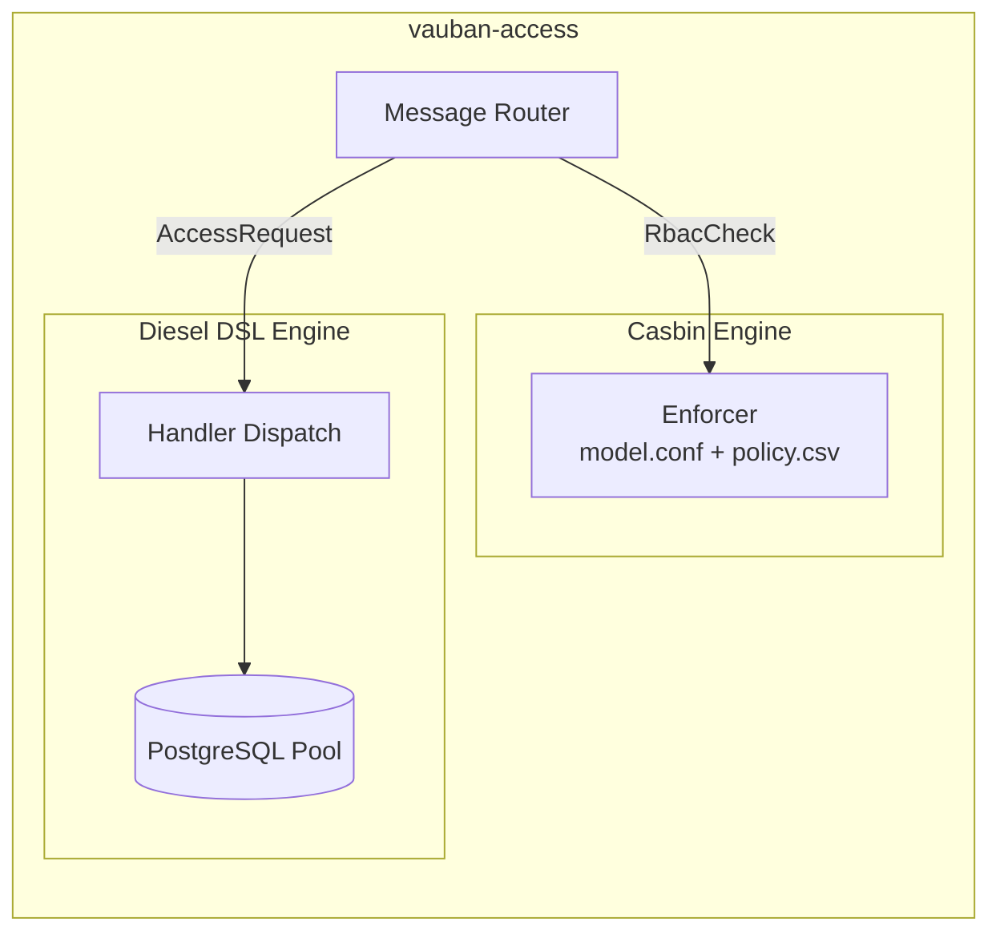

### 4.4 Service State

```rust
struct ServiceState {
    start_time: Instant,
    requests_processed: u64,
    requests_failed: u64,
    draining: bool,
    shutdown_requested: bool,
    enforcer: Option<Enforcer>,           // Casbin policy engine
    db_pool: Option<db::DbPool>,          // Async PG pool (diesel-async)
    rt: Option<tokio::runtime::Runtime>,  // Single-threaded Tokio RT
}
```

Unlike `vauban-auth`, `vauban-access` requires a **minimal Tokio runtime** (`current_thread`) because `diesel-async` requires an async executor for database queries. This runtime is created once at startup and used via `rt.block_on()` in the synchronous main loop.

### 4.5 Startup Sequence

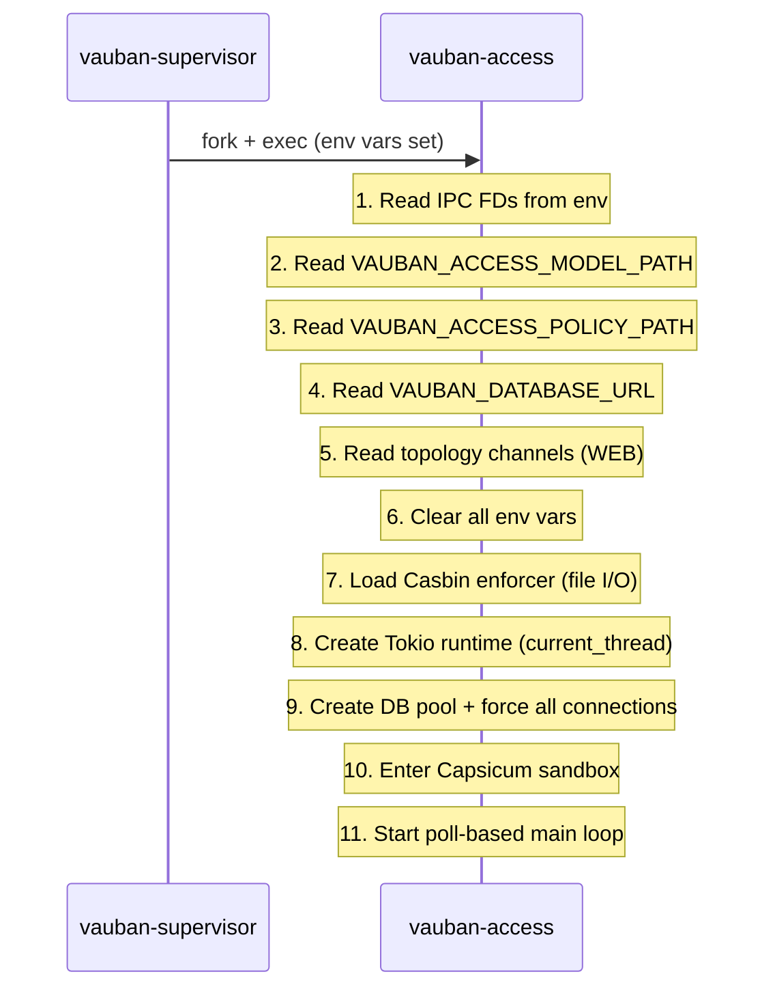

### 4.6 Dependencies

| Crate | Purpose |
|-------|---------|
| `casbin` | RBAC policy engine |
| `diesel` + `diesel-async` | PostgreSQL ORM (async) |
| `deadpool` | Connection pool management |
| `tokio` (rt feature only) | Minimal async runtime for diesel-async |
| `chrono`, `uuid` | Timestamp and UUID handling |
| `shared` | IPC channel, messages, Capsicum wrappers |

---

## 5. RBAC Layer: Casbin Policy Engine

### 5.1 Model Definition

The Casbin model uses a standard RBAC pattern with wildcards:

```ini
[request_definition]
r = sub, obj, act

[policy_definition]
p = sub, obj, act

[role_definition]
g = _, _

[policy_effect]
e = some(where (p.eft == allow))

[matchers]
m = g(r.sub, p.sub) && (p.obj == "*" || r.obj == p.obj) && (p.act == "*" || r.act == p.act)
```

The matcher supports wildcard matching for both objects and actions, enabling the `superuser` role to have unrestricted access via a single policy line.

### 5.2 Default Policy

```csv
p, role:superuser, *, *
p, role:staff, users, read
p, role:staff, users, write
p, role:staff, assets, read
p, role:staff, assets, read_all
p, role:staff, assets, manage
p, role:staff, sessions, read
p, role:staff, sessions, write
p, role:staff, sessions, supervise
p, role:staff, groups, read
p, role:staff, groups, write
p, role:staff, groups, manage_members
p, role:staff, access_rules, read
p, role:staff, access_rules, write
p, role:staff, auth_sessions, read
p, role:staff, auth_sessions, write
p, role:staff, admin, view
p, role:user, assets, read
p, role:user, sessions, read
p, role:user, profile, read
p, role:user, profile, write
p, role:user, sessions, create
p, role:user, profile, read
p, role:user, profile, write
```

### 5.3 Role Hierarchy

| Role | Capabilities | Typical Usage |
|------|-------------|---------------|
| `role:superuser` | Full access (`*, *`) | System administrators |
| `role:staff` | Manage users, assets, sessions, groups, access rules; view admin UI | IT operators |
| `role:user` | Read assets, read/create sessions, manage own profile | End users connecting to assets |

### 5.4 Evaluation Flow

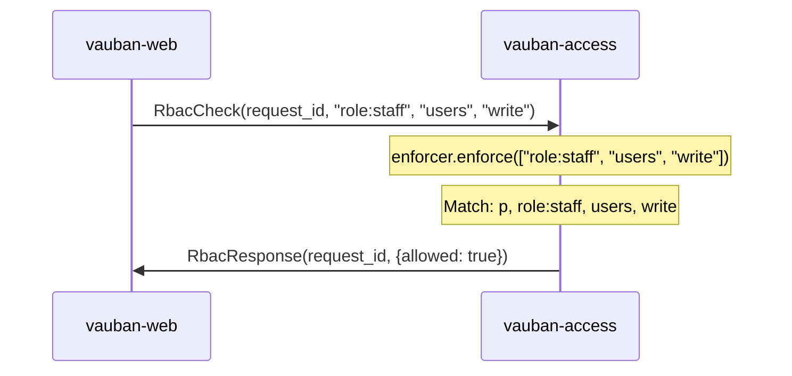

### 5.5 Fallback Behavior

When no Casbin enforcer is loaded, **every** build fails closed. The former
`#[cfg(debug_assertions)]` allow-all stub was removed; a non-regression pin
in `vauban-access` greps against its return (`allowed: true` without an
enforcer). Operators and CI always exercise the real policy file under
supervisor (see §9.3).

| Build Mode | Behavior | Rationale |
|------------|----------|-----------|
| Debug or release | Deny all requests | Fail-closed security |

```rust
// No enforcer → deny (all builds)
RbacResult {
    allowed: false,
    reason: Some("RBAC policy engine not configured"),
}
```

### 5.6 RBAC Integration Points

RBAC checks gate access to UI features and API endpoints. The catalogue
below matches `PermissionContext` (§9.6) and `default_policy.csv`
(`TRACKED_PERMS` in tests). Historical note: pre-v1.0 `assets:write` was
renamed to `assets:manage`; Casbin resource `groups` is **user groups**
only (`/accounts/groups/*`) — asset groups live under `assets:manage`.

| Resource | Actions | Used By |
|----------|---------|---------|
| `users` | `read`, `write`, `manage_admins` | Account admin (`/accounts/users/*`); `manage_admins` = superuser only |
| `assets` | `read`, `read_all`, `manage` | User zone `/assets/*` (`read`); admin CRUD + asset groups `/assets/manage/*` (`manage`) |
| `groups` | `read`, `write`, `manage_members` | **User** groups only (`/accounts/groups/*`) |
| `access_rules` | `read`, `write` | Access rule CRUD (`/assets/access/*`) |
| `auth_sessions` | `read`, `write` | Admin auth-session list / revoke |
| `sessions` | `read`, `write`, `supervise`, `bypass_access_rules` | Session catalogue / terminate / Bastion Watch; bypass = superuser only |
| `admin` | `view` | Admin sidebar visibility, dashboard |
| `profile` | `read`, `write` | User's own profile management |

**BAC July 2026 — fail-closed admin nests.** Each admin web sub-tree is
fenced by a route-layer minimum permission *and* handler re-checks:

| Nest | `route_layer` | Handler re-check |
|------|---------------|------------------|
| `/accounts/users/*` | `require_users_read` | `users_read` / `users_write` |
| `/accounts/groups/*` | `require_groups_read` | `groups_read` / `groups_write` / `groups_manage_members` |
| `/assets/access/*` | `require_access_rules_read` | `access_rules_read` / `access_rules_write` |
| `/assets/manage/*` (incl. asset groups) | `require_assets_manage` | `assets_manage` |

See `middleware/require_permission.rs` and
`scripts/check_bac_handler_gates.sh`.

---

## 6. Instance-Level Access Control

### 6.1 Concept

While RBAC controls *feature* access ("can this role manage users?"), instance-level access controls *asset* access ("can this specific user connect to this specific server via SSH?").

Access rules link **user groups** to **asset groups** with constraints:

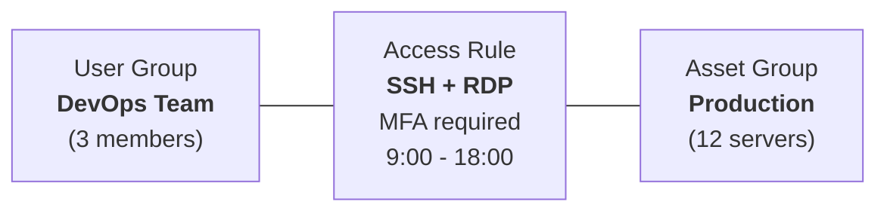

### 6.2 Access Rule Properties

| Property | Type | Description |
|----------|------|-------------|
| `name` | varchar(100) | Human-readable rule name |
| `description` | text | Optional description |
| `user_group_id` | FK -> vauban_groups | Group of users this rule applies to |
| `asset_group_id` | FK -> asset_groups | Group of assets this rule grants access to |
| `allowed_protocols` | text[] | List of allowed protocols: `ssh`, `rdp` |
| `valid_from` | timestamptz | Start of validity window (NULL = no start constraint) |
| `valid_until` | timestamptz | End of validity window (NULL = no end constraint) |
| `require_mfa` | bool | Whether MFA is required for connections |
| `require_approval` | bool | Whether admin approval (JIT) is required before connection |
| `max_session_duration` | int | Maximum session duration in minutes (NULL = unlimited) |
| `is_active` | bool | Whether the rule is currently active |
| `priority` | int | Priority for conflict resolution (higher = more important) |

### 6.3 Evaluation Logic

When a user attempts to connect to an asset, `vauban-access` evaluates access by:

1. **Identify asset group**: The target asset belongs to an `asset_group`
2. **Find matching rules**: Query `access_rules` where:
   - The user is a member of the rule's `user_group` (via `user_groups` join table)
   - The rule's `asset_group_id` matches the target
   - The rule is active (`is_active = true`)
   - The current time falls within `[valid_from, valid_until]`
   - The requested protocol is in `allowed_protocols`
3. **Aggregate constraints**: If any matching rules exist, access is granted with the most restrictive constraints:
   - `require_mfa` = true if **any** matching rule requires MFA
   - `require_approval` = true if **any** matching rule requires approval
   - `max_session_duration` = **minimum** across all matching rules

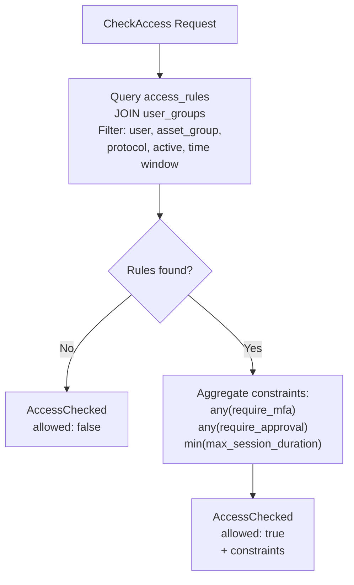

### 6.4 Access Check Query (Diesel DSL)

The core evaluation query uses the Diesel DSL with small `sql::<SqlBool>` fragments for PostgreSQL-specific time window expressions:

```rust
let matching_rules = access_rules::table
    .inner_join(user_groups::table.on(
        user_groups::group_id.eq(access_rules::user_group_id),
    ))
    .filter(user_groups::user_id.eq(user_id))
    .filter(access_rules::asset_group_id.eq(asset_group_id))
    .filter(access_rules::is_active.eq(true))
    .filter(sql::<SqlBool>("(valid_from IS NULL OR valid_from <= NOW())"))
    .filter(sql::<SqlBool>("(valid_until IS NULL OR valid_until >= NOW())"))
    .filter(access_rules::allowed_protocols.contains(vec![Some(protocol.to_string())]))
    .select((
        access_rules::require_mfa,
        access_rules::require_approval,
        access_rules::max_session_duration,
    ))
    .load::<(bool, bool, Option<i32>)>(conn)
    .await;
```

All CRUD operations in `vauban-access` use the Diesel DSL exclusively. The only raw SQL fragments are the `valid_from`/`valid_until` time window checks, which use `sql::<SqlBool>` because Diesel does not have a native DSL expression for `IS NULL OR column <= NOW()` in a single filter.

### 6.5 Virtual "All assets" Group

For policies that should apply to *every* asset without forcing the operator to maintain a manual catch-all asset group, Vauban exposes a single, system-managed virtual group named **"All assets"**. It lives as a real row in `asset_groups` (so existing FKs and IPC payloads continue to work unchanged) but carries `kind = 'all'` and the reserved UUID `00000000-0000-0000-0000-000000000a11`.

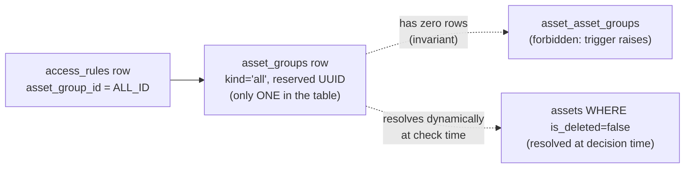

| Property | Behaviour |
|----------|-----------|
| **Visibility** | Hidden from the asset-group index, the detail page, and every CRUD endpoint. The access-rule editor is the only UI that surfaces it (with a "Virtual — N assets" badge above the static groups). |
| **Membership** | Cannot be added to or removed from. `asset_asset_groups` rows pointing at the virtual group are blocked by the `block_membership_on_virtual_groups` BEFORE INSERT/UPDATE trigger. |
| **Mutation** | Cannot be renamed, recoloured, soft-deleted, or hard-deleted. The `block_mutation_on_virtual_groups` BEFORE UPDATE/DELETE trigger raises on every attempt. |
| **Singleton invariant** | A partial UNIQUE index `uniq_asset_groups_kind_singleton` on `kind WHERE kind <> 'static'` guarantees there is at most one virtual row. |
| **Boot-time resolution** | Both `vauban-access` and `vauban-web` resolve the row's internal `id` once at boot via a `OnceLock` and refuse to serve traffic if the row is missing or carries the wrong `kind`. |
| **Dynamic membership** | At decision time, the resolver expands the virtual group to `SELECT id FROM assets WHERE is_deleted = false [AND asset_type IN protocols]`. New assets become visible on the very next access check; soft-deleted assets are evicted. |
| **Aggregation** | Overlapping virtual + static rules combine OR (`require_mfa`, `require_approval`, `allowed`) and `min` (`max_session_duration`). The conservative bit always wins. |

The defense-in-depth chain — DB triggers + boot-time invariant + UI gating + IPC contract (`AssetGroupInfo.kind`, `ListAssetGroups.include_virtual`) — is documented end-to-end in [`docs/runbooks/virtual_asset_group.md`](../runbooks/virtual_asset_group.md), which also covers the recovery procedure.

### 6.6 Accessible Groups Listing

For the asset list UI, `vauban-access` can return all asset groups a user has access to, along with the allowed protocols for each:

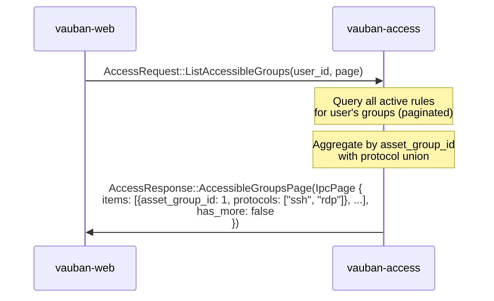

Results are paginated via `IpcPageParams`. The web client iterates pages until `has_more` is `false` to collect the full list of accessible groups.

This enables the web UI to filter the asset list, showing only assets the user can actually connect to, with the appropriate protocol buttons.

---

## 7. Database Schema

### 7.1 Table Ownership

`vauban-access` exclusively owns four tables that can optionally reside in a **separate PostgreSQL instance** from `vauban-web`:

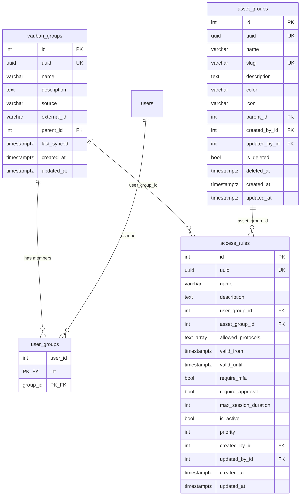

### 7.2 Database Separation

The FK from `assets.group_id` to `asset_groups(id)` was deliberately dropped (migration `20260312000000_drop_asset_group_fk`) to enable running `vauban-access` against a separate PostgreSQL instance:

```sql
-- Enable DB separation: referential integrity enforced at application/IPC level
ALTER TABLE assets DROP CONSTRAINT IF EXISTS assets_group_id_fkey;
```

This design allows:
- `vauban-web` to have its own database with user/asset/session tables
- `vauban-access` to have a dedicated database with group/rule tables
- Cross-references resolved via IPC rather than SQL JOINs

### 7.3 vauban_groups (User Groups)

User groups support both local and external sources:

| Field | Description |
|-------|-------------|
| `source` | `"local"` for manually created groups, or `"ldap"`, `"oidc"` for synced groups |
| `external_id` | Original identifier in the external directory |
| `last_synced` | Timestamp of the last directory sync |
| `parent_id` | Hierarchical group nesting (future) |

### 7.4 users.last_totp_used_window (Step-Up Replay Protection)

The `users` table is owned by `vauban-web` (not by `vauban-access`) and gained one additional column in 0.7.0 to back the step-up flow described in §3.8:

| Field | Type | Description |
|-------|------|-------------|
| `last_totp_used_window` | `BIGINT NULL` | Last TOTP time-step (`unix_seconds / TOTP_STEP`) consumed by this user via the step-up flow. NULL means "never consumed". A code whose window is `<= last_totp_used_window` is rejected as `CodeReplayed` (RFC 6238 §5.2). |

Migration: `vauban-db/migrations/20260418000000_users_last_totp_used_window`.

The column is written exclusively by `auth::step_up::enforce_totp_step_up`; the value is opaque to the rest of the codebase and never surfaced through the API (`#[serde(skip_serializing)]` on the model).

### 7.5 access_rules Indexes

```sql
CREATE INDEX idx_access_rules_uuid ON access_rules(uuid);
CREATE INDEX idx_access_rules_user_group ON access_rules(user_group_id);
CREATE INDEX idx_access_rules_asset_group ON access_rules(asset_group_id);
CREATE INDEX idx_access_rules_active ON access_rules(is_active) WHERE is_active = true;
```

The partial index on `is_active` optimizes the most frequent query pattern (evaluating active rules during connection attempts).

### 7.6 auth_sessions Uniqueness Invariant (Issue #8)

The `auth_sessions` table (owned by `vauban-web`) tracks **login** sessions
— authenticated browser/API clients holding an `access_token` cookie. It is
**unrelated** to `proxy_sessions`, which tracks bastion (SSH/RDP) connections.

To prevent the "My login sessions" view from filling up with near-duplicate
rows after every browser refresh / token rotation, the table enforces a
**single-row-per-device invariant**:

```sql
-- Migration: 20260419000000_dedupe_and_uniq_auth_sessions
CREATE UNIQUE INDEX uniq_auth_sessions_per_device
    ON auth_sessions (user_id, device_info, ip_address);

CREATE INDEX idx_auth_sessions_last_activity
    ON auth_sessions (last_activity);
```

| Column | Role in the invariant |
|--------|-----------------------|
| `user_id` | Identifies the human/service account. |
| `device_info` | Browser fingerprint derived from `User-Agent` by `AuthSession::parse_device_info`. **Made `NOT NULL DEFAULT 'Unknown browser'`** so the index is deterministic even when the UA is missing or unparseable. |
| `ip_address` | Resolved client IP after honoring trusted proxies (`extract_client_ip`). |

The invariant is enforced by **three coordinated layers**:

1. **At login** — `handlers::auth::insert_session_with_purge` runs
   `purge_sessions_for_device` + `INSERT` inside a single transaction so
   no two requests in the same pod can race. If a different pod wins the
   race between purge and INSERT, the UNIQUE index trips a
   `UniqueViolation` and the helper retries once after re-purging,
   which converges because the second purge picks up the row inserted
   by the other pod.

2. **At read time** — `My login sessions` and `All login sessions`
   (admin) display `auth_sessions` directly; thanks to the invariant
   above they no longer need any application-side deduplication.

3. **In the background** — `tasks::cleanup::cleanup_expired_or_idle_sessions`
   runs every `CLEANUP_INTERVAL_SECS` (30 s) and deletes rows where
   `expires_at < now` **OR** `last_activity < now - session_idle_timeout_secs`,
   so disconnected browsers and abandoned tabs do not linger forever.
   `idx_auth_sessions_last_activity` keeps that scan cheap.

Routes that surface this data were renamed to make the distinction with
bastion sessions explicit (the old paths still answer `308 Permanent
Redirect`):

| Old route | New route | View |
|-----------|-----------|------|
| `/accounts/sessions` | `/accounts/login-sessions` | User's own login sessions |
| `/admin/sessions` | `/accounts/all-login-sessions` | Admin: every user's login sessions |

### 7.7 assets Irreversible Deletion Invariant (Issue #17)

The `assets` table (owned by `vauban-web`) holds the privileged
targets that operators connect to via SSH or RDP. Each row carries a
`connection_config` JSONB blob with the encrypted credential envelope
(`password`, `private_key`, `passphrase` — see
[Vauban_Vault_Architecture_EN(1.2).md](Vauban_Vault_Architecture_EN(1.2).md)
§3 for the cryptographic format).

The product's security policy (RG-ASS-04) states that **asset deletion
is irreversible**: a soft-deleted row exists only as an audit
tombstone, never to be reanimated. Recreating an asset on the same
`(hostname, port, connection_username)` triplet always allocates a
fresh UUID; the prior row is preserved with `is_deleted = true` and an
empty `connection_config`. This closes the SEC-11 credential-carryover
class of bugs at the schema level.

The contract is enforced by **four coordinated invariants**, three of
them structural (PostgreSQL itself rejects any violation), one
operational (handler scrub for early UX feedback):

```sql
-- Migration: 20260420000000_assets_irreversible_delete

-- I3: a tombstone MUST NOT carry secrets.
ALTER TABLE assets ADD CONSTRAINT assets_tombstone_no_secrets
    CHECK (NOT is_deleted OR connection_config = '{}'::jsonb);

-- I4: is_deleted MUST NOT transition from true back to false.
CREATE OR REPLACE FUNCTION assets_no_resurrection() RETURNS trigger AS $$
BEGIN
    IF OLD.is_deleted = true AND NEW.is_deleted = false THEN
        RAISE EXCEPTION 'asset % is soft-deleted and cannot be restored '
            '(issue #17 policy: delete is irreversible)', OLD.uuid
            USING ERRCODE = 'check_violation';
    END IF;
    RETURN NEW;
END;
$$ LANGUAGE plpgsql;

CREATE TRIGGER assets_no_resurrection_trg
    BEFORE UPDATE ON assets
    FOR EACH ROW
    WHEN (OLD.is_deleted IS DISTINCT FROM NEW.is_deleted)
    EXECUTE FUNCTION assets_no_resurrection();

-- Read-only projection used by application paths that should never
-- see tombstones; the base table remains the source of truth so
-- proxy_sessions.asset_id keeps resolving for audit.
CREATE VIEW assets_active AS SELECT * FROM assets WHERE is_deleted = false;
```

| Invariant | Enforcement layer | Mechanism |
|-----------|-------------------|-----------|
| **I1** — At most one *active* row per `(hostname, port, connection_username)` triplet. | PostgreSQL (partial unique index) | `idx_assets_hostname_port_username_active` (introduced in `20260330000000_add_connection_username`, re-documented from `20260420000000_assets_irreversible_delete` via `COMMENT ON INDEX`). Tombstones are excluded from the index, so audit history is unbounded. |
| **I2** — Arbitrarily many tombstones may coexist on the same triplet. | PostgreSQL (negative space of I1) | Direct consequence of the partial index: `WHERE is_deleted = false` excludes tombstones from uniqueness. |
| **I3** — A tombstone MUST NOT carry credentials. | PostgreSQL (CHECK constraint) | `assets_tombstone_no_secrets`. SQLSTATE `23514` on violation. The migration includes a corrective `UPDATE assets SET connection_config = '{}'` for legacy tombstones predating the constraint. |
| **I4** — `is_deleted` MUST NOT transition from `true` back to `false`. | PostgreSQL (BEFORE UPDATE trigger) | `assets_no_resurrection_trg`. Bypassing the trigger requires `session_replication_role = replica` (superuser only) and is reserved for explicit data migrations. |

The contract is honored by **three coordinated layers**:

1. **At the database** — the CHECK constraint, partial unique index
   and BEFORE UPDATE trigger above. They fire regardless of which
   client issues the offending statement (Diesel, raw `psql`, future
   ETL, compromised handler). This is the line-of-defense that
   "battle-tests" the policy: see
   `vauban-web/tests/web/assets_db_invariants_test.rs::test_i4_resurrection_blocked_via_raw_sql_bypassing_orm`,
   which proves the trigger rejects `UPDATE`s issued via
   `diesel::sql_query` (typed builder bypassed) and CTE-wrapped
   variants alike.

2. **At the handlers** — `vauban-web/src/handlers/web/assets.rs`:
   - `create_asset_web` always issues a fresh `INSERT` with a brand-new
     UUID; `UniqueViolation` (SQLSTATE `23505` on
     `idx_assets_hostname_port_username_active`) surfaces as a friendly
     flash error. The historical "reactivation" branch is gone.
   - `delete_asset_web` scrubs `connection_config` to `{}` in the same
     transaction that flips `is_deleted = true`. This is now
     defense-in-depth (the CHECK constraint would reject the COMMIT
     anyway), but kept so the intent is local-readable and
     `proxy_sessions` rows attached to the asset transition cleanly
     (`active → terminated`, `pending|connecting → orphaned`).
   - `update_asset_web` filters on `is_deleted = false` early so an
     operator editing a tombstoned asset gets a "not found / already
     deleted" flash rather than the generic 500 the trigger would
     otherwise produce.
   - `vauban-web/src/handlers/api/assets.rs::create_asset` maps
     `UniqueViolation` to `AppError::Conflict` (HTTP 409) so
     automation can branch on it deterministically.

3. **At the audit UI** — `GET /assets/deleted` (handler:
   `asset_deleted_list_web`, template:
   `vauban-web/templates/assets/asset_deleted_list.html`). Read-only,
   admin-only (gated on `perms.assets_read`), paginated, with no
   "restore" or "edit" affordance. The page deliberately avoids any
   verb that would suggest the operation is reversible.

**Foreign keys preserved across deletion.** The FK from
`proxy_sessions.asset_id` to `assets(id)` continues to resolve after
the soft-delete: the audit chain (who connected to which target,
when, with which protocol) survives the asset's lifecycle. This is
why the policy is "soft-delete + structural irreversibility" rather
than "hard delete with a separate audit table" — it keeps the
referential integrity story trivial.

**Tests.** The full battle-test matrix lives in:

| File | Scope |
|------|-------|
| `vauban-web/tests/web/assets_db_invariants_test.rs` | 8 SQL-pure tests (Diesel ORM bypassed) covering I1–I4, including the raw-SQL resurrection attempt. |
| `vauban-web/tests/web/asset_irreversible_delete_test.rs` | 7 handler-level integration tests: fresh-UUID-after-delete, web 303 + flash on collision, API 409 on collision, edit-on-tombstone rejected, idempotent delete, 10-cycle stress (proves I1+I2 hold under churn), `proxy_sessions` FK survives soft-delete. |
| `vauban-web/tests/web/asset_protocol_test.rs::test_soft_delete_purges_connection_config` | Defense-in-depth: the handler-level scrub is verified independently of the DB invariant. |

**Future scaling note.** When the tombstone population materially
exceeds the active set (~5×, or ~100k rows), the next structural step
is to convert `assets` to a `PARTITION BY LIST (is_deleted)` table
with separate partitions for active rows and tombstones. The exact
triggers, partition layout and migration caveats (FK rewrite for
`proxy_sessions.asset_id`, per-partition recreation of the partial
unique index) are documented inline in
`vauban-db/migrations/20260420000000_assets_irreversible_delete/up.sql`.
The decision is to revisit this quarterly against
`pg_stat_user_tables` and tombstone-count metrics rather than
preemptively partition today.

---

## 8. IPC Protocol

### 8.1 Authentication Messages

```rust
// Web -> Auth: Verify a password against a stored hash
AuthVerifyPassword {
    request_id: u64,
    password_hash: String,         // Stored Argon2id hash
    password: SensitiveString,     // Plaintext password (zeroized on drop)
}
AuthVerifyPasswordResponse {
    request_id: u64,
    valid: bool,
}

// Web -> Auth: Hash a new password
AuthHashPassword {
    request_id: u64,
    password: SensitiveString,
}
AuthHashPasswordResponse {
    request_id: u64,
    hash: Option<String>,          // Argon2id hash string
    error: Option<String>,
}

// Web -> Auth: Full authentication (future: SSO, LDAP)
AuthRequest {
    request_id: u64,
    username: String,
    credential: Vec<u8>,
    source_ip: IpAddr,
}
AuthResponse {
    request_id: u64,
    result: AuthResult,            // Success | Failure | MfaRequired
}

// Web -> Auth: MFA verification (future)
MfaVerify {
    request_id: u64,
    challenge_id: String,
    code: String,
}
MfaVerifyResponse {
    request_id: u64,
    success: bool,
    session_id: Option<String>,
}
```

### 8.2 RBAC Messages

```rust
// Web/Proxy -> Access: Feature-level authorization check
RbacCheck {
    request_id: u64,
    subject: String,   // e.g., "role:staff"
    object: String,    // e.g., "users"
    action: String,    // e.g., "write"
}
RbacResponse {
    request_id: u64,
    result: RbacResult {
        allowed: bool,
        reason: Option<String>,
    },
}
```

### 8.3 Access Control Messages

The `AccessRequest` enum contains **25 variants** and `AccessResponse` contains **17 variants**, organized into six categories. Most list operations accept an `IpcPageParams { limit, offset }` parameter for cursor-based pagination and return `IpcPage<T> { items, has_more }` responses:

#### Evaluation

| Request | Response | Description |
|---------|----------|-------------|
| `CheckAccess { user_id, asset_group_id, protocol }` | `AccessChecked(AccessCheckResult)` | Evaluate if a user can access an asset group with a protocol |
| `CheckAccessMulti { user_id, asset_group_ids, protocol }` | `AccessCheckedMulti(Vec<AccessCheckResultEntry>)` | Batch-evaluate access for multiple asset groups in a single query |
| `ListAccessibleGroups { user_id, page }` | `AccessibleGroupsPage(IpcPage<AccessibleGroupEntry>)` | List all accessible asset groups for a user (paginated) |

#### Access Rule CRUD

| Request | Response | Description |
|---------|----------|-------------|
| `CreateAccessRule { data }` | `AccessRule(Result<AccessRuleInfo, String>)` | Create a new access rule |
| `GetAccessRule { uuid }` | `AccessRule(Result<AccessRuleInfo, String>)` | Get rule by UUID |
| `ListAccessRules { page }` | `AccessRulePage(IpcPage<AccessRuleInfo>)` | List rules (paginated) |
| `UpdateAccessRule { uuid, data }` | `AccessRule(Result<AccessRuleInfo, String>)` | Update existing rule |
| `DeleteAccessRule { uuid }` | `Deleted(Result<(), String>)` | Delete rule |

#### User Group CRUD

| Request | Response | Description |
|---------|----------|-------------|
| `CreateVaubanGroup { name, description }` | `VaubanGroup(Result<VaubanGroupInfo, String>)` | Create user group |
| `GetVaubanGroup { uuid }` | `VaubanGroup(Result<VaubanGroupInfo, String>)` | Get group by UUID |
| `GetVaubanGroupById { id }` | `VaubanGroup(Result<VaubanGroupInfo, String>)` | Get group by integer ID |
| `ListVaubanGroups { page }` | `VaubanGroupPage(IpcPage<VaubanGroupInfo>)` | List user groups (paginated) |
| `UpdateVaubanGroup { uuid, name, description }` | `VaubanGroup(Result<VaubanGroupInfo, String>)` | Update group |
| `DeleteVaubanGroup { uuid }` | `Deleted(Result<(), String>)` | Delete group |

#### Group Membership

| Request | Response | Description |
|---------|----------|-------------|
| `AddGroupMember { group_id, user_id }` | `Ok` | Add user to group |
| `RemoveGroupMember { group_id, user_id }` | `Ok` | Remove user from group |
| `ListGroupMembers { group_id, page }` | `MemberListPage(IpcPage<i32>)` | List member user IDs (paginated) |
| `ListUserGroups { user_id, page }` | `UserGroupPage(IpcPage<VaubanGroupInfo>)` | List groups for a user (paginated) |

#### Asset Group CRUD

| Request | Response | Description |
|---------|----------|-------------|
| `CreateAssetGroup { name, slug, description, color, icon }` | `AssetGroup(Result<AssetGroupInfo, String>)` | Create asset group |
| `GetAssetGroup { uuid }` | `AssetGroup(Result<AssetGroupInfo, String>)` | Get asset group |
| `ListAssetGroups { page }` | `AssetGroupPage(IpcPage<AssetGroupInfo>)` | List asset groups (paginated) |
| `UpdateAssetGroup { uuid, ... }` | `AssetGroup(Result<AssetGroupInfo, String>)` | Update asset group |
| `DeleteAssetGroup { uuid }` | `Deleted(Result<(), String>)` | Delete asset group |

#### Group Options (Form Dropdowns)

| Request | Response | Description |
|---------|----------|-------------|
| `ListUserGroupOptions { page }` | `UserGroupOptionsPage(IpcPage<GroupOption>)` | Minimal user group list for dropdowns (paginated) |
| `ListAssetGroupOptions { page }` | `AssetGroupOptionsPage(IpcPage<GroupOption>)` | Minimal asset group list for dropdowns (paginated) |

### 8.4 Data Types

```rust
/// Pagination parameters for IPC list requests.
pub struct IpcPageParams {
    pub limit: u32,   // 0 = use DEFAULT_IPC_PAGE_LIMIT (256)
    pub offset: u32,
}

/// One page of list results from vauban-access.
pub struct IpcPage<T> {
    pub items: Vec<T>,
    pub has_more: bool,
}

/// Result of an instance-level access check.
pub struct AccessCheckResult {
    pub allowed: bool,
    pub require_mfa: bool,
    pub require_approval: bool,
    pub max_session_duration: Option<i32>,
}

/// Entry for batch access check (CheckAccessMulti).
pub struct AccessCheckResultEntry {
    pub asset_group_id: i32,
    pub result: AccessCheckResult,
}

/// Full info about an access rule.
pub struct AccessRuleInfo {
    pub uuid: String,
    pub name: String,
    pub description: Option<String>,
    pub user_group_id: i32,
    pub user_group_uuid: String,
    pub user_group_name: String,
    pub asset_group_id: i32,
    pub asset_group_uuid: String,
    pub asset_group_name: String,
    pub allowed_protocols: Vec<String>,
    pub valid_from: Option<String>,
    pub valid_until: Option<String>,
    pub require_mfa: bool,
    pub require_approval: bool,
    pub max_session_duration: Option<i32>,
    pub is_active: bool,
    pub priority: i32,
    pub created_at: String,
    pub updated_at: String,
}

/// Info about a user group.
pub struct VaubanGroupInfo {
    pub id: i32,
    pub uuid: String,
    pub name: String,
    pub description: Option<String>,
    pub source: String,          // "local", "ldap", "oidc"
    pub external_id: Option<String>,
    pub created_at: String,
    pub updated_at: String,
    pub last_synced: Option<String>,
    pub member_count: i64,
}

/// Info about an asset group.
pub struct AssetGroupInfo {
    pub id: i32,
    pub uuid: String,
    pub name: String,
    pub slug: String,
    pub description: Option<String>,
    pub color: String,
    pub icon: String,
    pub created_at: String,
    pub updated_at: String,
}

/// Minimal group info for form dropdown options.
pub struct GroupOption {
    pub id: i32,
    pub uuid: String,
    pub name: String,
}
```

---

## 9. Web Integration

### 9.1 IPC Clients

`vauban-web` communicates with auth and access services via async IPC clients that bridge the Tokio-based web server with synchronous pipe-based services.

#### AuthIpcClient

```rust
// Usage in login handler
let valid = state.auth_client
    .verify_password(password, &user.password_hash)
    .await?;

// Usage in user creation/password change
let hash = state.auth_client
    .hash_password(new_password)
    .await?;
```

#### AccessIpcClient

```rust
// RBAC check in handler middleware
let allowed = state.access_client
    .check_permission("role:staff", "users", "write")
    .await?;

// Instance-level access check before SSH/RDP connection
let result = state.access_client
    .check_access(user_id, asset_group_id, "ssh")
    .await?;

// Access rule CRUD (delegated to vauban-access)
let rules = state.access_client
    .list_access_rules()
    .await?;
```

### 9.2 IPC Client Architecture

Both clients follow the same pattern:

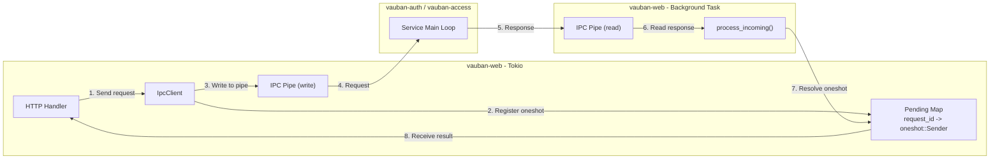

Key design elements:
- **Request/response correlation** via monotonically increasing `request_id`
- **Async bridging** via `tokio::sync::oneshot` channels
- **Non-blocking pipe I/O** via `tokio::io::unix::AsyncFd` and
  `shared::correlated_ipc::CorrelatedIpcCore` (`try_io` drain + RAII
  `PendingGuard` GC — 0.9.31; also powers `shared::access_guard::RbacClient`)
- **Background / pump task** continuously reads the pipe and dispatches responses

**Session-open policy eval (0.9.27):** web performs **two** access trips per
SSH/RDP open (early `IssueSessionToken` with MFA/JIT/duration on
`SessionTokenIssued`, then proxy AccessGuard) — not three. Structural lint:
`vauban-web/scripts/check_policy_eval_session_open.sh`.

### 9.3 No SQL Fallback — vauban-web is IPC-only

Earlier revisions of Vauban shipped a dual-path design in which `vauban-web`
could degrade to direct SQL access (and a `#[cfg(debug_assertions)]` allow-all
RBAC stub) when the IPC clients were unavailable. This fallback has been
**removed entirely**: Casbin is the single source of truth for authorization,
and `vauban-web` cannot run standalone.

| Operation | Current behavior |
|-----------|----------|
| Password verify | `AuthIpcClient::verify_password()` (mandatory) |
| Password hash | `AuthIpcClient::hash_password()` (mandatory) |
| RBAC check | `AccessIpcClient::check_permission()` → Casbin `enforce()` in `vauban-access` |
| Access check | `AccessIpcClient::check_access()` (mandatory) |
| Access rule CRUD | `AccessIpcClient::create_access_rule()` etc. (mandatory) |
| Vauban / asset groups CRUD | IPC calls to `vauban-access` (mandatory) |

Concretely:

1. `vauban-web`'s `init_access_client()` **hard-fails at startup** unless both
   `VAUBAN_ACCESS_IPC_READ` and `VAUBAN_ACCESS_IPC_WRITE` are set and point to
   live pipes. The process exits before opening its HTTP listener.
2. `AppState::access_client` is typed `Arc<AccessIpcClient>`, not
   `Option<_>`. There is no code path left in production where it can be
   `None`.
3. `check_rbac()` (`vauban-web/src/auth/permissions.rs`) calls Casbin via IPC
   and fails closed on any IPC error. It never short-circuits on
   `is_superuser`/`is_staff`: those attributes are only used to pick the
   subject (`role:superuser`, `role:staff`, `role:user`) that Casbin then
   evaluates against the policy file.
4. `vauban-access` itself hard-fails at startup if
   `VAUBAN_ACCESS_MODEL_PATH` or `VAUBAN_ACCESS_POLICY_PATH` are missing, and
   denies every check at runtime if — through an unexpected test-only path —
   the enforcer is `None`.
5. Integration tests spin up an in-process `vauban-access` backed by a real
   `casbin::Enforcer` loaded from
   `config/access/{model.conf,default_policy.csv}`. Tests exercise the actual
   Casbin policy, not a mock.

Consequences:

- **vauban-web cannot be executed in standalone mode.** It must be launched
  by `vauban-supervisor`, which spawns `vauban-auth` and `vauban-access` and
  wires up the IPC channels via pre-opened file descriptors.
- Attempting to run `./target/debug/vauban-web` directly terminates with an
  explicit error referencing the missing IPC environment variables.
- Local development and CI therefore always exercise the same authorization
  path as production.

### 9.4 Asset List Filtering

The web UI filters the asset list based on instance-level access:

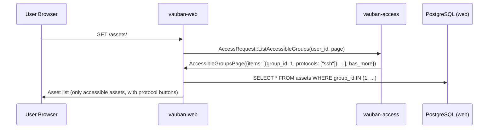

Superusers and staff see all assets; regular users see only assets in groups they have access to via active access rules.

### 9.5 CSRF Protection

Access rule forms use the Alpine.js double-submit cookie pattern for CSRF protection:

1. Server generates a CSRF token and sets it as a cookie
2. Alpine.js reads the cookie and includes the token in the form submission
3. Server validates that the form token matches the cookie token

### 9.6 PermissionContext (Casbin-backed UI gating)

To eliminate hardcoded `is_staff || is_superuser` shortcuts (issue #1) that
silently bypass custom Casbin policies, every authorization decision in
`vauban-web` — both inside Axum handlers and inside Askama templates — flows
through a single `PermissionContext` struct (`vauban-web/src/auth/permissions.rs`).

> **Deployment precondition.** `vauban-web` can only run as a child of
> `vauban-supervisor`, next to `vauban-auth` and `vauban-access`. There is no
> standalone mode: if the IPC channels to `vauban-access` are not wired up at
> startup, `vauban-web` terminates before serving any request. See §9.3.

#### Lifecycle of a request

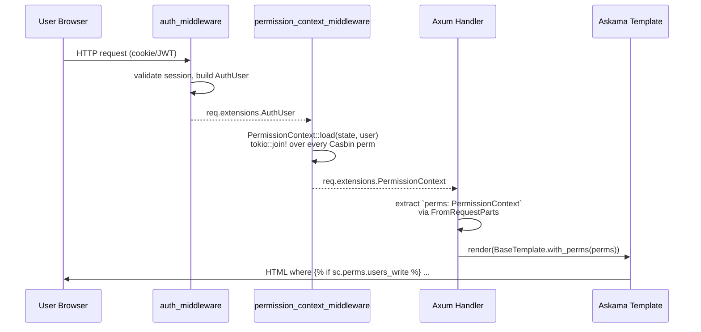

`PermissionContext` is a flat struct of 20 pre-computed booleans, in
1:1 correspondence with the Casbin `(resource, action)` couples loaded
by `permission_context_middleware`. The full catalogue is:

| Resource       | Field                        | Default role grants |
|----------------|------------------------------|---------------------|
| `users`        | `users_read`                 | staff, superuser    |
| `users`        | `users_write`                | staff, superuser    |
| `users`        | `users_manage_admins`        | superuser only      |
| `assets`       | `assets_read`                | user, staff, superuser |
| `assets`       | `assets_read_all`            | staff, superuser    |
| `assets`       | `assets_manage`              | staff, superuser    |
| `groups`       | `groups_read`                | staff, superuser    |
| `groups`       | `groups_write`               | staff, superuser    |
| `groups`       | `groups_manage_members`      | staff, superuser    |
| `access_rules` | `access_rules_read`          | staff, superuser    |
| `access_rules` | `access_rules_write`         | staff, superuser    |
| `auth_sessions`| `auth_sessions_read`         | staff, superuser    |
| `auth_sessions`| `auth_sessions_write`        | staff, superuser    |
| `sessions`     | `sessions_read`              | user (API only), staff, superuser |
| `sessions`     | `sessions_write`             | staff, superuser    |
| `sessions`     | `sessions_supervise`         | staff, superuser    |
| `sessions`     | `sessions_bypass_access_rules` | superuser only    |
| `admin`        | `admin_view`                 | staff, superuser    |
| `profile`      | `profile_read`               | user, staff, superuser |
| `profile`      | `profile_write`              | user, staff, superuser |

The `manage_admins`, `bypass_access_rules` pair is the
privilege-separation boundary between `role:staff` and
`role:superuser`: staff can run the day-to-day operations
(`users:write`, `groups:write`, `groups:manage_members`,
`sessions:supervise`) but the sensitive lifecycle operations (mint
another superuser, bypass instance-level access rules when opening a
session) remain reserved to superusers via the policy wildcard.

##### `sessions:read` for `role:user` -- API-only grant

Web and API authentication are split (human JWT cookie vs M2M API key;
see `vauban-web/src/middleware/api_key.rs`), but both planes evaluate the
**same** `default_policy.csv`. The line `p, role:user, sessions, read` exists
primarily for the REST API:

- `GET /api/v1/sessions` -- list (including API keys owned by a
  regular user with a `read` scope)
- `GET /api/v1/sessions/{uuid}` -- metadata read

Today, `perms.sessions_read` is checked **only** in
`handlers/api/sessions.rs`. The HTML session catalogue at `/sessions`
is gated by `admin:view`, not `sessions:read`.

Granting `sessions:read` to `role:user` answers only the functional
question ("may this role invoke session-read endpoints?"). It does
**not** decide which `proxy_sessions` rows are visible. Without the
instance-level layer, a holder of `sessions:read` could enumerate every
user's sessions via the API. Two compensating controls apply:

1. **List filter** (`handlers/api/sessions.rs::list_sessions`): without
   `sessions:supervise`, the query is force-filtered to
   `user_id == caller`; optional `user_id` query params pointing at
   another account are ignored or replaced.
2. **Row access** (`services::session_access::verify` with intent
   `ReadMetadata`): per-UUID reads go through vauban-access ownership
   and access-rule re-check, with `sessions:supervise` as a Casbin
   OR-override on cross-user paths.

See section 9.8 for the full session-access layer.

##### `assets:read` vs `assets:manage` -- the asset zone split (issue #27)

The asset surface is structurally split into two URL sub-trees with
two distinct Casbin permissions:

- `/assets/*` -- **user zone**, gated by `assets:read`. This is where
  end users connect to assets they have an access rule for, request
  access (JIT), and run the host-key verify HTMX flow. CRUD, deletion
  and host-key fetch are absent: even an admin uses this sub-tree only
  to consume sessions, not to manage assets.
- `/assets/manage/*` -- **admin zone**, gated by `assets:manage`. The
  pre-v1.0 `assets:write` permission was renamed to `assets:manage` to
  emphasise its broader scope: every CRUD operation on assets, the
  deleted-assets audit list, and the privileged "fetch SSH host key"
  action all live here. The sub-tree is structurally session-free --
  no Connect / Request / WebSocket reference may appear in
  `handlers/web/manage_assets.rs`, `handlers/api/manage_assets.rs`,
  `templates/assets/manage/`, enforced by
  `scripts/check_no_session_in_manage_assets.sh` and
  `tests/web/manage_assets_invariants_test.rs`.

Defence-in-depth at the routing layer: the entire `/assets/manage`
nest carries an additional `route_layer(require_assets_manage)` that
returns 403 *before* the handler is reached when `assets_manage` is
false. Each handler in `manage_assets.rs` ALSO re-asserts the flag in
its body so a misconfiguration of either layer is caught by the
other; the dual gate is asserted by
`tests/web/manage_assets_invariants_test::manage_assets_every_handler_gates_on_assets_manage`.

Anti-enumeration: because the routing-layer denial happens before any
DB lookup, a `role:user` cannot use `/assets/manage/{random-uuid}` as
an oracle for asset existence. Every denial collapses to the same 403
body, pinned by `manage_assets_anti_enumeration_test.rs`.

No legacy redirect: v1.0 has not shipped, so the pre-split admin URLs
(`/assets/new`, `/assets/{uuid}/edit`, `/assets/{uuid}/delete`,
`/assets/{uuid}/fetch-host-key`, `/assets/deleted` and the API
equivalents under `/api/v1/assets/*`) are NOT mounted as 308
redirects. Every UI form, HTMX fragment, CLI client and IaC
integration MUST target `/assets/manage/*` (web) or
`/api/v1/assets/manage/*` (API) directly. The absence is pinned by
`tests/web/boot_smoke_test::main_rs_does_not_carry_legacy_asset_redirects`,
which fails CI as soon as any `redirect_legacy_*` helper or any
legacy admin route literal reappears in `main.rs`. If a future
v1.x release ever needs migration redirects, reintroduce them
together with a fresh boot-smoke test rather than by undoing the
guard.

##### BAC hardening -- fail-closed admin nests (July 2026)

Beyond the asset zone split, every admin HTML nest is fail-closed at the
routing layer (see the nest table in §5.6). Asset groups
(`/assets/manage/groups/*`) gate on `assets:manage`, not `groups:*`.
Pinned by `tests/web/bac_gate_matrix_test.rs` and
`scripts/check_bac_handler_gates.sh`.

All checks for one user happen **once per request**, in parallel via
`tokio::join!`, regardless of how many handlers / template branches read them.

#### Handler usage

```rust
pub async fn user_detail(
    State(state): State<AppState>,
    auth_user: WebAuthUser,
    perms: crate::auth::PermissionContext, // <- extractor
    axum::extract::Path(uuid): axum::extract::Path<String>,
) -> Result<impl IntoResponse, AppError> {
    if !perms.users_read {
        return Err(AppError::Authorization("...".into()));
    }
    let can_edit = perms.users_write && (!is_target_superuser || auth_user.is_superuser);
    // ...
}
```

There is no longer any per-handler `check_rbac(&state, &user, "X", "Y").await`
call: those round-trips are consolidated into the middleware's single parallel
load. Reading `auth_user.is_superuser` / `auth_user.is_staff` from a handler
is forbidden -- the structural lint
`vauban-web/scripts/check_no_handler_role_gates.sh` (the server-side
companion of the templates lint) fails CI on any such occurrence inside
`vauban-web/src/handlers/**/*.rs`. Legitimate non-gating reads
(JWT-claim minting in `auth.rs`, `UserContext` data passing in
`web/mod.rs`) opt out via a `// allow-role-gate: <reason>` annotation
on the same line or the line immediately above; reviewers can then
audit each exception in isolation.

#### Template usage

The sidebar context (`SidebarContentTemplate`) carries a `perms` field of type
`PermissionContext`. Templates gate UI on `sc.perms.<resource>_<action>`:

```askama

  <!-- Administration block -->



  <a href="/accounts/groups">Groups</a>

```

Per-page templates may opt into a `perms: PermissionContext` field of their own
(see `ProfileTemplate`) when a gate is needed outside the sidebar.

`UserContext.is_staff` and `UserContext.is_superuser` remain available **for
display only** (role badges, account-management forms). Using them inside
`` directives to hide actionable controls is forbidden by the
structural lint `vauban-web/scripts/check_no_template_role_gates.sh`, which
detects:

1. The legacy `is_staff || is_superuser` (or symmetric) chain in any
   `if`/`elif` directive.
2. `sc.user.is_staff` / `sc.user.is_superuser` in any `if`/`elif` directive.

#### Why PermissionContext, not ad-hoc checks

| Concern | Old pattern (`is_staff \|\| is_superuser`) | New pattern (`PermissionContext`) |
|---|---|---|
| Custom Casbin policy (e.g. `role:custom` with `users:write` only) | Ignored: UI hides the action even though the server allows it (or vice-versa) | Honored: UI mirrors the exact server gate |
| Number of round-trips per request | 1 per template branch + 1 per handler check | 1 parallel join per request, regardless of branch count |
| Test coverage | Required redundant `is_staff` flips in fixtures | Single `PermissionContext::default()` plus targeted overrides |
| Drift between server and template | Frequent: easy to gate one but forget the other | Impossible: same struct is consulted on both sides |

### 9.7 Role invariants (non-Casbin)

Casbin answers *who* may invoke a handler. It does **not** answer *what
minimum/maximum the resulting state must satisfy*. Two such invariants
are enforced server-side, independently of the Casbin policy and on
top of any custom policy a deployment might load. They live in
[`vauban-web/src/services/role_invariants.rs`](../../vauban-web/src/services/role_invariants.rs)
and are wired into `update_user_web`, `delete_user_web` and
`api::accounts::update_user`.

#### Catalogue

| Invariant | Variant of `RoleViolation` | Stable flash message |
|---|---|---|
| No self-demote of `is_superuser` | `SelfDemoteSuperuser` | "You cannot remove your own superuser privileges" |
| No self-demote of `is_staff` | `SelfDemoteStaff` | "You cannot remove your own staff privileges" |
| No self-deactivation | `SelfDeactivate` | "You cannot deactivate your own account" |
| No self-delete | `SelfDelete` | "You cannot delete your own account" |
| Last active superuser cannot be demoted | `LastActiveSuperuserDemote` | "Cannot demote the last active superuser" |
| Last active superuser cannot be deactivated | `LastActiveSuperuserDeactivate` | "Cannot deactivate the last active superuser" |
| Last active superuser cannot be deleted | `LastActiveSuperuserDelete` | "Cannot delete the last active superuser" |

The "self" group exists so an operator cannot lock themselves out of
the platform with one click. The "last active superuser" group exists
because Casbin alone never denies an operation a superuser is allowed
to perform on another user; without this fence two operators could
each demote / deactivate / delete the only two remaining superusers
and leave the platform admin-less.

`UserContext.is_staff` / `UserContext.is_superuser` remain reserved
for display purposes; the role-invariant fence reads its own snapshot
of `(is_superuser, is_staff, is_active, is_deleted)` from the database
inside the SERIALIZABLE transaction, not from the JWT.

#### Layering vs Casbin

```mermaid
flowchart TD
    R[POST /accounts/users/uuid/edit] --> CSRF{CSRF valid?}
    CSRF -->|no| R0[redirect with flash error]
    CSRF -->|yes| CASBIN{Casbin: users:write?}
    CASBIN -->|no| R1[redirect with flash error]
    CASBIN -->|yes| SELF{check_self_change<br/>operator == target?}
    SELF -->|self diminution| R2[redirect: SelfDemote* / SelfDeactivate / SelfDelete]
    SELF -->|ok| TX[BEGIN SERIALIZABLE]
    TX --> SNAP[snapshot target row]
    SNAP --> COUNT{check_last_active_superuser:<br/>is target an active superuser<br/>AND mutation reduces count?}
    COUNT -->|count(others)==0| ABORT[abort tx, redirect: LastActiveSuperuser*]
    COUNT -->|>=1| UPDATE[UPDATE / soft-delete]
    UPDATE --> COMMIT{commit succeeds?}
    COMMIT -->|SerializationFailure| RETRY[retry up to 3x with 10/20/40 ms backoff]
    COMMIT -->|yes| OK[redirect: success flash]
```

Casbin is never bypassed: the role-invariant fence runs **after**
Casbin has authorised the call, never instead of it. The two layers
are composed, not one OR the other.

#### Atomicity contract

The "last active superuser" check runs **inside** the same
SERIALIZABLE Postgres transaction that owns the subsequent UPDATE /
soft-delete. Without that, two operators racing to demote the last
two superusers would each `count() == 1 other`, both proceed, and
commit two writes that together break the invariant (TOCTOU).
SERIALIZABLE detects the read-write dependency cycle at commit time
and aborts the loser with `40001`, which the
[`run_serializable`](../../vauban-web/src/services/role_invariants.rs)
helper retries up to three times with exponential backoff (10 / 20 /
40 ms) before bubbling up. The integration test
`web::role_invariants_test::concurrent_demotions_keep_at_least_one_superuser`
spins this race up via `tokio::spawn` + `tokio::sync::Barrier` and
asserts that at least one of the two targets remains an active
superuser at the end.

The pure self-check ([`check_self_change`](../../vauban-web/src/services/role_invariants.rs))
runs **before** the transaction since `operator_uuid == target_uuid`
does not depend on database state. Self-check fires before
last-superuser-check by construction; this ordering is pinned by
unit and integration tests so a flash banner never claims
"last active superuser" when the operator is in fact targeting
their own row.

#### Test surface

| Concern | Test |
|---|---|
| Pure matrix of `check_self_change` (no DB) | `vauban_web::services::role_invariants::tests::*` |
| Self-mutation refusal (5 scenarios) | `web::role_invariants_test::*_via_web` / `*_via_api` |
| Last-active-superuser fence (5 scenarios) | `web::role_invariants_test::cannot_*_last_active_superuser_*` |
| Inactive / soft-deleted superusers do not count | `web::role_invariants_test::{inactive,soft_deleted}_superuser_does_not_count*` |
| Authorized cases (non-regression) | `web::role_invariants_test::can_*_when_two_active_superusers_exist` |
| Concurrency (TOCTOU) | `web::role_invariants_test::concurrent_demotions_keep_at_least_one_superuser` |
| Existing soft-delete fence | `web::pages_test::test_user_delete_protects_last_superuser` |

---

### 9.8 Session access (instance-level via vauban-access)

Casbin gates *capability* (functional layer: "can the user, in
principle, read sessions?"). It does not gate *which row* the user
is allowed to see or operate on. Before this layer landed, an
authenticated user that knew (or guessed) a `proxy_sessions.uuid`
could:

- open the RDP viewer page of someone else's session (the
  `rdp_page` handler shipped with **no ownership check at all**);
- terminate someone else's session via web or API (the handler
  only checked `sessions:write`, never ownership);
- read someone else's session metadata via
  `GET /api/v1/sessions/{uuid}` (only `sessions:read` was
  enforced);
- enumerate every session globally via `GET /api/v1/sessions` (no
  per-caller filter);
- subscribe to the global WebSocket session feeds without holding
  `admin:view` (the read-only audit gate that fronts the HTML
  pages).

These are the IDORs the session-access layer plugs. It is the third
authorization layer in vauban-web, sitting next to Casbin and the
role invariants:

```mermaid
flowchart LR
    Browser[Browser] --> Handler[vauban-web handler<br/>viewer / WS / API]
    Handler --> Casbin[PermissionContext<br/>functional Casbin gate]
    Casbin --> Service[services::session_access::verify]
    Service -->|IPC AccessRequest::<br/>VerifySessionAccess| Access[vauban-access::<br/>handle_verify_session_access]
    Access --> ChkSession{session exists<br/>+ status connectable?}
    ChkSession -->|no| Gone[Denied(NotFound) or Denied(Gone)]
    ChkSession -->|yes| ChkOwner{requesting_user<br/>== session.user_id?}
    ChkOwner -->|no| NotOwner[Denied(NotOwner)]
    ChkOwner -->|yes| ChkRule{access-rule active<br/>valid_from / valid_until ok<br/>protocol covered?}
    ChkRule -->|no| Revoked[Denied(AccessRuleRevoked)]
    ChkRule -->|yes| Allowed[Allowed]
    Allowed --> CasbinOR[apply_casbin_override<br/>per intent]
    NotOwner --> CasbinOR
    Revoked --> CasbinOR
    CasbinOR --> Outcome[SessionAccessOutcome]
    Gone --> Outcome
    Outcome --> Render[render / next() / 404 / 410]
```

#### 9.8.1 The four intents

Every consumer of an existing `proxy_sessions` row carries a
declared intent so the service can apply the right OR-overrides:

| Intent          | Surface                                            | Casbin OR-override on `NotOwner` / `AccessRuleRevoked` |
|-----------------|----------------------------------------------------|---------------------------------------------------------|
| `OpenViewer`    | `terminal_page` (SSH HTML), `rdp_page` (RDP HTML) | `perms.sessions_supervise`                              |
| `ConsumeWs`     | `ws_session_guard` (terminal/session WS)          | `perms.sessions_supervise`                              |
| `ReadMetadata`  | `GET /api/v1/sessions/{uuid}`, `session_detail`   | `perms.sessions_supervise`                              |
| `Terminate`     | `POST /sessions/{uuid}/terminate` (web + API)     | owner is **always allowed** (even on `AccessRuleRevoked`) OR `perms.sessions_write` |

`NotFound` is NEVER overridden, even by a full superuser: a probe
holding `sessions:supervise` cannot resurrect a non-existent
session into a 200.

`Gone` is intent-aware:

- `OpenViewer` / `ConsumeWs` collapse to **410** for HTTP and to a
  410-equivalent WebSocket close (the underlying TCP/RDP/SSH
  connection is dead; no override resurrects it).
- `Terminate` short-circuits to **Allowed** for the owner
  (idempotent owner-cleanup; vauban-access has already proven
  ownership by the time we observe `Gone`, thanks to the
  owner-check-first ordering for that intent).
- `ReadMetadata` short-circuits to **Allowed** for the owner: the
  `/sessions/{id}` detail page MUST stay reachable to the operator
  who ran the session so they can consult the historical audit
  trail (durations, bytes, justification, recording link) after
  the session terminated. The same owner-check-first ordering
  protects against a non-owner ever observing `Gone` for
  `ReadMetadata` -- they receive `NotOwner` instead, which the
  service collapses to 404.

All other denials (NotOwner, AccessRuleRevoked, IPC failure,
malformed UUID) collapse to **404** to keep anti-enumeration
consistent. An attacker cannot tell a session that does not exist
apart from one that exists but belongs to someone else.

#### 9.8.2 Fail-fast access-rule re-check

The single `VerifySessionAccess` RPC re-evaluates the matching
`access_rules` row on every consumption: every page-load of the
HTML viewers, every WebSocket handshake, every API metadata read,
every terminate. If the rule that originally authorised the
session is later deactivated, expires, becomes not-yet-valid, or
its protocol set no longer covers the session's protocol, the next
consumption is rejected. Live, in-flight WebSocket data is not
interrupted (that is the proxy keep-alive recheck follow-up); but
no *new* handshake or *re-load* is allowed once the rule is gone.

This guarantees that revoking an access rule has the operational
effect that operators expect: "no more access" means "no more
access", not "no more new sessions".

#### 9.8.3 Anti-enumeration

Anti-enumeration is paramount. The service collapses every
non-`Gone` denial to 404 with no body distinction. The
`/api/v1/sessions` list endpoint applies the same discipline to
its result set: a regular caller's page is force-filtered to
`user_id == caller`, regardless of what the `user_id` query
parameter said. Only callers holding `sessions:supervise` see the
cross-user view (and they see exactly what they asked for).

#### 9.8.4 Terminate is owner-friendly on AccessRuleRevoked

The owner is always allowed to terminate their own session, even
if the matching access rule was just revoked. Otherwise the user
that created a session would have to call an operator to clean it
up after their own access rule was tightened. The
`session_access::apply_casbin_override` function pins this rule
explicitly (the `Terminate` arm of `AccessRuleRevoked` returns
`Allowed` without consulting `sessions_write`).

#### 9.8.5 Centralisation lint

`vauban-web/scripts/check_session_access_centralized.sh` enforces
that:

- `verify_session_ownership` is called only from its wrapper
  declaration in `websocket.rs` and from the structural tests
  (every other call site routes through `session_access::verify`);
- `terminal_page`, `rdp_page` and `session_detail` do not load a
  `proxy_sessions` row by UUID directly (which would bypass the
  access-rule re-check).

The lint runs in CI alongside `check_no_template_role_gates.sh`
and `check_no_handler_role_gates.sh`. A new handler that needs to
consume an existing session is forced by construction to route
through the same trio.

#### 9.8.6 Battle-tested coverage

| Concern | Test |
|---|---|
| `apply_casbin_override` matrix (20 cases incl. Gone-per-intent) | `vauban_web::services::session_access::tests::*` |
| `VerifySessionAccess` RPC matrix (12 cases incl. owner-read-Gone, intruder-read-Gone, IPC round-trip) | `vauban_access::handlers::tests::test_verify_session_access_*` and `vauban_web::tests::ipc::access_ipc_test::*` |
| Session detail regression: owner can still read terminated/expired/disconnected sessions | `vauban_web::tests::web::session_pages_test::test_session_detail_owner_{terminated,expired,disconnected}_session_loads_200` |
| Session detail anti-enum: non-owner probing a Gone session is redirected | `vauban_web::tests::web::session_pages_test::test_session_detail_intruder_terminated_session_redirects` |
| IDOR red tests (rdp_page, terminate, get_session, list_sessions, ws/sessions/list, ws/sessions/active) | `vauban_web::tests::security::session_idor_test::*` |
| Access-rule fail-fast re-check (revoke, expire, not-yet-valid, protocol mismatch on HTML + WS) | `vauban_web::tests::security::access_rule_recheck_test::*` |
| `terminate` authorisation matrix (owner OR `sessions:write`, anti-enum 404) | `vauban_web::tests::web::terminate_session_test::*` |
| Centralisation lint (no `verify_session_ownership` outside the wrapper, no direct `proxy_sessions` UUID lookup in viewer/detail handlers) | `vauban-web/scripts/check_session_access_centralized.sh` |

### 9.9 Industrial surface kill-switch (`industrial.enabled`)

`industrial.enabled` is the master switch for every IACS-related
feature surface in Vauban. It is read by `vauban-supervisor`,
`vauban-proxy-iacs` and `vauban-web`; the legacy
`industrial.iacs_tunnel.enabled` field is silently ignored at
runtime (a one-shot deprecation warning is logged at boot when it
is still present in the deployed TOML). Default: `true` in every
environment (see `config/{development,testing}.toml` and
`config/vauban.conf`).

When `industrial.enabled = false`, the **functional** IACS surface
collapses to "as-if-it-never-existed" for the user / admin / API,
**and the operational session lists hide IACS too** (`/sessions`
history + type filter, `/sessions/active` rows + IACS stat tile),
while the **forensic** surface (audit log + recordings catalogue)
stays fully visible. This split is intentional: an operator
switching off IACS tomorrow needs to *retain* yesterday's audit
trail, but should not keep an "IACS" filter / live tile on the
day-to-day session screens as if the module were still running.
The IACS `proxy_sessions` rows are never deleted -- they reappear
the moment the switch is flipped back on.

The kill-switch is enforced through a four-layer defense:

| Layer | Where | What |
|---|---|---|
| 1 -- Casbin | `permission_context_middleware`, `PermissionContext::load` | Every `iacs_*` flag in `PermissionContext` collapses to `false`. Pinned by `iacs_kill_switch_test::iacs_kill_switch_off_collapses_every_subject_to_no_access`. |
| 2 -- DB filter | `handlers::web::assets`, `handlers::web::manage_assets`, `handlers::api::assets`, `handlers::api::manage_assets` | Every list query (user catalogue, admin catalogue, deleted-assets audit, search-suggestion HTMX, JSON API) adds `.filter(asset_type.ne_all(AssetType::iacs_variants()))` under `!state.config.industrial.enabled`. Pinned by `every_iacs_db_filter_is_gated_on_industrial_enabled` and the runtime `db_filter_drops_iacs_rows_when_industrial_disabled` E2E. |
| 3 -- Form options | `AssetType::select_options(industrial_enabled)` / `filter_options(industrial_enabled)` | Strip every `iacs_*` variant AND the synthetic `iacs` filter token when `false`. Pinned by `test_select_options_filters_iacs_when_industrial_disabled` and `test_filter_options_filters_iacs_when_industrial_disabled`. |
| 4 -- Handler defense-in-depth | `create_asset_web` / `api::create_asset`, `update_access_rule_web`, `create_access_rule_web`, `asset_detail` / `asset_edit_form` / `update_asset_web` / `delete_asset_web`, `api::get_asset` / `api::update_asset` | Every POST that could persist IACS state re-checks the flag before INSERT / UPDATE; every detail / edit / delete path collapses to **404 (anti-enumeration)** when the asset is IACS and the master switch is off. `update_access_rule_web` is **frozen-but-preserved**: it refuses to ADD `iacs_*` protocols but PRESERVES existing ones across no-op edits, so a rule born under `industrial.enabled = true` keeps its protocols across a title fix in the off mode. Pinned by `every_iacs_handler_post_re_checks_industrial_enabled`. |
| 5 -- Template gate | `AccessRuleCreateTemplate`, `AccessRuleEditTemplate` (Askama) | IACS checkbox + helper paragraph wrapped in ``. SSH and RDP checkboxes stay -- the kill-switch is surgical, never collateral. Pinned by `template_industrial_enabled_field_pinned` and the runtime `access_rule_{create,edit}_template_hides_iacs_checkbox_under_kill_switch`. |

The same DB-filter + template-gate pattern (layers 2 and 5) extends
to the **operational session surface**:

| Surface | Where | What |
|---|---|---|
| `/sessions` history | `handlers::web::sessions::session_list` | Adds `.filter(session_type.ne(SessionType::IacsTunnel))` (data + count, lock-step) under `!state.config.industrial.enabled`; `session_list.html` wraps the `iacs_tunnel` `<option>` in ``. |
| `/sessions/active` | `session_list`'s sibling `active_sessions` + the three lock-step active-list query sites (`active_sessions`, `tasks::dashboard::fetch_active_sessions_full`, `handlers::websocket::fetch_active_sessions_list`) | Keep the base `status.eq_any(["active","tunnel_active"])` clause and ADD the IACS exclusion under the switch; `active_list_stats.html` wraps the IACS stat tile in ``. The realtime WS pushers (`push_session_list_update`, `push_active_sessions_update`) thread the flag through so live pushes match the page-load HTML. |

Pinned by `iacs_sessions_kill_switch_test` (source-grep), the
runtime `iacs_sessions_surface_e2e_test`, and the
`every_active_list_query_site_has_kill_switch_branch` pin in
`iacs_active_sessions_pin_test`.

Layer 1 alone is necessary but not sufficient: it gates the
entry-points (Connect button, sidebar links, CRUD endpoints) but
leaves the **data** visible (an admin with `assets:read_all`
would still see IACS rows in `/assets/manage` if layer 2 were
absent). Layer 2 alone is structurally insufficient: it catches
the list paths but cannot stop a hand-crafted POST against
`/assets/manage` with `asset_type=iacs_modbus`. Layers 3-5 are
defense-in-depth: form options shape the UI, handlers re-check
before persistence, templates hide the affordance.

**Forensic / traceability is intentionally orthogonal.** The
recordings catalogue (`handlers::web::sessions::recording_list` +
`recording_list.html`, IACS `PCAP bundle` format option included)
and the audit log (`handlers::web::audit`) carry NO industrial
gate; they keep surfacing historical IACS recordings and
audit-log entries regardless of the kill-switch. Only the
**operational** session lists (`session_list`, `active_sessions`)
gate on the flag. Pinned by
`forensic_surfaces_have_no_industrial_gate_but_operational_lists_do`
(it asserts `recording_list` and `audit.rs` stay gate-free while
`session_list` / `active_sessions` carry the exclusion).

The `/iacs/admin` (admin EWS workflow history) and
`/sessions/my-requests` (user EWS workflow history) routes
collapse to 403 / 404 under the kill-switch through layer 1
(the `iacs_*` Casbin flags drop to `false` and the route guards
deny). Forensic visibility into IACS sessions does NOT need
those workflow pages: it relies exclusively on the recordings
catalogue and the audit log.

---

### 9.10 Login-session privilege revocation

**Contract: a login session never outlives the privileges (or the
credential) it was minted with.** Before this layer landed, the
Casbin subject was derived from the `is_superuser` / `is_staff`
claims baked into the JWT at login time, so a demoted administrator
kept their elevated web session until natural expiry (up to
`session_max_duration_secs`), and a password rotation left every
pre-existing session of the (possibly compromised) account alive.

Two **independent** layers enforce the contract; neither substitutes
for the other:

1. **Per-request invariant (fail-closed).**
   [`verify_session_with_timeouts`](../../vauban-web/src/middleware/auth.rs)
   already joins `users` in both of its lookup branches (JWT `jti`
   and legacy `token_hash` fallback); it additionally selects
   `users.is_superuser` / `users.is_staff` and denies the session
   whenever the DB flags differ from the JWT claims — same outcome
   as an expired session (303 to `/login`), zero additional queries.
   This covers **every** role write path, present and future: admin
   UI, CLI over IPC, SCIM-style sync, manual SQL. The cookie-rotation
   path (`maybe_rotate_access_cookie`) is safe by construction: it
   copies claims only after a successful verify, so it can never
   re-mint divergent claims.

2. **Event-driven revocation.**
   [`services::session_revocation::revoke_auth_sessions`](../../vauban-web/src/services/session_revocation.rs)
   deletes the target's `auth_sessions` rows and pushes the
   canonical WebSocket force-logout fragment
   (`session_activity::force_logout_oob`). Wired at four seams:

   | Seam | Trigger | Kept session |
   |---|---|---|
   | `update_user_web` | any `is_superuser`/`is_staff` change (`reason=role_changed`) | none |
   | `update_user_web` | admin sets a new password (`reason=password_changed`) | operator's own session when target == operator |
   | `change_own_password_web` | self-service rotation | the session that performed the rotation |
   | `ipc::admin::handle_reset_password` | CLI reset | none (DB delete only; WS tier unreachable from IPC) |

   SEC-07 account deactivation (`deactivate_user`) now routes its
   step 1 + force-logout through the same seam, then layers proxy-
   session termination and API-key disabling on top.

Passwords are **not** JWT claims, so layer 1 cannot see a rotation:
every `users.password_hash` write site MUST call the revocation
seam. This is pinned structurally by
`security::privilege_revocation_test::every_password_write_site_revokes_sessions`,
which counts the `password_hash.eq(` sites and fails when a new one
appears unwired.

The login page renders dedicated banners for the two new redirect
reasons (`role_changed`, `password_changed`) next to the existing
`session_revoked` / `account_deactivated` / `session_expired`
taxonomy.

#### Test surface

| Concern | Test |
|---|---|
| Demotion revokes sessions + denies old cookie | `security::privilege_revocation_test::role_demotion_revokes_sessions_and_denies_old_cookie` |
| Promotion follows the same single rule | `security::privilege_revocation_test::role_promotion_revokes_sessions` |
| Admin password set revokes the target | `security::privilege_revocation_test::admin_password_change_revokes_target_sessions` |
| Self rotation keeps ONLY the current session | `security::privilege_revocation_test::{admin_self,self}_password_change_*` |
| Layer 1 alone (direct SQL flip, no hook) | `security::privilege_revocation_test::direct_sql_role_flip_denies_session_next_request` |
| CLI reset revokes | `security::privilege_revocation_test::cli_password_reset_revokes_sessions` |
| Structural drift guards (verifier select, seam wiring, write-site count) | `security::privilege_revocation_test::*_source_pins` + `verify_session_compares_role_claims_against_db` |

---

## 10. Capsicum Sandboxing

### 10.1 vauban-auth Sandbox

`vauban-auth` has the simplest sandbox profile:

| Resource | Capability Rights |
|----------|------------------|
| Supervisor IPC (read) | `CAP_READ`, `CAP_EVENT` |
| Supervisor IPC (write) | `CAP_WRITE` |
| Web peer IPC (read) | `CAP_READ`, `CAP_EVENT` |
| Web peer IPC (write) | `CAP_WRITE` |

No database, no file system, no network. After `cap_enter()`, the process can only hash passwords and communicate via its pre-opened IPC pipes.

### 10.2 vauban-access Sandbox

`vauban-access` has a slightly more complex profile due to its database requirement:

| Resource | Capability Rights |
|----------|------------------|
| Supervisor IPC (read) | `CAP_READ`, `CAP_EVENT` |
| Supervisor IPC (write) | `CAP_WRITE` |
| Web peer IPC (read) | `CAP_READ`, `CAP_EVENT` |
| Web peer IPC (write) | `CAP_WRITE` |
| Database socket | `CAP_READ`, `CAP_WRITE`, `CAP_CONNECT` |

All 4 database connections are pre-established before `cap_enter()`. If a connection is lost post-sandbox, it cannot be re-established.

### 10.3 Pre-Sandbox Resource Loading

Both services load all configuration before entering the sandbox:

| Resource | When Loaded | Service |
|----------|------------|---------|
| Argon2 parameters | From env vars at startup | `vauban-auth` |
| Casbin model + policy files | `DefaultModel::from_file()` before `cap_enter()` | `vauban-access` |
| Database connections | `force_create_all_connections()` before `cap_enter()` | `vauban-access` |
| IPC pipe FDs | From env vars at startup | Both |

---

## 11. Configuration

### 11.1 Supervisor Configuration

The supervisor injects configuration via environment variables at service spawn time:

#### Auth Service Environment

| Variable | Source | Default |
|----------|--------|---------|
| `VAUBAN_IPC_READ` | Supervisor pipe FD | Required |
| `VAUBAN_IPC_WRITE` | Supervisor pipe FD | Required |
| `VAUBAN_WEB_IPC_READ` | Topology channel FD | Optional |
| `VAUBAN_WEB_IPC_WRITE` | Topology channel FD | Optional |
| `VAUBAN_ARGON2_MEMORY_KB` | `[auth].argon2_memory_kb` | 19456 |
| `VAUBAN_ARGON2_ITERATIONS` | `[auth].argon2_iterations` | 2 |
| `VAUBAN_ARGON2_PARALLELISM` | `[auth].argon2_parallelism` | 1 |

#### Access Service Environment

| Variable | Source | Default |
|----------|--------|---------|
| `VAUBAN_IPC_READ` | Supervisor pipe FD | Required |
| `VAUBAN_IPC_WRITE` | Supervisor pipe FD | Required |
| `VAUBAN_WEB_IPC_READ` | Topology channel FD | Optional |
| `VAUBAN_WEB_IPC_WRITE` | Topology channel FD | Optional |
| `VAUBAN_ACCESS_MODEL_PATH` | `[access].model_path` | `config/access/model.conf` |
| `VAUBAN_ACCESS_POLICY_PATH` | `[access].policy_path` | `config/access/default_policy.csv` |
| `VAUBAN_DATABASE_URL` | `[access].database_url` | Optional |

### 11.2 TOML Configuration

Argon2 parameters are configured in two places:

- **`[auth]`** in the supervisor config: read by `vauban-supervisor` and injected as env vars into `vauban-auth` at spawn time. Defaults in Rust code: `19456 KB`, `2 iterations`, `1 parallelism`.
- **`[security.argon2]`** in `config/default.toml`: historically used by `vauban-web` for a local password-hashing fallback. That fallback has been removed alongside the RBAC one; `vauban-web` now always delegates hashing and verification to `vauban-auth`. The section is kept for backward compatibility with older configuration files but has no runtime effect. Production values used by `vauban-auth` remain `65536 KB`, `3 iterations`, `1 parallelism`.

```toml
# config/default.toml

[access]
model_path = "config/access/model.conf"
policy_path = "config/access/default_policy.csv"

[auth]
# Supervisor-side Argon2 parameters (injected into vauban-auth)
# argon2_memory_kb = 19456    # Rust default if section absent
# argon2_iterations = 2
# argon2_parallelism = 1

[security.argon2]
# Historical web-side Argon2 parameters (no longer used: vauban-web always
# delegates hashing and verification to vauban-auth via IPC).
memory_size_kb = 65536
iterations = 3
parallelism = 1
```

### 11.3 Environment Variable Cleanup

Both services clear all environment variables immediately after reading them, before entering the sandbox. This prevents leaked credentials if the process memory is dumped:

```rust
unsafe {
    std::env::remove_var("VAUBAN_IPC_READ");
    std::env::remove_var("VAUBAN_IPC_WRITE");
    std::env::remove_var("VAUBAN_ACCESS_MODEL_PATH");
    std::env::remove_var("VAUBAN_ACCESS_POLICY_PATH");
    std::env::remove_var("VAUBAN_DATABASE_URL");
    // ... all topology channel vars
}
```

---

## 12. Security Analysis

### 12.1 Threat Model

| Threat | Mitigation |
|--------|-----------|
| Web process compromise | Password hashing isolated in `vauban-auth`; authorization logic isolated in `vauban-access` |
| Password hash exposure | Plaintext passwords use `SensitiveString` (zeroize on drop, redacted Debug) |
| Credential remnants in memory | Argon2 params and IPC FDs cleared from env immediately; `SensitiveString` zeroizes on drop |
| Authorization bypass | RBAC deny-by-default in all builds; instance-level access fail-closed on IPC error |
| Policy tampering | Casbin model/policy loaded from files before sandbox; no file access after `cap_enter()` |
| Database injection | All queries use Diesel ORM with parameterized queries |
| Privilege escalation | Services run as separate UIDs (903, 904); Capsicum prevents new resource acquisition |
| IPC spoofing | Unix pipes are process-local; no network exposure |
| Stolen session used to rotate a password or delete a user | Step-up TOTP enforced server-side via `auth::step_up::enforce_totp_step_up` (operator's own factor, single-use within the 30-second window — see §3.8) |
| TOTP code intercepted and replayed within its 30-second window | `users.last_totp_used_window` persists the last consumed step; replay returns `StepUpError::CodeReplayed` (§3.8.2) |
| MFA-disable downgrade attack | Step-up refuses operators whose `mfa_enabled = false` outright; no password fallback path exists |
| MFA secret ciphertext fed to local verifier when vault is offline | Encrypted secret + missing `vault_client` returns explicit `VaultUnavailable` (§3.8.4) instead of silently failing as "Invalid code" |
| Resurrection of a previously deleted asset (credential carryover, SEC-11 / issue #17) | Soft-delete is structurally irreversible (§7.7): partial unique index excludes tombstones from active uniqueness, `assets_tombstone_no_secrets` CHECK forbids credentials in tombstones, `assets_no_resurrection_trg` BEFORE UPDATE trigger blocks `is_deleted: true → false` regardless of which client (Diesel, raw SQL, future ETL) issues the UPDATE |

### 12.2 Defense in Depth

Authorization is enforced at multiple layers:

1. **Web middleware**: RBAC check via `AccessIpcClient::check_permission()` before handler execution
2. **Web handler**: Instance-level access check via `AccessIpcClient::check_access()` before session creation
3. **Proxy service**: Independent re-check via the shared `shared::access_guard` module — `AccessGuard::authorize()` issues `AccessRequest::CheckAccessByUuid` directly to `vauban-access` from inside a `tokio::spawn` body with a 10-second hard timeout, fails closed on every non-Granted variant (Denied / Timeout / BackendError), and runs in **every** proxy (`vauban-proxy-ssh`, `vauban-proxy-rdp`, `vauban-proxy-iacs`, future VNC). A compromised `vauban-web` therefore cannot grant sessions that the authoritative `vauban-access` would deny. Full module documentation: [Vauban_AccessGuard_Architecture_EN(1.0).md](Vauban_AccessGuard_Architecture_EN(1.0).md).
4. **Database**: Row-level constraints (UNIQUE, FK, NOT NULL) prevent invalid data, plus issue-specific structural invariants such as `auth_sessions` per-device uniqueness (§7.6) and the asset irreversible-delete contract — partial unique index, CHECK constraint, BEFORE UPDATE trigger (§7.7)

### 12.3 Fail-Closed Behavior

| Scenario | Behavior |
|----------|----------|
| `vauban-auth` unreachable | Login fails (password cannot be verified) |
| `vauban-access` unreachable (RBAC) | All actions denied (fail-closed; all builds) |
| `vauban-access` unreachable (access rules) | Connection denied (fail-closed) |
| `vauban-access` silent / wedged at proxy re-check | `AccessGuard` raises `AccessDecision::Timeout` after 10 s, proxy returns `"Access denied"` to the client, `rbac_recheck_timeouts` counter increments — see [runbook](../runbooks/ipc_topology_debugging.md) |
| `vauban-access` ships an unknown `AccessResponse` variant on the re-check pipe | `AccessGuard` collapses to `AccessDecision::Denied` (fail-closed); structurally tested |
| `vauban-access` replies after the proxy already timed out, OR forges a `request_id` | Dispatcher drops the orphan response; the late reply cannot contaminate any subsequent `authorize()` call |
| Database connection lost in `vauban-access` | `AccessResponse::Error` returned; web shows error page |
| Invalid Casbin policy file | Service fails to start; supervisor does not respawn indefinitely |

### 12.4 Audit Trail

All authorization decisions are logged via the `tracing` framework with structured fields:

```
INFO vauban_access: RBAC check subject="role:staff" object="users" action="write" allowed=true
INFO vauban_access: Access granted user_id=42 asset_group_id=1 protocol="ssh" rule_count=2
INFO vauban_access: Access denied: no matching rules user_id=99 asset_group_id=5 protocol="rdp"
```

---

## 13. Testing Strategy

### 13.1 vauban-auth Tests

| Test Category | Count | Description |
|---------------|-------|-------------|
| ServiceState | 3 | Default values, uptime tracking, Argon2 params |
| Control messages | 2 | Ping/Pong, Drain/DrainComplete |
| Auth request/response | 4 | AuthRequest, MfaVerify, unexpected messages, message routing |
| Argon2id hashing | 3 | Hash + verify, wrong password, invalid hash format |
| Multiple requests | 1 | Sequential request processing |
| ServiceStats | 1 | Statistics tracking |
| Graceful shutdown regression | 7 | No `process::exit()`, shutdown flag, main loop checks, env var cleanup, structural patterns |

### 13.2 vauban-access Tests

| Test Category | Count | Description |
|---------------|-------|-------------|
| Service state | 1 | Default values |
| Control messages | 3 | Ping/Pong, Drain, Control via handle_message |
| RBAC hard-fail | 1 | `load_casbin_enforcer()` errors out when model/policy paths are missing |
| Casbin enforcer | 8 | Load success/failure, superuser wildcard, staff permissions, user restrictions, unknown role denial |
| Request ID preservation | 1 | Response echoes request_id correctly |
| Counter tracking | 1 | requests_processed incremented per check |
| Structural regression | 4 | cfg(debug_assertions) guard, Casbin integration, graceful shutdown patterns |

### 13.3 Handler Tests (vauban-access)

Database integration tests in `vauban-access/src/handlers.rs`:

| Test Category | Count | Description |
|---------------|-------|-------------|
| Vauban group CRUD | 6 | Create, get, get not found, list, delete, pagination equivalence |
| Asset group CRUD | 5 | Create, list, pagination equivalence, offset beyond end, many pages volume test |
| Access rule CRUD | 3 | Create, list, pagination equivalence |
| Membership | 3 | Add/list/remove members, member pagination equivalence, user groups pagination equivalence |
| Access evaluation | 4 | Denied (no rule), allowed, wrong protocol denied, CheckAccessMulti with constraint merging |
| Accessible groups | 3 | List with protocol aggregation, pagination equivalence, multi-rule protocol merge |
| Group options | 3 | User group options, asset group options, pagination equivalence |
| Edge cases | 4 | Empty page has_more=false, limit zero uses default, max limit clamped, exact page boundary |

### 13.4 Web Integration Tests

Tests in `vauban-web/tests/`:

| Test File | Scope |
|-----------|-------|
| `api/access_rules_test.rs` | REST API CRUD for access rules |
| `api/access_control_test.rs` | API-level access control enforcement |
| `web/access_rules_crud_web_test.rs` | Web form CRUD for access rules |
| `web/access_control_web_test.rs` | Web UI access control enforcement |
| `ipc/access_ipc_test.rs` | IPC client communication with vauban-access |
| `security/security_test.rs` | RBAC guard enforcement across all endpoints |
| `web/user_edit_test.rs` | UX-22 transactional flash + full step-up MFA matrix on password rotation and user deletion (happy paths, missing/empty/wrong/replayed code, no-MFA, target≠operator, encrypted-secret + vault unavailable — issue #11) |

---

## 14. Architecture Decisions

### 14.1 Summary of Key Decisions

| Decision | Choice | Rationale |
|----------|--------|-----------|
| Separate auth service | Dedicated `vauban-auth` | Isolate cryptographic operations from web process |
| Unified access service | `vauban-access` = RBAC + instance-level | Single source of truth for all authorization decisions |
| Casbin for RBAC | File-based policy engine | Auditable, configurable without code changes, proven engine |
| Diesel DSL for instance-level | Diesel-async + PostgreSQL | Compile-time verified queries (JOINs, array containment); `sql::<SqlBool>` fragments for time window checks |
| Async runtime in sync service | Single-threaded Tokio | Required by `diesel-async`; minimal overhead in current_thread mode |
| SensitiveString | Custom zeroizing wrapper | Prevent credential leaks in logs and memory dumps |
| Drop FK for DB separation | `ALTER TABLE assets DROP CONSTRAINT` | Enable separate PostgreSQL instances for web and access data |
| No dual fallback mode | Casbin mandatory at runtime | Avoid drift between dev and prod; Casbin is the single source of truth |
| Priority-based rules | `priority` column | Explicit conflict resolution for overlapping access rules |
| Protocol-level granularity | `text[]` column | Single rule can grant SSH but not RDP (or vice versa) |

### 14.2 Why Not Separate RBAC and Instance-Level Services?

Combining both authorization layers in `vauban-access` was chosen over two separate services because:

1. **Single authorization authority**: All "can user X do Y?" questions go to one service, simplifying the architecture
2. **Fewer IPC pipes**: One pipe pair instead of two reduces topology complexity
3. **Shared context**: Instance-level checks may need role information (future), avoiding cross-service IPC
4. **Operational simplicity**: One service to monitor, one database to manage

### 14.3 Why Argon2id in a Separate Service?

Password hashing is isolated in `vauban-auth` rather than inline in `vauban-web` because:

1. **CPU isolation**: Argon2id is intentionally CPU/memory-intensive; isolating it prevents DoS against the web server
2. **Memory safety**: Password material (plaintext + hash) never enters the web process address space
3. **Principle of least privilege**: The web process does not need the ability to hash passwords
4. **Future expansion**: `vauban-auth` will handle SSO (OIDC/SAML), LDAP sync, and advanced MFA, which benefit from dedicated process isolation

### 14.4 Why a Tokio Runtime in a "Synchronous" Service?

`vauban-access` uses a single-threaded Tokio runtime despite being classified as a synchronous service because:

1. `diesel-async` (the async Diesel adapter) requires an async executor
2. The `current_thread` runtime has minimal overhead (no thread pool, no work stealing)
3. Casbin's `DefaultModel::from_file()` is also async (uses tokio::fs)
4. The runtime is used exclusively via `block_on()` in the synchronous main loop, maintaining the sequential request processing guarantee

---

## 15. Just-In-Time (JIT) Access Approval

### 15.1 Overview

JIT access adds an approval workflow to the instance-level access control described in Section 6. When an access rule has `require_approval = true`, users must submit a justified request that an administrator approves before they can connect. Approved sessions can be time-limited via `max_session_duration`, which is enforced at runtime by an automatic cleanup task.

### 15.2 Session Lifecycle

| Step | Trigger | Status | `connected_at` | `expires_at` |
|------|---------|--------|----------------|--------------|
| 1. Access request | User submits justification on asset detail page | `pending` | NULL | NULL |
| 2. Admin approval | Staff/superuser approves via sessions UI | `approved` | NULL | NULL |
| 3. Connection initiation | User clicks "Connect SSH/RDP" | `connecting` | NULL | NULL |
| 4. WebSocket established | Terminal/RDP WebSocket opens | `active` | `now()` | `now() + max_session_duration` (or NULL) |
| 5a. Voluntary disconnect | User closes terminal or RDP tab | `disconnected` | preserved | preserved |
| 5b. Duration exceeded | Cleanup task detects `expires_at <= now()` | `terminated` | preserved | preserved |
| 5c. Admin termination | Staff terminates session via UI | `terminated` | preserved | preserved |
| 6. Request expired | Pending request older than 24h (TTL) | `expired` | NULL | NULL |

### 15.3 Duration Source and Resolution

The `max_session_duration` (in seconds) is defined on the `access_rules` table and configured by administrators when creating or editing an access rule. When multiple rules match a given user/asset/protocol combination, the **shortest** duration wins:

```
max_session_duration = matching_rules.filter_map(|r| r.max_session_duration).min()
```

This value flows through the system as follows:

1. **Access rule** (`access_rules.max_session_duration`) -- source of truth
2. **Access check result** (`AccessCheckResult.max_session_duration`) -- resolved minimum
3. **Pending session** (`proxy_sessions.max_session_duration`) -- stored at request time
4. **Active session** (`proxy_sessions.expires_at`) -- computed at activation as `connected_at + max_session_duration`

If no rule specifies a duration (all values are NULL), the session has no time limit.

### 15.4 Session Activation

When a WebSocket connection is established for an SSH terminal or RDP desktop, the `activate_proxy_session` function in `websocket.rs`:

1. Reads `max_session_duration` from the proxy session record
2. Sets `status = 'active'` and `connected_at = now()`
3. Computes `expires_at = now() + max_session_duration` (if duration is set)
4. Writes all three fields in a single `UPDATE`

This is the only point in the code that transitions a session to `active` status.

### 15.5 Enforcement

The `terminate_expired_proxy_sessions` cleanup task in `tasks/cleanup.rs` runs every 30 seconds and enforces session duration limits using Diesel DSL:

```rust
diesel::update(proxy_sessions::table)
    .filter(proxy_sessions::status.eq("active"))
    .filter(proxy_sessions::expires_at.le(now))
    .set((
        proxy_sessions::status.eq("terminated"),
        proxy_sessions::disconnected_at.eq(Some(now)),
        proxy_sessions::updated_at.eq(now),
    ))
    .execute(&mut conn)
    .await;
```

Stale pending requests (older than 24 hours) are also expired automatically by `expire_stale_pending_requests` in the same cleanup loop, using the same Diesel DSL pattern:

```rust
diesel::update(proxy_sessions::table)
    .filter(proxy_sessions::status.eq("pending"))
    .filter(proxy_sessions::created_at.lt(cutoff))
    .set((
        proxy_sessions::status.eq("expired"),
        proxy_sessions::updated_at.eq(Utc::now()),
    ))
    .execute(&mut conn)
    .await;
```

### 15.6 Database Columns

The JIT workflow uses four columns added to `proxy_sessions` by migrations `20260328000000_jit_access_columns` and `20260329000000_refactor_jit_columns`:

| Column | Type | Purpose |
|--------|------|---------|
| `approved_by_id` | `INTEGER` (FK -> users) | Administrator who approved the request |
| `approved_at` | `TIMESTAMPTZ` | Timestamp of approval |
| `max_session_duration` | `INTEGER` | Maximum session duration in seconds (from access rule, overridable at approval) |
| `expires_at` | `TIMESTAMPTZ` | Computed deadline (`connected_at + max_session_duration`) |

An index on `(expires_at) WHERE expires_at IS NOT NULL AND status = 'active'` ensures the cleanup query remains efficient as the sessions table grows.

### 15.7 Approval Flow Sequence

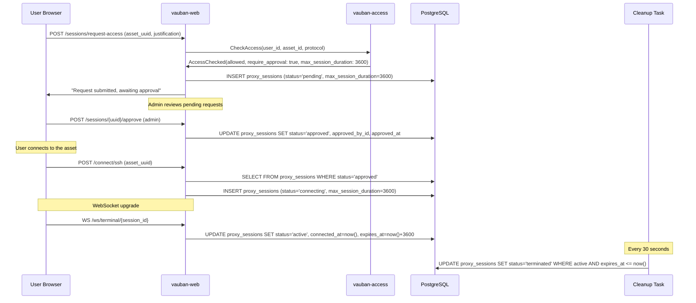

### 15.8 Duration Override at Approval

When approving a JIT access request, administrators can override the default `max_session_duration` that was copied from the access rule at request time. This allows case-by-case adjustments without modifying the underlying access rule.

#### Mechanism

The approval form (`/sessions/approvals` and `/sessions/approvals/{uuid}`) includes optional duration fields:

- **duration_value**: numeric input (minimum 1)
- **duration_unit**: "minutes" or "hours"

When submitted:

1. If both fields are empty, the existing `max_session_duration` is preserved unchanged.
2. If a value is provided, it is converted to seconds and written to `proxy_sessions.max_session_duration`, replacing the original value from the access rule.

#### Priority Chain

```
admin override at approval > access_rule default > unlimited (NULL)
```

#### Validation Constraints

| Constraint | Value |
|------------|-------|
| Minimum duration | 60 seconds (1 minute) |
| Maximum duration | 86,400 seconds (24 hours) |
| Integer overflow | Prevented via `checked_mul` |
| Invalid unit | Rejected with flash error |
| Zero or negative value | Rejected with flash error |

Invalid values cause the approval to fail with a flash error message (PRG pattern redirect), leaving the session in `pending` status so the administrator can retry with a valid duration.

#### Data Flow

```
access_rules.max_session_duration
  -> proxy_sessions.max_session_duration (copied at request time)
  -> [optional] admin override at approval (updates proxy_sessions.max_session_duration)
  -> proxy_sessions.expires_at (computed at WebSocket activation as connected_at + max_session_duration)
  -> cleanup task enforces expires_at
```

### 15.9 Approval Audit & Separation of Duties

JIT requests are decided by humans, so the *who*, *when*, *why* and *from where* of each decision matter as much as the *what*. Two complementary properties make those decisions trustworthy:

- **Separation of Duties (SoD).** A user who can request access cannot also approve their own request, even if they otherwise hold an approver role.
- **Auditability.** Every approval and every rejection produces an append-only audit row that survives later changes to users, assets, sessions or access rules.

Both properties are enforced at multiple layers (UI, IPC, DB) so that a regression — or a compromise — at one layer is contained by the next.

#### 15.9.1 Threat Model

The threat catalog drives the design. Each threat is mapped to the layer that catches it.

| ID | Threat | Mitigation |
|----|--------|------------|
| T1 | A user with both `request` and `approve` permissions approves their own request. | UI hides the buttons; IPC `evaluate_eligibility` returns `SelfApproval`; DB `CHECK (approved_by_id <> user_id)` rejects the row. |
| T2 | A compromised `vauban-access` re-points an existing audit row to a different `session_uuid`. | `block_approval_audit_log_mutation` trigger blocks every `UPDATE` on `approval_audit_log`. |
| T3 | An operator tampers with audit history (`UPDATE`/`DELETE` on the table). | Same trigger; raised as a `CHECK` violation with an error string containing `approval_audit_log is append-only`, which is also the runbook's grep keyword. |
| T4 | A compromised `vauban-web` reports a forged client IP to make decisions look as if they came from a trusted location. | `decision_ip` is resolved by the trusted-proxy middleware *before* the IPC call; `vauban-access` records what `vauban-web` reports but the truth is fixed by the middleware contract. |
| T5 | Two approvers race to approve the same request; both succeed and both audit rows are written. | The decision is performed inside a single Diesel transaction with a TOCTOU re-check on `status='pending'`; the loser receives `ApprovalDenied{SessionNotPending}`. |
| T6 | A rejection is "silent" — no audit footprint, leaving operators unable to count or grep rejections. | Reject decisions go through the same code path and write the same shape of row, with `decision='reject'` and an optional `decision_reason`. |
| T7 | After a rejection, the session is silently transitioned back to `approved` by an attacker. | The handler refuses any `RecordApprovalDecision` whose target session is not `pending`; the response is `ApprovalDenied{SessionNotPending}`. |
| T8 | A user is hard-deleted to erase their audit footprint. | `users.id` references in `approval_audit_log` use `ON DELETE SET NULL`, but the append-only trigger blocks the cascaded `UPDATE`. The hard delete therefore fails as long as any audit row references the user. Soft-delete is the supported path; the snapshot username keeps the row readable. |
| T9 | An API-key-only path bypasses the human approval flow. | The session-token gate (see [AccessGuard](Vauban_AccessGuard_Architecture_EN(1.0).md)) requires a fresh token signed by `vauban-access`; only the IPC code path that runs `evaluate_eligibility` can issue it. |

#### 15.9.2 Schema

Migration `20260425000000_approval_audit_and_sod` adds:

- New columns on `proxy_sessions`: `rejected_by_id INTEGER`, `rejected_at TIMESTAMPTZ`, `decision_reason TEXT`.
- Two `CHECK` constraints, both named so that runbook queries can grep them:
  - `approval_separation_of_duties`: `approved_by_id IS NULL OR approved_by_id <> user_id`.
  - `rejection_separation_of_duties`: `rejected_by_id IS NULL OR rejected_by_id <> user_id`.
- A new table `approval_audit_log` that is *append-only* by trigger (`block_approval_audit_log_mutation` raises on every `UPDATE` and `DELETE`).

| Column | Type | Notes |
|--------|------|-------|
| `id` | `BIGSERIAL` PK | Monotonic ordering for paginated audit reads. |
| `session_uuid` | `UUID NOT NULL` | The decided session. Indexed for per-session lookups. |
| `decision` | `TEXT NOT NULL CHECK (decision IN ('approve','reject'))` | Pinned by Tier 7 structural test. |
| `actor_user_id` | `INTEGER NULL` (FK `users` `ON DELETE SET NULL`) | Nullable so rows survive (logical) user removal. |
| `actor_username` | `TEXT NOT NULL` | **Snapshot** of the username at decision time. |
| `requester_user_id` | `INTEGER NULL` (FK `users` `ON DELETE SET NULL`) | See above. |
| `requester_username` | `TEXT NOT NULL` | Snapshot. |
| `asset_uuid` | `UUID NOT NULL` | |
| `asset_name` | `TEXT NOT NULL` | Snapshot. |
| `protocol` | `TEXT NULL` | Mirrors `proxy_sessions.session_type` at decision time. |
| `duration_override_seconds` | `INTEGER NULL` | Recorded only when an override was applied. |
| `decision_reason` | `TEXT NULL` | Mirrored from the form for both approve and reject. |
| `decision_ip` | `INET NULL` | Resolved by the trusted-proxy middleware. |
| `decision_user_agent` | `TEXT NULL` | Best-effort. |
| `request_id` | `TEXT NULL` | The audit middleware's request id, for log correlation. |
| `created_at` | `TIMESTAMPTZ NOT NULL DEFAULT NOW()` | |

Indexes: `(actor_user_id, created_at DESC)`, `(requester_user_id, created_at DESC)`, `(asset_uuid, created_at DESC)` — sized for the three pages every operator runs (per-actor, per-requester, per-asset).

#### 15.9.3 Decision Flow

```mermaid
sequenceDiagram
    participant U as Approver Browser
    participant W as vauban-web
    participant AC as vauban-access
    participant DB as PostgreSQL

    U->>W: POST /sessions/{uuid}/approve (or /reject)
    Note over W: CSRF check; trusted-proxy IP; audit request_id
    W->>AC: CheckApprovalEligibility(actor, session)
    AC->>DB: SELECT session, requester, asset, rule (read-only)
    AC->>W: ApprovalEligibility{eligible, deny_reason?}
    alt eligible
        W->>AC: RecordApprovalDecision(actor, session, kind, reason, ip, ua, request_id)
        AC->>DB: BEGIN; re-check pending; UPDATE proxy_sessions; INSERT approval_audit_log; COMMIT
        AC->>W: ApprovalRecorded
        W->>U: 303 redirect + flash success
    else SelfApproval / NotPending / RuleChanged / RequesterDisabled
        AC->>W: ApprovalDenied{reason}
        W->>U: 303 redirect + flash error
    end
```

The transaction is the contract: either the session moves out of `pending` *and* an audit row exists, or neither does. Tier 1 tests exercise both injected-failure paths.

#### 15.9.4 UI Gating

The web UI complements the IPC layer rather than replacing it. The list page splits requests into two sections:

- **Awaiting your decision** — the actionable queue. The viewer's own pending requests are *excluded*.
- **Your pending requests** — read-only, with an explanatory pill.

The detail page hides the Approve/Reject buttons for the viewer's own pending request and renders the same explanatory pill. The sidebar count badge excludes the viewer's own pending requests so the queue indicator reflects what the viewer can actually act on. Every gate is also enforced server-side: if the UI is bypassed, the IPC layer still returns `SelfApproval`.

#### 15.9.5 Mono-Admin Deployments

If a deployment has fewer than two administrators, SoD becomes structurally impossible to satisfy without external help. `vauban-access` detects this at boot and re-checks every 30 minutes; a `WARN` log line is emitted with a runbook keyword. The product still enforces SoD — the warning surfaces the operational risk rather than relaxing the rule.

#### 15.9.6 Operator Surface

A read-only `/audit/approvals` page renders `approval_audit_log` with pagination and filters on actor, requester, asset, decision and date range. The page is admin-only via Casbin and explicitly states that the table is append-only and snapshot-frozen, so what is rendered is what existed at decision time, not what exists today.

For deeper analysis or export, see [`docs/runbooks/approval_audit.md`](../runbooks/approval_audit.md).

---

## 16. Tamper-Evident Audit Log (WORM)

### 16.1 Purpose

`vauban-audit` is the durable, append-only, inviolable record of every
security-relevant action on the bastion. Two complementary streams feed it:

- **`vauban-web`** is the richest producer. It emits a typed `AuditEvent` at
  every authentication, MFA, session, user, policy, asset-group, asset and
  JIT-approval seam, plus a centralized `AccessDenied` at the cross-cutting
  denial points (`session_access::verify`, `step_up::enforce_totp_step_up`).
  Emission goes through `crate::services::emit_audit` (fire-and-forget,
  bounded queue) or `emit_audit_critical().await` (auth / escalation: blocks
  on a durable ack and fails the operation closed if the event cannot be
  recorded).
- The proxies (`vauban-proxy-ssh`, ...) emit session lifecycle events on their
  own pipes.

Before this work, `vauban-web` was effectively mute (it produced only an
Apache-style `tracing` line and never an `AuditEvent`), and `vauban-audit`
persisted nothing (the handler `info!`-logged and acked with a
`// TODO: Write to WORM storage` stub). Both gaps are now closed.

### 16.2 On-disk format (JSON-Lines segments)

A segment is a JSON-Lines file (`audit/YYYY/MM/audit-<n>.jsonl`), one
self-describing record per line. Two record kinds share one envelope
(`core` + `hash`):

- `event` -- an audit event (auth, session, policy, ...).
- `seal` -- an Ed25519 signature over the chain head at seal time, emitted on
  a size threshold, on segment rotation, and on drain/shutdown.

Segments are obtained from the supervisor's append-only broker
(`AuditLogFileRequest`/`Response`, opened `O_APPEND | O_CREAT`, **never**
`O_TRUNC`) and are confined under the dedicated audit tree (`[audit] log_path`,
e.g. `/var/vauban/audit/`) with a strict
`^[0-9]{4}/[0-9]{2}/audit-[0-9]+\.jsonl$` name validation that rejects `..`
(this also closes the path-traversal finding for the audit path).

### 16.3 Tamper-evidence (defence in depth)

1. **Hash chain (BLAKE3).** Each record carries `prev` (the previous record's
   hash) and its own `hash = BLAKE3(prev_hash || canonical(core))`. Flipping a
   byte, deleting a line, or reordering records breaks the chain. The head
   crosses segment boundaries (a new segment continues the previous head). The
   genesis `prev` is 32 zero bytes.
2. **Sequence numbers.** Strictly monotonic `seq`, so a removed record leaves a
   detectable gap even before the hash check.
3. **Ed25519 seal.** `seal` records sign the raw chain head with the audit
   signing key. An attacker who can rewrite the file but does not hold the
   private key cannot forge a valid seal: the chain can only be silently
   *truncated after the last seal*, never edited in place.

Every append is `flush()`-ed and `sync_all()`-ed before the producer is acked,
so an `AuditAck` strictly means "durably persisted and chained".

### 16.4 Signing-key trust model

The WORM log lives in its **own dedicated tree** (`[audit] log_path`),
deliberately separate from the session-recordings tree (`[recording]
storage_path`): the WORM log is append-only and never purged, whereas recordings
are large media subject to the retention reaper. The default is the
workspace-local `audit/` in dev and `/var/vauban/audit` in production, with
dedicated ownership (`vb-audit`) so operators can apply a distinct backup /
immutability policy (e.g. an append-only / WORM mount).

The Ed25519 signing seed (32 bytes) is **sealed by the vault** under the
dedicated `audit` keyring (AES-256-GCM) and written to
`<log_path>/signing_key.sealed` (+ `signing_key.pub`). The on-disk location is
**environment-configurable**, never a hard-coded absolute path: it defaults to
`<[audit] log_path>/signing_key.sealed` and can be overridden with the optional
`[audit] signing_key_path` TOML key.

**Auto-provisioning (every environment).** On boot the supervisor checks for the
sealed key and, when absent, generates one **automatically** -- it spawns a
one-shot `vauban-vault seal-audit-key <path>` subprocess (so the master key
material only ever lives in the vault process, never in the long-running
supervisor daemon) before starting the audit service. This is idempotent (a
no-op once the key exists) and runs identically in dev and production, so a
fresh install gets a signed WORM log out of the box with no manual step. If the
generation fails (e.g. the vault master key is not yet provisioned), boot
continues and audit runs in BestEffort mode (hash-chained but unsigned). The
same `vauban-vault seal-audit-key` command remains available for explicit
out-of-band provisioning / key rotation; run manually it resolves the default
path from the `VAUBAN_AUDIT_SIGNING_KEY_PATH` / `VAUBAN_AUDIT_LOG_PATH`
environment (or an explicit path argument).

The supervisor reads the sealed blob from the resolved path and passes it to the
audit child via `VAUBAN_AUDIT_SIGNING_KEY_SEALED`. At boot
`vauban-audit` unseals it exactly once via `VaultDecrypt{domain="audit"}` over
the `Audit -> Vault` pipe (bounded retry), then signs locally. The per-peer
vault matrix grants `Decrypt{audit}` to the `audit` peer **only**, and grants
the `audit` peer nothing else, so the seed never leaves the audit process and
no other peer can read it. In `BestEffort` mode an unavailable vault degrades
to an unsigned hash chain with a `warn!`; `Required` mode fails closed.

### 16.5 Fail-closed contract

If persistence fails (no segment, broker failure, write error), the audit
service replies `AuditNack` (never a silent `AuditAck`), bumps the
`events_failed` anomaly counter, and `warn!`s. On the web side, critical
producers (`emit_audit_critical`) treat an `AuditNack`/timeout as an error and
fail the operation; fire-and-forget producers drop the event with an `error!`
if their bounded queue is saturated, so a flood never blocks the request path.

### 16.6 Offline verification

`vauban-audit verify --pubkey <signing_key.pub> <path>` replays a segment
from genesis, recomputing every hash, checking sequence continuity, and
verifying each Ed25519 seal against the **out-of-band** verifying key
(the `.pub` written by `vauban-vault seal-audit-key`). The in-band
`pubkey` field is compared to that pin; a rewritten file with a fresh
keypair is `PubkeyMismatch`, not `OK`. The CLI refuses to run without
`--pubkey`. The unit tests in
[`vauban-audit/src/worm.rs`](../../vauban-audit/src/worm.rs)
exercise build/verify round-trips, byte flips, line deletion, reordering,
seal verification, and inter-segment chain continuity; the
[`scripts/check_audit_worm.sh`](../../vauban-audit/scripts/check_audit_worm.sh)
lint pins the persist-then-ack and fail-closed invariants in source.

---

## Appendix A: Complete Login Flow

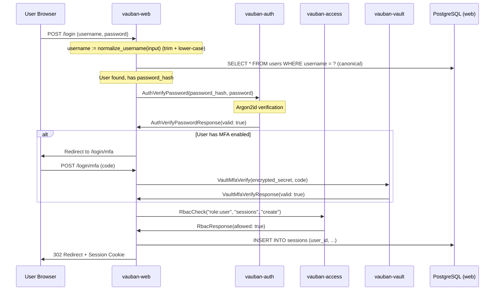

### Case-insensitive login identifiers

Login identifiers are **case-insensitive**: `Alice`, `alice` and `ALICE`
denote the same account. The contract is enforced on three layers that
must stay in lock-step:

1. **Canonical form** — `shared::username::normalize_username` (trim +
   lower-case) is the single source of truth. Every write site funnels
   through it: the REST create handler (`handlers::api::accounts`), the
   admin web create / edit forms (`handlers::web::users`), the
   admin IPC handlers (`ipc::admin`), the LDAP just-in-time provisioning
   (`handlers::auth::jit_provision_ldap_user`) and the
   `vauban-supervisor` superuser-create / reset commands.
2. **Lookup** — the login handler looks the account up by the same
   canonical form. The **raw** typed value is still what gets handed to
   the LDAP/AD bind DN (`{username}` substitution): AD is case-insensitive
   on `sAMAccountName`/UPN, and a directory using a case-exact bind
   attribute keeps working.
3. **Storage** — a DB-level `UNIQUE INDEX idx_users_username_lower ON
   users (lower(username))` (migration `20260628000000`) is the final
   backstop, so even a code path that forgets to normalise cannot create
   a case-variant duplicate. This also closes a latent LDAP bug where a
   re-cased spelling of an already-provisioned directory user could mint
   a second shadow account.

The original (as-typed) casing of a federated user is preserved verbatim
in `users.external_id` for audit/forensics; only the `username` identity
column is canonicalised.

---

## Appendix B: Complete SSH Connection Authorization Flow

This flow now includes the **defense-in-depth RBAC re-check** performed
by `vauban-proxy-ssh` against `vauban-access` via the shared
`shared::access_guard` module (see
[Vauban_AccessGuard_Architecture_EN(1.0).md](Vauban_AccessGuard_Architecture_EN(1.0).md)
for the API, threat model, and tests). The re-check is independent of
the UI-side gate — a verdict from `vauban-web` is necessary but not
sufficient for the proxy to open the upstream session.

```mermaid
sequenceDiagram
    participant U as User Browser
    participant W as vauban-web
    participant AC as vauban-access
    participant S as vauban-supervisor
    participant P as vauban-proxy-ssh
    participant V as vauban-vault
    participant T as Target Server

    U->>W: Click "Connect SSH" on asset (asset_id, group_id)

    Note over W,AC: Layer 1 — UI-side instance-level access check
    W->>AC: AccessRequest::CheckAccess(user_id, group_id, "ssh")
    AC->>W: AccessChecked(allowed: true, require_mfa: false)

    Note over W,AC: RBAC feature check
    W->>AC: RbacCheck("role:user", "sessions", "create")
    AC->>W: RbacResponse(allowed: true)

    Note over W,S: TCP connection brokering
    W->>S: TcpConnectRequest(session_id, host, port, ProxySsh)
    S->>T: DNS + TCP connect
    S->>P: send_fd(connected_socket) via SCM_RIGHTS
    S->>W: TcpConnectResponse(success)

    Note over W,P: SSH session setup
    W->>P: SshSessionOpen(session_id, user_uuid, asset_uuid, host_key)

    rect rgb(255, 240, 220)
    Note over P,AC: Layer 2 — Defense-in-depth RBAC re-check (shared::access_guard, in tokio::spawn, 10s hard timeout)
    P->>AC: AccessRequest::CheckAccessByUuid(user_uuid, asset_uuid, "ssh")
    AC->>P: AccessChecked(allowed: true) | Error | (no reply -> Timeout)
    end

    alt AccessGuard verdict != Granted
        P->>W: SshSessionOpened(success=false, error="Access denied")
        W->>U: Flash error / 403
    else AccessGuard verdict == Granted
        P->>V: VaultGetCredential(asset_id)
        V->>P: VaultCredentialResponse(ssh_key)
        P->>T: SSH handshake (over pre-connected socket)
        P->>W: SshSessionOpened(success=true)
        W->>U: Redirect to /sessions/terminal/{id}
    end
```

> **Why two checks for the same policy?** Layer 1 gates the UI (no
> useless TCP brokering for denied users; correct redirects). Layer 2
> is the authoritative gate — a compromised `vauban-web` cannot
> instruct the proxy to open a session that `vauban-access` would
> deny. The same `access_rules` table answers both questions; there is
> no historical superuser/staff bypass on either layer (see
> [docs/runbooks/ipc_topology_debugging.md §6](../runbooks/ipc_topology_debugging.md)
> for the bootstrap procedure).
>
> **RDP follows the identical pattern.** Replace `vauban-proxy-ssh` ->
> `vauban-proxy-rdp`, `SshSessionOpen` -> `RdpSessionOpen`,
> `SshSessionOpened` -> `RdpSessionOpened`, and `protocol = "ssh"` ->
> `protocol = "rdp"`. The `shared::access_guard` module is
> protocol-agnostic by design — see
> [Vauban_AccessGuard_Architecture_EN(1.0).md §9](Vauban_AccessGuard_Architecture_EN(1.0).md)
> for the cookbook to wire any future proxy (VNC, Modbus, OPC-UA, ...).

---

## Appendix C: Workspace Structure (IAM-related)

```
/Users/mnemonic/Code/Vauban/
├── config/
│   └── access/
│       ├── model.conf              # Casbin RBAC model definition
│       └── default_policy.csv      # Default three-role policy
├── shared/src/
│   └── messages.rs                 # AccessRequest, AccessResponse, Auth messages
├── vauban-auth/
│   ├── Cargo.toml                  # argon2 0.5, rand 0.8
│   └── src/
│       └── main.rs                 # Auth service (password hash/verify)
├── vauban-access/
│   ├── Cargo.toml                  # casbin, diesel-async, deadpool
│   └── src/
│       ├── main.rs                 # Service entry (Casbin + message dispatch)
│       ├── lib.rs                  # Library crate exports
│       ├── handlers.rs             # 25 AccessRequest handlers (Diesel DSL)
│       └── db.rs                   # Connection pool (sandbox-compatible)
│       # NOTE: Diesel schema is re-exported from vauban-db (pub use vauban_db::schema)
├── vauban-db/src/
│   └── schema.rs                   # Diesel schema (all tables, including access_rules, etc.)
├── vauban-web/
│   ├── src/
│   │   ├── ipc/
│   │   │   ├── auth.rs             # AuthIpcClient (verify/hash)
│   │   │   └── access.rs           # AccessIpcClient (RBAC + access rules)
│   │   ├── services/
│   │   │   ├── rbac.rs             # RbacService wrapper (thin shim over AccessIpcClient; Casbin is the single source of truth)
│   │   │   └── access.rs           # Access service (IPC-only; the Diesel DSL fallback has been removed)
│   │   ├── handlers/
│   │   │   ├── web/access_rules.rs # Web form handlers (CSRF + RBAC)
│   │   │   └── api/access_rules.rs # REST API handlers
│   │   ├── models/
│   │   │   └── access_rule.rs      # Diesel model + API DTOs
│   │   └── templates/assets/
│   │       ├── access_list.rs      # Access rules list template
│   │       ├── access_rule_create.rs
│   │       ├── access_rule_detail.rs
│   │       └── access_rule_edit.rs
│   ├── src/auth/
│   │   ├── mod.rs                  # Re-exports StepUpError + enforce_totp_step_up
│   │   └── step_up.rs              # Reusable TOTP step-up helper (issue #11, §3.8)
│   ├── tests/web/user_edit_test.rs # UX-22 + step-up MFA matrix (issue #11)
│   └── migrations/
│       ├── 20260311000000_access_rules/
│       │   └── up.sql              # CREATE TABLE access_rules
│       └── 20260312000000_drop_asset_group_fk/
│           └── up.sql              # DROP FK for DB separation
├── vauban-db/migrations/
│   └── 20260418000000_users_last_totp_used_window/
│       └── up.sql                  # ADD COLUMN users.last_totp_used_window (step-up replay protection)
└── vauban-supervisor/src/
    └── config.rs                   # AuthConfig, AccessConfig
```

---

## Appendix D: Step-Up MFA Flow (Password Rotation)

```mermaid
sequenceDiagram
    participant U as Operator Browser
    participant W as vauban-web
    participant SU as auth::step_up::enforce_totp_step_up
    participant V as vauban-vault
    participant DB as PostgreSQL (web)

    U->>W: POST /accounts/users/{target}<br/>(form: password=..., totp_code=NNNNNN)
    W->>SU: enforce_totp_step_up(operator_uuid, totp_code)

    SU->>DB: SELECT id, mfa_enabled, mfa_secret,<br/>last_totp_used_window FROM users<br/>WHERE uuid=operator AND NOT is_deleted
    DB-->>SU: row

    alt mfa_enabled=false OR mfa_secret IS NULL/''
        SU-->>W: Err(MfaNotEnrolled)
        W-->>U: 303 → /accounts/users/{target}/edit<br/>flash: "MFA enrollment required..."
    end

    alt secret matches "v{digits}:..." (vault envelope)
        alt state.vault_client is None
            SU-->>W: Err(VaultUnavailable)
            W-->>U: 303 + flash "MFA backend is temporarily unavailable..."
        else vault present
            SU->>V: VaultMfaVerify(encrypted_secret, totp_code)
            V-->>SU: valid: bool
        end
    else plaintext base32 secret
        Note over SU: AuthService::verify_totp(secret, code)
    end

    alt code invalid
        SU-->>W: Err(CodeInvalid)
        W-->>U: 303 + flash "Authenticator code is incorrect."
    end

    Note over SU: window = unix_seconds / TOTP_STEP
    alt window <= last_totp_used_window
        SU-->>W: Err(CodeReplayed)
        W-->>U: 303 + flash "Authenticator code has already been used..."
    end

    SU->>DB: UPDATE users SET last_totp_used_window=window<br/>WHERE id=operator_id
    SU-->>W: Ok(())

    W->>W: Hash new password (vauban-auth)<br/>UPDATE users.password_hash
    W-->>U: 303 → /accounts/users/{target}<br/>flash: "User and password updated successfully"
```

The same helper guards `delete_user_web`; only the redirect target and the gated side-effect (soft-delete vs. password update) change.

---
