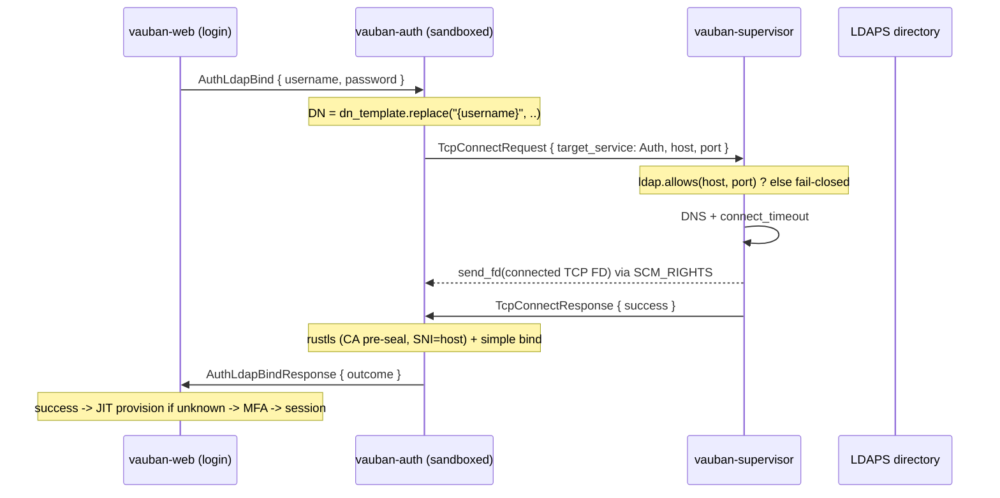

# Vauban LDAPS / Active Directory Authentication Architecture

**Version:** 1.0
**Date:** 1 June 2026
**Status:** Implemented (v1 -- direct bind)

---

## Table of Contents

1. [Introduction](#1-introduction)
2. [Bind inside the sandboxed service](#2-bind-inside-the-sandboxed-service)
3. [End-to-end flow](#3-end-to-end-flow)
4. [Web-side authentication routing](#4-web-side-authentication-routing)
5. [IPC message protocol](#5-ipc-message-protocol)
6. [Supervisor broker gating](#6-supervisor-broker-gating)
7. [Sandbox integration](#7-sandbox-integration)
8. [Configuration](#8-configuration)
9. [Security analysis](#9-security-analysis)
10. [Testing strategy](#10-testing-strategy)
11. [Limitations and roadmap](#11-limitations-and-roadmap)

---

## 1. Introduction

Vauban can authenticate users against an LDAPS / Active Directory directory in
addition to its local Argon2id accounts. The design goal is to add directory
authentication **without** letting the user's plaintext password or the LDAP
network parsing enter the supervisor (the root TCB).

Decisions frozen for v1:

- **Direct bind** via a `dn_template` (UPN or DN). No service account, no LDAP
  search.
- **Synchronous, dependency-light codec**: a hand-rolled minimal BER simple
  bind. No `tokio`, no `ldap3` inside `vauban-auth`.
- **Single attempt, tight timeout** (~5 s), fail-closed.
- **Authentication only** -- no group synchronisation.
- **Anti-enumeration**: every LDAP failure mode collapses to the same generic
  "invalid credentials" response presented to the client.

## 2. Bind inside the sandboxed service

Two integration approaches were considered:

| | Chosen design | Rejected alternative |
|---|---|---|
| TLS + bind | inside `vauban-auth` (sandboxed) | inside the supervisor (root) |
| Supervisor sees password | **never** | yes |
| New attack surface in TCB | DNS + connect only (already present) | full TLS + LDAP/BER parsing |

The chosen design keeps the supervisor doing only what it already does for every
other upstream socket: DNS resolution, `connect()`, and an `SCM_RIGHTS` hand-off
of the connected file descriptor, gated by an `(host, port)` whitelist. The
sandboxed `vauban-auth` service terminates TLS (rustls, validating the chain
against a CA delivered pre-seal) and runs the LDAP simple bind on the
pre-connected FD.

## 3. End-to-end flow



## 4. Web-side authentication routing

Routing lives in `vauban-web/src/handlers/auth.rs` (`login` / `login_web`):

- **Existing user**: `user.auth_source` is authoritative.
  - `Ldap` -> `AuthLdapBind` only; **never** a local fallback (anti-downgrade);
    the local `failed_login_attempts` / `locked_until` counters are **not**
    incremented (the directory owns its own lockout).
  - `Local` -> the existing Argon2id path, including the progressive lockout.
- **Unknown username**: if `[auth.ldaps].enabled` and `order` contains `"ldap"`,
  a bind is attempted; on success the user is **JIT-provisioned**
  (`auth_source = Ldap`, `external_id = username`, sentinel password hash,
  `is_active = true`) and then proceeds to MFA enrolment.
- **Local accounts always work** (break-glass), independent of directory
  availability.
- **MFA**: Vauban's TOTP is always enforced on top of a successful bind; an
  LDAP user with no MFA is routed to `/mfa/setup` on first login.

## 5. IPC message protocol

Three variants are **appended** to `shared::messages::Message` (bincode encodes
enum variants by ordinal, so they must never be inserted mid-enum):

- `AuthLdapBind { request_id, username, password }` -- web -> auth.
- `AuthLdapBindResponse { request_id, outcome }` -- auth -> web.
- `AuthLdapProvision { url, dn_template, ca_pem, timeout_secs }` -- supervisor
  -> auth, **pre-seal** (mirrors `TlsCertProvision`). The CA is trust material,
  not a secret; no bind password is shipped in v1.

`LdapBindOutcome { Success, InvalidCredentials, Unreachable, TlsError }` exists
for internal logging only; the web layer collapses every non-`Success` variant
to a single generic response (SEC-04/05).

## 6. Supervisor broker gating

`handle_tcp_connect_request` grows a `Service::Auth` arm gated by
`config.auth.ldaps.allows(host, port)` -- a token-less `(host, port)` whitelist
derived from the configured `ldaps://` URL, exactly like the mailer's SSRF
guard. Fail-closed when LDAP is disabled or the target is not whitelisted. The
auth service is key-less by design, so the request carries an empty session
token (it is never consulted on this arm).

## 7. Sandbox integration

`vauban-auth` now receives file descriptors, so its profile gains
`ResourceKind::FdReceiver` (`AUTH_KINDS = [IpcPipe, FdReceiver]`) and it seals
with `setup_service_sandbox_extended(.., Some(&[fd_passing_fd]))`. The CA PEM
and LDAP config arrive via `AuthLdapProvision` **before** the sandbox is
entered; after sealing the service can only `recvmsg` the brokered FD and run
TLS over it -- it can open no new sockets. No new `Service` variant is added
(`Service::Auth` already exists), so the pinned service count stays at 9.

## 8. Configuration

Supervisor (`config/vauban.conf`, `[auth.ldaps]`):

```toml
[auth.ldaps]
enabled = false
url = "ldaps://dc.example.com:636"
dn_template = "{username}@example.com"
ca_cert_file = "/usr/local/etc/vauban/certs/ldap_ca.pem"
timeout_secs = 5
order = ["ldap", "local"]
```

Only `ldaps://` is accepted; a plaintext `ldap://` URL is rejected at config
load. The CA file lives under the existing `0700 root:wheel` `certs/` directory
(no new ACL).

Web (`config/default.toml`, `[auth.ldaps]`) only needs the routing knobs:

```toml
[auth.ldaps]
enabled = false
order = ["local"]
```

## 9. Security analysis

- **Privilege separation**: the plaintext password and all LDAP/BER + TLS
  parsing stay inside the sandboxed service; the supervisor only brokers a
  socket.
- **SSRF**: the broker arm is whitelisted to the configured directory endpoint.
- **TLS**: rustls validates the directory chain against the provisioned CA only
  (the public webpki roots are intentionally not trusted); SNI/hostname
  verification uses the configured host.
- **Anti-enumeration**: invalid credentials, unreachable directory and TLS
  errors are indistinguishable to the client.
- **Anti-downgrade**: an `Ldap` user never falls back to local password
  verification.
- **Lockout**: LDAP failures do not touch Vauban's local lockout counters,
  preventing a local-state oracle on directory accounts.
- **Fail-closed BER codec**: every malformed / truncated / oversized response
  is an `io::Error`, never a panic.

## 10. Testing strategy

- **`vauban-auth/tests/ldap_bind_e2e_test.rs`** -- highest-fidelity, in-process,
  zero Docker: an rcgen CA + rustls LDAPS server, a test broker that performs a
  real `SCM_RIGHTS` FD hand-off, and the production `brokered_bind`. Covers
  happy path, wrong password, unknown user, unreachable directory, untrusted
  CA, hostname mismatch, non-blocking `recv_fd`, and codec round-trip /
  malformed-input fail-closed.
- **`vauban-web/tests/security/ldap_login_test.rs`** -- web-layer routing
  against an in-process Auth IPC stub: session creation, MFA enforcement,
  anti-enumeration parity, lockout exclusion, JIT provisioning, directory-down
  fail-closed, and local break-glass.
- **Supervisor** -- broker arm whitelist (allow/deny/disabled) plus the
  `ldap://` config-rejection test.
- **`shared`** -- bincode round-trip and append-only pins for the new variants;
  `AUTH_KINDS` profile drift.

## 11. Limitations and roadmap

- **Single-threaded auth**: the bind blocks the service loop for its (bounded)
  duration in v1; mitigated by the tight timeout and the web IP rate limit. A
  dedicated worker is the v2 path.
- **Direct bind only**: the target directory must accept a direct bind by
  `dn_template`. Search-then-bind (service account + `SearchRequest`) is a v2
  extension.
- **No e-mail from the directory**: JIT-provisioned users get a deterministic
  placeholder e-mail (`{username}@ldap.local`, or the UPN when it already looks
  like one); operators can edit it afterwards.
- **No group synchronisation**: authorization remains driven by Vauban's own
  RBAC / Casbin policy.
