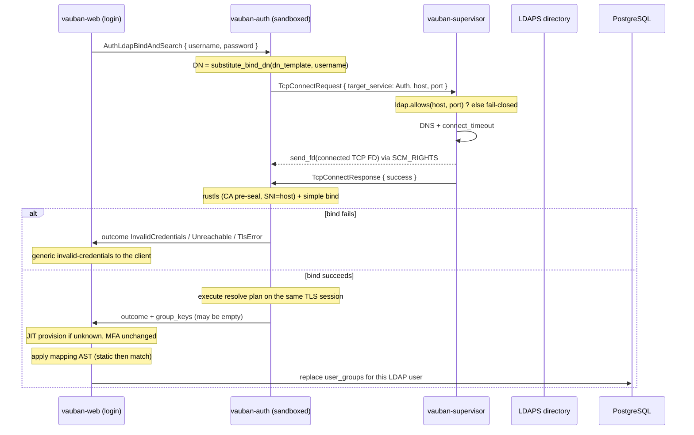

# Vauban LDAPS Authentication and Group Aggregation Architecture

**Version:** 1.1  
**Date:** 21 August 2026  
**Amended:** 22 August 2026 (Phase 1 fail-closed: no deactivation on a
missing entry; `resolve` + `static` / `match` in one file; AD range
retrieval; mapping provision; vendor catalogue)  
**Author:** Richard Ben Aleya  
**Status:** Bind path implemented (v1); group aggregation and mapping file
are the accepted design for the next implementation lot

> Supersedes
> [Vauban_LDAPS_Auth_Architecture_EN(1.0).md](Vauban_LDAPS_Auth_Architecture_EN(1.0).md)
> for everything after the bind-only snapshot. Keep 1.0 as the historical
> "authentication only -- no group synchronization" contract.
>
> **1.1 additions:** directory group resolution after a successful user
> bind; operator mapping file `ldaps_mapping.conf` (`resolve` /
> `static` / `match`); replace-set of Vauban User Groups on LDAP
> shadow accounts; complete versus incomplete search (replace versus
> fail-closed hold -- Phase 1 does not deactivate on a missing
> entry). Product decisions live in
> [ADR 007](../adr/007-ldap-group-aggregation-phase-1.md) and
> [ADR 008](../adr/008-ldaps-mapping-file-dsl.md). Vendor coverage
> is Appendix B.

---

## Table of Contents

1. [Introduction](#1-introduction)
2. [Bind inside the sandboxed service](#2-bind-inside-the-sandboxed-service)
3. [End-to-end flow](#3-end-to-end-flow)
4. [Web-side authentication routing](#4-web-side-authentication-routing)
5. [User Group aggregation](#5-user-group-aggregation)
6. [Mapping file DSL](#6-mapping-file-dsl)
7. [Directory group resolution](#7-directory-group-resolution)
8. [Outcomes of LDAP resolution](#8-outcomes-of-ldap-resolution)
9. [IPC message protocol](#9-ipc-message-protocol)
10. [Supervisor broker gating](#10-supervisor-broker-gating)
11. [Sandbox integration](#11-sandbox-integration)
12. [Configuration](#12-configuration)
13. [Threat inventory](#13-threat-inventory)
14. [Security analysis](#14-security-analysis)
15. [Testing strategy](#15-testing-strategy)
16. [Limitations and roadmap](#16-limitations-and-roadmap)
17. [Related documents](#17-related-documents)
18. [Appendix A -- Changelog](#appendix-a----changelog)
19. [Appendix B -- Directory coverage](#appendix-b----directory-coverage)

---

## 1. Introduction

Vauban authenticates users against an LDAPS directory in addition to
local Argon2id accounts, and (from 1.1) derives Vauban User Group
membership from the directory groups returned after a successful bind.

The design goal is unchanged: the user's plaintext password and all
LDAP/BER + TLS parsing stay inside sandboxed `vauban-auth`. The
supervisor only brokers a TCP socket. `vauban-web` never opens an
LDAPS connection and never builds a bind DN or a search filter.

### 1.1 Decisions frozen (bind -- from 1.0)

- **Direct bind** via `dn_template` (UPN or DN). `{username}` is
  substituted only through
  [`shared::ldap_dn::substitute_bind_dn`](../../shared/src/ldap_dn.rs).
- **Synchronous, dependency-light codec**: hand-rolled BER. No
  `tokio`, no `ldap3` inside `vauban-auth`.
- **Single attempt, tight timeout** (~5 s), fail-closed.
- **Anti-enumeration (login UI)**: every bind failure mode collapses
  to the same generic "invalid credentials" response presented to the
  client.

### 1.2 Decisions frozen (aggregation -- 1.1)

- **Login is the LDAP I/O point.** Bind and group search share the
  same brokered FD and the same user bind. Phase 1 does not introduce
  a directory service account and does not re-query LDAP on
  `auth_sessions` idle refresh or WebSocket revalidation (see
  [ADR 007](../adr/007-ldap-group-aggregation-phase-1.md)).
- **Auth returns directory keys; web maps them.** `vauban-auth`
  returns a bounded list of group keys (DNs, and later mail / CN).
  `vauban-web` applies the compiled mapping AST and writes
  `user_groups`.
- **Replace-set.** Each successful resolution fully replaces the
  LDAP shadow account's User Group membership. Removals on the
  directory side become removals in Vauban at the next successful
  login resolution.
- **Direct membership only.** No nested / transitive groups in
  Phase 1.
- **Strict LDAPS.** No `ldap://`, no StartTLS on 389, no certificate
  validation opt-out.
- **Mapping file, not `dn_template`.** Bind identity stays
  `dn_template` in `[auth.ldaps]`. Group mapping lives in
  `mapping_path` (Casbin-style external file). See
  [ADR 008](../adr/008-ldaps-mapping-file-dsl.md).
- **User Groups are not Casbin roles.** A mapped name such as
  `Administrators` is an Access Rules principal. It does not set
  `is_superuser` / `is_staff` and does not grant `role:superuser`.
- **No Phase 1 deactivation from search.** A successful bind is
  existence proof. Bind-OK then empty / `noSuchObject` /
  `insufficientAccessRights` is incomplete resolution (case C
  effect), not "this user was deleted." Deactivation of directory-
  deleted users is Phase 2 (vault-held read identity).
- **Resolution lives in the mapping file, not `vauban.conf`.**
  `resolve` lines declare how keys are collected (`user-attr` or
  `group-attr`). There is no `groups_base_dn` knob and no
  "if `memberOf` is empty, guess" heuristic. See Section 7 and
  Appendix B.
- **Web derives aggregation from supervisor provision.** The
  mapping file bytes and `aggregation_enabled` ride
  `WebLdapMappingProvision` pre-seal. Web TOML is not the
  authority for that flag.

### 1.3 What aggregation produces

A pure function in `shared`:

```text
(directory group keys, compiled mapping AST) -> set of User Group UUIDs
```

The function is deterministic, order-independent, and has no I/O.
Persistence (replace `user_groups` for that user) stays in
`vauban-web`.

---

## 2. Bind inside the sandboxed service

Two integration approaches were considered for the bind (unchanged
from 1.0):

| | Chosen design | Rejected alternative |
|---|---|---|
| TLS + bind + search | inside `vauban-auth` (sandboxed) | inside the supervisor (root) |
| Supervisor sees password | **never** | yes |
| New attack surface in TCB | DNS + connect only (already present) | full TLS + LDAP/BER parsing |

The supervisor does what it already does for every other upstream
socket: DNS resolution, `connect()`, and an `SCM_RIGHTS` hand-off of
the connected file descriptor, gated by an `(host, port)` whitelist.
Sandboxed `vauban-auth` terminates TLS (rustls, chain validated
against a CA delivered pre-seal) and runs the LDAP simple bind, then
the group search, on that pre-connected FD.

---

## 3. End-to-end flow



`AuthLdapBind` remains on the wire for bind-only callers and tests.
The login path that enables aggregation uses the appended
bind-and-search variant so the password is presented once and the
search rides the already-authenticated LDAP session.

---

## 4. Web-side authentication routing

Routing stays in `vauban-web/src/handlers/auth.rs` (`login` /
`login_web`):

- **Existing user**: `user.auth_source` is authoritative.
  - `Ldap` -> directory bind (and search when aggregation is enabled);
    **never** a local password fallback (anti-downgrade); local
    `failed_login_attempts` / `locked_until` are **not** incremented.
  - `Local` -> existing Argon2id path, including progressive lockout.
    Aggregation is not invoked.
- **Unknown username**: if `[auth.ldaps].enabled` and `order`
  contains `"ldap"`, a bind is attempted; on success the user is
  **JIT-provisioned** (`auth_source = Ldap`, `external_id = username`,
  sentinel password hash, `is_active = true`) and then proceeds to MFA
  enrollment. Aggregation runs after provision (usually an empty
  prior set).
- **Local accounts always work** (break-glass), independent of
  directory availability.
- **MFA**: Vauban's TOTP is always enforced on top of a successful
  bind; an LDAP user with no MFA is routed to `/mfa/setup` on first
  login.

Aggregation never writes `user_groups` for `auth_source = Local`.

---

## 5. User Group aggregation

### 5.1 Scope

In scope for Phase 1:

- Resolve the user's **direct** directory groups after a successful
  bind.
- Map those keys to existing Vauban User Groups via
  `ldaps_mapping.conf`.
- Replace the shadow account's membership on every successful
  resolution (case A), including replacing it with the empty set.
- Distinguish complete resolution from incomplete / unreachable
  resolution (Section 8). Incomplete never deactivates.

Out of scope (Phase 2 or elsewhere):

- Directory service account and a periodic job independent of login.
- Automatic deactivation of an LDAP shadow account because the
  user entry was missing after a successful bind (misconfiguration
  is not deletion; Phase 2 can distinguish the two).
- Forced termination of an open SSH / RDP / IACS session when
  membership shrinks (existing sessions keep AccessGuard /
  `expires_at` / admin terminate).
- Nested (transitive) groups.
- Union / priority among Access Rules (already implemented).
- Creating Vauban User Groups from directory names.
- Promoting `is_superuser` / Casbin roles from the mapping file.
- AD `memberOf;range=` continuation (users with more than ~1500
  direct `memberOf` values are case C in Phase 1).
- RFC 4514 escaped DNs (`\` in a key) as mapping targets.

### 5.2 Cardinalities

- **1 User Group <- N mapping lines** (OR: any matching key joins
  the group, subject to `static` target reservation).
- **1 user -> N User Groups** (Access Rules already union rights).

### 5.3 Replace-set

On case A, `user_groups` rows for that user are replaced by the
computed set. Incremental add-only is rejected: a directory
removal would otherwise never disappear.

Phase 1 treats an LDAP shadow account's User Groups as
**directory-derived only**. A manual extra membership on that
account is overwritten at the next successful resolution. Local
accounts are untouched. If mixed membership is required later, a
provenance column on `user_groups` needs its own ADR.

`vauban_groups.source` / `external_id` / `last_synced` already exist
and may record that a group is referenced by the mapping file; they
do not auto-create groups.

### 5.4 Audit events

Replace-set writes membership that Access Rules consume. Every
applied delta is an audit event (WORM / Notifications as the
existing auth-session pipeline already does for login). Three
structured names:

| Event | When |
|---|---|
| `ldap_aggregation_replaced` | Case A applied a new set (including a no-op identical set) |
| `ldap_aggregation_emptied` | Case A applied the empty set (also emit `replaced`) |
| `ldap_aggregation_purged_failsafe` | Case C crossed the purge threshold |

Fields (WORM `details` JSON and the matching `vauban-web` `info!`
line): `added` / `removed` / `unmapped` are **User Group names**
(not UUIDs, not directory DNs), plus `desired` / `previous` counts.
`unmapped` is the `apply` name set with no existing catalogue row.
Lists are sorted and capped at 64 names (`truncated: true` when
cut). A purge event also carries `streak`. Phase 1 has one
directory source. A case A that moves a user from **one or more**
groups to **zero** also emits a structured `warn!`
(`ldap_aggregation_emptied_from_nonempty`) so a misconfigured
mapping or a missing `resolve` line is visible without waiting for
the case C counter -- case A **resets** that counter, so an
always-empty complete read would otherwise hide the regression.

### 5.5 When LDAP I/O runs

| Event | Bind + search? | Why |
|---|---|---|
| Interactive login (web / API) | Yes | Password is present; one FD |
| JIT provision (first bind) | Yes | Same path |
| `auth_sessions` idle / `last_activity` | No | Password is gone; no service account |
| WebSocket login revalidation | No | Same |
| Mid-session AccessGuard re-check | No | Access Rules use the last written `user_groups` |

The draft "every HTTPS token renewal, delay <= 15 minutes" is
**not** Phase 1. Vauban has no OAuth refresh that re-presents the
directory password. Promising a 15-minute bound without a read
identity would require storing the password or opening an
unauthenticated search -- both rejected. Phase 2 introduces a
vault-held read identity and a periodic job if that bound is
required. See ADR 007.

---

## 6. Mapping file DSL

### 6.1 Path and ownership

Production path (same tree as Casbin, no extra `config/` infix):

```text
/usr/local/etc/vauban/access/ldaps_mapping.conf
```

Repository default:

```text
config/access/ldaps_mapping.conf
```

`vauban.conf`:

```toml
[auth.ldaps]
dn_template = "{username}@example.com"
mapping_path = "/usr/local/etc/vauban/access/ldaps_mapping.conf"
```

`dn_template` remains the bind identity. It is **not** overloaded
as a path. `mapping_path` is the Casbin-style pointer.

The package installs the file `0644` `root:wheel`, next to
`policy.csv` (`pkg/build-pkg.sh`). Whoever can write this file
controls which User Groups an LDAP user may gain and how keys
are collected. The supervisor reads and validates it **pre-seal**,
fail-closed. No hot-reload in Phase 1: change the file, restart
the supervisor.

When `[auth.ldaps].enabled = true` and aggregation is enabled, a
missing, unreadable, oversized, or illegal mapping file refuses
boot. Maximum file size is **128 KiB**. The supervisor validates
with `shared::ldap_mapping::parse` **and** splits the result:
the compiled **resolve plan** goes to `vauban-auth`
(`AuthLdapAggregationProvision`); the **raw file bytes** go to
`vauban-web`. Web compiles `static` / `match` with the same
function. A serialized AST on the wire is rejected (one parser,
no version skew). `vauban-web` never reopens the path after seal.
`vauban-auth` never sees User Group names or `match` lines.

The shipped default
([`config/access/ldaps_mapping.conf`](../../config/access/ldaps_mapping.conf))
is a **commented catalogue** of market directories (most common
first). Comments-only parses as empty. When aggregation is on, a
file with **no `resolve` line** refuses boot -- the operator
uncomments the matching vendor block.

### 6.2 Grammar

Line-oriented, Casbin-adjacent. Not Python, not evaluated. Two
planes in one file:

```text
# --- resolve (vauban-auth) ---
resolve  user-attr   memberOf
resolve  group-attr  member  base OU=groups,DC=netris,DC=local

# --- map (vauban-web) ---
static   CN=Domain Admins,CN=Users,DC=netris,DC=local          Administrators
match    CN={name},OU=UserGroup,OU=Vauban,DC=netris,DC=local   {name}
```

| Token | Meaning |
|---|---|
| `resolve` | How to collect directory keys (Section 7). Not a mapping. |
| `static` | Exact directory key (after normalization) maps to one existing User Group name |
| `match` | One `{name}` capture in the key; the same `{name}` is the User Group name |
| `#` | Comment to end of line |
| empty line | Ignored |

`resolve` lines:

```text
resolve  user-attr   <attr>
resolve  group-attr  <attr>  base <dn>  [key dn|mail]
```

- Phase 1 `<attr>` allowlist: `user-attr` = `memberOf` |
  `isMemberOf` | `isDirectMemberOf`; `group-attr` = `member` |
  `uniqueMember`. Charset RFC 4512. Any other token refuses boot.
- `user-attr` forbids `base`. `group-attr` requires `base`. The
  base DN is operator trust (no `{name}`, `{username}`, or `\`).
- `key` is optional, default `dn`. `mail` collects the group's
  `mail` attribute (Google Secure LDAP) instead of its DN.
- Compare value in a `group-attr` filter is the **bound user DN**
  (Phase 1). `compare uid` (POSIX `memberUid`) is a planned
  extension, not parsed yet -- that token refuses boot.
- At least one `resolve` line when aggregation is on; at most
  **3** `resolve` lines. Duplicate identical lines are ignored.
- Multiple `resolve` lines **union** their keys (no first-hit
  wins, no "if `memberOf` empty then fallback").

`static` / `match` rules:

- Fields are separated by ASCII whitespace. The LDAP key may contain
  spaces (AD CNs). The last field is the User Group token (`{name}`
  or a literal). Implementation: kind = first token, target = last
  token, key = trim(middle).
- The only placeholder is `{name}`. `{username}` is bind-only and
  is illegal in this file.
- A `match` line must contain `{name}` in the key **exactly once**
  **and** the target must be exactly `{name}`.
- A `match` is **whole-key** equality after normalization, never a
  substring search. `{name}` cannot span a comma (the capture
  charset already forbids `,`). A `@` in a `match` key is literal
  text around the capture (`{name}@netris.eu`).
- A `static` line must not contain `{name}`.
- A mapping-file key that contains `\` refuses boot. RFC 4514
  escaped DNs are not mappable in Phase 1. A directory key that
  contains `\` never matches (defined miss, not a parse of the
  escape).
- Unknown kind, unknown placeholder, or a `match` without `{name}`
  on both sides refuses boot.
- Duplicate `static` keys with different targets: OR (user gains
  both groups) -- allowed. Duplicate identical lines: ignored.
- File order does not affect `static` / `match` evaluation.

`{name}` is a **capture against keys already returned** by the
directory. It is never interpolated into a bind DN or a search
filter (R1). `static` lines do **not** expand into searches.

### 6.3 Evaluation and `static` target reservation

1. Build `reserved` = the set of User Group names that appear as
   `static` targets, compared **case-insensitively** (same folding
   as the `vauban_groups.name` lookup).
2. For each directory key (normalized for comparison):
   - apply every matching `static` line (OR);
   - then apply every `match` line against the **same** key
     (`static` does **not** consume or shadow the key -- only the
     **target name** is reserved);
   - if the captured `{name}` is in `reserved`, skip that hit and
     emit a structured `warn!`
     (`ldap_mapping_match_skipped_reserved_target`).
3. Look up remaining names as existing `vauban_groups.name` **at
   apply time**, not at boot. A User Group created after start is
   visible on the next successful login without a supervisor
   restart. Missing groups are skipped (no implicit create).
4. Result is a set of UUIDs.

Example:

| Directory key | Result |
|---|---|
| `CN=Domain Admins,CN=Users,DC=netris,DC=local` | User Group `Administrators` |
| `CN=Administrators,OU=UserGroup,OU=Vauban,DC=netris,DC=local` | **none** for `Administrators` (`static` reserved that target) |
| `CN=Developers,OU=UserGroup,OU=Vauban,DC=netris,DC=local` | User Group `Developers` if it exists |

### 6.4 Normalization and captured `{name}`

- DN comparison: lowercase, strip whitespace around commas, collapse
  repeated spaces inside RDN values. Comparison is string-based after
  that pass (not a full RFC 4514 rewrite). Lowercase is
  **comparison-only**.
- `{name}` is captured from the **original** (pre-lowercase) key,
  then trimmed. The stored User Group name keeps that spelling
  for display; lookup against `vauban_groups.name` is
  case-insensitive.
- `{name}` charset (skip the key if the capture fails): ASCII
  alphanumeric, space, `.`, `_`, `-`; first character alphanumeric;
  length 1..=100; no RFC 4514 specials (`, = + " \ < > # ;`).
- A captured `{name}` that fails the charset is a miss for that
  key, not a boot failure.

### 6.5 Key kinds

`resolve … key mail` collects group **mail** values. `static` /
`match` then score those strings (for example
`{name}@netris.eu`). Do not invent a second file. A later
`compare uid` token (POSIX `memberUid`) is the same grammar with
a new allowlisted word -- new ADR only if the filter compare
value leaves the user DN.

---

## 7. Directory group resolution

Directories expose membership in two LDAP mechanisms (not a
vendor enum). The mapping file **declares** which ones to run.
Appendix B lists the market against this grammar.

| Model | Mechanism | Typical vendors |
|---|---|---|
| Attribute on the user | Multivalued `memberOf` / `isMemberOf` / `isDirectMemberOf` | Active Directory, Entra ID DS, FreeIPA, 389 with `memberOf` plugin, Kanidm, LLDAP, JumpCloud, PingDirectory |
| Attribute on the group | `member` / `uniqueMember`; search groups | OpenLDAP default, Authentik, Google Secure LDAP, Okta LDAP Interface, Apache DS |

Auth executes the compiled resolve plan, in declaration order,
and **unions** the keys:

1. After bind, locate the bound user entry (base = bind DN when it
   is a DN; otherwise a filter on `sAMAccountName` / `uid` built
   with the LDAP filter encoder, never `format!`). Needed so a
   `group-attr` line has a user DN to encode.
2. For each `resolve user-attr <attr>`: read that attribute on the
   user entry. A `;range=` option suffix (AD range retrieval,
   typically `memberOf;range=0-1499`) makes the **whole
   resolution** incomplete (case C). Phase 1 does not issue
   continuation range requests.
3. For each `resolve group-attr <attr> base <dn>`: **one** subtree
   search under that base,
   `(<attr>=<encoded user DN>)`. Returned entries contribute
   their DN, or their `mail` when `key mail` is set.
4. `static` / `match` never expand into extra searches. They only
   score keys already returned.
5. `SearchResultReference` (referrals) are **ignored and never
   followed**. The broker whitelists one `(host, port)`. A
   referral-only result with no entries is incomplete (case C),
   not an empty case A.

An empty `user-attr` (no `memberOf` values) is **not** a signal
to invent a reverse search. If the operator also declared
`group-attr`, that line runs because it was declared. If they
declared only `user-attr` and the attribute is empty, the key
list is empty (case A with zero groups).

Nested groups (AD `LDAP_MATCHING_RULE_IN_CHAIN`, FreeIPA nesting)
are Phase 2 and vendor-specific, except where a vendor virtual
attribute already expands them (`isMemberOf` on PingDirectory).
Operators mapping AD / FreeIPA must use groups assigned
**directly** to users.

Every filter value (username, user DN, group DN) goes through a
dedicated RFC 4515 encoder in `shared` (sibling of
`substitute_bind_dn`). Concatenating into `(sAMAccountName=…)` or
`(member=…)` is forbidden (R1). Lint:
`shared/scripts/check_untrusted_interpolation.sh`.

Bind and search share **one** `timeout_secs` budget (default 5 s),
not a second timer. The single-threaded auth loop stays bounded.

---

## 8. Outcomes of LDAP resolution

The bind UI still collapses failures for anti-enumeration. The
**search** step after a successful bind must not collapse "no such
object" with "directory unreachable," and Phase 1 must not treat
either as "this user was deleted."

A successful simple bind is existence proof. A user removed from
the directory cannot bind (`invalidCredentials`) and never reaches
the search. Bind-OK then empty / `noSuchObject` /
`insufficientAccessRights` is almost always **misconfiguration**
(wrong user attribute, Google Secure LDAP with "Verify user
credentials" and no "Read user information", Authentik with
`memberOf` hidden by ACL and no `group-attr` resolve, an
unfollowed referral) -- not deletion. Automatic deactivation on that signal is Phase 2, when
a vault-held read identity can search **without** the user bind.

Three **directory signals** remain for logs and tests. Phase 1
has only two **effects**: replace (A) or fail-closed hold (B and
C share the hold path).

```text
After successful bind
      |
      |-- (A) Complete entry read, groups parsed (zero or more
      |       keys; no range truncation; no key-list overflow)
      |       -> replace user_groups with mapping(keys)
      |       -> reset the consecutive search-failure counter
      |       -> audit ldap_aggregation_replaced
      |          (+ ldap_aggregation_emptied when the new set
      |          is empty)
      |
      |-- (B) Entry explicitly not found or unreadable
      |       (LDAP noSuchObject / empty search /
      |        insufficientAccessRights after a successful bind
      |        -- not a TCP/TLS error)
      |       -> **same effect as (C)** in Phase 1
      |       -> do not deactivate; do not replace user_groups
      |
      +-- (C) Search timeout / truncated / malformed / TLS drop /
              memberOf;range= / key-list overflow / referral-only
              result after bind
              -> do not change user_groups
              -> increment consecutive-failure counter
              -> at threshold: purge user_groups, do NOT deactivate
              -> raise one ops signal (Notifications / Bastion Watch
                 tile -- radar stays read-only)
              -> audit ldap_aggregation_purged_failsafe at the
                 threshold crossing only
```

Case (B) must not deactivate. Case (C) must not deactivate.
A down or misconfigured directory is not "this user was deleted."

Bind-level `Unreachable` / `TlsError` / `InvalidCredentials` still
deny login and do **not** deactivate the account (1.0). They are
not case (B) and they do **not** increment the aggregation
counter (the search never ran).

### 8.1 Threshold (case C, and case B which shares the effect)

| Parameter | Default | Notes |
|---|---|---|
| Consecutive incomplete resolutions before purge | 3 | Reset on any case A (including an empty complete set) |
| Storage | In-memory in `vauban-web` (`AtomicU32` per LDAP source) | Not persisted; a supervisor/web restart zeroes the counter |
| Granularity | Per LDAP source for the counter and the alert; purge applied to the user whose login just failed the search | Phase 1 has one directory |
| Alert | Latch on **crossing** the threshold | Not one notification per failed login |
| Configurable | `[auth.ldaps].aggregation_fail_closed_threshold` | `0` disables purge (keep last groups forever on search errors) -- allowed for break-glass labs; production default is 3 |

Because Phase 1 search runs at login only, three failures means
three logins that bound successfully but could not read groups, not
a 45-minute clock.

A later case A **restores** groups from the directory (auto-heal).
The battle suite must cover "purge then successful login restores
membership" so a sticky empty set after recovery is a test failure.

---

## 9. IPC message protocol

Bincode encodes enum variants by ordinal. New variants are
**appended**. Existing `AuthLdapBind` / `AuthLdapBindResponse` /
`AuthLdapProvision` layouts stay unchanged ([ADR 004](../adr/004-flat-message-enum.md)).

Append (names are design-level; implementation may bike-shed
identifiers as long as ordinals stay append-only):

- `AuthLdapBindAndSearch { request_id, username, password }` --
  web -> auth. Same allowlist on `username` as bind.
- `AuthLdapBindAndSearchResponse { request_id, outcome, group_keys }`
  -- auth -> web. `group_keys` is empty unless `outcome` is the
  complete-entry variant (case A). Incomplete (B/C) carries no
  keys to apply.
- `WebLdapMappingProvision { aggregation_enabled, file_bytes }` --
  supervisor -> web, **pre-seal**. `file_bytes` is the **raw**
  mapping file (empty when aggregation is off). Trust material
  (operator file), not a secret. Both sides parse with
  `shared::ldap_mapping::parse`. A compiled AST on the wire is
  rejected.
- `AuthLdapAggregationProvision { resolve_plan }` -- supervisor ->
  auth, **pre-seal**, appended so `AuthLdapProvision` stays
  layout-stable. `resolve_plan` is the compiled list of
  `{ kind, attr, base, key }` from `resolve` lines (no User Group
  names, no `match` / `static` targets). Empty when aggregation
  is off.

`LdapBindOutcome` stays `{ Success, InvalidCredentials, Unreachable,
TlsError }` for bind-only. Bind-and-search uses a wider outcome
that can express Complete / Incomplete-not-found / Incomplete-
unreachable **after** bind success, for web's A versus B/C logs.
Incomplete-not-found is **not** a deactivate signal. The login
HTML/JSON response for a failed **bind** remains generic.

Bounds (fail-closed in the codec):

- Bind PDU: `MAX_LDAP_MESSAGE` stays **64 KiB**.
- Search result PDU: **256 KiB** (one user entry with a large
  `memberOf` must fit; overflow is case C, not a silent subset).
- At most **1024** group keys per response (aligned with the AD
  token SID ceiling; beyond that the directory itself is broken).
  Excess is latched as incomplete, treated as case C.
- Combined key payload at most **192 KiB** (under the 256 KiB IPC
  envelope).
- Each key max **512** bytes.
- Mapping file max **128 KiB**.

Google Secure LDAP client-certificate TLS is a provision extension
(`client_cert_pem` / `client_key` from vault or `0700` files) when
that vendor is onboarded. It is not required for AD / Authentik
simple bind. Do not ship a "disable server cert check" flag with
it.

---

## 10. Supervisor broker gating

Unchanged from 1.0: `handle_tcp_connect_request` `Service::Auth`
arm gated by `config.auth.ldaps.allows(host, port)` derived from
the `ldaps://` URL. Fail-closed when LDAP is disabled or the
target is not whitelisted. Empty session token on this arm (auth
is key-less).

The mapping file is **not** consulted by the broker. Search does
not add a second host.

---

## 11. Sandbox integration

`vauban-auth` already has `ResourceKind::FdReceiver`. Search uses
the same received FD; no new kind.

`AuthLdapProvision` still arrives pre-seal (URL, `dn_template`, CA
PEM, timeout) with its 1.0 layout unchanged. Aggregation adds
appended `AuthLdapAggregationProvision` (the compiled **resolve
plan** only). Auth still never reads `ldaps_mapping.conf`. After
seal, auth can only `recvmsg` the brokered FD and speak TLS+LDAP
on it.

`vauban-web` receives `WebLdapMappingProvision` pre-seal (flag +
raw file bytes) and compiles the AST with
`shared::ldap_mapping::parse`. After seal it must not reopen
`ldaps_mapping.conf`. If `[auth.ldaps].enabled` is true on the
supervisor and the provision message is missing, web **refuses
boot**. Web derives runtime `aggregation_enabled` from that
message, not from its own TOML.

No new `Service` variant. `Service::Auth` already exists. Mailer
(uid 909) is unrelated.

---

## 12. Configuration

Supervisor (`config/vauban.conf`, `[auth.ldaps]`):

```toml
[auth.ldaps]
enabled = false
url = "ldaps://dc.example.com:636"
dn_template = "{username}@example.com"
mapping_path = "/usr/local/etc/vauban/access/ldaps_mapping.conf"
ca_cert_file = "/usr/local/etc/vauban/certs/ldap_ca.pem"
timeout_secs = 5
order = ["ldap", "local"]
login_username_min_length = 3
login_password_min_length = 12
aggregation_enabled = false
aggregation_fail_closed_threshold = 3
```

Only `ldaps://` is accepted; a plaintext `ldap://` URL is rejected
at config load. The CA file stays under `0700 root:wheel` `certs/`.

`login_username_min_length` / `login_password_min_length` are
login-form floors applied **before** any LDAPS bind. They do **not**
enforce directory password policy (AD / Authentik still owns that)
and are independent of `security.password_min_length` (local
password create / change only). Absolute floors are username >= 3
and password >= 12; values below those refuse to start (fail-closed
at config load on both supervisor and web). Operators may raise
them to skip useless binds when typed credentials are obviously too
short. When a login is rejected for this reason, vauban-web emits a
`warn!` (`login credentials below configured minimums; LDAPS bind
not attempted`) and returns the same generic invalid-credentials
response as every other bind failure mode.

`aggregation_enabled = false` keeps today's bind-only login (1.0
behavior) even if `mapping_path` is set. Turning aggregation on
with a missing, oversized, illegal, or **resolve-less** mapping
file (including the comments-only shipped default) refuses boot.

There is no `groups_base_dn` in `vauban.conf`. Reverse-search
bases live on `resolve group-attr … base …` lines in
`ldaps_mapping.conf`. They are not concatenated with
`dn_template`.

`timeout_secs` covers **bind plus search** on the same FD.

Web (`config/default.toml`, `[auth.ldaps]`) keeps routing knobs and
floors. It does not need the directory URL, CA, or
`mapping_path`. Runtime `aggregation_enabled` and the mapping
AST come from `WebLdapMappingProvision`. A `[auth.ldaps]
aggregation_enabled` key may remain in web TOML for documentation
and tests; it is **not** authoritative and must not apply an
empty AST when the supervisor has aggregation off (that path
would replace-set every LDAP user to zero groups).

---

## 13. Threat inventory

Required by R4 before the SearchRequest codec and the mapping file
are implemented. Trust anchors are **out of band**: the operator CA
PEM, `dn_template`, `mapping_path` contents, and the `(host, port)`
whitelist -- never a key or DN taken from the LDAP entry being
verified.

| Attacker | Entry | Language joined | Trust anchor | If file / packet rewritten |
|---|---|---|---|---|
| Login form (username) | Bind name | LDAP DN / UPN | `substitute_bind_dn` allowlist + operator `dn_template` | Extra RDN / filter meta in username is rejected before the directory sees it |
| Login form (username) | Search filter | LDAP filter (RFC 4515) | Filter encoder + allowlisted identifier | `*)(uid=*` / `)(\|` does not close the filter early |
| Directory (hostile or MITM after a stolen CA) | `memberOf` / `member` values | Mapping matcher (string), then SQL via Diesel | Operator mapping AST; Diesel parameters | Extra keys only join User Groups the AST allows; reserved `static` targets stay reserved |
| Operator file writer | `ldaps_mapping.conf` | Mapping DSL + resolve plan | Filesystem ACL (`root:wheel`); parse fail-closed; attr / `base` allowlists | A rewritten file can change how keys are collected and map any key to any existing User Group after restart -- intended privilege, same class as editing `policy.csv` |
| Network (on-path, no CA) | TLS | TLS records | Provisioned CA only (no webpki) | Handshake fails; case is bind/search `TlsError`, not case B, and is not a deactivate |
| Compromised `vauban-web` | IPC username / password | LDAP (via auth) | Auth still allowlists username; supervisor still whitelists host | Web cannot point the broker at an arbitrary LDAP host |
| Compromised `vauban-auth` | BER on the FD | LDAP | Capsicum: no new sockets, no filesystem | Can speak freely to the one brokered directory; cannot reach the DB or mint session tokens |
| LDAP admin creating `CN=Administrators,OU=UserGroup,…` | `match {name}` | Mapping AST | `static` target reservation (case-insensitive) | Capture `Administrators` does not join the reserved User Group |
| Directory (AD range retrieval) | `memberOf;range=0-1499` | Attribute parser | Incomplete latch (case C) | A truncated `memberOf` is not treated as "attribute absent" and must not replace-set to empty |
| Directory ACL (Google credentials-only, or search denied after bind) | Search result | Outcome switch | Case B/C hold path | Insufficient access after bind does not deactivate the shadow account |
| Web/supervisor config drift | Missing or empty mapping provision | Replace-set | Supervisor is the only source of `aggregation_enabled` | Web without provision refuses boot; web must not apply an empty AST because its own TOML said `true` |
| Directory key with `\` | Mapping matcher | DN string | File keys with `\` refuse boot; directory keys with `\` never match | An escaped CN cannot steal a `static` or `match` hit |

Implementation must ship `attack_*` / `forged_*` / `*_is_rejected`
tests for every row that the rustdoc or a runbook later phrases as
a refusal. Do not write "an attacker cannot X" until that test
exists (`shared/scripts/check_security_claims.sh`).

---

## 14. Security analysis

- **Privilege separation**: plaintext password and LDAP/BER + TLS
  parsing stay in `vauban-auth`; supervisor brokers a socket;
  mapping AST is applied in `vauban-web` with Diesel.
- **SSRF**: broker arm remains the configured directory endpoint.
- **TLS**: rustls validates the directory chain against the
  provisioned CA only; SNI/hostname uses the configured host.
- **Anti-enumeration (bind)**: invalid credentials, unreachable
  directory, and TLS errors stay indistinguishable to the client.
- **Anti-collapse (search)**: after a successful bind, unreachable
  or unreadable search is not treated as a deleted entry and does
  not deactivate the shadow account.
- **Anti-subset**: range-truncated `memberOf`, overflow of the
  1024-key / 192 KiB caps, or a truncated PDU is case C, never a
  silent partial replace-set.
- **Provision authority**: web compiles the mapping file the
  supervisor sent; it does not invent an empty AST from a drifted
  TOML flag.
- **Anti-downgrade**: an `Ldap` user never falls back to local
  password verification.
- **Lockout**: LDAP bind failures do not touch local lockout
  counters.
- **R1**: bind DN and search filters use dedicated encoders. The
  mapping `{name}` capture is match-only.
- **R2**: CA, `dn_template`, and mapping file are operator input,
  not fields of the LDAP object under evaluation.
- **Fail-closed BER**: malformed / truncated / oversized PDUs are
  `io::Error`; oversized group lists are case (C), not a silent
  subset.
- **Casbin isolation**: mapping cannot flip `is_superuser`.
  `role_invariants` stay the last-superuser fence.
- **Audit**: every replace-set, empty set, and fail-closed purge
  is a named event (Section 5.4).

---

## 15. Testing strategy

Behavioral surface (auth / LDAP / membership): full Vauban pyramid.

| Layer | Artifact |
|---|---|
| Unit | Filter encoder; mapping parser (`resolve` allowlist, `\` rejected, `{name}` once, whole-key); reserved-target evaluation (case-insensitive; `static` does not consume the key); A/B/C state machine (B and C share the hold path); `{name}` charset and original-key capture |
| Invariants | `include_str!` pins on `resolve` / `static` / `match` grammar; shipped `ldaps_mapping.conf` is comments-only; `dn_template` is not a path; no `groups_base_dn` in `vauban.conf`; no `ldap://` fallback; `check_untrusted_interpolation.sh`; Casbin `policy.csv` install path sibling; `WebLdapMappingProvision` carries raw bytes; web does not treat its TOML `aggregation_enabled` as authority |
| Proptest | Random usernames and filter metacharacters never break out of the encoded filter; mapping files with shuffled `static` / `match` order yield the same AST effect |
| Battle | Parallel logins against a stub directory; counters do not race two users into a deactivate; after a fail-closed purge, a later case A restores groups |
| E2E | Extend `vauban-auth/tests/ldap_bind_e2e_test.rs` with SearchRequest on the in-process rustls directory; extend `vauban-web/tests/security/ldap_login_test.rs` for replace-set, reserved target, local account isolation, case C purge without deactivate, `group-attr` reverse search, web boot-refuse without provision or without `resolve` |
| Smoke | New runbook next to [`ldaps_bind_dn_smoke_test.md`](../runbooks/ldaps_bind_dn_smoke_test.md): live AD (or Authentik) bind + uncommented vendor block from `ldaps_mapping.conf` |

Refusal tests (names required if prose claims a refusal):

- `attack_filter_metacharacters_are_rejected` (or encoded so the
  directory sees a literal, never a second clause)
- `attack_mapping_match_cannot_claim_static_target`
- `attack_range_attribute_is_not_silently_absent`
- `forged_ldap_ca_is_rejected` (already on the bind path; keep)
- `search_unreachable_is_not_treated_as_entry_not_found`
- `search_insufficient_access_is_not_entry_not_found`
- `search_entry_not_found_does_not_deactivate`
- `unknown_resolve_attr_refuses_boot`
- `comments_only_mapping_refuses_boot_when_aggregation_on`

---

## 16. Limitations and roadmap

Phase 1 limitations:

1. **No coverage without a login.** A directory change applies at
   the next successful bind-and-search. An idle `auth_session` keeps
   the last `user_groups` until logout, expiry, or a later login.
2. **No nested groups.** Map to groups assigned directly to users.
3. **No 15-minute mid-session bound.** See ADR 007 / Phase 2.
4. **Open SSH / RDP / IACS sessions** are not killed when groups
   shrink. The next `IssueSessionToken` / AccessGuard uses the new
   `user_groups`.
5. **Direct bind only** for authentication (1.0). Search-then-bind
   with a service account remains Phase 2.
6. **No e-mail from the directory** (1.0 placeholder unchanged).
7. **Google mTLS client cert** is designed for but not required
   in the first vendor cut (AD / Authentik). Group **mail** keys
   are Phase 1 syntax (`resolve … key mail`).
8. **Single-threaded auth**: bind+search still blocks the auth loop
   for the bounded timeout; web IP rate limit remains the backstop.
9. **No deactivation from search.** A missing or unreadable entry
   after a successful bind keeps the last `user_groups` (then
   fail-closed purge). Directory-deleted users stay active until
   Phase 2 or a manual deactivate -- they still cannot bind.
10. **AD `memberOf;range=`** is incomplete (case C). Users with
    more than ~1500 direct `memberOf` values are unsupported.
11. **Escaped DNs** (`\` in a key) are not mappable.
12. **Referrals are not followed.** Multi-domain forests that
    return only referrals for the user or group search are case C.
13. **A comments-only mapping file** (the shipped default) refuses
    boot when aggregation is on. The operator must uncomment a
    `resolve` block.
14. **POSIX `memberUid` / `compare uid`** is not Phase 1.
15. **eDirectory `groupMembership`, IBM `ibm-allGroups`, DSEE
    `nsRole`** use the same grammar but are not on the Phase 1
    allowlist (Appendix B).

Phase 2:

- Vault-held directory read identity; periodic sync; case (C) on
  that job (possibly a different threshold).
- Reliable "user deleted in the directory" detection (search
  without the user bind) and then deactivate the shadow account.
- Evaluate forced terminate of proxy sessions when membership
  shrinks.
- Nested groups where the vendor has a single, documented query
  (AD in-chain, FreeIPA); explicit per-vendor "unsupported" where
  it does not.
- AD range-retrieval continuation; RFC 4514 escaped-DN mapping.
- `compare uid` for POSIX / Apple OD / some NAS; allowlist
  extensions (`groupMembership`, `ibm-allGroups`, `nsRole`)
  without a grammar change.
- Optional condition types beyond group membership (OU, org
  attribute) if the mapping grammar grows a third kind -- new ADR.
- Search-then-bind for directories that refuse direct UPN/DN bind.

---

## 17. Related documents

- [ADR 007 -- LDAP group aggregation Phase 1](../adr/007-ldap-group-aggregation-phase-1.md)
- [ADR 008 -- LDAPS mapping file DSL](../adr/008-ldaps-mapping-file-dsl.md)
- [ADR 004 -- Flat `Message` enum](../adr/004-flat-message-enum.md)
- [IAM Architecture 1.1](Vauban_IAM_Architecture_EN(1.1).md)
- [Privilege Separation Architecture 1.3](Vauban_Privsep_Architecture_EN(1.3).md)
- [AccessGuard Architecture 1.0](Vauban_AccessGuard_Architecture_EN(1.0).md)
- [Vault Architecture 1.2](Vauban_Vault_Architecture_EN(1.2).md)
- [LDAPS bind-DN smoke runbook](../runbooks/ldaps_bind_dn_smoke_test.md)
- Shipped mapping catalogue: [`config/access/ldaps_mapping.conf`](../../config/access/ldaps_mapping.conf)

---

## Appendix A -- Changelog

| Version | Date | Notes |
|---|---|---|
| 1.0 | 1 June 2026 | Direct bind, JIT provision, anti-downgrade, no group sync |
| 1.1 | 21 August 2026 | Bind-and-search on the same FD; mapping file `static` / `match`; replace-set; A/B/C; threat inventory; login-only LDAP I/O in Phase 1 |
| 1.1 (amended, no version bump) | 22 August 2026 | Case B no longer deactivates (same hold path as C); AD `memberOf;range=` is case C; key-list caps 1024 / 192 KiB / search PDU 256 KiB; mapping provision is raw bytes + shared parser; web derives `aggregation_enabled` from provision; audit events; `\` rejected in the mapping file |
| 1.1 (amended, no version bump) | 22 August 2026 | `resolve` + `static` / `match` in one file; `groups_base_dn` removed from `vauban.conf`; shipped commented catalogue; Appendix B vendor coverage |
| 1.1 (amended, no version bump) | 24 August 2026 | Aggregation audit `details` / web `info!` carry User Group **names** (`added` / `removed` / `unmapped`), not UUIDs or directory DNs |

---

## Appendix B -- Directory coverage

How market LDAPS implementations expose group membership, and
whether the Phase 1 DSL (`resolve` + `static` / `match`) can
express them. Legend: **OK** = configurable with the Phase 1
allowlist; **+attr** = same grammar, allowlist extension later;
**+compare** = planned `compare uid` token; **out** = not a
membership list (needs another ADR).

| Product | Group schema | DSL |
|---|---|---|
| Active Directory, AD LDS, Samba AD, Azure AD DS, AWS Managed AD | `memberOf` on the user (DN). `primaryGroupID` / Domain Users is not in `memberOf`. | **OK** -- `resolve user-attr memberOf` |
| Authentik LDAP Outpost | `memberOf` on the user **and** `member` on the group | **OK** -- one `resolve` or both (union) |
| FreeIPA / 389 (memberOf plugin) | `memberOf` + `member` (RFC 2307bis). Nested / `memberOfIndirect` is Phase 2. | **OK** |
| OpenLDAP + `slapo-memberof` | `memberOf` on the user | **OK** |
| OpenLDAP / Apache DS **without** overlay | `member` / `uniqueMember` on the group | **OK** -- `resolve group-attr member base …` |
| Google Secure LDAP | `memberOf` + `member` + `memberUid` + group `mail`. `memberOf` is often empty unless the client may read groups. | **OK** -- prefer `group-attr member … key mail` |
| JumpCloud Cloud LDAP | `memberof` on the user, `member` on `groupOfNames` | **OK** |
| Okta LDAP Interface | `uniqueMember` on `groupOfUniqueNames`; `memberOf` on the user (not indexed). User bind may be forbidden to read groups. | **OK** in schema; unreadability is Phase 2 (read identity), not the DSL |
| Kanidm LDAP | `memberof`; group DNs are usually `spn=name@realm` (no `CN=`) | **OK** -- match the whole DN |
| LLDAP | `memberOf`; groups under `ou=groups` | **OK** |
| PingDirectory / PingDS | Virtual `isMemberOf` (often nested) / `isDirectMemberOf` (direct) | **OK** -- both names are on the Phase 1 allowlist |
| Univention UCS | OpenLDAP + `memberOf` | **OK** |
| NetIQ / Micro Focus eDirectory | `groupMembership` on the user | **+attr** |
| IBM Security Verify Directory | `ibm-allGroups` (often transitive) | **+attr** |
| Oracle DSEE / 389 managed roles | `nsRole` / `nsRoleDN` | **+attr** |
| POSIX RFC 2307 / Apple Open Directory / some NAS | `memberUid` holds a **login**, not a DN | **+compare** -- not Phase 1 |
| Dynamic groups (`memberURL` / `groupOfURLs`) | Filter evaluated by the server | **out** |
| AD `primaryGroupID` | RID, not a membership list | **out** |
| AD `LDAP_MATCHING_RULE_IN_CHAIN` | Vendor nesting OID | **out** |

Commented onboarding blocks for every **OK** (and the documented
**+attr** / **+compare** rows) ship in
[`config/access/ldaps_mapping.conf`](../../config/access/ldaps_mapping.conf),
most common first. Example domains in that file use `netris.local`
or `netris.eu` (never `netris.com`).
