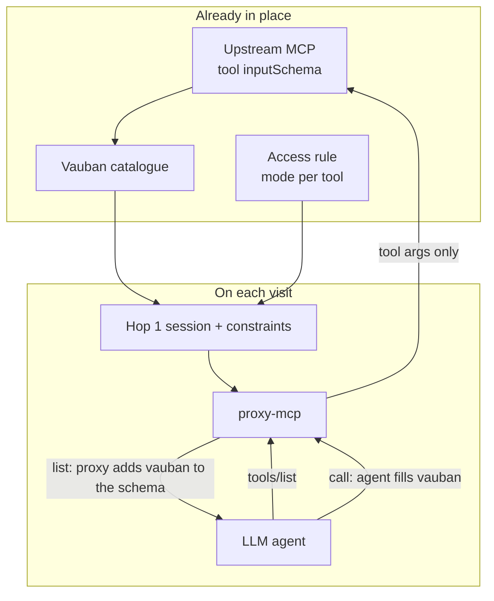
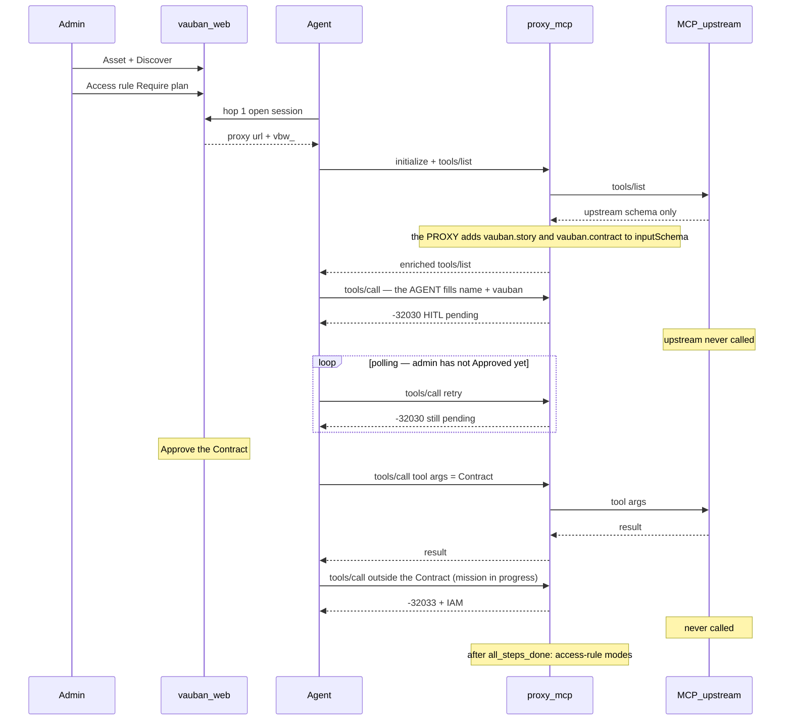

# Vauban MCP — agent view (Story / Contract DTO)

> Date: 2026-09-05  
> Architecture: [`Vauban_MCP_Architecture_EN.md`](Vauban_MCP_Architecture_EN.md)  
> Mission Seal: [`Vauban_MCP_Mission_Seal_EN.md`](Vauban_MCP_Mission_Seal_EN.md)  
> User guide: [`../user/Vauban_MCP_User_Guide_EN.md`](../user/Vauban_MCP_User_Guide_EN.md)

The agent talks to **proxy-mcp**. Access rules live in PostgreSQL (`access_rules`). Hop 1 freezes them on the session (`tool_constraints`). Hop 2 `tools/list` is the upstream schema plus, for **Require plan** tools, `arguments.vauban`.

## Flow





### Step by step

1. **Admin** creates the MCP asset and runs Discover. Catalogue stores the **upstream** `inputSchema` (TOFU fingerprint).
2. **Admin** edits the access rule and sets a tool to **Require plan**, then Save. PostgreSQL `access_rules.mcp_require_plan_tools` holds the mode.
3. **Agent** hop 1: `POST /api/v1/mcp/sessions` with `vbn_`. `vauban-access` computes the effective tools and freezes `tool_constraints` on the proxy session. `POST /api/v1/sessions` does not mint a `vbw_`.
4. **Agent** hop 2: `initialize` on `:19443/mcp` with `vbw_`. Proxy `instructions` is **identity only** (this endpoint is Vauban PAM; callable tools are `tools/list`). It is a MOTD, not a second allow-list — no tool names, no HITL / Require plan / Contract verbs. Catalogue and modes live only on `tools/list` (approved ∩ access rule; Off and pending are absent). The same `vbw_` stays valid if the hop-1 upstream TCP dies (HITL idle, upstream restart): the proxy re-brokers one FD (IACS-style). Not a new hop 1. `-32033` is perimeter drift — re-broker does not fix it.
5. **Agent** `tools/list`. Proxy asks the upstream MCP, then:
   - keeps only allow-listed tools;
   - HITL tools: description mentions human Approve;
   - Require plan tools: `inputSchema.properties.vauban` + `required` includes `vauban` while no mandate is sealed.
6. **Agent** first `tools/call` on that tool: tool args **and** `arguments.vauban.story` + `arguments.vauban.contract` (or `_meta.vauban` for curl).
7. Proxy parses Story + Contract, strips `vauban`, queues HITL (`-32030`). Upstream is not called. Retry before Approve stays `-32030`.
8. A **different** supervisor Approves the Contract on `/sessions/mcp` (SoD: opener user and opening `vbn_` cannot Approve).
9. **Agent** calls again with tool args only. Proxy CheckSteps the sealed Contract and relays to upstream.
10. While the mission is in progress, **every** `tools/call` is CheckStepped. An Allow tool that is not in the Contract is `-32033` (IAM), not `-32001`. After `all_steps_done`, tools revert to their access-rule modes (Allow runs; HITL waits; Require plan without `vauban` is `-32602`, not IAM).

Two directions:

- **`tools/list` (response)** — the **proxy** adds `vauban.story` / `vauban.contract` to `inputSchema`. Upstream sent `{ name }` only.
- **`tools/call` (request)** — the **agent** fills those fields. Proxy reads them, then sends only the tool args upstream.

## DTO — `arguments.vauban`

Reserved key: `vauban`. Stripped before argument constraints, CheckStep digest, and upstream relay.

```text
read_demo_file
  arguments:
    name: string          ← upstream schema
    vauban:
      story: summary, context, objective, risks
      contract: approval, edges, steps
```

### Story

| Field | Type | Length (trimmed UTF-8) |
|-------|------|------------------------|
| `summary` | string | 10..200 |
| `context` | string | 10..500 |
| `objective` | string | 10..500 |
| `risks` | string | 10..500 |

Display only. Not in `sealed_digest`. English (HITL UI is English).

### Contract

| Field | Type | Notes |
|-------|------|--------|
| `approval` | `"mission"` | One Approve for the whole Contract (`step` rejected in v1) |
| `edges` | `[string, string][]` | Optional `[from, to]` step_id pairs |
| `steps` | array 1..64 | See step row |

| Step | Type | Notes |
|------|------|--------|
| `step_id` | string | Unique, non-empty |
| `operation` | string | Tool name |
| `intent` | string | 10..500 |
| `mode` | `"literal"` | Bit-faithful args (`constrained` / `derived` later) |
| `arguments` | object | Exact call args for this step |

### JSON Schema (advertised on Require plan tools)

```json
{
  "type": "object",
  "additionalProperties": false,
  "required": ["story", "contract"],
  "description": "Vauban Mission Seal. A human Approves the Contract; Vauban verifies the Contract only.",
  "properties": {
    "story": {
      "type": "object",
      "additionalProperties": false,
      "required": ["summary", "context", "objective", "risks"],
      "properties": {
        "summary": { "type": "string", "minLength": 10, "maxLength": 200 },
        "context": { "type": "string", "minLength": 10, "maxLength": 500 },
        "objective": { "type": "string", "minLength": 10, "maxLength": 500 },
        "risks": { "type": "string", "minLength": 10, "maxLength": 500 }
      }
    },
    "contract": {
      "type": "object",
      "additionalProperties": false,
      "required": ["approval", "steps"],
      "properties": {
        "approval": { "type": "string", "enum": ["mission"] },
        "edges": {
          "type": "array",
          "items": {
            "type": "array",
            "minItems": 2,
            "maxItems": 2,
            "items": { "type": "string" }
          }
        },
        "steps": {
          "type": "array",
          "minItems": 1,
          "maxItems": 64,
          "items": {
            "type": "object",
            "additionalProperties": false,
            "required": ["step_id", "operation", "intent", "mode", "arguments"],
            "properties": {
              "step_id": { "type": "string", "minLength": 1 },
              "operation": { "type": "string", "minLength": 1 },
              "intent": { "type": "string", "minLength": 10, "maxLength": 500 },
              "mode": { "type": "string", "enum": ["literal"] },
              "arguments": { "type": "object" }
            }
          }
        }
      }
    }
  }
}
```

### Example `tools/call` (first Require plan call)

```json
{
  "jsonrpc": "2.0",
  "id": 2,
  "method": "tools/call",
  "params": {
    "name": "read_demo_file",
    "arguments": {
      "name": "hello.txt",
      "vauban": {
        "story": {
          "summary": "Read the lab hello file then read the UTC clock.",
          "context": "Local MCP lab asset used to demonstrate Mission Seal anti-drift after human Approve.",
          "objective": "Prove a sealed read_demo_file succeeds and a drifted filename is denied.",
          "risks": "Approving allows only hello.txt and get_time; a hostile Story would not expand that Contract perimeter."
        },
        "contract": {
          "approval": "mission",
          "edges": [["1", "2"]],
          "steps": [
            {
              "step_id": "1",
              "operation": "read_demo_file",
              "intent": "Read the sealed lab hello file",
              "mode": "literal",
              "arguments": { "name": "hello.txt" }
            },
            {
              "step_id": "2",
              "operation": "get_time",
              "intent": "Read UTC clock after the sealed file read",
              "mode": "literal",
              "arguments": {}
            }
          ]
        }
      }
    }
  }
}
```

`_meta.vauban.story` / `_meta.vauban.contract` is still accepted (curl). `arguments.vauban` is the agent path.

After Approve, `vauban` stays in `inputSchema` but is no longer `required` until the mandate is finished. New mission: send Story + Contract again. During the mission, calls outside the Contract are perimeter drift. After `all_steps_done`, `tools/list` re-requires `vauban` on Require plan tools.

Invalid shape → `-32602`. First CheckStep drift → `-32033`.
