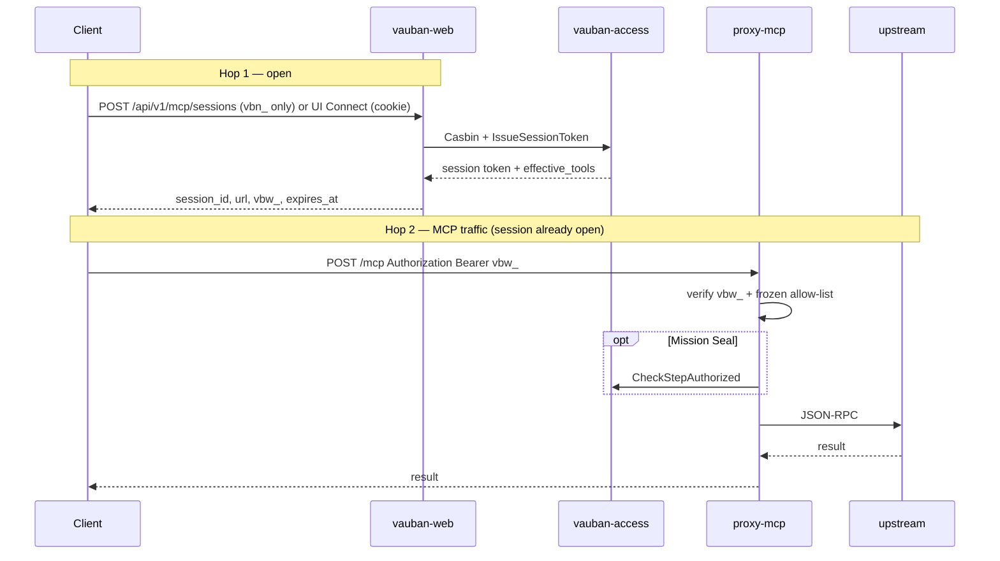
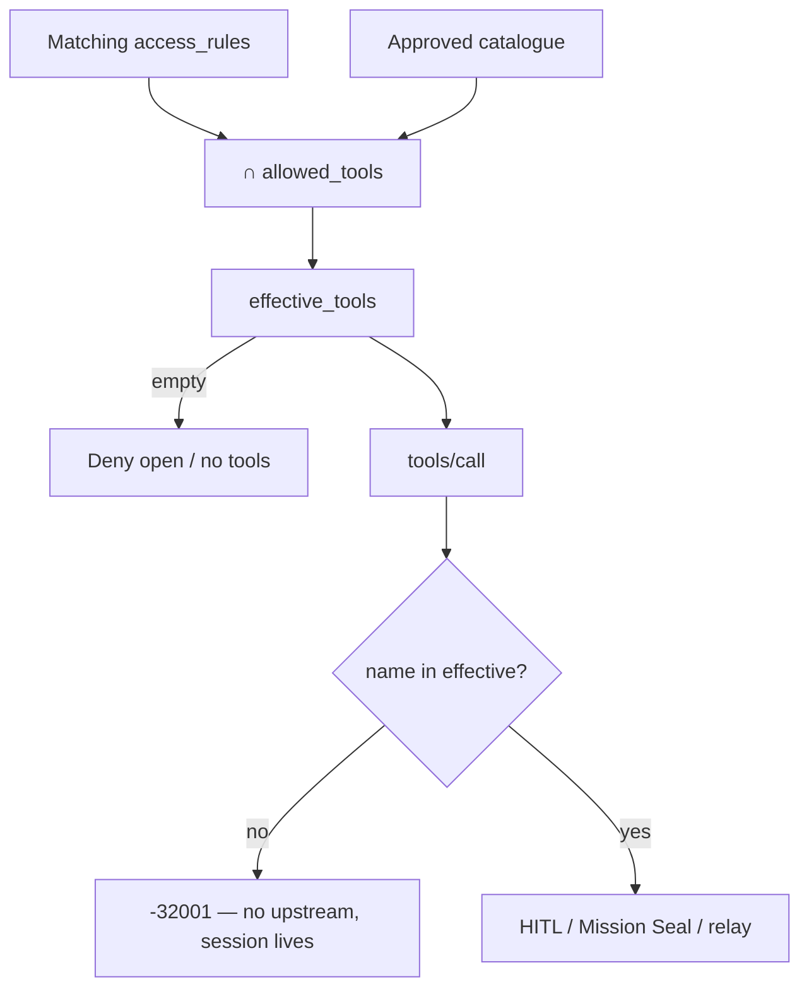
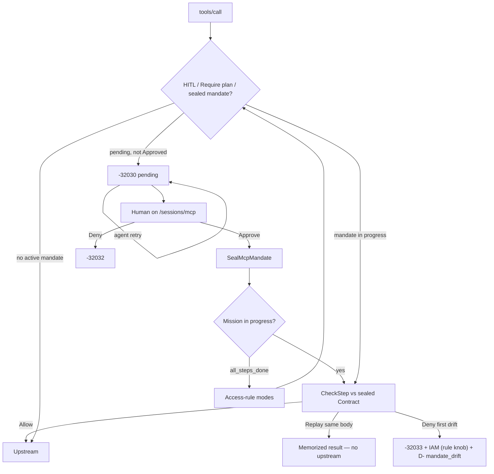
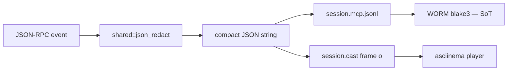

# Vauban MCP Architecture

> For developers and operators.  
> Date: 2026-09-06  
> User guide: [`../user/Vauban_MCP_User_Guide_EN.md`](../user/Vauban_MCP_User_Guide_EN.md)  
> Mission Seal: [`Vauban_MCP_Mission_Seal_EN(1.0).md`](Vauban_MCP_Mission_Seal_EN(1.0).md)  
> Agent view: [`Vauban_MCP_Agent_View_EN(1.0).md`](Vauban_MCP_Agent_View_EN(1.0).md)  
> Recording (solution E): [`Vauban_Recording_Architecture_EN(1.9).md`](Vauban_Recording_Architecture_EN(1.9).md)  
> Staging: [`../runbooks/mcp_staging_gwt_acceptance.md`](../runbooks/mcp_staging_gwt_acceptance.md)  
> API key compromise: [`../runbooks/mcp_api_key_compromise.md`](../runbooks/mcp_api_key_compromise.md)

MCP is the **fourth asset type** (SSH, RDP, IACS, MCP). `vauban-proxy-mcp` is an L7 MCP JSON-RPC **PEP** (POST `/mcp`): it terminates the agent session, applies the frozen allow-list, asks `vauban-access` for Mission Seal CheckStep, records traffic, then relays to the upstream MCP server on a **supervisor-brokered** TCP FD.

---

## 1. Place in the appliance

```mermaid
flowchart TB
  subgraph clients [Clients]
    UI[Human UI cookie]
    Agent[Agent vbn_ then vbw_]
  end
  subgraph vauban [Vauban]
    Web[vauban-web]
    Access[vauban-access]
    Proxy[vauban-proxy-mcp]
    Audit[vauban-audit]
    Vault[vauban-vault]
    Sup[vauban-supervisor]
  end
  Up[Upstream MCP]

  UI --> Web
  Agent -->|hop 1 vbn_| Web
  Web --> Access
  Access --> Vault
  Agent -->|hop 2 vbw_| Proxy
  Proxy -->|CheckStep (Mission Seal)| Access
  Sup -->|brokered FD| Proxy
  Proxy -->|if allowed| Up
  Proxy --> Audit
  Web --> Audit
```

| Item | Value |
|------|-------|
| Crate | `vauban-proxy-mcp` |
| Prod account | `vb-mcp` uid/gid **910** |
| Config | `[services.proxy_mcp]` + `[mcp]` |
| Default | `[mcp].enabled = false` (opt-in) |
| Linked restart | `(web, proxy_ssh, proxy_rdp, proxy_mcp)` |
| Sandbox | `shared::sandbox` after the listener bind (Capsicum, Linux Landlock+seccomp, OpenBSD pledge). Production does not boot a no-op backend. |
| Session token TTL | **`[mcp].session_ttl_seconds`** (default **3600**; token follows the same cap; rule may shorten) |
| Justification | **always** 10..1000 UTF-8 bytes after trim |
| Hop-2 transport | **POST `/mcp`** JSON-RPC only (no GET SSE / Streamable HTTP GET) |
| Methods | `initialize`, `notifications/initialized`, `tools/list`, `tools/call` — others → `-32601` |
| Protocol versions | `2024-11-05`, `2025-03-26` (unknown version → `-32600` then session close) |

The proxy has no HTTP control plane and no free upstream client. Hop 2 is `POST /mcp` on the brokered FD only.

---

## 2. Session open — two hops



| Hop | Where | Credential | Result |
|-----|-------|------------|--------|
| 1 | `POST /api/v1/mcp/sessions` | `vbn_` only (no API key → 401). This handler inserts `proxy_sessions`. | `session_id`, proxy `url`, `vbw_`, `expires_at` |
| 1 (human) | `POST /assets/{uuid}/connect-mcp` | cookie | same shape in the UI |
| 2 | `POST /mcp` on the proxy | `Bearer vbw_…` | frozen allow-list + optional CheckStep → upstream |

The **visit** (`session_id`, `vbw_`, allow-list, Mission Seal, HITL, recording FD) outlives any single upstream TCP. Hop 1: `vauban-web` asks the supervisor for the first FD, then `McpSessionOpen`. Mid-visit, if that FD dies (HTTP keep-alive idle after HITL, or the upstream process restarts), **`proxy-mcp`** re-sends `TcpConnectRequest` (`target_service: ProxyMcp`, **same** session token / host / port) and retries the POST **once**. That is not a new hop 1 and does not remint `vbw_`. SSH remains one-TCP-is-the-session; MCP matches IACS on **transport only**.

Defense stack at open (same family as other assets):

```text
Casbin → IssueSessionToken → SessionToken verify (supervisor + proxy)
  → AccessGuard → Vault (if secret) → upstream on brokered FD
```

**No superuser bypass** of `access_rules` on connect.

---

## 3. Tool policy



- Empty effective set → deny. There is no silent “allow all”.
- Allow-list is enforced in the **proxy before** upstream.
- Catalogue is TOFU: discover → `pending` → admin approve. Schema fingerprint drift re-pends.
- On one rule, a tool has **one mode** (form `<select>`): Off / Allow / HITL / Require plan. Save derives the three SQL columns. HITL/plan tools are written into `mcp_allowed_tools`. All Off = no allow-list from this rule. Edit and detail render that same matrix from the rule columns — never a catalogue-filtered dump of the SQL arrays (Allow-list ≠ Allow mode). Catalogue Approve does not change modes.
- Several rules → **Allow** intersection; **HITL / Require plan** union. Policy SoT for Require plan is `access_rules.mcp_require_plan_tools`. Catalogue `hitl` does not override the rule.

### Recheck (~30 s)

Access gone, expire, soft-delete, empty ∩ tools → terminate the live session. If a whitelist shrink cannot be pushed to the proxy (`McpSessionUpdate` fails), **terminate** (`policy_update_failed`) — do not keep a stale allow-list.

| Lever | Action | MCP effect |
|-------|------|------------|
| **IAM suspension** | Remove user from the rule `user_group` | Terminate (`-32004`). Re-add ≠ resurrect `vbw_` |
| **IAM revocation** | Soft-delete user (`is_deleted`) | No mandate left; sessions and keys die |
| **Hard-delete** | Forbidden | Traceability / WORM |
| **Envelope pause** | `proxy_sessions.status=suspended` | `-32031` — ops Resume, **not** IAM |
| **HITL Deny** | Refuse one pending | `-32032` — not a group remove |

Every MCP terminate (except `user_deleted`) mints a contestable `decision_id` `D-…` + WORM `McpAccessDecision`. Subject UI: `/sessions/{id}` and `/sessions/contestations/{uuid}`. Reviewer queue: `/sessions/mcp/contestations`.

---

## 4. HITL, Mission Seal, envelope



| Control | Behavior |
|---------|----------|
| HITL | First call → `-32030` until Approve on `/sessions/mcp`. Retry before Approve stays `-32030`. SoD: opener user and opening `vbn_` cannot Approve. The access-rule mode select is SoT (HITL / Require plan). Catalogue `hitl` does not override. Mail: `mcp.hitl_pending` / `mcp.hitl_decided`. Claim does not mail. |
| Mission Seal | PDP in `vauban-access` (`CheckStepAuthorized`). Proxy is PEP. Local CheckStep only when AccessGuard is not wired (tests / HTTP lab). After Seal, CheckStep applies to **every** `tools/call` while the mission is in progress (`!all_steps_done`). After the last step, tools revert to their access-rule modes. A PDP Allow also consumes `Session.mandate` so a later Story+Contract is `Replace` (new HITL), not `-32033`. See [Mission Seal](Vauban_MCP_Mission_Seal_EN(1.0).md). |
| First CheckStep deny | `-32033` to the agent, **upstream not called**, session cut, `mandate_drift`, mail. IAM is the matching MCP rule's `mcp_drift_iam` (default `suspend_group` = group remove). Overturn restores the group only for `suspend_group`. TTL `mission_expired` does **not** notify. |
| Envelope | Rate limit; `on_exceed=suspend` → `-32031` |
| `clientInfo` pin | Default ON; missing / drift → terminate |

HITL has **Approve / Deny only**. It is not contestation and not a group-remove button.

---

## 5. Recording — solution E



Per session `{storage}/YYYY/MM/{uuid}/`:

| File | Role |
|------|------|
| `session.mcp.jsonl` | Integrity source of truth (BLAKE3 / WORM) |
| `session.cast` | Bit-faithful asciicast v2 mirror for the existing player |
| `meta.json` | `mcp-jsonl-v1` + playback + hashes |

Invariant: one redact → one compact JSON string → JSONL line **and** cast `"o"` payload. Finalize must verify `join(o_payloads,"\n")+"\n" == jsonl_bytes` or mark `partial` / `equivalence_verified=false`.

- Cast timestamps may be **stretched** (~0.35 s/event) so the player is usable. Timing is not part of equivalence.
- Supervised: AccessGuard + recording FD lease are **required at boot**. Without a supervisor, recordings may still open under `storage_path`.
- If JSONL cannot be appended (no open recording session while FD lease is required), the proxy returns `-32010` `recording_sync_failed` even if upstream already ran.
- Playback: same asciinema path as SSH. Download serves the cast. JSONL stays on disk.

---

## 6. Stable errors

| Code | Meaning | Typical HTTP |
|------|---------|--------------|
| `-32001` | `tool_not_allowed` (before upstream) | 200 + JSON-RPC error |
| `-32002` | tool pending / catalogue drift (TOFU) | 200 |
| `-32003` | expired / unknown bearer | 401 |
| `-32004` | `session_terminated` (IAM / expire / admin) | 401 |
| `-32010` | `recording_sync_failed` / `step_inflight` / `pdp_unavailable` / re-broker failed (upstream still down) | — |
| `-32029` | envelope rate limit | 200 |
| `-32030` | HITL / Mission Seal pending | — |
| `-32031` | runtime envelope pause | — |
| `-32032` | HITL deny / pending exhausted | — |
| `-32033` | Mission Seal **perimeter** deny (IAM suspend) | — |
| `-32034` | `mission_expired` (TTL; **no** IAM suspend) | — |
| `-32602` | invalid Story / Contract shape | — |

Fake `vbn_` → 401/403, no session row. Fake `vbw_` → 401/403 on hop 2.

---

## 7. Networking / anti-SSRF

Supervisor brokers every TCP `connect()` (Capsicum: the proxy cannot dial):

- No self-listener reconnect
- Loopback denied in production unless a lab flag
- Target must match the session pin
- RFC1918 private targets **allowed** (typical plant MCP)
- **Multi-use channel** (IACS-class): replay cache is bypassed for `Service::ProxyIacs | Service::ProxyMcp` only. Compensating controls: crypto bind `(host, port, target_service, session_id)`, MCP anti-SSRF, session terminate watchdog. Token TTL follows **`[mcp].session_ttl_seconds`** (compiled default 3600; not the IACS 12 h). Implementation: `vauban-proxy-mcp/src/upstream_rebroker.rs`. A dead hop-1 FD is **not** `-32010` if the retry succeeds.

After Capsicum seal the proxy must not free-connect.

---

## 8. Web surfaces

One sidebar entry **MCP** (`sessions:supervise` **or** `access_rules:read`).

| Path | Role | Permission |
|------|------|------------|
| `/sessions/mcp` | HITL queue | `sessions:supervise` |
| `/sessions/mcp/access` | tool modes (Off / Allow / HITL / Plan) | `access_rules:read` / `:write` |
| `/sessions/mcp/contestations` | reviewer list + claim / uphold / overturn | `sessions:supervise` |
| `/sessions/contestations/{uuid}` | subject / opener status (User Zone, read-only) | participant ACL (`is_subject` or `is_opener`); no `require_mcp_zone` |

Redirects: `/sessions/mcp-hitl*` → `/sessions/mcp*`. The User Zone GET `/sessions/contestations/{uuid}` is **not** redirected into the MCP nest. List `/sessions/contestations` → `/sessions/my-requests`.

Sidebar HITL + contestation share one `#sidebar-mcp-badge` pill (sum). OOB uses the same WebSocket shape as Approvals (`broadcast_mcp_hitl_badge` / `broadcast_contestation_badge` → `broadcast_mcp_sidebar_badge`). Do not invent a second channel.

Agent discovery: hop 2 `tools/list` is the only machine catalogue (`arguments.vauban` on Require plan tools). `initialize.instructions` is identity, not a tool list. See [`Vauban_MCP_Agent_View_EN(1.0).md`](Vauban_MCP_Agent_View_EN(1.0).md).

Mail kinds (outbox → `vauban-mailer`): `mcp.hitl_pending`, `mcp.hitl_decided`, `mcp.contestation_opened`, `mcp.contestation_resolved`, `mcp.mandate_drift`. SMTP stays in the mailer leaf.

---

## 9. Code anchors

| Concern | Path |
|---------|------|
| Proxy / GWT | `vauban-proxy-mcp/src/main.rs` |
| Upstream re-broker (IACS-style) | `vauban-proxy-mcp/src/upstream_rebroker.rs` |
| Agent view (`arguments.vauban`) | `vauban-proxy-mcp/src/agent_view.rs` |
| Mission Seal engine | `shared/src/mcp_mandate.rs` |
| Mission Seal PDP | `vauban-access/src/mcp_pdp.rs` (`CheckStepAuthorized`) |
| Mission Seal PEP | `vauban-proxy-mcp` (`AccessGuard` + local fallback) |
| Drift notify hook | `vauban-web/src/ipc/proxy_mcp.rs`, `services/mcp_drift.rs` |
| Recording | `vauban-proxy-mcp/src/mcp_recording.rs` |
| Session open | `vauban-web/src/services/mcp_session.rs` |
| Discover | `vauban-web/src/services/mcp_discover.rs` |
| Recheck | `vauban-web/src/services/mcp_recheck.rs` |
| HITL / control | `vauban-web/src/services/mcp_control.rs` |
| Access decisions | `vauban-web/src/services/access_decision.rs` |
| Effective tools | `vauban-access/src/handlers.rs` |
| MCP access form | `vauban-web/src/handlers/web/mcp_access.rs` |
| JSON redact | `shared/src/json_redact.rs` |
| GWT | `just test-mcp-gwt` |
| Packaging | `just check-mcp-pkg` / `./pkg/check-mcp-pkg.sh` |

---

## 10. Verify

```bash
just test-mcp-gwt
# live hop-1/2 + hello→secret Seal Replace (needs :8443 / :19443 / :19001):
#   ./local-tools/scripts/e2e-vauban-mcp.sh
just check-mcp-pkg
# FreeBSD appliance:
just release && just package
pkg add ./pkg/vauban-*.pkg
./pkg/check-mcp-pkg.sh --live
# after [mcp].enabled = true:
./pkg/check-mcp-pkg.sh --live --expect-running
```

`./start.sh` does **not** rebuild existing `target/debug/*`. After proxy / web / recording changes: `cargo build -p …` then restart.

---

## 11. Not in v1

Product gaps (do not treat as bugs in the shipped allow-list / HITL / Seal path):

- **MCP protocol:** no `resources/*`, `prompts/*`, `ping`, `completion`, `sampling`, `logging`, elicitation, cancellation, JSON-RPC batch, or `tools/list` cursors. Hop 2 is POST JSON-RPC, not Streamable HTTP GET/SSE.
- **Spec vintage:** protocol versions `2024-11-05` and `2025-03-26` only (`2025-06-18` is refused).
- **Mandate persist:** PDP store is RAM in `vauban-access` (`mcp_pdp.rs`). Access restart fail-closes CheckStep (`-32010` `pdp_unavailable`) until PostgreSQL persist.
- **HITL / visit RAM:** pending HITL and the hop-2 session table live in `proxy-mcp` memory. A proxy restart kills live `vbw_` visits.
- **Contract modes:** `literal` only. `constrained` / `derived` → `mode_not_supported` (perimeter drift). `approval=step` rejected.
- **ExecutionSeal / MatchSeal:** recording E + WORM exist; audit does not yet recompute a MatchSeal job.
- **Upstream identity:** static vaulted secret only (no MCP OAuth). `clientInfo` is a declarative pin, not attestation.
- **Transport:** network MCP only (no local stdio servers). `mcp.bind_addr` defaults to `127.0.0.1:19443`.
- **UX:** sidebar bell dropdown is still a stub; contestations are MCP-only; no live MCP “watch” like an SSH terminal; Connect returns URL + ticket (the human still needs an MCP client).
- **Catalogue:** TOFU lives in `assets.connection_config` JSON (not a first-class tools table). Discover cap: 500 tools.
- **Mission TTL:** post-Approve clock is compiled **900 s** (`MISSION_TTL_DEFAULT_SECS`); HITL pending TTL is configurable (`[mcp].hitl_pending_ttl_seconds`).
- Hard-delete of users (forbidden). Cross-system identity portability.

Lab (gitignored, not packaged): `local-tools/` (demo UI, fixture MCP servers, optional local agent). Launch via `./local-tools/start.sh`. Do not commit venv or that tree.
