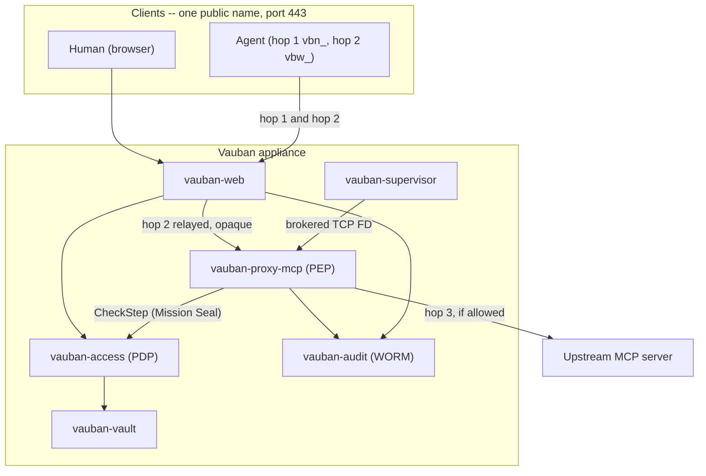
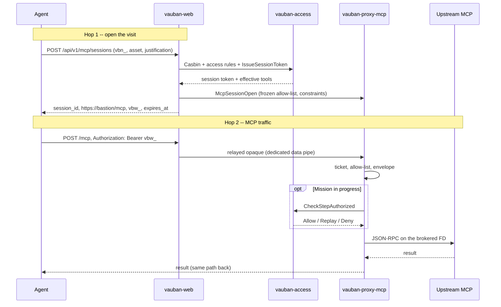
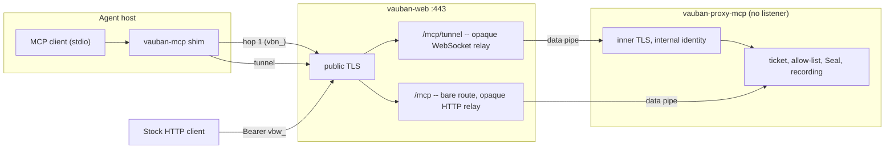
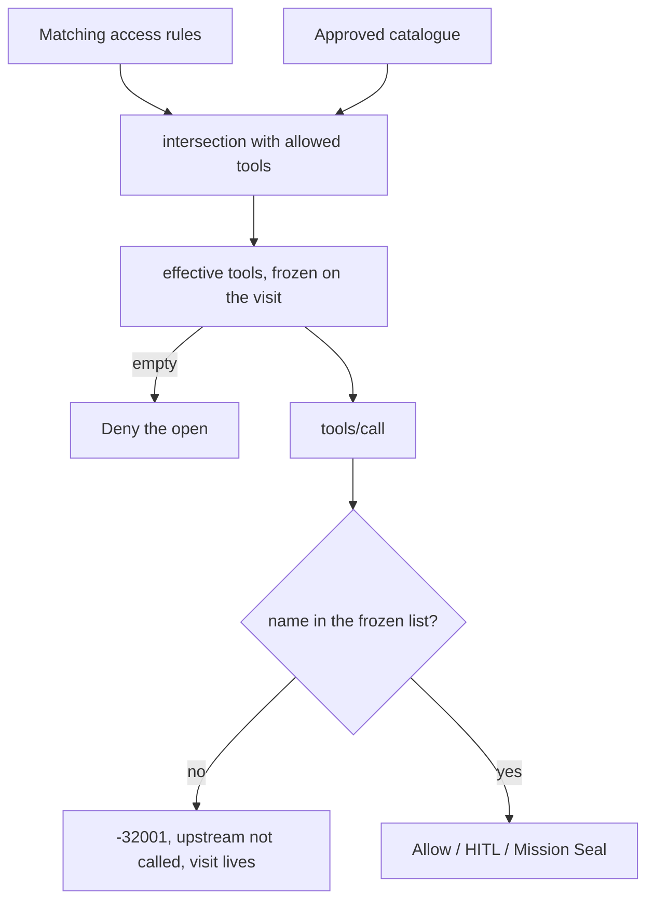
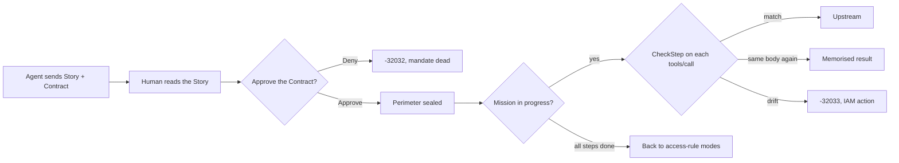
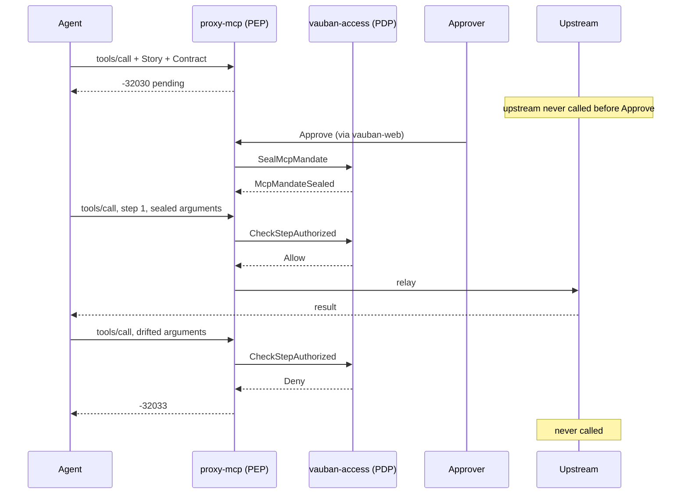
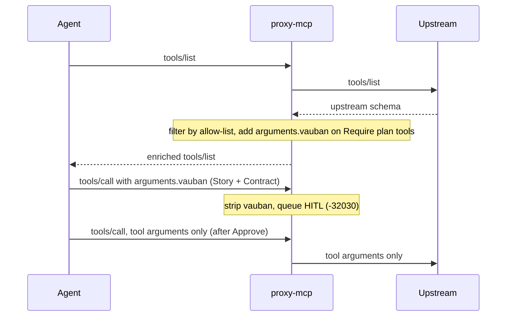
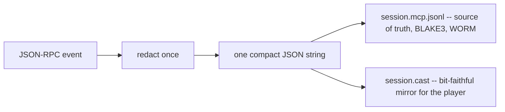

# Vauban MCP Architecture

**Version:** 1.0  
**Date:** 3 October 2026  
**Author:** Richard Ben Aleya

> This document merges and replaces the three MCP notes of September
> 2026 (*Architecture*, *Mission Seal*, *Agent view*). It describes the
> MCP asset type for crates **0.9.45**. Change from 0.9.44: hop 2 is
> served on the public HTTPS listener of `vauban-web` (§4), and the
> dedicated listener `[mcp].bind_addr` is gone.

---

## Table of Contents

1. [Introduction](#1-introduction)
2. [Architecture Overview](#2-architecture-overview)
3. [A Visit in Two Hops](#3-a-visit-in-two-hops)
4. [Hop-2 Exposure: One Name, One Listener](#4-hop-2-exposure-one-name-one-listener)
5. [Tool Policy](#5-tool-policy)
6. [Human in the Loop and Mission Seal](#6-human-in-the-loop-and-mission-seal)
7. [The Agent View](#7-the-agent-view)
8. [Recording and Evidence](#8-recording-and-evidence)
9. [Stable Error Codes](#9-stable-error-codes)
10. [Networking and Sandbox](#10-networking-and-sandbox)
11. [Web Surfaces](#11-web-surfaces)
12. [Architecture Decisions](#12-architecture-decisions)

---

## 1. Introduction

### 1.1 Background

MCP (Model Context Protocol) is how an LLM agent uses tools exposed by
a server: it lists the tools, then calls them with JSON arguments over
JSON-RPC. In an enterprise those servers reach files, tickets,
databases and industrial systems, while the agent is often remote and
partly autonomous. Vauban treats an MCP server like any other
privileged target. MCP is the **fourth asset type**, after SSH, RDP and
IACS.

### 1.2 What Vauban adds

Vauban stands between the agent and the MCP server as a Layer-7 policy
enforcement point. It:

- opens a session only for an identified caller who holds the right,
  gives a justification, and gets a bounded lifetime;
- shows the agent only the tools an access rule allows, and freezes
  that list for the whole visit;
- lets a human approve risky calls one by one (HITL), or approve a
  whole plan once and then refuses every deviation (Mission Seal);
- records every JSON-RPC exchange into a tamper-evident recording;
- reaches the upstream server only through a connection brokered by
  the supervisor, from a sandboxed process that cannot dial on its own.

### 1.3 Vocabulary

| Term | Meaning |
|------|---------|
| **Visit** | One MCP session as Vauban sees it: `session_id`, ticket, frozen allow-list, HITL state, recording. It outlives any single TCP connection. |
| **Hop 1** | Opening the visit on `vauban-web`. Authenticated by a `vbn_` API key, or by the UI cookie when a human clicks Connect. |
| **Hop 2** | The MCP traffic itself: `POST /mcp`, JSON-RPC, authenticated by the visit ticket. |
| **Hop 3** | The relay from `vauban-proxy-mcp` to the upstream MCP server. |
| `vbn_` | Long-lived API key of a Vauban user. Used at hop 1 only. |
| `vbw_` | Visit ticket. Minted at hop 1, presented as `Authorization: Bearer` at hop 2, dies with the visit. |
| **PEP / PDP** | `vauban-proxy-mcp` enforces (policy enforcement point); `vauban-access` decides (policy decision point). |
| **Story / Contract** | What the agent tells the human (Story) and what the agent commits to do (Contract). Only the Contract is authority. |

### 1.4 Related documents

- [Vauban_Privsep_Architecture_EN(1.3).md](Vauban_Privsep_Architecture_EN(1.3).md) -- processes, pipes, sandbox, brokered TCP
- [Vauban_Recording_Architecture_EN(1.9).md](Vauban_Recording_Architecture_EN(1.9).md) -- recording FD lease and durability
- [Vauban_AccessGuard_Architecture_EN(1.0).md](Vauban_AccessGuard_Architecture_EN(1.0).md) -- the proxy-side RBAC re-check
- [Vauban_IAM_Architecture_EN(1.1).md](Vauban_IAM_Architecture_EN(1.1).md) -- Casbin, access rules, API keys
- [Vauban_ACME_TLS_Architecture_EN(1.0).md](Vauban_ACME_TLS_Architecture_EN(1.0).md) -- the single public certificate hop 2 rides on
- [ADR 009 -- No MCP OAuth for now](../adr/009-mcp-no-oauth-for-now.md)
- [User guide](../user/Vauban_MCP_User_Guide_EN.md) -- for administrators and operators
- Runbooks: [staging acceptance](../runbooks/mcp_staging_gwt_acceptance.md), [API key compromise](../runbooks/mcp_api_key_compromise.md)

---

## 2. Architecture Overview

### 2.1 Components

| Process | Role in MCP | Privileges |
|---------|-------------|------------|
| `vauban-web` | Hop 1 API and UI; front door of hop 2 on the public HTTPS listener (§4); HITL, contestation and tool-mode pages | Unprivileged (uid 907) |
| `vauban-proxy-mcp` | The PEP: ticket check, frozen allow-list, HITL queue, Mission Seal enforcement, recording, relay to upstream | Unprivileged (uid 910, `vb-mcp`), sandboxed, **no listening socket** |
| `vauban-access` | The PDP: effective tools, session token, Mission Seal (`SealMcpMandate`, `CheckStepAuthorized`) | Unprivileged (uid 903) |
| `vauban-vault` | Upstream static secret, delivered to the proxy at open | Unprivileged (uid 902) |
| `vauban-audit` | WORM audit of every decision and of the recording digests | Unprivileged (uid 901) |
| `vauban-mailer` | HITL, drift and contestation mail | Unprivileged (uid 909) |
| `vauban-supervisor` | Creates the pipes, brokers every upstream TCP connection, provisions TLS keys | Root |

Configuration lives in `[services.proxy_mcp]` and `[mcp]`.
`[mcp].enabled` defaults to **false**: the leaf is opt-in. The linked
restart group is `{web, proxy_ssh, proxy_rdp, proxy_mcp}`.

### 2.2 Place in the Appliance



### 2.3 Who Holds What

| | TLS key | Sees hop-2 content | Sees `vbw_` | Decides |
|---|---|---|---|---|
| `vauban-web` | public certificate | direct mode: yes; tunnel mode: no | once, at hop 1 | nothing about tools; it relays and hosts the human UI |
| `vauban-proxy-mcp` | internal identity (tunnel) | yes, it is the PEP | hash only | allow-list, HITL queue, replay |
| `vauban-access` | none | tool name and arguments through CheckStep | no | effective tools, Mission Seal |
| `vauban-supervisor` | both, at rest and during ACME | no | no | which TCP connections exist |

---

## 3. A Visit in Two Hops

### 3.1 Sequence



### 3.2 The Two Hops

| Hop | Where | Credential | Result |
|-----|-------|------------|--------|
| 1 | `POST /api/v1/mcp/sessions` | `vbn_` API key only (no key: 401) | `session_id`, the hop-2 URL, `vbw_`, `expires_at` |
| 1 (human) | `POST /assets/{uuid}/connect-mcp` | UI cookie | Same shape, shown in the UI |
| 2 | `POST /mcp` on the public name | `Bearer vbw_` | Frozen allow-list, optional CheckStep, relay |

`POST /api/v1/sessions` (the SSH/RDP API) never opens an MCP visit and
never mints a `vbw_`.

A justification is **always** required for MCP (10 to 1000 UTF-8 bytes
after trim), even when the SSH rules of the same user do not ask for
one. The visit lives at most `[mcp].session_ttl_seconds` (default
3600); an access rule may shorten it.

### 3.3 Defence Stack at Open

Opening a visit walks the same gates as every other asset type:

```text
Casbin (assets:connect_mcp) -> access rules -> IssueSessionToken
  -> SessionToken verified by supervisor and proxy -> AccessGuard
  -> Vault (if the upstream has a secret) -> upstream on a brokered FD
```

There is no superuser bypass of access rules on connect.

### 3.4 The Visit Outlives the TCP Connection

The visit (`session_id`, `vbw_`, allow-list, Mission Seal state, HITL
queue, recording) is not tied to one upstream TCP connection. If the
upstream connection dies mid-visit (keep-alive idle while a human
decides, or the MCP server restarts), the proxy asks the supervisor for
a new connection with the **same** session token, host and port, and
retries the call **once**. That is not a new hop 1 and does not mint a
new ticket. SSH stays "one TCP connection is the session"; MCP matches
IACS on transport only.

---

## 4. Hop-2 Exposure: One Name, One Listener

### 4.1 Why Not a Dedicated Listener

Giving hop 2 its own listener (the 0.9.44 approach: `[mcp].bind_addr`,
plaintext HTTP, a socket bound by the leaf before it entered the
sandbox) would have meant, in production, a second public port, a
second certificate on a non-standard port, a second renewal path, and
a listener that the client IP allow-list and the rate limiter of
`vauban-web` never saw. Operators who cannot open a non-standard port
would have placed a reverse proxy in front of it: a TLS-terminating
intermediary outside Vauban's privilege separation.

### 4.2 The Decision

Hop 2 is served on the **existing public HTTPS listener** of
`vauban-web`: one name, port 443, the certificate and the zero-downtime
ACME renewal that already exist. The hop-1 response returns
`https://<bastion>/mcp`. The leaf opens **no listening socket at all**.

Three designs were weighed (§12.2). Serving hop 2 through `vauban-web`
puts the web process on the path of the MCP bytes, so the design does
two things about it: it makes the web relay as blind and as narrow as
possible (direct mode), and it offers a mode where the web relays only
ciphertext (tunnel mode).

### 4.3 Direct Mode (stock MCP clients)

The agent is any HTTP client able to send `Authorization: Bearer vbw_`.
It posts JSON-RPC to the URL returned at hop 1, `https://<bastion>/mcp`;
nothing else about the client is specific to Vauban.

Inside `vauban-web`, `/mcp` is a **bare route**, mounted outside the
HTML middleware stack. It keeps the client IP allow-list first, then
the per-IP rate limiter, a body limit equal to the proxy's own (1 MiB),
a concurrency cap, and a timeout longer than the proxy's upstream
timeout. It has no cookie, no session, no CSRF, no `auth_middleware`,
no `PermissionContext`. The relay never parses JSON-RPC: it forwards
the bytes, an allow-list of headers (`Authorization`, `Content-Type`,
`Accept`, `Mcp-Session-Id`, `MCP-Protocol-Version`), the status code
and the response headers, and strips everything else, `Cookie`
included. The bearer travels in a redacted `SensitiveString`; neither
headers nor bodies are logged. Only `POST` is relayed.

### 4.4 Tunnel Mode (local shim)

For clients that can run a local MCP server over stdio (desktop
assistants, IDEs, SDKs), Vauban ships a small shim, `vauban-mcp`. The
client talks stdio to the shim; the shim performs hop 1 with the
`vbn_`, opens a WebSocket to `wss://<bastion>/mcp/tunnel`, and inside
that WebSocket runs a **second TLS 1.3 session straight to the leaf**.
`vauban-web` relays WebSocket frames it cannot read, the same way it
relays SSH terminal bytes.

The leaf's identity for that inner session is an internal key pair:
generated by the supervisor, pushed to the leaf at spawn, self-signed,
and pinned by SPKI fingerprint in the shim (trust on first use, like
`known_hosts`). The fingerprint is shown on the asset page
(`/assets/manage/{uuid}`, "Tunnel fingerprint (SPKI)") and returned
at hop 1; the shim prints it when it first learns it, and the operator
compares the two. The shim keys its pin store by the origin of
`--url` (scheme `https`, lowercased host, port) and refuses a hop-1
answer whose origin differs, so a fake bastion cannot plant a pin for
another host. A store written by a 0.9.45 shim keyed the pin by bare
host; on first use the shim moves such a line to `host:port` when the
advertised pin is the same, and refuses (store unchanged) when it
differs. A bare-host line vouches only for that host, never for
another one. No DNS entry, no certificate authority and no ACME order
are involved: it is not a public certificate. Inside the tunnel the
shim sends the ordinary `POST /mcp` with the bearer, so the leaf sees
the same protocol in both modes.

Only the asset can require the tunnel (`transport = "tunnel"` in the
asset's connection settings); access rules carry no transport field.
When the asset requires it, the leaf refuses direct `/mcp` traffic for
that asset.



### 4.5 Inside the Appliance

A **dedicated data pipe** between `vauban-web` and the leaf carries
hop-2 traffic, distinct from the control pipe that carries
`McpSessionOpen`, HITL decisions and allow-list updates. Requests and
responses cross it as chunked, typed IPC messages tagged with a request
id, so concurrent calls interleave and control messages never wait
behind a 1 MiB body. On the leaf side the reassembled request enters
the proxy's router and handler; the PEP is identical in direct and
tunnel mode.

Because the leaf no longer binds anything, its sandbox holds only
pipes, the FD-passing socket from the supervisor, and the brokered
upstream connections. It is the most closed posture of the four
proxies.

In production, Mission Seal is **required** on MCP assets
(`[mcp].require_seal = true`). Combined with the frozen allow-list,
this is what makes an altered or injected call fail closed rather than
reach upstream (§6).

### 4.6 What This Protects, and What It Does Not

| Threat | Direct mode | Tunnel mode |
|--------|-------------|-------------|
| Network attacker | TLS 1.3 on 443, one public certificate | Same, plus an inner TLS the web cannot read |
| Compromised `vauban-web` reads hop-2 content | **Yes** -- the residual of this design | No |
| Compromised `vauban-web` alters a call | Refused on sealed steps (`-32033`, session cut, IAM); possible only on Allow tools after the mission | No |
| Compromised `vauban-web` replays a call | `McpCheckStepReplay`: memorised result, upstream not called | No |
| Compromised leaf | Reaches only brokered upstreams; holds no public TLS key | Same |
| MCP flood | Absorbed by the bare route's limits on web; the leaf never sees unauthenticated bytes | The leaf **does** receive unauthenticated TLS handshakes, bounded by web's tunnel gate (total and per-IP caps) and the leaf's handshake and idle timeouts |
| Evidence | JSONL and WORM are written by the leaf and audit, not by web | Same |

Hop-2 limits (web `[mcp]`, mirrored to the leaf by the supervisor):

| Limit | Default | Where | Beyond the limit |
|-------|---------|-------|------------------|
| `relay_rate_limit_per_minute` | 600 | web, per client IP (`mcp:<ip>`) | 429 |
| `relay_max_inflight` | 64 | web gate and leaf | 503 |
| `relay_timeout_seconds` | 120 (min 40) | web; the leaf gets 30 s less, floor 10 s | leaf `McpRelayAbort` "timeout", then web 504 |
| `max_tunnels` | 256 | web gate and leaf table | 503 / tunnel refused |
| `max_tunnels_per_ip` | 16 | web gate and leaf table | 503 / tunnel refused |
| `tunnel_idle_seconds` | 300 | leaf | tunnel closed, slot freed |
| Inner TLS handshake | 10 s | leaf | tunnel closed, slot freed |
| Tunnel inbound queue | 32 frames | leaf | tunnel closed ("backpressure"), never silent drop |
| Request body | 1 MiB | web | 413 |
| `Authorization` header | 8 KiB (others 1 KiB) | web | 431 |
| WebSocket frame | 192 KiB (one pipe chunk) | web | frame refused; an oversize pipe message closes only its own relay or tunnel |

The client IP behind these per-IP limits is the socket peer, or the
`X-Forwarded-For` value only when the peer is in `trusted_proxies`.

Two things hold in every design and are not specific to this one. The
web process is the human interface, so it already carries the HITL
decision, the Seal approval and the allow-list update; a compromised
web at the moment of hop 1 also sees the `vbn_` request and the ticket
it returns. Hardening those would mean `vauban-access` verifying a
human proof independently of web, which is out of scope here.

---

## 5. Tool Policy

### 5.1 From Catalogue to Effective Tools



The **catalogue** is trust-on-first-use: an administrator runs Discover
on the asset, the upstream tools arrive as `pending`, and an
administrator approves them. A later change of a tool's schema
fingerprint sends it back to `pending`. Approval does not set a mode.

An **access rule** gives each tool one mode: **Off**, **Allow**,
**HITL**, or **Require plan**. When several rules match, Allow is the
intersection, HITL and Require plan are the union. The effective set is
"approved catalogue, intersected with what the rules allow"; an empty
set denies the open. There is no silent "allow all".

The effective set is frozen on the visit and enforced in the proxy
**before** anything reaches upstream.

### 5.2 Recheck

About every 30 seconds, `vauban-web` re-evaluates each live visit.
Lost access, an expired rule, a soft-deleted user or an empty effective
set terminates the visit. If a shrunk allow-list cannot be pushed to
the proxy, the visit is terminated too: a stale allow-list is never
kept.

### 5.3 Four Levers That Must Not Be Confused

| Lever | Action | Effect on MCP |
|-------|--------|---------------|
| IAM suspension | Remove the user from the rule's group | Visit cut (`-32004`); re-adding does not revive the ticket |
| IAM revocation | Soft-delete the user | Visits and keys die; the row stays for audit |
| Envelope pause | Too many calls too fast (`status = suspended`) | `-32031`; Resume is an operations action, not IAM |
| HITL Deny | Refuse one pending call | `-32032`; the visit may continue on other tools |

Hard-deleting a user is forbidden: traceability and WORM depend on the
row. Every terminate except `user_deleted` mints a contestable decision
`D-…` and a WORM record; the subject can contest it, reviewers claim,
uphold or overturn (§11).

---

## 6. Human in the Loop and Mission Seal

### 6.1 HITL

A tool in **HITL** mode returns `-32030` on its first call and keeps
returning it while the agent retries; nothing reaches upstream until a
human approves on `/sessions/mcp`. Separation of duties: the user who
opened the visit, and the `vbn_` that opened it, cannot approve. HITL
offers Approve and Deny only; it is neither a contestation nor an IAM
lever. Mail is sent on pending and on decision.

### 6.2 Mission Seal in One Sentence

The agent **announces** a plan. A human **approves the Contract**.
Vauban then **refuses every deviation**. Vauban never writes the plan,
and there is no AI judge.



### 6.3 Story Versus Contract

| Piece | Role | Authority |
|-------|------|-----------|
| **Story** | Why: `summary`, `context`, `objective`, `risks` | **None**. Shape-checked and displayed to the human only |
| **Contract** | What: steps (`tool`, exact arguments, `mode`) and their order | **The only authority** |

A hostile Story never widens the perimeter: the digests cover the
Contract only. Story fields are trimmed UTF-8 (`summary` 10..200 bytes,
the others 10..500), no HTML. An invalid shape returns `-32602` and
nothing is queued.

### 6.4 Timeline



| Moment | Agent sees | Upstream |
|--------|------------|----------|
| Contract received, not approved | `-32030`, also on retry | no |
| Approved, call matches a step | result | yes |
| Approved, same body sent again | memorised result | no |
| Approved, tool or arguments or order outside the Contract | `-32033`, then a dead visit | no |
| Approved, every step done, Allow tool | result (no further CheckStep) | yes |
| Approver denies | `-32032` | no |
| Mission TTL expired | `-32034`, mandate dead, no IAM action | no |

While the mission is in progress, **every** `tools/call` is
check-stepped, including Allow tools: a call outside the Contract is
drift, not a mere `-32001`. After the last step, tools return to their
access-rule modes; a new Story and Contract start a new mission.

### 6.5 The Contract Is a Multiset With Dependencies

The Contract is not necessarily a queue. Each step names a tool, its
exact arguments and a mode; optional edges say which step must precede
which. CheckStep asks one question:

> Is there an unconsumed step whose binding matches this call, and
> whose predecessors are all satisfied?

A strict sequence is the chain `1 -> 2 -> … -> N`; two steps without an
edge may run in either order. In v1 the only mode is `literal`: the
call equals the digest of the exact arguments. `approval` is `mission`
(one Approve for the whole Contract). Replay is keyed on
`(mandate, step, blake3(body))`, never on the client's JSON-RPC id: the
same body replays its memorised result, a different body is a
violation.

After Approve the mission has its own clock (900 s by default), shorter
than the visit.

### 6.6 Digests and the Three Seals

Arguments are not encrypted; they are fingerprinted. Domain-separated
BLAKE3 digests cover the raw JSON the proxy will send upstream, before
any UI redaction. `{"password":"alpha"}` and `{"password":"beta"}` are
different Contracts even when the screen shows `***`. The Story stays
outside every digest.

| Seal | When | Who | Meaning |
|------|------|-----|---------|
| MissionSeal | Contract received | PDP | The perimeter: bindings and precedence (`sealed_digest`) |
| ApprovalSeal | Approve click | web, PDP, WORM | Who approved which digest |
| ExecutionSeal | After execution | audit recomputes from the WORM | What actually ran, not a blind signature from the proxy |

A mismatch between the three is tamper or a bug. A CheckStep Deny is
not a mismatch: enforcement held.

### 6.7 First Drift Leads to an IAM Action

The first `-32033` cuts the visit (`mandate_drift`), mints a
contestable `D-…`, writes the WORM record, mails once per visit, and
applies the IAM action configured on the MCP rule (`mcp_drift_iam`):
`terminate` only, `suspend_group` (the product default), revoke the
opening key, or soft-delete the user. The tool itself is not
blacklisted. An overturned contestation restores the group membership
only when the action was `suspend_group`. A mission TTL expiry does not
notify and does not touch IAM; an HITL Deny and a `-32001` are not
drift.

### 6.8 What Mission Seal Buys, and What It Does Not

| Guarantees | Does not guarantee |
|------------|--------------------|
| After Approve, only the Contract's steps pass | That the agent is honest or free of prompt injection |
| `literal` arguments are bit-faithful | That the Story is true |
| One Approve for N operations | Confinement of a compromised agent |
| A journaled proof of the perimeter | That the human actually read the arguments |

---

## 7. The Agent View

The agent discovers tools through hop-2 `tools/list` and nothing else.
`initialize.instructions` is identity only ("this endpoint is Vauban
PAM; callable tools are those in `tools/list`"), never a second
catalogue. `tools/list` returns the upstream schema filtered by the
frozen allow-list: Off and pending tools are absent, HITL tools say so
in their description, and **Require plan** tools carry one extra
argument, `vauban`, that the proxy adds to the upstream `inputSchema`
and marks as required while no mandate is sealed.



Two directions, two authors: in the **response** to `tools/list` the
proxy adds `vauban` to the schema; in the **request** `tools/call` the
agent fills it. The proxy reads it, strips it, and sends only the tool's
own arguments upstream. `vauban` is a reserved key, removed before
constraint checks, digests and relay.

### 7.1 The `vauban` Argument

| Story field | Length (trimmed UTF-8 bytes) |
|-------------|------------------------------|
| `summary` | 10..200 |
| `context`, `objective`, `risks` | 10..500 |

| Contract field | Value |
|----------------|-------|
| `approval` | `"mission"` |
| `edges` | optional list of `[from, to]` step ids |
| `steps` | 1..64 steps |

| Step field | Value |
|------------|-------|
| `step_id` | unique, non-empty |
| `operation` | tool name |
| `intent` | 10..500 bytes, for the human |
| `mode` | `"literal"` |
| `arguments` | the exact arguments of that call |

A minimal first call on a Require plan tool:

```json
{
  "name": "read_demo_file",
  "arguments": {
    "name": "hello.txt",
    "vauban": {
      "story": {
        "summary": "Read the lab hello file.",
        "context": "Local lab asset, no production data.",
        "objective": "Prove a sealed read succeeds.",
        "risks": "Approving allows hello.txt only."
      },
      "contract": {
        "approval": "mission",
        "edges": [],
        "steps": [
          { "step_id": "1", "operation": "read_demo_file", "intent": "Read the sealed hello file",
            "mode": "literal", "arguments": { "name": "hello.txt" } }
        ]
      }
    }
  }
}
```

`_meta.vauban` is accepted as well (handy with `curl`). After Approve,
`vauban` stays in the schema but is no longer required until the
mission ends; once every step is done it is required again. The HITL
page shows the Story first ("Why this mission"), then the Contract as a
checklist with redacted arguments, then Approve or Deny, with the
honest wording: *the Story helps you understand; you approve the
Contract perimeter; Vauban verifies the Contract only.*

---

## 8. Recording and Evidence

Every JSON-RPC event is redacted once (`shared::json_redact`), serialised
once to a compact JSON string, and written twice from that single
string: as a line of `session.mcp.jsonl`, and as an `"o"` frame of an
asciicast `session.cast` so the existing player can replay the visit.



| File (per visit, `{storage}/YYYY/MM/{uuid}/`) | Role |
|---|---|
| `session.mcp.jsonl` | Integrity source of truth; BLAKE3 digest sealed in the WORM |
| `session.cast` | Same payloads, asciicast v2, timestamps stretched so playback is usable |
| `meta.json` | Format `mcp-jsonl-v1`, playback hints, hashes |

At finalise, the cast payloads joined by newlines must equal the JSONL
bytes; otherwise the recording is marked partial. Under the supervisor,
the recording FD lease is required at boot: a leaf that cannot record
does not start, and a call whose JSONL line cannot be appended returns
`-32010` even if upstream already ran.

The evidence path does not depend on `vauban-web`: the leaf writes the
recording on a supervisor-leased FD, and the WORM records travel on the
leaf-to-audit pipe. Drift notifications and mail do go through web.

---

## 9. Stable Error Codes

| Code | Meaning | Note |
|------|---------|------|
| `-32001` | tool not in the frozen allow-list | upstream not called; the visit lives |
| `-32002` | tool pending or catalogue drift | |
| `-32003` | unknown or expired ticket, or a direct post on a tunnel-only visit (`tunnel_required`) | HTTP 401 |
| `-32004` | visit terminated (IAM, expiry, administrator) | HTTP 401 |
| `-32010` | recording could not be written, step in flight, PDP unavailable, re-broker failed | |
| `-32029` | envelope rate limit | |
| `-32030` | HITL or Mission Seal pending | retry until a human decides |
| `-32031` | envelope pause | Resume by operations |
| `-32032` | HITL denied, or pending exhausted | |
| `-32033` | Mission Seal perimeter drift | visit cut, IAM action |
| `-32034` | mission TTL expired | no IAM action |
| `-32600` | unsupported protocol version | visit closed |
| `-32601` | method outside `initialize`, `notifications/initialized`, `tools/list`, `tools/call` | |
| `-32602` | invalid Story or Contract shape | nothing queued |

A forged `vbn_` gets 401 or 403 and no session row; a forged `vbw_`
gets 401 or 403 at hop 2.

---

## 10. Networking and Sandbox

The leaf cannot dial. Every upstream TCP connection is requested from
the supervisor (`TcpConnectRequest`, `target_service = ProxyMcp`), which
checks the session token, the pinned target `(host, port)` and the
anti-SSRF rules before handing back a connected socket:

- loopback targets are denied in production (a lab flag exists);
- RFC 1918 targets are allowed, because plant MCP servers live there;
- the target must match what hop 1 pinned on the visit;
- the connection to a non-loopback upstream is TLS with an SPKI pin.

Like IACS, MCP is a **multi-use channel**: the supervisor's replay cache
is bypassed for `ProxyIacs` and `ProxyMcp` so a visit can re-broker
after a dead connection. The compensating controls are the
cryptographic binding of `(host, port, target_service, session_id)`,
the anti-SSRF rules, the visit watchdog, and the ticket TTL.

With hop 2 served through the data pipe (§4.5), the leaf's sandbox
contains pipes, the FD-passing socket and brokered connections, and
nothing else. There is no HTTP control plane on the leaf and no free
`connect` after sandbox entry.

---

## 11. Web Surfaces

One sidebar entry, **MCP**, visible with `sessions:supervise` or
`access_rules:read`.

| Path | Role | Permission |
|------|------|------------|
| `/sessions/mcp` | HITL queue: Story, Contract checklist, Approve or Deny | `sessions:supervise` |
| `/sessions/mcp/access` | Tool modes per rule (Off, Allow, HITL, Require plan) and the drift IAM action | `access_rules:read` / `write` |
| `/sessions/mcp/contestations` | Reviewer queue: claim, uphold, overturn | `sessions:supervise` |
| `/sessions/contestations/{uuid}` | Subject or opener view of one decision (User Zone, read-only) | participant only |

HITL and contestation counts share one sidebar badge, pushed over the
same WebSocket mechanism as approvals. Mail kinds, drained by
`vauban-mailer`: `mcp.hitl_pending`, `mcp.hitl_decided`,
`mcp.contestation_opened`, `mcp.contestation_resolved`,
`mcp.mandate_drift`.

---

## 12. Architecture Decisions

### 12.1 Summary

| Decision | Choice | Why |
|----------|--------|-----|
| Where hop 2 is exposed | The public HTTPS listener of `vauban-web`, one name, port 443 | One certificate and one ACME path; no second port that invites an external reverse proxy; the leaf keeps no listener |
| How web relays hop 2 | Bare route, opaque bytes, dedicated data pipe | The web process understands nothing it relays and cannot starve control messages |
| Content confidentiality against web | Tunnel mode with an inner TLS terminated in the leaf | Restores "web sees ciphertext only" without a second name or certificate |
| Hop-2 authentication | Vauban visit ticket (`vbw_`), no MCP OAuth for now | [ADR 009](../adr/009-mcp-no-oauth-for-now.md) |
| Policy authority | `vauban-access` decides, the leaf enforces | Same PDP/PEP split as every other asset |
| Mission Seal in production | Required | Makes an altered or injected call fail closed |
| Recording | One redacted string, written as JSONL (truth) and cast (player) | One integrity source, existing playback |
| Upstream connectivity | Supervisor-brokered only | The leaf cannot dial; anti-SSRF lives in one place |

### 12.2 Why Hop 2 Rides on the Web Listener

Three designs were compared. **A**, a hardened dedicated listener
(TLS in the leaf, supervisor-bound socket, its own certificate), keeps
web off the path but costs a second public port on a non-standard
number; in practice that port ends up behind an operator's reverse
proxy, which is a TLS intermediary Vauban does not control. **C**,
dispatching by SNI on port 443 and handing the connected socket to the
leaf before TLS, keeps web off the path on the standard port but
requires a second host name, because the only pre-TLS routing signal is
the server name. **B**, the chosen design, serves `/mcp` on web with a
single name. Its one concession, web seeing hop-2 content in direct
mode, is narrowed by the bare opaque relay and the mandatory Seal, and
removed entirely by tunnel mode.

### 12.3 Security Benefits

- A single public attack surface on 443; the leaf has no socket an
  attacker can reach without first passing the web's IP allow-list and
  rate limiter.
- The leaf never holds the public TLS key; web never holds the leaf's
  internal identity.
- An altered sealed call, a replayed call, or a call outside the
  allow-list never reaches upstream, whoever altered it.
- Recording and WORM are produced outside the web process.

### 12.4 Not in v1

- **Protocol:** `initialize`, `notifications/initialized`, `tools/list`
  and `tools/call` only; versions `2024-11-05` and `2025-03-26`. No
  resources, prompts, sampling, elicitation, cancellation, batches or
  list cursors; `POST` JSON-RPC only, no Streamable HTTP `GET`/SSE.
- **Authorization:** no MCP OAuth at hop 2 ([ADR 009](../adr/009-mcp-no-oauth-for-now.md)).
- **Mission Seal:** `literal` mode only (`constrained` and `derived`
  later); `approval = mission` only; the PDP store is in memory, so an
  access restart fails CheckStep closed until a mission is re-sealed.
- **Visit state:** pending HITL and the hop-2 session table live in the
  leaf's memory; a leaf restart ends live visits.
- **Upstream identity:** static vaulted secret; `clientInfo` is a
  declarative pin, not an attestation. Network MCP servers only, no
  local stdio upstreams.
- **Audit:** the ExecutionSeal match job is not yet recomputed by
  audit.
- **UX:** no live MCP "watch" like an SSH terminal; contestations are
  MCP-only; the hop-1 Connect returns a URL and a ticket, the human
  still needs an MCP client.

---

## Appendix A: Code Map

| Concern | Where |
|---------|-------|
| PEP, hop-2 handler, HITL queue | `vauban-proxy-mcp/src/main.rs` |
| Upstream re-broker | `vauban-proxy-mcp/src/upstream_rebroker.rs` |
| Agent view (`arguments.vauban`) | `vauban-proxy-mcp/src/agent_view.rs` |
| Recording (JSONL + cast) | `vauban-proxy-mcp/src/mcp_recording.rs` |
| Upstream TLS pin | `vauban-proxy-mcp/src/tls_pin.rs` |
| Mission Seal engine | `shared/src/mcp_mandate.rs` |
| Mission Seal PDP | `vauban-access/src/mcp_pdp.rs` |
| Effective tools | `vauban-access/src/handlers.rs` |
| Hop 1, session open | `vauban-web/src/handlers/api/mcp_sessions.rs`, `services/mcp_session.rs` |
| Discover, recheck, HITL control | `vauban-web/src/services/mcp_discover.rs`, `mcp_recheck.rs`, `mcp_control.rs` |
| Drift IAM hook | `vauban-web/src/ipc/proxy_mcp.rs`, `services/mcp_drift.rs` |
| Tool-mode form | `vauban-web/src/handlers/web/mcp_access.rs` |
| JSON redaction | `shared/src/json_redact.rs` |
