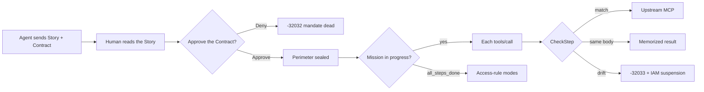
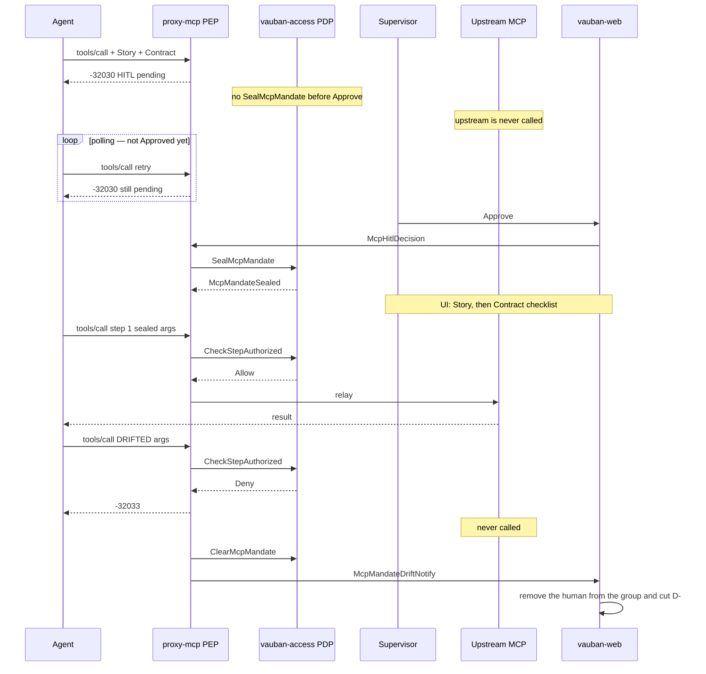
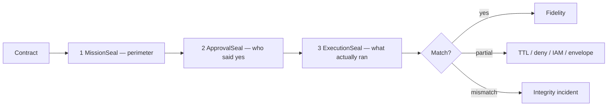
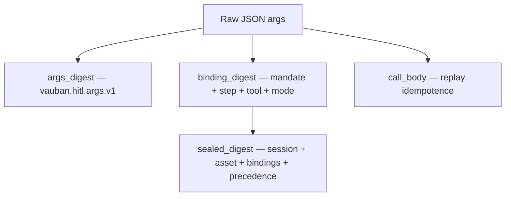
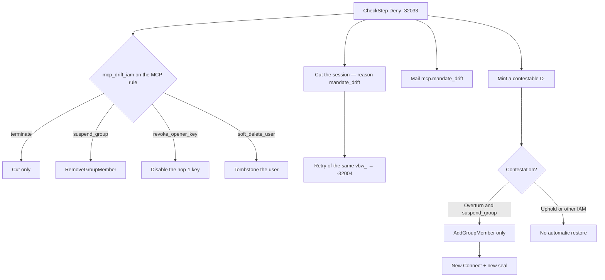

# Vauban MCP — Mission Seal (plan before action)

> Date: 2026-09-05  
> Architecture: [`Vauban_MCP_Architecture_EN.md`](Vauban_MCP_Architecture_EN.md)  
> Guide: [`../user/Vauban_MCP_User_Guide_EN.md`](../user/Vauban_MCP_User_Guide_EN.md)  
> Agent view: [`Vauban_MCP_Agent_View_EN.md`](Vauban_MCP_Agent_View_EN.md)

---

## 1. In one sentence

The agent **announces** a plan. A human **Approves the Contract**. Then Vauban **refuses every deviation** (anti-drift). Vauban never writes the plan. There is no AI judge.



### What this buys / what this does not guarantee

| Guarantees | Does **not** guarantee |
|------------|------------------------|
| After Approve, only the Contract steps pass (until `all_steps_done`) | That the agent is honest or uninjected |
| `literal` args are bit-faithful | That the Story is true |
| 1 Approve for N ops (`approval=mission`) | Confinement of a compromised agent |
| A journaled proof of the perimeter | That the human actually read the args |

---

## 2. Story vs Contract

| Piece | Role | Authz? |
|-------|------|--------|
| **Story** | Why — `summary`, `context`, `objective`, `risks` | **No** — shape and display only |
| **Contract** | What — steps (`tool` + args + `mode` + precedence) | **Yes** — the only authority |

A hostile Story **never widens** the perimeter. Digests cover the Contract only.

Story fields (trimmed UTF-8 bytes): `summary` 10..200; `context` / `objective` / `risks` 10..500. No HTML. An invalid shape returns `-32602`.

---

## 3. Timeline



| Moment | Agent response | Upstream |
|--------|----------------|----------|
| Contract OK, not Approved yet | `-32030` | no |
| Retry before Approve | `-32030` still | no |
| Approved + matching call | success | yes |
| Approved, mission in progress, tool outside the Contract | `-32033`, then a dead session | **no** |
| Approved, `all_steps_done`, Allow tool | success (no further CheckStep) | yes |
| Same body already executed | memorized replay | **no** |
| Args / order / tool outside the Contract | `-32033`, then a dead session | **no** |
| Alice Denies the pending call | `-32032` | no |
| Mission TTL (`mission_expired`, `-32034`) | mandate dead, **no** IAM suspension | no |

A missing Story or a malformed Contract returns `-32602` (fail-closed, no Approve). After Seal, CheckStep applies to every `tools/call` **while the mission is not finished**. After `all_steps_done`, access-rule modes resume (Allow / HITL / a new Seal).

---

## 4. Three seals over time



| # | When | Who (target) | Meaning |
|---|------|--------------|---------|
| 1 MissionSeal | Contract received | PDP (`vauban-access`; lab without AccessGuard = proxy) | Bindings + precedence (`sealed_digest`) |
| 2 ApprovalSeal | Approve click (SoD) | web + PDP + WORM | Who Approved which digest |
| 3 ExecutionSeal | After execution | **audit recomputes** from the WORM | Not a blind signature from the proxy |

`mismatch` means tamper or a bug, not a business case. A CheckStep Deny **is not** a mismatch: enforcement held.

---

## 5. Digests (hash, not encryption)

Args are **not** encrypted. Domain-separated BLAKE3 fingerprints cover the **raw** `serde_json::Value` (the same object the proxy re-serializes upstream) — **before** UI redaction.



- The same JSON under another domain yields another hex. A digest minted for one use cannot forge another.
- `{"password":"alpha"}` is not `{"password":"beta"}`, even when the UI shows `***`.
- The Story stays **outside** `sealed_digest` and CheckStep.

Lab `echo`: args `{"message":"mission-seal-ok"}` → Allow; `{"message":"DRIFT"}` → Deny `-32033`.

---

## 6. Contract: multiset + DAG

The Contract is not necessarily a FIFO queue.

> Is there an **unconsumed** step whose binding matches the call, and whose predecessors are all satisfied?

A strict sequence is the chain `1 → 2 → … → N`. Two tools with no edge may run in parallel.

| `mode` | Lab P0 | Meaning |
|--------|--------|---------|
| `literal` | **enforced** | The call equals the digest of the exact args |
| `constrained` | rejected until P1b | Value versus a sealed constraint |
| `derived` | rejected until P1b | JSON Pointer plus a **mandatory constraint** — no `${…}` interpolation |

`approval`: **`mission`** only in v1 (one Approve for the whole Contract). `step` is rejected.

Idempotence key: `(mandate_id, step_id, blake3(body))` — **not** the client `json_rpc_id`. The same body replays. A different body is a violation.

Pending TTL matches HITL (for example 900 s). After Approve, `mission_expires_at` defaults to **900 s** (minutes, not the 3600 s session TTL).

---

## 7. First drift leads to IAM suspension

This is product behavior, not an integrity incident:



Rules:

- Always: the PEP (`-32033`, no upstream, JSONL/WORM), one notify and one mail **per session**, and a `D-` `mandate_drift`.
- Only the IAM action varies. The product default is `suspend_group` (group removal). `terminate` is a weaker opt-in.
- The tool is **not** blacklisted.
- An IAM Overturn calls `AddGroupMember` **only** when the action was `suspend_group`. v1 does not restore the user or the key.
- `mission_expired` (TTL) **does not notify** and **does not mutate** IAM.
- An HITL Deny **is not** Seal drift.
- A tool outside the allow-list (`-32001`) **is not** an IAM suspension.
- The setting lives at `/sessions/mcp/access/{id}/edit` (not on the SSH PAM form).

The PDP is `vauban-access` (`CheckStepAuthorized` / `SealMcpMandate`). The proxy is the PEP. `SealMcpMandate` runs **after Approve** (not on the first `-32030`). An access Allow goes upstream immediately (no HITL fallback). `ClearMcpMandate` runs at session end, on Deny, on TTL, and on drift. Without AccessGuard (tests / HTTP lab), CheckStep is local. `McpMandateDriftNotify` applies IAM on the web side. The WORM Approve record carries `mandate_id` and `sealed_digest`.

---

## 8. Wire (P0)

Agent path (hop 2 `tools/list` plus `arguments.vauban`): [`Vauban_MCP_Agent_View_EN.md`](Vauban_MCP_Agent_View_EN.md).

```json
{
  "arguments": {
    "name": "hello.txt",
    "vauban": {
      "story": { "summary": "…", "context": "…", "objective": "…", "risks": "…" },
      "contract": { "approval": "mission", "edges": [], "steps": [] }
    }
  }
}
```

`_meta.vauban` is still accepted (curl). Shape:

```json
{
  "story": {
    "summary": "Read lab config then echo a fixed message.",
    "context": "Lab MCP asset. No production data.",
    "objective": "Prove the sealed echo path.",
    "risks": "Wrong args after Approve must be denied."
  },
  "contract": {
    "approval": "mission",
    "edges": [],
    "steps": [
      {
        "step_id": "1",
        "intent": "Echo the sealed message",
        "operation": "echo",
        "mode": "literal",
        "arguments": { "message": "mission-seal-ok" }
      }
    ]
  }
}
```

UI at `/sessions/mcp`: **Why this mission (Story)**, then the **Mission Seal Contract** checklist (args redacted), then Approve or Deny. Honest wording: *The Story helps you understand. You Approve the Contract perimeter; Vauban verifies the Contract only.*

---

## 9. Lab vs target

| | Lab P0 (shipped) | Target |
|--|------------------|--------|
| PDP | `vauban-access` + IPC `CheckStepAuthorized` (lab without AccessGuard = local proxy) | same, plus DB persistence |
| Modes | `literal` only | plus `constrained` / `derived` |
| Replay | memorized result, no upstream | same |
| Mission TTL | 900 s | minutes, configurable |
| Drift IAM | `McpMandateDriftNotify` to web, knob `mcp_drift_iam` on the rule | same path; IAM is read from the rule |
| ExecutionSeal | recording E + WORM | audit **recomputes** MatchSeal |

HITL stays a human decision. There is no auto-approve switch.

---

## 10. Out of scope

- Automatic Story-to-Contract alignment, or an LLM judge
- The Story inside `sealed_digest`
- Rich Markdown on the Story
- An SSH or IACS mandate (same access primitive, not shipped)
- Confinement of a compromised agent
