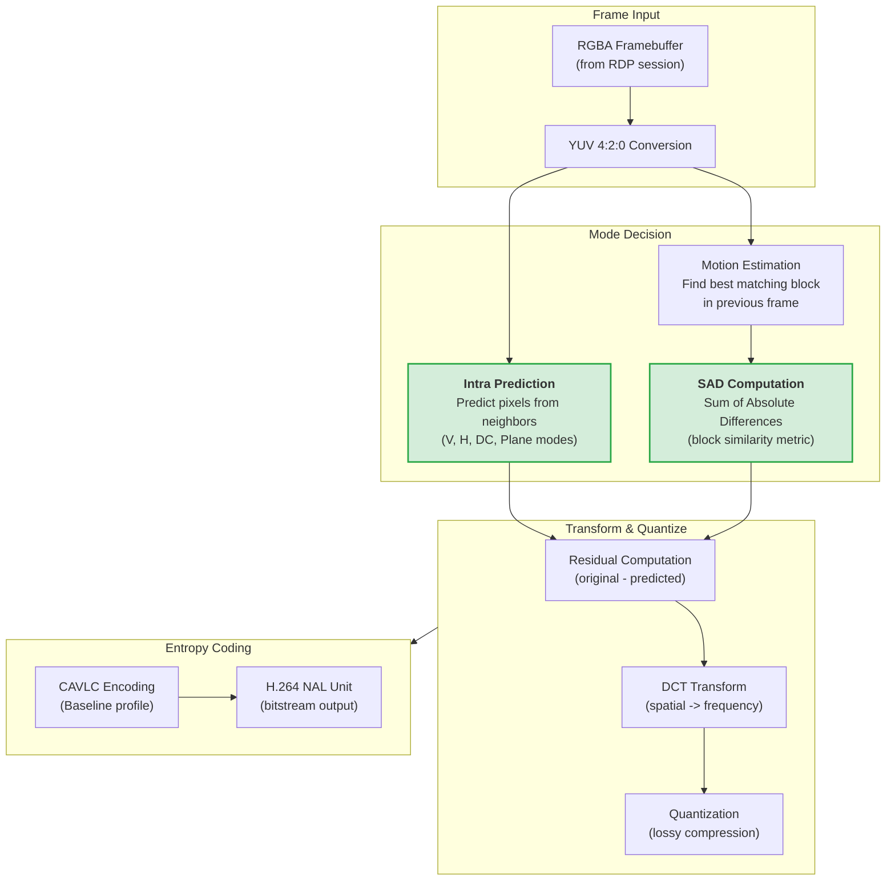
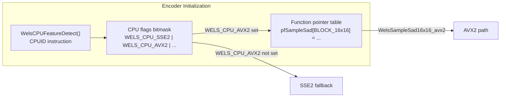

# Vauban OpenH264 AVX2 Assembly Optimizations

**Version:** 1.0  
**Date:** 24 February 2026  
**Author:** Richard Ben Aleya

---

## Table of Contents

1. [Introduction](#1-introduction)
2. [H.264 Encoding Pipeline](#2-h264-encoding-pipeline)
3. [Upstream SIMD Landscape](#3-upstream-simd-landscape)
4. [AVX2 SAD Optimizations](#4-avx2-sad-optimizations)
5. [AVX2 Intra Prediction Optimizations](#5-avx2-intra-prediction-optimizations)
6. [Build System Integration](#6-build-system-integration)
7. [Testing Strategy](#7-testing-strategy)
8. [Measured Performance](#8-measured-performance)
9. [Architecture Decisions](#9-architecture-decisions)

---

## 1. Introduction

### 1.1 Background

Vauban's RDP proxy (`vauban-proxy-rdp`) streams remote Windows desktops to web browsers by encoding each frame as H.264 video using the OpenH264 software encoder (see [Vauban RDP Architecture](Vauban_RDP_Architecture_EN(1.0).md), Section 5). This encoding runs on a dedicated CPU thread at up to 60 FPS, making it the single most CPU-intensive workload in the entire Vauban system.

Profiling on a production FreeBSD server equipped with an Intel Xeon E-2246G (Coffee Lake, 6 cores, 3.6 GHz) revealed that H.264 encoding consumed approximately **80-100% of a CPU core** during active RDP sessions with desktop motion. Since Vauban is deployed as a security appliance where multiple concurrent sessions share the same hardware, reducing per-session CPU usage directly increases the number of simultaneous sessions the server can support.

### 1.2 Opportunity

OpenH264 ships with x86 SIMD assembly code for SSE2 and, in certain modules, AVX2. However, two critical encoder subsystems -- **SAD (Sum of Absolute Differences)** and several **intra prediction modes** -- had no AVX2 implementations in the upstream codebase. These functions are invoked thousands of times per frame during motion estimation and mode decision, making them prime targets for optimization.

### 1.3 Scope

This document describes the AVX2 assembly optimizations applied as a local patch to the `openh264-sys2` v0.9.3 crate used by `vauban-proxy-rdp`. The patch adds **647 lines of new x86-64 assembly** and **42 lines of C/C++ glue code** across 10 files, implementing **13 new AVX2 functions**.

### 1.4 Applicable Hardware

These optimizations benefit any x86-64 processor with AVX2 support. At runtime, OpenH264 detects CPU capabilities via `CPUID` and selects the fastest available implementation. Processors without AVX2 continue to use the existing SSE2 code paths with no change in behavior.

| Vendor | Earliest AVX2 Microarchitecture | Year |
|--------|--------------------------------|------|
| Intel | Haswell (4th gen Core) | 2013 |
| AMD | Excavator / Zen 1 | 2015 / 2017 |

Typical Vauban deployment targets (Intel Xeon E-series, AMD EPYC) all support AVX2.

---

## 2. H.264 Encoding Pipeline

### 2.1 Where the Optimized Functions Fit

To understand the impact of these optimizations, it is necessary to understand how an H.264 encoder processes each video frame. The following diagram shows the encoding pipeline with the two stages targeted by our AVX2 patch highlighted.



### 2.2 SAD: Sum of Absolute Differences

SAD is a **block comparison metric** used primarily during motion estimation. When the encoder needs to determine how a macroblock (16x16 pixels) in the current frame relates to the previous frame, it searches for the best matching position in a reference frame. For each candidate position, it computes:

```
SAD = SUM(|current[i] - reference[i]|) for all pixels i in the block
```

The lower the SAD value, the better the match. The encoder evaluates dozens of candidate positions per macroblock, and a typical 1280x720 frame contains 3,600 macroblocks. This means SAD is evaluated **tens of thousands of times per frame**.

OpenH264 provides two families of SAD functions:

| Family | Purpose | Example |
|--------|---------|---------|
| **Simple SAD** | Compare one source block against one reference block | `WelsSampleSad16x16(src, stride, ref, stride)` returns a single integer |
| **SadFour** | Compare one source block against **four** reference positions simultaneously (up, down, left, right) | `WelsSampleSadFour16x16(src, stride, ref, stride, results[4])` writes four integers |

The SadFour variant is used during the diamond search pattern in motion estimation, where the encoder probes four neighbors at each step. Computing all four SAD values in a single function call avoids redundant memory loads.

### 2.3 Intra Prediction

Intra prediction generates a **predicted block** using only pixels from already-encoded neighboring blocks (above and to the left) within the same frame. The encoder then stores only the difference (residual) between the original and the prediction, which is typically much smaller and compresses better.

For 16x16 luma macroblocks, H.264 defines four intra prediction modes:

| Mode | Name | Algorithm | Typical Use Case |
|------|------|-----------|------------------|
| **V (Vertical)** | Copy top row | Each row of the 16x16 block is filled with the 16 pixels from the row directly above | Vertical gradients, vertically uniform regions |
| **H (Horizontal)** | Copy left column | Each column is filled with the pixel from the column directly to the left | Horizontal gradients, horizontally uniform regions |
| **DC** | Average | All 256 pixels are set to the average of the 16 top + 16 left neighbor pixels | Flat, uniform regions (common in desktop UI backgrounds) |
| **Plane** | Linear gradient | Pixels are generated from a linear equation `p(x,y) = a + b*x + c*y` derived from neighbor values | Smooth gradients (wallpapers, shadows) |

For 8x8 chroma blocks, H.264 defines similar modes. The **Chroma V (Vertical)** mode copies the 8-pixel row above the block into all 8 rows.

During encoding, the encoder evaluates all available modes for each macroblock and selects the one that produces the smallest residual. This process is called **mode decision** and is a significant contributor to encoding time.

---

## 3. Upstream SIMD Landscape

### 3.1 What OpenH264 Already Provides

OpenH264's upstream codebase (as bundled in `openh264-sys2` v0.9.3) includes x86 assembly optimizations for many hot functions. The table below shows the SIMD coverage relevant to our optimizations:

| Function Category | SSE2 | SSSE3/SSE4.1 | AVX2 (upstream) | AVX2 (our patch) |
|-------------------|------|--------------|-----------------|-------------------|
| SAD (simple) | Yes | -- | **No** | **Yes** |
| SAD (SadFour) | Yes | -- | **No** | **Yes** |
| SATD | Yes | -- | Yes | -- |
| Intra Pred 16x16 V | Yes | -- | **No** | **Yes** |
| Intra Pred 16x16 H | Yes | -- | **No** | **Yes** |
| Intra Pred 16x16 DC | Yes | -- | **No** | **Yes** |
| Intra Pred 16x16 Plane | Yes | -- | **No** | **Yes** |
| Intra Pred Chroma V | Yes | -- | **No** | **Yes** |
| DCT / IDCT | Yes | -- | Yes | -- |
| Quantization | Yes | -- | Yes | -- |
| Motion Compensation (mc_luma) | Yes | -- | Yes | -- |
| VAA / Mode Decision (vaa) | Yes | -- | Yes | -- |
| Downsample | Yes | -- | Yes | -- |

As the table shows, the upstream already provides AVX2 for DCT, quantization, motion compensation, VAA, and SATD -- but **not** for SAD or intra prediction. Our patch fills these gaps.

### 3.2 The Build Flag Problem

Enabling AVX2 compilation in `openh264-sys2` requires defining the `HAVE_AVX2` preprocessor symbol for both the C++ compiler (for function pointer registration) and the NASM assembler (for conditional assembly blocks guarded by `%ifdef HAVE_AVX2`). The upstream `build.rs` of `openh264-sys2` did **not** pass this flag to NASM, which meant that even the existing upstream AVX2 code (DCT, quantization, etc.) was silently excluded from the build.

A local patch to `build.rs` was required to add `-DHAVE_AVX2` to the NASM invocation, enabling all AVX2 code paths -- both upstream and ours.

---

## 4. AVX2 SAD Optimizations

### 4.1 Design Principles

The AVX2 SAD implementation follows three key principles:

1. **Double throughput via 256-bit registers**: AVX2 extends SSE2's 128-bit `xmm` registers to 256-bit `ymm` registers. Each `vpsadbw` instruction computes SAD over 32 bytes instead of 16, processing two rows in a single operation for 16-wide blocks.

2. **Loop unrolling with `%rep`**: All loops are fully unrolled at assembly time using NASM's `%rep` directive. This eliminates branch prediction overhead and allows the CPU's out-of-order execution engine to pipeline memory loads with arithmetic operations.

3. **Minimal register pressure**: Accumulator registers (`ymm6` or `ymm7`) are initialized once and accumulated across all rows. The final horizontal reduction uses `vextracti128` + `vpaddq` to collapse the 256-bit accumulator to a scalar result.

### 4.2 Simple SAD Functions

Four simple SAD functions were implemented for the block sizes used in motion estimation:

| Function | Block Size | Rows Processed per Iteration | Total Iterations |
|----------|------------|------------------------------|------------------|
| `WelsSampleSad16x16_avx2` | 16x16 | 2 (via `vinserti128`) | 8 |
| `WelsSampleSad16x8_avx2` | 16x8 | 2 | 4 |
| `WelsSampleSad8x16_avx2` | 8x16 | 4 (pack two 8-byte rows per 128-bit lane) | 4 |
| `WelsSampleSad8x8_avx2` | 8x8 | 4 | 2 |

For 16-wide blocks, the core operation is the `AVX2_GetSad2x16` macro:

```nasm
vmovdqu      xmm0, [r0]              ; load 16 bytes from source row N
vinserti128  ymm0, ymm0, [r0+r1], 1  ; load 16 bytes from source row N+1 into upper lane
vmovdqu      xmm1, [r2]              ; load 16 bytes from reference row N
vinserti128  ymm1, ymm1, [r2+r3], 1  ; load 16 bytes from reference row N+1
vpsadbw      ymm2, ymm0, ymm1        ; compute SAD for both rows simultaneously
vpaddq       ymm7, ymm7, ymm2        ; accumulate
```

The `vinserti128` instruction loads a second row directly into the upper 128-bit lane of a `ymm` register, allowing `vpsadbw` to process two rows in a single instruction.

### 4.3 SadFour Functions

Four SadFour functions compute SAD against four reference positions simultaneously:

| Function | Block Size |
|----------|------------|
| `WelsSampleSadFour16x16_avx2` | 16x16 |
| `WelsSampleSadFour16x8_avx2` | 16x8 |
| `WelsSampleSadFour8x16_avx2` | 8x16 |
| `WelsSampleSadFour8x8_avx2` | 8x8 |

These functions maintain four independent accumulators (`ymm4` through `ymm7`) -- one for each reference position (up, down, left, right). The source block is loaded once and compared against all four references, saving three redundant source loads per iteration compared to calling simple SAD four times.

The final `AVX2_SadFour_Reduce` macro reduces all four 256-bit accumulators to four 32-bit integers stored contiguously in memory, which the caller reads as an array of four SAD values.

### 4.4 File Locations

| File | Content |
|------|---------|
| `patches/openh264-sys2/upstream/codec/common/x86/satd_sad.asm` | 386 lines of AVX2 assembly (8 functions + 5 macros) |
| `patches/openh264-sys2/upstream/codec/common/inc/sad_common.h` | 12 lines (C declarations for 8 functions) |
| `patches/openh264-sys2/upstream/codec/encoder/core/src/sample.cpp` | 11 lines (function pointer registration under `WELS_CPU_AVX2` flag) |

---

## 5. AVX2 Intra Prediction Optimizations

### 5.1 Vertical Prediction (16x16 Luma)

**Algorithm**: Copy the 16-pixel row immediately above the macroblock into all 16 rows of the predicted block (256 bytes total).

**SSE2 approach** (upstream): Loads 16 bytes into `xmm0`, then writes `xmm0` to 16 consecutive rows using 16 separate `movdqa` stores.

**AVX2 approach** (our patch): Uses `vbroadcasti128` to replicate the 16-byte top row into both lanes of a 256-bit `ymm0` register. Each `vmovdqu` store writes 32 bytes (two rows at once), reducing the store count from 16 to 8.

```nasm
vbroadcasti128  ymm0, [r1]     ; duplicate 16 bytes into both 128-bit lanes
vmovdqu         [r0], ymm0     ; store rows 0-1
vmovdqu         [r0+32], ymm0  ; store rows 2-3
; ... 6 more stores ...
```

### 5.2 Horizontal Prediction (16x16 Luma)

**Algorithm**: For each row, read the pixel immediately to the left of the macroblock and fill the entire 16-pixel row with that value.

**AVX2 approach**: Uses `vpbroadcastb xmm0, [mem]` to broadcast a single byte to all 16 positions of an `xmm` register in one instruction. The upstream SSE2 version requires a `movzx` + `imul` + `movd` + `pshufd` sequence to achieve the same broadcast. The loop is fully unrolled with `%rep 16`.

```nasm
vpbroadcastb  xmm0, [r1]               ; broadcast left pixel to all 16 bytes
vmovdqa       [r0 + h_row * 16], xmm0  ; store one row
```

### 5.3 DC Prediction (16x16 Luma)

**Algorithm**: Compute the average of 32 neighbor pixels (16 from the top row + 16 from the left column), then fill all 256 pixels of the block with this single value.

**AVX2 approach**: The top-row sum is computed using `vpsadbw` (which sums absolute differences against zero, effectively summing the byte values). The left-column sum uses scalar `movzx` loads (since the left pixels are stride-separated in memory and cannot be loaded contiguously). After computing the average, `vpbroadcastb ymm0, xmm0` broadcasts the single DC value to all 32 bytes of a `ymm` register, enabling 8 stores of 32 bytes (two rows each) to fill the entire block.

```nasm
vpsadbw       xmm0, xmm0, xmm1  ; sum top row bytes
; ... scalar left-column accumulation ...
vpsrld        xmm0, xmm0, 5     ; divide by 32 (average)
vpbroadcastb  ymm0, xmm0        ; broadcast to all 32 bytes
vmovdqu       [r0], ymm0        ; store rows 0-1
vmovdqu       [r0+32], ymm0     ; store rows 2-3
; ... 6 more stores ...
```

### 5.4 Plane Prediction (16x16 Luma)

**Algorithm**: Generate pixels using a linear equation: `p(x,y) = clip((a + b*(x-7) + c*(y-7) + 16) >> 5)`, where `a`, `b`, and `c` are derived from the horizontal and vertical gradients of the neighbor pixels. This is the most computationally expensive intra prediction mode.

**AVX2 approach**: The gradient computation (H and V parameters) uses VEX-encoded SSE instructions for better register utilization. The core prediction loop processes all 16 pixels of each row in a single 256-bit operation:

```nasm
; Build 256-bit multiplier: [-7,-6,-5,-4,-3,-2,-1,0 | 1,2,3,4,5,6,7,8]
vmovdqa      xmm5, [sse2_plane_inc_minus]
vinserti128  ymm5, ymm5, [sse2_plane_inc], 1

.loop_plane_avx2:
    vpmullw    ymm2, ymm1, ymm5  ; b * [-7..8] (16 multiplications)
    vpaddw     ymm2, ymm2, ymm0  ; + s (row offset)
    vpsraw     ymm2, ymm2, 5     ; >> 5 (arithmetic shift)
    vpackuswb  ymm2, ymm2, ymm2  ; pack 16-bit words to 8-bit bytes with saturation
    vpermq     ymm2, ymm2, 0x08  ; gather result bytes from both lanes
    vmovdqu    [r0], xmm2        ; store 16 predicted pixels
    vpaddw     ymm0, ymm0, ymm4  ; s += c (advance to next row)
```

The SSE2 version processes only 8 pixels per iteration (using `xmm` registers) and requires two passes per row. The AVX2 version processes all 16 pixels of a row in a single pass by placing the negative multipliers `[-7..-1, 0]` in the lower lane and positive multipliers `[1..8]` in the upper lane of `ymm5`.

### 5.5 Chroma Vertical Prediction (8x8)

**Algorithm**: Copy the 8-pixel row above the chroma block into all 8 rows (64 bytes total).

**AVX2 approach**: Uses `vpbroadcastq ymm0, [r1]` to replicate the 8-byte top row to all four 64-bit slots of a `ymm` register. Two 32-byte stores fill the entire 64-byte block.

```nasm
vpbroadcastq  ymm0, [r1]     ; replicate 8 bytes to 32 bytes
vmovdqu       [r0], ymm0     ; store rows 0-3
vmovdqu       [r0+32], ymm0  ; store rows 4-7
```

### 5.6 File Locations

| File | Content |
|------|---------|
| `patches/openh264-sys2/upstream/codec/common/x86/intra_pred_com.asm` | 44 lines (V and H luma prediction) |
| `patches/openh264-sys2/upstream/codec/encoder/core/x86/intra_pred.asm` | 217 lines (DC, Plane luma prediction; Chroma V) |
| `patches/openh264-sys2/upstream/codec/common/inc/intra_pred_common.h` | 4 lines (C declarations for V, H) |
| `patches/openh264-sys2/upstream/codec/encoder/core/inc/get_intra_predictor.h` | 6 lines (C declarations for DC, Plane, Chroma V) |
| `patches/openh264-sys2/upstream/codec/encoder/core/src/get_intra_predictor.cpp` | 9 lines (function pointer registration) |

---

## 6. Build System Integration

### 6.1 Conditional Compilation

All AVX2 assembly code is wrapped in `%ifdef HAVE_AVX2` / `%endif` directives in NASM, and `#if defined(HAVE_AVX2)` / `#endif` guards in C/C++ headers. This ensures the code is only compiled when explicitly enabled.

### 6.2 build.rs Patch

The `openh264-sys2` crate's `build.rs` compiles the upstream C/C++ and assembly sources. A local patch ensures:

1. **C++ compiler** receives `-DHAVE_AVX2` so that function pointer registration code (in `sample.cpp` and `get_intra_predictor.cpp`) is compiled.
2. **NASM assembler** receives `-DHAVE_AVX2` so that the assembly implementations guarded by `%ifdef HAVE_AVX2` are assembled.

Without this patch, **all** AVX2 code (including upstream DCT, quantization, and SATD) was silently excluded.

### 6.3 Runtime Detection

At encoder initialization, OpenH264 calls `WelsCPUFeatureDetect()` which uses the `CPUID` instruction to determine available instruction sets. If AVX2 is present, the `WELS_CPU_AVX2` flag is set, and functions registered under this flag are selected. No compile-time CPU assumption is made -- the binary remains portable.



---

## 7. Testing Strategy

### 7.1 Baseline Regression Tests

The file `vauban-proxy-rdp/tests/openh264_sad_baseline.rs` contains integration tests designed to be run **before and after** AVX2 modifications. They exercise the encoder end-to-end, ensuring that the SIMD-optimized functions produce identical output to the C reference implementations.

### 7.2 SAD / Motion Estimation Tests

| Test | Pattern | What It Exercises |
|------|---------|-------------------|
| `test_encoder_produces_valid_h264_single_frame` | Diagonal gradient | First I-frame: intra prediction modes |
| `test_encoder_inter_prediction_exercises_sad` | 5 frames with shifting gradient | P-frames: inter prediction triggers SAD-based motion search |
| `test_encoder_with_motion_pattern` | 10 frames with a moving 32x32 white block on gray background | Full-search motion estimation: SAD is called extensively to track the moving block |

### 7.3 Intra Prediction Tests

| Test | Pattern | Target Mode |
|------|---------|-------------|
| `test_intra_pred_uniform_dc` | Solid color frames (Y=16, 128, 235) | DC prediction (constant regions) |
| `test_intra_pred_vertical_stripes` | Alternating 8-pixel-wide vertical bands (Y=200/40) | Vertical prediction (column-uniform) |
| `test_intra_pred_horizontal_stripes` | Alternating 8-pixel-wide horizontal bands (Y=200/40) | Horizontal prediction (row-uniform) |
| `test_intra_pred_diagonal_gradient` | Smooth diagonal gradient (top-left dark to bottom-right bright) | Plane prediction (linear gradient) |
| `test_intra_pred_forced_keyframes` | 6 frames with per-frame horizontal shift | All intra modes (each frame is an I-frame due to pattern change) |
| `test_intra_pred_screen_content_pattern` | Simulated desktop UI (menubar + checkerboard body) | Mixed DC/V/H modes (typical screen sharing content) |

### 7.4 Binary Verification

After building, the presence of AVX2 instructions in the final binary can be verified:

```bash
objdump -d target/release/vauban-proxy-rdp | grep -c vpsadbw
# Expected: 331 (SAD functions + DC prediction)
```

---

## 8. Measured Performance

### 8.1 Test Environment

| Parameter | Value |
|-----------|-------|
| OS | FreeBSD 14 (amd64) |
| CPU | Intel Xeon E-2246G (Coffee Lake, 6C/12T, 3.6 GHz base, 4.8 GHz turbo) |
| Workload | Active RDP session, 1280x720, desktop motion with video playback |
| Encoder config | H.264 Baseline, 5 Mbps, ScreenContentRealTime, 60 FPS target |

### 8.2 Results

| Metric | Before (SSE2 only) | After (SSE2 + AVX2) | Improvement |
|--------|--------------------|--------------------|-------------|
| CPU usage per session | ~80-100% of one core | ~40-50% of one core | ~50% reduction |
| Encoder behavior | Correct output | Correct output (identical test results) | No regression |
| `vpsadbw` instructions in binary | 0 (AVX2 excluded) | 331 | AVX2 code paths active |

### 8.3 Interpretation

The reduction from ~80-100% to ~40-50% of a CPU core represents roughly a **50% decrease** in CPU time per session. For a 6-core / 12-thread server, this effectively **doubles the number of concurrent RDP sessions** the hardware can support before saturating the CPU (e.g., from ~12 sessions to ~24 sessions at full utilization).

This substantial gain is explained by the fact that the patch enables **all** AVX2 code paths in OpenH264 -- not just the 13 new functions, but also the upstream AVX2 implementations for DCT, quantization, SATD, motion compensation, and VAA that were previously excluded due to the missing `HAVE_AVX2` build flag (see [Section 6.2](#62-buildrs-patch)). The combined effect comes from:

1. **Wider data paths**: AVX2 processes 32 bytes per instruction versus SSE2's 16 bytes, doubling throughput for memory-bound operations like SAD and block fills (V, H, DC predictions).

2. **Fewer instructions per operation**: AVX2 broadcast instructions (`vpbroadcastb`, `vpbroadcastq`, `vbroadcasti128`) replace multi-instruction SSE2 sequences for replicating values. The Plane prediction inner loop processes 16 pixels per iteration instead of 8.

3. **Upstream AVX2 functions unlocked**: DCT transforms, quantization, and SATD -- which together dominate encoding time -- were already implemented in AVX2 by upstream OpenH264 but never compiled into the binary until the build flag fix.

### 8.4 Remaining Optimization Margin

The following table summarizes the current SIMD coverage for the encoder's hot functions after our patch:

| Function Category | AVX2 Coverage | Remaining Opportunity |
|-------------------|---------------|----------------------|
| SAD (simple + SadFour) | **Complete** | -- |
| SATD (Hadamard) | Complete (upstream) | -- |
| Intra Pred 16x16 (V, H, DC, Plane) | **Complete** | -- |
| Intra Pred Chroma V | **Complete** | Chroma H, DC, Plane still SSE2 |
| Intra Pred 4x4 (9 modes) | Not started | Marginal gain (small blocks) |
| DCT / IDCT | Complete (upstream) | -- |
| Quantization | Complete (upstream) | -- |
| Motion Compensation | Complete (upstream) | -- |
| VAA / Mode Decision | Complete (upstream) | -- |
| Deblocking filter | SSE2/SSSE3 only | Possible but complex |

The most impactful functions (SAD, 16x16 intra prediction, SATD, DCT, quantization) are now fully covered by AVX2. Further gains would require either profiler-guided optimization of remaining SSE2 functions (diminishing returns) or encoder parameter tuning (trading quality for speed).

---

## 9. Architecture Decisions

### 9.1 Summary

| Decision | Choice | Rationale |
|----------|--------|-----------|
| Patch location | Local `patches/openh264-sys2/` directory | Maintains upstream compatibility; patch is version-controlled alongside Vauban |
| Assembly syntax | NASM (Intel syntax) | Consistent with upstream OpenH264 convention |
| Loop strategy | Full unrolling via `%rep` | Eliminates branch overhead; acceptable code size for <= 16 iterations |
| 8-wide block strategy | Use `xmm` registers with VEX encoding | AVX2's 256-bit `ymm` registers offer no benefit for 8-byte loads; VEX prefix avoids SSE-AVX transition penalties |
| Plane prediction loop | 16-iteration loop (not unrolled) | Unrolling 16 iterations with the Plane computation would produce excessive code for marginal gain |
| `vzeroupper` placement | Before every `ret` | Prevents AVX-SSE transition penalties in calling code |
| Test approach | End-to-end encoder tests (not unit tests on individual SIMD functions) | Tests the full integration including function pointer dispatch; catches registration errors, not just arithmetic bugs |
| Build flag propagation | Patch `build.rs` to pass `-DHAVE_AVX2` to NASM | Required because upstream only passes the flag to the C++ compiler |

### 9.2 Why Not Intrinsics?

The AVX2 code is written in NASM assembly rather than C intrinsics (`immintrin.h`) for two reasons:

1. **Consistency with upstream**: All existing SIMD code in OpenH264 is written in NASM assembly. Mixing intrinsics would create a maintenance burden.
2. **Register control**: Assembly allows precise control over register allocation and instruction scheduling, which is critical for functions that are called millions of times per second.

### 9.3 Licensing

The upstream OpenH264 code is licensed under the BSD 2-Clause license by Cisco Systems. Our additions are authored by Richard Ben Aleya (Copyright 2026) and are co-located with the Cisco copyright headers, following the same BSD 2-Clause terms.

---

## Appendix A: Complete Function Inventory

### A.1 New AVX2 Functions (13 total)

| # | Function | File | Block Size | Category |
|---|----------|------|------------|----------|
| 1 | `WelsSampleSad16x16_avx2` | `satd_sad.asm` | 16x16 | SAD |
| 2 | `WelsSampleSad16x8_avx2` | `satd_sad.asm` | 16x8 | SAD |
| 3 | `WelsSampleSad8x16_avx2` | `satd_sad.asm` | 8x16 | SAD |
| 4 | `WelsSampleSad8x8_avx2` | `satd_sad.asm` | 8x8 | SAD |
| 5 | `WelsSampleSadFour16x16_avx2` | `satd_sad.asm` | 16x16 | SadFour |
| 6 | `WelsSampleSadFour16x8_avx2` | `satd_sad.asm` | 16x8 | SadFour |
| 7 | `WelsSampleSadFour8x16_avx2` | `satd_sad.asm` | 8x16 | SadFour |
| 8 | `WelsSampleSadFour8x8_avx2` | `satd_sad.asm` | 8x8 | SadFour |
| 9 | `WelsI16x16LumaPredV_avx2` | `intra_pred_com.asm` | 16x16 | Intra Pred |
| 10 | `WelsI16x16LumaPredH_avx2` | `intra_pred_com.asm` | 16x16 | Intra Pred |
| 11 | `WelsI16x16LumaPredDc_avx2` | `intra_pred.asm` | 16x16 | Intra Pred |
| 12 | `WelsI16x16LumaPredPlane_avx2` | `intra_pred.asm` | 16x16 | Intra Pred |
| 13 | `WelsIChromaPredV_avx2` | `intra_pred.asm` | 8x8 | Intra Pred |

### A.2 Patch Statistics

| Metric | Value |
|--------|-------|
| New assembly lines | 647 |
| New C/C++ lines (headers + registration) | 42 |
| Files modified | 10 |
| Total new functions | 13 |
| Assembly macros added | 7 (`AVX2_GetSad2x16`, `AVX2_SadFour_Reduce`, `AVX2_SadFour_16x2`, `AVX2_SadFour_8x2`, `AVX2_SadFour_Reduce_8`, plus 2 implicit `%rep` patterns) |

---

## Appendix B: Key AVX2 Instructions Used

| Instruction | Width | Purpose in Our Code |
|-------------|-------|---------------------|
| `vpsadbw` | 256-bit | Core SAD computation: sum of absolute byte differences across 32 bytes |
| `vinserti128` | 256-bit | Load a second row into the upper 128-bit lane of a `ymm` register |
| `vextracti128` | 256-bit | Extract upper lane for final horizontal reduction |
| `vpbroadcastb` | 128/256-bit | Replicate a single byte to all positions (H prediction, DC fill) |
| `vpbroadcastw` | 256-bit | Replicate a 16-bit word to all positions (Plane coefficients) |
| `vpbroadcastq` | 256-bit | Replicate 8 bytes to all 64-bit slots (Chroma V prediction) |
| `vbroadcasti128` | 256-bit | Replicate 16 bytes to both 128-bit lanes (Luma V prediction) |
| `vpmullw` | 256-bit | 16-way parallel 16-bit multiplication (Plane prediction inner loop) |
| `vpaddw` / `vpaddq` | 256-bit | Parallel addition for accumulation |
| `vpsraw` | 256-bit | Arithmetic right shift (Plane prediction normalization) |
| `vpackuswb` | 256-bit | Pack 16-bit values to unsigned 8-bit bytes with saturation |
| `vpermq` | 256-bit | Cross-lane permutation (gather results after `vpackuswb`) |
| `vzeroupper` | -- | Clear upper 128 bits of all `ymm` registers to prevent SSE-AVX transition penalties |

---
