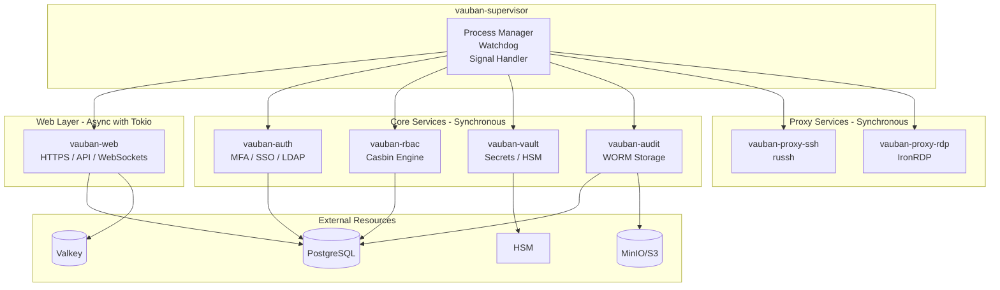
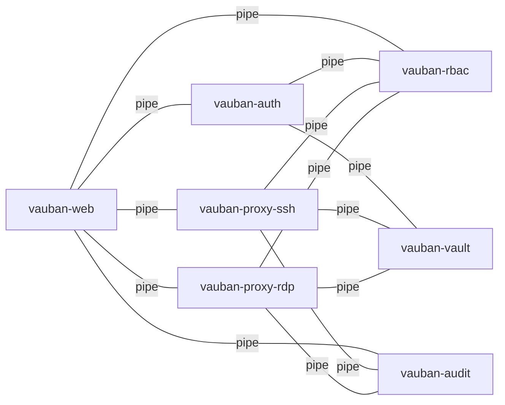
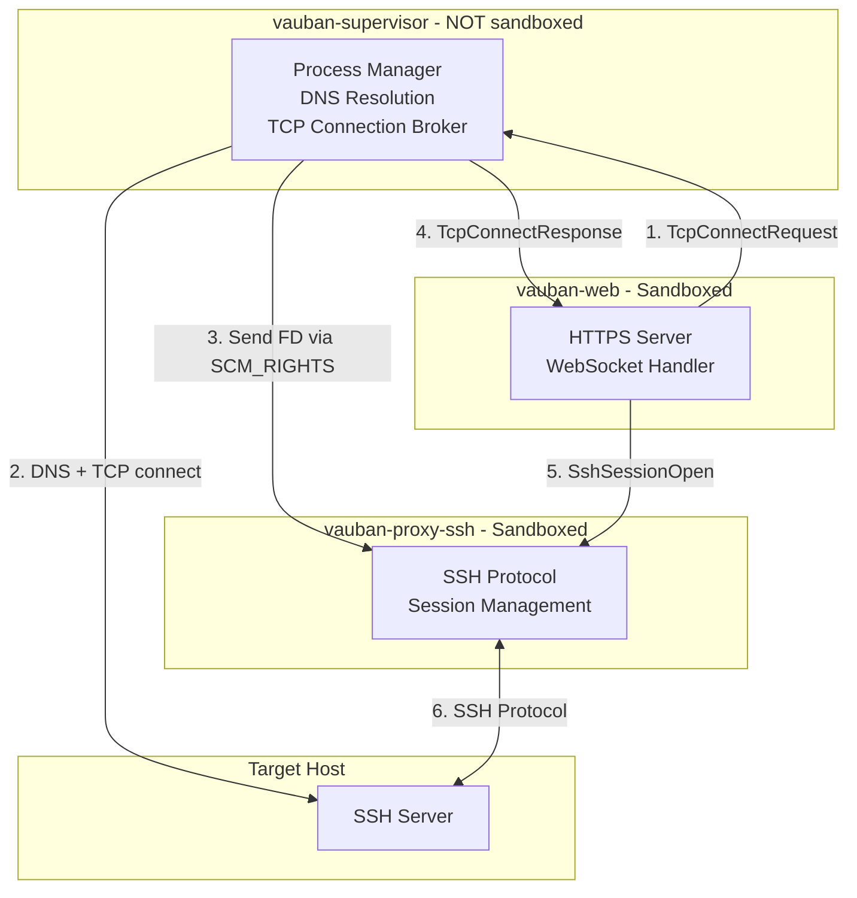
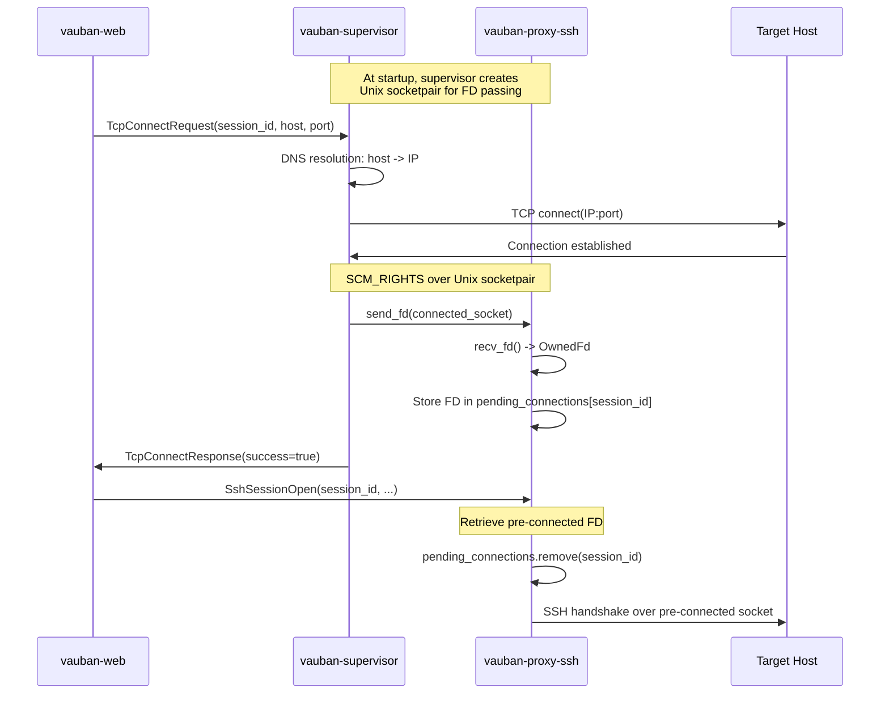
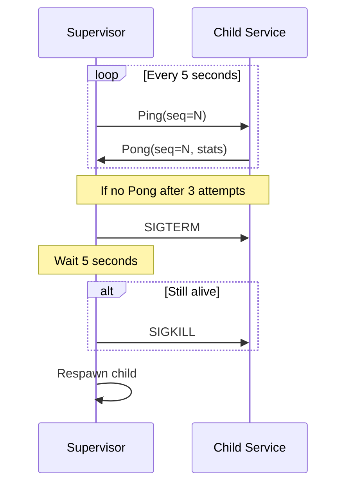
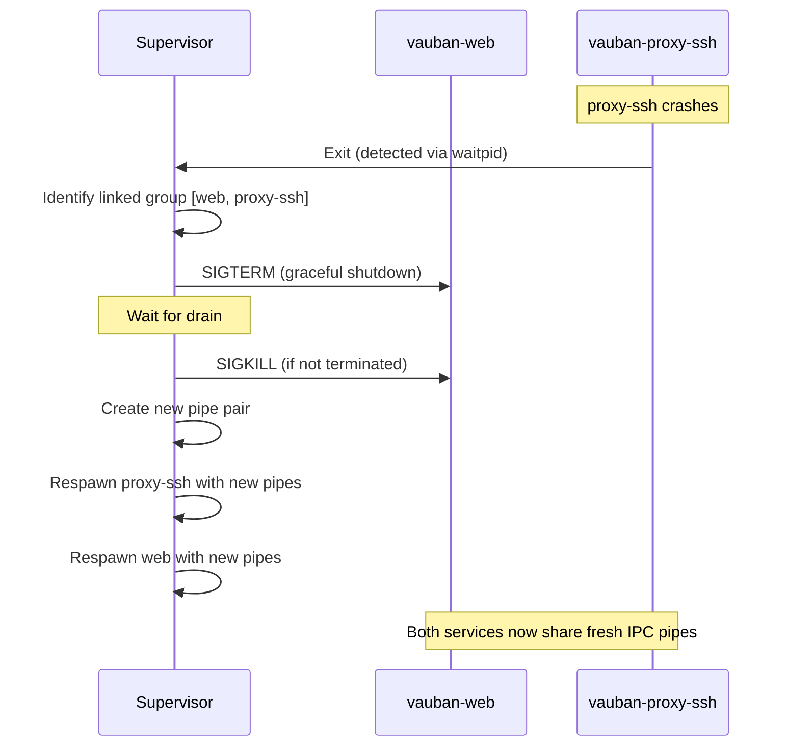
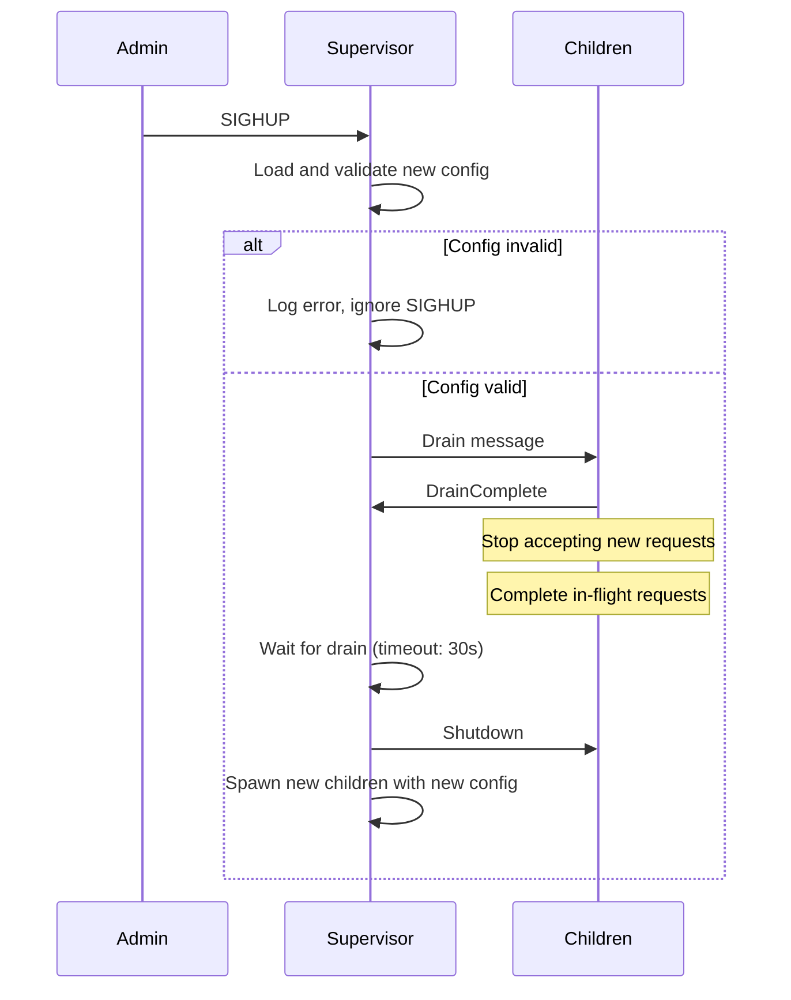
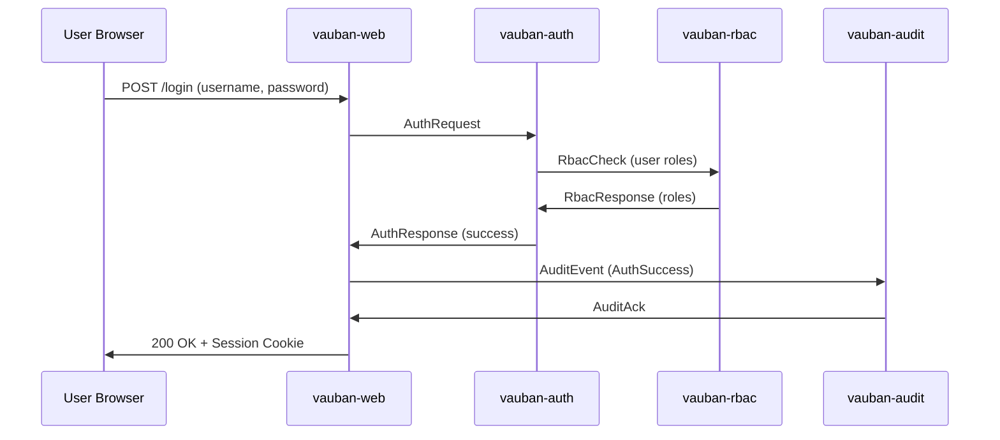
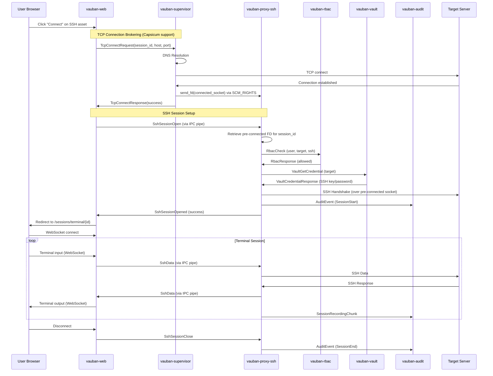

# Vauban Privilege Separation Architecture

**Version:** 1.1  
**Date:** 5 February 2026  
**Author:** Richard Ben Aleya

---

## Table of Contents

1. [Introduction](#1-introduction)
2. [Architecture Overview](#2-architecture-overview)
3. [Pipe Topology](#3-pipe-topology)
4. [IPC Protocol](#4-ipc-protocol)
5. [Capsicum Sandboxing](#5-capsicum-sandboxing)
6. [Database Connections](#6-database-connections)
7. [Supervisor and Watchdog](#7-supervisor-and-watchdog)
8. [Supervisor Configuration](#8-supervisor-configuration)
9. [Graceful Restart](#9-graceful-restart)
10. [Startup Sequence](#10-startup-sequence)
11. [Architecture Decisions](#11-architecture-decisions)

---

## 1. Introduction

### 1.1 Background

Vauban is a security bastion (PAM - Privileged Access Management) designed to provide secure access to Corporate/Industrial/Military infrastructure. The initial architecture used gRPC with mTLS for inter-service communication.

### 1.2 Motivation for Change

The decision to migrate to a **privilege separation (privsep)** architecture was driven by:

- **Enhanced Security**: Following the OpenSSH model, each process runs with minimal privileges
- **Maximum Performance**: Unix pipes are faster than network protocols (no serialization overhead, no TLS handshake)
- **Reduced Attack Surface**: No network ports exposed between services
- **Appliance Deployment**: Single-machine deployment on FreeBSD

### 1.3 Inspiration

This architecture is inspired by **OpenSSH's privilege separation model**, which has proven secure and robust for over 20 years. Like OpenSSH, Vauban separates privileged operations into isolated processes that communicate via Unix pipes.

---

## 2. Architecture Overview

### 2.1 Component Overview

Vauban consists of 8 processes:

| Process | Description | Privileges |
|---------|-------------|------------|
| `vauban-supervisor` | Process manager, watchdog, orchestrator | Root (briefly) |
| `vauban-web` | HTTPS, Web UI, REST API, WebSockets | Unprivileged (uid 907) |
| `vauban-auth` | Authentication, MFA, SSO, LDAP | Unprivileged (uid 904) |
| `vauban-rbac` | Role-Based Access Control (Casbin) | Unprivileged (uid 903) |
| `vauban-vault` | Secrets management, HSM integration | Unprivileged (uid 902) |
| `vauban-audit` | Audit logging, session recording | Unprivileged (uid 901) |
| `vauban-proxy-ssh` | SSH proxy (russh) | Unprivileged (uid 905) |
| `vauban-proxy-rdp` | RDP proxy (IronRDP) | Unprivileged (uid 906) |

### 2.2 Architecture Diagram



### 2.3 Minimalist Philosophy

**Only `vauban-web` and the proxy services (`vauban-proxy-ssh`, `vauban-proxy-rdp`) use Tokio** because they handle continuous bidirectional streams with multiple concurrent connections.

#### Why Proxies Use Tokio

The proxy services are fundamentally different from stateless services:

| Aspect | Stateless Services | Proxy Services |
|--------|-------------------|----------------|
| Pattern | Request/Response | Continuous bidirectional streams |
| Concurrency | 1 request = 1 response | N simultaneous sessions |
| Duration | Milliseconds | Minutes to hours |
| Sync complexity | Simple | Complex state machines |

Additional justifications for async proxies:
- **Pure Rust SSH**: `russh` is 100% Rust (memory-safe) vs `ssh2` which depends on libssh2 (C code)
- **Natural concurrency**: Managing N SSH sessions is natural with `async/await` and `tokio::select!`
- **Better auditability**: Pure Rust code is easier to audit for a security bastion

#### Synchronous Services

The other 5 services remain **synchronous and minimalist**:

- No async runtime (no Tokio, no async-std)
- Synchronous I/O with `poll(2)` or `kqueue(2)` on FreeBSD
- Minimal dependencies: `shared`, `libc`, `serde`, `tracing`
- Smaller binaries, reduced attack surface
- More predictable behavior for debugging

This applies to: `vauban-auth`, `vauban-rbac`, `vauban-vault`, `vauban-audit`, `vauban-supervisor`

---

## 3. Pipe Topology

### 3.1 Mesh Architecture

Services communicate directly via Unix pipes in a partial mesh topology. This avoids routing through the supervisor, maximizing performance.

### 3.2 Connection Matrix

| Source | Destination | Purpose |
|--------|-------------|---------|
| `web` | `auth` | User authentication, MFA |
| `web` | `rbac` | UI permission checks |
| `web` | `audit` | Audit log queries |
| `web` | `proxy-ssh` | SSH terminal data (bidirectional) |
| `web` | `proxy-rdp` | RDP session data (bidirectional) |
| `auth` | `rbac` | Role verification during auth |
| `auth` | `vault` | LDAP/OIDC credentials |
| `proxy-ssh` | `rbac` | Session authorization |
| `proxy-ssh` | `vault` | SSH key injection |
| `proxy-ssh` | `audit` | Session recording |
| `proxy-rdp` | `rbac` | Session authorization |
| `proxy-rdp` | `vault` | Windows credentials |
| `proxy-rdp` | `audit` | Video capture |

**Total: 13 pipe pairs (26 file descriptors)**

### 3.3 Topology Diagram



### 3.4 Pipe Creation

The supervisor creates all pipe pairs **before** forking child processes:

```rust
for conn in TOPOLOGY {
    let (from_channel, to_channel) = IpcChannel::pair()?;
    pipes.insert((conn.from, conn.to), (from_channel, to_channel));
}
```

---

## 4. IPC Protocol

### 4.1 Message Format

Messages are serialized using **bincode** for efficiency:

```
┌─────────────────┬─────────────────────────────────┐
│ Length (4 bytes)│ Serialized Message (bincode)    │
│ Little-endian   │ Variable length, max 16 KB      │
└─────────────────┴─────────────────────────────────┘
```

### 4.2 Message Types

```rust
pub enum Message {
    // Control messages (supervisor <-> services)
    Control(ControlMessage),

    // Authentication (Web -> Auth)
    AuthRequest { request_id, username, credential, source_ip },
    AuthResponse { request_id, result },
    MfaVerify { request_id, challenge_id, code },
    MfaVerifyResponse { request_id, success, session_id },

    // RBAC (Web/Auth/Proxy -> Rbac)
    RbacCheck { request_id, subject, object, action },
    RbacResponse { request_id, result },

    // Vault (Auth/Proxy -> Vault)
    VaultGetSecret { request_id, path },
    VaultSecretResponse { request_id, data },
    VaultGetCredential { request_id, asset_id, credential_type },
    VaultCredentialResponse { request_id, credential },

    // Audit (Web/Proxy -> Audit)
    AuditEvent { timestamp, event_type, user_id, session_id, ... },
    AuditAck { timestamp },
    SessionRecordingChunk { session_id, sequence, data },

    // SSH Proxy (Web <-> ProxySsh)
    SshSessionOpen { request_id, session_id, user_id, asset_id, asset_host, ... },
    SshSessionOpened { request_id, session_id, success, error },
    SshData { session_id, data },
    SshSessionClose { session_id },
    SshResize { session_id, cols, rows },

    // RDP Proxy (Web <-> ProxyRdp) - similar structure
    RdpSessionOpen { ... },
    RdpSessionOpened { ... },
    RdpData { ... },
}
```

### 4.3 Control Messages

```rust
pub enum ControlMessage {
    Drain,                              // Stop accepting new requests
    DrainComplete { pending_requests }, // Service is idle
    Ping { seq },                       // Heartbeat request
    Pong { seq, stats },                // Heartbeat response
    Shutdown,                           // Immediate shutdown
}
```

### 4.4 File Descriptor Passing

For connection handoff (e.g., passing a client socket to a proxy), we use **SCM_RIGHTS**:

```rust
// Send a file descriptor over a Unix socket
pub fn send_fd(socket_fd: RawFd, fd_to_send: RawFd) -> Result<()>;

// Receive a file descriptor
pub fn recv_fd(socket_fd: RawFd) -> Result<OwnedFd>;
```

---

## 5. Capsicum Sandboxing

### 5.1 Overview

**Capsicum** is FreeBSD's capability-based security framework. After entering capability mode, a process can only access pre-opened file descriptors.

### 5.2 Sandbox Entry Sequence

Each service follows this pattern:

```rust
fn run_service() -> Result<()> {
    // 1. Get IPC file descriptors from environment
    let ipc_read_fd = env::var("VAUBAN_IPC_READ")?.parse()?;
    let ipc_write_fd = env::var("VAUBAN_IPC_WRITE")?.parse()?;
    
    // 2. Clear environment variables immediately
    env::remove_var("VAUBAN_IPC_READ");
    env::remove_var("VAUBAN_IPC_WRITE");
    
    // 3. Open ALL required resources BEFORE cap_enter()
    let db_conn = connect_to_database()?;
    
    // 4. Limit FD rights
    cap_rights_limit(ipc_read_fd, CAP_READ | CAP_EVENT)?;
    cap_rights_limit(ipc_write_fd, CAP_WRITE)?;
    cap_rights_limit(db_fd, CAP_READ | CAP_WRITE | CAP_CONNECT)?;
    
    // 5. ENTER CAPABILITY MODE (point of no return)
    cap_enter()?;
    
    // 6. Main loop - no new resources can be opened
    main_loop()
}
```

### 5.3 Capability Rights

| Resource | Rights |
|----------|--------|
| IPC read pipe | `CAP_READ`, `CAP_EVENT` |
| IPC write pipe | `CAP_WRITE` |
| Database socket | `CAP_READ`, `CAP_WRITE`, `CAP_CONNECT` |
| Listening socket | `CAP_ACCEPT`, `CAP_LISTEN`, `CAP_EVENT` |

### 5.4 Development Mode

On non-FreeBSD platforms (macOS, Linux), sandbox functions are no-ops with warnings:

```rust
#[cfg(not(target_os = "freebsd"))]
pub fn enter_capability_mode() -> Result<()> {
    tracing::warn!("Capsicum not available: running without sandbox");
    Ok(())
}
```

### 5.5 vauban-web Sandboxing

`vauban-web` is an async web server using Tokio and Axum. It requires special handling for Capsicum sandboxing due to its use of connection pools and multiplexed connections.

#### 5.5.1 Pre-sandbox Resource Acquisition

Before entering capability mode, vauban-web must:

1. **Bind the HTTPS listening socket** - Network namespace access required
2. **Load TLS certificates** - File system access required
3. **Pre-establish all database connections** - Fixed-size pool
4. **Establish Redis/Valkey connection** - Multiplexed connection
5. **Initialize rate limiter** - May use Redis

```rust
// Simplified startup sequence
async fn main() -> Result<()> {
    // 1. Bind socket BEFORE sandbox
    let listener = TcpListener::bind(addr).await?;
    
    // 2. Load TLS configuration (opens certificate files)
    let tls_config = load_tls_config(&config).await?;
    
    // 3. Create fixed-size database pool (all connections pre-established)
    let db_pool = create_pool_sandboxed(&config)?;
    
    // 4. Create and validate cache connection
    let cache = create_cache_client(&config).await?;
    cache.validate_connection().await?;
    
    // 5. Enter sandbox
    enter_sandbox(&listener)?;
    
    // 6. Serve requests (no new FDs can be opened)
    serve(listener, tls_config, app).await
}
```

#### 5.5.2 Fixed-Size Database Pool

Unlike the standard dynamic pool, the sandboxed pool:

- Sets `max_size = min_idle` to pre-establish all connections
- Uses `test_on_check_out(true)` to detect dead connections
- Validates all connections at startup before `cap_enter()`

```rust
pub fn create_pool_sandboxed(config: &Config) -> AppResult<DbPool> {
    let pool_size = config.database.max_connections;
    
    Pool::builder()
        .max_size(pool_size)
        .min_idle(Some(pool_size))  // Pre-establish ALL connections
        .test_on_check_out(true)
        .build(manager)?
}
```

#### 5.5.3 Connection Loss Handling

If a database or cache connection is lost after `cap_enter()`:

1. The health check endpoint (`/health`) returns 503 Service Unavailable
2. The service continues to operate with degraded functionality
3. If connection cannot be recovered, exit with code 100 for respawn

```rust
pub fn get_connection_or_exit(pool: &DbPool) -> DbConnection {
    match pool.get() {
        Ok(conn) => conn,
        Err(e) => {
            tracing::error!("DB connection lost in sandbox mode: {}", e);
            std::process::exit(100);  // Trigger supervisor respawn
        }
    }
}
```

#### 5.5.4 Sandboxed Services Summary

| Service | Sandboxed | Notes |
|---------|-----------|-------|
| `vauban-supervisor` | No | Needs to spawn/manage children |
| `vauban-web` | **Yes** | Fixed pool, multiplexed cache, pre-bound socket |
| `vauban-auth` | Yes | IPC + optional DB |
| `vauban-rbac` | Yes | IPC only |
| `vauban-vault` | Yes | IPC + HSM |
| `vauban-audit` | Yes | IPC + audit storage |
| `vauban-proxy-ssh` | Yes | IPC + pre-established connections via FD passing |
| `vauban-proxy-rdp` | Yes | IPC + pre-established connections via FD passing |

### 5.6 TCP Connection Brokering for Sandboxed Proxies

#### 5.6.1 The Problem

After entering Capsicum capability mode, sandboxed processes cannot:

1. **Perform DNS resolution** - Requires access to `/etc/resolv.conf` and DNS servers
2. **Open new TCP connections** - Requires the `connect()` system call on new sockets

This creates a challenge for proxy services (`vauban-proxy-ssh`, `vauban-proxy-rdp`) that need to connect to target hosts on demand.

#### 5.6.2 The Solution: Supervisor-Brokered Connections

The supervisor acts as a **connection broker** for sandboxed proxies:

1. The supervisor remains outside the sandbox (never calls `cap_enter()`)
2. Proxies request TCP connections via IPC messages
3. The supervisor performs DNS resolution and TCP connect
4. The connected socket is passed to the proxy via **SCM_RIGHTS** over a Unix socket pair

This approach maintains the OpenSSH-style privilege separation model: sandboxed processes handle protocol logic while privileged operations (network access) remain in the supervisor.

#### 5.6.3 Architecture Diagram



#### 5.6.4 File Descriptor Passing with SCM_RIGHTS

Unix sockets support passing file descriptors between processes using the `SCM_RIGHTS` control message type. This mechanism allows the supervisor to:

1. Create a TCP connection to the target host
2. Send the connected socket's file descriptor to the proxy
3. The proxy receives a fully functional TCP connection without ever calling `connect()`



#### 5.6.5 Unix Socketpair for FD Passing

Standard Unix pipes do not support `SCM_RIGHTS`. A dedicated Unix socket pair is created for file descriptor passing:

```rust
// Create socketpair at service spawn time
let (supervisor_socket, proxy_socket) = socketpair(
    AddressFamily::Unix,
    SockType::Stream,
    None,
    SockFlag::empty()
)?;

// Pass proxy_socket to the child via environment variable
env::set_var("VAUBAN_FD_PASSING_SOCKET", proxy_socket.as_raw_fd().to_string());

// Supervisor keeps supervisor_socket for sending FDs
fd_passing_sockets.insert(Service::ProxySsh, supervisor_socket);
```

#### 5.6.6 Message Types

```rust
// Request supervisor to establish a TCP connection
TcpConnectRequest {
    request_id: u64,
    session_id: String,    // Correlates FD with subsequent SshSessionOpen
    host: String,          // Hostname (DNS resolved by supervisor)
    port: u16,
    target_service: Service,  // ProxySsh or ProxyRdp
}

// Response after connection attempt
TcpConnectResponse {
    request_id: u64,
    session_id: String,
    success: bool,
    error: Option<String>,  // DNS failure, connection refused, etc.
}
```

#### 5.6.7 Capsicum Rights for FD Receiver Socket

The Unix socket used to receive file descriptors has minimal capabilities:

| Capability | Purpose |
|------------|---------|
| `CAP_READ` | Receive data and `SCM_RIGHTS` messages |
| `CAP_EVENT` | Poll/kqueue for async I/O |
| `CAP_FSTAT` | Socket status checks |
| `CAP_GETSOCKOPT` | Socket option queries |

The socket does **not** have `CAP_WRITE`, `CAP_CONNECT`, or `CAP_ACCEPT` since it only receives.

#### 5.6.8 Development Mode (macOS/Linux)

On platforms without Capsicum, proxies can still open connections directly:

```rust
let session = if let Some(fd) = config.preconnected_fd {
    // Sandboxed mode: use pre-established connection
    let stream = TcpStream::from_std(unsafe { 
        std::net::TcpStream::from_raw_fd(fd.into_raw_fd()) 
    })?;
    client::connect_stream(ssh_config, stream, handler).await?
} else {
    // Development mode: connect directly
    client::connect(ssh_config, addr, handler).await?
};
```

#### 5.6.9 Error Handling

| Error Condition | Handling |
|----------------|----------|
| DNS resolution failure | Return error in `TcpConnectResponse` |
| Connection refused | Return error in `TcpConnectResponse` |
| Connection timeout | Return error in `TcpConnectResponse` |
| FD passing failure | Log error, return failure in response |
| Session ID mismatch | Log warning, ignore orphaned FD |

#### 5.6.10 Security Benefits

1. **Complete Network Isolation**: Sandboxed proxies have zero network capabilities
2. **Controlled DNS**: Only supervisor can resolve hostnames (prevents DNS-based attacks)
3. **Connection Validation**: Supervisor can validate target hosts before connecting
4. **Audit Trail**: All connection requests pass through supervisor (loggable)
5. **Rate Limiting**: Supervisor can limit connection attempts per session/user

---

## 6. Database Connections

### 6.1 Separate Connections per Service

Each service opens its own database connection with a dedicated PostgreSQL user:

| Service | PostgreSQL User | Schema Access |
|---------|-----------------|---------------|
| `vauban-web` | `vauban_web` | `web.*`, read `auth.sessions` |
| `vauban-auth` | `vauban_auth` | `auth.*` |
| `vauban-rbac` | `vauban_rbac` | `rbac.*` |
| `vauban-vault` | `vauban_vault` | `vault.*` |
| `vauban-audit` | `vauban_audit` | `audit.*` |

### 6.2 Connection Resilience

After `cap_enter()`, new connections cannot be opened. If a database connection fails:

1. The service logs the error
2. The service exits with code 100 (special "respawn me" code)
3. The supervisor detects the exit and respawns the service
4. The new service opens a fresh connection

```rust
async fn main_loop(db: PgPool) -> Result<()> {
    loop {
        match db.acquire().await {
            Ok(conn) => handle_requests(conn).await?,
            Err(e) if e.is_connection_error() => {
                error!("DB connection lost, exiting for respawn");
                std::process::exit(100);
            }
            Err(e) => return Err(e.into()),
        }
    }
}
```

---

## 7. Supervisor and Watchdog

### 7.1 Responsibilities

The `vauban-supervisor` is responsible for:

1. **Pipe Creation**: Creates all 11 pipe pairs before forking
2. **Process Spawning**: Forks and execs child processes with proper privileges
3. **Privilege Dropping**: Children drop to unprivileged users
4. **Watchdog**: Monitors children with bidirectional heartbeat
5. **Respawning**: Restarts crashed children (with rate limiting)
6. **Signal Handling**: Graceful restart on SIGHUP, shutdown on SIGTERM

### 7.2 Heartbeat Protocol



### 7.3 Service Statistics

Each Pong message includes service health metrics:

```rust
pub struct ServiceStats {
    pub uptime_secs: u64,
    pub requests_processed: u64,
    pub requests_failed: u64,
    pub active_connections: u32,
    pub pending_requests: u32,
}
```

### 7.4 Respawn Rate Limiting

To prevent crash loops, the supervisor limits respawns:

- Maximum 10 respawns per hour per service
- After exceeding the limit, the service enters degraded mode
- Manual intervention required

### 7.5 Linked Restart Groups

Services that share inter-process pipes (e.g., `vauban-web` and `vauban-proxy-ssh`) form **linked restart groups**. When any service in a group crashes, the anonymous Unix pipe connecting them becomes broken. Since new file descriptors cannot be created after `cap_enter()`, all services in the group must be restarted together to re-establish communication.

#### 7.5.1 Linked Groups

| Group | Services | Shared Pipes |
|-------|----------|--------------|
| SSH Group | `web`, `proxy-ssh` | Terminal data stream |
| RDP Group | `web`, `proxy-rdp` | Session data stream |

#### 7.5.2 Group Restart Sequence



#### 7.5.3 Benefits

- **Automatic Recovery**: No manual intervention needed when a linked service crashes
- **Clean State**: Both services start fresh with new pipe connections
- **No Stale Connections**: Eliminates "broken pipe" errors on the surviving service

---

## 8. Supervisor Configuration

### 8.1 Configuration Files

The supervisor is configured via TOML files, supporting two modes:

| Mode | Description | UID/GID |
|------|-------------|---------|
| Development | All services run as current user | Uses current user |
| Production | Each service has dedicated credentials | Dedicated per service |

Configuration file locations (in order of priority):
1. `VAUBAN_CONFIG` environment variable
2. `./config/development.toml` (local development)
3. `/usr/local/etc/vauban/supervisor.toml` (production)

### 8.2 Development Configuration

```toml
# config/development.toml
[supervisor]
environment = "development"
bin_path = "./target/debug"
log_level = "debug"

[supervisor.watchdog]
heartbeat_interval_secs = 5
heartbeat_timeout_secs = 2
max_missed_heartbeats = 3
max_respawns_per_hour = 10

# UID/GID = 0 means "don't change, use current user"
[defaults]
uid = 0
gid = 0

[services.audit]
name = "vauban-audit"
binary = "vauban-audit"

[services.vault]
name = "vauban-vault"
binary = "vauban-vault"

# ... other services
```

### 8.3 Production Configuration

```toml
# /usr/local/etc/vauban/supervisor.toml
[supervisor]
environment = "production"
bin_path = "/usr/local/libexec/vauban"
log_level = "info"

[supervisor.watchdog]
heartbeat_interval_secs = 5
heartbeat_timeout_secs = 2
max_missed_heartbeats = 3
max_respawns_per_hour = 10

[defaults]
uid = 0
gid = 0

[services.audit]
name = "vauban-audit"
binary = "vauban-audit"
uid = 901
gid = 901
workdir = "/var/vauban/audit"

[services.vault]
name = "vauban-vault"
binary = "vauban-vault"
uid = 902
gid = 902
workdir = "/var/vauban/vault"

[services.rbac]
name = "vauban-rbac"
binary = "vauban-rbac"
uid = 903
gid = 903
workdir = "/var/vauban/rbac"

[services.auth]
name = "vauban-auth"
binary = "vauban-auth"
uid = 904
gid = 904
workdir = "/var/vauban/auth"

[services.proxy_ssh]
name = "vauban-proxy-ssh"
binary = "vauban-proxy-ssh"
uid = 905
gid = 905
workdir = "/var/vauban/proxy-ssh"

[services.proxy_rdp]
name = "vauban-proxy-rdp"
binary = "vauban-proxy-rdp"
uid = 906
gid = 906
workdir = "/var/vauban/proxy-rdp"

[services.web]
name = "vauban-web"
binary = "vauban-web"
uid = 907
gid = 907
workdir = "/var/vauban/web"
```

### 8.4 FreeBSD User/Group Setup

On FreeBSD production systems, create dedicated users:

```sh
# Create users and groups for each service
for svc in audit vault rbac auth proxy-ssh proxy-rdp web; do
    case $svc in
        audit)     id=901 ;;
        vault)     id=902 ;;
        rbac)      id=903 ;;
        auth)      id=904 ;;
        proxy-ssh) id=905 ;;
        proxy-rdp) id=906 ;;
        web)       id=907 ;;
    esac
    pw groupadd -n vauban_${svc//-/_} -g $id
    pw useradd -n vauban_${svc//-/_} -u $id -g $id \
        -d /nonexistent -s /usr/sbin/nologin \
        -c "Vauban $svc service"
done

# Create working directories
mkdir -p /var/vauban/{audit,vault,rbac,auth,proxy-ssh,proxy-rdp,web}
chown -R vauban_audit:vauban_audit /var/vauban/audit
# ... repeat for each service
```

---

## 9. Graceful Restart

### 9.1 No Hot-Reload Policy

Configuration changes require a full graceful restart. Hot-reload is avoided because:

- Increased complexity and attack surface
- Risk of inconsistent state during transitions
- Difficult to audit and debug

### 9.2 Restart Sequence



### 9.3 Drain Behavior

- **vauban-web**: Stops accepting new HTTP connections, completes pending requests
- **vauban-proxy-ssh/rdp**: Stops accepting new sessions, waits for active sessions to complete
- **Other services**: Immediately report DrainComplete (stateless)

---

## 10. Startup Sequence

### 10.1 Boot Order

Services are started in dependency order:

1. `vauban-audit` - No dependencies
2. `vauban-vault` - No internal dependencies
3. `vauban-rbac` - No internal dependencies
4. `vauban-auth` - Depends on rbac, vault
5. `vauban-proxy-ssh` - Depends on rbac, vault, audit
6. `vauban-proxy-rdp` - Depends on rbac, vault, audit
7. `vauban-web` - Depends on auth, rbac, audit

### 10.2 Startup Diagram

```mermaid
gantt
    title Service Startup Sequence
    dateFormat X
    axisFormat %s

    section Phase 1
    vauban-supervisor     :0, 1
    
    section Phase 2
    vauban-audit          :1, 2
    vauban-vault          :1, 2
    vauban-rbac           :1, 2
    
    section Phase 3
    vauban-auth           :2, 3
    
    section Phase 4
    vauban-proxy-ssh      :3, 4
    vauban-proxy-rdp      :3, 4
    
    section Phase 5
    vauban-web            :4, 5
```



### 10.3 FreeBSD rc.d Integration

The supervisor integrates with FreeBSD's rc.d system:

```sh
#!/bin/sh
# /usr/local/etc/rc.d/vauban

. /etc/rc.subr

name="vauban"
rcvar="vauban_enable"
command="/usr/local/bin/vauban-supervisor"
pidfile="/var/run/vauban.pid"

load_rc_config $name
run_rc_command "$1"
```

---

## 11. Architecture Decisions

### 11.1 Summary of Key Decisions

| Decision | Choice | Rationale |
|----------|--------|-----------|
| IPC Mechanism | Unix Pipes | Maximum performance, no network exposure |
| Sandboxing | Capsicum | FreeBSD native, proven security model |
| Async Runtime | Tokio (web + proxies) | Required for bidirectional streams |
| Configuration Reload | Graceful restart | Simpler, more auditable |
| Database Connections | Separate per service | Principle of least privilege |
| Heartbeat | Bidirectional | Reliable failure detection |
| Process Manager | Custom supervisor | FreeBSD integration, full control |
| Linked Restarts | Group-based | Automatic IPC pipe recovery |

### 11.2 Security Benefits

1. **Privilege Separation**: Each service runs as a different unprivileged user
2. **Capability-Based Sandboxing**: Capsicum limits what each process can do
3. **No Network Between Services**: Pipes cannot be accessed remotely
4. **Minimal Dependencies**: Reduced attack surface
5. **Separate Database Users**: Compromised service has limited database access

### 11.3 Performance Benefits

1. **Zero Network Overhead**: No TCP/TLS between services
2. **Efficient Serialization**: bincode is faster than Protobuf
3. **Direct Communication**: No routing through supervisor
4. **Synchronous Services**: Predictable latency, no async overhead

### 11.4 Operational Benefits

1. **Single Machine Deployment**: Simplified operations for appliance model
2. **Automatic Recovery**: Supervisor respawns crashed services
3. **Graceful Upgrades**: SIGHUP triggers controlled restart
4. **Health Monitoring**: Built-in heartbeat and statistics

---

## Appendix A: Workspace Structure

```
/Users/mnemonic/Code/Vauban/
├── Cargo.toml                    # Workspace root
├── shared/                       # Shared IPC library
│   ├── Cargo.toml
│   └── src/
│       ├── lib.rs
│       ├── messages.rs           # IPC message types
│       ├── ipc.rs                # Pipe utilities, SCM_RIGHTS
│       └── capsicum.rs           # Capsicum wrappers
├── vauban-supervisor/            # Process manager
│   ├── Cargo.toml
│   └── src/
│       └── main.rs
├── vauban-web/                   # Web interface (Tokio)
│   ├── Cargo.toml
│   └── src/
│       └── main.rs
├── vauban-auth/                  # Authentication
├── vauban-rbac/                  # RBAC (Casbin)
├── vauban-vault/                 # Secrets management
├── vauban-audit/                 # Audit logging
├── vauban-proxy-ssh/             # SSH proxy
└── vauban-proxy-rdp/             # RDP proxy
```

---

## Appendix B: Message Flow Examples

### B.1 User Login Flow



### B.2 SSH Session Flow (Web Terminal)

This diagram shows the complete flow including TCP connection brokering for sandboxed proxies:



---
