# Vauban Privilege Separation Architecture

**Version:** 1.2  
**Date:** 21 February 2026 (revised 17 May 2026 -- IACS proxy Capsicum fixes: pre-fork listener `O_NONBLOCK`, host key FD rewind on respawn, `AsyncIpcChannel` built pre-`cap_enter`, `CapRights::listening_socket` documents inheritance into accepted children; see §5.3 + §5.6.3c)  
**Author:** Richard Ben Aleya

> Supersedes
> [Vauban_Privsep_Architecture_EN(1.1).md](Vauban_Privsep_Architecture_EN(1.1).md).

---

## Table of Contents

1. [Introduction](#1-introduction)
2. [Architecture Overview](#2-architecture-overview)
3. [Pipe Topology](#3-pipe-topology)
4. [IPC Protocol](#4-ipc-protocol)
5. [Capsicum Sandboxing](#5-capsicum-sandboxing)
6. [Database Connections](#6-database-connections)
7. [Supervisor and Watchdog](#7-supervisor-and-watchdog)
8. [Supervisor Configuration](#8-supervisor-configuration)
9. [Graceful Restart](#9-graceful-restart)
10. [Startup Sequence](#10-startup-sequence)
11. [Architecture Decisions](#11-architecture-decisions)

---

## 1. Introduction

### 1.1 Background

Vauban is a security bastion (PAM - Privileged Access Management) designed to provide secure access to Corporate/Industrial/Military infrastructure. The initial architecture used gRPC with mTLS for inter-service communication.

### 1.2 Motivation for Change

The decision to migrate to a **privilege separation (privsep)** architecture was driven by:

- **Enhanced Security**: Following the OpenSSH model, each process runs with minimal privileges
- **Maximum Performance**: Unix pipes are faster than network protocols (no serialization overhead, no TLS handshake)
- **Reduced Attack Surface**: No network ports exposed between services
- **Appliance Deployment**: Single-machine deployment on FreeBSD

### 1.3 Inspiration

This architecture is inspired by **OpenSSH's privilege separation model**, which has proven secure and robust for over 20 years. Like OpenSSH, Vauban separates privileged operations into isolated processes that communicate via Unix pipes.

---

## 2. Architecture Overview

### 2.1 Component Overview

Vauban consists of 8 processes:

| Process | Description | Privileges |
|---------|-------------|------------|
| `vauban-supervisor` | Process manager, watchdog, orchestrator | Root (briefly) |
| `vauban-web` | HTTPS, Web UI, REST API, WebSockets | Unprivileged (uid 907) |
| `vauban-auth` | Authentication, MFA, SSO, LDAP | Unprivileged (uid 904) |
| `vauban-access` | Role-Based Access Control (Casbin) | Unprivileged (uid 903) |
| `vauban-vault` | Secrets management, HSM integration | Unprivileged (uid 902) |
| `vauban-audit` | Audit logging, session recording | Unprivileged (uid 901) |
| `vauban-proxy-ssh` | SSH proxy (russh) | Unprivileged (uid 905) |
| `vauban-proxy-rdp` | RDP proxy (IronRDP) | Unprivileged (uid 906) |
| `vauban-proxy-iacs` | IACS / EWS tunnel proxy (russh, per-asset target resolution) | Unprivileged (uid 908) |

**Related documents:**

- [Vauban_RDP_Architecture_EN(1.0).md](Vauban_RDP_Architecture_EN(1.0).md) -- RDP implementation details (H.264 encoding, WebCodecs, dynamic resolution, security design)
- [Vauban_Vault_Architecture_EN(1.0).md](Vauban_Vault_Architecture_EN(1.0).md) -- Vault secrets management and HSM integration
- [Vauban_IAM_Architecture_EN(1.0).md](Vauban_IAM_Architecture_EN(1.0).md) -- Identity & access management (`vauban-auth`, `vauban-access`, Casbin RBAC, instance-level access rules, JIT)
- [Vauban_AccessGuard_Architecture_EN(1.0).md](Vauban_AccessGuard_Architecture_EN(1.0).md) -- Defense-in-depth RBAC re-check module (`shared::access_guard`) consumed by every proxy on the `proxy-* <-> access` pipes
- [docs/runbooks/ipc_topology_debugging.md](../runbooks/ipc_topology_debugging.md) -- Operational runbook for the IPC topology / RBAC re-check failure mode

### 2.2 Architecture Diagram

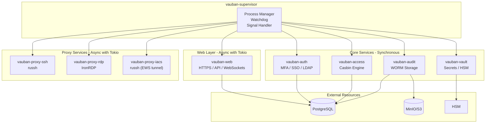

### 2.3 Minimalist Philosophy

**Only `vauban-web` and the proxy services (`vauban-proxy-ssh`, `vauban-proxy-rdp`, `vauban-proxy-iacs`) use Tokio** because they handle continuous bidirectional streams with multiple concurrent connections.

#### Why Proxies Use Tokio

The proxy services are fundamentally different from stateless services:

| Aspect | Stateless Services | Proxy Services |
|--------|-------------------|----------------|
| Pattern | Request/Response | Continuous bidirectional streams |
| Concurrency | 1 request = 1 response | N simultaneous sessions |
| Duration | Milliseconds | Minutes to hours |
| Sync complexity | Simple | Complex state machines |

Additional justifications for async proxies:
- **Pure Rust SSH**: `russh` is 100% Rust (memory-safe) vs `ssh2` which depends on libssh2 (C code)
- **Natural concurrency**: Managing N SSH sessions is natural with `async/await` and `tokio::select!`
- **Better auditability**: Pure Rust code is easier to audit for a security bastion

#### Synchronous Services

The other 5 services remain **synchronous and minimalist**:

- No async runtime (no Tokio, no async-std)
- Synchronous I/O with `poll(2)` or `kqueue(2)` on FreeBSD
- Minimal dependencies: `shared`, `libc`, `serde`, `tracing`
- Smaller binaries, reduced attack surface
- More predictable behavior for debugging

This applies to: `vauban-auth`, `vauban-access`, `vauban-vault`, `vauban-audit`, `vauban-supervisor`

---

## 3. Pipe Topology

### 3.1 Mesh Architecture

Services communicate directly via Unix pipes in a partial mesh topology. This avoids routing through the supervisor, maximizing performance.

### 3.2 Connection Matrix

| Source | Destination | Purpose |
|--------|-------------|---------|
| `web` | `auth` | User authentication, MFA |
| `web` | `access` | UI permission checks |
| `web` | `audit` | Audit log queries |
| `web` | `proxy-ssh` | SSH terminal data (bidirectional) |
| `web` | `proxy-rdp` | RDP session data (bidirectional) |
| `auth` | `access` | Role verification during auth |
| `auth` | `vault` | LDAP/OIDC credentials |
| `proxy-ssh` | `access` | Defense-in-depth RBAC re-check (`shared::access_guard`, see §3.5) |
| `proxy-ssh` | `vault` | SSH key injection |
| `proxy-ssh` | `audit` | Session recording |
| `proxy-rdp` | `access` | Defense-in-depth RBAC re-check (`shared::access_guard`, see §3.5) |
| `proxy-rdp` | `vault` | Windows credentials |
| `proxy-rdp` | `audit` | Video capture |
| `web` | `vault` | Encrypt/decrypt secrets |

**Total: 14 pipe pairs (28 file descriptors)**

### 3.3 Topology Diagram

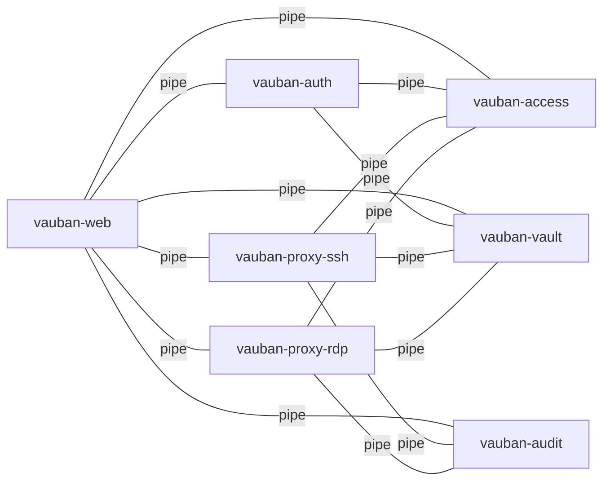

### 3.4 Pipe Creation

The supervisor creates all pipe pairs **before** forking child processes:

```rust
for conn in TOPOLOGY {
    let (from_channel, to_channel) = IpcChannel::pair()?;
    pipes.insert((conn.from, conn.to), (from_channel, to_channel));
}
```

### 3.5 Shared Defense-in-Depth Gate (`shared::access_guard`)

The `proxy-ssh -> access` and `proxy-rdp -> access` edges in the
matrix above are **not** consumed ad-hoc by each proxy. They are
funneled through a single shared, feature-gated module —
`shared::access_guard` — that every current and future proxy (VNC,
industrial protocols) MUST use to re-check authorization against
`vauban-access` before opening any upstream session, regardless of
any verdict already produced by `vauban-web`.

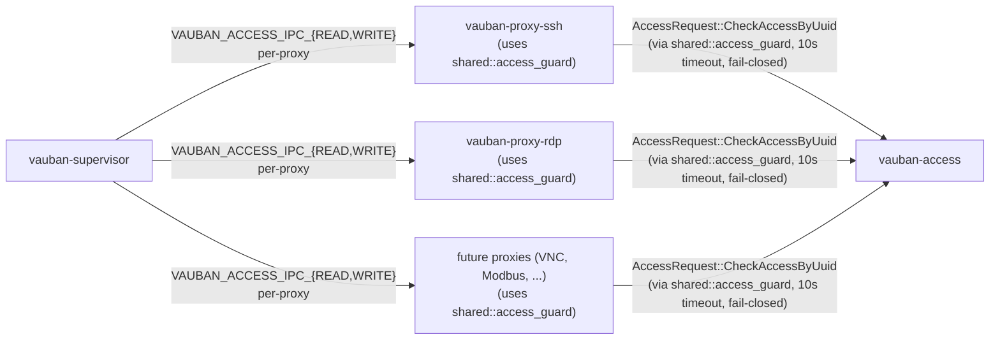

Key contracts owned by the module:

- **`AccessGuard::from_env(protocol, metrics)`** — fail-closed boot;
  refuses to start the proxy if `VAUBAN_ACCESS_IPC_{READ,WRITE}` are
  missing or invalid.
- **`AccessGuardWiring`** — `#[must_use]` bundle carrying the FDs to
  enrol in Capsicum and the `Arc<AccessGuard>` to share across
  per-session spawns.
- **`AccessGuard::spawn_dispatcher()`** — single background task that
  demultiplexes responses by `request_id` (with RAII cleanup of the
  pending map on every exit path: success, timeout, caller-cancel,
  send-error).
- **`AccessGuard::authorize(user_uuid, asset_uuid) -> AccessDecision`**
  — single hot-path entry point. NEVER returns `Result` (no `?`-fail-
  open). Hard 10 s timeout (`RBAC_RECHECK_TIMEOUT`). Increments
  exactly one of four metrics callbacks per call.
- **`AccessDecision`** — 4-variant enum (`Granted | Denied | Timeout |
  BackendError`) with **no `Default` impl** so a forgotten gate cannot
  silently authorize.

The full API, threat model, RAII pending-map fix, type-system
invariants, 30+ test inventory, and per-proxy wiring cookbook are
documented in
[Vauban_AccessGuard_Architecture_EN(1.0).md](Vauban_AccessGuard_Architecture_EN(1.0).md).
Operational triage of the `proxy-* <-> access` failure mode is in
[docs/runbooks/ipc_topology_debugging.md](../runbooks/ipc_topology_debugging.md).

---

## 4. IPC Protocol

### 4.1 Message Format

Messages are serialized using **bincode** for efficiency:

```
┌─────────────────┬─────────────────────────────────┐
│ Length (4 bytes)│ Serialized Message (bincode)    │
│ Little-endian   │ Variable length, max 256 KB     │
└─────────────────┴─────────────────────────────────┘
```

### 4.2 Message Types

```rust
pub enum Message {
    // Control messages (Supervisor <-> Services)
    Control(ControlMessage),

    // Authentication (Web -> Auth)
    AuthRequest { request_id, username, credential, source_ip },
    AuthResponse { request_id, result: AuthResult },
    MfaVerify { request_id, challenge_id, code },
    MfaVerifyResponse { request_id, success, session_id },

    // Password hashing (Web -> Auth)
    AuthVerifyPassword { request_id, password_hash, password: SensitiveString },
    AuthVerifyPasswordResponse { request_id, valid },
    AuthHashPassword { request_id, password: SensitiveString },
    AuthHashPasswordResponse { request_id, hash, error },

    // RBAC (Web/Auth/Proxy -> Access)
    RbacCheck { request_id, subject, object, action },
    RbacResponse { request_id, result: RbacResult },

    // Vault (Auth/Proxy -> Vault)
    VaultGetSecret { request_id, path },
    VaultSecretResponse { request_id, data },
    VaultGetCredential { request_id, asset_id, credential_type },
    VaultCredentialResponse { request_id, credential },

    // Vault Crypto (Any Service -> Vault)
    VaultEncrypt { request_id, domain, plaintext: SensitiveString },
    VaultEncryptResponse { request_id, ciphertext, error },
    VaultDecrypt { request_id, domain, ciphertext },
    VaultDecryptResponse { request_id, plaintext: Option<SensitiveString>, error },

    // Vault MFA (Web -> Vault)
    VaultMfaGenerate { request_id, username, issuer },
    VaultMfaGenerateResponse { request_id, encrypted_secret, plaintext_secret: Option<SensitiveString>, error },
    VaultMfaVerify { request_id, encrypted_secret, code },
    VaultMfaVerifyResponse { request_id, valid, error },
    VaultMfaGetSecret { request_id, encrypted_secret },
    VaultMfaGetSecretResponse { request_id, plaintext_secret: Option<SensitiveString>, error },

    // Audit (Web/Proxy -> Audit)
    AuditEvent { timestamp, event_type, user_id, session_id, source_ip, details },
    AuditAck { timestamp },
    SessionRecordingChunk { session_id, sequence, data },

    // SSH Session (Web <-> ProxySsh)
    SshSessionOpen { request_id, session_id, user_id, asset_id, asset_host, ... },
    SshSessionOpened { request_id, session_id, success, error },
    SshData { session_id, data },
    SshSessionClose { session_id },
    SshResize { session_id, cols, rows },

    // SSH Host Key (Web <-> ProxySsh)
    SshFetchHostKey { request_id, asset_host, asset_port },
    SshHostKeyResult { request_id, success, host_key, key_fingerprint, error },

    // RDP Session (Web <-> ProxyRdp)
    RdpSessionOpen { request_id, session_id, user_id, asset_id, asset_host, ... },
    RdpSessionOpened { request_id, session_id, success, desktop_width, desktop_height, error },
    RdpDisplayUpdate { session_id, x, y, width, height, png_data },
    RdpVideoFrame { session_id, timestamp_us, is_keyframe, width, height, data },
    RdpInput { session_id, input: RdpInputEvent },
    RdpResize { session_id, width, height },
    RdpDesktopResize { session_id, width, height },
    RdpSetVideoMode { session_id, enabled },
    RdpSessionClose { session_id },

    // RDP Recording (ProxyRdp -> Audit)
    RdpRecordingStart { session_id, width, height },
    RdpRecordingEnd { session_id },

    // SSH Recording (ProxySsh -> Audit)
    SshRecordingStart { session_id, width, height, asset_name, username },
    SshRecordingData { session_id, timestamp_us, event_type: SshRecordingEvent, data },
    SshRecordingEnd { session_id },

    // Recording File Brokering (Service -> Supervisor)
    RecordingFileRequest { request_id, session_id, relative_path, read_only },
    RecordingFileResponse { request_id, session_id, success, error },

    // ACME Certificate Management (Web <-> Supervisor)
    AcmeRenewRequest { request_id, directory_url, domains, email, ... },
    AcmeRenewResponse { request_id, success, error, cert_pem, key_pem: Option<SensitiveString> },
    AcmeChallengeInstall { request_id, domain, challenge_cert_der, challenge_key_der },
    AcmeChallengeRemove { request_id, domain },
    AcmeCertActivate { request_id, cert_pem, key_pem: SensitiveString },

    // TLS Certificate Provisioning (Supervisor -> Web)
    TlsCertProvision { cert_pem, key_pem: SensitiveString },

    // TCP Connection Brokering (Web -> Supervisor -> Proxy)
    TcpConnectRequest { request_id, session_id, host, port, target_service },
    TcpConnectResponse { request_id, session_id, success, error },

    // Access Control (Web <-> Access)
    AccessRequest { request_id, request: AccessRequest },
    AccessResponse { request_id, response: AccessResponse },

    // Admin Commands (Supervisor -> Services)
    AdminCommand { request_id, command: AdminCommand },
    AdminResponse { request_id, response: AdminResponse },
}
```

### 4.3 Control Messages

```rust
pub enum ControlMessage {
    Drain,                              // Stop accepting new requests
    DrainComplete { pending_requests }, // Service is idle
    Ping { seq },                       // Heartbeat request
    Pong { seq, stats },                // Heartbeat response
    Shutdown,                           // Immediate shutdown
}
```

### 4.4 File Descriptor Passing

For connection handoff (e.g., passing a client socket to a proxy), we use **SCM_RIGHTS**:

```rust
// Send a file descriptor over a Unix socket
pub fn send_fd(socket_fd: RawFd, fd_to_send: RawFd) -> Result<()>;

// Receive a file descriptor
pub fn recv_fd(socket_fd: RawFd) -> Result<OwnedFd>;
```

---

## 5. Capsicum Sandboxing

### 5.1 Overview

**Capsicum** is FreeBSD's capability-based security framework. After entering capability mode, a process can only access pre-opened file descriptors.

### 5.2 Sandbox Entry Sequence

Each service follows this pattern:

```rust
fn run_service() -> Result<()> {
    // 1. Get IPC file descriptors from environment
    let ipc_read_fd = env::var("VAUBAN_IPC_READ")?.parse()?;
    let ipc_write_fd = env::var("VAUBAN_IPC_WRITE")?.parse()?;
    
    // 2. Clear environment variables immediately
    env::remove_var("VAUBAN_IPC_READ");
    env::remove_var("VAUBAN_IPC_WRITE");
    
    // 3. Open ALL required resources BEFORE cap_enter()
    let db_conn = connect_to_database()?;
    
    // 4. Limit FD rights
    cap_rights_limit(ipc_read_fd, CAP_READ | CAP_EVENT)?;
    cap_rights_limit(ipc_write_fd, CAP_WRITE)?;
    cap_rights_limit(db_fd, CAP_READ | CAP_WRITE | CAP_CONNECT)?;
    
    // 5. ENTER CAPABILITY MODE (point of no return)
    cap_enter()?;
    
    // 6. Main loop - no new resources can be opened
    main_loop()
}
```

### 5.3 Capability Rights

| Resource | Rights |
|----------|--------|
| IPC read pipe (`CapRights::read_write`) | `CAP_READ`, `CAP_WRITE`, `CAP_FSTAT`, `CAP_EVENT` |
| IPC write pipe (`CapRights::read_write`) | `CAP_READ`, `CAP_WRITE`, `CAP_FSTAT`, `CAP_EVENT` |
| Database socket (`CapRights::tcp_connection`) | `CAP_READ`, `CAP_WRITE`, `CAP_EVENT`, `CAP_FSTAT`, `CAP_GETSOCKOPT`, `CAP_SETSOCKOPT`, `CAP_GETPEERNAME`, `CAP_GETSOCKNAME` |
| FD-receiver socket (`CapRights::fd_receiver_socket`) | `CAP_READ`, `CAP_EVENT`, `CAP_FSTAT`, `CAP_GETSOCKOPT` |
| Listening socket (`CapRights::listening_socket`) | `CAP_ACCEPT`, `CAP_LISTEN`, `CAP_EVENT`, `CAP_FCNTL`, `CAP_FSTAT`, `CAP_GETSOCKNAME`, `CAP_GETSOCKOPT`, `CAP_SETSOCKOPT`, **plus** `CAP_READ`, `CAP_WRITE`, `CAP_GETPEERNAME` (inherited by every accepted child fd, see §5.6.3c) |

> **CRITICAL (FreeBSD)**: `accept(2)` inherits the listening socket's
> cap-rights into every newly-accepted fd via `cap_rights_inherit()`.
> Therefore EVERY right that the eventual connected socket needs
> (read, write, getpeername, ...) MUST be set on the listening
> socket -- otherwise the very first `read()` / `write()` on the
> accepted fd fails with errno 93 ("Capabilities insufficient") and
> the application protocol stalls *before* the first byte is sent.
> macOS and Linux do not enforce these caps and therefore mask the
> regression in dev (production-bug repro on FreeBSD 14, May 2026,
> see runbook `iacs_ews_onboarding.md` v0.7.16). Pinned by
> `shared::capsicum::tests::test_cap_rights_listening_socket`.

### 5.4 Development Mode

On non-FreeBSD platforms (macOS, Linux), sandbox functions are no-ops with warnings:

```rust
#[cfg(not(target_os = "freebsd"))]
pub fn enter_capability_mode() -> Result<()> {
    tracing::warn!("Capsicum not available: running without sandbox");
    Ok(())
}
```

### 5.5 vauban-web Sandboxing

`vauban-web` is an async web server using Tokio and Axum. It requires special handling for Capsicum sandboxing due to its use of connection pools and multiplexed connections.

#### 5.5.1 Pre-sandbox Resource Acquisition

Before entering capability mode, vauban-web must:

1. **Bind the HTTPS listening socket** - Network namespace access required
2. **Load TLS certificates** - File system access required
3. **Pre-establish all database connections** - Fixed-size pool
4. **Initialize rate limiter** - In-memory, single-process (opens no socket)

```rust
// Simplified startup sequence
async fn main() -> Result<()> {
    // 1. Bind socket BEFORE sandbox
    let listener = TcpListener::bind(addr).await?;
    
    // 2. Load TLS configuration (opens certificate files)
    let tls_config = load_tls_config(&config).await?;
    
    // 3. Create fixed-size database pool (all connections pre-established)
    let db_pool = create_pool_sandboxed(&config)?;
    
    // 4. Create the in-memory rate limiter (no network, sandbox-safe)
    let rate_limiter = RateLimiter::in_memory();
    
    // 5. Enter sandbox
    enter_sandbox(&listener)?;
    
    // 6. Serve requests (no new FDs can be opened)
    serve(listener, tls_config, app).await
}
```

#### 5.5.2 Fixed-Size Database Pool

Unlike the standard dynamic pool, the sandboxed pool:

- Sets `max_size = min_idle` to pre-establish all connections
- Uses `test_on_check_out(true)` to detect dead connections
- Validates all connections at startup before `cap_enter()`

```rust
pub fn create_pool_sandboxed(config: &Config) -> AppResult<DbPool> {
    let pool_size = config.database.max_connections;
    
    Pool::builder()
        .max_size(pool_size)
        .min_idle(Some(pool_size))  // Pre-establish ALL connections
        .test_on_check_out(true)
        .build(manager)?
}
```

#### 5.5.3 Connection Loss Handling

If a database connection is lost after `cap_enter()`:

1. The health check endpoint (`/health`) returns 503 Service Unavailable
2. The service continues to operate with degraded functionality
3. If connection cannot be recovered, exit with code 100 for respawn

```rust
pub fn get_connection_or_exit(pool: &DbPool) -> DbConnection {
    match pool.get() {
        Ok(conn) => conn,
        Err(e) => {
            tracing::error!("DB connection lost in sandbox mode: {}", e);
            std::process::exit(100);  // Trigger supervisor respawn
        }
    }
}
```

#### 5.5.4 Sandboxed Services Summary

| Service | Sandboxed | Notes |
|---------|-----------|-------|
| `vauban-supervisor` | No | Needs to spawn/manage children |
| `vauban-web` | **Yes** | Fixed pool, in-memory rate limiter (no external cache; opens no socket), pre-bound listener + supervisor SCM_RIGHTS socket declared as a dedicated fd receiver (`WEB_KINDS = [Listener, FdReceiver]`; drives the OpenBSD `recvfd` promise) |
| `vauban-auth` | Yes | IPC + SCM_RIGHTS fd receiver (LDAPS broker) |
| `vauban-access` | Yes | IPC only (`ACCESS_KINDS = [IpcPipe]`); the PostgreSQL sockets are pre-opened by the service itself before the sandbox and intentionally not rights-limited per fd -- the wall is `cap_enter`/seccomp, no reconnection is possible |
| `vauban-vault` | Yes | IPC only (no DB, no network) |
| `vauban-audit` | Yes | IPC + SCM_RIGHTS socket declared as a dedicated fd receiver (`AUDIT_KINDS = [IpcPipe, FdReceiver]`; WORM segment / recording fds delegated by the supervisor) |
| `vauban-proxy-ssh` | Yes | IPC + pre-established connections via FD passing |
| `vauban-proxy-rdp` | Yes | IPC + pre-established connections via FD passing |
| `vauban-proxy-iacs` | Yes | IPC + pre-bound listening FD with `O_NONBLOCK` (`VAUBAN_IACS_LISTENER_FD`) + pre-loaded russh Ed25519 host key FD (`VAUBAN_IACS_HOST_KEY_FD`, rewound with `lseek(0)` before each `execv`) + per-asset upstream connections via SCM_RIGHTS broker. Boot ordering is Capsicum-aware (see §5.6.3c). |

### 5.6 TCP Connection Brokering for Sandboxed Proxies

#### 5.6.1 The Problem

After entering Capsicum capability mode, sandboxed processes cannot:

1. **Perform DNS resolution** - Requires access to `/etc/resolv.conf` and DNS servers
2. **Open new TCP connections** - Requires the `connect()` system call on new sockets

This creates a challenge for proxy services (`vauban-proxy-ssh`, `vauban-proxy-rdp`, `vauban-proxy-iacs`) that need to connect to target hosts on demand.

#### 5.6.2 The Solution: Supervisor-Brokered Connections

The supervisor acts as a **connection broker** for sandboxed proxies:

1. The supervisor remains outside the sandbox (never calls `cap_enter()`)
2. Proxies request TCP connections via IPC messages
3. The supervisor performs DNS resolution and TCP connect
4. The connected socket is passed to the proxy via **SCM_RIGHTS** over a Unix socket pair

This approach maintains the OpenSSH-style privilege separation model: sandboxed processes handle protocol logic while privileged operations (network access) remain in the supervisor.

> **Cryptographic gating of the broker.** Every `TcpConnectRequest` carries a short-lived, BLAKE3-keyed session token minted by `vauban-access`. Before any DNS resolution or `connect(2)`, the supervisor verifies the token against the `(host, port, target_service, session_id)` tuple actually being requested and rejects unverified or replayed tokens fail-closed. This prevents a compromised `vauban-web` from using the broker as an unauthenticated network probe inside the trusted side of the bastion. Token format, mint flow, key dissemination (via `VAUBAN_SESSION_TOKEN_KEY_*`), and the detailed threat-model argumentation live in [Vauban_AccessGuard_Architecture_EN(1.0).md §6](Vauban_AccessGuard_Architecture_EN(1.0).md#6-cryptographic-session-token-gate).

#### 5.6.3 Architecture Diagram (SSH)

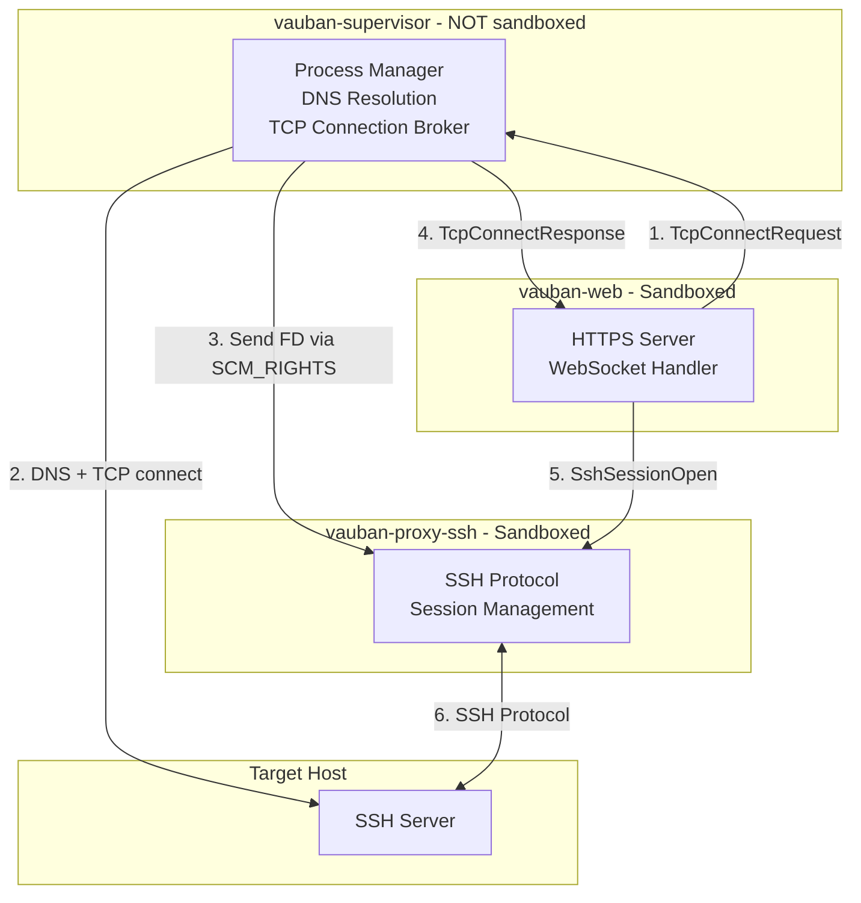

#### 5.6.3b Architecture Diagram (RDP)

The same brokering pattern applies to RDP sessions. The only differences are the `target_service` field (`ProxyRdp`) and the session open message (`RdpSessionOpen`).

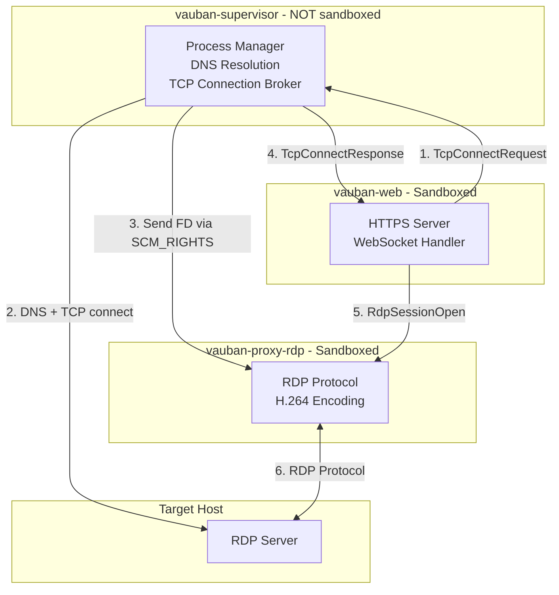

#### 5.6.3c Architecture Diagram (IACS / EWS tunnel)

`vauban-proxy-iacs` is the third sandboxed proxy. Compared to SSH and RDP it has THREE additional FD-passing seams plus a strict Capsicum-aware boot ordering:

1. **Pre-bound listening FD (`VAUBAN_IACS_LISTENER_FD`).** The proxy is EWS-facing and accepts inbound `russh` sshd connections; under Capsicum it cannot call `bind(2)`. The supervisor binds `industrial.iacs_tunnel.bind_addr` BEFORE the proxy is forked, **sets `O_NONBLOCK` on the listener while still pre-Capsicum** (the flag lives on the kernel file table entry and is inherited across `fork+execv`; calling `set_nonblocking` later from the proxy would issue `ioctl(FIONBIO)` post-`cap_enter` and fail with errno 93 because the inherited fd lacks `CAP_IOCTL`), and exports the listener FD via the `VAUBAN_IACS_LISTENER_FD` environment variable. The proxy's `main.rs` reads that FD, calls `setup_service_sandbox_with_listeners` which grants the listener `CapRights::listening_socket()` -- including the `CAP_READ` / `CAP_WRITE` / `CAP_GETPEERNAME` rights propagated by `accept()` to every connected child fd (§5.3) -- and then enters Capsicum.
2. **Pre-loaded sshd host key FD (`VAUBAN_IACS_HOST_KEY_FD`).** The russh server requires an OpenSSH-encoded Ed25519 host key; under Capsicum the proxy cannot `open(2)` an absolute path (errno 94). The supervisor calls `shared::iacs_host_key::prepare_host_key_fd(host_key_path)` at boot (load-or-generate with mode 0600, then `OpenOptions::new().read(true).open(path)`) and exports the resulting read-only FD via `VAUBAN_IACS_HOST_KEY_FD`. The proxy consumes it (single-shot `read_to_string` + `PrivateKey::from_openssh`) BEFORE entering Capsicum, then drops the FD. The supervisor calls `lseek(fd, 0, SEEK_SET)` BEFORE every `execv` of `proxy_iacs` (boot, `respawn_service`, and `kill_and_respawn`) because the kernel keeps the file position cursor on the file table entry shared between supervisor and forked children -- without this rewind, every respawn after the first crash-loops on `PEM preamble contains invalid data (NUL byte)` (the second proxy reads from EOF). The PEM blob is `zeroize()`d on both supervisor and proxy sides as soon as `PrivateKey` is parsed.
3. **Per-asset upstream connections.** Once an EWS opens a `direct-tcpip` channel to its asset's pinned `(asset.hostname, asset.port)`, the proxy's `SupervisorBrokerOpener` emits a `TcpConnectRequest` tagged with `target_service = ProxyIacs` and the session-bound BLAKE3 token. The supervisor enforces TWO anti-SSRF guards specific to IACS:
   - **Anti-self-listener**: a request whose target equals the IACS sshd's own listening address is rejected.
   - **Anti-loopback**: targets that resolve to a loopback IP (`127.0.0.0/8`, `::1`) are rejected unless `industrial.iacs_tunnel.allow_loopback_targets = true` (CI-only knob).

##### Boot ordering (Capsicum-aware)

The proxy's `main.rs` strictly orders pre- and post-`cap_enter` work:

1. Read FDs and env knobs.
2. Initialise the BLAKE3 session-token MAC key.
3. Wire `AccessGuard::from_env` (defense-in-depth RBAC re-check).
4. Open the audit IPC channel.
5. **Drain the host key FD via `read_host_key_from_fd`** (single-shot read; FD closed before sandbox).
6. **Construct both `AsyncIpcChannel` instances** (`supervisor_channel`, `web_channel`). `AsyncIpcChannel::new` calls `set_nonblocking(read_fd)` -- a `fcntl(F_GETFL/F_SETFL)`. The IPC pipe FDs receive `CapRights::read_write()` from the sandbox, and that cap-set deliberately omits `CAP_FCNTL`; the wrapping MUST therefore happen pre-`cap_enter`. The non-blocking flag lives on the file table entry and survives the sandbox transition. (Mirrors the long-standing `vauban-proxy-ssh::main` ordering. Pinned by `iacs_async_ipc_channels_constructed_before_capsicum`.)
7. Call `setup_service_sandbox_with_listeners(ipc_fds, None, fd_receiver_fds, listener_fds)` and enter Capsicum.
8. Spawn the russh accept loop on the inherited listener FD (no `set_nonblocking` here -- the supervisor already set it).
9. Spawn the `AccessGuard` dispatcher.
10. Spawn the supervisor / web pipe writer tasks (consume the `mpsc::UnboundedReceiver`s drained by the russh handlers).
11. Enter the main IPC event loop.

Each step is pinned by source-grep tests in `vauban-proxy-iacs/tests/host_key_loaded_before_capsicum_test.rs` and `vauban-supervisor/tests/iacs_listener_pre_bind_test.rs`.

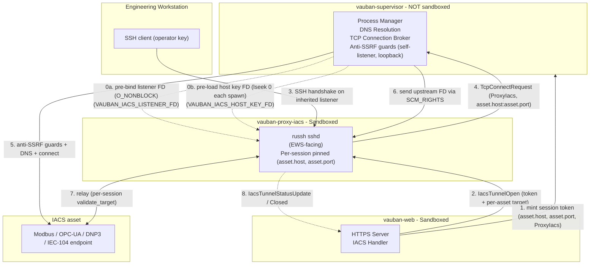

The per-asset target is pinned ONCE at session creation time inside `vauban-web`'s IACS handler (using `asset.hostname:asset.port`) and travels end-to-end as the BLAKE3 token's `(host, port)` binding plus the `IacsTunnelOpenRequest` `asset_host` / `asset_port` fields. The proxy enforces the same target on every `direct-tcpip` open via `relay::validate_target`. Cross-asset swap (e.g. EWS asks for `10.0.0.2:502` while the session was minted for `10.0.0.1:502`) is rejected at the proxy layer; cross-protocol replay (a token minted for `ssh` accepted on `iacs_tunnel`) is rejected at the cryptographic gate.

#### 5.6.4 File Descriptor Passing with SCM_RIGHTS

Unix sockets support passing file descriptors between processes using the `SCM_RIGHTS` control message type. This mechanism allows the supervisor to:

1. Create a TCP connection to the target host
2. Send the connected socket's file descriptor to the proxy
3. The proxy receives a fully functional TCP connection without ever calling `connect()`

The flow is identical for both SSH and RDP proxies. The only difference is the `target_service` field in the request and the session open message that follows (`SshSessionOpen` vs `RdpSessionOpen`).

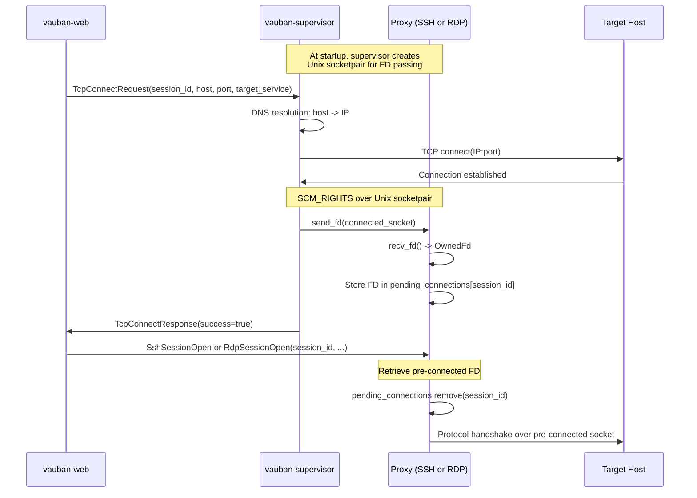

#### 5.6.5 Unix Socketpair for FD Passing

Standard Unix pipes do not support `SCM_RIGHTS`. A dedicated Unix socket pair is created for file descriptor passing:

```rust
// Create socketpair at service spawn time
let (supervisor_socket, proxy_socket) = socketpair(
    AddressFamily::Unix,
    SockType::Stream,
    None,
    SockFlag::empty()
)?;

// Pass proxy_socket to the child via environment variable
env::set_var("VAUBAN_FD_PASSING_SOCKET", proxy_socket.as_raw_fd().to_string());

// Supervisor keeps supervisor_socket for sending FDs
// One socketpair per proxy service
fd_passing_sockets.insert(Service::ProxySsh, supervisor_socket);
// fd_passing_sockets.insert(Service::ProxyRdp, supervisor_socket_rdp);
```

#### 5.6.6 Message Types

```rust
// Request supervisor to establish a TCP connection
TcpConnectRequest {
    request_id: u64,
    session_id: String,    // Correlates FD with subsequent SshSessionOpen
    host: String,          // Hostname (DNS resolved by supervisor)
    port: u16,
    target_service: Service,  // ProxySsh or ProxyRdp
}

// Response after connection attempt
TcpConnectResponse {
    request_id: u64,
    session_id: String,
    success: bool,
    error: Option<String>,  // DNS failure, connection refused, etc.
}
```

#### 5.6.7 Capsicum Rights for FD Receiver Socket

The Unix socket used to receive file descriptors has minimal capabilities:

| Capability | Purpose |
|------------|---------|
| `CAP_READ` | Receive data and `SCM_RIGHTS` messages |
| `CAP_EVENT` | Poll/kqueue for async I/O |
| `CAP_FSTAT` | Socket status checks |
| `CAP_GETSOCKOPT` | Socket option queries |

The socket does **not** have `CAP_WRITE`, `CAP_CONNECT`, or `CAP_ACCEPT` since it only receives.

#### 5.6.8 Development Mode (macOS/Linux)

On platforms without Capsicum, proxies can still open connections directly. Both SSH and RDP proxies implement the same dual-path pattern:

```rust
// SSH proxy: fallback to direct connect
let session = if let Some(fd) = config.preconnected_fd {
    let stream = TcpStream::from_std(unsafe { 
        std::net::TcpStream::from_raw_fd(fd.into_raw_fd()) 
    })?;
    client::connect_stream(ssh_config, stream, handler).await?
} else {
    client::connect(ssh_config, addr, handler).await?
};

// RDP proxy: same pattern
let stream = if let Some(fd) = config.preconnected_fd {
    let std_stream = unsafe { std::net::TcpStream::from_raw_fd(fd.into_raw_fd()) };
    std_stream.set_nonblocking(true)?;
    TcpStream::from_std(std_stream)?
} else {
    // DNS resolution + TcpStream::connect (only works outside sandbox)
    TcpStream::connect(server_addr).await?
};
```

#### 5.6.9 Error Handling

| Error Condition | Handling |
|----------------|----------|
| DNS resolution failure | Return error in `TcpConnectResponse` |
| Connection refused | Return error in `TcpConnectResponse` |
| Connection timeout | Return error in `TcpConnectResponse` |
| FD passing failure | Log error, return failure in response |
| Session ID mismatch | Log warning, ignore orphaned FD |

#### 5.6.10 Security Benefits

1. **Complete Network Isolation**: Sandboxed proxies have zero network capabilities
2. **Controlled DNS**: Only supervisor can resolve hostnames (prevents DNS-based attacks)
3. **Connection Validation**: Supervisor can validate target hosts before connecting
4. **Audit Trail**: All connection requests pass through supervisor (loggable)
5. **Rate Limiting**: Supervisor can limit connection attempts per session/user

---

## 6. Database Connections

### 6.1 Database Access per Service

Only two services maintain direct database connections. All other services operate exclusively via IPC.

| Service | Database Access | Method |
|---------|----------------|--------|
| `vauban-web` | **Direct** (Diesel, connection pool) | Manages users, assets, sessions, groups |
| `vauban-access` | **Direct** (Diesel, optional) | Manages access rules, groups, asset groups |
| `vauban-supervisor` | **Direct** (Diesel, admin commands only) | CLI operations: create-superuser, seed-data, migrate-secrets |
| `vauban-auth` | None | Password hashing and MFA via IPC (Web -> Auth) |
| `vauban-vault` | None | Key management in memory, no DB, no network |
| `vauban-audit` | None | Recording files via FD passing from supervisor |

All services share a single PostgreSQL user (`vauban`) and the `public` schema. A single `[database]` section in the configuration provides the connection URL.

### 6.2 Connection Resilience

After `cap_enter()`, new connections cannot be opened. If a database connection fails:

1. The service logs the error
2. The service exits with code 100 (special "respawn me" code)
3. The supervisor detects the exit and respawns the service
4. The new service opens a fresh connection

```rust
pub fn get_connection_or_exit(pool: &DbPool) -> DbConnection {
    match pool.get() {
        Ok(conn) => conn,
        Err(e) => {
            tracing::error!("DB connection lost in sandbox mode: {}", e);
            std::process::exit(100);  // Trigger supervisor respawn
        }
    }
}
```

---

## 7. Supervisor and Watchdog

### 7.1 Responsibilities

The `vauban-supervisor` is responsible for:

1. **Pipe Creation**: Creates all 14 pipe pairs before forking
2. **Process Spawning**: Forks and execs child processes with proper privileges
3. **Privilege Dropping**: Children drop to unprivileged users
4. **Watchdog**: Monitors children with bidirectional heartbeat
5. **Respawning**: Restarts crashed children (with rate limiting)
6. **Signal Handling**: Graceful restart on SIGHUP, shutdown on SIGTERM

### 7.2 Heartbeat Protocol

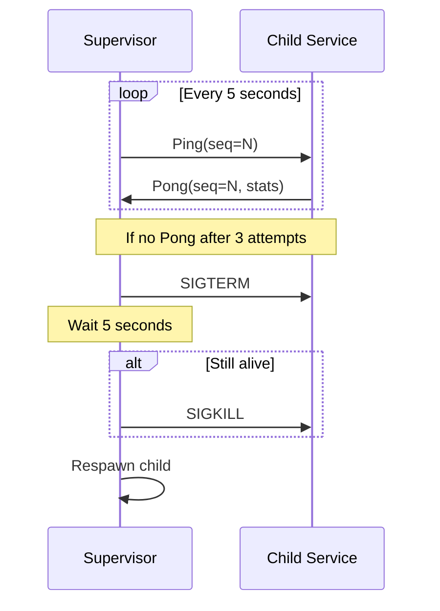

### 7.3 Service Statistics

Each Pong message includes service health metrics:

```rust
pub struct ServiceStats {
    pub uptime_secs: u64,
    pub requests_processed: u64,
    pub requests_failed: u64,
    pub active_connections: u32,
    pub pending_requests: u32,
}
```

### 7.4 Respawn Rate Limiting

To prevent crash loops, the supervisor limits respawns:

- Maximum 10 respawns per hour per service
- After exceeding the limit, the service enters degraded mode
- Manual intervention required

### 7.5 Linked Restart Groups

Services that share inter-process pipes (e.g., `vauban-web` and `vauban-proxy-ssh`) form **linked restart groups**. When any service in a group crashes, the anonymous Unix pipe connecting them becomes broken. Since new file descriptors cannot be created after `cap_enter()`, all services in the group must be restarted together to re-establish communication.

#### 7.5.1 Linked Groups

| Group | Services | Shared Pipes |
|-------|----------|--------------|
| SSH Group | `web`, `proxy-ssh` | Terminal data stream |
| RDP Group | `web`, `proxy-rdp` | Session data stream |

#### 7.5.2 Group Restart Sequence

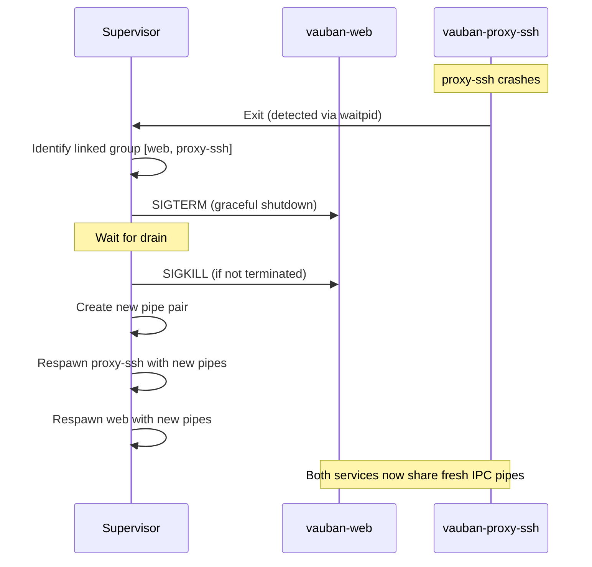

#### 7.5.3 Benefits

- **Automatic Recovery**: No manual intervention needed when a linked service crashes
- **Clean State**: Both services start fresh with new pipe connections
- **No Stale Connections**: Eliminates "broken pipe" errors on the surviving service

---

## 8. Supervisor Configuration

### 8.1 Configuration Files

The supervisor is configured via TOML files, supporting two modes:

| Mode | Description | Privilege Separation |
|------|-------------|---------------------|
| Development | All services run as current user | `privsep = false` |
| Production | Each service has dedicated UID/GID | `privsep = true` (default) |

Configuration directory lookup order:
1. `VAUBAN_CONFIG_DIR` environment variable (if set)
2. Workspace root `config/` directory (via `CARGO_MANIFEST_DIR`)
3. `/usr/local/etc/vauban/` (FreeBSD system path)

In development, files are layered: `default.toml` + `development.toml` (overrides). In production, `vauban.conf` is a single self-contained file.

### 8.2 Development Configuration

Top-level fields (`environment`, `bin_path`) are at the TOML root. Watchdog settings are directly in `[supervisor]` (no sub-section).

```toml
# config/default.toml (base values)
environment = "development"
bin_path = "./target/debug"

[supervisor]
privsep = false
heartbeat_interval_secs = 5
heartbeat_timeout_secs = 2
max_missed_heartbeats = 3
max_respawns_per_hour = 10
drain_timeout_secs = 30

[services.audit]
name = "vauban-audit"
binary = "vauban-audit"

[services.vault]
name = "vauban-vault"
binary = "vauban-vault"

# ... other services (access, auth, proxy_ssh, proxy_rdp, web)

[logging]
level = "info"
format = "text"
```

The `development.toml` overlay overrides only what differs:

```toml
# config/development.toml
environment = "development"
bin_path = "./target/debug"

[supervisor]
privsep = false

[logging]
level = "debug"
```

### 8.3 Production Configuration

```toml
# /usr/local/etc/vauban/vauban.conf (self-contained)
bin_path = "/usr/local/libexec/vauban"

[supervisor]
heartbeat_interval_secs = 5
heartbeat_timeout_secs = 2
max_missed_heartbeats = 3
max_respawns_per_hour = 10
drain_timeout_secs = 30

[services.audit]
name = "vauban-audit"
binary = "vauban-audit"
uid = 901
gid = 901

[services.vault]
name = "vauban-vault"
binary = "vauban-vault"
uid = 902
gid = 902

[services.access]
name = "vauban-access"
binary = "vauban-access"
uid = 903
gid = 903

[services.auth]
name = "vauban-auth"
binary = "vauban-auth"
uid = 904
gid = 904

[services.proxy_ssh]
name = "vauban-proxy-ssh"
binary = "vauban-proxy-ssh"
uid = 905
gid = 905

[services.proxy_rdp]
name = "vauban-proxy-rdp"
binary = "vauban-proxy-rdp"
uid = 906
gid = 906

[services.web]
name = "vauban-web"
binary = "vauban-web"
uid = 907
gid = 907
```

### 8.4 FreeBSD User/Group Setup

On FreeBSD production systems, create dedicated users:

```sh
# Create users and groups for each service
for svc in audit vault access auth proxy-ssh proxy-rdp web; do
    case $svc in
        audit)     id=901 ;;
        vault)     id=902 ;;
        access)    id=903 ;;
        auth)      id=904 ;;
        proxy-ssh) id=905 ;;
        proxy-rdp) id=906 ;;
        web)       id=907 ;;
    esac
    pw groupadd -n vauban_${svc//-/_} -g $id
    pw useradd -n vauban_${svc//-/_} -u $id -g $id \
        -d /nonexistent -s /usr/sbin/nologin \
        -c "Vauban $svc service"
done

# Create working directories
mkdir -p /var/vauban/{audit,vault,access,auth,proxy-ssh,proxy-rdp,web}
chown -R vauban_audit:vauban_audit /var/vauban/audit
# ... repeat for each service
```

---

## 9. Graceful Restart

### 9.1 No Hot-Reload Policy

Configuration changes require a full graceful restart. Hot-reload is avoided because:

- Increased complexity and attack surface
- Risk of inconsistent state during transitions
- Difficult to audit and debug

### 9.2 Restart Sequence

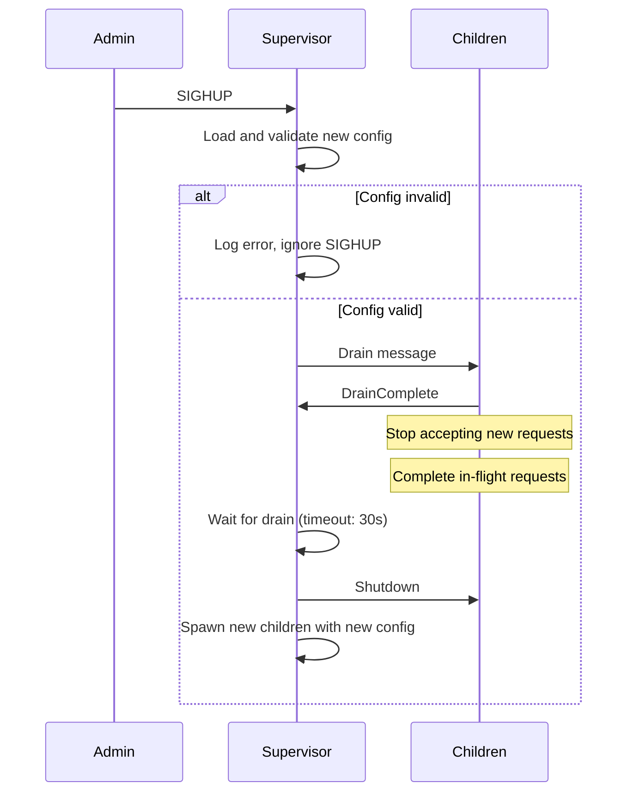

### 9.3 Drain Behavior

- **vauban-web**: Stops accepting new HTTP connections, completes pending requests
- **vauban-proxy-ssh/rdp**: Stops accepting new sessions, waits for active sessions to complete
- **Other services**: Immediately report DrainComplete (stateless)

---

## 10. Startup Sequence

### 10.1 Boot Order

Services are started in dependency order:

1. `vauban-audit` - No dependencies
2. `vauban-vault` - No internal dependencies
3. `vauban-access` - No internal dependencies
4. `vauban-auth` - Depends on access, vault
5. `vauban-proxy-ssh` - Depends on access, vault, audit
6. `vauban-proxy-rdp` - Depends on access, vault, audit
7. `vauban-proxy-iacs` - Depends on access, audit (gated on `industrial.enabled`; the supervisor pre-binds the IACS sshd listener FD with `O_NONBLOCK` and pre-loads the russh Ed25519 host key FD before fork; both FDs are inherited via `VAUBAN_IACS_LISTENER_FD` / `VAUBAN_IACS_HOST_KEY_FD`)
8. `vauban-web` - Depends on auth, access, vault, audit

### 10.2 Startup Diagram

```mermaid
gantt
    title Service Startup Sequence
    dateFormat X
    axisFormat %s

    section Phase 1
    vauban-supervisor     :0, 1
    
    section Phase 2
    vauban-audit          :1, 2
    vauban-vault          :1, 2
    vauban-access           :1, 2
    
    section Phase 3
    vauban-auth           :2, 3
    
    section Phase 4
    vauban-proxy-ssh      :3, 4
    vauban-proxy-rdp      :3, 4
    vauban-proxy-iacs     :3, 4
    
    section Phase 5
    vauban-web            :4, 5
```

### 10.3 FreeBSD rc.d Integration

The supervisor integrates with FreeBSD's rc.d system:

```sh
#!/bin/sh
# /usr/local/etc/rc.d/vauban

. /etc/rc.subr

name="vauban"
rcvar="vauban_enable"
command="/usr/local/bin/vauban-supervisor"
pidfile="/var/run/vauban.pid"

load_rc_config $name
run_rc_command "$1"
```

---

## 11. Architecture Decisions

### 11.1 Summary of Key Decisions

| Decision | Choice | Rationale |
|----------|--------|-----------|
| IPC Mechanism | Unix Pipes | Maximum performance, no network exposure |
| Sandboxing | Capsicum | FreeBSD native, proven security model |
| Async Runtime | Tokio (web + proxies) | Required for bidirectional streams |
| Configuration Reload | Graceful restart | Simpler, more auditable |
| Database Connections | Separate per service | Principle of least privilege |
| Heartbeat | Bidirectional | Reliable failure detection |
| Process Manager | Custom supervisor | FreeBSD integration, full control |
| Linked Restarts | Group-based | Automatic IPC pipe recovery |

### 11.2 Security Benefits

1. **Privilege Separation**: Each service runs as a different unprivileged user
2. **Capability-Based Sandboxing**: Capsicum limits what each process can do
3. **No Network Between Services**: Pipes cannot be accessed remotely
4. **Minimal Dependencies**: Reduced attack surface
5. **Separate Database Users**: Compromised service has limited database access

### 11.3 Performance Benefits

1. **Zero Network Overhead**: No TCP/TLS between services
2. **Efficient Serialization**: bincode is faster than Protobuf
3. **Direct Communication**: No routing through supervisor
4. **Synchronous Services**: Predictable latency, no async overhead

### 11.4 Operational Benefits

1. **Single Machine Deployment**: Simplified operations for appliance model
2. **Automatic Recovery**: Supervisor respawns crashed services
3. **Graceful Upgrades**: SIGHUP triggers controlled restart
4. **Health Monitoring**: Built-in heartbeat and statistics

---

## Appendix A: Workspace Structure

```
/Users/mnemonic/Code/Vauban/
├── Cargo.toml                    # Workspace root
├── shared/                       # Shared IPC library
│   ├── Cargo.toml
│   └── src/
│       ├── lib.rs
│       ├── messages.rs           # IPC message types
│       ├── ipc.rs                # Pipe utilities, SCM_RIGHTS
│       └── capsicum.rs           # Capsicum wrappers
├── vauban-db/                    # Shared Diesel schema, migrations
│   ├── Cargo.toml
│   ├── diesel.toml
│   ├── migrations/
│   └── src/
│       ├── lib.rs
│       └── schema.rs             # Diesel table! macros (single source of truth)
├── vauban-supervisor/            # Process manager
│   ├── Cargo.toml
│   └── src/
│       ├── main.rs               # Supervisor, watchdog, signal handling
│       ├── config.rs             # Configuration loading and structs
│       ├── admin.rs              # CLI admin commands (create-superuser, seed-data, etc.)
│       └── acme.rs               # ACME certificate renewal logic
├── vauban-web/                   # Web interface (Tokio)
│   ├── Cargo.toml
│   └── src/                      # ~125 source files (handlers, IPC, middleware, models, etc.)
│       ├── main.rs
│       └── lib.rs
├── vauban-auth/                  # Authentication (Argon2id hashing)
├── vauban-access/                # RBAC (Casbin) + instance-level access rules
├── vauban-vault/                 # Secrets management (in-memory keys, no DB)
├── vauban-audit/                 # Audit logging, session recording
├── vauban-proxy-ssh/             # SSH proxy (russh)
├── vauban-proxy-rdp/             # RDP proxy (IronRDP, H.264)
└── config/                       # TOML configuration files
```

---

## Appendix B: Message Flow Examples

### B.1 User Login Flow

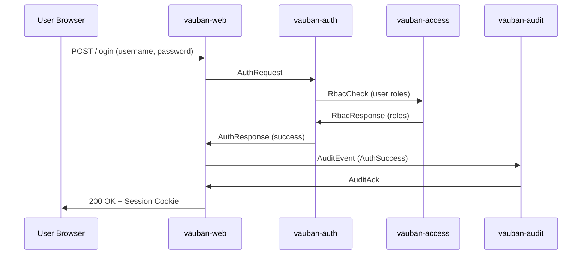

### B.2 SSH Session Flow (Web Terminal)

This diagram shows the complete flow including TCP connection brokering for sandboxed proxies:

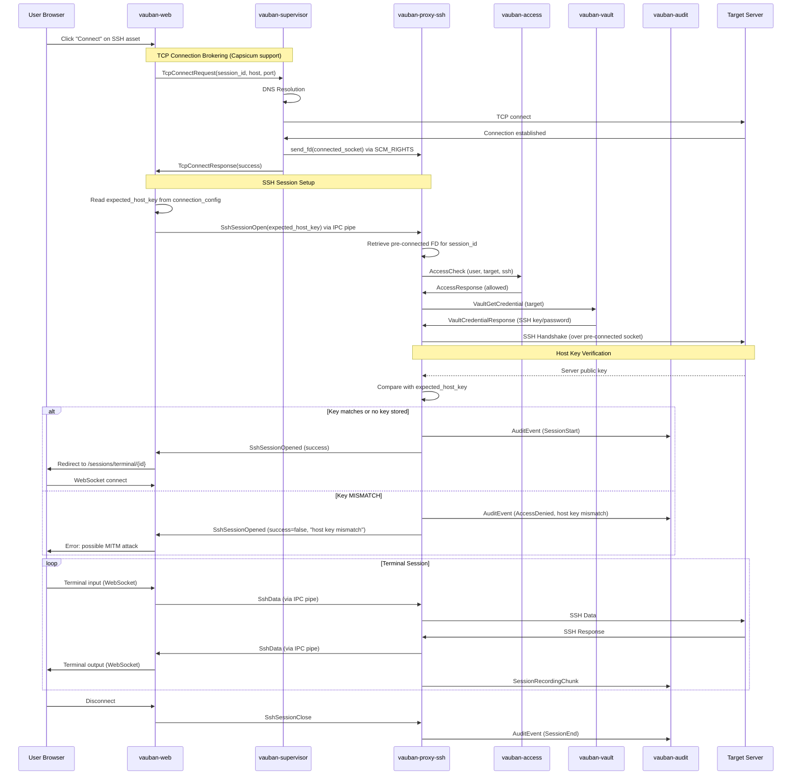

#### B.2.1 SSH Host Key Fetch Flow

This diagram shows the optional flow for retrieving and storing a server's SSH host key
(triggered from the asset detail page via the "Fetch Host Key" button):

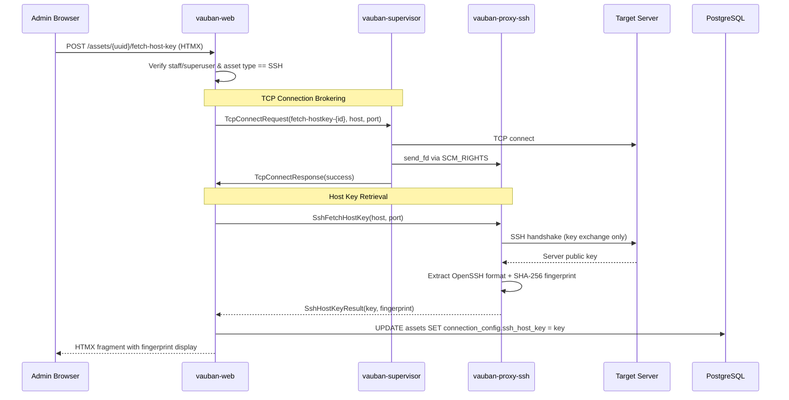

### B.3 RDP Session Flow (Desktop Viewer)

This diagram shows the complete RDP session flow including TCP connection brokering, H.264 video streaming, and input forwarding. For the full RDP implementation details, see [Vauban_RDP_Architecture_EN(1.0).md](Vauban_RDP_Architecture_EN(1.0).md).

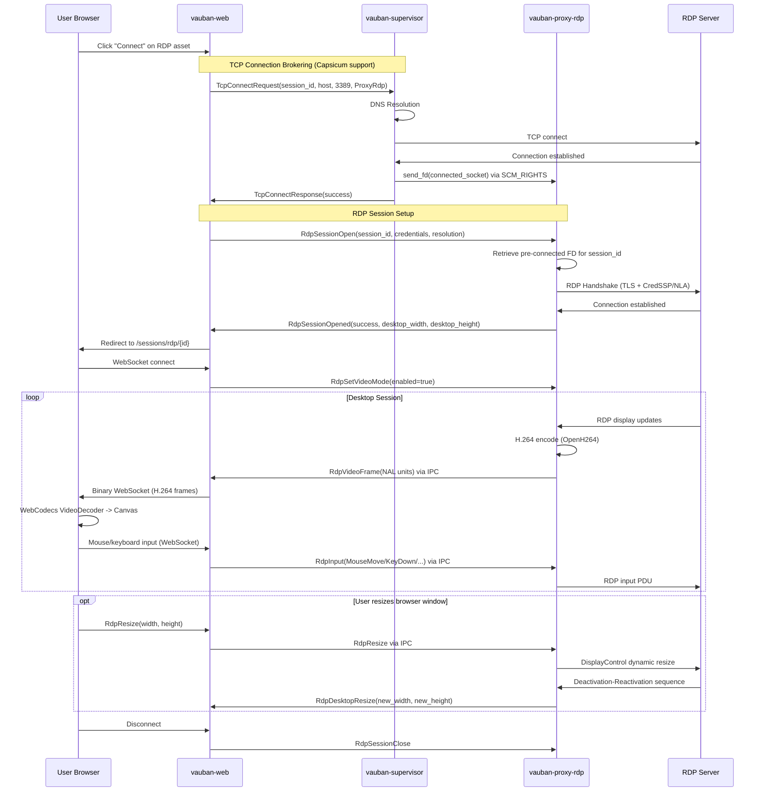

---
