# Vauban RDP Session Architecture

**Version:** 1.0  
**Date:** 21 February 2026  
**Author:** Richard Ben Aleya

---

## Table of Contents

1. [Introduction](#1-introduction)
2. [Architecture Overview](#2-architecture-overview)
3. [RDP Protocol Stack](#3-rdp-protocol-stack)
4. [Session Lifecycle](#4-session-lifecycle)
5. [H.264 Video Streaming](#5-h264-video-streaming)
6. [Input Pipeline](#6-input-pipeline)
7. [Dynamic Resolution](#7-dynamic-resolution)
8. [IPC Protocol](#8-ipc-protocol)
9. [WebSocket Protocol](#9-websocket-protocol)
10. [Frontend Client](#10-frontend-client)
11. [Security Design](#11-security-design)
12. [Testing Strategy](#12-testing-strategy)
13. [Architecture Decisions](#13-architecture-decisions)

---

## 1. Introduction

### 1.1 Background

Vauban provides secure access to both SSH and RDP targets. While SSH sessions stream terminal text over WebSockets, RDP sessions require proxying a graphical desktop -- a fundamentally different challenge involving bitmap rendering, video encoding, and low-latency input forwarding.

### 1.2 Design Goals

| Goal | Approach |
|------|----------|
| Real-time desktop rendering | H.264 video encoding at 60 FPS with WebCodecs decoding |
| Low-latency input | Throttled mouse events (30 Hz), instant keyboard forwarding |
| Dynamic resolution | RDP Display Control channel for fullscreen adaptation |
| Minimal bandwidth | H.264 at 5 Mbps default, configurable per deployment |
| Security | Capsicum sandbox, supervisor-injected configuration, credential isolation |
| Pure Rust | IronRDP (async), OpenH264 (software encoding), no C dependencies in protocol layer |

### 1.3 Scope

This document covers the internal architecture of the RDP session subsystem spanning three crates: `vauban-proxy-rdp` (RDP protocol and encoding), `vauban-web` (WebSocket relay and IPC client), and the frontend Alpine.js component (canvas rendering and input capture). It is a companion to the [Privilege Separation Architecture](Vauban_Privsep_Architecture_EN(1.1).md) which describes the overall system design.

---

## 2. Architecture Overview

### 2.1 Component Diagram

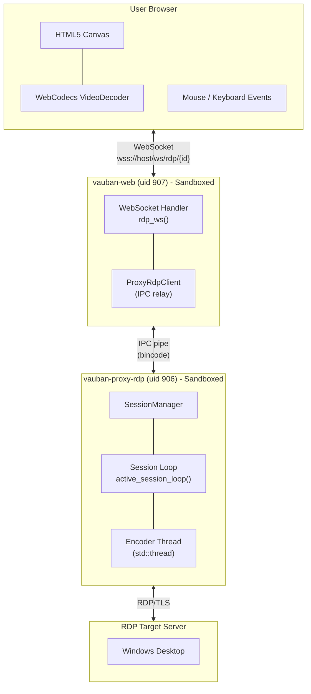

### 2.2 Module Structure

```
vauban-proxy-rdp/
├── Cargo.toml
└── src/
    ├── main.rs              # Entry point, IPC dispatcher, sandbox setup
    ├── session.rs           # RDP connection, active session loop, PNG/H.264 encoding
    ├── session_manager.rs   # Thread-safe session registry
    ├── video_encoder.rs     # H.264 encoding via OpenH264
    ├── ipc.rs               # Async IPC wrapper (AsyncFd)
    └── error.rs             # SessionError, IpcError

vauban-web/src/
├── ipc/proxy_rdp.rs         # ProxyRdpClient (IPC to proxy)
└── handlers/websocket.rs    # rdp_ws() WebSocket handler

vauban-web/static/js/
└── vauban-components.js     # rdpViewer Alpine.js component
```

### 2.3 Dependencies

`vauban-proxy-rdp` uses a focused set of dependencies:

| Crate | Purpose |
|-------|---------|
| `ironrdp` | Pure Rust RDP client (connector, session, graphics, input, display control) |
| `ironrdp-tokio` | Async RDP framing over Tokio |
| `ironrdp-tls` / `tokio-rustls` | TLS for RDP (CredSSP, NLA) |
| `openh264` | H.264 software encoding (Baseline profile) |
| `image` | PNG encoding for fallback bitmap regions |
| `tokio` | Async runtime (multi-thread) |
| `shared` | IPC channel, messages, Capsicum stubs |
| `secrecy` | Zeroize-on-drop for RDP credentials |

---

## 3. RDP Protocol Stack

### 3.1 Connection Sequence

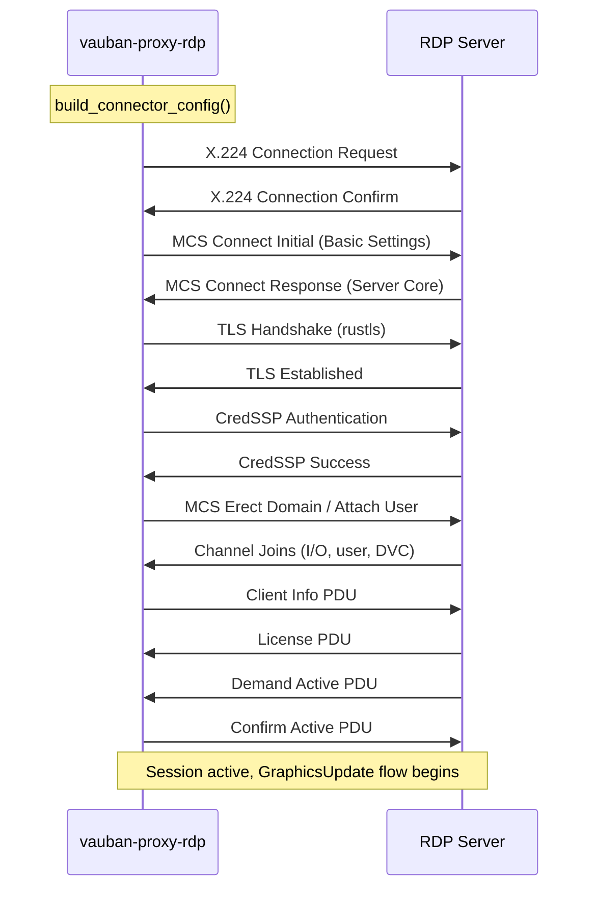

### 3.2 Connector Configuration

The RDP connector is configured for maximum compatibility with Windows servers:

| Parameter | Value | Rationale |
|-----------|-------|-----------|
| Color depth | 32-bit (RGBx) | Best quality; server may downgrade to 16-bit |
| Bitmap compression | Lossy enabled | Reduces bandwidth for bitmap regions |
| Keyboard layout | US (0x0409) | Standard layout; keys mapped by scancode |
| Performance flags | Disable wallpaper, themes, animations | Reduces unnecessary graphics updates |
| Dynamic Virtual Channels | DrdynvcClient + DisplayControlClient | Required for runtime resolution changes |
| Pointer rendering | Software (client-side) | More responsive cursor tracking |

### 3.3 Graphics Pipeline

The RDP server sends display updates in two forms, both handled by `active_session_loop`:

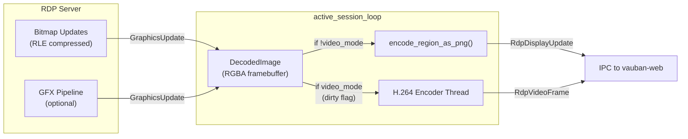

---

## 4. Session Lifecycle

### 4.1 End-to-End Flow

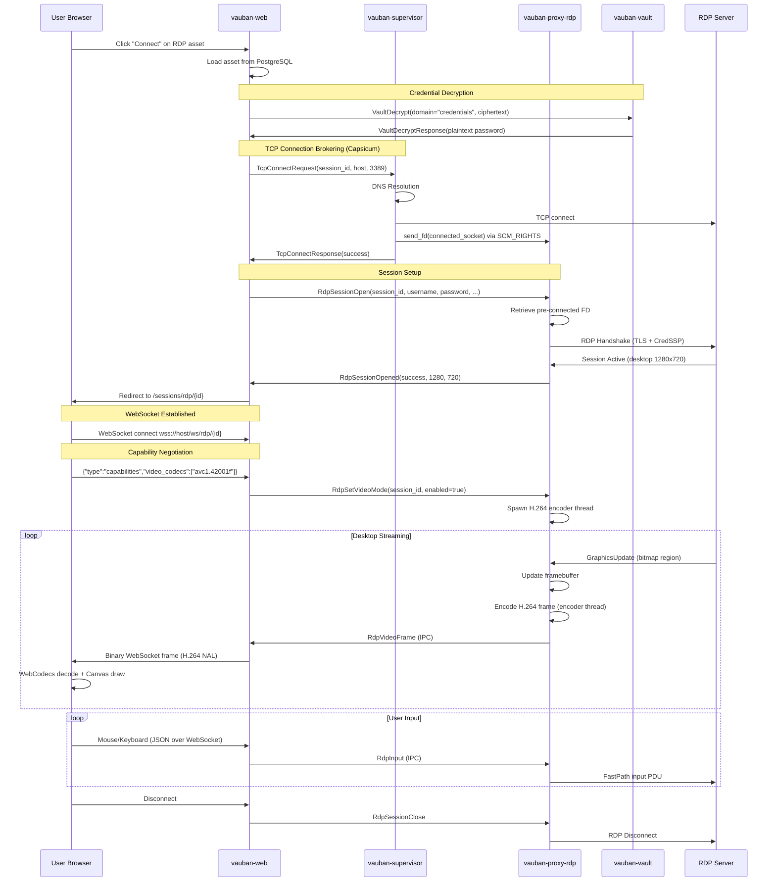

### 4.2 Session Manager

`SessionManager` is the thread-safe registry for active RDP sessions. Each session is identified by a UUID and communicates via a `mpsc::Sender<SessionCommand>` channel.

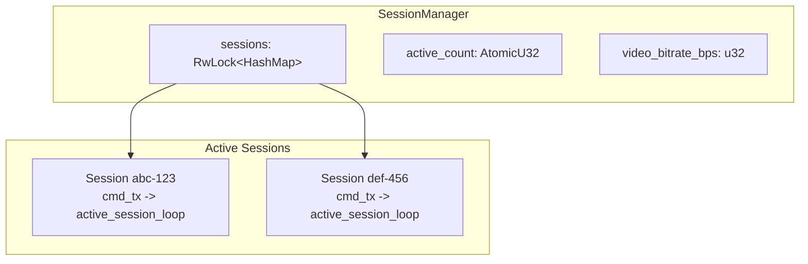

The `video_bitrate_bps` is injected by the supervisor at startup (see [Section 11.2](#112-bitrate-injection)) and used when spawning H.264 encoder threads. The session manager never reads this value from IPC messages.

---

## 5. H.264 Video Streaming

### 5.1 Encoding Architecture

H.264 encoding runs on a **dedicated OS thread** (`std::thread::spawn`), separate from the Tokio async runtime. This prevents encoding latency from blocking RDP protocol processing.

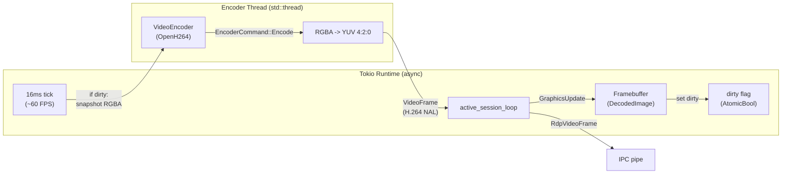

### 5.2 Encoder Configuration

| Parameter | Value | Rationale |
|-----------|-------|-----------|
| Codec | H.264 Baseline (AVC) | Universal browser support via WebCodecs |
| Max frame rate | 60 FPS | Smooth desktop rendering |
| Bitrate | 5 Mbps (default, configurable) | Balance between quality and bandwidth |
| Rate control | Quality mode | Prioritizes visual fidelity |
| Usage type | ScreenContentRealTime | Optimized for text and UI elements |
| Frame skip | Disabled | Every dirty frame is encoded |
| Adaptive quantization | Disabled | Consistent quality across regions |
| Background detection | Disabled | All regions treated equally |

### 5.3 Dimension Alignment

H.264 uses YUV 4:2:0 chroma subsampling, which requires both width and height to be even numbers. The `align_even` function ensures this:

```rust
fn align_even(v: u16) -> u16 {
    (v + 1) & !1
}
```

This is applied at three points:
1. **Encoder initialization**: when the encoder thread starts
2. **Frame encoding**: when processing each `EncoderCommand::Encode`
3. **Reconfiguration**: when the desktop resolution changes

When dimensions are rounded up, the RGBA buffer is **padded with zeros** to fill the extra pixels, preventing out-of-bounds access in the YUV conversion.

### 5.4 Frame Flow

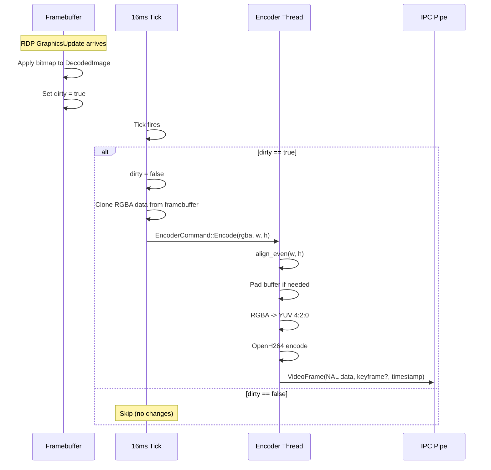

### 5.5 PNG Fallback

Before H.264 is negotiated (or if the browser does not support WebCodecs), individual bitmap regions are encoded as PNG and sent as `RdpDisplayUpdate` messages. This provides a functional baseline for all browsers.

---

## 6. Input Pipeline

### 6.1 Input Events

The browser captures mouse and keyboard events on the HTML5 canvas and sends them as JSON over the WebSocket:

| Event | JSON Format | RDP Translation |
|-------|------------|-----------------|
| Mouse move | `{"type":"mouse_move","x":100,"y":200}` | FastPath mouse move |
| Mouse button | `{"type":"mouse_button","button":0,"pressed":true,"x":50,"y":60}` | FastPath mouse button |
| Mouse wheel | `{"type":"mouse_wheel","delta_x":0,"delta_y":-120}` | FastPath wheel event |
| Key press | `{"type":"key","code":"KeyA","key":"a","pressed":true,"shift":false,...}` | FastPath scancode |

### 6.2 Throttling

Mouse move events are throttled at **33ms intervals** (~30 Hz) on the client side to prevent flooding the WebSocket and IPC channels:

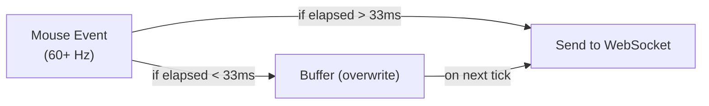

Keyboard events are **never throttled** -- every keypress and release is sent immediately to ensure accurate text input.

### 6.3 Coordinate Scaling

The browser canvas may be displayed at a different size than the RDP desktop resolution. Mouse coordinates are scaled to match the server's resolution:

```javascript
const scaleX = this.desktopWidth / canvas.clientWidth;
const scaleY = this.desktopHeight / canvas.clientHeight;
const x = Math.round(e.offsetX * scaleX);
const y = Math.round(e.offsetY * scaleY);
```

---

## 7. Dynamic Resolution

### 7.1 Display Control Channel

RDP supports runtime resolution changes via the **Display Control Virtual Channel** (`DrdynvcClient` + `DisplayControlClient`). This allows the desktop resolution to adapt when the user enters or exits fullscreen.

### 7.2 Resize Sequence

A critical design decision is that the framebuffer and encoder are **not** resized immediately when the resize request is sent. Instead, they are resized when the server confirms the new resolution via the `DeactivateAll` reactivation sequence. This prevents a race condition where the server continues sending updates at the old resolution.

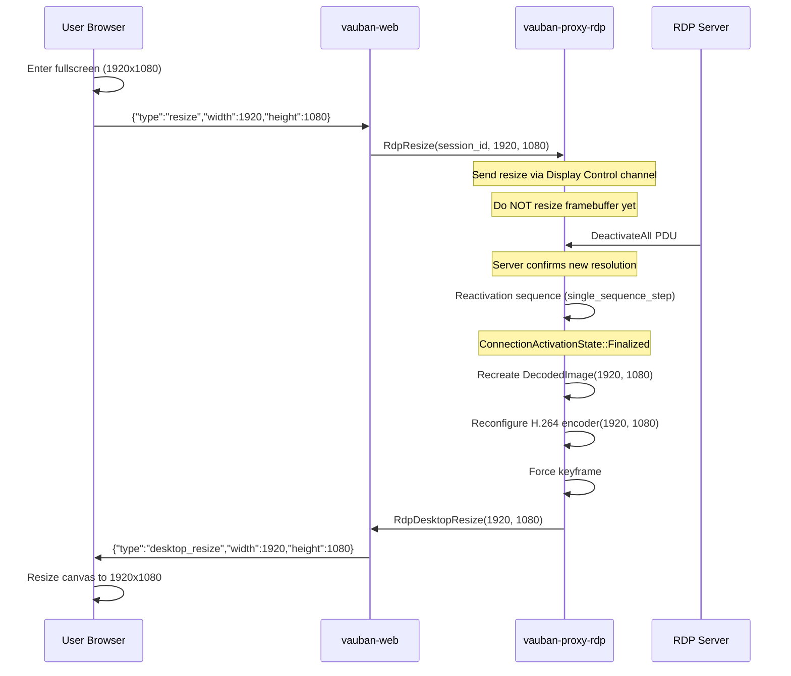

### 7.3 Race Condition Prevention

| Approach | Risk | Our Solution |
|----------|------|--------------|
| Resize framebuffer on `SessionCommand::Resize` | Server still sends at old resolution -> `index out of bounds` panic | Defer to `DeactivateAll` handler |
| Reconfigure encoder on resize request | Encoder dimensions mismatch framebuffer -> corrupted frames | Reconfigure only after `Finalized` state |
| Force keyframe on resize | Old resolution keyframe confuses decoder | Force keyframe only after reconfiguration |

---

## 8. IPC Protocol

### 8.1 RDP Message Types

All messages are serialized using **bincode** and sent over Unix pipes (see [Privsep Architecture, Section 4](Vauban_Privsep_Architecture_EN(1.1).md#4-ipc-protocol)):

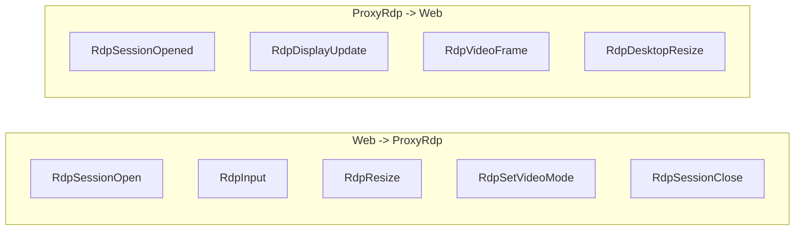

### 8.2 Key Message Definitions

| Message | Direction | Fields | Purpose |
|---------|-----------|--------|---------|
| `RdpSessionOpen` | Web -> Proxy | session_id, user_id, asset_id, host, port, username, password (SensitiveString), domain, desktop_width, desktop_height | Initiate RDP connection |
| `RdpSessionOpened` | Proxy -> Web | request_id, session_id, success, desktop_width, desktop_height, error | Connection result |
| `RdpDisplayUpdate` | Proxy -> Web | session_id, x, y, width, height, png_data | PNG bitmap region (fallback mode) |
| `RdpVideoFrame` | Proxy -> Web | session_id, timestamp_us, is_keyframe, width, height, data (H.264 NAL) | Encoded video frame |
| `RdpDesktopResize` | Proxy -> Web | session_id, width, height | Server confirmed new resolution |
| `RdpSetVideoMode` | Web -> Proxy | session_id, enabled | Enable/disable H.264 mode |
| `RdpInput` | Web -> Proxy | session_id, input (RdpInputEvent) | Mouse/keyboard event |
| `RdpResize` | Web -> Proxy | session_id, width, height | Request resolution change |
| `RdpSessionClose` | Web -> Proxy | session_id | Terminate session |

### 8.3 IPC Message Size

RDP messages, especially H.264 frames, can be larger than typical IPC messages. The `MAX_MESSAGE_SIZE` is set to **128 KB** to accommodate keyframes (which are larger than delta frames). This does not mean every message uses 128 KB -- delta frames are typically 1-5 KB.

---

## 9. WebSocket Protocol

### 9.1 Connection

The frontend connects to `wss://host/ws/rdp/{session_id}` after the session is established. The WebSocket carries both text (JSON commands) and binary (display data) messages.

### 9.2 Capability Negotiation

Before video streaming begins, the browser announces its codec support:

```json
{"type": "capabilities", "video_codecs": ["avc1.42001f"]}
```

If the server detects `avc1` support, it enables H.264 mode and confirms:

```json
{"type": "mode", "video": true}
```

### 9.3 Binary Frame Formats

#### PNG Display Update (fallback mode)

```
Offset | Size | Description
-------|------|-------------
0-1    | 2    | x position (u16 LE)
2-3    | 2    | y position (u16 LE)
4-5    | 2    | width (u16 LE)
6-7    | 2    | height (u16 LE)
8+     | N    | PNG image data
```

#### H.264 Video Frame

```
Offset | Size | Description
-------|------|-------------
0      | 1    | Type marker: 0x01 (video frame)
1      | 1    | Flags: bit 0 = is_keyframe
2-5    | 4    | timestamp_ms (u32 LE)
6-7    | 2    | width (u16 LE)
8-9    | 2    | height (u16 LE)
10+    | N    | H.264 NAL unit data
```

The type marker (byte 0) distinguishes video frames from PNG updates. PNG frames do not have this marker -- the first byte is part of the x-coordinate, which is never `0x01` for typical display regions.

### 9.4 Text Messages

| Direction | Message | Purpose |
|-----------|---------|---------|
| Browser -> Server | `{"type":"mouse_move","x":...,"y":...}` | Mouse position |
| Browser -> Server | `{"type":"mouse_button","button":...,"pressed":...,"x":...,"y":...}` | Click/release |
| Browser -> Server | `{"type":"mouse_wheel","delta_x":...,"delta_y":...}` | Scroll |
| Browser -> Server | `{"type":"key","code":...,"key":...,"pressed":...,"shift":...,...}` | Keyboard |
| Browser -> Server | `{"type":"resize","width":...,"height":...}` | Resolution change |
| Browser -> Server | `{"type":"capabilities","video_codecs":[...]}` | Codec support |
| Server -> Browser | `{"type":"mode","video":true}` | H.264 mode confirmed |
| Server -> Browser | `{"type":"desktop_resize","width":...,"height":...}` | New resolution |

---

## 10. Frontend Client

### 10.1 Alpine.js Component

The `rdpViewer` Alpine.js component manages the entire client-side RDP experience:

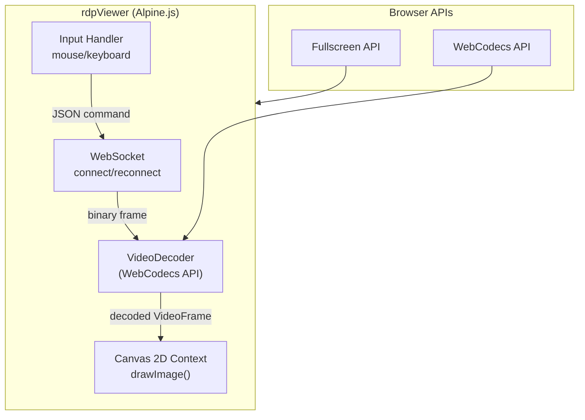

### 10.2 WebCodecs VideoDecoder

The browser uses the **WebCodecs API** for hardware-accelerated H.264 decoding:

```javascript
this.decoder = new VideoDecoder({
    output: (frame) => {
        this.ctx.drawImage(frame, 0, 0, frame.displayWidth, frame.displayHeight);
        frame.close();
    },
    error: (e) => console.error('[RDP] Decoder error:', e)
});

this.decoder.configure({
    codec: 'avc1.42001f',        // H.264 Baseline Level 3.1
    optimizeForLatency: true     // Minimize decode latency
});
```

Each incoming binary WebSocket frame is parsed and fed to the decoder:

```javascript
const chunk = new EncodedVideoChunk({
    type: isKeyframe ? 'key' : 'delta',
    timestamp: timestampMs * 1000,   // microseconds
    data: nalData
});
decoder.decode(chunk);
```

### 10.3 Rendering Modes

| Mode | Trigger | Rendering |
|------|---------|-----------|
| **PNG (fallback)** | Browser lacks WebCodecs or H.264 not negotiated | Individual bitmap regions drawn via `Image` + `drawImage(img, x, y)` |
| **H.264 (video)** | Browser sends `avc1.42001f` in capabilities | Full-frame decode via `VideoDecoder` + `drawImage(frame, 0, 0, w, h)` |

---

## 11. Security Design

### 11.1 Credential Handling

RDP credentials follow Vauban's defense-in-depth approach:

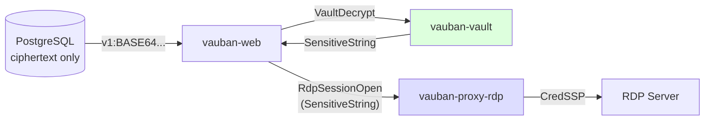

1. Encrypted credentials are stored in PostgreSQL (`v1:BASE64...`)
2. `vauban-web` requests decryption from `vauban-vault` via IPC
3. Plaintext is wrapped in `SensitiveString` (zeroize-on-drop) during IPC transport
4. `vauban-proxy-rdp` uses the credential for CredSSP authentication
5. The plaintext is zeroized after the RDP handshake completes

### 11.2 Bitrate Injection

The H.264 encoder bitrate is a security-sensitive configuration parameter. A compromised `vauban-web` could theoretically send an arbitrary bitrate via IPC to affect proxy resource consumption.

**Solution**: The supervisor injects the bitrate as an environment variable at fork time. The proxy reads and immediately destroys it:

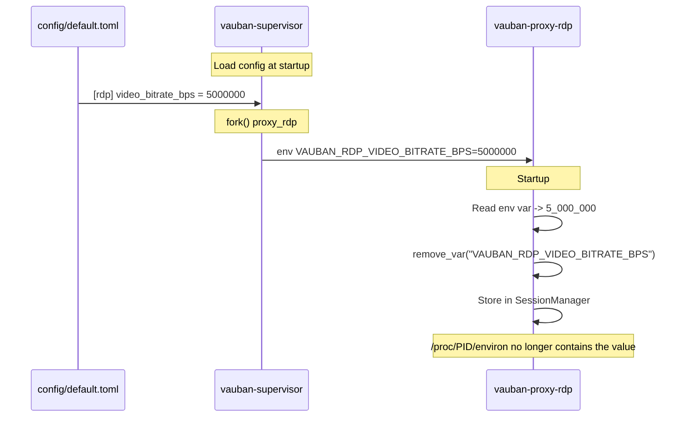

The `RdpSetVideoMode` IPC message carries only `session_id` and `enabled` -- no bitrate field. The proxy uses its internally stored value, preventing any IPC-based override.

### 11.3 Capsicum Sandboxing

After entering capability mode, `vauban-proxy-rdp` can only:

| Action | Possible? | Why |
|--------|-----------|-----|
| Open new TCP connections | No | Connections brokered by supervisor via SCM_RIGHTS |
| Read filesystem | No | `cap_enter()` blocks `open()` |
| Resolve DNS | No | Handled by supervisor |
| Communicate with vauban-web | Yes | Pre-opened IPC pipe |
| Communicate with supervisor | Yes | Pre-opened IPC pipe |
| Communicate with vault | Yes | Pre-opened IPC pipe |
| Communicate with audit | Yes | Pre-opened IPC pipe |

### 11.4 Environment Variable Hygiene

All environment variables are destroyed immediately after reading:

```rust
unsafe {
    std::env::remove_var("VAUBAN_IPC_READ");
    std::env::remove_var("VAUBAN_IPC_WRITE");
    std::env::remove_var("VAUBAN_WEB_IPC_READ");
    std::env::remove_var("VAUBAN_WEB_IPC_WRITE");
    std::env::remove_var("VAUBAN_FD_PASSING_SOCKET");
    std::env::remove_var("VAUBAN_RDP_VIDEO_BITRATE_BPS");
}
```

This prevents environment inspection attacks (e.g., `/proc/PID/environ` on Linux, `ps eww` on FreeBSD).

---

## 12. Testing Strategy

### 12.1 Unit Tests (vauban-proxy-rdp)

#### Video Encoder (`video_encoder.rs`)

| Test | Purpose |
|------|---------|
| `test_encoder_creation` | Encoder initializes with valid dimensions |
| `test_encode_black_frame` | Solid black framebuffer produces valid H.264 |
| `test_first_frame_is_keyframe` | First encoded frame is always an I-frame |
| `test_subsequent_frames_are_delta` | Following frames are P-frames |
| `test_force_keyframe` | `force_intra_frame()` produces an I-frame on demand |
| `test_reconfigure_dimensions` | Encoder adapts to new resolution |
| `test_custom_bitrate` | Custom bitrate is accepted |
| `test_h264_nal_start_code` | Output starts with `0x00 0x00 0x00 0x01` (Annex B) |
| `test_timestamps_increase` | Frame timestamps are monotonically increasing |

#### Session (`session.rs`)

| Test | Purpose |
|------|---------|
| `test_align_even_*` | Dimension alignment for H.264 compatibility |
| `test_encoder_thread_handles_odd_dimensions` | Odd resolution padded correctly |
| `test_encoder_thread_reconfigure_odd_dimensions` | Reconfigure with odd resolution |
| `test_encoder_thread_exact_fullscreen_scenario` | Real-world 1728x1117 -> 1728x1118 |
| `test_encoder_thread_custom_bitrate` | Thread uses provided bitrate |
| `test_encoder_thread_zero_bitrate_uses_default` | Zero bitrate falls back to 5 Mbps |
| `test_encode_region_as_png_full_screen` | PNG fallback produces valid output |

#### Session Manager (`session_manager.rs`)

| Test | Purpose |
|------|---------|
| `test_session_manager_default_bitrate` | Default is 5 Mbps |
| `test_session_manager_custom_bitrate` | Constructor accepts custom value |
| `test_session_manager_bitrate_used_in_set_video_mode` | Structural: uses `self.video_bitrate_bps` |

### 12.2 Structural Regression Tests

These tests inspect the source code at compile time to prevent architectural regressions:

| Test | Assertion |
|------|-----------|
| `test_resize_handler_does_not_recreate_framebuffer` | `Resize` handler must NOT contain `DecodedImage::new` |
| `test_deactivate_all_reconfigures_encoder` | `DeactivateAll` handler must contain `EncoderCommand::Reconfigure` and `ForceKeyframe` |
| `test_align_even_used_in_encoder_thread` | `spawn_encoder_thread` must call `align_even` and `.resize(expected,` |
| `test_bitrate_env_var_read_and_destroyed` | Source must contain `remove_var("VAUBAN_RDP_VIDEO_BITRATE_BPS")` |
| `test_bitrate_not_received_from_ipc` | `RdpSetVideoMode` handler must ignore `bitrate_bps` from IPC |
| `test_session_manager_created_with_bitrate` | Source must contain `SessionManager::with_bitrate(video_bitrate_bps)` |

### 12.3 WebSocket Handler Tests (vauban-web)

| Test | Purpose |
|------|---------|
| `test_rdp_command_mouse_move` | JSON deserialization of mouse move |
| `test_rdp_command_mouse_button_*` | Button press/release variants |
| `test_rdp_command_mouse_wheel_*` | Scroll events |
| `test_rdp_command_key_*` | Key events with modifiers |
| `test_rdp_command_resize` | Resize command parsing |
| `test_rdp_command_capabilities_*` | H.264 capability negotiation |
| `test_rdp_command_invalid_type` | Malformed commands rejected |

### 12.4 IPC Serialization Tests (shared)

| Test | Purpose |
|------|---------|
| `test_message_rdp_session_open` | Roundtrip serialization with SensitiveString |
| `test_message_rdp_display_update` | PNG data survives bincode |
| `test_message_rdp_video_frame` | H.264 NAL data survives bincode |
| `test_message_rdp_set_video_mode` | Enabled/disabled variants |

### 12.5 Supervisor Tests

| Test | Purpose |
|------|---------|
| `test_rdp_config_loaded_from_toml` | `video_bitrate_bps` parsed from `default.toml` |
| `test_service_env_vars_proxy_rdp` | `VAUBAN_RDP_VIDEO_BITRATE_BPS` generated for `proxy_rdp` |
| `test_service_env_vars_other_services_empty` | Other services get no RDP env vars |
| `test_spawn_child_accepts_service_env_vars` | Structural: `spawn_child` has the parameter |
| `test_all_spawn_call_sites_pass_service_env_vars` | All 3 spawn sites pass `&svc_env` |

---

## 13. Architecture Decisions

### 13.1 Summary of Key Decisions

| Decision | Choice | Rationale |
|----------|--------|-----------|
| RDP library | IronRDP (pure Rust, async) | Memory-safe, auditable, Tokio-native |
| Video encoding | OpenH264 (H.264 Baseline) | Software-only, no GPU dependency, universal browser support |
| Browser decoding | WebCodecs API | Hardware-accelerated, sub-millisecond latency |
| Encoding thread | Dedicated `std::thread` | Prevents async runtime blocking during encode |
| Framebuffer model | Full-frame snapshot on dirty flag | Simpler than tile-based; quality > bandwidth optimization |
| Resize synchronization | Deferred to `DeactivateAll` | Prevents race condition with server |
| Bitrate configuration | Supervisor-injected env var | Security: vauban-web cannot override encoder settings |
| PNG fallback | Per-region bitmap updates | Baseline support for browsers without WebCodecs |
| Input throttling | Client-side, 33ms for mouse | Prevents IPC flooding; keyboard unthrottled |
| Coordinate mapping | Client-side scaling | Decouples canvas size from desktop resolution |

### 13.2 Performance Characteristics

| Metric | Typical Value | Conditions |
|--------|---------------|------------|
| Encode FPS | 35-40 | 1280x720, software encoding |
| GFX updates/5s | 30-50 | Active desktop use |
| Avg encode latency | 25-35 ms | Per frame, dedicated thread |
| H.264 keyframe size | 10-50 KB | Depends on desktop content |
| H.264 delta frame size | 1-5 KB | Small changes only |
| WebSocket latency | < 1 ms | Local network |
| Input round-trip | < 50 ms | Mouse click to visual feedback |

### 13.3 Known Limitations

| Limitation | Root Cause | Mitigation |
|------------|------------|------------|
| Text clarity in fullscreen | H.264 Baseline + YUV 4:2:0 chroma subsampling | Increase bitrate via TOML (up to 30 Mbps) |
| 16-bit color from some servers | RDP server ignores 32-bit color request | Graceful handling; quality slightly reduced |
| No audio | Not implemented | Future enhancement |
| No clipboard | Not implemented | Future: cliprdr virtual channel |
| No file transfer | Not implemented | Future: rdpdr virtual channel |
| Software encoding only | OpenH264 is CPU-based | Future: hardware encoding via VAAPI/NVENC |

### 13.4 Future Enhancements

| Enhancement | Approach |
|-------------|----------|
| Audio streaming | RDP audio virtual channel + Opus encoding + Web Audio API |
| Clipboard sharing | cliprdr virtual channel with text/image support |
| File transfer | rdpdr virtual channel with drag-and-drop UI |
| Hardware encoding | VAAPI/NVENC via FFmpeg or dedicated crate |
| Session recording | Capture H.264 NAL stream to MP4 via `vauban-audit` |
| Multi-monitor | Multiple Display Control channels |

---

## Appendix A: Configuration Reference

### A.1 TOML Configuration

```toml
# config/default.toml

[rdp]
# H.264 video encoder bitrate in bits per second.
# Higher values improve text clarity and image quality but use more bandwidth.
# Default: 5 Mbps (suitable for LAN / low-latency environments).
# Recommended range: 2_000_000 (low quality) to 30_000_000 (high quality).
video_bitrate_bps = 5_000_000
```

### A.2 Configuration Flow

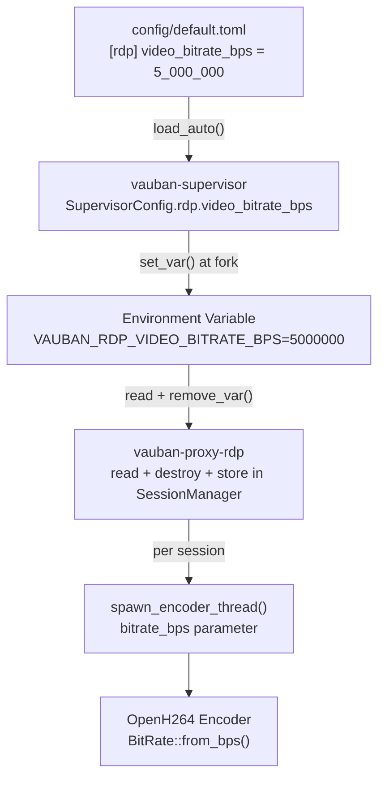

---

## Appendix B: Error Handling

| Error | Layer | Handling |
|-------|-------|----------|
| DNS resolution failure | Supervisor | `TcpConnectResponse(success=false)` |
| TCP connection refused | Supervisor | `TcpConnectResponse(success=false)` |
| RDP authentication failure | Proxy | `RdpSessionOpened(success=false, error)` |
| TLS handshake failure | Proxy | `RdpSessionOpened(success=false, error)` |
| Session disconnected | Proxy | Session cleanup, WebSocket close |
| H.264 encoder failure | Proxy | Log error, encoder thread exits |
| WebSocket disconnected | Web | Session cleanup, `RdpSessionClose` sent to proxy |
| IPC pipe broken | Supervisor | Linked group restart (Web + ProxyRdp) |

---
