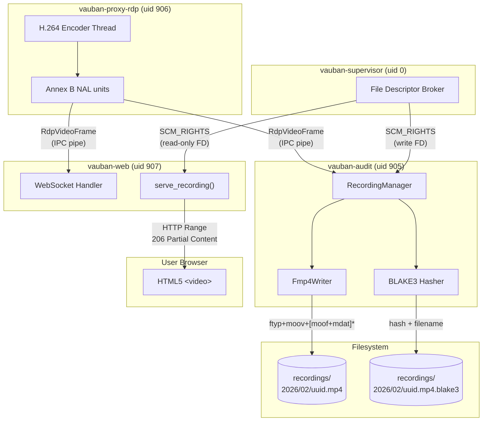
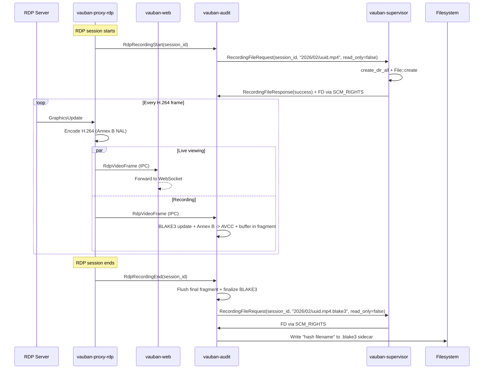
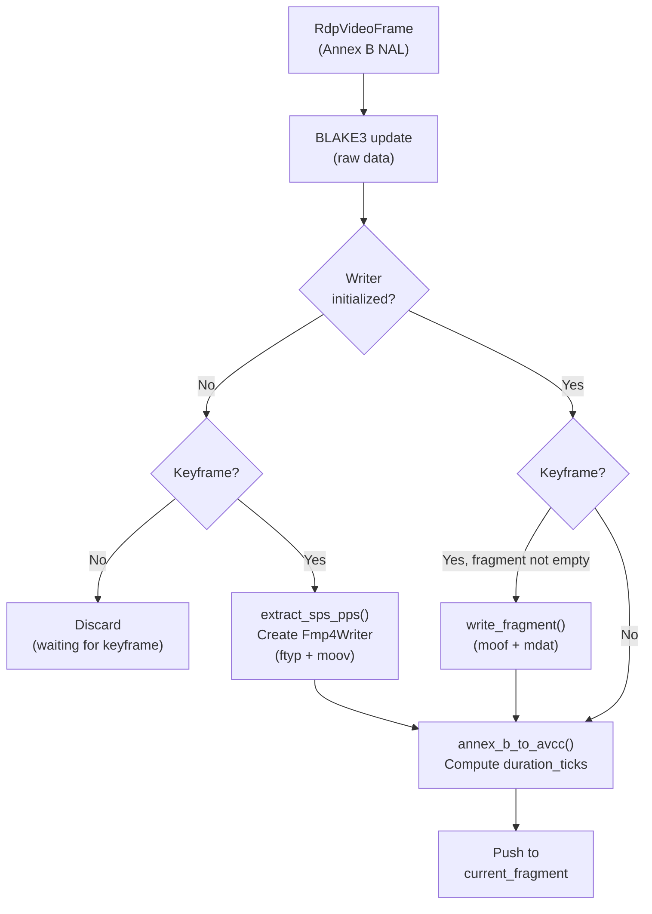
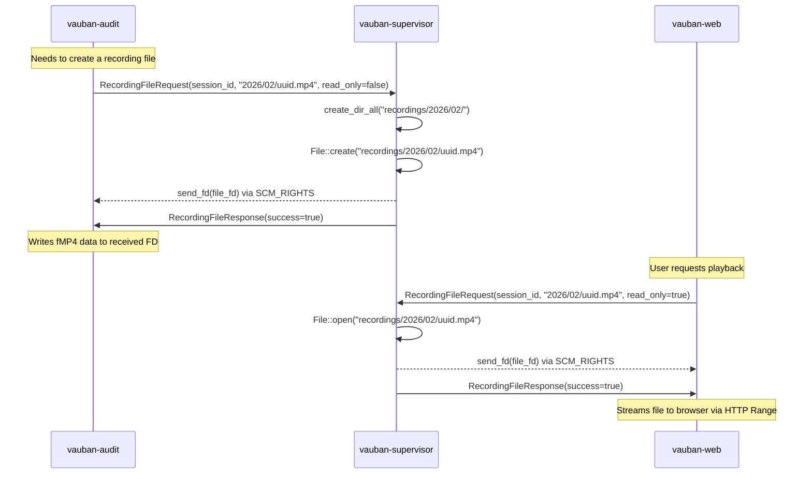
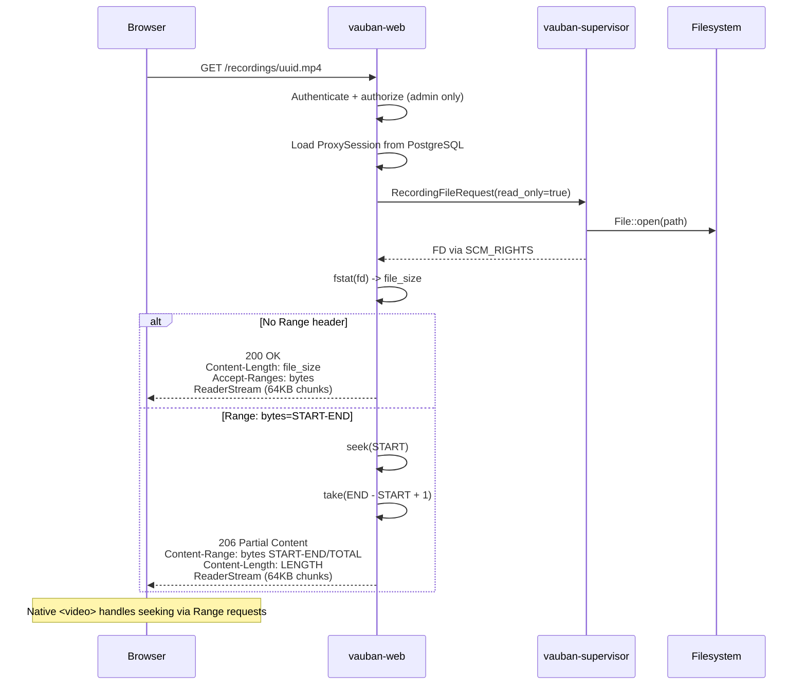

# Vauban Session Recording Architecture


> **Superseded.** This document is retained for archaeology. The current
> revision is
> [Vauban_Recording_Architecture_EN(1.8).md](Vauban_Recording_Architecture_EN(1.8).md).

**Version:** 1.0  
**Date:** 1 March 2026  
**Author:** Richard Ben Aleya

---

## Table of Contents

1. [Introduction](#1-introduction)
2. [Architecture Overview](#2-architecture-overview)
3. [Recording Pipeline](#3-recording-pipeline)
4. [Fragmented MP4 Container](#4-fragmented-mp4-container)
5. [Integrity Verification](#5-integrity-verification)
6. [File Descriptor Delegation](#6-file-descriptor-delegation)
7. [Playback Architecture](#7-playback-architecture)
8. [Streaming Design: HTTP Range vs MSE](#8-streaming-design-http-range-vs-mse)
9. [Security Design](#9-security-design)
10. [Testing Strategy](#10-testing-strategy)
11. [Architecture Decisions](#11-architecture-decisions)

---

## 1. Introduction

### 1.1 Background

Vauban's RDP proxy (`vauban-proxy-rdp`) already encodes the desktop as an H.264 Annex B NAL stream for live viewing via WebCodecs (see [RDP Session Architecture](Vauban_RDP_Architecture_EN(1.0).md)). Recording leverages this existing encoding pipeline: the same NAL units sent to the browser are simultaneously forwarded to `vauban-audit` for persistent storage.

### 1.2 Design Goals

| Goal | Approach |
|------|----------|
| Zero-copy recording | Reuse existing H.264 NAL units -- no re-encoding |
| Crash resilience | Fragmented MP4 (fMP4): each GOP is flushed immediately |
| Tamper detection | BLAKE3 hash of raw frame data, stored in sidecar file |
| Sandbox compatibility | File descriptors delegated by supervisor via SCM_RIGHTS |
| Efficient playback | HTTP Range requests with chunked streaming (~64 KB memory) |
| Native seeking | Standard `<video>` element with `206 Partial Content` |
| Downloadable files | Standard `.mp4` files playable in any media player |

### 1.3 Scope

This document covers the recording pipeline from H.264 frame capture in `vauban-proxy-rdp` to fMP4 file storage in `vauban-audit`, and the playback path from `vauban-web` to the browser. It is a companion to the [Privilege Separation Architecture](Vauban_Privsep_Architecture_EN(1.2).md) and [RDP Session Architecture](Vauban_RDP_Architecture_EN(1.0).md).

---

## 2. Architecture Overview

### 2.1 End-to-End Data Flow



### 2.2 Module Structure

```
vauban-audit/src/
    main.rs                   # IPC dispatcher, SCM_RIGHTS file requests
    recording_manager.rs      # Session lifecycle, frame routing, BLAKE3
    fmp4_writer.rs            # ISO BMFF box generation, fragment flushing

vauban-web/src/
    handlers/web/sessions.rs  # serve_recording(), parse_range_header()
    ipc/supervisor.rs         # request_recording_file() (read-only FD)

vauban-proxy-rdp/src/
    session.rs                # Dual dispatch: WebSocket + audit IPC

shared/src/
    messages.rs               # RecordingFileRequest, RecordingFileResponse,
                              # RdpRecordingStart, RdpRecordingEnd
```

### 2.3 Dependencies

| Crate | Used by | Purpose |
|-------|---------|---------|
| `blake3` | vauban-audit | Cryptographic hashing of raw frame data |
| `tokio-util` | vauban-web | `ReaderStream` for chunked HTTP streaming |
| `tempfile` | vauban-audit (tests) | Temporary files for recording tests |

---

## 3. Recording Pipeline

### 3.1 Frame Capture

When an RDP session is active and H.264 encoding is enabled, each encoded frame is dispatched to two destinations simultaneously:

1. **Live viewing**: sent via IPC to `vauban-web`, then over WebSocket to the browser
2. **Recording**: sent via IPC to `vauban-audit` for persistent storage



### 3.2 Recording Manager

`RecordingManager` tracks all active recording sessions. It receives pre-opened `File` handles and never performs filesystem I/O directly, following the principle of least privilege under Capsicum.

| Responsibility | Method |
|----------------|--------|
| Start recording | `start_session(session_id, File, relative_path)` |
| Process frame | `handle_frame(session_id, timestamp_us, is_keyframe, width, height, data)` |
| End recording | `end_session(session_id) -> Option<EndSessionResult>` |

Key behaviors:

- **Lazy initialization**: the `Fmp4Writer` is not created until the first keyframe arrives, because SPS/PPS parameters (required for the `moov` box) are only present in keyframes
- **P-frames before first keyframe**: silently discarded (cannot be decoded without SPS/PPS)
- **Fragment flushing**: each GOP (keyframe + following P-frames) is accumulated in memory, then flushed as a `moof+mdat` pair when the next keyframe arrives
- **Concurrent sessions**: multiple sessions can be recorded simultaneously (keyed by `session_id`)

### 3.3 Frame Processing



### 3.4 Timestamp Handling

Frame timestamps arrive in microseconds from the H.264 encoder. They are converted to the MP4's 90 kHz timescale:

```
duration_ticks = round(duration_us / (1_000_000 / 90_000))
               = round(duration_us / 11.111...)
```

When two consecutive frames have the same timestamp (duration = 0), a fallback duration of 3000 ticks (~33 ms, equivalent to 30 FPS) is used.

---

## 4. Fragmented MP4 Container

### 4.1 Why Fragmented MP4?

Standard MP4 files place the `moov` atom (containing sample tables, offsets, and durations for every frame) either at the beginning or end of the file. This requires knowing all frame data upfront, or rewriting the file header after recording completes.

Fragmented MP4 (fMP4) solves this by:

1. Writing a minimal `moov` with only codec configuration (SPS/PPS) at the start
2. Appending each GOP as an independent `moof+mdat` fragment
3. Each fragment is self-describing (contains its own sample table)

This provides **crash resilience**: if the process terminates unexpectedly, all previously flushed fragments remain playable. Only the current in-progress GOP is lost.

### 4.2 File Structure

```
ftyp                              # File type: isom, iso5, iso6, mp41
moov                              # Movie header (minimal for fragmented)
    mvhd                          # Movie header (timescale=90kHz, duration=0)
    trak                          # Single video track
        tkhd                      # Track header (track_id=1, dimensions)
        mdia                      # Media container
            mdhd                  # Media header (timescale=90kHz)
            hdlr                  # Handler: "vide" / "Vauban Video"
            minf                  # Media information
                vmhd              # Video media header
                dinf/dref         # Data reference (self-contained)
                stbl              # Sample table (empty -- data in fragments)
                    stsd          # Sample description
                        avc1      # AVC visual sample entry
                            avcC  # AVC decoder config (SPS, PPS)
                    stts          # (empty)
                    stsc          # (empty)
                    stsz          # (empty)
                    stco          # (empty)
    mvex                          # Movie extends (signals fragmentation)
        trex                      # Track extends defaults

[moof + mdat]*                    # Repeated for each GOP
    moof                          # Movie fragment
        mfhd                      # Fragment header (sequence_number)
        traf                      # Track fragment
            tfhd                  # Track fragment header (track_id=1)
            tfdt                  # Track fragment decode time (v1, 64-bit)
            trun                  # Track run (sample count, data_offset,
                                  #   per-sample: duration, size, flags)
    mdat                          # Media data (AVCC-formatted NAL units)
```

### 4.3 NAL Unit Format Conversion

The H.264 encoder produces Annex B format (start codes `0x00000001`), but MP4 containers require AVCC format (4-byte big-endian length prefix). The conversion pipeline:

```
Annex B input:  [00 00 00 01] [67 SPS...] [00 00 00 01] [68 PPS...] [00 00 00 01] [65 IDR...]
                     |              |           |              |           |            |
                     v              v           v              v           v            v
              start code       extracted    start code     extracted   start code    kept in
                removed       -> moov/avcC    removed     -> moov/avcC   removed    mdat as AVCC

AVCC output:   [00 00 00 03] [65 IDR...]
                  length=3     IDR slice data
```

SPS (NAL type 7) and PPS (NAL type 8) are extracted from the first keyframe and stored in the `avcC` box inside `moov`. They are stripped from subsequent `mdat` payloads since the decoder reads them from the container header.

### 4.4 Sample Flags

Each sample in the `trun` box carries flags indicating its decode dependencies:

| Frame Type | Flags | Meaning |
|-----------|-------|---------|
| Keyframe (IDR) | `0x02000000` | `sample_depends_on=2` (does not depend on others) |
| P-frame | `0x01010000` | `sample_depends_on=1` + `sample_is_non_sync_sample` |

These flags enable the player to identify random access points for seeking.

---

## 5. Integrity Verification

### 5.1 BLAKE3 Hashing

Every raw H.264 frame (Annex B, before AVCC conversion) is fed to a BLAKE3 incremental hasher. When the session ends, the final hash is written to a sidecar file:

```
recordings/2026/02/uuid.mp4          # fMP4 video file
recordings/2026/02/uuid.mp4.blake3   # BLAKE3 hash sidecar
```

Sidecar format (compatible with standard checksum tools):

```
a1b2c3d4e5f6...  uuid.mp4
```

### 5.2 Why BLAKE3?

| Property | Benefit |
|----------|---------|
| Speed | ~3x faster than SHA-256 on modern hardware |
| Incremental | Streaming hash -- no need to buffer frames |
| Tree structure | Parallelizable for future multi-threaded verification |
| Cryptographic | Collision-resistant, suitable for tamper detection |

### 5.3 Verification Workflow

An administrator can verify a recording's integrity by recomputing the BLAKE3 hash from the raw H.264 stream and comparing it to the stored sidecar. This proves that:

1. The recording was not modified after capture
2. All frames are present and in the original order
3. No frames were inserted or removed

---

## 6. File Descriptor Delegation

### 6.1 Problem

Both `vauban-audit` and `vauban-web` run inside Capsicum sandboxes on FreeBSD. After `cap_enter()`, they cannot:

- Call `open()`, `create()`, or any filesystem-accessing syscall
- Create directories with `mkdir()`
- Resolve paths with `stat()` or `access()`

Recording requires creating new files (audit writes) and reading existing files (web playback).

### 6.2 Solution: SCM_RIGHTS File Descriptor Passing

The same mechanism used for TCP connection brokering (see [Privilege Separation Architecture, Section 5.5](Vauban_Privsep_Architecture_EN(1.2).md)) is reused for recording files:



### 6.3 Message Protocol

```rust
RecordingFileRequest {
    request_id: u64,        // Correlates request/response (async support)
    session_id: String,
    relative_path: String,  // e.g. "2026/02/uuid.mp4"
    read_only: bool,        // true = open existing (web), false = create new (audit)
}

RecordingFileResponse {
    request_id: u64,
    session_id: String,
    success: bool,
    error: Option<String>,  // Human-readable error if success=false
}
```

The `request_id` field enables `vauban-web` to issue concurrent file requests (multiple users viewing different recordings simultaneously) and match responses to the correct pending request, similar to the `TcpConnectRequest` pattern.

### 6.4 Unified FD Passing

Recording file FD passing uses the exact same Unix domain socket mechanism as TCP connection brokering:

| Feature | TCP Brokering | Recording Files |
|---------|--------------|-----------------|
| Socket type | `AF_UNIX SOCK_STREAM` | `AF_UNIX SOCK_STREAM` |
| Control message | `SCM_RIGHTS` | `SCM_RIGHTS` |
| FD type | Connected TCP socket | Regular file |
| Direction | Supervisor -> Proxy | Supervisor -> Audit / Web |
| Platform | All Unix (FreeBSD, macOS, Linux) | All Unix |

---

## 7. Playback Architecture

### 7.1 Playback Flow



### 7.2 Memory Efficiency

The playback handler never loads the entire file into memory. Instead, it uses `tokio-util::io::ReaderStream` to stream the file in 64 KB chunks:

| Approach | Memory per request | Seeking |
|----------|-------------------|---------|
| `read_to_end()` (naive) | Entire file size (e.g. 3 GB) | No |
| `ReaderStream` + Range | ~64 KB (constant) | Yes, via `206 Partial Content` |

### 7.3 HTTP Range Request Handling

The `serve_recording()` handler supports the standard HTTP Range protocol:

| Request | Response | Headers |
|---------|----------|---------|
| `GET /recordings/uuid.mp4` (no Range) | `200 OK` | `Content-Length`, `Accept-Ranges: bytes` |
| `GET /recordings/uuid.mp4` with `Range: bytes=0-` | `206 Partial Content` | `Content-Range: bytes 0-N/TOTAL` |
| `GET /recordings/uuid.mp4` with `Range: bytes=5242880-` | `206 Partial Content` | `Content-Range: bytes 5242880-N/TOTAL` |
| `GET /recordings/uuid.mp4` with `Range: bytes=100-200` | `206 Partial Content` | `Content-Range: bytes 100-200/TOTAL` |

The `parse_range_header()` function handles:

- Open-ended ranges: `bytes=START-` (from offset to end of file)
- Closed ranges: `bytes=START-END` (specific byte range)
- Clamping: end values exceeding file size are clamped to `file_size - 1`
- Validation: start >= file_size or end < start returns `None` (full response)

### 7.4 Frontend Player

The recording playback page uses a native HTML5 `<video>` element with no custom JavaScript:

```html
<video controls playsinline preload="metadata">
    <source src="/recordings/uuid.mp4" type="video/mp4">
</video>
```

The native player provides:

- Play/pause, seek bar, volume, fullscreen
- Automatic Range requests for seeking (browser-managed)
- Picture-in-picture support
- Keyboard shortcuts (spacebar, arrow keys)
- Download capability (right-click "Save as")

---

## 8. Streaming Design: HTTP Range vs MSE

### 8.1 Alternatives Considered

Three approaches were evaluated for delivering recorded video to the browser:

| Approach | Description | Complexity |
|----------|-------------|------------|
| **A. HTTP Range + ReaderStream** | Standard HTTP with `206 Partial Content` | Low |
| **B. Media Source Extensions (MSE)** | JavaScript API feeding fMP4 segments to `<video>` | High |
| **C. WebSocket streaming** | Reuse existing WebSocket infrastructure | Medium |

### 8.2 Media Source Extensions (MSE)

MSE is the technology used by platforms like **Netflix**, **YouTube**, and **Twitch** for adaptive bitrate streaming (DASH, HLS). It works by:

1. Fetching media segments (fMP4 chunks) via JavaScript
2. Appending them to a `SourceBuffer` attached to a `<video>` element
3. Managing buffer levels, quality switches, and segment scheduling in JavaScript

```javascript
// MSE example (Netflix-style approach)
const mediaSource = new MediaSource();
video.src = URL.createObjectURL(mediaSource);
mediaSource.addEventListener('sourceopen', () => {
    const sourceBuffer = mediaSource.addSourceBuffer('video/mp4; codecs="avc1.42001f"');
    fetch('/segment-001.m4s')
        .then(r => r.arrayBuffer())
        .then(data => sourceBuffer.appendBuffer(data));
});
```

Netflix uses MSE because it needs:

- **Adaptive bitrate**: switching between quality levels (720p, 1080p, 4K) based on network conditions
- **DRM integration**: Encrypted Media Extensions (EME) for content protection
- **Client-side buffering**: fine-grained control over which segments are in memory
- **Live + VOD unification**: same player handles both use cases

### 8.3 Why HTTP Range Was Chosen

Vauban's recording playback has fundamentally different requirements than Netflix:

| Requirement | Netflix | Vauban Recordings |
|-------------|---------|-------------------|
| Adaptive bitrate | Yes (essential) | No (single quality) |
| DRM / encryption | Yes (EME) | No (access-controlled by auth) |
| Live streaming | Yes | No (files are complete) |
| Concurrent viewers | Millions | Tens (admin-only) |
| Client complexity budget | Large (dedicated player team) | Zero (no custom JS) |
| Seeking | MSE manages SourceBuffer | Native browser `Range` requests |
| File format | DASH manifests + segments | Single `.mp4` file |

HTTP Range provides:

- **Zero JavaScript**: the native `<video>` element handles everything
- **Native seeking**: the browser automatically sends `Range` requests when the user clicks the seek bar
- **Universal compatibility**: works in every browser without feature detection
- **Downloadable**: the `.mp4` file is a standard file playable in VLC, ffplay, etc.
- **Constant memory**: ~64 KB per request regardless of file size

MSE would add ~200+ lines of JavaScript for segment management, buffer tracking, and error handling -- all to replicate functionality the browser already provides natively for standard MP4 files.

### 8.4 WebSocket Streaming (Rejected)

Reusing the existing WebSocket infrastructure was considered but rejected because:

1. **No native seeking**: WebSocket is a push-only protocol; the browser's `<video>` cannot send `Range` requests over WebSocket
2. **Requires MSE anyway**: WebSocket-delivered video segments still need MSE to feed into `<video>`
3. **Stateful connection**: a WebSocket must remain open for the duration of playback, consuming server resources
4. **No caching**: HTTP Range responses can be cached by the browser and CDNs; WebSocket data cannot
5. **No download**: cannot "Save as" a WebSocket stream

### 8.5 When MSE Would Be Warranted

MSE would become relevant if Vauban adds:

| Feature | Why MSE |
|---------|---------|
| Live recording playback | Following a recording in progress (tail -f equivalent) |
| Adaptive quality | Offering multiple bitrates for remote/slow connections |
| Client-side watermarking | Injecting per-user identifiers into the video stream |

Until then, HTTP Range remains the optimal choice for simplicity, compatibility, and performance.

---

## 9. Security Design

### 9.1 Access Control

Recording playback is restricted to administrators:

```
serve_recording() -> is_admin(auth_user) -> 403 Forbidden if not admin
```

The UUID in the URL (`/recordings/uuid.mp4`) is validated against the `proxy_sessions` table in PostgreSQL. A valid UUID must:

1. Exist in the database
2. Have `is_recorded = true`
3. Have a non-null `recording_path`

### 9.2 Path Traversal Prevention

`vauban-web` never accesses the filesystem directly. The `recording_path` stored in PostgreSQL is stripped to a relative path, which is sent to the supervisor as-is. The supervisor resolves the path relative to a configured `recording_storage_path` root. Any attempt to traverse outside this root (e.g. `../../etc/passwd`) is prevented by the supervisor's path resolution.

### 9.3 Capsicum Sandbox Compliance

| Service | Can access recordings directory? | How it accesses files |
|---------|----------------------------------|----------------------|
| vauban-supervisor | Yes (not sandboxed) | Direct filesystem I/O |
| vauban-audit | No (sandboxed) | Writes to FDs received via SCM_RIGHTS |
| vauban-web | No (sandboxed) | Reads from FDs received via SCM_RIGHTS |
| vauban-proxy-rdp | No (sandboxed) | Never accesses recording files |

### 9.4 Content Security Policy

The recording playback page does not require any inline JavaScript. All functionality is provided by the native `<video>` element, which is compatible with strict Content Security Policy headers that block `'unsafe-inline'` scripts.

---

## 10. Testing Strategy

### 10.1 fMP4 Writer Tests (`fmp4_writer.rs`)

| Test | Purpose |
|------|---------|
| `test_parse_annex_b_nals_4byte_start_code` | Parse NAL units with 4-byte start codes |
| `test_parse_annex_b_nals_3byte_start_code` | Parse NAL units with 3-byte start codes |
| `test_parse_annex_b_multiple_nals` | Parse stream with SPS + PPS + IDR |
| `test_parse_annex_b_empty_data` | Handle empty input gracefully |
| `test_extract_sps_pps` | Extract SPS and PPS from Annex B stream |
| `test_extract_sps_pps_no_sps` | Handle stream without SPS/PPS |
| `test_annex_b_to_avcc_strips_sps_pps` | AVCC output excludes SPS/PPS (in moov) |
| `test_annex_b_to_avcc_preserves_idr_and_non_idr` | IDR and non-IDR slices preserved |
| `test_ftyp_structure` | ftyp box has correct brand (`isom`) |
| `test_fmp4_writer_creates_valid_header` | ftyp + moov written on initialization |
| `test_fmp4_writer_single_fragment` | Single GOP produces ftyp+moov+moof+mdat |
| `test_fmp4_writer_multiple_fragments` | Multiple GOPs produce correct moof count |
| `test_fmp4_writer_bytes_written` | Byte counter tracks written data |
| `test_empty_fragment_is_noop` | Empty fragment produces no output |
| `test_mdat_contains_sample_data` | mdat payload matches input data |
| `test_data_offset_points_to_mdat_payload` | trun data_offset correctly points to mdat |
| `test_truncated_file_has_valid_prefix` | Crash-truncated file has valid box structure |
| `test_sequential_fragment_base_decode_time` | baseDecodeTime advances across fragments |
| `test_avcc_box_structure` | avcC box has correct profile/level/SPS/PPS |
| `test_avc1_visual_sample_entry_layout` | avc1 box layout matches ISO 14496-12 |
| `test_moov_contains_required_boxes` | moov contains mvhd, trak, mvex |

### 10.2 Recording Manager Tests (`recording_manager.rs`)

| Test | Purpose |
|------|---------|
| `test_recording_manager_full_lifecycle` | Complete flow: start -> frames -> end -> verify ftyp + blake3 |
| `test_recording_manager_ignores_pframes_before_keyframe` | P-frames discarded before first keyframe |
| `test_recording_manager_unknown_session` | Frames for unknown sessions are ignored |
| `test_recording_manager_duplicate_start` | Duplicate start for same session is idempotent |
| `test_recording_end_without_keyframe` | End before any keyframe returns None |
| `test_blake3_hash_matches_frame_data` | BLAKE3 hash matches independently computed hash |
| `test_multiple_concurrent_sessions` | Two sessions recorded simultaneously |
| `test_crash_resilience_partial_recording` | Drop without end_session: flushed fragments survive |
| `test_single_keyframe_recording` | Single-frame recording produces valid fMP4 |
| `test_only_pframes_produces_no_output` | Session with only P-frames produces empty file |
| `test_compute_relative_path_format` | Path follows YYYY/MM/session.mp4 pattern |

### 10.3 HTTP Range Request Tests (`sessions.rs`)

| Test | Purpose |
|------|---------|
| `test_range_open_ended` | `bytes=0-` and `bytes=N-` parse correctly |
| `test_range_closed` | `bytes=0-999` and `bytes=100-200` parse correctly |
| `test_range_clamped_to_file_size` | End value exceeding file size is clamped |
| `test_range_start_at_boundary` | Start at last byte returns single byte |
| `test_range_start_beyond_file` | Start >= file_size returns None |
| `test_range_end_before_start` | Inverted range returns None |
| `test_range_invalid_prefix` | Non-"bytes=" prefix returns None |
| `test_range_non_numeric` | Non-numeric values return None |
| `test_range_empty_file` | file_size=0 returns None |
| `test_range_single_byte_file` | file_size=1 handles edge case |
| `test_range_full_file` | `bytes=0-N` where N=file_size-1 returns full range |

### 10.4 IPC Serialization Tests (`messages.rs`)

| Test | Purpose |
|------|---------|
| `test_message_recording_file_request` | RecordingFileRequest roundtrip serialization |
| `test_message_recording_file_response` | RecordingFileResponse roundtrip serialization |

---

## 11. Architecture Decisions

### 11.1 Summary of Key Decisions

| Decision | Choice | Rationale |
|----------|--------|-----------|
| Container format | Fragmented MP4 (fMP4) | Crash resilience, native browser support, standard format |
| NAL format in container | AVCC (4-byte length) | Required by ISO BMFF / MP4; Annex B is for transport only |
| SPS/PPS storage | In `avcC` box (moov) | Standard practice; stripped from mdat to avoid redundancy |
| Fragment granularity | Per-GOP (keyframe boundary) | Natural random access point; balances flush frequency and overhead |
| Timescale | 90 kHz | Standard for H.264 in MP4; matches RTP conventions |
| Integrity hash | BLAKE3 (streaming) | Fast, cryptographic, incremental; no need to buffer |
| Hash scope | Raw Annex B frame data | Hashes what was captured, not what was muxed (container-agnostic) |
| File I/O delegation | SCM_RIGHTS via supervisor | Capsicum sandbox compliance; same pattern as TCP brokering |
| Playback streaming | HTTP Range + ReaderStream | Zero JS, native seeking, constant memory, downloadable files |
| Playback authorization | Admin-only via session auth | Recordings contain sensitive desktop content |
| Player UI | Native HTML5 `<video>` | Full-featured controls with zero custom JavaScript |
| Recording path format | `YYYY/MM/uuid.mp4` | Prevents single-directory bloat; organizes by date |

### 11.2 Performance Characteristics

| Metric | Typical Value | Conditions |
|--------|---------------|------------|
| Recording overhead | < 1% CPU | Frame data already encoded; only muxing + hashing |
| fMP4 header size | ~350 bytes | ftyp + moov (varies with SPS/PPS length) |
| Fragment overhead | ~120 bytes | moof header per GOP |
| BLAKE3 throughput | > 1 GB/s | Single core, without SIMD |
| Streaming chunk size | 64 KB | Configurable; balances latency and syscall overhead |
| Memory per playback | ~64 KB | Constant regardless of file size |

### 11.3 Known Limitations

| Limitation | Root Cause | Mitigation |
|------------|------------|------------|
| No live recording playback | File must be complete for Range seeking | Future: MSE-based tail mode |
| Single quality level | H.264 encoded once at configured bitrate | Sufficient for admin review |
| No audio track | RDP audio not implemented | Future: add audio track to fMP4 |
| BLAKE3 verifies frames, not container | Hash is over raw NAL data | Container integrity can be verified separately |
| No recording for SSH sessions | SSH uses text-based recording | Different format (asciinema-compatible) |

### 11.4 Future Enhancements

| Enhancement | Approach |
|-------------|----------|
| Live recording playback | MSE + server-sent fMP4 fragments via WebSocket or SSE |
| Recording search / indexing | Extract keyframe thumbnails for visual timeline |
| Recording download button | Direct download link with Content-Disposition: attachment |
| Recording retention policy | Configurable auto-deletion after N days |
| SSH session recording | asciicast format with asciinema-player integration |
| Multi-track recording | Add audio track when RDP audio is implemented |

---

## Appendix A: Storage Layout

### A.1 Directory Structure

```
recordings/
    2026/
        02/
            e1a9ce33-cfcc-42c6-a51a-e82c6e36547a.mp4
            e1a9ce33-cfcc-42c6-a51a-e82c6e36547a.mp4.blake3
            78ea67bd-149d-4d44-ac28-28965643fb29.mp4
            78ea67bd-149d-4d44-ac28-28965643fb29.mp4.blake3
        03/
            ...
```

### A.2 Configuration

```toml
# config/default.toml

[recording]
# Base directory for recording storage.
# The supervisor creates subdirectories (YYYY/MM/) and files on behalf of
# sandboxed services.
storage_path = "/var/db/vauban/recordings"
```

---

## Appendix B: Related Documents

| Document | Relevance |
|----------|-----------|
| [Privilege Separation Architecture](Vauban_Privsep_Architecture_EN(1.2).md) | SCM_RIGHTS mechanism, Capsicum sandboxing, IPC protocol |
| [RDP Session Architecture](Vauban_RDP_Architecture_EN(1.0).md) | H.264 encoding pipeline, frame flow, encoder thread |
| [ACME TLS Certificate Architecture](Vauban_ACME_TLS_Architecture_EN(1.0).md) | Similar supervisor delegation pattern for certificate files |

---
