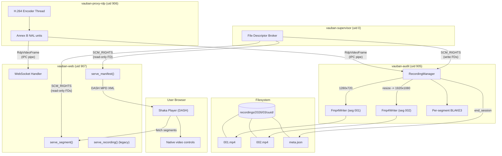
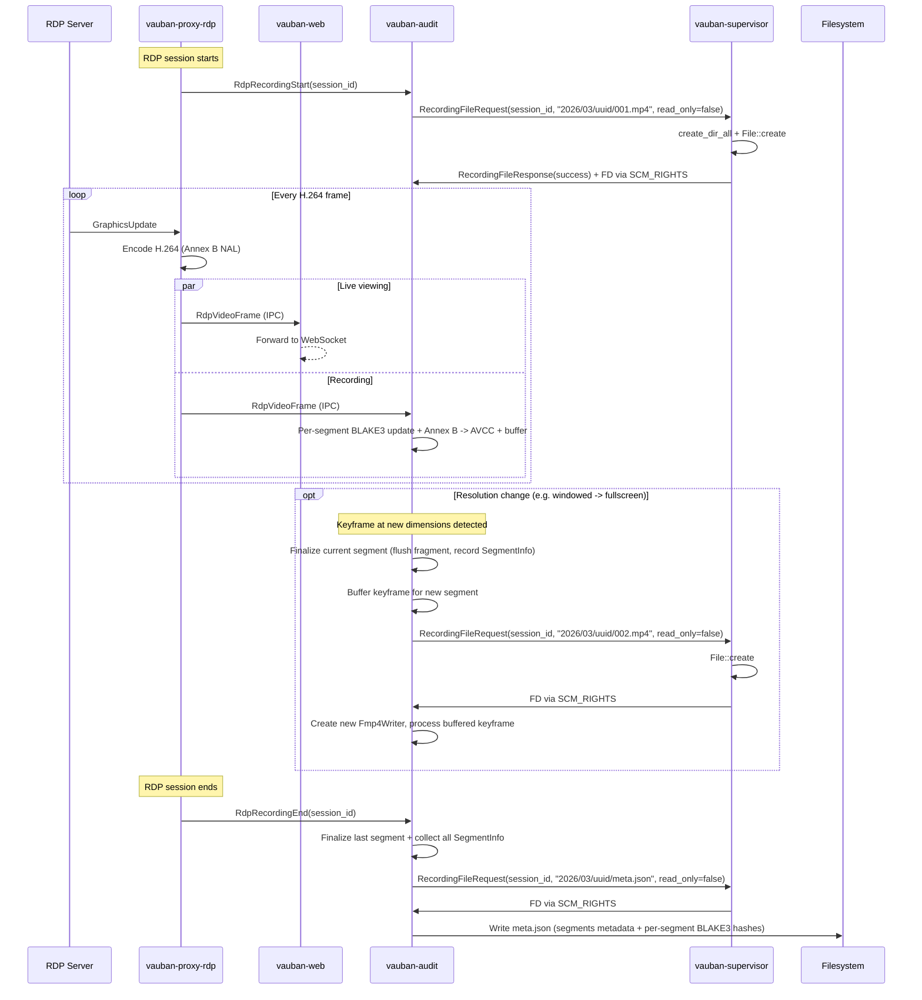
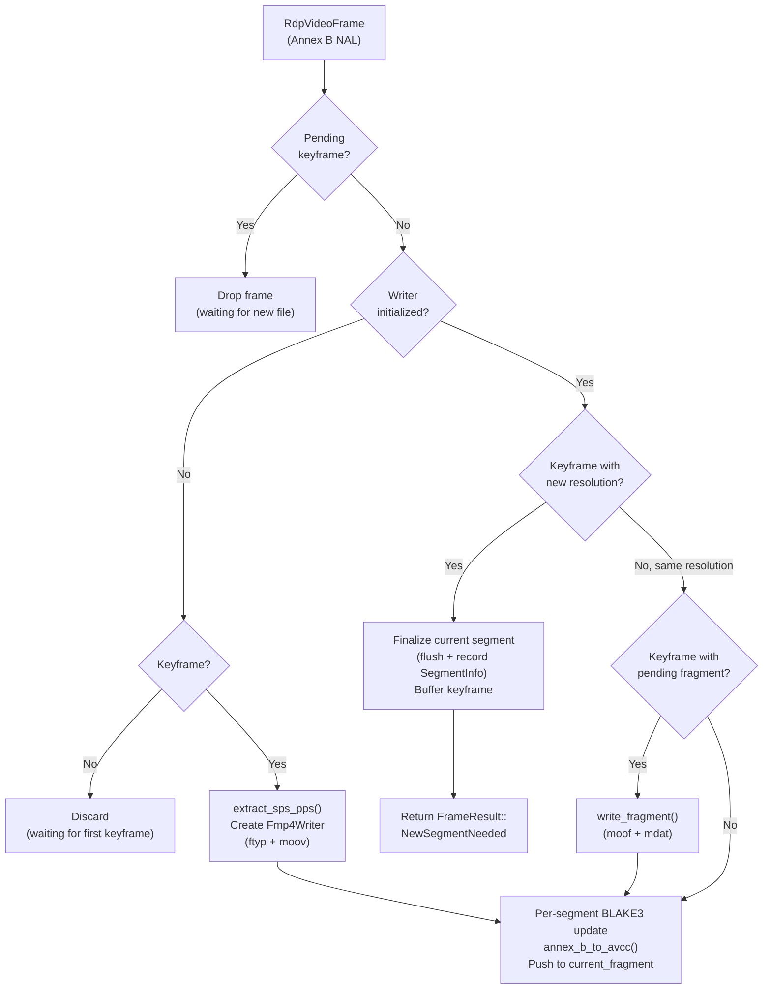
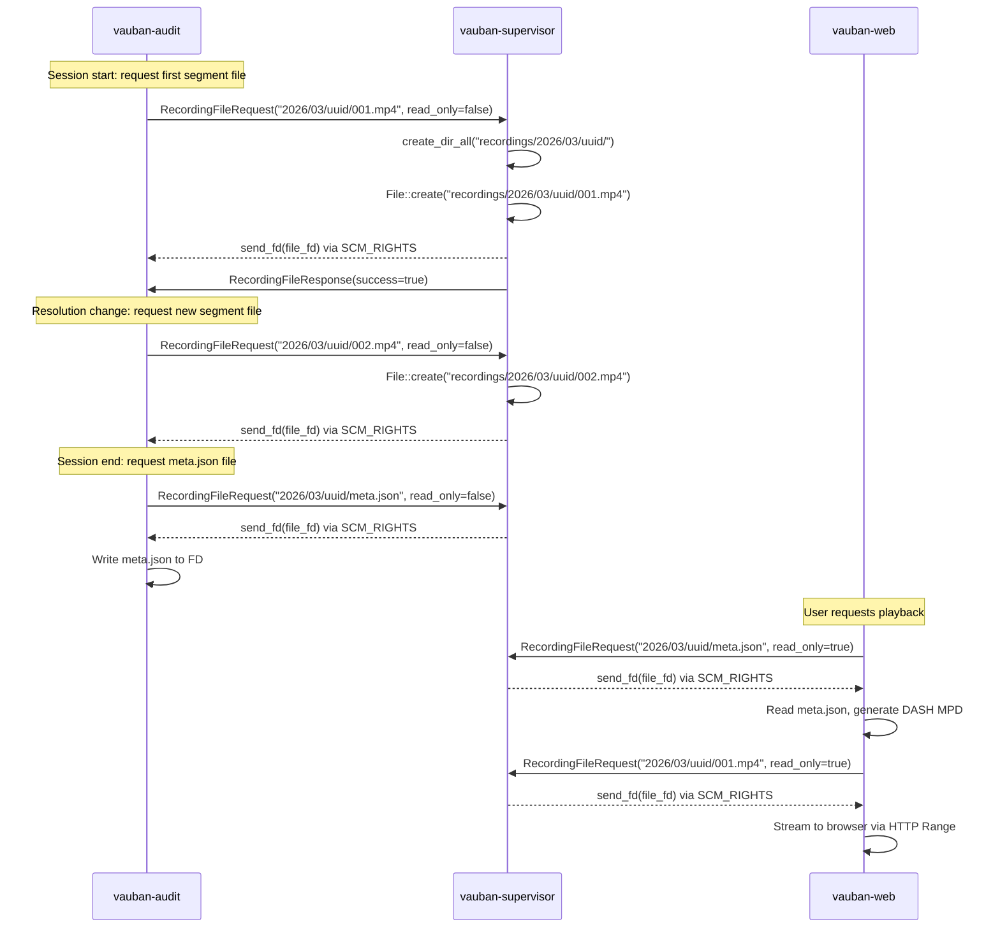
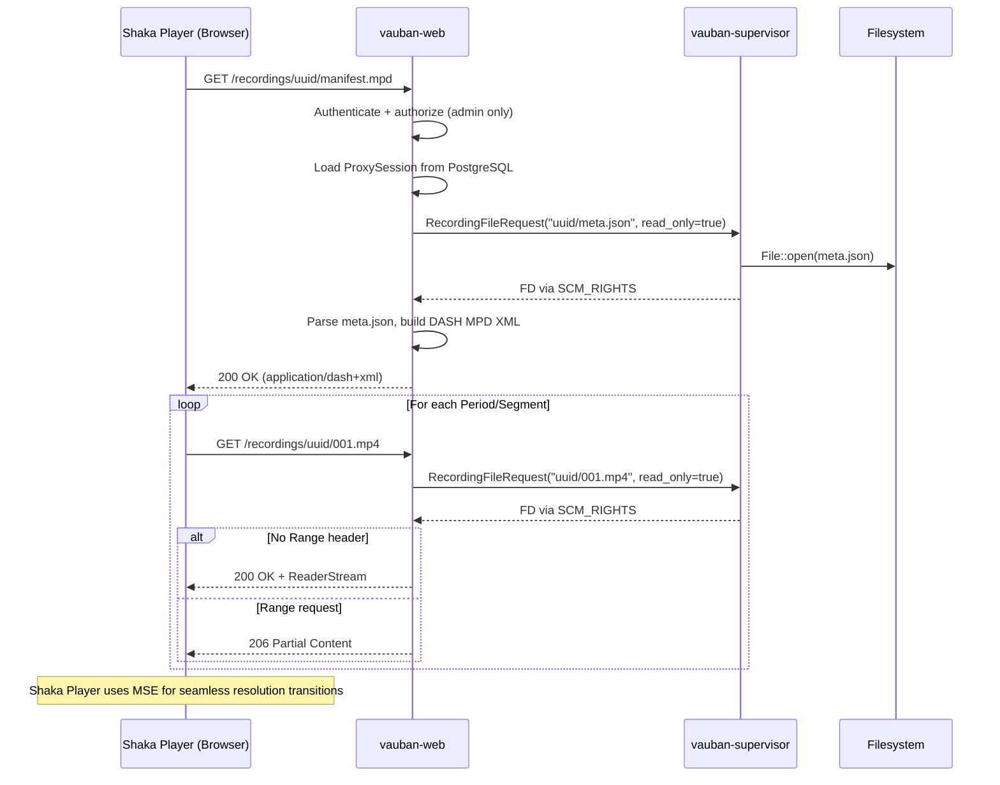
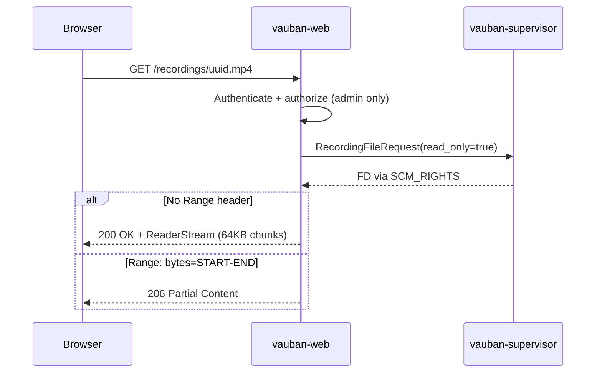

# Vauban Session Recording Architecture

**Version:** 1.1  
**Date:** 7 March 2026  
**Author:** Richard Ben Aleya

---

## Changelog from v1.0

| Change | Description |
|--------|-------------|
| Recording segmentation | Split fMP4 into segments on resolution change (one `moov` per epoch) |
| DASH multi-Period playback | Shaka Player replaces native `<video>` for segmented recordings |
| Per-segment BLAKE3 | Independent hash per segment, stored in `meta.json` |
| Directory-based storage | `YYYY/MM/uuid/` replaces `YYYY/MM/uuid.mp4` |
| Backward compatibility | Legacy `.mp4` recordings still play with native `<video>` |
| Post-resize grace period | 500ms encoding holdoff eliminates black frames after resolution changes |
| DASH profile `isoff-main` | `SegmentList` with explicit byte ranges (no `sidx` box requirement) |
| CSP `media-src blob:` | Required for Shaka Player / MSE blob URL playback |
| External Shaka init script | Moved inline `<script>` to `/static/js/shaka-init.js` for CSP compliance |

---

## Table of Contents

1. [Introduction](#1-introduction)
2. [Architecture Overview](#2-architecture-overview)
3. [Recording Pipeline](#3-recording-pipeline)
4. [Segmentation Logic](#4-segmentation-logic)
5. [Fragmented MP4 Container](#5-fragmented-mp4-container)
6. [Integrity Verification](#6-integrity-verification)
7. [File Descriptor Delegation](#7-file-descriptor-delegation)
8. [Playback Architecture](#8-playback-architecture)
9. [DASH MPD Generation](#9-dash-mpd-generation)
10. [Security Design](#10-security-design)
11. [Testing Strategy](#11-testing-strategy)
12. [Architecture Decisions](#12-architecture-decisions)

---

## 1. Introduction

### 1.1 Background

Vauban's RDP proxy (`vauban-proxy-rdp`) encodes the desktop as an H.264 Annex B NAL stream for live viewing via WebCodecs (see [RDP Session Architecture](Vauban_RDP_Architecture_EN(1.0).md)). Recording leverages this existing encoding pipeline: the same NAL units sent to the browser are simultaneously forwarded to `vauban-audit` for persistent storage.

### 1.2 Problem Statement (v1.0 Limitation)

In v1.0, the entire recording session was written as a single fMP4 file. The `moov` box (containing SPS/PPS codec parameters and video dimensions) was written when the first keyframe arrived and never updated. When the user switched between windowed (e.g. 1280x720) and fullscreen (e.g. 1920x1080), the resolution change invalidated the `moov` parameters, making the entire MP4 unplayable.

### 1.3 Design Goals

| Goal | Approach |
|------|----------|
| Zero-copy recording | Reuse existing H.264 NAL units -- no re-encoding |
| Crash resilience | Fragmented MP4 (fMP4): each GOP is flushed immediately |
| Dynamic resolution | Segmentation: new fMP4 per resolution epoch |
| Seamless playback | DASH multi-Period via Shaka Player (MSE) |
| Tamper detection | Per-segment BLAKE3 hashes in `meta.json` |
| Sandbox compatibility | File descriptors delegated by supervisor via SCM_RIGHTS |
| Efficient playback | HTTP Range requests with chunked streaming (~64 KB memory) |
| Native controls | Shaka Player with native browser `<video>` controls |
| Backward compatible | Legacy single-file recordings still play with native `<video>` |

### 1.4 Scope

This document covers the recording pipeline from H.264 frame capture in `vauban-proxy-rdp` to segmented fMP4 storage in `vauban-audit`, DASH MPD generation, and Shaka Player playback in `vauban-web`. It supersedes [v1.0](Vauban_Recording_Architecture_EN(1.0).md) for the recording and playback sections while maintaining backward compatibility with legacy recordings.

---

## 2. Architecture Overview

### 2.1 End-to-End Data Flow



### 2.2 Module Structure

```
vauban-audit/src/
    main.rs                   # IPC dispatcher, SCM_RIGHTS file requests,
                              # mid-session segment file requests, meta.json writing
    recording_manager.rs      # Session lifecycle, segmentation logic,
                              # FrameResult, SegmentInfo, per-segment BLAKE3
    fmp4_writer.rs            # ISO BMFF box generation, fragment flushing,
                              # init_size(), codec_string_from_sps()

vauban-web/src/
    handlers/web/sessions.rs  # serve_recording() (legacy), serve_manifest() (DASH MPD),
                              # serve_segment() (per-segment HTTP Range)
    ipc/supervisor.rs         # request_recording_file() (read-only FD)
    templates/sessions/
        recording_play.rs     # RecordingData.is_segmented(), conditional rendering
    static_assets.rs          # Shaka Player compiled JS (Apache-2.0)

vauban-web/templates/sessions/
    recording_play.html       # Conditional: Shaka Player (segmented) or native video (legacy)

vauban-web/static/js/
    shaka-player.compiled.js  # Google Shaka Player v4.16 (Apache-2.0 licensed)
    shaka-init.js             # Player initialization (reads data-manifest from <video>)

vauban-proxy-rdp/src/
    session.rs                # Dual dispatch: WebSocket + audit IPC,
                              # post-resize grace period (suppress_encoding_until)

shared/src/
    messages.rs               # RecordingFileRequest, RecordingFileResponse,
                              # RdpRecordingStart, RdpRecordingEnd
```

### 2.3 Dependencies

| Crate / Library | Used by | Purpose |
|-------|---------|---------|
| `blake3` | vauban-audit | Per-segment cryptographic hashing of raw frame data |
| `serde_json` | vauban-audit | `meta.json` serialization/deserialization |
| `tokio-util` | vauban-web | `ReaderStream` for chunked HTTP streaming |
| `tempfile` | vauban-audit (tests) | Temporary files for recording tests |
| Shaka Player | vauban-web (frontend) | DASH multi-Period playback via MSE (Apache-2.0) |

---

## 3. Recording Pipeline

### 3.1 Frame Capture

When an RDP session is active and H.264 encoding is enabled, each encoded frame is dispatched to two destinations simultaneously:

1. **Live viewing**: sent via IPC to `vauban-web`, then over WebSocket to the browser
2. **Recording**: sent via IPC to `vauban-audit` for persistent storage



### 3.2 Recording Manager

`RecordingManager` tracks all active recording sessions with support for dynamic resolution segmentation. It receives pre-opened `File` handles and never performs filesystem I/O directly, following the principle of least privilege under Capsicum.

| Responsibility | Method | Returns |
|----------------|--------|---------|
| Start recording | `start_session(session_id, File, relative_path)` | -- |
| Process frame | `handle_frame(session_id, timestamp_us, is_keyframe, w, h, data)` | `FrameResult` |
| Provide new segment file | `provide_segment_file(session_id, File)` | -- |
| End recording | `end_session(session_id)` | `Option<EndSessionResult>` |
| Serialize metadata | `serialize_meta_json(segments)` | JSON string |

Key behaviors:

- **Lazy initialization**: the `Fmp4Writer` is not created until the first keyframe arrives, because SPS/PPS parameters (required for the `moov` box) are only present in keyframes
- **P-frames before first keyframe**: silently discarded (cannot be decoded without SPS/PPS)
- **Fragment flushing**: each GOP (keyframe + following P-frames) is accumulated in memory, then flushed as a `moof+mdat` pair when the next keyframe arrives
- **Concurrent sessions**: multiple sessions can be recorded simultaneously (keyed by `session_id`)
- **Resolution change detection**: when a keyframe arrives with different dimensions, the current segment is finalized, a `FrameResult::NewSegmentNeeded` is returned, and the keyframe is buffered until a new file is provided
- **Per-segment BLAKE3**: each segment has its own independent BLAKE3 hash, reset on segment boundaries
- **Segment metadata**: `SegmentInfo` captures index, dimensions, duration, init_size, BLAKE3 hash, and codec string for MPD generation

### 3.3 Frame Processing



### 3.4 Post-Resize Grace Period

When the desktop resolution changes (DeactivateAll / Reactivation sequence in RDP), the framebuffer (`DecodedImage`) is recreated at the new dimensions and initialized to zeros (black). The RDP server then progressively rebuilds the screen via incremental region updates, which typically takes 200-500ms. Without mitigation, the encoder would capture and record these intermediate black/partial states, producing ~1-2 seconds of black frames at the beginning of each new segment.

#### 3.4.1 Problem

```
t=0ms     DecodedImage::new(new_w, new_h)       Framebuffer = all zeros (black)
t=0ms     EncoderCommand::Reconfigure           Encoder ready for new dimensions
t=0ms     framebuffer_dirty = true              Triggers immediate encode
t=16ms    encode tick                           Encodes BLACK framebuffer as keyframe
t=32ms    encode tick                           dirty=false, skip
...
t=200ms   1st RDP update (partial region)       dirty=true -> encode mostly-black frame
t=220ms   2nd RDP update (another region)       dirty=true -> encode partially-black frame
...
t=1500ms  Last RDP update                       Framebuffer finally complete
```

#### 3.4.2 Solution: Encoding Suppression

After a resolution change, encoding is suppressed for a 500ms grace period (`suppress_encoding_until`). During this window, RDP graphics updates arrive and populate the framebuffer normally, but no frames are captured or encoded. When the grace period expires, a `ForceKeyframe` command is sent to the encoder and encoding resumes with the now-complete framebuffer.

```
t=0ms     DecodedImage::new(new_w, new_h)       Framebuffer = black
t=0ms     EncoderCommand::Reconfigure           Encoder ready
t=0ms     suppress_encoding_until = now+500ms   Grace period starts
          (NO ForceKeyframe, NO framebuffer_dirty)

          During 500ms:
          - RDP updates arrive and fill framebuffer
          - Encode ticks are skipped (grace period active)
          - framebuffer_dirty accumulates naturally

t=500ms   Grace period expires
          -> ForceKeyframe sent to encoder
          -> suppress_encoding_until cleared
          -> Next tick: encode COMPLETE framebuffer as keyframe
```

#### 3.4.3 Guarantees

| Constraint | Satisfied |
|---|---|
| Zero black frames recorded | Yes -- no encoding during grace period |
| Zero real frames lost | Yes -- first frame after grace period contains all accumulated updates |
| Keyframe at segment boundary | Yes -- ForceKeyframe sent when grace period expires |
| No timestamp discontinuity | Yes -- timestamps continue progressing normally |
| Live stream impact | Minimal -- 500ms freeze during resolution transition (expected by user) |

### 3.5 Timestamp Handling

Frame timestamps arrive in microseconds from the H.264 encoder. They are converted to the MP4's 90 kHz timescale:

```
duration_ticks = round(duration_us / (1_000_000 / 90_000))
               = round(duration_us / 11.111...)
```

When two consecutive frames have the same timestamp (duration = 0), a fallback duration of 3000 ticks (~33 ms, equivalent to 30 FPS) is used.

---

## 4. Segmentation Logic

### 4.1 Why Segmentation?

The root cause of the v1.0 problem is that the `moov` box in an fMP4 file contains fixed SPS/PPS parameters and dimensions. When the desktop resolution changes mid-session, these parameters become invalid. Re-writing `moov` mid-stream is not possible in a forward-only fMP4 writer.

Segmentation solves this by creating a new fMP4 file (with its own valid `moov`) whenever the resolution changes. Each segment is self-contained and independently playable.

### 4.2 Segment Split Flow

When `handle_frame()` receives a keyframe with dimensions different from the current segment:

1. **Flush**: write any pending fragment to the current segment
2. **Finalize**: record `SegmentInfo` (init_size, duration_ticks, BLAKE3 hash, codec_string)
3. **Buffer**: store the new keyframe data in `pending_keyframe`
4. **Signal**: return `FrameResult::NewSegmentNeeded { relative_path }` to the caller

The caller (`vauban-audit/main.rs`) requests a new file from the supervisor via SCM_RIGHTS, then calls `provide_segment_file()`:

1. **Reset**: create new per-segment BLAKE3 hasher, hash the buffered keyframe
2. **Init**: extract SPS/PPS from the buffered keyframe, create new `Fmp4Writer`
3. **Process**: write the buffered keyframe as the first frame of the new segment

### 4.3 Types

```rust
pub struct SegmentInfo {
    pub index: u32,          // 1-based segment number
    pub width: u16,
    pub height: u16,
    pub duration_ticks: u64, // Total duration in 90 kHz timescale
    pub init_size: u64,      // Size of ftyp+moov (for DASH Initialization range)
    pub file_size: u64,      // Total file size (for DASH SegmentURL mediaRange)
    pub blake3_hex: String,  // Per-segment BLAKE3 hash
    pub codec_string: String,// e.g. "avc1.42c01e" (for DASH codecs attribute)
}

pub enum FrameResult {
    Processed,
    NewSegmentNeeded { relative_path: String },
}

pub struct EndSessionResult {
    pub segments: Vec<SegmentInfo>,
    pub meta_json_relative_path: String,
    pub total_frames: u64,
    pub total_bytes: u64,
}
```

### 4.4 Edge Cases

| Scenario | Behavior |
|----------|----------|
| No resolution change | Single segment, identical to v1.0 behavior |
| P-frame at mismatched resolution | Dropped (defensive; should not occur in practice) |
| Frames while waiting for new file | Dropped (pending_keyframe is set) |
| Resolution change back to original | New segment created (720 -> 1080 -> 720 = 3 segments) |
| Crash during segment split | Previous segment's flushed fragments survive |
| Session ends before any keyframe | `end_session()` returns `None` |
| Black frames after resize | Eliminated by 500ms encoding grace period (Section 3.4) |

---

## 5. Fragmented MP4 Container

### 5.1 Why Fragmented MP4?

Standard MP4 files place the `moov` atom (containing sample tables, offsets, and durations for every frame) either at the beginning or end of the file. This requires knowing all frame data upfront, or rewriting the file header after recording completes.

Fragmented MP4 (fMP4) solves this by:

1. Writing a minimal `moov` with only codec configuration (SPS/PPS) at the start
2. Appending each GOP as an independent `moof+mdat` fragment
3. Each fragment is self-describing (contains its own sample table)

This provides **crash resilience**: if the process terminates unexpectedly, all previously flushed fragments remain playable. Only the current in-progress GOP is lost.

### 5.2 File Structure

```
ftyp                              # File type: isom, iso5, iso6, mp41
moov                              # Movie header (minimal for fragmented)
    mvhd                          # Movie header (timescale=90kHz, duration=0)
    trak                          # Single video track
        tkhd                      # Track header (track_id=1, dimensions)
        mdia                      # Media container
            mdhd                  # Media header (timescale=90kHz)
            hdlr                  # Handler: "vide" / "Vauban Video"
            minf                  # Media information
                vmhd              # Video media header
                dinf/dref         # Data reference (self-contained)
                stbl              # Sample table (empty -- data in fragments)
                    stsd          # Sample description
                        avc1      # AVC visual sample entry
                            avcC  # AVC decoder config (SPS, PPS)
                    stts          # (empty)
                    stsc          # (empty)
                    stsz          # (empty)
                    stco          # (empty)
    mvex                          # Movie extends (signals fragmentation)
        trex                      # Track extends defaults

[moof + mdat]*                    # Repeated for each GOP
    moof                          # Movie fragment
        mfhd                      # Fragment header (sequence_number)
        traf                      # Track fragment
            tfhd                  # Track fragment header (track_id=1)
            tfdt                  # Track fragment decode time (v1, 64-bit)
            trun                  # Track run (sample count, data_offset,
                                  #   per-sample: duration, size, flags)
    mdat                          # Media data (AVCC-formatted NAL units)
```

### 5.3 NAL Unit Format Conversion

The H.264 encoder produces Annex B format (start codes `0x00000001`), but MP4 containers require AVCC format (4-byte big-endian length prefix). The conversion pipeline:

```
Annex B input:  [00 00 00 01] [67 SPS...] [00 00 00 01] [68 PPS...] [00 00 00 01] [65 IDR...]
                     |              |           |              |           |            |
                     v              v           v              v           v            v
              start code       extracted    start code     extracted   start code    kept in
                removed       -> moov/avcC    removed     -> moov/avcC   removed    mdat as AVCC

AVCC output:   [00 00 00 03] [65 IDR...]
                  length=3     IDR slice data
```

SPS (NAL type 7) and PPS (NAL type 8) are extracted from the first keyframe and stored in the `avcC` box inside `moov`. They are stripped from subsequent `mdat` payloads since the decoder reads them from the container header.

### 5.4 Codec String Extraction

The `codec_string_from_sps()` function extracts the AVC codec string from SPS NAL unit bytes for use in the DASH MPD:

```
SPS bytes:  [0x67, profile_idc, constraint_flags, level_idc, ...]
            
codec_string = "avc1." + hex(profile_idc) + hex(constraint_flags) + hex(level_idc)

Example: SPS [0x67, 0x42, 0xC0, 0x1E, ...] -> "avc1.42c01e" (Baseline, Level 3.0)
```

### 5.5 Init Size

The `init_size` field records the byte count of `ftyp + moov` written at segment initialization. This value is used by the DASH MPD as the `Initialization range` attribute, telling Shaka Player which bytes to fetch first to initialize the decoder.

### 5.6 Sample Flags

Each sample in the `trun` box carries flags indicating its decode dependencies:

| Frame Type | Flags | Meaning |
|-----------|-------|---------|
| Keyframe (IDR) | `0x02000000` | `sample_depends_on=2` (does not depend on others) |
| P-frame | `0x01010000` | `sample_depends_on=1` + `sample_is_non_sync_sample` |

---

## 6. Integrity Verification

### 6.1 Per-Segment BLAKE3 Hashing

Every raw H.264 frame (Annex B, before AVCC conversion) is fed to a per-segment BLAKE3 incremental hasher. The hasher is reset when a new segment begins. When the segment is finalized (either by a resolution change or session end), the hash is recorded in `SegmentInfo`. All segment metadata is written to `meta.json`:

```
recordings/2026/03/uuid/
    001.mp4             # Segment 1 (e.g. 1280x720)
    002.mp4             # Segment 2 (e.g. 1920x1080)
    meta.json           # Segment metadata with per-segment BLAKE3 hashes
```

`meta.json` structure:

```json
{
    "segments": [
        {
            "index": 1,
            "width": 1280,
            "height": 720,
            "duration_ticks": 450000,
            "init_size": 512,
            "file_size": 524288,
            "blake3_hex": "a1b2c3d4e5f6...",
            "codec_string": "avc1.42c01e"
        },
        {
            "index": 2,
            "width": 1920,
            "height": 1080,
            "duration_ticks": 900000,
            "init_size": 640,
            "file_size": 1048576,
            "blake3_hex": "e5f6a7b8c9d0...",
            "codec_string": "avc1.42c01e"
        }
    ]
}
```

### 6.2 Why BLAKE3?

| Property | Benefit |
|----------|---------|
| Speed | ~3x faster than SHA-256 on modern hardware |
| Incremental | Streaming hash -- no need to buffer frames |
| Tree structure | Parallelizable for future multi-threaded verification |
| Cryptographic | Collision-resistant, suitable for tamper detection |

### 6.3 Verification Workflow

An administrator can verify a recording's integrity by recomputing the BLAKE3 hash from the raw H.264 frames in each segment and comparing to the hashes stored in `meta.json`. This proves that:

1. Each segment was not modified after capture
2. All frames within each segment are present and in the original order
3. No frames were inserted or removed

---

## 7. File Descriptor Delegation

### 7.1 Problem

Both `vauban-audit` and `vauban-web` run inside Capsicum sandboxes on FreeBSD. After `cap_enter()`, they cannot:

- Call `open()`, `create()`, or any filesystem-accessing syscall
- Create directories with `mkdir()`
- Resolve paths with `stat()` or `access()`

Recording requires creating new files (audit writes) and reading existing files (web playback). With segmentation, `vauban-audit` may need to request additional file descriptors mid-session when a resolution change triggers a new segment.

### 7.2 Solution: SCM_RIGHTS File Descriptor Passing

The same mechanism used for TCP connection brokering (see [Privilege Separation Architecture, Section 5.5](Vauban_Privsep_Architecture_EN(1.2).md)) is reused for recording files:



### 7.3 Message Protocol

```rust
RecordingFileRequest {
    request_id: u64,        // Correlates request/response (async support)
    session_id: String,
    relative_path: String,  // e.g. "2026/03/uuid/001.mp4" or "2026/03/uuid/meta.json"
    read_only: bool,        // true = open existing (web), false = create new (audit)
}

RecordingFileResponse {
    request_id: u64,
    session_id: String,
    success: bool,
    error: Option<String>,  // Human-readable error if success=false
}
```

### 7.4 Capsicum Sandbox Compliance

| Service | Can access recordings directory? | How it accesses files |
|---------|----------------------------------|----------------------|
| vauban-supervisor | Yes (not sandboxed) | Direct filesystem I/O |
| vauban-audit | No (sandboxed) | Writes to FDs received via SCM_RIGHTS |
| vauban-web | No (sandboxed) | Reads from FDs received via SCM_RIGHTS |
| vauban-proxy-rdp | No (sandboxed) | Never accesses recording files |

---

## 8. Playback Architecture

### 8.1 Segmented Playback (DASH + Shaka Player)

New recordings use DASH multi-Period playback via Shaka Player. The browser fetches a dynamically generated MPD manifest, then requests individual segments as needed.



### 8.2 Legacy Playback (HTTP Range)

Recordings from before the segmentation update (single `.mp4` files) continue to use the native `<video>` element with HTTP Range:



### 8.3 Segmented vs Legacy Detection

The `recording_path` stored in PostgreSQL determines the playback mode:

| Path format | Example | Mode | Player |
|------------|---------|------|--------|
| Ends with `/` | `recordings/2026/03/uuid/` | Segmented | Shaka Player + DASH |
| Ends with `.mp4` | `recordings/2026/02/uuid.mp4` | Legacy | Native `<video>` |

### 8.4 Memory Efficiency

The playback handler never loads the entire file into memory. It uses `tokio-util::io::ReaderStream` to stream segments in 64 KB chunks:

| Approach | Memory per request | Seeking |
|----------|-------------------|---------|
| `read_to_end()` (naive) | Entire file size | No |
| `ReaderStream` + Range | ~64 KB (constant) | Yes, via `206 Partial Content` |

### 8.5 HTTP Range Support

Both segment and legacy endpoints support the standard HTTP Range protocol:

| Request | Response | Headers |
|---------|----------|---------|
| No Range header | `200 OK` | `Content-Length`, `Accept-Ranges: bytes` |
| `Range: bytes=0-` | `206 Partial Content` | `Content-Range: bytes 0-N/TOTAL` |
| `Range: bytes=5242880-` | `206 Partial Content` | `Content-Range: bytes 5242880-N/TOTAL` |

### 8.6 Frontend Player

The recording playback page conditionally renders either Shaka Player (for segmented recordings) or a native `<video>` element (for legacy recordings).

**Segmented recordings** (Shaka Player + DASH):

```html
<video id="recordingVideo" controls playsinline preload="metadata"
       data-manifest="/recordings/uuid/manifest.mpd"></video>
<script src="/static/js/shaka-player.compiled.js"></script>
<script src="/static/js/shaka-init.js"></script>
```

The initialization script (`shaka-init.js`) reads the manifest URL from the `data-manifest` attribute, chains `player.attach(video)` as a Promise before `player.load()` (required by Shaka v4), and is served as an external file for CSP compliance (no `'unsafe-inline'` in `script-src`).

**Legacy recordings** (native `<video>`):

```html
<video controls playsinline preload="metadata">
    <source src="/recordings/uuid.mp4" type="video/mp4">
</video>
```

Both approaches provide:

- Play/pause, seek bar, volume, fullscreen (native browser controls)
- Hardware-accelerated decoding
- Picture-in-picture support
- Keyboard shortcuts (spacebar, arrow keys)

Shaka Player additionally provides:

- Seamless resolution transitions via MSE (no playback interruption)
- Automatic DASH Period management for multi-segment recordings

### 8.7 Web Routes

```rust
// Segmented recording endpoints
.route("/recordings/{session_uuid}/manifest.mpd", get(serve_manifest))
.route("/recordings/{session_uuid}/{segment}", get(serve_segment))

// Legacy recording endpoint (kept for backward compatibility)
.route("/recordings/{session_uuid}", get(serve_recording))
```

---

## 9. DASH MPD Generation

### 9.1 Overview

The `serve_manifest()` endpoint dynamically generates a DASH MPD (Media Presentation Description) XML document from the `meta.json` file. Each recording segment becomes a DASH Period, allowing Shaka Player to handle seamless transitions between segments with different resolutions.

### 9.2 MPD Structure

```xml
<?xml version="1.0" encoding="UTF-8"?>
<MPD xmlns="urn:mpeg:dash:schema:mpd:2011"
     type="static"
     mediaPresentationDuration="PT0H10M30.500S"
     minBufferTime="PT2S"
     profiles="urn:mpeg:dash:profile:isoff-main:2011">
  <Period id="1" duration="PT0H5M15.000S">
    <AdaptationSet mimeType="video/mp4" startWithSAP="1">
      <Representation id="1" codecs="avc1.42c01e"
                      width="1280" height="720" bandwidth="500000">
        <BaseURL>/recordings/uuid/001.mp4</BaseURL>
        <SegmentList>
          <Initialization range="0-511"/>
          <SegmentURL mediaRange="512-524287"/>
        </SegmentList>
      </Representation>
    </AdaptationSet>
  </Period>
  <Period id="2" duration="PT0H5M15.500S">
    <AdaptationSet mimeType="video/mp4" startWithSAP="1">
      <Representation id="2" codecs="avc1.42c01e"
                      width="1920" height="1080" bandwidth="500000">
        <BaseURL>/recordings/uuid/002.mp4</BaseURL>
        <SegmentList>
          <Initialization range="0-639"/>
          <SegmentURL mediaRange="640-1048575"/>
        </SegmentList>
      </Representation>
    </AdaptationSet>
  </Period>
</MPD>
```

The `isoff-main` profile with `SegmentList` is used instead of `isoff-on-demand` with `SegmentBase` because our fMP4 writer does not produce `sidx` (Segment Index) boxes. `SegmentList` provides explicit byte ranges for the initialization segment (`ftyp+moov`) and the media data (`moof+mdat` pairs), removing the need for `sidx`.

### 9.3 Key Attributes

| Attribute | Source | Purpose |
|-----------|--------|---------|
| `mediaPresentationDuration` | Sum of all segment durations | Total recording length |
| `Period.duration` | `SegmentInfo.duration_ticks / 90000` | Individual segment length |
| `Representation.codecs` | `SegmentInfo.codec_string` | Decoder initialization |
| `Representation.width/height` | `SegmentInfo.width/height` | Resolution for this period |
| `Initialization.range` | `0-{SegmentInfo.init_size - 1}` | ftyp+moov byte range |
| `SegmentURL.mediaRange` | `{init_size}-{file_size - 1}` | moof+mdat byte range |
| `BaseURL` | `/recordings/{uuid}/{index:03}.mp4` | Segment file URL |

### 9.4 Duration Format

Durations are converted from 90 kHz ticks to ISO 8601 duration format (`PTxHyMz.zzzS`):

```
seconds = duration_ticks / 90000.0
hours   = floor(seconds / 3600)
minutes = floor((seconds % 3600) / 60)
secs    = seconds % 60
```

---

## 10. Security Design

### 10.1 Access Control

Recording playback is restricted to administrators:

```
serve_manifest()  -> is_admin(auth_user) -> 403 if not admin
serve_segment()   -> is_admin(auth_user) -> 403 if not admin
serve_recording() -> is_admin(auth_user) -> 403 if not admin
```

The UUID in the URL is validated against the `proxy_sessions` table in PostgreSQL. A valid UUID must:

1. Exist in the database
2. Have `is_recorded = true`
3. Have a non-null `recording_path`

### 10.2 Path Traversal Prevention

`vauban-web` never accesses the filesystem directly. The `recording_path` stored in PostgreSQL is stripped to a relative path, which is sent to the supervisor. The supervisor resolves the path relative to a configured `recording_storage_path` root. Any attempt to traverse outside this root is prevented by the supervisor's path resolution.

For segment endpoints, the segment index is validated to contain only ASCII digits, preventing path injection.

### 10.3 Content Security Policy

Shaka Player initialization is handled by an external script (`/static/js/shaka-init.js`) loaded from the same origin, which complies with the strict CSP (`script-src` does not include `'unsafe-inline'`). The script reads the manifest URL from a `data-manifest` attribute on the `<video>` element, avoiding any inline JavaScript.

The CSP includes `media-src 'self' blob:` because Shaka Player uses Media Source Extensions (MSE), which creates blob URLs to feed decoded media to the `<video>` element. Without this directive, the browser would block playback.

---

## 11. Testing Strategy

### 11.1 fMP4 Writer Tests (`fmp4_writer.rs`)

| Test | Purpose |
|------|---------|
| `test_parse_annex_b_nals_4byte_start_code` | Parse NAL units with 4-byte start codes |
| `test_parse_annex_b_nals_3byte_start_code` | Parse NAL units with 3-byte start codes |
| `test_parse_annex_b_multiple_nals` | Parse stream with SPS + PPS + IDR |
| `test_parse_annex_b_empty_data` | Handle empty input gracefully |
| `test_extract_sps_pps` | Extract SPS and PPS from Annex B stream |
| `test_extract_sps_pps_no_sps` | Handle stream without SPS/PPS |
| `test_annex_b_to_avcc_strips_sps_pps` | AVCC output excludes SPS/PPS (in moov) |
| `test_annex_b_to_avcc_preserves_idr_and_non_idr` | IDR and non-IDR slices preserved |
| `test_ftyp_structure` | ftyp box has correct brand (`isom`) |
| `test_fmp4_writer_creates_valid_header` | ftyp + moov written on initialization |
| `test_fmp4_writer_single_fragment` | Single GOP produces ftyp+moov+moof+mdat |
| `test_fmp4_writer_multiple_fragments` | Multiple GOPs produce correct moof count |
| `test_fmp4_writer_bytes_written` | Byte counter tracks written data |
| `test_empty_fragment_is_noop` | Empty fragment produces no output |
| `test_mdat_contains_sample_data` | mdat payload matches input data |
| `test_data_offset_points_to_mdat_payload` | trun data_offset correctly points to mdat |
| `test_truncated_file_has_valid_prefix` | Crash-truncated file has valid box structure |
| `test_sequential_fragment_base_decode_time` | baseDecodeTime advances across fragments |
| `test_avcc_box_structure` | avcC box has correct profile/level/SPS/PPS |
| `test_avc1_visual_sample_entry_layout` | avc1 box layout matches ISO 14496-12 |
| `test_moov_contains_required_boxes` | moov contains mvhd, trak, mvex |
| `test_init_size_matches_ftyp_moov` | init_size() equals ftyp + moov byte count |
| `test_codec_string_baseline` | Baseline SPS produces `avc1.42c01e` |
| `test_codec_string_extraction` | Various SPS bytes produce correct codec strings |

### 11.2 Recording Manager Tests (`recording_manager.rs`)

| Test | Purpose |
|------|---------|
| `test_recording_manager_full_lifecycle` | Complete flow with 1 segment |
| `test_recording_manager_ignores_pframes_before_keyframe` | P-frames discarded before first keyframe |
| `test_recording_manager_unknown_session` | Frames for unknown sessions are ignored |
| `test_recording_manager_duplicate_start` | Duplicate start for same session is idempotent |
| `test_recording_end_without_keyframe` | End before any keyframe returns None |
| `test_blake3_hash_matches_frame_data` | Per-segment BLAKE3 matches independently computed hash |
| `test_multiple_concurrent_sessions` | Two sessions recorded simultaneously |
| `test_crash_resilience_partial_recording` | Drop without end_session: flushed fragments survive |
| `test_single_keyframe_recording` | Single-frame recording produces valid fMP4 |
| `test_only_pframes_produces_no_output` | Session with only P-frames produces empty file |
| `test_compute_relative_path_format` | Path follows YYYY/MM/uuid/001.mp4 pattern |
| `test_single_segment_no_resize` | Full lifecycle without resize: 1 segment + valid meta |
| `test_segment_split_on_resolution_change` | Keyframe at new dims triggers split, 2 segments |
| `test_multiple_resolution_changes` | 3 resolutions -> 3 segments with correct metadata |
| `test_resolution_change_back_to_original` | 720 -> 1080 -> 720 produces 3 segments |
| `test_pframe_before_new_keyframe_stays_in_current_segment` | P-frames at old resolution stay in current segment |
| `test_segment_blake3_independent` | Each segment has its own independent BLAKE3 hash |
| `test_segment_init_size_recorded` | init_size matches ftyp+moov bytes |
| `test_segment_codec_string` | codec_string correctly extracted from SPS |
| `test_segment_duration_computed` | duration_ticks accumulates correctly |
| `test_meta_json_structure` | Serialized meta.json has correct schema |
| `test_provide_segment_file_processes_buffered_keyframe` | Buffered keyframe written to new segment |
| `test_end_session_returns_all_segments` | EndSessionResult contains all segment infos |
| `test_crash_resilience_mid_segment_split` | Flushed fragments survive crash during split |
| `test_compute_relative_path_segmented` | Segmented path format YYYY/MM/uuid/001.mp4 |
| `test_full_lifecycle_with_resize_meta_roundtrip` | Full flow with resize: 2 fMP4 + meta.json round-trip |
| `test_full_lifecycle_without_resize_meta_roundtrip` | Full flow no resize: 1 fMP4 + meta.json round-trip |

### 11.3 DASH MPD Generation Tests (`sessions.rs`)

| Test | Purpose |
|------|---------|
| `test_mpd_single_period` | 1 segment -> MPD with 1 Period |
| `test_mpd_multi_period` | 3 segments -> MPD with 3 Periods, correct durations/resolutions |
| `test_mpd_initialization_range` | Initialization range matches segment init_size |

### 11.4 HTTP Range Tests (`sessions.rs`)

| Test | Purpose |
|------|---------|
| `test_range_open_ended` | `bytes=0-` and `bytes=N-` parse correctly |
| `test_range_closed` | `bytes=0-999` and `bytes=100-200` parse correctly |
| `test_range_clamped_to_file_size` | End value exceeding file size is clamped |
| `test_range_start_at_boundary` | Start at last byte returns single byte |
| `test_range_start_beyond_file` | Start >= file_size returns None |
| `test_range_end_before_start` | Inverted range returns None |
| `test_range_invalid_prefix` | Non-"bytes=" prefix returns None |
| `test_range_non_numeric` | Non-numeric values return None |
| `test_range_empty_file` | file_size=0 returns None |
| `test_range_single_byte_file` | file_size=1 handles edge case |

### 11.5 Template Tests (`recording_play.rs`)

| Test | Purpose |
|------|---------|
| `test_is_segmented_directory_path` | Directory path (ending `/`) detected as segmented |
| `test_is_segmented_legacy_mp4` | `.mp4` path detected as legacy |
| `test_is_segmented_none` | No recording_path is not segmented |
| `test_legacy_recording_renders_native_video` | Legacy renders `<source>`, no Shaka |
| `test_segmented_recording_renders_shaka_player` | Segmented renders Shaka + MPD |

### 11.6 IPC Serialization Tests (`messages.rs`)

| Test | Purpose |
|------|---------|
| `test_message_recording_file_request` | RecordingFileRequest roundtrip serialization |
| `test_message_recording_file_response` | RecordingFileResponse roundtrip serialization |

---

## 12. Architecture Decisions

### 12.1 Summary of Key Decisions

| Decision | Choice | Rationale |
|----------|--------|-----------|
| Container format | Fragmented MP4 (fMP4) | Crash resilience, native browser support, standard format |
| NAL format in container | AVCC (4-byte length) | Required by ISO BMFF / MP4; Annex B is for transport only |
| SPS/PPS storage | In `avcC` box (moov) | Standard practice; stripped from mdat to avoid redundancy |
| Fragment granularity | Per-GOP (keyframe boundary) | Natural random access point; balances flush frequency and overhead |
| Timescale | 90 kHz | Standard for H.264 in MP4; matches RTP conventions |
| Resolution changes | Segmentation (1 fMP4 per resolution epoch) | Each segment has valid moov; seamless playback via DASH |
| Integrity hash | BLAKE3 (per-segment, streaming) | Fast, cryptographic, incremental; independent per segment |
| Metadata format | `meta.json` (JSON) | Human-readable, per-segment hashes + dimensions + codec info |
| File I/O delegation | SCM_RIGHTS via supervisor | Capsicum sandbox compliance; same pattern as TCP brokering |
| Playback (segmented) | DASH multi-Period via Shaka Player | Seamless resolution transitions, native controls, Apache-2.0 |
| Playback (legacy) | HTTP Range + native `<video>` | Backward compatible, zero JS, downloadable |
| Playback authorization | Admin-only via session auth | Recordings contain sensitive desktop content |
| Player UI | Native browser controls | Shaka Player without custom UI overlay |
| DASH profile | `isoff-main` with `SegmentList` | No `sidx` box required; explicit byte ranges for init and media |
| Post-resize encoding | 500ms grace period | Eliminates black frames; framebuffer populated by RDP updates before first encode |
| Shaka Player init | External script (`shaka-init.js`) | CSP compliance; no `'unsafe-inline'` in `script-src` |
| Recording path format | `YYYY/MM/uuid/` (directory) | Supports multiple segments + meta.json per session |

### 12.2 Why DASH Multi-Period (Not HTTP Range Alone)

The v1.0 approach of HTTP Range with a single `.mp4` file worked well for fixed-resolution recordings. However, when the desktop resolution changes mid-session, the `moov` box's fixed parameters become invalid, making the file unplayable.

DASH multi-Period was chosen because:

- **Seamless transitions**: Shaka Player uses MSE to handle resolution changes without playback interruption
- **Minimal JavaScript**: Shaka Player handles all MSE complexity (~5 lines of init code)
- **Native controls**: no custom UI overlay required
- **Hardware acceleration**: browser's native decoding pipeline
- **Standard format**: DASH is an ISO/IEC standard (23009-1)

### 12.3 Performance Characteristics

| Metric | Typical Value | Conditions |
|--------|---------------|------------|
| Recording overhead | < 1% CPU | Frame data already encoded; only muxing + hashing |
| fMP4 header size | ~350 bytes | ftyp + moov (varies with SPS/PPS length) |
| Fragment overhead | ~120 bytes | moof header per GOP |
| Segment split time | < 1 ms | Flush + finalize + buffer keyframe |
| BLAKE3 throughput | > 1 GB/s | Single core, without SIMD |
| Streaming chunk size | 64 KB | Configurable; balances latency and syscall overhead |
| Memory per playback | ~64 KB | Constant regardless of file size |

### 12.4 Known Limitations

| Limitation | Root Cause | Mitigation |
|------------|------------|------------|
| No live recording playback | File must be complete for Range seeking | Future: MSE-based tail mode via Shaka Player |
| Single quality level | H.264 encoded once at configured bitrate | Sufficient for admin review |
| No audio track | RDP audio not implemented | Future: add audio track to fMP4 |
| BLAKE3 verifies frames, not container | Hash is over raw NAL data per segment | Container integrity can be verified separately |
| No recording for SSH sessions | SSH uses text-based recording | Different format (asciinema-compatible) |

### 12.5 Future Enhancements

| Enhancement | Approach |
|-------------|----------|
| Live recording playback | MSE + server-sent fMP4 fragments via Shaka Player |
| Recording search / indexing | Extract keyframe thumbnails for visual timeline |
| Recording download button | Direct download link with Content-Disposition: attachment |
| Recording retention policy | Configurable auto-deletion after N days |
| SSH session recording | asciicast format with asciinema-player integration |
| Multi-track recording | Add audio track when RDP audio is implemented |

---

## Appendix A: Storage Layout

### A.1 Directory Structure

**New (segmented) recordings:**

```
recordings/
    2026/
        03/
            e1a9ce33-cfcc-42c6-a51a-e82c6e36547a/
                001.mp4             # Segment 1 (e.g. 1280x720)
                002.mp4             # Segment 2 (e.g. 1920x1080) -- only if resize
                meta.json           # Segment metadata + per-segment BLAKE3 hashes
            78ea67bd-149d-4d44-ac28-28965643fb29/
                001.mp4             # Single segment (no resize)
                meta.json
```

**Legacy (pre-segmentation) recordings:**

```
recordings/
    2026/
        02/
            e1a9ce33-cfcc-42c6-a51a-e82c6e36547a.mp4
            e1a9ce33-cfcc-42c6-a51a-e82c6e36547a.mp4.blake3
```

Legacy recordings are detected by `recording_path` ending in `.mp4` (file) vs `/` (directory). Both formats are supported for playback.

### A.2 Configuration

```toml
# config/default.toml

[recording]
# Base directory for recording storage.
# The supervisor creates subdirectories (YYYY/MM/uuid/) and files on behalf of
# sandboxed services.
storage_path = "/var/db/vauban/recordings"
```

---

## Appendix B: Related Documents

| Document | Relevance |
|----------|-----------|
| [Recording Architecture v1.0](Vauban_Recording_Architecture_EN(1.0).md) | Previous version (single-file recordings) |
| [Privilege Separation Architecture](Vauban_Privsep_Architecture_EN(1.2).md) | SCM_RIGHTS mechanism, Capsicum sandboxing, IPC protocol |
| [RDP Session Architecture](Vauban_RDP_Architecture_EN(1.0).md) | H.264 encoding pipeline, frame flow, encoder thread |
| [ACME TLS Certificate Architecture](Vauban_ACME_TLS_Architecture_EN(1.0).md) | Similar supervisor delegation pattern for certificate files |

---
