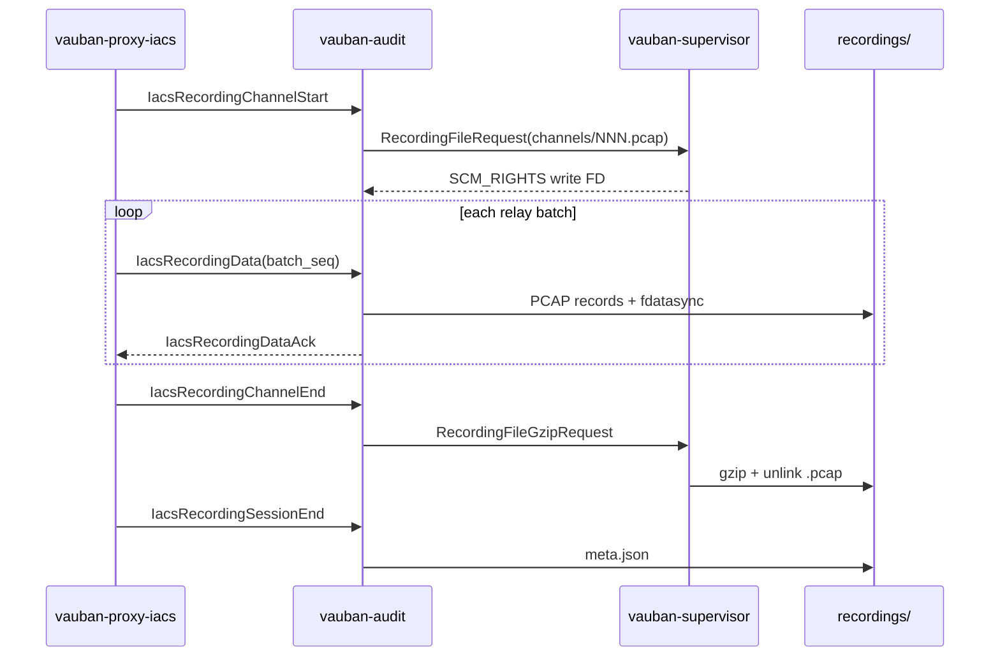

# Vauban Session Recording Architecture


> **Superseded.** This document is retained for archaeology. The current
> revision is
> [Vauban_Recording_Architecture_EN(1.8).md](Vauban_Recording_Architecture_EN(1.8).md).

**Version:** 1.4  
**Date:** 10 May 2026  
**Author:** Richard Ben Aleya

---

## Changelog from v1.3

| Change | Description |
|--------|-------------|
| IACS PCAP bundle recording | Per-`direct-tcpip` channel PCAP capture (`LINKTYPE_RAW`), gzip-at-close, session-level `meta.json` with `format: "pcap-bundle"` |
| IACS IPC messages | `IacsRecordingChannelStart`, `IacsRecordingData`, `IacsRecordingDataAck`, `IacsRecordingChannelEnd`, `IacsRecordingSessionEnd` on the existing `ProxyIacs → Audit` pipe (bidirectional acks on the return leg) |
| Durability + backpressure | `vauban-audit` batches writes, `fdatasync`s, then acks; `vauban-proxy-iacs` blocks relay forward until ack (no `try_send`) |
| Supervisor gzip broker | New `RecordingFileGzipRequest` / `RecordingFileGzipResponse` — root-only gzip + unlink of raw `.pcap` (Capsicum-safe) |
| Web download | `GET /sessions/recordings/{uuid}/download` streams a ZIP (`meta.json` + `channels/NNN.pcap.gz`) for IACS; Recording Details hides Play |
| DB format enum | Migration adds `pcap-bundle` to `recording_format_enum`; hydrator parses IACS `meta.json` |

Prior sections (SSH asciicast, RDP fmp4-dash, integrity hydrator, Recording Details) are unchanged from [v1.3](./Vauban_Recording_Architecture_EN(1.3).md).

---

## IACS PCAP bundle (v1.4)

### Granularity

| Level | Artefact |
|-------|----------|
| 1 Vauban session (= 1 EWS SSH login) | Directory `{YYYY}/{MM}/{session_uuid}/` |
| 1 `direct-tcpip` channel | `channels/NNN.pcap` during capture → `channels/NNN.pcap.gz` after close |
| Session end | `meta.json` listing all channels |

### Data path



EWS→asset bytes are recorded **after** the protocol gate confirms the expected industrial profile; asset→EWS passthrough is recorded in full.

### `meta.json` (pcap-bundle)

```json
{
  "format": "pcap-bundle",
  "channels": [
    {
      "index": 1,
      "target_host": "plc-01.corp",
      "target_port": 502,
      "file": "channels/001.pcap.gz",
      "blake3_hex": "...",
      "file_size": 12345,
      "packet_count": 87,
      "bytes_ews_to_asset": 4096,
      "bytes_asset_to_ews": 2048,
      "opened_at_us": 0,
      "closed_at_us": 120000000
    }
  ],
  "blake3_hex": "BLAKE3(concat channel blake3 hex bytes)",
  "total_bytes": 12345,
  "total_packets": 87,
  "duration_ms": 120000
}
```

Session-level `blake3_hex` follows the same concat-of-channel-digests rule as RDP segment aggregation.

### Configuration

```toml
[recording]
enabled = true
storage_path = "recordings"
rdp = true
ssh = true
iacs = true
```

When `recording.enabled = true` and the per-protocol flag is set, the supervisor injects `VAUBAN_RECORDING_ENABLED` into each proxy (`enabled && rdp`, `enabled && ssh`, `enabled && iacs`) and into `vauban-audit` (`enabled` alone).

### Capsicum constraints

| Service | Recording I/O |
|---------|----------------|
| `vauban-proxy-iacs` | IPC tee only; `AsyncIpcChannel` for audit constructed **before** `cap_enter` |
| `vauban-audit` | Write only on SCM_RIGHTS FDs; gzip/unlink delegated to supervisor |
| `vauban-supervisor` | `create_dir_all`, gzip, unlink under `recording.storage_path` |
| `vauban-web` | Read-only SCM_RIGHTS for download ZIP assembly |

### Operator UX

- **Recording list / detail**: IACS rows appear when `is_recorded = true` after tunnel close.
- **Play**: hidden for `iacs_tunnel` (no terminal/video artefact).
- **Download**: ZIP with `meta.json` and all `.pcap.gz` channels (Wireshark-compatible after gunzip).
