# Vauban Session Recording Architecture

**Version:** 1.5  
**Date:** 24 May 2026  
**Author:** Richard Ben Aleya

---

## Changelog (v1.0 → v1.5)

This document is the consolidated reference for every recording
pipeline shipped by Vauban (RDP fragmented-MP4 with DASH playback,
SSH asciicast v2, IACS PCAP bundle with synthetic L3/L4). It
supersedes [v1.4](Vauban_Recording_Architecture_EN(1.4).md) and
all prior point releases.

### Changelog from v1.4 (May 2026 → 24 May 2026)

| Change | Description |
|--------|-------------|
| Synthetic L3/L4 PCAP layer | Each captured chunk is wrapped in IPv4 (or IPv6) + TCP headers so `.pcap.gz` files dissect natively in tcpdump / Wireshark / Zeek -- Modbus/TCP, OPC-UA Binary, S7, EtherNet/IP recognised by the application dissectors with zero post-processing |
| TCP three-way handshake / FIN-FIN close | Per-channel SYN / SYN-ACK / ACK at start, FIN+ACK / ACK / FIN+ACK / ACK at close, PSH+ACK + cumulative ACK on every relay batch |
| Real endpoints in PCAP | The proxy captures `originator_address` / `originator_port` (RFC 4254 §7.2 from the EWS application) and `peer_addr()` of the supervisor-brokered upstream fd; both pairs are propagated through the extended `IacsRecordingChannelStart` IPC and used by the synth layer |
| ACK timeout | `ChannelRecorder::write_batch` is now bounded by `ACK_TIMEOUT = 5s`. On timeout the relay closes the tunnel cleanly, the `AckRouter` entry is drained, and a `RecordingMetrics::ack_timeouts` counter is bumped |
| Deterministic `base_dir` | `IacsRecordingManager::compute_base_dir` derives `YYYY/MM/UUID/` from the proxy-supplied `connected_at_us` (no more `SystemTime::now()` race across month boundaries) |
| BLAKE3 aggregate alignment | `aggregate_channel_blake3` now hashes the ASCII hex bytes of every per-channel digest in order -- exactly mirroring `aggregate_rdp_blake3` (the previous behaviour decoded the bytes, breaking the documented "same rule as RDP" promise) |

### Changelog from v1.3 (May 2026)

| Change | Description |
|--------|-------------|
| IACS PCAP bundle recording | Per-`direct-tcpip` channel PCAP capture (`LINKTYPE_RAW`), gzip-at-close, session-level `meta.json` with `format: "pcap-bundle"` |
| IACS IPC messages | `IacsRecordingChannelStart`, `IacsRecordingData`, `IacsRecordingDataAck`, `IacsRecordingChannelEnd`, `IacsRecordingSessionEnd` on the existing `ProxyIacs → Audit` pipe (bidirectional acks on the return leg) |
| Durability + backpressure | `vauban-audit` batches writes, `fdatasync`s, then acks; `vauban-proxy-iacs` blocks relay forward until ack (no `try_send`) |
| Supervisor gzip broker | New `RecordingFileGzipRequest` / `RecordingFileGzipResponse` -- root-only gzip + unlink of raw `.pcap` (Capsicum-safe) |
| Web download (IACS) | `GET /sessions/recordings/{uuid}/download` streams a ZIP (`meta.json` + `channels/NNN.pcap.gz`) for IACS; Recording Details hides Play |
| DB format enum | Migration adds `pcap-bundle` to `recording_format_enum`; hydrator parses IACS `meta.json` |

### Changelog from v1.2 (April 2026)

| Change | Description |
|--------|-------------|
| Recording integrity persistence | Ten new `proxy_sessions` columns (`recording_blake3`, `recording_size_bytes`, `recording_duration_ms`, `recording_event_count`, `recording_format`, `recording_width`, `recording_height`, `recording_segment_count`, `recording_codec`, `recording_finalized_at`) precomputed by a lazy background hydrator |
| BLAKE3 unification | RDP recordings expose a single aggregated hash `BLAKE3(concat(segment_hashes_hex_bytes))`; SSH continues to expose the per-`.cast` hash. Same column, uniform semantics across protocols |
| Recording Details page | New recording-centric `/sessions/recordings/{uuid}` page (issue #29 / UX-28) replacing the misleading "View" button on the recordings list. UUID-keyed to avoid sequential ID enumeration |
| Recording download endpoint | `GET /sessions/recordings/{uuid}/download` ships `.cast` for SSH and a streaming uncompressed `.zip` (segments + manifest.mpd + meta.json) for RDP, no re-encoding |
| Recording hydrator (event-driven) | `vauban-web` reads `meta.json` via the supervisor's SCM_RIGHTS plumbing (same path as `serve_manifest`), parses, computes the bundle and UPDATEs the row. Three coordinated paths: PRIMARY = per-call-site `enqueue_hydration` (~5 s after every `disconnected_at` UPDATE); BOOTSTRAP = one-shot scan at boot to rattrape backlog; SAFETY = daily 04:00 UTC reconciliation cron. No periodic ticker. Idempotent, self-healing, partial-index backed. See "Hydration model" below |
| Source-level CI pins (hydrator + docs) | Regression tests assert that every `disconnected_at.eq(` call-site in `handlers/{websocket,api/sessions,web/assets,web/users}.rs` and `tasks/cleanup.rs` is followed by an `enqueue_hydration*` within 35 lines (and that `expire_stale_connecting_sessions` is NOT instrumented). The architecture doc and runbook are themselves pinned so the "PRIMARY / BOOTSTRAP / SAFETY" framing cannot drift silently |

### Changelog from v1.1 (March 2026)

| Change | Description |
|--------|-------------|
| SSH session recording | Asciicast v2 format for terminal session recordings via `vauban-proxy-ssh` and `vauban-audit` |
| Input redaction | Two-layer heuristic engine (pattern matching + echo suppression) redacts passwords before storage |
| asciinema-player integration | MIT-licensed JavaScript player for SSH recording playback in `vauban-web` |
| SSH recording IPC messages | `SshRecordingStart`, `SshRecordingData`, `SshRecordingEnd` message variants |
| SSH recording database tracking | `recording_path` updated on terminal WebSocket disconnect (same pattern as RDP) |
| SSH recording BLAKE3 integrity | Per-session BLAKE3 hash over the entire `.cast` file content |
| SSH `meta.json` | Metadata file with format, BLAKE3 hash, duration, dimensions, event count |
| CSP-compliant asciinema init | External `/static/js/asciinema-init.js` script for player initialization |

### Changelog from v1.0 (February 2026)

| Change | Description |
|--------|-------------|
| RDP segmentation | Resolution changes split the recording into multiple fMP4 segments instead of corrupting a single file |
| DASH multi-Period playback | `manifest.mpd` rendered server-side; Shaka Player consumes one Period per resolution epoch |
| Per-segment BLAKE3 | Each segment carries its own BLAKE3 digest; the aggregate is `BLAKE3(concat(segment_hashes_hex_bytes))` |
| Backward compatibility | Legacy single-file RDP recordings still play through the native `<video>` fallback path |

---

## Integrity Persistence & Recording Details (v1.3)

Until v1.2, the BLAKE3 hash, file size, duration, terminal/screen
geometry, segment count and codec parameters of every recording lived
only on disk in `meta.json`, written by `vauban-audit` at session
end. The Recording Details page introduced in v1.3 needs these fields
on every render -- re-reading and parsing `meta.json` per request
would add an FD-passing round-trip and a JSON parse to a hot path.

### Schema additions

Migration `20260430000000_recording_integrity_metadata` adds ten
nullable columns to `proxy_sessions` (all `NULL`-able so pre-existing
rows survive without a backfill, and so a session disconnect can land
the row before the hydrator has had a chance to populate it):

| Column | Type | Semantics |
|---|---|---|
| `recording_blake3` | `VARCHAR(64)` | Lowercase hex digest. CHECK `~ '^[0-9a-f]{64}$'`. SSH: hash of the `.cast`. RDP: `BLAKE3(concat(segment_hashes_hex_bytes))` |
| `recording_size_bytes` | `BIGINT` | SSH: `total_bytes` from meta. RDP: sum of per-segment `file_size` |
| `recording_duration_ms` | `BIGINT` | SSH: `duration_secs * 1000`. RDP: `sum(duration_ticks) * 1000 / 90_000` |
| `recording_event_count` | `INTEGER` | SSH only: number of asciicast events. NULL for RDP |
| `recording_format` | `VARCHAR(32)` | One of `asciicast-v2`, `fmp4-dash`, `fmp4-flat` (CHECK constraint pinned) |
| `recording_width` | `SMALLINT` | Final resolution width |
| `recording_height` | `SMALLINT` | Final resolution height |
| `recording_segment_count` | `INTEGER` | RDP only |
| `recording_codec` | `VARCHAR(64)` | RDP only (e.g. `avc1.42c01e`) |
| `recording_finalized_at` | `TIMESTAMPTZ` | Set by the hydrator after a successful UPDATE. Doubles as the "this row is done" marker |

A partial index speeds up the hydrator's batch-scan:

```sql
CREATE INDEX idx_proxy_sessions_pending_finalization
    ON proxy_sessions (created_at)
    WHERE is_recorded = TRUE
      AND recording_path IS NOT NULL
      AND recording_finalized_at IS NULL;
```

### Hydration model (event-driven)

> **CALLOUT.** In nominal operation the integrity bundle is hydrated
> within ~5 seconds of session end. The daily cron is a SAFETY NET,
> NOT the primary finalization path -- it ordinarily logs
> `bootstrap_complete { hydrated=0, ... }` and exits in milliseconds.

#### Timing per mechanism

| Mechanism | Trigger | Finalization latency | Coverage |
|---|---|---|---|
| Bootstrap (one-shot) | `vauban-web` boot | seconds after boot | All backlog (legacy + downtime) |
| `enqueue_hydration` | Every session end (UPDATE `disconnected_at`) | **`hydration_enqueue_delay_secs` (default 5s)** | The session that just ended |
| Daily reconciliation cron | 04:00 UTC | up to 24h | SAFETY NET for lost events only |

#### Architecture

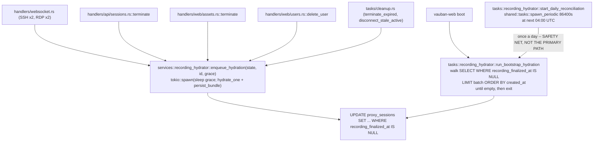

#### What happens when a user closes a session

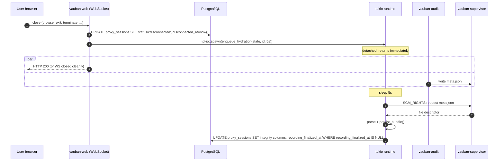

**Total latency: ~5 seconds.** The user-visible response (close
acknowledgement / HTTP 200) is *not* on the hydration critical path:
the enqueue is fire-and-forget.

#### Why a 5 s grace period?

`vauban-web` and `vauban-audit` race on session-end notifications.
`vauban-web` learns the session ended via the WebSocket / IPC close
event and immediately stamps `disconnected_at`; `vauban-audit` learns
via its own IPC channel and flushes the last segment + `meta.json` to
disk a few hundred milliseconds later. Calling `hydrate_session_id`
synchronously would routinely race ahead of the flush and degrade to
the `MissingMeta -> retry` branch. The 5 s default is a prudent
margin over the observed 1-2 s flush tail. Set
`recording.hydration_enqueue_delay_secs` if your deployment needs
something different.

#### When does the daily cron actually run useful work?

In nominal operation, the daily 04:00 UTC reconciliation logs
`bootstrap_complete { finalized=0, ... }` and exits in
milliseconds. It only does real work in three degraded scenarios:

1. `vauban-web` crashed between the `UPDATE disconnected_at` and the
   `tokio::spawn(enqueue_hydration)` (race window: a few microseconds).
2. A new call-site for `disconnected_at` was added without an
   adjacent `enqueue_hydration` (in theory caught by the source-level
   CI pins documented in this section's changelog).
3. `vauban-audit` flushed `meta.json` with a delay greater than
   `hydration_enqueue_delay_secs`, so the PRIMARY enqueue saw
   `MissingMeta` and the row stayed in-flight until the next
   bootstrap.

#### Failure modes

| Condition | Hydrator action | UI surface |
|---|---|---|
| `meta.json` missing within `hydration_missing_meta_grace_secs` (default 300 s) | Log DEBUG `skipped_missing_meta`. Row stays unfinalized; the next bootstrap or daily cron retries. | "Integrity metadata pending finalization (refresh in a few seconds)" |
| `meta.json` missing past grace period | Log WARN once, set `recording_finalized_at = NOW()` with all integrity columns NULL (`marked_finalized_lost`). | "Integrity metadata unavailable for this recording" |
| `meta.json` corrupt or unparseable | Log ERROR, set `recording_finalized_at = NOW()` with all integrity columns NULL. | "Integrity metadata unavailable for this recording" |
| Legacy flat `.mp4` (`recording_path` does not end in `/`) | Log INFO once, set `recording_format='fmp4-flat'` and `recording_finalized_at`; other integrity columns stay NULL. Never retried. | "Integrity metadata unavailable for this recording" |
| Supervisor down (dev mode) | `enqueue_hydration` short-circuits, bootstrap skipped, daily cron skipped. Logged at boot. | "Integrity metadata pending finalization" indefinitely |
| `recording_format` not in enum | Rejected by DB CHECK. Treated as a defence-in-depth assertion -- the parser is the first gate. | (never reaches the page) |

#### Idempotence

Every hydration UPDATE is gated by `WHERE recording_finalized_at IS
NULL`. A double-enqueue (e.g. WS-close + admin-terminate fired in
quick succession on the same row) results in exactly one transition
`NULL -> NOT NULL`; the second UPDATE matches zero rows and is a
silent no-op.

### Recording-centric detail page

`GET /sessions/recordings/{uuid}` renders three cards:

- **Session Context**: user, asset, hostname, source IP, credential
  username, connect/disconnect timestamps, justification, and an
  approval/rejection narrative driven by
  `approved_by_id`/`approved_at` vs `rejected_by_id`/`rejected_at`.
- **Recording Artifact**: format, file size, duration, geometry,
  events (SSH) or segments + codec (RDP), and the truncated BLAKE3
  hash with the full hex in the `title=` attribute for copy-paste.
- **Integrity & Audit**: a checklist of the integrity controls
  applied to this recording.

Authorization: gated by Casbin `admin_view`. Anti-enumeration: every
404-class denial returns the same generic 404 (the
`Path<Uuid>` extractor returns 400 only for malformed UUIDs, which is
not an enumeration signal).

### Download endpoint

`GET /sessions/recordings/{uuid}/download`:

- **SSH**: streams the `.cast` file with
  `Content-Disposition: attachment; filename="{uuid}.cast"` and MIME
  `application/x-asciicast`.
- **RDP**: builds an uncompressed (`Stored` method) ZIP via
  `async_zip` containing every `NNNN.mp4` segment, the rendered
  `manifest.mpd` (via the existing `build_mpd_xml`), and the raw
  `meta.json`. No re-encoding -- the segments are already H.264
  elementary streams in fragmented MP4.

The ZIP body is streamed through a `tokio::io::DuplexStream` so the
first byte hits the wire as soon as the first segment FD is
received. A missing segment surfaces as `404 Not Found` rather than a
truncated download because every FD is fetched eagerly before the
streaming response is sent.

---

## Table of Contents

1. [Introduction](#1-introduction)
2. [Architecture Overview](#2-architecture-overview)
3. [RDP Recording Pipeline](#3-rdp-recording-pipeline)
4. [Segmentation Logic](#4-segmentation-logic)
5. [Fragmented MP4 Container](#5-fragmented-mp4-container)
6. [SSH Recording Pipeline](#6-ssh-recording-pipeline)
7. [IACS PCAP Bundle Recording](#7-iacs-pcap-bundle-recording)
8. [Integrity Verification](#8-integrity-verification)
9. [File Descriptor Delegation](#9-file-descriptor-delegation)
10. [Playback Architecture](#10-playback-architecture)
11. [DASH MPD Generation](#11-dash-mpd-generation)
12. [Security Design](#12-security-design)
13. [Testing Strategy](#13-testing-strategy)
14. [Architecture Decisions](#14-architecture-decisions)

---

## 1. Introduction

### 1.1 Background

Vauban records privileged sessions for audit and compliance purposes. Three distinct recording pipelines exist:

- **RDP sessions**: the H.264 video stream produced by `vauban-proxy-rdp` is captured as fragmented MP4 files, with DASH multi-Period playback for seamless resolution transitions (see Sections 3-5).
- **SSH sessions**: the terminal data stream flowing through `vauban-proxy-ssh` is captured as asciicast v2 files (`.cast`), with sensitive input (passwords, passphrases) automatically redacted before storage (see Section 6).
- **IACS tunnels**: every `direct-tcpip` channel of an EWS-to-asset SSH tunnel proxied by `vauban-proxy-iacs` is captured as a PCAP file wrapped in a synthetic IPv4/IPv6 + TCP layer so that tcpdump / Wireshark / Zeek dissect Modbus/TCP, OPC-UA Binary, S7 and EtherNet/IP natively (see Section 7).

All three pipelines share the same infrastructure for file descriptor delegation (SCM_RIGHTS via `vauban-supervisor`), BLAKE3 integrity hashing, and `meta.json` metadata.

### 1.2 Problem Statement (v1.0 Limitation)

In v1.0, the entire RDP recording session was written as a single fMP4 file. The `moov` box (containing SPS/PPS codec parameters and video dimensions) was written when the first keyframe arrived and never updated. When the user switched between windowed (e.g. 1280x720) and fullscreen (e.g. 1920x1080), the resolution change invalidated the `moov` parameters, making the entire MP4 unplayable.

### 1.3 Problem Statement (v1.1 Limitation)

SSH sessions had no recording capability. Terminal interactions -- including commands typed by privileged users -- were not captured for audit review.

### 1.3.1 Problem Statement (v1.4 Limitation)

EWS-to-asset SSH tunnels brokered by `vauban-proxy-iacs` carried unaudited industrial-protocol traffic. The bytes were authenticated and sandboxed but never persisted, so post-incident forensics on a Modbus / OPC-UA exchange were impossible.

### 1.3.2 Problem Statement (v1.4 Wire Format Limitation)

The original v1.4 IACS pipeline wrote raw application bytes inside libpcap records under `LINKTYPE_RAW`. tcpdump and Wireshark interpret the first nibble of each record as the IP version, so a Modbus PDU starting with `0x00` was rendered as a malformed IPv0 packet, an S7 TPKT starting with `0x03` likewise. The dissectors refused to surface the industrial protocol decoders, defeating the forensic value of the capture.

### 1.4 Design Goals

| Goal | Approach | Protocols |
|------|----------|-----------|
| Zero-copy recording (RDP) | Reuse existing H.264 NAL units -- no re-encoding | RDP |
| Crash resilience (RDP) | Fragmented MP4 (fMP4): each GOP is flushed immediately | RDP |
| Dynamic resolution (RDP) | Segmentation: new fMP4 per resolution epoch | RDP |
| Seamless playback (RDP) | DASH multi-Period via Shaka Player (MSE) | RDP |
| Terminal recording (SSH) | Asciicast v2 format with output, input, and resize events | SSH |
| Password redaction (SSH) | Two-layer heuristic: pattern matching + echo suppression | SSH |
| Terminal playback (SSH) | asciinema-player with monokai theme | SSH |
| Industrial-protocol capture (IACS) | PCAP per `direct-tcpip` channel, synthetic IPv4/IPv6 + TCP layer so Wireshark / tcpdump / Zeek dissect Modbus, OPC-UA, S7 natively | IACS |
| Bounded backpressure (IACS) | `ChannelRecorder::write_batch` blocks on audit ack with a 5 s ceiling; on timeout the relay closes the tunnel cleanly | IACS |
| Tamper detection | BLAKE3 hashes (per-segment for RDP, per-session for SSH, per-channel for IACS) -- all aggregates use the same `BLAKE3(concat(ASCII hex bytes))` rule | All |
| Sandbox compatibility | File descriptors delegated by supervisor via SCM_RIGHTS; `gzip` and `unlink` of raw `.pcap` brokered through the supervisor (Capsicum-safe) | All |
| Backward compatible | Legacy single-file RDP recordings still play with native `<video>` | RDP |

### 1.5 Scope

This document covers:

- The RDP recording pipeline from H.264 frame capture in `vauban-proxy-rdp` to segmented fMP4 storage in `vauban-audit`, DASH MPD generation, and Shaka Player playback in `vauban-web` (Sections 3-5, 11).
- The SSH recording pipeline from terminal data interception in `vauban-proxy-ssh` through input redaction, asciicast v2 storage in `vauban-audit`, and asciinema-player playback in `vauban-web` (Section 6).
- The IACS PCAP bundle pipeline from `direct-tcpip` byte tee in `vauban-proxy-iacs` through the synthetic L3/L4 layer in `vauban-audit`, supervisor-brokered gzip+unlink, and ZIP download in `vauban-web` (Section 7).
- Shared infrastructure: BLAKE3 integrity (Section 8), SCM_RIGHTS file descriptor delegation (Section 9), playback architecture (Section 10), and security design (Section 12).

It supersedes [v1.4](Vauban_Recording_Architecture_EN(1.4).md) and maintains backward compatibility with legacy RDP recordings.

---

## 2. Architecture Overview

### 2.1 End-to-End Data Flow (RDP)

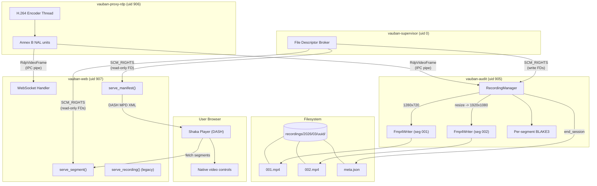

### 2.2 End-to-End Data Flow (SSH)

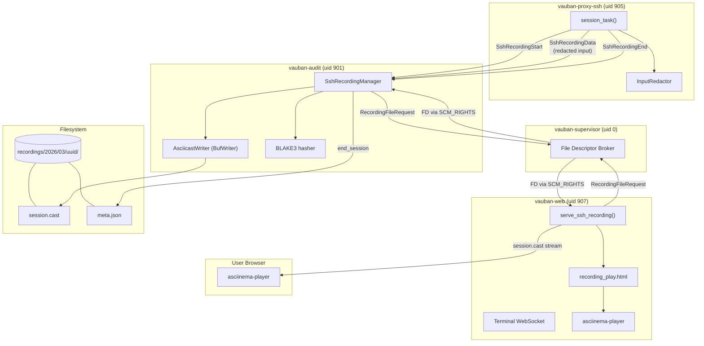

### 2.3 Module Structure

```
vauban-audit/src/
    main.rs                        # IPC dispatcher, SCM_RIGHTS file requests,
                                   # mid-session segment file requests, meta.json writing
                                   # Dispatches both RDP and SSH recording messages
    recording_manager.rs           # RDP: session lifecycle, segmentation logic,
                                   # FrameResult, SegmentInfo, per-segment BLAKE3
    ssh_recording_manager.rs       # SSH: asciicast v2 writer, per-session BLAKE3,
                                   # SshSessionStartParams, SshEndSessionResult, meta.json
    fmp4_writer.rs                 # RDP: ISO BMFF box generation, fragment flushing,
                                   # init_size(), codec_string_from_sps()

vauban-proxy-ssh/src/
    input_redactor.rs              # Two-layer password detection engine
                                   # (pattern matching + echo suppression)
    session_manager.rs             # Dual dispatch: WebSocket + audit IPC,
                                   # InputRedactor integration per session
    main.rs                        # Audit IPC channel setup, env vars, Capsicum FDs

vauban-web/src/
    handlers/web/sessions.rs       # serve_recording() (legacy RDP), serve_manifest() (DASH MPD),
                                   # serve_segment() (per-segment HTTP Range),
                                   # serve_ssh_recording() (asciicast stream)
    handlers/websocket.rs          # Terminal WebSocket: updates recording_path on disconnect
    ipc/supervisor.rs              # request_recording_file() (read-only FD)
    templates/sessions/
        recording_play.rs          # RecordingData.is_segmented(), is_ssh(), conditional rendering
    static_assets.rs               # Shaka Player (Apache-2.0), asciinema-player (MIT)

vauban-web/templates/sessions/
    recording_play.html            # Conditional: Shaka Player (segmented RDP) or
                                   # asciinema-player (SSH) or native video (legacy RDP)

vauban-web/static/js/
    shaka-player.compiled.js       # Google Shaka Player v4.16 (Apache-2.0 licensed)
    shaka-init.js                  # Shaka Player initialization
    asciinema-player.min.js        # asciinema-player v3.15.1 (MIT licensed)
    asciinema-init.js              # asciinema-player initialization (reads data-src from #player)

vauban-web/static/css/
    asciinema-player.css           # asciinema-player styles

vauban-proxy-rdp/src/
    session.rs                     # Dual dispatch: WebSocket + audit IPC,
                                   # post-resize grace period (suppress_encoding_until)

shared/src/
    messages.rs                    # RecordingFileRequest, RecordingFileResponse,
                                   # RdpRecordingStart, RdpRecordingEnd,
                                   # SshRecordingStart, SshRecordingData, SshRecordingEnd,
                                   # SshRecordingEvent (Output, Input, Resize)
```

### 2.4 Dependencies

| Crate / Library | Used by | Purpose |
|-------|---------|---------|
| `blake3` | vauban-audit | Cryptographic hashing of recordings (per-segment RDP, per-session SSH) |
| `serde_json` | vauban-audit | `meta.json` serialization, asciicast v2 event serialization |
| `tokio-util` | vauban-web | `ReaderStream` for chunked HTTP streaming |
| `tempfile` | vauban-audit (tests) | Temporary files for recording tests |
| Shaka Player | vauban-web (frontend) | DASH multi-Period RDP playback via MSE (Apache-2.0) |
| asciinema-player | vauban-web (frontend) | SSH terminal recording playback (MIT) |

---

## 3. RDP Recording Pipeline

### 3.1 Frame Capture

When an RDP session is active and H.264 encoding is enabled, each encoded frame is dispatched to two destinations simultaneously:

1. **Live viewing**: sent via IPC to `vauban-web`, then over WebSocket to the browser
2. **Recording**: sent via IPC to `vauban-audit` for persistent storage

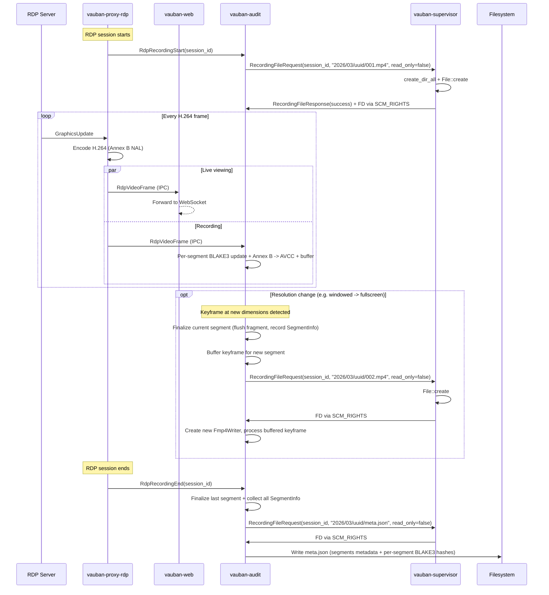

### 3.2 Recording Manager

`RecordingManager` tracks all active RDP recording sessions with support for dynamic resolution segmentation. It receives pre-opened `File` handles and never performs filesystem I/O directly, following the principle of least privilege under Capsicum.

| Responsibility | Method | Returns |
|----------------|--------|---------|
| Start recording | `start_session(session_id, File, relative_path)` | -- |
| Process frame | `handle_frame(session_id, timestamp_us, is_keyframe, w, h, data)` | `FrameResult` |
| Provide new segment file | `provide_segment_file(session_id, File)` | -- |
| End recording | `end_session(session_id)` | `Option<EndSessionResult>` |
| Serialize metadata | `serialize_meta_json(segments)` | JSON string |

Key behaviors:

- **Lazy initialization**: the `Fmp4Writer` is not created until the first keyframe arrives, because SPS/PPS parameters (required for the `moov` box) are only present in keyframes
- **P-frames before first keyframe**: silently discarded (cannot be decoded without SPS/PPS)
- **Fragment flushing**: each GOP (keyframe + following P-frames) is accumulated in memory, then flushed as a `moof+mdat` pair when the next keyframe arrives
- **Concurrent sessions**: multiple sessions can be recorded simultaneously (keyed by `session_id`)
- **Resolution change detection**: when a keyframe arrives with different dimensions, the current segment is finalized, a `FrameResult::NewSegmentNeeded` is returned, and the keyframe is buffered until a new file is provided
- **Per-segment BLAKE3**: each segment has its own independent BLAKE3 hash, reset on segment boundaries
- **Segment metadata**: `SegmentInfo` captures index, dimensions, duration, init_size, BLAKE3 hash, and codec string for MPD generation

### 3.3 Frame Processing

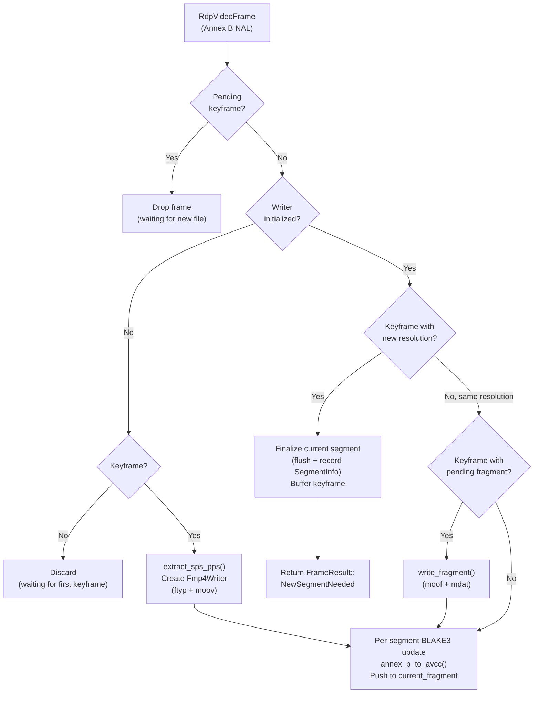

### 3.4 Post-Resize Grace Period

When the desktop resolution changes (DeactivateAll / Reactivation sequence in RDP), the framebuffer (`DecodedImage`) is recreated at the new dimensions and initialized to zeros (black). The RDP server then progressively rebuilds the screen via incremental region updates, which typically takes 200-500ms. Without mitigation, the encoder would capture and record these intermediate black/partial states, producing ~1-2 seconds of black frames at the beginning of each new segment.

#### 3.4.1 Problem

```
t=0ms     DecodedImage::new(new_w, new_h)       Framebuffer = all zeros (black)
t=0ms     EncoderCommand::Reconfigure           Encoder ready for new dimensions
t=0ms     framebuffer_dirty = true              Triggers immediate encode
t=16ms    encode tick                           Encodes BLACK framebuffer as keyframe
t=32ms    encode tick                           dirty=false, skip
...
t=200ms   1st RDP update (partial region)       dirty=true -> encode mostly-black frame
t=220ms   2nd RDP update (another region)       dirty=true -> encode partially-black frame
...
t=1500ms  Last RDP update                       Framebuffer finally complete
```

#### 3.4.2 Solution: Encoding Suppression

After a resolution change, encoding is suppressed for a 500ms grace period (`suppress_encoding_until`). During this window, RDP graphics updates arrive and populate the framebuffer normally, but no frames are captured or encoded. When the grace period expires, a `ForceKeyframe` command is sent to the encoder and encoding resumes with the now-complete framebuffer.

```
t=0ms     DecodedImage::new(new_w, new_h)       Framebuffer = black
t=0ms     EncoderCommand::Reconfigure           Encoder ready
t=0ms     suppress_encoding_until = now+500ms   Grace period starts
          (NO ForceKeyframe, NO framebuffer_dirty)

          During 500ms:
          - RDP updates arrive and fill framebuffer
          - Encode ticks are skipped (grace period active)
          - framebuffer_dirty accumulates naturally

t=500ms   Grace period expires
          -> ForceKeyframe sent to encoder
          -> suppress_encoding_until cleared
          -> Next tick: encode COMPLETE framebuffer as keyframe
```

#### 3.4.3 Guarantees

| Constraint | Satisfied |
|---|---|
| Zero black frames recorded | Yes -- no encoding during grace period |
| Zero real frames lost | Yes -- first frame after grace period contains all accumulated updates |
| Keyframe at segment boundary | Yes -- ForceKeyframe sent when grace period expires |
| No timestamp discontinuity | Yes -- timestamps continue progressing normally |
| Live stream impact | Minimal -- 500ms freeze during resolution transition (expected by user) |

### 3.5 Timestamp Handling

Frame timestamps arrive in microseconds from the H.264 encoder. They are converted to the MP4's 90 kHz timescale:

```
duration_ticks = round(duration_us / (1_000_000 / 90_000))
               = round(duration_us / 11.111...)
```

When two consecutive frames have the same timestamp (duration = 0), a fallback duration of 3000 ticks (~33 ms, equivalent to 30 FPS) is used.

---

## 4. Segmentation Logic

### 4.1 Why Segmentation?

The root cause of the v1.0 problem is that the `moov` box in an fMP4 file contains fixed SPS/PPS parameters and dimensions. When the desktop resolution changes mid-session, these parameters become invalid. Re-writing `moov` mid-stream is not possible in a forward-only fMP4 writer.

Segmentation solves this by creating a new fMP4 file (with its own valid `moov`) whenever the resolution changes. Each segment is self-contained and independently playable.

### 4.2 Segment Split Flow

When `handle_frame()` receives a keyframe with dimensions different from the current segment:

1. **Flush**: write any pending fragment to the current segment
2. **Finalize**: record `SegmentInfo` (init_size, duration_ticks, BLAKE3 hash, codec_string)
3. **Buffer**: store the new keyframe data in `pending_keyframe`
4. **Signal**: return `FrameResult::NewSegmentNeeded { relative_path }` to the caller

The caller (`vauban-audit/main.rs`) requests a new file from the supervisor via SCM_RIGHTS, then calls `provide_segment_file()`:

1. **Reset**: create new per-segment BLAKE3 hasher, hash the buffered keyframe
2. **Init**: extract SPS/PPS from the buffered keyframe, create new `Fmp4Writer`
3. **Process**: write the buffered keyframe as the first frame of the new segment

### 4.3 Types

```rust
pub struct SegmentInfo {
    pub index: u32,          // 1-based segment number
    pub width: u16,
    pub height: u16,
    pub duration_ticks: u64, // Total duration in 90 kHz timescale
    pub init_size: u64,      // Size of ftyp+moov (for DASH Initialization range)
    pub file_size: u64,      // Total file size (for DASH SegmentURL mediaRange)
    pub blake3_hex: String,  // Per-segment BLAKE3 hash
    pub codec_string: String,// e.g. "avc1.42c01e" (for DASH codecs attribute)
}

pub enum FrameResult {
    Processed,
    NewSegmentNeeded { relative_path: String },
}

pub struct EndSessionResult {
    pub segments: Vec<SegmentInfo>,
    pub meta_json_relative_path: String,
    pub total_frames: u64,
    pub total_bytes: u64,
}
```

### 4.4 Edge Cases

| Scenario | Behavior |
|----------|----------|
| No resolution change | Single segment, identical to v1.0 behavior |
| P-frame at mismatched resolution | Dropped (defensive; should not occur in practice) |
| Frames while waiting for new file | Dropped (pending_keyframe is set) |
| Resolution change back to original | New segment created (720 -> 1080 -> 720 = 3 segments) |
| Crash during segment split | Previous segment's flushed fragments survive |
| Session ends before any keyframe | `end_session()` returns `None` |
| Black frames after resize | Eliminated by 500ms encoding grace period (Section 3.4) |

---

## 5. Fragmented MP4 Container

### 5.1 Why Fragmented MP4?

Standard MP4 files place the `moov` atom (containing sample tables, offsets, and durations for every frame) either at the beginning or end of the file. This requires knowing all frame data upfront, or rewriting the file header after recording completes.

Fragmented MP4 (fMP4) solves this by:

1. Writing a minimal `moov` with only codec configuration (SPS/PPS) at the start
2. Appending each GOP as an independent `moof+mdat` fragment
3. Each fragment is self-describing (contains its own sample table)

This provides **crash resilience**: if the process terminates unexpectedly, all previously flushed fragments remain playable. Only the current in-progress GOP is lost.

### 5.2 File Structure

```
ftyp                              # File type: isom, iso5, iso6, mp41
moov                              # Movie header (minimal for fragmented)
    mvhd                          # Movie header (timescale=90kHz, duration=0)
    trak                          # Single video track
        tkhd                      # Track header (track_id=1, dimensions)
        mdia                      # Media container
            mdhd                  # Media header (timescale=90kHz)
            hdlr                  # Handler: "vide" / "Vauban Video"
            minf                  # Media information
                vmhd              # Video media header
                dinf/dref         # Data reference (self-contained)
                stbl              # Sample table (empty -- data in fragments)
                    stsd          # Sample description
                        avc1      # AVC visual sample entry
                            avcC  # AVC decoder config (SPS, PPS)
                    stts          # (empty)
                    stsc          # (empty)
                    stsz          # (empty)
                    stco          # (empty)
    mvex                          # Movie extends (signals fragmentation)
        trex                      # Track extends defaults

[moof + mdat]*                    # Repeated for each GOP
    moof                          # Movie fragment
        mfhd                      # Fragment header (sequence_number)
        traf                      # Track fragment
            tfhd                  # Track fragment header (track_id=1)
            tfdt                  # Track fragment decode time (v1, 64-bit)
            trun                  # Track run (sample count, data_offset,
                                  #   per-sample: duration, size, flags)
    mdat                          # Media data (AVCC-formatted NAL units)
```

### 5.3 NAL Unit Format Conversion

The H.264 encoder produces Annex B format (start codes `0x00000001`), but MP4 containers require AVCC format (4-byte big-endian length prefix). The conversion pipeline:

```
Annex B input:  [00 00 00 01] [67 SPS...] [00 00 00 01] [68 PPS...] [00 00 00 01] [65 IDR...]
                     |              |           |              |           |            |
                     v              v           v              v           v            v
              start code       extracted    start code     extracted   start code    kept in
                removed       -> moov/avcC    removed     -> moov/avcC   removed    mdat as AVCC

AVCC output:   [00 00 00 03] [65 IDR...]
                  length=3     IDR slice data
```

SPS (NAL type 7) and PPS (NAL type 8) are extracted from the first keyframe and stored in the `avcC` box inside `moov`. They are stripped from subsequent `mdat` payloads since the decoder reads them from the container header.

### 5.4 Codec String Extraction

The `codec_string_from_sps()` function extracts the AVC codec string from SPS NAL unit bytes for use in the DASH MPD:

```
SPS bytes:  [0x67, profile_idc, constraint_flags, level_idc, ...]
            
codec_string = "avc1." + hex(profile_idc) + hex(constraint_flags) + hex(level_idc)

Example: SPS [0x67, 0x42, 0xC0, 0x1E, ...] -> "avc1.42c01e" (Baseline, Level 3.0)
```

### 5.5 Init Size

The `init_size` field records the byte count of `ftyp + moov` written at segment initialization. This value is used by the DASH MPD as the `Initialization range` attribute, telling Shaka Player which bytes to fetch first to initialize the decoder.

### 5.6 Sample Flags

Each sample in the `trun` box carries flags indicating its decode dependencies:

| Frame Type | Flags | Meaning |
|-----------|-------|---------|
| Keyframe (IDR) | `0x02000000` | `sample_depends_on=2` (does not depend on others) |
| P-frame | `0x01010000` | `sample_depends_on=1` + `sample_is_non_sync_sample` |

---

## 6. SSH Recording Pipeline

### 6.1 Overview

SSH terminal sessions are recorded using the [asciicast v2](https://docs.asciinema.org/manual/asciicast/v2/) format, a text-based line-delimited JSON format designed for terminal recordings. Unlike RDP recordings (binary H.264 video), SSH recordings capture the terminal data stream as discrete events (output, input, resize) with microsecond-precision timestamps.

A critical difference from RDP recording is that SSH recordings must handle **sensitive input redaction**: passwords, passphrases, and other secrets typed by the user must be detected and replaced with `[REDACTED]` before being written to disk. This redaction happens in `vauban-proxy-ssh` (before IPC transmission), ensuring that sensitive data never reaches `vauban-audit` or the filesystem.

### 6.2 Data Flow

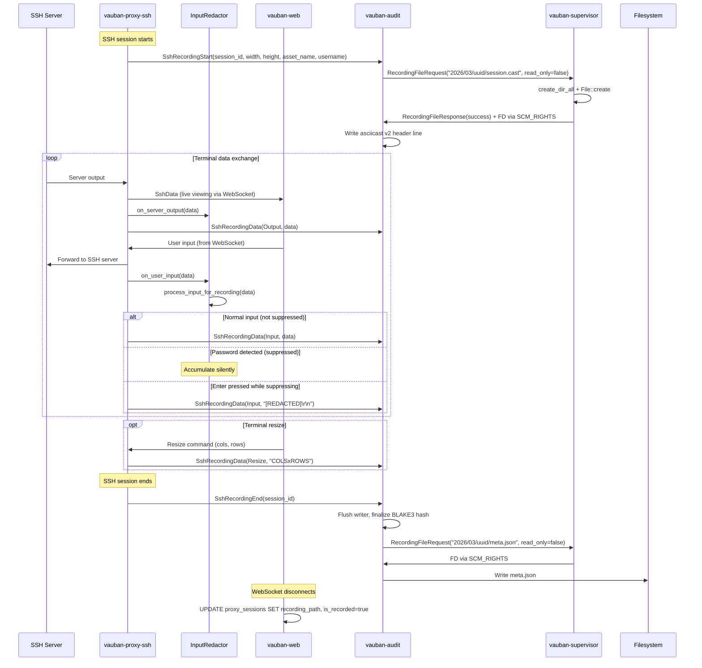

### 6.3 Input Redaction

The `InputRedactor` in `vauban-proxy-ssh/src/input_redactor.rs` implements a two-layer heuristic to detect sensitive input. This is the most security-critical component of the SSH recording pipeline.

#### 6.3.1 Layer 1: Pattern Matching

Server output is scanned (case-insensitive) for known password prompt patterns:

```rust
const PASSWORD_PATTERNS: &[&str] = &[
    "password:", "passphrase", "[sudo]", "enter pin",
    "verification code", "token:", "secret:",
    "become password", "login:",
];
```

When a pattern is detected, the redactor enters suppression mode. All subsequent input is accumulated silently until the user presses Enter, at which point a single `[REDACTED]\r\n` event is emitted.

#### 6.3.2 Layer 2: Echo Suppression Detection

When a program prompts for a password, it typically disables terminal echo (clears the `ECHO` flag in `termios`). The redactor detects this by tracking whether the user's printable input characters are echoed back by the server.

If 3 or more printable characters (`ECHO_SUPPRESSION_THRESHOLD`) are typed without any being echoed in server output, the redactor concludes that echo is suppressed and enters suppression mode.

This layer catches password prompts from programs that don't use recognizable patterns (custom scripts, non-English locales, etc.).

#### 6.3.3 Redaction State Machine

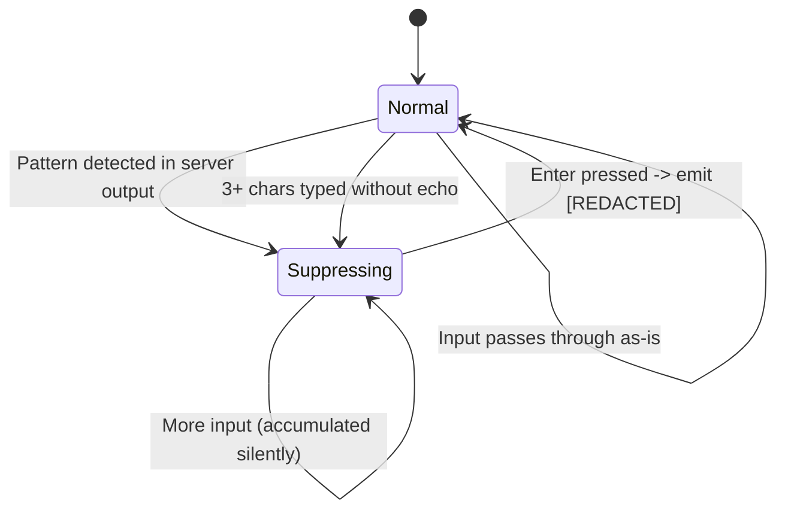

#### 6.3.4 API

```rust
pub struct InputRedactor { ... }

impl InputRedactor {
    pub fn new() -> Self;
    pub fn on_server_output(&mut self, data: &[u8]);
    pub fn on_user_input(&mut self, data: &[u8]);
    pub fn process_input_for_recording(&mut self, data: &[u8]) -> Option<Vec<u8>>;
}
```

| Method | Called when | Effect |
|--------|-----------|--------|
| `on_server_output` | Server sends data to user | Scans for password patterns; checks if recent input was echoed |
| `on_user_input` | User types input | Tracks printable chars for echo suppression detection |
| `process_input_for_recording` | Before recording input | Returns `None` (suppressing), `Some([REDACTED])` (on Enter), or `Some(data)` (passthrough) |

#### 6.3.5 Design Rationale

The two-layer approach was chosen because neither layer alone is sufficient:

| Scenario | Pattern alone | Echo alone | Combined |
|----------|:---:|:---:|:---:|
| Standard `Password:` prompt | Detected | Detected | Detected |
| `[sudo] password for user:` | Detected | Detected | Detected |
| Custom script: "Enter secret key:" | **Missed** | Detected | Detected |
| SSH passphrase prompt | Detected | Detected | Detected |
| Non-English `Mot de passe :` | **Missed** | Detected | Detected |
| Vi/nano single-char input (no echo) | N/A | Not triggered (< 3 chars) | Not triggered |

The pattern list is hardcoded (not configurable) because it is a security mechanism. Making it configurable would allow misconfiguration that weakens recording integrity.

### 6.4 Asciicast v2 Format

Each SSH recording produces a single `.cast` file in asciicast v2 format:

**Header line** (written by `start_session`):

```json
{"version":2,"width":120,"height":40,"timestamp":1710700000,"title":"SSH: user@asset_name"}
```

**Event lines** (written by `handle_data`):

```json
[0.000000,"o","$ "]
[0.500000,"i","ls -la\r"]
[0.750000,"o","total 42\r\ndrwxr-xr-x  5 user user 4096 Mar 17 10:00 .\r\n"]
[5.200000,"o","Password: "]
[8.100000,"i","[REDACTED]\r\n"]
[12.000000,"r","160x50"]
```

| Event code | Meaning | Source |
|-----------|---------|--------|
| `"o"` | Output (server -> user) | Always recorded verbatim |
| `"i"` | Input (user -> server) | Redacted by `InputRedactor` when sensitive |
| `"r"` | Terminal resize | Format: `"COLSxROWS"` |

Timestamps are relative to the first event (in seconds with microsecond precision). The first event always has timestamp `0.000000`.

### 6.5 SshRecordingManager

`SshRecordingManager` in `vauban-audit/src/ssh_recording_manager.rs` manages active SSH recording sessions. Like `RecordingManager` for RDP, it receives pre-opened `File` handles via SCM_RIGHTS and never performs filesystem I/O directly.

| Responsibility | Method | Returns |
|----------------|--------|---------|
| Start recording | `start_session(session_id, SshSessionStartParams)` | -- |
| Record event | `handle_data(session_id, timestamp_us, event_type, data)` | -- |
| End recording | `end_session(session_id)` | `Option<SshEndSessionResult>` |
| Compute path | `compute_relative_path(session_id)` | `String` |
| Serialize metadata | `serialize_meta_json(result)` | JSON string |

Key behaviors:

- **Buffered writing**: uses `BufWriter<File>` for efficient I/O
- **Streaming BLAKE3**: hash is incrementally updated with each header/event line
- **Empty data skipped**: events with empty data are not written (no empty lines)
- **Relative timestamps**: all timestamps are relative to the first event
- **Concurrent sessions**: multiple SSH sessions can be recorded simultaneously
- **Duplicate start ignored**: a second `start_session` for the same ID is a no-op

### 6.6 IPC Messages

Three new message variants support SSH recording:

```rust
pub enum SshRecordingEvent {
    Output,  // "o" - server -> user (always recorded)
    Input,   // "i" - user -> server (redacted by proxy before sending)
    Resize,  // "r" - terminal resize
}

// Sent when SSH session starts (proxy-ssh -> audit)
SshRecordingStart {
    session_id: String,
    width: u16,
    height: u16,
    asset_name: String,
    username: String,
}

// Sent for each terminal event (proxy-ssh -> audit)
SshRecordingData {
    session_id: String,
    timestamp_us: u64,
    event_type: SshRecordingEvent,
    data: Vec<u8>,
}

// Sent when SSH session ends (proxy-ssh -> audit)
SshRecordingEnd {
    session_id: String,
}
```

These use the same `bincode`-serialized IPC pipe mechanism as RDP recording messages.

### 6.7 Database Tracking

When a terminal WebSocket disconnects, `vauban-web` updates the `proxy_sessions` table:

```sql
UPDATE proxy_sessions
SET is_recorded = true,
    recording_path = '{storage_path}/{YYYY}/{MM}/{session_id}/',
    status = 'disconnected',
    disconnected_at = NOW()
WHERE uuid = '{session_id}';
```

This mirrors the RDP recording behavior and ensures SSH recordings appear in the recordings list (`/sessions/recordings`), which filters on `recording_path IS NOT NULL AND is_recorded = true`.

---

## 7. IACS PCAP Bundle Recording

EWS-to-asset SSH tunnels brokered by `vauban-proxy-iacs` carry industrial-protocol traffic (Modbus/TCP, OPC-UA Binary, S7, EtherNet/IP, ...) over per-`direct-tcpip` channels. v1.4 introduced the `pcap-bundle` artefact: one `.pcap.gz` per channel plus a session-level `meta.json`. v1.5 wraps every captured chunk in a synthetic IPv4 / IPv6 + TCP layer so the resulting files dissect natively in tcpdump, Wireshark and Zeek -- the dissectors offer the application protocol decoders with zero post-processing.

### 7.1 Granularity

| Level | Artefact |
|-------|----------|
| 1 Vauban session (= 1 EWS SSH login) | Directory `{YYYY}/{MM}/{session_uuid}/` |
| 1 `direct-tcpip` channel | `channels/NNN.pcap` during capture, `channels/NNN.pcap.gz` after close |
| Session end | `meta.json` listing every channel with integrity metadata |

The `YYYY/MM/UUID/` directory is anchored on the proxy-supplied `connected_at_us` timestamp, which is the same wall-clock moment as `proxy_sessions.connected_at` in the database. v1.5 made this anchor deterministic: the audit module no longer calls `SystemTime::now()` to compute paths, so a long-lived tunnel that straddles a month boundary cannot split its artefacts across two month folders. The web hydrator and the audit writer both derive the same path from `connected_at`.

### 7.2 Synthetic L3/L4 Layer (v1.5)

Pre-1.5 the audit module emitted libpcap records under `LINKTYPE_RAW` containing just the application bytes that travelled through the relay. The first nibble of each record was interpreted by the dissectors as the IP version: a Modbus PDU starting with `0x00` was rendered as a broken IPv0 packet, `0x03` (S7 TPKT) likewise. tcpdump emitted malformed-packet warnings; Wireshark refused to surface the industrial dissectors entirely.

v1.5 introduces a synthetic L3/L4 layer (`vauban-audit/src/iacs_pcap_synth.rs`). Each `direct-tcpip` channel is reconstructed as a real-looking TCP/IP conversation:

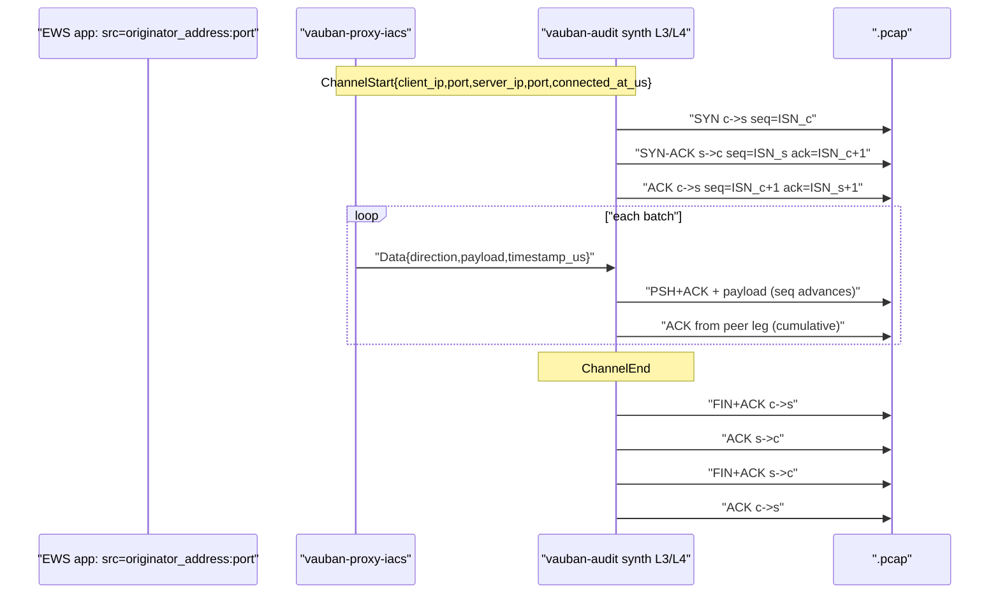

#### Linktype

`LINKTYPE_RAW` (DLT 12). The PCAP record payload starts directly at the IP header; tcpdump and Wireshark detect IPv4 vs IPv6 from the first nibble (`4` -> IPv4, `6` -> IPv6). pcapng was deliberately rejected as overkill for the forensic use case.

#### Endpoints

The two address pairs that feed the synthetic layer are populated by `vauban-proxy-iacs` on every `channel_open_direct_tcpip`:

- **`client_ip` / `client_port`**: `originator_address` / `originator_port` carried by the SSH `direct-tcpip` channel-open request (RFC 4254 §7.2). Reflects the EWS application's local socket as seen by the EWS process.
- **`server_ip` / `server_port`**: `peer_addr()` of the supervisor-brokered upstream `TcpStream` (real IP of the industrial asset, post-resolution). Falls back to `(asset_host, asset_port)` from `IacsTunnelOpen` when `peer_addr()` is unavailable.

When `client_ip` or `server_ip` cannot be parsed as an IP literal (typical case: `target_host` was an FQDN -- audit runs under Capsicum and does not resolve DNS), the synth layer falls back to `127.0.0.1`. When one side is IPv4 and the other IPv6, the IPv4 endpoint is mapped through `::ffff:a.b.c.d` so the flow stays in a single address family.

#### TCP state per flow

Each `direct-tcpip` carries one `TcpFlow`:

- **ISNs**: derived from `BLAKE3("session_id" || channel_id || "client" / "server")` so multiple concurrent flows have disjoint sequence spaces and test fixtures stay reproducible. ISN_client and ISN_server are forced to differ.
- **Sequence numbers**: increment by `payload.len()` per emitted segment. The handshake consumes `+1` per direction (SYN / FIN sequence-bump rule).
- **Cumulative ACK**: every data record on the client -> server leg is followed by a server -> client `ACK` carrying the latest cumulative acknowledgment. Symmetric for the opposite direction.
- **Flags**: `SYN`, `SYN+ACK`, `ACK` (handshake); `PSH+ACK` (data); `FIN+ACK`, `ACK` (close). `RST` is never emitted -- a relay-side error closes the SSH channel cleanly.
- **Window**: fixed `65535` (the recording is forensic, no congestion-control simulation needed).

#### Segmentation

A single application chunk that exceeds the 16-bit IP length cap is split across multiple PCAP records with the sequence numbers advancing correctly across the split. The cap is `65535 - 20 (IPv4 header) - 20 (TCP header) = 65495` bytes for IPv4 and `65535 - 20 = 65515` bytes for IPv6.

#### Checksums

IPv4 header checksum and TCP checksum are emitted as zero. Both tcpdump and Wireshark accept the "checksum offload" pattern (a warning may be displayed, dissection is unaffected). The cryptographic integrity of the recording is anchored by per-channel BLAKE3 plus the session-level aggregate, NOT by per-segment TCP checksums -- computing the real checksums would burn CPU for zero forensic gain.

#### Replay safety

The synthetic seq/ack space is detached from the real conversation that the proxy brokered. These PCAPs MUST NOT be replayed against a live asset: the sequence numbers will collide with whatever the EWS / asset are doing now. Documented prominently in the operator runbook.

#### Example tcpdump output

```text
$ gunzip -c 2026/05/$UUID/channels/001.pcap.gz \
   | tcpdump -nnr - -X
reading from file -, link-type RAW (Raw IP)
22:00:00.000000 IP 192.0.2.10.49152 > 198.51.100.20.502: \
    Flags [S], seq 0xdeadbeef, win 65535, length 0
22:00:00.000000 IP 198.51.100.20.502 > 192.0.2.10.49152: \
    Flags [S.], seq 0xfeedface, ack 0xdeadbef0, win 65535, length 0
22:00:00.000000 IP 192.0.2.10.49152 > 198.51.100.20.502: \
    Flags [.], ack 1, win 65535, length 0
22:00:00.001000 IP 192.0.2.10.49152 > 198.51.100.20.502: \
    Flags [P.], seq 1:13, ack 1, win 65535, length 12
        0x0000:  4500 0034 ... 0001 0000 0006 0103 0000  E..4..........
        0x0010:  000a                                     ..
22:00:00.001000 IP 198.51.100.20.502 > 192.0.2.10.49152: \
    Flags [.], ack 13, win 65535, length 0
...
```

Wireshark recognises the Modbus header bytes (`0001 0000 0006 0103 0000 000a`) and surfaces the "Read Holding Registers" dissector automatically.

### 7.3 IPC Protocol

Five message variants flow on the existing `vauban-proxy-iacs <-> vauban-audit` IPC pipe:

| Message | Direction | Carries |
|---------|-----------|---------|
| `IacsRecordingChannelStart` | proxy -> audit | `session_id`, `channel_id`, `target_host`, `target_port`, `opened_at_us`, **v1.5**: `client_ip`, `client_port`, `server_ip`, `server_port`, `connected_at_us` |
| `IacsRecordingData` | proxy -> audit | `session_id`, `channel_id`, `batch_seq`, `direction` (EwsToAsset / AssetToEws), `timestamp_us`, `data` |
| `IacsRecordingDataAck` | audit -> proxy | `session_id`, `channel_id`, `batch_seq` -- emitted AFTER `fdatasync` |
| `IacsRecordingChannelEnd` | proxy -> audit | `session_id`, `channel_id`, `closed_at_us` |
| `IacsRecordingSessionEnd` | proxy -> audit | `session_id` |

The proxy MUST block on the `IacsRecordingDataAck` before forwarding the corresponding bytes to the peer. This is the durability backbone of the pipeline -- a slow audit produces backpressure on the relay, never silent frame drops.

### 7.4 ACK Timeout (v1.5)

`ChannelRecorder::write_batch` is bounded by `ACK_TIMEOUT = 5s` via `tokio::time::timeout`. On timeout:

1. The pending entry is removed from the `AckRouter` via `cancel(...)` (no stale `oneshot::Sender` retained).
2. `RecordingMetrics::ack_timeouts` is incremented (atomic counter, exposed for supervisor metrics).
3. `write_batch` returns `io::Error::new(TimedOut, ...)`.
4. The relay propagates the error -> the SSH channel is closed cleanly via the existing protocol-gate failure path.

This eliminates the pre-1.5 wedge mode where a slow / dead audit caused the relay to hang indefinitely with no surface signal.

### 7.5 Data Path

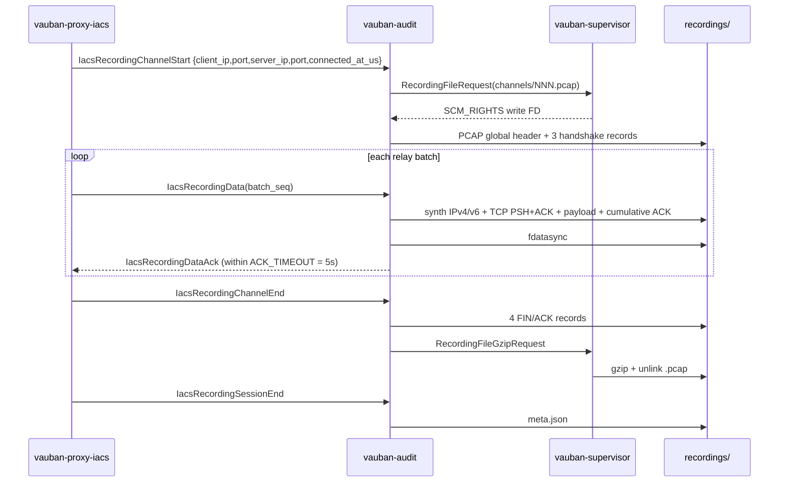

EWS -> asset bytes are recorded **after** the protocol gate confirms the expected industrial profile (Modbus / OPC-UA / S7 / EtherNet/IP). Asset -> EWS passthrough is recorded in full -- the gate does not validate inbound traffic because the asset has already been authenticated by the upstream `direct-tcpip` connect.

### 7.6 Supervisor gzip broker

`vauban-audit` runs in a Capsicum sandbox and cannot `gzip` / `unlink` files itself. After `IacsRecordingChannelEnd`, the audit emits a `RecordingFileGzipRequest { src_relative, dst_relative, session_id, channel_id }` IPC; the supervisor:

1. Opens the raw `.pcap` (root-only, under `recording.storage_path`).
2. Streams it into a `flate2` `GzEncoder` writing `dst_relative` (`.pcap.gz`).
3. Computes BLAKE3 over the `.pcap.gz` bytes.
4. Stats the `.pcap.gz` for `file_size`.
5. Unlinks the raw `.pcap`.
6. Returns `RecordingFileGzipResponse { blake3_hex, file_size }`.

`finalize_channel_gzip` then attaches the digest + size to the in-memory channel meta. `IacsRecordingSessionEnd` triggers `serialize_meta_json`, which is finally persisted via another `RecordingFileRequest` (write-only).

### 7.7 `meta.json` (pcap-bundle)

```json
{
  "format": "pcap-bundle",
  "channels": [
    {
      "index": 1,
      "target_host": "plc-01.corp",
      "target_port": 502,
      "file": "channels/001.pcap.gz",
      "blake3_hex": "...",
      "file_size": 12345,
      "packet_count": 87,
      "bytes_ews_to_asset": 4096,
      "bytes_asset_to_ews": 2048,
      "opened_at_us": 0,
      "closed_at_us": 120000000
    }
  ],
  "blake3_hex": "BLAKE3(concat ASCII hex bytes of every channel.blake3_hex, in `channels` order)",
  "total_bytes": 12345,
  "total_packets": 87,
  "duration_ms": 120000
}
```

The session-level `blake3_hex` IS LITERALLY computed by hashing the ASCII hex bytes of every channel's `blake3_hex` field in `channels` order -- the exact same rule used by `aggregate_rdp_blake3` for the per-segment aggregates. v1.4 documented this rule but the audit code decoded the bytes first (historical drift); v1.5 aligns the implementation with the documentation. The cross-validation test `aggregate_channel_blake3_matches_rdp_aggregate_rule` pins the invariant.

### 7.8 Configuration

```toml
[recording]
enabled = true
storage_path = "recordings"
rdp = true
ssh = true
iacs = true
```

When `recording.enabled = true` and the per-protocol flag is set, the supervisor injects `VAUBAN_RECORDING_ENABLED` into each proxy (`enabled && rdp`, `enabled && ssh`, `enabled && iacs`) and into `vauban-audit` (`enabled` alone).

### 7.9 Capsicum constraints

| Service | Recording I/O |
|---------|----------------|
| `vauban-proxy-iacs` | IPC tee only; `AsyncIpcChannel` for audit constructed **before** `cap_enter`; `peer_addr()` of upstream read pre-`into_split()` |
| `vauban-audit` | Write only on SCM_RIGHTS FDs; gzip / unlink delegated to supervisor; no DNS resolution -- IP fallback `127.0.0.1` annotated when needed |
| `vauban-supervisor` | `create_dir_all`, gzip, unlink under `recording.storage_path` |
| `vauban-web` | Read-only SCM_RIGHTS for download ZIP assembly |

Source-grep regression scripts (`vauban-audit/scripts/check_iacs_pcap_synth.sh` and `vauban-proxy-iacs/scripts/check_recording_capsicum.sh`) pin the invariants in CI: no `try_send` on the recording channel, no `TcpStream::connect` post-Capsicum, audit IPC constructed before `setup_service_sandbox`, every PCAP record routed through `iacs_pcap_synth::build_*`.

### 7.10 Operator UX

- **Recording list / detail**: IACS rows appear when `is_recorded = true` after tunnel close. The session-type tag uses the IACS amber colour for visual distinction from RDP / SSH.
- **Play**: hidden for `iacs_tunnel` (no terminal / video artefact).
- **Download**: ZIP with `meta.json` and all `.pcap.gz` channels (entries use `Compression::Stored` because `.pcap.gz` is already compressed; re-deflating would burn CPU for a larger output). After `gunzip`, every PCAP is directly Wireshark-compatible -- Modbus/TCP, OPC-UA Binary, S7, EtherNet/IP dissect natively.
- **Credential field**: shows `Not authenticated (IACS asset)` for IACS recordings (the asset has no Vauban credential -- a future evolution may add one if the IACS asset gains authentication).

---

## 8. Integrity Verification

### 8.1 RDP: Per-Segment BLAKE3 Hashing

Every raw H.264 frame (Annex B, before AVCC conversion) is fed to a per-segment BLAKE3 incremental hasher. The hasher is reset when a new segment begins. When the segment is finalized (either by a resolution change or session end), the hash is recorded in `SegmentInfo`. All segment metadata is written to `meta.json`:

```
recordings/2026/03/uuid/          (RDP)
    001.mp4             # Segment 1 (e.g. 1280x720)
    002.mp4             # Segment 2 (e.g. 1920x1080)
    meta.json           # Segment metadata with per-segment BLAKE3 hashes
```

RDP `meta.json` structure:

```json
{
    "segments": [
        {
            "index": 1,
            "width": 1280,
            "height": 720,
            "duration_ticks": 450000,
            "init_size": 512,
            "file_size": 524288,
            "blake3_hex": "a1b2c3d4e5f6...",
            "codec_string": "avc1.42c01e"
        }
    ]
}
```

### 8.2 SSH: Per-Session BLAKE3 Hashing

The entire asciicast file content (header line + all event lines) is fed to a single BLAKE3 incremental hasher. The hash is finalized when the session ends and stored in `meta.json`:

```
recordings/2026/03/uuid/          (SSH)
    session.cast        # Asciicast v2 file
    meta.json           # Recording metadata with BLAKE3 hash
```

SSH `meta.json` structure:

```json
{
    "format": "asciicast-v2",
    "blake3_hex": "e5f6a7b8c9d0...",
    "total_bytes": 15420,
    "total_events": 247,
    "duration_secs": 185.3,
    "width": 120,
    "height": 40
}
```

### 8.3 Why BLAKE3?

| Property | Benefit |
|----------|---------|
| Speed | ~3x faster than SHA-256 on modern hardware |
| Incremental | Streaming hash -- no need to buffer frames or events |
| Tree structure | Parallelizable for future multi-threaded verification |
| Cryptographic | Collision-resistant, suitable for tamper detection |

### 8.4 Verification Workflow

An administrator can verify a recording's integrity by recomputing the BLAKE3 hash:

- **RDP**: recompute from the raw H.264 frames in each segment, compare to per-segment hashes in `meta.json`
- **SSH**: recompute from the raw `.cast` file bytes, compare to the single hash in `meta.json`

This proves that:

1. The recording was not modified after capture
2. All content is present and in the original order
3. No content was inserted or removed

---

## 9. File Descriptor Delegation

### 9.1 Problem

Both `vauban-audit` and `vauban-web` run inside Capsicum sandboxes on FreeBSD. After `cap_enter()`, they cannot:

- Call `open()`, `create()`, or any filesystem-accessing syscall
- Create directories with `mkdir()`
- Resolve paths with `stat()` or `access()`

Recording requires creating new files (audit writes) and reading existing files (web playback). For RDP, `vauban-audit` may need to request additional file descriptors mid-session when a resolution change triggers a new segment. For SSH, a single file (`session.cast`) is created at session start, plus `meta.json` at session end.

### 9.2 Solution: SCM_RIGHTS File Descriptor Passing

The same mechanism used for TCP connection brokering (see [Privilege Separation Architecture, Section 5.5](Vauban_Privsep_Architecture_EN(1.2).md)) is reused for recording files:

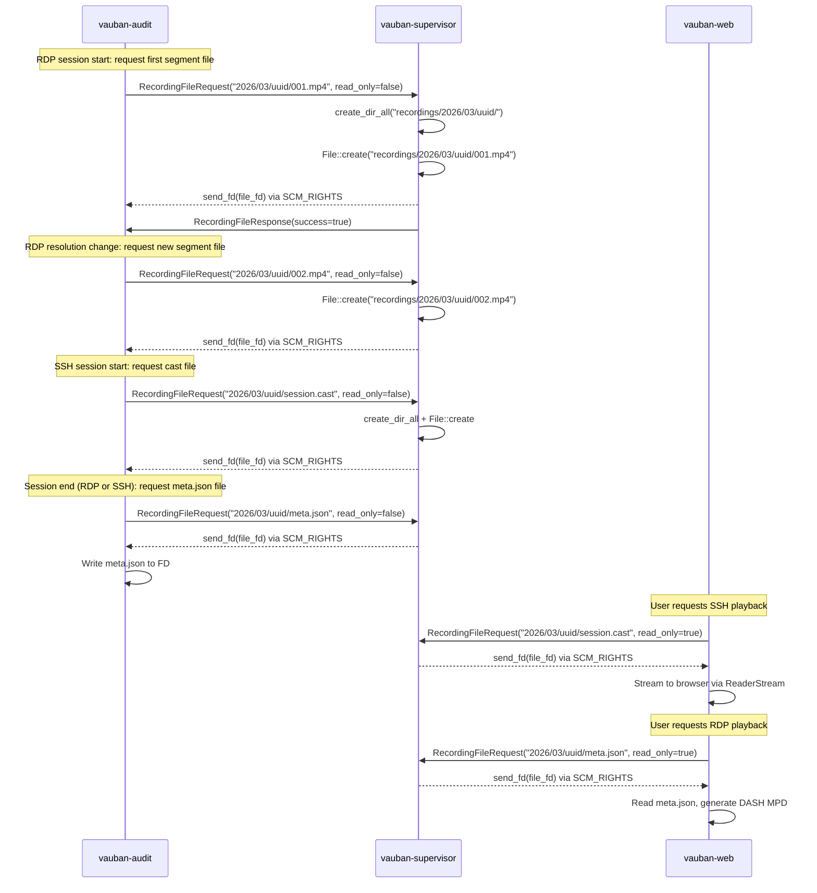

### 9.3 Message Protocol

```rust
RecordingFileRequest {
    request_id: u64,        // Correlates request/response (async support)
    session_id: String,
    relative_path: String,  // e.g. "2026/03/uuid/001.mp4", "2026/03/uuid/session.cast"
    read_only: bool,        // true = open existing (web), false = create new (audit)
}

RecordingFileResponse {
    request_id: u64,
    session_id: String,
    success: bool,
    error: Option<String>,  // Human-readable error if success=false
}
```

### 9.4 Capsicum Sandbox Compliance

| Service | Can access recordings directory? | How it accesses files |
|---------|----------------------------------|----------------------|
| vauban-supervisor | Yes (not sandboxed) | Direct filesystem I/O |
| vauban-audit | No (sandboxed) | Writes to FDs received via SCM_RIGHTS |
| vauban-web | No (sandboxed) | Reads from FDs received via SCM_RIGHTS |
| vauban-proxy-rdp | No (sandboxed) | Never accesses recording files |
| vauban-proxy-ssh | No (sandboxed) | Never accesses recording files (sends data via IPC to audit) |

---

## 10. Playback Architecture

### 10.1 RDP: Segmented Playback (DASH + Shaka Player)

New RDP recordings use DASH multi-Period playback via Shaka Player. The browser fetches a dynamically generated MPD manifest, then requests individual segments as needed.

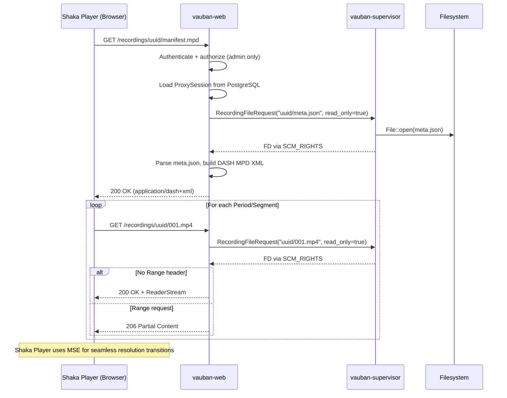

### 10.2 RDP: Legacy Playback (HTTP Range)

Recordings from before the segmentation update (single `.mp4` files) continue to use the native `<video>` element with HTTP Range:

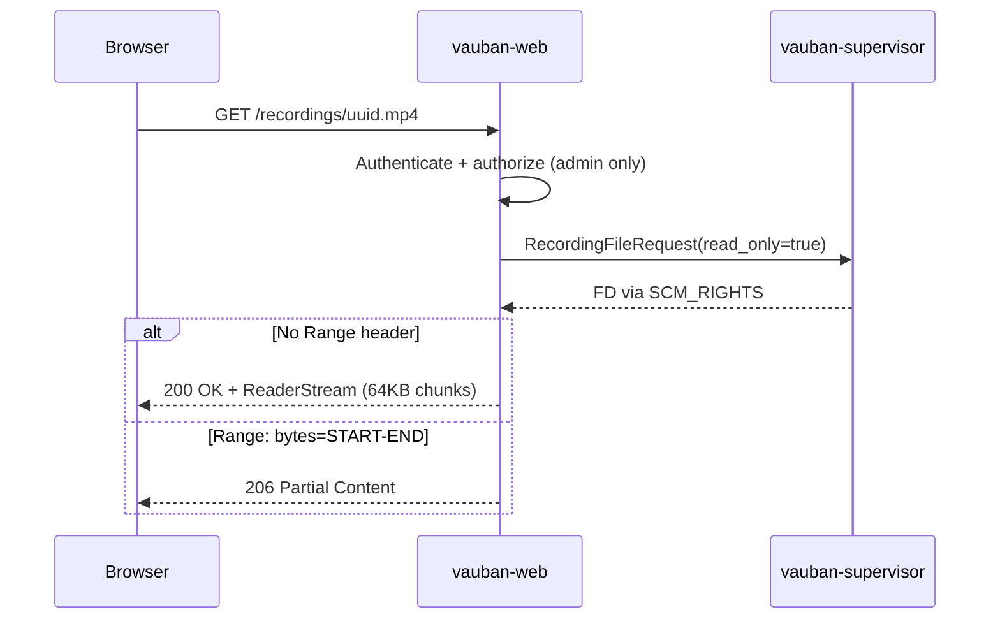

### 10.3 SSH: Terminal Playback (asciinema-player)

SSH recordings are played back using asciinema-player, a JavaScript library that renders asciicast v2 files as an interactive terminal replay.

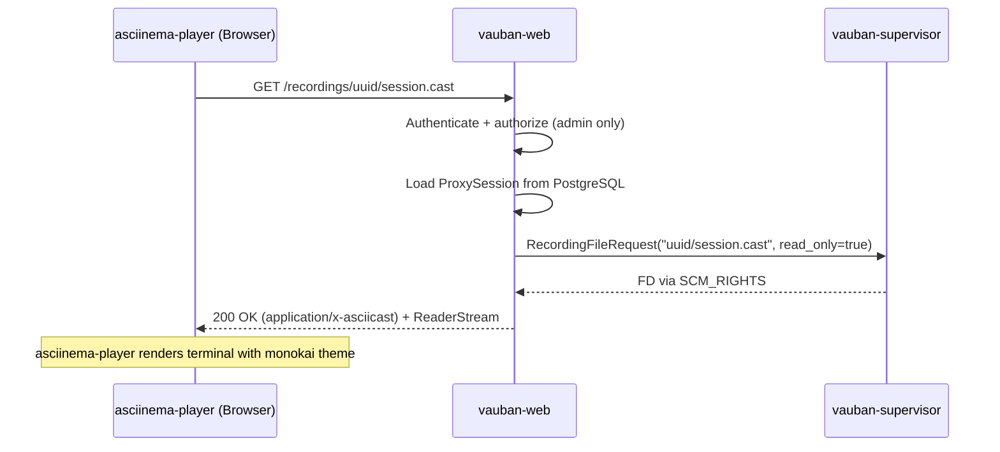

The player is initialized via an external script (`asciinema-init.js`) for CSP compliance:

```javascript
document.addEventListener('DOMContentLoaded', function() {
    var el = document.getElementById('player');
    if (!el) return;
    var src = el.getAttribute('data-src');
    if (!src) return;
    AsciinemaPlayer.create(src, el, {
        theme: 'monokai',
        fit: 'width',
        idleTimeLimit: 2
    });
});
```

### 10.4 Recording Type Detection

The `session_type` and `recording_path` stored in PostgreSQL determine the playback mode:

| Session type | Path format | Example | Player |
|-------------|------------|---------|--------|
| `ssh` | Ends with `/` | `recordings/2026/03/uuid/` | asciinema-player |
| `rdp` | Ends with `/` | `recordings/2026/03/uuid/` | Shaka Player + DASH |
| `rdp` | Ends with `.mp4` | `recordings/2026/02/uuid.mp4` | Native `<video>` |

The template branches on `recording.is_ssh()` first (for SSH), then on `recording.is_segmented()` (for RDP segmented vs legacy).

### 10.5 Memory Efficiency

The playback handler never loads the entire file into memory. It uses `tokio-util::io::ReaderStream` to stream content in 64 KB chunks:

| Approach | Memory per request | Seeking |
|----------|-------------------|---------|
| `read_to_end()` (naive) | Entire file size | No |
| `ReaderStream` + Range | ~64 KB (constant) | Yes, via `206 Partial Content` |

### 10.6 HTTP Range Support (RDP only)

Both segment and legacy RDP endpoints support the standard HTTP Range protocol:

| Request | Response | Headers |
|---------|----------|---------|
| No Range header | `200 OK` | `Content-Length`, `Accept-Ranges: bytes` |
| `Range: bytes=0-` | `206 Partial Content` | `Content-Range: bytes 0-N/TOTAL` |
| `Range: bytes=5242880-` | `206 Partial Content` | `Content-Range: bytes 5242880-N/TOTAL` |

SSH recordings (`.cast` files) are typically small (< 1 MB) and do not require Range support.

### 10.7 Frontend Player

The recording playback page conditionally renders the appropriate player:

**SSH recordings** (asciinema-player):

```html
<div id="player" data-src="/recordings/uuid/session.cast" style="min-height: 480px;"></div>
<link rel="stylesheet" href="/static/css/asciinema-player.css" />
<script src="/static/js/asciinema-player.min.js"></script>
<script src="/static/js/asciinema-init.js"></script>
```

**Segmented RDP recordings** (Shaka Player + DASH):

```html
<video id="recordingVideo" controls playsinline preload="metadata"
       data-manifest="/recordings/uuid/manifest.mpd"></video>
<script src="/static/js/shaka-player.compiled.js"></script>
<script src="/static/js/shaka-init.js"></script>
```

**Legacy RDP recordings** (native `<video>`):

```html
<video controls playsinline preload="metadata">
    <source src="/recordings/uuid.mp4" type="video/mp4">
</video>
```

### 10.8 Web Routes

```rust
// SSH recording endpoint
.route("/recordings/{session_uuid}/session.cast", get(serve_ssh_recording))

// Segmented RDP recording endpoints
.route("/recordings/{session_uuid}/manifest.mpd", get(serve_manifest))
.route("/recordings/{session_uuid}/{segment}", get(serve_segment))

// Legacy RDP recording endpoint (kept for backward compatibility)
.route("/recordings/{session_uuid}", get(serve_recording))
```

---

## 11. DASH MPD Generation

### 11.1 Overview

The `serve_manifest()` endpoint dynamically generates a DASH MPD (Media Presentation Description) XML document from the `meta.json` file. Each recording segment becomes a DASH Period, allowing Shaka Player to handle seamless transitions between segments with different resolutions.

### 11.2 MPD Structure

```xml
<?xml version="1.0" encoding="UTF-8"?>
<MPD xmlns="urn:mpeg:dash:schema:mpd:2011"
     type="static"
     mediaPresentationDuration="PT0H10M30.500S"
     minBufferTime="PT2S"
     profiles="urn:mpeg:dash:profile:isoff-main:2011">
  <Period id="1" duration="PT0H5M15.000S">
    <AdaptationSet mimeType="video/mp4" startWithSAP="1">
      <Representation id="1" codecs="avc1.42c01e"
                      width="1280" height="720" bandwidth="500000">
        <BaseURL>/recordings/uuid/001.mp4</BaseURL>
        <SegmentList>
          <Initialization range="0-511"/>
          <SegmentURL mediaRange="512-524287"/>
        </SegmentList>
      </Representation>
    </AdaptationSet>
  </Period>
  <Period id="2" duration="PT0H5M15.500S">
    <AdaptationSet mimeType="video/mp4" startWithSAP="1">
      <Representation id="2" codecs="avc1.42c01e"
                      width="1920" height="1080" bandwidth="500000">
        <BaseURL>/recordings/uuid/002.mp4</BaseURL>
        <SegmentList>
          <Initialization range="0-639"/>
          <SegmentURL mediaRange="640-1048575"/>
        </SegmentList>
      </Representation>
    </AdaptationSet>
  </Period>
</MPD>
```

The `isoff-main` profile with `SegmentList` is used instead of `isoff-on-demand` with `SegmentBase` because our fMP4 writer does not produce `sidx` (Segment Index) boxes. `SegmentList` provides explicit byte ranges for the initialization segment (`ftyp+moov`) and the media data (`moof+mdat` pairs), removing the need for `sidx`.

### 11.3 Key Attributes

| Attribute | Source | Purpose |
|-----------|--------|---------|
| `mediaPresentationDuration` | Sum of all segment durations | Total recording length |
| `Period.duration` | `SegmentInfo.duration_ticks / 90000` | Individual segment length |
| `Representation.codecs` | `SegmentInfo.codec_string` | Decoder initialization |
| `Representation.width/height` | `SegmentInfo.width/height` | Resolution for this period |
| `Initialization.range` | `0-{SegmentInfo.init_size - 1}` | ftyp+moov byte range |
| `SegmentURL.mediaRange` | `{init_size}-{file_size - 1}` | moof+mdat byte range |
| `BaseURL` | `/recordings/{uuid}/{index:03}.mp4` | Segment file URL |

### 11.4 Duration Format

Durations are converted from 90 kHz ticks to ISO 8601 duration format (`PTxHyMz.zzzS`):

```
seconds = duration_ticks / 90000.0
hours   = floor(seconds / 3600)
minutes = floor((seconds % 3600) / 60)
secs    = seconds % 60
```

---

## 12. Security Design

### 12.1 Access Control

Recording playback is restricted to administrators:

```
serve_manifest()       -> is_admin(auth_user) -> 403 if not admin
serve_segment()        -> is_admin(auth_user) -> 403 if not admin
serve_recording()      -> is_admin(auth_user) -> 403 if not admin
serve_ssh_recording()  -> is_admin(auth_user) -> 403 if not admin
```

The UUID in the URL is validated against the `proxy_sessions` table in PostgreSQL. A valid UUID must:

1. Exist in the database
2. Have `is_recorded = true`
3. Have a non-null `recording_path`

### 12.2 SSH Input Redaction

Password redaction is a defense-in-depth security measure. Sensitive input is replaced with `[REDACTED]` **before** it leaves `vauban-proxy-ssh`, ensuring that passwords never reach `vauban-audit`, the filesystem, or playback clients.

| Security property | Guarantee |
|---|---|
| Passwords never reach disk | Redacted in proxy before IPC transmission |
| Redaction is non-configurable | Hardcoded patterns prevent misconfiguration |
| Both layers are independent | Either pattern match or echo suppression is sufficient |
| Reset on Enter | Suppression state resets after each password entry |
| Normal input preserved | Commands, output, and non-sensitive input recorded verbatim |

### 12.3 Path Traversal Prevention

`vauban-web` never accesses the filesystem directly. The `recording_path` stored in PostgreSQL is stripped to a relative path, which is sent to the supervisor. The supervisor resolves the path relative to a configured `recording_storage_path` root. Any attempt to traverse outside this root is prevented by the supervisor's path resolution.

For segment endpoints, the segment index is validated to contain only ASCII digits, preventing path injection.

### 12.4 Content Security Policy

Player initialization scripts (Shaka Player and asciinema-player) are loaded as external files from the same origin, which complies with the strict CSP (`script-src` does not include `'unsafe-inline'`). The scripts read configuration from `data-*` attributes on DOM elements, avoiding any inline JavaScript.

The CSP includes `media-src 'self' blob:` because Shaka Player uses Media Source Extensions (MSE), which creates blob URLs to feed decoded media to the `<video>` element. Without this directive, the browser would block RDP playback.

---

## 13. Testing Strategy

### 13.1 fMP4 Writer Tests (`fmp4_writer.rs`)

| Test | Purpose |
|------|---------|
| `test_parse_annex_b_nals_4byte_start_code` | Parse NAL units with 4-byte start codes |
| `test_parse_annex_b_nals_3byte_start_code` | Parse NAL units with 3-byte start codes |
| `test_parse_annex_b_multiple_nals` | Parse stream with SPS + PPS + IDR |
| `test_parse_annex_b_empty_data` | Handle empty input gracefully |
| `test_extract_sps_pps` | Extract SPS and PPS from Annex B stream |
| `test_extract_sps_pps_no_sps` | Handle stream without SPS/PPS |
| `test_annex_b_to_avcc_strips_sps_pps` | AVCC output excludes SPS/PPS (in moov) |
| `test_annex_b_to_avcc_preserves_idr_and_non_idr` | IDR and non-IDR slices preserved |
| `test_ftyp_structure` | ftyp box has correct brand (`isom`) |
| `test_fmp4_writer_creates_valid_header` | ftyp + moov written on initialization |
| `test_fmp4_writer_single_fragment` | Single GOP produces ftyp+moov+moof+mdat |
| `test_fmp4_writer_multiple_fragments` | Multiple GOPs produce correct moof count |
| `test_fmp4_writer_bytes_written` | Byte counter tracks written data |
| `test_empty_fragment_is_noop` | Empty fragment produces no output |
| `test_mdat_contains_sample_data` | mdat payload matches input data |
| `test_data_offset_points_to_mdat_payload` | trun data_offset correctly points to mdat |
| `test_truncated_file_has_valid_prefix` | Crash-truncated file has valid box structure |
| `test_sequential_fragment_base_decode_time` | baseDecodeTime advances across fragments |
| `test_avcc_box_structure` | avcC box has correct profile/level/SPS/PPS |
| `test_avc1_visual_sample_entry_layout` | avc1 box layout matches ISO 14496-12 |
| `test_moov_contains_required_boxes` | moov contains mvhd, trak, mvex |
| `test_init_size_matches_ftyp_moov` | init_size() equals ftyp + moov byte count |
| `test_codec_string_baseline` | Baseline SPS produces `avc1.42c01e` |
| `test_codec_string_extraction` | Various SPS bytes produce correct codec strings |

### 13.2 RDP Recording Manager Tests (`recording_manager.rs`)

| Test | Purpose |
|------|---------|
| `test_recording_manager_full_lifecycle` | Complete flow with 1 segment |
| `test_recording_manager_ignores_pframes_before_keyframe` | P-frames discarded before first keyframe |
| `test_recording_manager_unknown_session` | Frames for unknown sessions are ignored |
| `test_recording_manager_duplicate_start` | Duplicate start for same session is idempotent |
| `test_recording_end_without_keyframe` | End before any keyframe returns None |
| `test_blake3_hash_matches_frame_data` | Per-segment BLAKE3 matches independently computed hash |
| `test_multiple_concurrent_sessions` | Two sessions recorded simultaneously |
| `test_crash_resilience_partial_recording` | Drop without end_session: flushed fragments survive |
| `test_single_keyframe_recording` | Single-frame recording produces valid fMP4 |
| `test_only_pframes_produces_no_output` | Session with only P-frames produces empty file |
| `test_compute_relative_path_format` | Path follows YYYY/MM/uuid/001.mp4 pattern |
| `test_single_segment_no_resize` | Full lifecycle without resize: 1 segment + valid meta |
| `test_segment_split_on_resolution_change` | Keyframe at new dims triggers split, 2 segments |
| `test_multiple_resolution_changes` | 3 resolutions -> 3 segments with correct metadata |
| `test_resolution_change_back_to_original` | 720 -> 1080 -> 720 produces 3 segments |
| `test_pframe_before_new_keyframe_stays_in_current_segment` | P-frames at old resolution stay in current segment |
| `test_segment_blake3_independent` | Each segment has its own independent BLAKE3 hash |
| `test_segment_init_size_recorded` | init_size matches ftyp+moov bytes |
| `test_segment_codec_string` | codec_string correctly extracted from SPS |
| `test_segment_duration_computed` | duration_ticks accumulates correctly |
| `test_meta_json_structure` | Serialized meta.json has correct schema |
| `test_provide_segment_file_processes_buffered_keyframe` | Buffered keyframe written to new segment |
| `test_end_session_returns_all_segments` | EndSessionResult contains all segment infos |
| `test_crash_resilience_mid_segment_split` | Flushed fragments survive crash during split |
| `test_compute_relative_path_segmented` | Segmented path format YYYY/MM/uuid/001.mp4 |
| `test_full_lifecycle_with_resize_meta_roundtrip` | Full flow with resize: 2 fMP4 + meta.json round-trip |
| `test_full_lifecycle_without_resize_meta_roundtrip` | Full flow no resize: 1 fMP4 + meta.json round-trip |

### 13.3 SSH Recording Manager Tests (`ssh_recording_manager.rs`)

| Test | Purpose |
|------|---------|
| `test_ssh_recording_full_lifecycle` | Complete flow: start, output, input, end -> valid .cast |
| `test_ssh_recording_header_format` | First line is valid asciicast v2 JSON header |
| `test_ssh_recording_output_event_format` | `[time, "o", "data"]` format |
| `test_ssh_recording_input_event_format` | `[time, "i", "data"]` format |
| `test_ssh_recording_resize_event_format` | `[time, "r", "WxH"]` format |
| `test_ssh_recording_timestamps_increase` | Timestamps are monotonically non-decreasing |
| `test_ssh_recording_blake3_matches_data` | BLAKE3 hash matches independently computed hash |
| `test_ssh_recording_unknown_session_ignored` | Data for unknown session -> no crash |
| `test_ssh_recording_duplicate_start_idempotent` | Second start for same session ignored |
| `test_ssh_recording_end_without_data` | End immediately after start -> valid empty .cast |
| `test_ssh_recording_concurrent_sessions` | Two sessions recorded simultaneously |
| `test_ssh_recording_large_output` | 1 MB of output data written correctly |
| `test_ssh_recording_binary_data_in_output` | Non-UTF8 bytes escaped in JSON |
| `test_ssh_recording_meta_json_structure` | meta.json has format, blake3_hex, duration, etc. |
| `test_ssh_recording_compute_relative_path` | YYYY/MM/uuid/session.cast format |
| `test_ssh_recording_crash_resilience` | Drop manager without end -> partial file readable |
| `test_ssh_recording_redacted_input_preserved` | `[REDACTED]` bytes pass through as-is |
| `test_ssh_recording_utf8_output` | Unicode output correctly encoded |
| `test_ssh_recording_empty_data_event` | Empty data -> no line written |
| `test_ssh_recording_duration_calculation` | Duration computed from first/last timestamps |
| `test_ssh_recording_first_event_timestamp_zero` | First event has relative timestamp 0.0 |
| `test_ssh_recording_compute_base_dir` | Base directory format YYYY/MM/uuid |
| `test_ssh_recording_meta_json_relative_path` | meta.json path computed correctly |

### 13.4 Input Redactor Tests (`input_redactor.rs`)

| Test | Purpose |
|------|---------|
| `test_normal_input_passes_through` | No suppression, data returned as-is |
| `test_password_colon_triggers_redaction` | `"Password: "` in output triggers suppression |
| `test_sudo_prompt_triggers_redaction` | `"[sudo] password for user: "` pattern |
| `test_passphrase_triggers_redaction` | `"Enter passphrase: "` pattern |
| `test_case_insensitive_pattern_matching` | `"PASSWORD:"` matches (case-insensitive) |
| `test_redaction_emits_on_newline` | Suppressed chars replaced by `[REDACTED]\r\n` on Enter |
| `test_redaction_resets_after_newline` | Next input after Enter passes through |
| `test_echo_suppression_detects_no_echo` | Chars typed without echo -> suppressed |
| `test_echo_present_no_suppression` | Chars typed and echoed -> not suppressed |
| `test_single_char_no_echo_no_suppression` | 1 char without echo: below threshold |
| `test_two_chars_no_echo_no_suppression` | 2 chars: still below threshold |
| `test_three_chars_no_echo_triggers_suppression` | Exactly 3 chars: threshold met |
| `test_combined_pattern_and_echo` | Both layers agree, single `[REDACTED]` |
| `test_pattern_without_echo_check` | Pattern alone is sufficient |
| `test_echo_without_pattern` | Echo suppression alone is sufficient |
| `test_multiple_password_prompts_in_sequence` | Two consecutive password prompts |
| `test_empty_input_no_crash` | Empty data handled gracefully |
| `test_output_only_no_input_no_crash` | Server output without any input |
| `test_partial_pattern_no_trigger` | `"Pass"` alone does not trigger |
| `test_multiline_output_with_pattern` | Pattern buried in multi-line output |

### 13.5 DASH MPD Generation Tests (`sessions.rs`)

| Test | Purpose |
|------|---------|
| `test_mpd_single_period` | 1 segment -> MPD with 1 Period |
| `test_mpd_multi_period` | 3 segments -> MPD with 3 Periods, correct durations/resolutions |
| `test_mpd_initialization_range` | Initialization range matches segment init_size |

### 13.6 HTTP Range Tests (`sessions.rs`)

| Test | Purpose |
|------|---------|
| `test_range_open_ended` | `bytes=0-` and `bytes=N-` parse correctly |
| `test_range_closed` | `bytes=0-999` and `bytes=100-200` parse correctly |
| `test_range_clamped_to_file_size` | End value exceeding file size is clamped |
| `test_range_start_at_boundary` | Start at last byte returns single byte |
| `test_range_start_beyond_file` | Start >= file_size returns None |
| `test_range_end_before_start` | Inverted range returns None |
| `test_range_invalid_prefix` | Non-"bytes=" prefix returns None |
| `test_range_non_numeric` | Non-numeric values return None |
| `test_range_empty_file` | file_size=0 returns None |
| `test_range_single_byte_file` | file_size=1 handles edge case |

### 13.7 Template Tests (`recording_play.rs`)

| Test | Purpose |
|------|---------|
| `test_is_segmented_directory_path` | Directory path (ending `/`) detected as segmented |
| `test_is_segmented_legacy_mp4` | `.mp4` path detected as legacy |
| `test_is_segmented_none` | No recording_path is not segmented |
| `test_legacy_recording_renders_native_video` | Legacy renders `<source>`, no Shaka |
| `test_segmented_recording_renders_shaka_player` | Segmented renders Shaka + MPD |
| `test_ssh_recording_renders_asciinema_player` | SSH renders asciinema-player, not video |
| `test_ssh_recording_unavailable_renders_fallback` | SSH without recording shows fallback |

### 13.8 IPC Serialization Tests (`messages.rs`)

| Test | Purpose |
|------|---------|
| `test_message_recording_file_request` | RecordingFileRequest roundtrip serialization |
| `test_message_recording_file_response` | RecordingFileResponse roundtrip serialization |
| `test_message_ssh_recording_start_roundtrip` | SshRecordingStart roundtrip serialization |
| `test_message_ssh_recording_data_output_roundtrip` | SshRecordingData (Output) roundtrip |
| `test_message_ssh_recording_data_input_roundtrip` | SshRecordingData (Input) roundtrip |
| `test_message_ssh_recording_data_resize_roundtrip` | SshRecordingData (Resize) roundtrip |
| `test_message_ssh_recording_end_roundtrip` | SshRecordingEnd roundtrip serialization |
| `test_ssh_recording_event_serialization` | SshRecordingEvent enum serialization |

### 13.9 Structural Regression Tests

| Test | Location | Purpose |
|------|----------|---------|
| `test_session_task_accepts_audit_tx` | session_manager.rs | session_task includes audit_tx parameter |
| `test_session_task_sends_ssh_recording_start` | session_manager.rs | SshRecordingStart sent at session start |
| `test_session_task_uses_input_redactor` | session_manager.rs | InputRedactor created in session_task |
| `test_session_task_sends_ssh_recording_end` | session_manager.rs | SshRecordingEnd sent at cleanup |
| `test_session_task_records_output_events` | session_manager.rs | Output events dispatched |
| `test_session_task_records_input_events` | session_manager.rs | Input events dispatched |
| `test_session_task_records_resize_events` | session_manager.rs | Resize events dispatched |
| `test_ssh_recording_route_exists` | main.rs (web) | /session.cast route registered |
| `test_asciinema_static_assets_registered` | main.rs (web) | JS/CSS assets in registry |
| `test_serve_ssh_recording_structural` | sessions.rs | Handler exists and references session.cast |
| `test_ssh_terminal_disconnect_updates_recording_path` | websocket.rs | recording_path updated on disconnect |

---

## 14. Architecture Decisions

### 14.1 Summary of Key Decisions

| Decision | Choice | Rationale |
|----------|--------|-----------|
| RDP container format | Fragmented MP4 (fMP4) | Crash resilience, native browser support, standard format |
| NAL format in container | AVCC (4-byte length) | Required by ISO BMFF / MP4; Annex B is for transport only |
| SPS/PPS storage | In `avcC` box (moov) | Standard practice; stripped from mdat to avoid redundancy |
| Fragment granularity | Per-GOP (keyframe boundary) | Natural random access point; balances flush frequency and overhead |
| Timescale | 90 kHz | Standard for H.264 in MP4; matches RTP conventions |
| Resolution changes | Segmentation (1 fMP4 per resolution epoch) | Each segment has valid moov; seamless playback via DASH |
| SSH recording format | Asciicast v2 (.cast) | Text-based, line-delimited JSON; mature ecosystem (asciinema) |
| SSH input handling | Heuristic redaction (pattern + echo suppression) | Passwords never reach disk; no config = no misconfiguration |
| SSH password patterns | Hardcoded, non-configurable | Security mechanism; configurability would allow weakening |
| SSH echo suppression threshold | 3 printable chars | Avoids false positives from vi/nano single-char commands |
| SSH redaction location | In vauban-proxy-ssh (before IPC) | Defense-in-depth: sensitive data never leaves the proxy |
| SSH playback | asciinema-player (MIT) | Purpose-built for asciicast v2; monokai theme; CSP-compliant |
| Integrity hash | BLAKE3 (per-segment RDP, per-session SSH) | Fast, cryptographic, incremental |
| Metadata format | `meta.json` (JSON) | Human-readable; protocol-specific fields (segments for RDP, flat for SSH) |
| File I/O delegation | SCM_RIGHTS via supervisor | Capsicum sandbox compliance; same pattern as TCP brokering |
| RDP playback (segmented) | DASH multi-Period via Shaka Player | Seamless resolution transitions, native controls, Apache-2.0 |
| RDP playback (legacy) | HTTP Range + native `<video>` | Backward compatible, zero JS, downloadable |
| Playback authorization | Admin-only via session auth | Recordings contain sensitive content |
| DASH profile | `isoff-main` with `SegmentList` | No `sidx` box required; explicit byte ranges for init and media |
| Post-resize encoding | 500ms grace period | Eliminates black frames; framebuffer populated before first encode |
| Player init scripts | External scripts (shaka-init.js, asciinema-init.js) | CSP compliance; no `'unsafe-inline'` in `script-src` |
| Recording path format | `YYYY/MM/uuid/` (directory) | Supports multiple segments (RDP) or cast + meta.json (SSH) |
| DB recording tracking | recording_path updated on WebSocket disconnect | Same pattern for both RDP and SSH; enables recording list query |

### 14.2 Why DASH Multi-Period for RDP (Not HTTP Range Alone)

The v1.0 approach of HTTP Range with a single `.mp4` file worked well for fixed-resolution recordings. However, when the desktop resolution changes mid-session, the `moov` box's fixed parameters become invalid, making the file unplayable.

DASH multi-Period was chosen because:

- **Seamless transitions**: Shaka Player uses MSE to handle resolution changes without playback interruption
- **Minimal JavaScript**: Shaka Player handles all MSE complexity (~5 lines of init code)
- **Native controls**: no custom UI overlay required
- **Hardware acceleration**: browser's native decoding pipeline
- **Standard format**: DASH is an ISO/IEC standard (23009-1)

### 14.3 Why Asciicast v2 for SSH (Not Custom Format)

Asciicast v2 was chosen over a custom binary format because:

- **Text-based**: line-delimited JSON is human-readable, debuggable, and `grep`-able
- **Ecosystem**: asciinema-player provides a mature, MIT-licensed playback solution
- **Three event types**: `"o"` (output), `"i"` (input), `"r"` (resize) cover all SSH recording needs
- **Microsecond timestamps**: sufficient precision for terminal replay fidelity
- **Small files**: a typical 30-minute SSH session produces < 1 MB (vs. ~100 MB for RDP video)
- **No re-encoding**: terminal data is captured as-is (UTF-8 text)

### 14.4 Why Heuristic Redaction (Not Deterministic)

Deterministic password detection (e.g. intercepting `ioctl(TIOCSETA)` to monitor the `ECHO` flag) is not possible in the Vauban architecture because `vauban-proxy-ssh` operates at the SSH channel level (encrypted data stream), not at the PTY level. The SSH protocol does not expose `termios` state changes to the client.

The two-layer heuristic approach provides practical security:

- **Pattern matching** catches the vast majority of password prompts in English and common tools
- **Echo suppression** catches prompts in any language or custom programs
- **Combined**: achieving high detection rate with negligible false positives

### 14.5 Performance Characteristics

| Metric | Typical Value | Protocol | Conditions |
|--------|---------------|----------|------------|
| RDP recording overhead | < 1% CPU | RDP | Frame data already encoded; only muxing + hashing |
| SSH recording overhead | Negligible | SSH | Text data; JSON serialization + BLAKE3 |
| fMP4 header size | ~350 bytes | RDP | ftyp + moov (varies with SPS/PPS length) |
| Asciicast header size | ~100 bytes | SSH | JSON header line |
| Fragment overhead | ~120 bytes | RDP | moof header per GOP |
| Event overhead | ~30 bytes | SSH | JSON event line overhead (timestamp + type) |
| Segment split time | < 1 ms | RDP | Flush + finalize + buffer keyframe |
| BLAKE3 throughput | > 1 GB/s | Both | Single core, without SIMD |
| Typical .cast file size | < 1 MB | SSH | 30-minute session |
| Streaming chunk size | 64 KB | Both | Configurable; balances latency and syscall overhead |
| Memory per playback | ~64 KB | Both | Constant regardless of file size |

### 14.6 Known Limitations

| Limitation | Root Cause | Mitigation |
|------------|------------|------------|
| No live recording playback | File must be complete for Range seeking (RDP) or player load (SSH) | Future: MSE-based tail mode (RDP), WebSocket streaming (SSH) |
| Single quality level (RDP) | H.264 encoded once at configured bitrate | Sufficient for admin review |
| No audio track (RDP) | RDP audio not implemented | Future: add audio track to fMP4 |
| BLAKE3 verifies content, not container | RDP hash is over raw NAL data; SSH hash is over .cast bytes | Container integrity can be verified separately |
| Heuristic redaction not 100% | Unknown patterns + no echo detection gap | Two layers combined provide high coverage; false negatives are rare |
| No redaction for SCP/SFTP transfers | Binary transfers bypass terminal redaction | File transfers typically don't contain typed passwords |

### 14.7 Future Enhancements

| Enhancement | Approach |
|-------------|----------|
| Live recording playback | MSE + server-sent fMP4 fragments (RDP); WebSocket streaming (SSH) |
| Recording search / indexing | Extract keyframe thumbnails (RDP); command extraction (SSH) |
| Recording download button | Direct download link with Content-Disposition: attachment |
| Multi-track recording | Add audio track when RDP audio is implemented |
| SSH command indexing | Parse asciicast input events to build searchable command timeline |

### 14.8 Recording retention (implemented)

Event-driven reaper in `vauban-web` (`services/recording_reaper.rs`,
`tasks/recording_reaper.rs`):

```text
BOOTSTRAP: vauban-web boot -> one-shot scan -> delete aged / quota backlog
SAFETY:    daily cron at configured local hour -> bootstrap re-run
```

1. **Age pass** -- delete when `disconnected_at < now - retention_days`
   (default 365). Configured only via TOML (`[recording].retention_*`).
2. **Quota pass** -- when `retention_max_size_gib > 0`, delete oldest
   finalized recordings (FIFO by `disconnected_at`) until total
   `recording_size_bytes` is under the cap; quota overrides age.
3. **Disk** -- `RecordingDeleteRequest` IPC handled by
   `vauban-supervisor` (`shared::recording_paths::delete_recording_storage_path`).
4. **DB** -- same transaction clears all `recording_*` columns and sets
   `is_recorded = false`; the `proxy_sessions` row remains for session audit.

Runbook: [recording_retention.md](../runbooks/recording_retention.md).

---

## Appendix A: Storage Layout

### A.1 Directory Structure

**RDP recordings (segmented):**

```
recordings/
    2026/
        03/
            e1a9ce33-cfcc-42c6-a51a-e82c6e36547a/
                001.mp4             # Segment 1 (e.g. 1280x720)
                002.mp4             # Segment 2 (e.g. 1920x1080) -- only if resize
                meta.json           # Segment metadata + per-segment BLAKE3 hashes
            78ea67bd-149d-4d44-ac28-28965643fb29/
                001.mp4             # Single segment (no resize)
                meta.json
```

**SSH recordings:**

```
recordings/
    2026/
        03/
            82022bbe-2bb0-46f4-8acf-ad4ec13dc9a3/
                session.cast        # Asciicast v2 terminal recording
                meta.json           # Recording metadata + BLAKE3 hash
            f47ac10b-58cc-4372-a567-0e02b2c3d479/
                session.cast
                meta.json
```

**IACS PCAP bundle recordings:**

```
recordings/
    2026/
        05/
            7d3c9e5a-1a2b-4f0c-8e0a-c1f8a4b2d1e7/
                channels/
                    001.pcap.gz     # First direct-tcpip channel (gzipped after close)
                    002.pcap.gz     # Second direct-tcpip channel
                    003.pcap.gz     # Third direct-tcpip channel
                meta.json           # Per-channel + session-level integrity bundle
```

The `YYYY/MM` folder is anchored on `connected_at_us` (proxy-supplied), not `SystemTime::now()`, so a tunnel that straddles a month boundary stays in a single folder.

**Legacy RDP recordings (pre-segmentation):**

```
recordings/
    2026/
        02/
            e1a9ce33-cfcc-42c6-a51a-e82c6e36547a.mp4
            e1a9ce33-cfcc-42c6-a51a-e82c6e36547a.mp4.blake3
```

Legacy recordings are detected by `recording_path` ending in `.mp4` (file) vs `/` (directory). All three formats are supported for playback.

### A.2 Configuration

```toml
# config/default.toml

[recording]
# Master switch for all recording.
enabled = true

# Base directory for recording storage.
# The supervisor creates subdirectories (YYYY/MM/uuid/) and files on behalf of
# sandboxed services.
storage_path = "/var/db/vauban/recordings"

# Per-protocol recording switches.
rdp = true
ssh = true
iacs = true

# Retention reaper (TOML-only; no web UI or API).
recording_daily_cron_timezone = "Europe/Brussels"
hydration_daily_cron_hour = 4
retention_daily_cron_hour = 5       # 05:00 local (after hydrator at 04:00)
retention_enabled = true
retention_days = 365
retention_max_size_gib = 0          # 0 = unlimited
retention_batch_size = 50
```

The daily retention reaper runs inside `vauban-web`, deletes files via
`RecordingDeleteRequest` IPC handled by `vauban-supervisor`, then clears
all `recording_*` columns on `proxy_sessions`. See
[recording_retention.md](../runbooks/recording_retention.md).

---

## Appendix B: Related Documents

| Document | Relevance |
|----------|-----------|
| [Recording Architecture v1.4](Vauban_Recording_Architecture_EN(1.4).md) | IACS PCAP bundle (initial release, pre-synthetic-L3/L4) |
| [Recording Architecture v1.3](Vauban_Recording_Architecture_EN(1.3).md) | Integrity persistence + Recording Details page + hydrator |
| [Recording Architecture v1.2](Vauban_Recording_Architecture_EN(1.2).md) | Earlier RDP segmentation revision |
| [Recording Architecture v1.1](Vauban_Recording_Architecture_EN(1.1).md) | SSH session recording added |
| [Recording Architecture v1.0](Vauban_Recording_Architecture_EN(1.0).md) | Original version (single-file RDP recordings) |
| [Privilege Separation Architecture](Vauban_Privsep_Architecture_EN(1.2).md) | SCM_RIGHTS mechanism, Capsicum sandboxing, IPC protocol |
| [RDP Session Architecture](Vauban_RDP_Architecture_EN(1.0).md) | H.264 encoding pipeline, frame flow, encoder thread |
| [IACS Proxy Architecture](Vauban_IACS_Proxy_Architecture_EN(1.0).md) | EWS-to-asset SSH tunnel, `direct-tcpip` brokering, protocol gates |
| [ACME TLS Certificate Architecture](Vauban_ACME_TLS_Architecture_EN(1.0).md) | Similar supervisor delegation pattern for certificate files |

---
