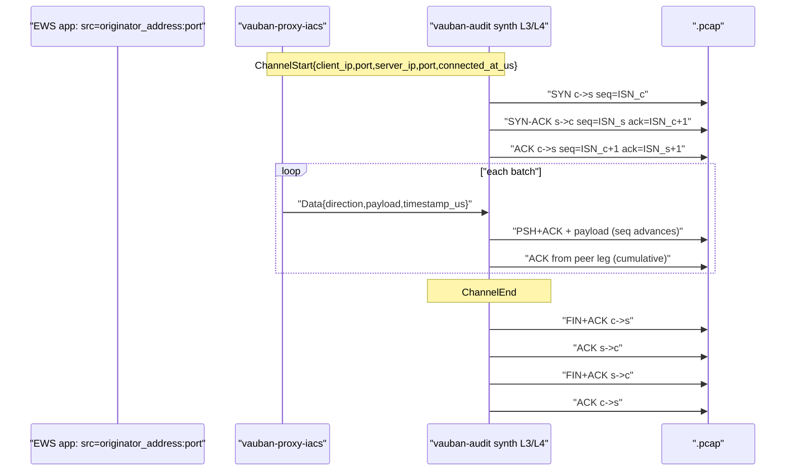
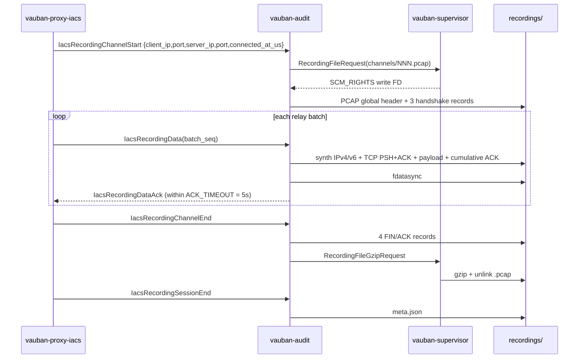

# Vauban Session Recording Architecture

**Version:** 1.5
**Date:** 24 May 2026
**Author:** Richard Ben Aleya

---

## Changelog from v1.4

| Change | Description |
|--------|-------------|
| Synthetic L3/L4 PCAP layer | Each captured chunk is wrapped in IPv4 (or IPv6) + TCP headers so `.pcap.gz` files dissect natively in tcpdump / Wireshark / Zeek -- Modbus/TCP, OPC-UA Binary, S7, EtherNet/IP are recognised by the application dissectors with zero post-processing |
| TCP three-way handshake / FIN-FIN close | Per-channel SYN / SYN-ACK / ACK at start, FIN+ACK / ACK / FIN+ACK / ACK at close, PSH+ACK + cumulative ACK on every relay batch |
| Real endpoints in PCAP | The proxy captures `originator_address` / `originator_port` (RFC 4254 §7.2 from the EWS application) and `peer_addr()` of the supervisor-brokered upstream fd; both pairs are propagated through the extended `IacsRecordingChannelStart` IPC and used by the synth layer |
| ACK timeout | `ChannelRecorder::write_batch` is now bounded by `ACK_TIMEOUT = 5s`. On timeout the relay closes the tunnel cleanly, the `AckRouter` entry is drained, and a `RecordingMetrics::ack_timeouts` counter is bumped |
| Deterministic `base_dir` | `IacsRecordingManager::compute_base_dir` derives `YYYY/MM/UUID/` from the proxy-supplied `connected_at_us` (no more `SystemTime::now()` race across month boundaries) |
| BLAKE3 aggregate alignment | `aggregate_channel_blake3` now hashes the ASCII hex bytes of every per-channel digest in order -- exactly mirroring `aggregate_rdp_blake3` (the previous behaviour decoded the bytes, breaking the documented "same rule as RDP" promise) |

Prior sections (SSH asciicast, RDP fmp4-dash, integrity hydrator, supervisor gzip broker) are unchanged from [v1.4](./Vauban_Recording_Architecture_EN(1.4).md).

---

## IACS PCAP bundle (v1.5)

### Granularity

| Level | Artefact |
|-------|----------|
| 1 Vauban session (= 1 EWS SSH login) | Directory `{YYYY}/{MM}/{session_uuid}/` |
| 1 `direct-tcpip` channel | `channels/NNN.pcap` during capture, `channels/NNN.pcap.gz` after close |
| Session end | `meta.json` listing all channels |

### Synthetic L3/L4 layer (v1.5)

Pre-1.5 the audit module emitted libpcap records under
`LINKTYPE_RAW` containing just the application bytes that
travelled through the relay. The first nibble of each record was
interpreted by the dissectors as the IP version: a Modbus PDU
starting with `0x00` was rendered as a broken IPv0 packet,
`0x03` (S7 TPKT) as a broken IPv0, and so on. tcpdump emitted
malformed-packet warnings; Wireshark refused to surface the
industrial dissectors entirely.

v1.5 introduces a **synthetic L3/L4 layer**
([`vauban-audit/src/iacs_pcap_synth.rs`](../../vauban-audit/src/iacs_pcap_synth.rs)).
Each `direct-tcpip` channel is reconstructed as a real-looking
TCP/IP conversation:



Linktype stays `LINKTYPE_RAW` (DLT 12). Wireshark / tcpdump detect
the IP family from the first nibble of the payload (`4` -> IPv4,
`6` -> IPv6) and decode straight into the application dissectors.

Endpoints are populated from:

- **`client_ip` / `client_port`**: `originator_address` /
  `originator_port` carried by the SSH `direct-tcpip`
  channel-open request (RFC 4254 §7.2). Reflects the EWS
  application's local socket.
- **`server_ip` / `server_port`**: `peer_addr()` of the
  supervisor-brokered upstream `TcpStream` (real IP of the
  industrial asset, post-resolution). Falls back to
  `(asset_host, asset_port)` from `IacsTunnelOpen` when
  `peer_addr()` is unavailable.

When `client_ip` or `server_ip` cannot be parsed as an IP literal
(typical case: `target_host` was an FQDN -- audit runs under
Capsicum and does not resolve DNS), the synth layer falls back to
`127.0.0.1`. When one side is IPv4 and the other IPv6, the IPv4
endpoint is mapped through `::ffff:a.b.c.d` so the flow stays in a
single address family.

ISNs are derived from `BLAKE3("session_id" || channel_id ||
"client" / "server")` so multiple concurrent flows have disjoint
sequence spaces and test fixtures stay reproducible.

#### Limitations

- **Checksums**: IPv4 header checksum and TCP checksum are
  emitted as zero. Both tcpdump and Wireshark accept the
  "checksum offload" pattern (a warning may be displayed,
  dissection is unaffected). The cryptographic integrity of the
  recording is anchored by per-channel BLAKE3 plus the
  session-level aggregate, NOT by per-segment TCP checksums.
- **Replay-unsafe**: the synthetic seq/ack space is detached
  from the real conversation that the proxy brokered. These
  PCAPs MUST NOT be replayed against a live asset.
- **MSS**: 65 495 bytes (IPv4) / 65 515 bytes (IPv6). Application
  chunks larger than this are split across multiple PCAP records
  with sequence numbers that advance correctly across the split.

#### Example tcpdump output

```text
$ gunzip -c 2026/05/$UUID/channels/001.pcap.gz \
   | tcpdump -nnr - -X
reading from file -, link-type RAW (Raw IP)
22:00:00.000000 IP 192.0.2.10.49152 > 198.51.100.20.502: \
    Flags [S], seq 0xdeadbeef, win 65535, length 0
22:00:00.000000 IP 198.51.100.20.502 > 192.0.2.10.49152: \
    Flags [S.], seq 0xfeedface, ack 0xdeadbef0, win 65535, length 0
22:00:00.000000 IP 192.0.2.10.49152 > 198.51.100.20.502: \
    Flags [.], ack 1, win 65535, length 0
22:00:00.001000 IP 192.0.2.10.49152 > 198.51.100.20.502: \
    Flags [P.], seq 1:13, ack 1, win 65535, length 12
        0x0000:  4500 0034 ... 0001 0000 0006 0103 0000  E..4..........
        0x0010:  000a                                     ..
22:00:00.001000 IP 198.51.100.20.502 > 192.0.2.10.49152: \
    Flags [.], ack 13, win 65535, length 0
...
```

Wireshark recognises the Modbus header bytes
(`0001 0000 0006 0103 0000 000a`) and surfaces the "Read
Holding Registers" dissector automatically.

### Data path



### `meta.json` (pcap-bundle)

```json
{
  "format": "pcap-bundle",
  "channels": [
    {
      "index": 1,
      "target_host": "plc-01.corp",
      "target_port": 502,
      "file": "channels/001.pcap.gz",
      "blake3_hex": "...",
      "file_size": 12345,
      "packet_count": 87,
      "bytes_ews_to_asset": 4096,
      "bytes_asset_to_ews": 2048,
      "opened_at_us": 0,
      "closed_at_us": 120000000
    }
  ],
  "blake3_hex": "BLAKE3(concat ASCII hex bytes of every channel.blake3_hex, in `channels` order)",
  "total_bytes": 12345,
  "total_packets": 87,
  "duration_ms": 120000
}
```

The session-level `blake3_hex` IS LITERALLY computed by hashing the
ASCII hex bytes of every channel's `blake3_hex` field in
`channels` order -- the exact same rule used by
`aggregate_rdp_blake3` for the per-segment aggregates. v1.4
documented this rule but the audit code decoded the bytes first
(historical drift); v1.5 aligns the implementation with the
documentation. The cross-validation test
`aggregate_channel_blake3_matches_rdp_aggregate_rule`
[`vauban-audit/src/iacs_recording_manager.rs`](../../vauban-audit/src/iacs_recording_manager.rs)
pins the invariant.

### Configuration

```toml
[recording]
enabled = true
storage_path = "recordings"
rdp = true
ssh = true
iacs = true
```

When `recording.enabled = true` and the per-protocol flag is set,
the supervisor injects `VAUBAN_RECORDING_ENABLED` into each proxy
(`enabled && rdp`, `enabled && ssh`, `enabled && iacs`) and into
`vauban-audit` (`enabled` alone).

### ACK timeout (v1.5)

[`ChannelRecorder::write_batch`](../../vauban-proxy-iacs/src/iacs_recording.rs)
is bounded by `ACK_TIMEOUT = 5s`. On timeout:

1. The pending entry is removed from the `AckRouter` via
   `cancel(...)` (no stale `oneshot::Sender` retained).
2. `RecordingMetrics::ack_timeouts` is incremented (atomic
   counter, supervisor surface).
3. `write_batch` returns `io::Error::new(TimedOut, ...)`.
4. The relay propagates the error -> the channel is closed
   cleanly.

This eliminates the pre-1.5 wedge mode where a slow / dead audit
caused the relay to hang indefinitely with no surface signal.

### Capsicum constraints

| Service | Recording I/O |
|---------|----------------|
| `vauban-proxy-iacs` | IPC tee only; `AsyncIpcChannel` for audit constructed **before** `cap_enter`; `peer_addr()` of upstream read pre-`into_split()` |
| `vauban-audit` | Write only on SCM_RIGHTS FDs; gzip/unlink delegated to supervisor; no DNS resolution -- IP fallback `127.0.0.1` annotated when needed |
| `vauban-supervisor` | `create_dir_all`, gzip, unlink under `recording.storage_path` |
| `vauban-web` | Read-only SCM_RIGHTS for download ZIP assembly |

### Operator UX

- **Recording list / detail**: IACS rows appear when
  `is_recorded = true` after tunnel close.
- **Play**: hidden for `iacs_tunnel` (no terminal / video
  artefact).
- **Download**: ZIP with `meta.json` and all `.pcap.gz` channels.
  After `gunzip`, every PCAP is directly Wireshark-compatible
  (Modbus/TCP, OPC-UA Binary, S7, EtherNet/IP dissect natively).
