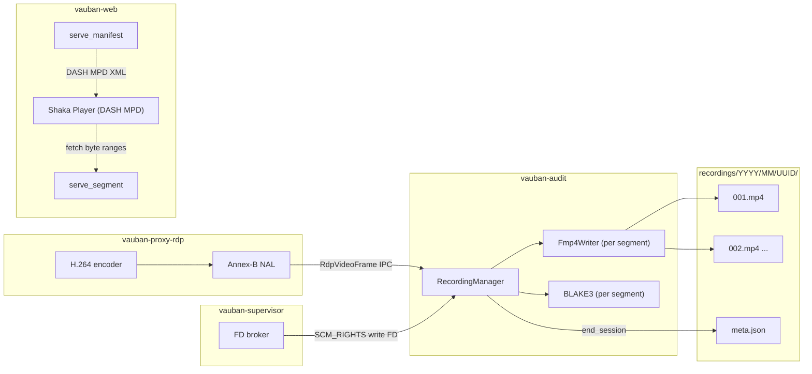
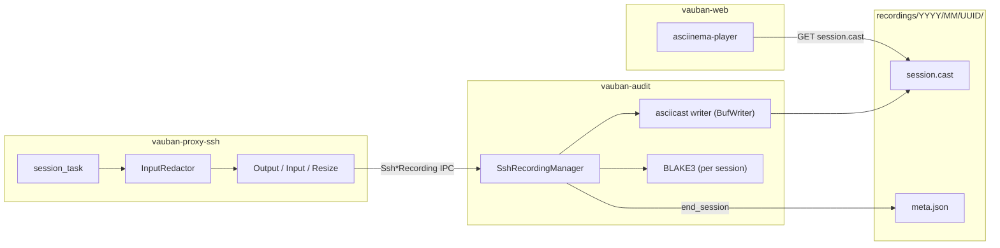
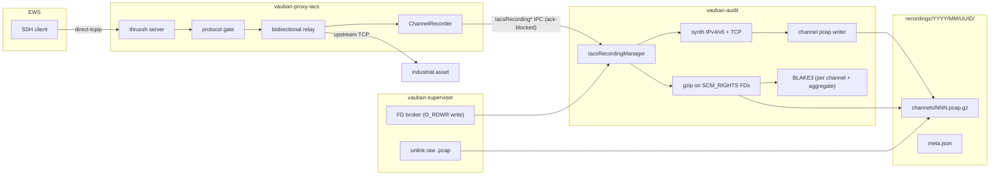
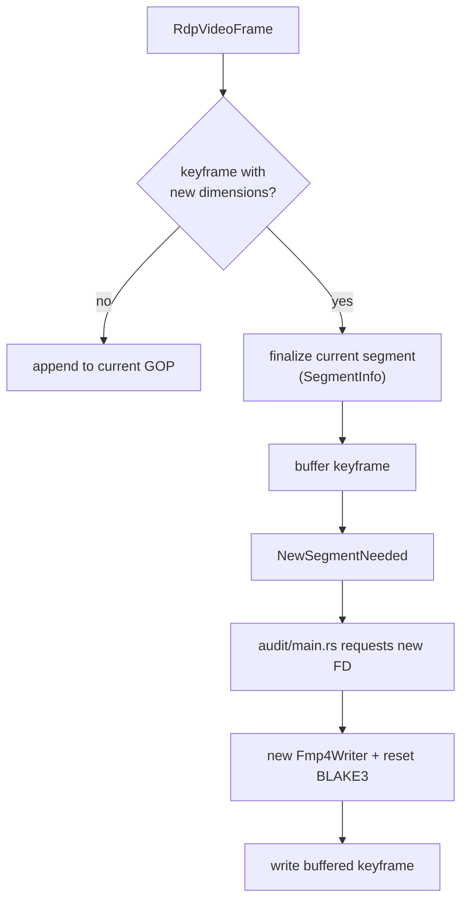
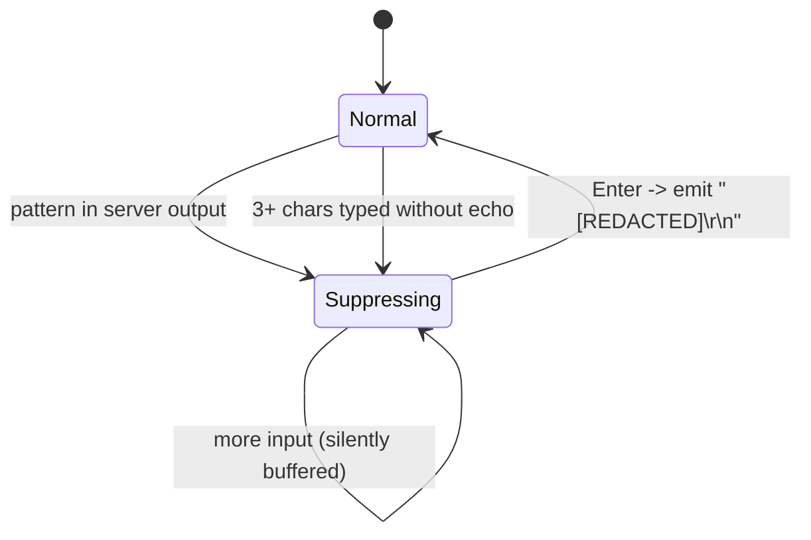
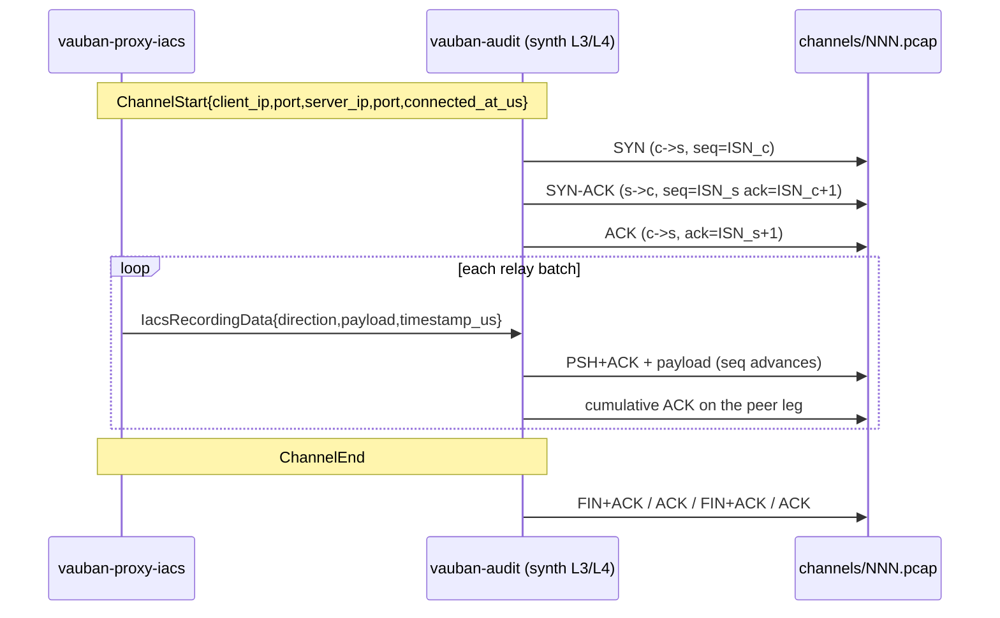
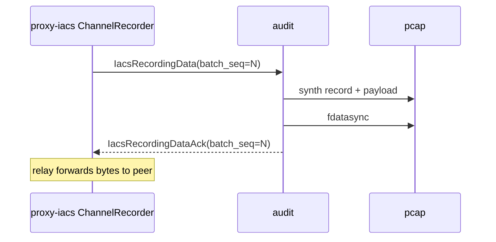
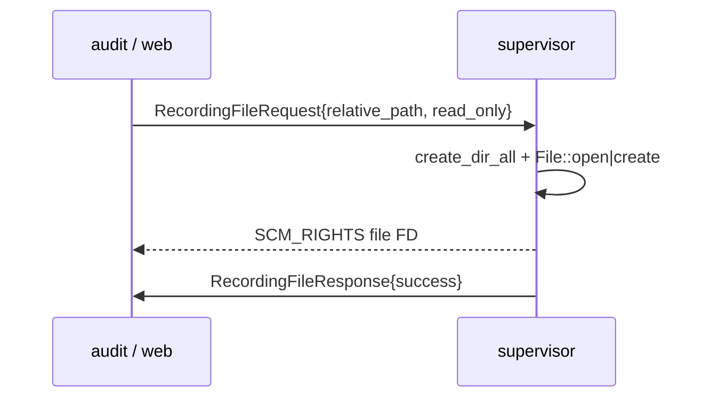
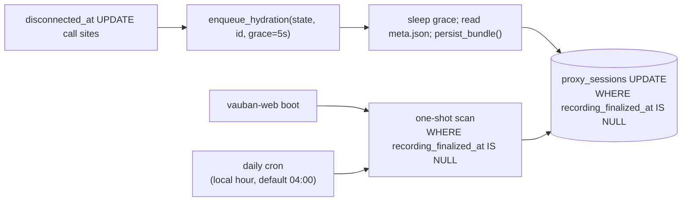

# Vauban Session Recording Architecture

**Version:** 1.9  
**Date:** 24 July 2026  
**Author:** Richard Ben Aleya

> Supersedes
> [Vauban_Recording_Architecture_EN(1.8).md](Vauban_Recording_Architecture_EN(1.8).md).

**Changes since 1.8:** SSH/RDP recording media is **proxy-owned** via
supervisor `RecordingFileRequest` SCM_RIGHTS FDs (`shared::recording_fd`).
Proxies write asciicast / fMP4 locally (BLAKE3 while writing); audit
writes `meta.json` only from enriched `*RecordingEnd` seal stats. The
IPC firehose (`SshRecordingData` / `RdpVideoFrame`) is retired for
recording. `recording_lossy` / Incomplete capture now means local
write or FD-lease failure, not audit-channel `try_send` full. IACS
remains ack-block IPC with audit-held FDs (unchanged). Shared broker
client: `shared::recording_fd`. Crate version **0.9.29**. See ADR 001
amendment.

**Amended:** 24 July 2026 -- legacy flat RDP retention delete resolves
`{uuid}.mp4.blake3` via `Path::with_added_extension("blake3")`
(`shared::recording_paths::delete_recording_storage_path`).

---

## Table of Contents

1. [Introduction](#1-introduction)
2. [Architecture Overview](#2-architecture-overview)
3. [RDP Recording](#3-rdp-recording)
4. [SSH Recording](#4-ssh-recording)
5. [IACS PCAP Bundle Recording](#5-iacs-pcap-bundle-recording)
6. [Integrity Model](#6-integrity-model)
7. [File-Descriptor Delegation](#7-file-descriptor-delegation)
8. [Hydration & Persistence](#8-hydration--persistence)
9. [Playback](#9-playback)
10. [Download](#10-download)
11. [Retention](#11-retention)
12. [Security](#12-security)
13. [Appendix A -- Storage Layout](#appendix-a----storage-layout)
14. [Appendix B -- Configuration](#appendix-b----configuration)
15. [Appendix C -- Related Documents](#appendix-c----related-documents)
16. [Appendix D -- Changelog](#appendix-d----changelog)

---

## 1. Introduction

Vauban records every privileged session it brokers so administrators
can audit, replay and prove integrity of past activity. Three
recording pipelines coexist, each tailored to the protocol they
capture:

- **RDP** -- the H.264 video stream produced by `vauban-proxy-rdp` is
  persisted as fragmented MP4 (fMP4), segmented on resolution
  changes, and replayed in DASH multi-Period mode (Section 3).
- **SSH** -- the terminal data stream flowing through
  `vauban-proxy-ssh` is captured as asciicast v2, with sensitive
  input automatically redacted before it leaves the proxy
  (Section 4).
- **IACS** -- every `direct-tcpip` channel of an EWS-to-asset SSH
  tunnel proxied by `vauban-proxy-iacs` is captured as a PCAP wrapped
  in a synthetic IPv4/IPv6 + TCP layer so industrial-protocol
  dissectors (Modbus/TCP, OPC-UA Binary, S7, EtherNet/IP) work out of
  the box in Wireshark and tcpdump (Section 5).

All three pipelines share the same backbone: file-descriptor
delegation through `vauban-supervisor` (Section 7), BLAKE3 integrity
hashing (Section 6) and a `meta.json` manifest written at session end.
After session end, an event-driven hydrator copies the meta into
PostgreSQL columns so the UI never re-parses files on the hot path
(Section 8).

### 1.1 Design Goals

| Goal | Approach | Pipelines |
|------|----------|-----------|
| Zero-copy / no re-encoding | Reuse encoded artefacts (H.264 NAL, asciicast, raw bytes) | All |
| Crash resilience | fMP4 fragments / asciicast lines (process-kill safe) + periodic `fdatasync` sweep (RDP/SSH, power-loss safe) / per-batch `fdatasync` (IACS) | All |
| Wireshark/tcpdump compatibility | Synthetic IPv4 + TCP layer around captured chunks | IACS |
| Tamper detection | BLAKE3 -- per-segment (RDP), per-session (SSH), per-channel + aggregate (IACS) | All |
| Sandbox compatibility | SCM_RIGHTS for I/O; unlink delegated to supervisor; IACS gzip on audit FDs | All |
| Bounded backpressure | `fdatasync` then ack; relay blocks on ack with a timeout (IACS) | IACS |
| Backward compatibility | Legacy single-file RDP recordings still play through `<video>` | RDP |

### 1.2 Services in the Recording Path

| Service | Role | Sandbox |
|---------|------|---------|
| `vauban-proxy-rdp` | Encodes H.264 frames, tees them to web (live) and audit (record) | Capsicum |
| `vauban-proxy-ssh` | Terminates SSH PTY sessions, redacts input, tees data to audit | Capsicum |
| `vauban-proxy-iacs` | Brokers EWS SSH tunnels, tees `direct-tcpip` bytes to audit | Capsicum |
| `vauban-audit` | Persists artefacts, writes `meta.json`, emits per-batch ack (IACS) | Capsicum |
| `vauban-supervisor` | Brokers FDs (write side for proxies/audit, read side for web), unlink raw IACS `.pcap` after audit gzip | Root |
| `vauban-web` | Serves Recording List, Recording Details, playback, download; runs the hydrator | Capsicum |

---

## 2. Architecture Overview

### 2.1 Data flow (RDP)



### 2.2 Data flow (SSH)



### 2.3 Data flow (IACS)



### 2.4 Module Layout

```
vauban-audit/src/
    main.rs                      IPC dispatcher; SCM_RIGHTS file requests
    recording_manager.rs         RDP segmentation + per-segment BLAKE3
    fmp4_writer.rs               ISO-BMFF box generation
    ssh_recording_manager.rs     asciicast writer + per-session BLAKE3
    iacs_recording_manager.rs    PCAP bundle orchestration
    iacs_pcap_synth.rs           Synthetic IPv4/v6 + TCP layer

vauban-proxy-rdp/src/
    session.rs                   dual dispatch (web + audit), grace period

vauban-proxy-ssh/src/
    input_redactor.rs            two-layer password detection
    session_manager.rs           dual dispatch + redactor wiring

vauban-proxy-iacs/src/
    server.rs                    direct-tcpip channel open, endpoint capture
    iacs_recording.rs            ChannelRecorder, AckRouter, RecordingMetrics

vauban-web-evidence/src/hydrator/
    deps.rs                      HydratorDb / MetaFd / Notify traits
    pipeline.rs                  RecordingHydrator + parse_meta + WS helpers

vauban-web/src/
    handlers/web/sessions.rs     manifest, segment, ssh stream, recordings list
    handlers/web/recordings.rs   Recording Details + download
    services/recording_hydrator/ adapters (Diesel / SupervisorMetaFd / Broadcast)
                                 + enqueue_hydration facades
    tasks/recording_hydrator.rs  bootstrap + daily reconciliation cron
    services/recording_reaper.rs daily retention reaper
    ipc/supervisor.rs            request_recording_file (read-only FD)

shared/src/
    messages.rs                  RecordingFileRequest/Response,
                                  Rdp/Ssh/Iacs Recording IPC variants,
                                  RecordingFileUnlink{Request,Response}
                                  (Gzip variants kept mid-enum as
                                  deprecated wire-compat stubs)
```

### 2.5 Recording Path Convention

Every protocol stores artefacts under
`{storage_path}/YYYY/MM/{session_uuid}/`. The `YYYY/MM` partition is
derived from the **session start** (`connected_at`):

- RDP / SSH: derived in `vauban-audit` from the IPC start message.
- IACS: derived deterministically from the proxy-supplied
  `connected_at_us`. Both audit and the web hydrator compute the same
  path, so a tunnel that straddles a month boundary cannot split its
  artefacts between two month folders.

The directory is the canonical handle stored in
`proxy_sessions.recording_path` (always ending with `/`). The single
exception is the legacy pre-segmentation RDP layout
(`recordings/YYYY/MM/{uuid}.mp4`), kept for backward compatibility on
older recordings.

### 2.6 IPC Catalogue

| Family | Direction | Purpose |
|--------|-----------|---------|
| `RecordingFileRequest` / `RecordingFileResponse` | proxy/audit/web -> supervisor | Request a write- or read-side FD via SCM_RIGHTS (write opens are O_RDWR so audit can seek+gzip) |
| `RecordingFileUnlinkRequest` / `RecordingFileUnlinkResponse` | audit -> supervisor | Unlink raw IACS `.pcap` after audit gzip + fdatasync of `.pcap.gz` |
| `RecordingFileGzipRequest` / `RecordingFileGzipResponse` | (deprecated stub) | Mid-enum wire-compat only; supervisor always replies `success: false` |
| `RecordingDeleteRequest` / `RecordingDeleteResponse` | web -> supervisor | Reaper: remove the per-session directory |
| `RdpRecordingStart` / `RdpRecordingEnd` (enriched seal stats) | proxy-rdp -> audit | RDP lifecycle; media is proxy FD write (no `RdpVideoFrame` firehose) |
| `SshRecordingStart` / `SshRecordingEnd` (enriched seal stats) | proxy-ssh -> audit | SSH lifecycle; media is proxy FD write (legacy `SshRecordingData` ignored) |
| `IacsRecordingChannelStart`, `IacsRecordingData`, `IacsRecordingChannelEnd`, `IacsRecordingSessionEnd` | proxy-iacs -> audit | IACS recording control + payload |
| `IacsRecordingDataAck` | audit -> proxy-iacs | Per-batch durability ack (gates relay forward) |

All variants travel on the existing bincode-serialized IPC pipes
already used by Vauban.

---

## 3. RDP Recording

### 3.1 Pipeline

`vauban-proxy-rdp` already encodes one H.264 stream for live viewing.
The same NAL units are dispatched to `vauban-audit` through the
existing IPC channel; recording is purely a fan-out, never a separate
encode. `RecordingManager` owns the per-session state, holds an
`Fmp4Writer` per active segment, accumulates frames in memory and
flushes a `moof+mdat` pair every keyframe (one fragment per GOP).

### 3.2 Segmentation on Resolution Change

A standard MP4 `moov` box is fixed at file creation -- when the desktop
resolution changes mid-session, SPS/PPS and dimensions stored in
`moov` would no longer match the data, breaking the file. Vauban
sidesteps this by closing the current fMP4 segment and opening a new
one, each segment carrying its own valid `moov`:



The session-level metadata is the ordered list of `SegmentInfo`
records, each capturing the data needed for downstream playback and
integrity:

```rust
pub struct SegmentInfo {
    pub index: u32,           // 1-based
    pub width: u16,
    pub height: u16,
    pub duration_ticks: u64,  // 90 kHz timescale
    pub init_size: u64,       // ftyp+moov bytes (DASH Initialization range)
    pub file_size: u64,
    pub blake3_hex: String,
    pub codec_string: String, // "avc1.42c01e", ...
}
```

### 3.3 Fragmented MP4

Each `*.mp4` segment is a fragmented MP4 (`isom`, `iso5`, `mp41`
brands) with the layout:

```
ftyp
moov
    mvhd, trak (tkhd, mdia(mdhd, hdlr, minf(vmhd, dinf, stbl(stsd(avc1(avcC))))))
    mvex / trex
[ moof + mdat ]*    one pair per GOP, written as the keyframe arrives
```

NAL units are converted from Annex-B (start codes) to AVCC (4-byte
length prefix) before being written to `mdat`; SPS/PPS are stripped
from `mdat` because they already live in `avcC` inside `moov`. Storing
each GOP as a self-describing fragment yields **crash resilience**: a
process kill loses at most the GOP being written, never previously
flushed fragments. Each finalized segment (resolution split or session
end) is additionally `fdatasync`'d before its writer is dropped, and a
periodic sweep (Section 4.4) bounds the power-loss window for the
in-progress segment to roughly one `fdatasync` interval.

### 3.4 Post-Resize Grace Period

When the desktop resolution changes (RDP `DeactivateAll` /
`Reactivation` sequence), the framebuffer is recreated black and
progressively repainted by region updates. Without mitigation, the
encoder would capture 200-500 ms of black frames into the new
segment. `vauban-proxy-rdp` therefore suppresses encoding for 500 ms
after a resize, then sends a `ForceKeyframe` so the next encoded
frame is the fully repainted image.

| Constraint | Result |
|---|---|
| No black frames recorded | Encoding paused during grace period |
| No real frames lost | First frame after grace contains all accumulated updates |
| Keyframe at segment boundary | `ForceKeyframe` issued when grace expires |
| Live-stream impact | 500 ms freeze during resolution transition |

### 3.5 Timestamps

Frame timestamps arrive in microseconds and are stored in 90 kHz MP4
ticks (`duration_ticks = round(duration_us * 90_000 / 1_000_000)`).
Two consecutive frames with identical timestamps fall back to a 30 fps
duration (3000 ticks).

---

## 4. SSH Recording

### 4.1 Format

SSH terminal sessions are recorded in
[asciicast v2](https://docs.asciinema.org/manual/asciicast/v2/), a
line-delimited JSON format. The first line is the header; every
subsequent line is a 3-tuple `[time, "o"|"i"|"r", payload]`:

```json
{"version":2,"width":120,"height":40,"timestamp":1710700000,"title":"SSH: user@asset"}
[0.000000,"o","$ "]
[0.500000,"i","ls -la\r"]
[0.750000,"o","total 42\r\n..."]
[5.200000,"o","Password: "]
[8.100000,"i","[REDACTED]\r\n"]
[12.000000,"r","160x50"]
```

| Code | Direction | Notes |
|------|-----------|-------|
| `o` | server -> user | Always recorded verbatim |
| `i` | user -> server | Filtered through `InputRedactor` |
| `r` | terminal resize | `"COLSxROWS"` |

Timestamps are seconds with microsecond precision, relative to the
first event. The `.cast` file is the only artefact; `meta.json`
captures format, BLAKE3 hash, total byte count, event count,
duration and final geometry.

### 4.2 Input Redaction

The redactor in `vauban-proxy-ssh/src/input_redactor.rs` is the
single most security-critical component of the SSH pipeline: secrets
are scrubbed **before** they leave the proxy, so `vauban-audit`, the
filesystem and the playback client never see them. It combines two
independent layers; either one is sufficient to enter suppression
mode:



| Layer | Trigger | Catches |
|-------|---------|---------|
| Pattern | Hardcoded substrings: `password:`, `passphrase`, `[sudo]`, `enter pin`, `verification code`, `token:`, `secret:`, `become password`, `login:` (case-insensitive) | English prompts and common tools |
| Echo suppression | `>= 3` printable input chars without echo back from the server | Foreign-language prompts, custom scripts, anything that turns off the `ECHO` termios flag |

The pattern list is intentionally **non-configurable**: redaction is a
security mechanism, and a misconfigured pattern list would silently
weaken every recording. The 3-character threshold is chosen so that
single-key vi/nano commands (`:`, `q`, ...) do not trigger suppression.

### 4.3 Asynchrony with Live Viewing

Recording is a fan-out from the same `session_task` that serves the
WebSocket. Live data flows to the web sandbox unredacted because the
operator is the same person typing the password; only the **stored**
copy is redacted.

### 4.4 Durability (periodic `fdatasync` sweep)

SSH (`.cast`) and RDP (`.mp4`) media are written through a `BufWriter`:
each event/fragment is `flush`ed to the kernel page cache (so a process
crash never loses already-written bytes), but a flush alone does **not**
survive a power loss or kernel panic. To bound that window without the
per-batch backpressure model used by IACS (Section 5.3) -- which would
add latency to interactive sessions -- `vauban-audit` runs a **periodic
`fdatasync` sweep inside its existing single-threaded poll loop**:

1. Each recording session carries a `dirty` flag, set when bytes reach
   its writer and cleared after a successful sync.
2. Once per `VAUBAN_RECORDING_FSYNC_INTERVAL_MS` (default **1000 ms**)
   the loop calls `sync_dirty()` on the SSH and RDP managers, which
   `flush` + `fdatasync` (`File::sync_data`) every dirty session and
   skip idle ones (no syscall). A final sweep runs at shutdown.
3. Setting the interval to **0** disables the sweep entirely, restoring
   the pre-feature behaviour -- an instant operator-level rollback knob
   that needs no binary redeploy.

This is **durability-only**: the sweep never touches the byte stream or
the BLAKE3 hasher, so the integrity invariant `recording_blake3 ==
BLAKE3(bytes on disk)` (Section 6) is preserved by construction. Because
the proxies write recording media on leased FDs (non-blocking for the
interactive path); audit receives seal stats via `*RecordingEnd`. Legacy
docs referred to non-blocking `try_send` into audit —
even a slow `fdatasync` (e.g. on cloud block storage) can never add
latency to a user's SSH/RDP session -- at worst it slows audit drainage
under a burst. IACS is unchanged: it keeps its stronger per-batch
`fdatasync` + ack backpressure.

---

## 5. IACS PCAP Bundle Recording

EWS-to-asset SSH tunnels brokered by `vauban-proxy-iacs` carry
industrial-protocol traffic over per-`direct-tcpip` channels. Each
channel becomes one PCAP file and the union of channels for a
session becomes a **bundle** described by `meta.json`.

### 5.1 Granularity

| Level | Artefact |
|-------|----------|
| Vauban session (one EWS SSH login) | `recordings/YYYY/MM/UUID/` |
| `direct-tcpip` channel | `channels/NNN.pcap` then `channels/NNN.pcap.gz` after close |
| Session end | `meta.json` enumerating every channel |

### 5.2 Synthetic L3/L4 Layer

The PCAP files use `LINKTYPE_RAW` (DLT 12), where each record begins
with an IP header. tcpdump and Wireshark detect IPv4 vs IPv6 from the
first nibble. To make the captured industrial traffic dissectable
out of the box, `vauban-audit` synthesizes a realistic TCP/IP
conversation around every captured chunk:



| Element | Choice | Rationale |
|---------|--------|-----------|
| Endpoints (client) | `originator_address` / `originator_port` from the SSH `direct-tcpip` open (RFC 4254 §7.2) | Real EWS process socket as seen by the EWS |
| Endpoints (server) | `peer_addr()` of the supervisor-brokered upstream `TcpStream`; falls back to `(asset_host, asset_port)` | Real industrial-asset IP |
| Address-family fallback | Mixed IPv4/IPv6 mapped through `::ffff:a.b.c.d`; non-IP literals fall back to `127.0.0.1` (audit cannot resolve DNS under Capsicum) | Keeps the flow in a single family |
| ISNs | `BLAKE3("session_id" \|\| channel_id \|\| "client"\|"server")` | Disjoint sequence spaces; reproducible test fixtures |
| Sequence numbers | Increment by `payload.len()`; +1 per direction for SYN/FIN | Matches real TCP semantics |
| Cumulative ACKs | Emitted on the peer leg after every data record | Wireshark renders symmetric flow |
| Flags | `SYN`, `SYN+ACK`, `ACK`, `PSH+ACK`, `FIN+ACK` | No `RST` -- channel close is always graceful |
| Window | Fixed `65535` | Forensic capture, no congestion simulation |
| Segmentation | Splits chunks larger than `65495` (IPv4) or `65515` (IPv6) bytes across multiple records, sequence advancing | Respects the 16-bit IP length field |
| Checksums | Emitted as `0` | Accepted by tcpdump/Wireshark as "checksum offload"; integrity is anchored by BLAKE3 |

> **Replay safety.** The synthetic seq/ack space is decoupled from the
> live conversation that actually happened. These PCAPs MUST NOT be
> replayed against a live asset.


### 5.3 Backpressure & Durability

The proxy MUST NOT forward bytes to the peer until they are durable
on the audit side. Each `IacsRecordingData` carries a monotonic
`batch_seq`; the audit writes the synthetic records, calls
`fdatasync`, and only then emits an `IacsRecordingDataAck`. The
`ChannelRecorder::write_batch` future blocks on that ack:



The block is bounded by `ACK_TIMEOUT = 5s`. On timeout:

1. The pending entry is removed from `AckRouter` (no leaked
   `oneshot::Sender`).
2. `RecordingMetrics::ack_timeouts` is incremented (atomic, exposed
   for supervisor metrics).
3. `write_batch` returns `io::Error::TimedOut`.
4. The relay propagates the error and closes the SSH channel
   gracefully.

This is the durability backbone: a slow audit produces backpressure
on the relay, never silent frame drops; a dead audit closes the
tunnel within five seconds with a visible signal.

### 5.4 Audit Gzip + Supervisor Unlink

`vauban-audit` cannot `open()` / `unlink()` under Capsicum, but it
**can** gzip and hash on FDs already received via SCM_RIGHTS. On
`IacsRecordingChannelEnd` the work is split so CPU does not occupy
the main poll loop (MFA / WORM HOL):

1. **Main loop (broker):** `end_channel` → timed
   `RecordingFileRequest` for `channels/NNN.pcap.gz` → enqueue
   `GzipCpuJob` → return to `poll`. Web AuditEvents stay
   priority-drained.
2. **Worker thread (CPU only):** flush/seek raw FD,
   `gzip_channel_pcap_on_fds` + BLAKE3, `dst.sync_data()`, drop
   raw FD; wakeup pipe notifies main. No `IpcChannel`.
3. **Main loop (complete):** `RecordingFileUnlinkRequest` for the
   raw `.pcap`; only on unlink OK call
   `finalize_channel_gzip(blake3_hex, file_size)`.
4. **`IacsRecordingSessionEnd`:** deferred while pending gzip jobs
   for that `session_id` are non-zero (meta.json after barrier).

Fail-closed order unchanged: success requires `sync_data(dst)` OK
**then** unlink OK. Gzip CPU never runs in the supervisor root
process.

### 5.5 `meta.json`

```json
{
  "format": "pcap-bundle",
  "channels": [
    {
      "index": 1,
      "target_host": "plc-01.corp",
      "target_port": 502,
      "file": "channels/001.pcap.gz",
      "blake3_hex": "...",
      "file_size": 12345,
      "packet_count": 87,
      "bytes_ews_to_asset": 4096,
      "bytes_asset_to_ews": 2048,
      "opened_at_us": 0,
      "closed_at_us": 120000000
    }
  ],
  "blake3_hex": "BLAKE3(concat ASCII hex bytes of each channel.blake3_hex, in `channels` order)",
  "total_bytes": 12345,
  "total_packets": 87,
  "duration_ms": 120000
}
```

The session-level `blake3_hex` is computed by hashing the **ASCII hex
bytes** of every channel's per-channel digest, in `channels` order --
the exact same rule that aggregates RDP per-segment digests. A
cross-validation test pins the equivalence so the two pipelines never
drift apart.

### 5.6 Capsicum Constraints

| Service | Recording I/O |
|---------|--------------|
| `vauban-proxy-iacs` | IPC tee only; `AsyncIpcChannel` to audit constructed **before** `cap_enter`; `peer_addr()` of upstream read **before** `into_split()` |
| `vauban-audit` | Writes / gzip / BLAKE3 only on FDs received via SCM_RIGHTS; no DNS; unlink delegated to supervisor |
| `vauban-supervisor` | Owns `create_dir_all` and unlink under `recording.storage_path` (no flate2 / GzEncoder) |
| `vauban-web` | Read-only SCM_RIGHTS for ZIP assembly |

Two source-grep CI scripts pin these invariants:
`vauban-audit/scripts/check_iacs_pcap_synth.sh` (every PCAP record
goes through `iacs_pcap_synth::build_*`) and
`vauban-proxy-iacs/scripts/check_recording_capsicum.sh` (no
`try_send` on the recording channel, no `TcpStream::connect`
post-Capsicum, audit IPC built before `setup_service_sandbox`).

---

## 6. Integrity Model

A single column on `proxy_sessions`, `recording_blake3`, exposes a
uniform `VARCHAR(64)` lowercase hex digest (DB CHECK
`~ '^[0-9a-f]{64}$'`). The way that digest is computed depends on
the protocol:

| Pipeline | Per-unit hash | Aggregate exposed in `recording_blake3` |
|----------|---------------|-----------------------------------------|
| RDP | One BLAKE3 per fMP4 segment (over raw Annex-B NAL data, before AVCC conversion) | `BLAKE3(concat(ASCII hex bytes of every segment hash, in segment order))` |
| SSH | One BLAKE3 over the full `.cast` (header + every event line) | Same single digest |
| IACS | One BLAKE3 per `.pcap.gz` (computed by audit after gzip + fdatasync, before unlink) | `BLAKE3(concat(ASCII hex bytes of every channel hash, in channel order))` |

The aggregate rule is intentionally identical for RDP and IACS. A
verifier with only `meta.json` and the artefacts can recompute and
compare in linear time without any side-channel. BLAKE3 was chosen
for the speed (>1 GB/s on a single core) and the streaming API
(no buffering required).

---

## 7. File-Descriptor Delegation

`vauban-audit` and `vauban-web` run inside Capsicum sandboxes; after
`cap_enter()` they cannot `open()`, `mkdir()`, or `stat()`. The same
SCM_RIGHTS broker pattern used for TCP brokering (see
[Privsep Architecture](Vauban_Privsep_Architecture_EN(1.3).md) §5.5)
serves recording files:



```rust
RecordingFileRequest {
    request_id: u64,           // correlates async req/resp
    session_id: String,
    relative_path: String,     // YYYY/MM/uuid/{file}
    read_only: bool,           // true = open existing (web), false = create (proxy SSH/RDP media + audit meta/IACS)
}
```

Capsicum compliance:

| Service | Direct FS access | Recording I/O via |
|---------|------------------|-------------------|
| `vauban-supervisor` | Yes | Native syscalls |
| `vauban-audit` | No | SCM_RIGHTS write FDs (`meta.json`, IACS PCAP/gzip) |
| `vauban-web` | No | SCM_RIGHTS read-only FDs |
| `vauban-proxy-{ssh,rdp}` | No | SCM_RIGHTS write FDs for media (`session.cast` / fMP4 segments) |
| `vauban-proxy-iacs` | No | Recording payloads via ack-blocked IPC (audit holds PCAP FDs) |

The supervisor enforces path safety: every requested path is
canonicalised against `recording.storage_path`, traversal is
rejected, and segment indices are validated as ASCII digits.

---

## 8. Hydration & Persistence

### 8.1 Why Persist `meta.json` into the Database

Recording Details (`/sessions/recordings/{uuid}`) renders integrity
metadata, file size, duration, geometry and per-protocol fields on
every page load. Re-reading and parsing `meta.json` on every render
would add an FD-passing round-trip and a JSON parse to a hot path. A
ten-column extension on `proxy_sessions` materialises the artefact's
manifest into the database, where the page reads it cheaply.

| Column | Type | Semantics |
|---|---|---|
| `recording_blake3` | `VARCHAR(64)` | Aggregate digest, see §6 |
| `recording_size_bytes` | `BIGINT` | Sum of artefact sizes |
| `recording_duration_ms` | `BIGINT` | Wall-clock duration |
| `recording_event_count` | `INTEGER` | SSH only (asciicast events); NULL otherwise |
| `recording_format` | `VARCHAR(32)` | One of `asciicast-v2`, `fmp4-dash`, `fmp4-flat`, `pcap-bundle` (DB CHECK pinned) |
| `recording_width` | `SMALLINT` | Final geometry width |
| `recording_height` | `SMALLINT` | Final geometry height |
| `recording_segment_count` | `INTEGER` | RDP only |
| `recording_codec` | `VARCHAR(64)` | RDP only (`avc1.42c01e`, ...) |
| `recording_finalized_at` | `TIMESTAMPTZ` | Set after a successful UPDATE; doubles as the "this row is done" marker |

A partial index keeps the hydrator's batch scans cheap:

```sql
CREATE INDEX idx_proxy_sessions_pending_finalization
    ON proxy_sessions (created_at)
    WHERE is_recorded = TRUE
      AND recording_path IS NOT NULL
      AND recording_finalized_at IS NULL;
```

### 8.2 Three Coordinated Mechanisms



| Mechanism | Trigger | Latency | Coverage |
|-----------|---------|---------|----------|
| Bootstrap | `vauban-web` boot | Seconds after boot | Backlog (legacy + downtime) |
| `enqueue_hydration` (PRIMARY) | Every `disconnected_at` UPDATE call site | `hydration_enqueue_delay_secs` (default 5 s) | The session that just ended |
| Daily reconciliation cron | Configured local hour | Up to 24 h | SAFETY NET only |

The 5 s grace absorbs the race between `vauban-web` (which stamps
`disconnected_at` as soon as the WS closes) and `vauban-audit`
(which flushes `meta.json` a few hundred milliseconds later). The
daily cron exists only to catch corner cases (web crash between
UPDATE and `tokio::spawn`, audit flush slower than the grace, a new
call site missing the `enqueue_hydration` adjacent invocation).
Source-level CI tests pin every `disconnected_at.eq(...)` call site
to a nearby `enqueue_hydration*` so the PRIMARY path cannot silently
drift.

Every UPDATE is gated by `WHERE recording_finalized_at IS NULL`, so
double-enqueues are silent no-ops -- the hydrator is idempotent by
construction.

### 8.3 Failure Modes

| Condition | Hydrator action | UI surface |
|-----------|-----------------|------------|
| `meta.json` missing within `hydration_missing_meta_grace_secs` (default 300 s) | DEBUG `skipped_missing_meta`; row stays unfinalized; next bootstrap or cron retries | "Integrity metadata pending finalization" |
| `meta.json` missing past grace | WARN once; `recording_finalized_at = NOW()` with NULL columns | "Integrity metadata unavailable" |
| `meta.json` corrupt | ERROR; same NULL-finalize pattern | "Integrity metadata unavailable" |
| Legacy flat `.mp4` (`recording_path` does not end with `/`) | INFO once; `recording_format = 'fmp4-flat'`; never retried | "Integrity metadata unavailable" |
| Supervisor down (dev mode) | Hydrator short-circuits; bootstrap and cron skipped; logged at boot | "Integrity metadata pending finalization" indefinitely |


---

## 9. Playback

### 9.1 Recording-Type Detection

`session_type` together with `recording_path` decides the playback
path. The template branches first on `is_ssh()`, then on
`is_segmented()`:

| Session type | `recording_path` | Player |
|--------------|------------------|--------|
| `ssh` | ends with `/` | asciinema-player (`session.cast`) |
| `rdp` | ends with `/` | Shaka Player + DASH MPD |
| `rdp` | ends with `.mp4` | Native `<video>` (legacy) |
| `iacs_tunnel` | ends with `/` | None -- Play action is hidden; the **Inspect Capture** action opens the inline PCAP analyzer instead (see `Vauban_IACS_Inspect_Capture_EN(1.0).md`) |

### 9.2 RDP -- DASH Multi-Period

`serve_manifest` builds an MPD on the fly from `meta.json`:

```xml
<MPD type="static" mediaPresentationDuration="PT0H10M30.500S"
     profiles="urn:mpeg:dash:profile:isoff-main:2011">
  <Period id="1" duration="PT0H5M15.000S">
    <AdaptationSet mimeType="video/mp4" startWithSAP="1">
      <Representation codecs="avc1.42c01e" width="1280" height="720" bandwidth="500000">
        <BaseURL>/recordings/uuid/001.mp4</BaseURL>
        <SegmentList>
          <Initialization range="0-511"/>
          <SegmentURL mediaRange="512-524287"/>
        </SegmentList>
      </Representation>
    </AdaptationSet>
  </Period>
  <!-- one Period per SegmentInfo -->
</MPD>
```

`isoff-main` + `SegmentList` is used (rather than `isoff-on-demand` +
`SegmentBase`) because the fMP4 writer does not emit `sidx` boxes;
`SegmentList` provides explicit byte ranges for the initialization
segment (`ftyp+moov`) and the media data (`moof+mdat`). `serve_segment`
streams those byte ranges with HTTP Range support so Shaka Player can
seek without buffering whole files.

### 9.3 SSH -- asciinema-player

A single GET on `/recordings/{uuid}/session.cast` streams the
asciicast as `application/x-asciicast`. asciinema-player (MIT) is
loaded as an external script and initialized by reading
`data-src` / `data-*` attributes (CSP-compliant, no inline JS):

```html
<div id="player" data-src="/recordings/uuid/session.cast"></div>
<link rel="stylesheet" href="/static/css/asciinema-player.css">
<script src="/static/js/asciinema-player.min.js"></script>
<script src="/static/js/asciinema-init.js"></script>
```

### 9.4 Legacy RDP

Pre-segmentation recordings (single `.mp4` file at
`recordings/YYYY/MM/{uuid}.mp4`) keep the original native `<video>`
playback path with HTTP Range. The hydrator flags them as
`fmp4-flat`; the UI surfaces "Integrity metadata unavailable".

### 9.5 Memory Footprint

Playback handlers never load files into memory.
`tokio_util::io::ReaderStream` streams content in 64 KB chunks,
keeping memory per request constant regardless of file size, and
HTTP Range support translates into `206 Partial Content` responses.

---

## 10. Download

`GET /sessions/recordings/{uuid}/download` produces a different
artefact per protocol, all without re-encoding:

| Pipeline | Content-Type | Body |
|----------|--------------|------|
| SSH | `application/x-asciicast` | The raw `.cast` |
| RDP | `application/zip` | Streaming uncompressed ZIP (`Stored`): every `NNN.mp4` segment + the rendered `manifest.mpd` + `meta.json` |
| IACS | `application/zip` | Streaming uncompressed ZIP (`Stored`): `meta.json` + every `channels/NNN.pcap.gz` |

Both ZIP streams use `Stored` because the contents are either H.264
elementary streams or already gzipped -- re-deflating would burn CPU
for a larger output. The body is piped through a
`tokio::io::DuplexStream` so the first byte hits the wire as soon as
the first FD is received. Missing segments / channels surface as
`404 Not Found` rather than truncated downloads, because every FD is
fetched eagerly before streaming starts.

After `gunzip`, every IACS PCAP is directly Wireshark-compatible:
Modbus/TCP, OPC-UA Binary, S7, EtherNet/IP all dissect natively
thanks to the synthetic L3/L4 layer.

---

## 11. Retention

`vauban-web` runs an event-driven reaper
(`services/recording_reaper.rs`, `tasks/recording_reaper.rs`) that
mirrors the hydrator's BOOTSTRAP / SAFETY structure:

```text
BOOTSTRAP  vauban-web boot       -> one-shot scan, delete aged / quota backlog
SAFETY     daily cron, configured local hour -> bootstrap re-run
```

Two passes:

1. **Age** -- delete recordings whose `disconnected_at` is older than
   `retention_days` (default 365).
2. **Quota** -- if `retention_max_size_gib > 0`, delete oldest
   finalized recordings (FIFO by `disconnected_at`) until the total
   `recording_size_bytes` is under cap. Quota beats age.

Disk deletion goes through `RecordingDeleteRequest`, handled by
`vauban-supervisor` (`shared::recording_paths::
delete_recording_storage_path`). The same transaction clears all
`recording_*` columns and sets `is_recorded = false`; the
`proxy_sessions` row remains for session audit. Configuration is
TOML-only (`[recording].retention_*`) -- no web UI or API knob.
Operational runbook: [recording_retention.md](../runbooks/recording_retention.md).

---

## 12. Security

### 12.1 Access Control

Recording surfaces (list, details, playback, download) are gated by
Casbin `admin_view` through `PermissionContext`
(see [Casbin/PermissionContext rule](../../.cursor/rules/casbin-permissions.mdc)).
A valid request must additionally point at a row in `proxy_sessions`
with `is_recorded = TRUE` and a non-NULL `recording_path`. Detail
pages are UUID-keyed and every 404-class denial returns a generic
404 to defeat enumeration.

### 12.2 SSH Input Redaction

Defense in depth: redaction happens in `vauban-proxy-ssh` before the
IPC tee. Passwords therefore never reach `vauban-audit`, the
filesystem or the playback client. Both layers (pattern + echo) are
independently sufficient and the pattern list is non-configurable.

### 12.3 Path-Traversal Prevention

`vauban-web` never touches the filesystem. `recording_path` is read
from the database, stripped to a relative path, and passed to the
supervisor. The supervisor canonicalises against
`recording.storage_path`; traversal escapes are rejected. Segment
indices in URLs are validated as ASCII digits before being forwarded.

### 12.4 Content Security Policy

Every player initialization script is loaded as an external file
from the same origin (no `'unsafe-inline'` in `script-src`). Each
script reads its configuration from `data-*` attributes on DOM
elements. The CSP includes `media-src 'self' blob:` because Shaka
Player feeds MSE through blob URLs.

### 12.5 IACS Capsicum Invariants

See §5.6. Source-grep CI scripts pin the audit and proxy invariants
so the synthetic L3/L4 layer cannot be bypassed and the audit IPC
channel cannot be constructed after `cap_enter()`.

### 12.6 Replay Safety (IACS)

Synthetic seq/ack numbers are decoupled from the live conversation.
`.pcap.gz` files are forensic artefacts only; replaying them against
a live asset would collide with active TCP state.

---

## Appendix A -- Storage Layout

```
recordings/
    2026/
        03/
            <ssh-uuid>/
                session.cast
                meta.json
            <rdp-uuid>/
                001.mp4              # Segment 1 (e.g. 1280x720)
                002.mp4              # Segment 2 (e.g. 1920x1080) -- only if resize
                meta.json
        05/
            <iacs-uuid>/
                channels/
                    001.pcap.gz
                    002.pcap.gz
                meta.json
        02/
            <legacy-rdp-uuid>.mp4    # Pre-segmentation; backward-compatible
            <legacy-rdp-uuid>.mp4.blake3
```

Retention delete resolves the integrity sidecar with
`Path::with_added_extension("blake3")` on the media path (so
`uuid.mp4` becomes `uuid.mp4.blake3` without replacing the `.mp4`
extension). See `shared::recording_paths::delete_recording_storage_path`.

The `YYYY/MM` partition is anchored on session start; for IACS this
anchor is the proxy-supplied `connected_at_us` so a long-lived
tunnel never spans two month folders.

---

## Appendix B -- Configuration

```toml
[recording]
enabled = true
storage_path = "/var/db/vauban/recordings"
recording_daily_cron_timezone = "Europe/Brussels"

# Per-protocol switches; require enabled = true to take effect.
rdp = true
ssh = true
iacs = true

# Periodic fdatasync sweep for SSH/RDP media (Section 4.4).
# Milliseconds between sweeps; 0 disables the sweep (legacy behaviour /
# instant rollback knob). Default 1000 => power-loss RPO ~1 s. Emitted
# to vauban-audit as VAUBAN_RECORDING_FSYNC_INTERVAL_MS.
fsync_interval_ms = 1000

# Hydrator
hydration_daily_cron_hour = 4
hydration_enqueue_delay_secs = 5
hydration_missing_meta_grace_secs = 300

# Retention reaper
retention_daily_cron_hour = 5
retention_enabled = true
retention_days = 365
retention_max_size_gib = 0       # 0 = unlimited
retention_batch_size = 50
```

---

## Appendix C -- Related Documents

| Document | Relevance |
|----------|-----------|
| [Privilege Separation Architecture](Vauban_Privsep_Architecture_EN(1.3).md) | SCM_RIGHTS broker, Capsicum sandboxing, IPC envelope |
| [RDP Session Architecture](Vauban_RDP_Architecture_EN(1.0).md) | H.264 encoding pipeline, encoder thread, frame flow |
| [IACS Proxy Architecture](Vauban_IACS_Proxy_Architecture_EN(1.1).md) | EWS-to-asset SSH tunnel, `direct-tcpip` brokering, protocol gates |
| [IAM Architecture](Vauban_IAM_Architecture_EN(1.1).md) | Casbin / `PermissionContext`, role invariants |
| [recording_retention runbook](../runbooks/recording_retention.md) | Operational reference for the reaper |
| [ADR 001 -- Recording durability per protocol](../adr/001-recording-durability-per-protocol.md) | IACS ack-block vs SSH/RDP best-effort + detectable loss |
| [ADR 003 -- Local-first recording storage](../adr/003-local-first-recording-storage.md) | Local write path is the integrity plane; object store = async mirror only |
| [ADR 002 -- Single-appliance HA posture](../adr/002-single-appliance-ha-posture.md) | Appliance scope; cold/warm standby replicates local artefact tree |

---

## Appendix D -- Changelog

This appendix is informational; the current sections describe the
*current* architecture. Each prior version of this document remains
available alongside this one for archaeological purposes.

### 1.8 note (23 July 2026) -- crate 0.9.25

- **IACS gzip off-thread:** ChannelEnd CPU (`gzip_channel_pcap_on_fds`)
  runs on a dedicated worker; audit main poll keeps exclusive
  supervisor IPC (dst open + unlink). SessionEnd waits for per-session
  pending gzip. See §5.4.

### 1.7 (21 July 2026)

- **Observability:** IACS recording plafond metrics exported on
  `ServiceStats` (`recording_ack_timeouts`, `recording_ack_dropped`,
  `recording_ack_wait_ms_max`) and pushed to vauban-web every 10 s via
  `Message::IacsProxyHealth`.
- **Observability:** SSH/RDP `try_send` full drops surfaced as
  `ServiceStats.recording_try_send_full` (rate-limited warn in proxy).
- **Dashboard:** Bastion Watch SYSTEM HEALTH tile shows IACS ack
  timeouts and 60 s max ack wait; coalesced Notifications (1/min) when
  `ack_timeouts` increases.
- **Alerting guidance:** any sustained `ack_timeouts` rate > 0 warrants
  investigation before sharding; watch `ack_wait_ms_max` approaching the
  5 s `ACK_TIMEOUT` ceiling.
- **Decision record:** [ADR 001](../adr/001-recording-durability-per-protocol.md)
  freezes the per-protocol durability contract.

### 1.6 (21 July 2026)

- IACS PCAP gzip + BLAKE3 moved from the supervisor root loop into
  `vauban-audit` (SCM_RIGHTS FDs; write opens are O_RDWR so audit can
  seek and stream-compress). Supervisor only unlinks the raw `.pcap`
  via `RecordingFileUnlinkRequest` / `RecordingFileUnlinkResponse`
  after audit `fdatasync`s the `.pcap.gz`. Deprecated
  `RecordingFileGzip*` variants retained mid-enum for bincode
  discriminant stability (always fail-closed). See §5.4 and §5.6.

### 1.5 (24-25 May 2026)

- **SSH/RDP media durability**: added a periodic `fdatasync` sweep in
  the `vauban-audit` poll loop (Section 4.4), bounding the power-loss
  RPO of in-progress `.cast`/`.mp4` files to one
  `VAUBAN_RECORDING_FSYNC_INTERVAL_MS` interval (default 1000 ms; `0`
  disables). Each finalized RDP segment is also `fdatasync`'d before
  its writer is dropped. Durability-only: the BLAKE3 integrity
  invariant is preserved. IACS unchanged.
- **Inspect Capture** (admin-only inline PCAP analyzer): the IACS
  recording bundle can now be analysed in the browser (`/sessions/
  recordings/{uuid}/inspect`) with industrial-protocol-aware
  dissectors (Modbus/TCP, IEC-104, OPC-UA, PROFINET, EtherNet/IP
  explicit, DNP3, IEC 61850 MMS; BACnet/SC handshake only --
  ciphertext never `Cmd`). Server-rendered HTMX + Tailwind, ~10-line
  declarative Alpine `x-data` for the tree<->hex bidirectional
  highlight, no inline JavaScript. See
  `Vauban_IACS_Inspect_Capture_EN(1.1).md`. The
  Recording Detail and Recordings List pages surface a contextual
  "Inspect Capture" / "Inspect" action only on finalized IACS
  recordings.
- Synthetic IPv4/IPv6 + TCP layer around every IACS PCAP record;
  Modbus/TCP, OPC-UA Binary, S7, EtherNet/IP now dissect natively in
  Wireshark / tcpdump / Zeek.
- TCP three-way handshake at channel open and FIN/ACK close at
  channel end; `PSH+ACK` + cumulative ACK on every relay batch.
- Real endpoints in PCAP (`originator_address`/`originator_port` from
  the SSH `direct-tcpip` open + `peer_addr()` of the upstream fd),
  propagated through the extended `IacsRecordingChannelStart` IPC.
- ACK timeout (`ACK_TIMEOUT = 5s`) on `ChannelRecorder::write_batch`,
  with `RecordingMetrics::ack_timeouts` and `AckRouter::cancel`.
- Deterministic `base_dir` for IACS, anchored on the proxy-supplied
  `connected_at_us` (no more `SystemTime::now()` race across month
  boundaries).
- BLAKE3 aggregate alignment: IACS now hashes ASCII hex bytes of
  per-channel digests, identical to the RDP rule.

### 1.4 (10 May 2026)

- IACS PCAP bundle recording added: per-`direct-tcpip` channel PCAP
  (`LINKTYPE_RAW`), gzip-at-close, session-level `meta.json` with
  `format = "pcap-bundle"`.
- IACS IPC family (`IacsRecordingChannelStart` /
  `IacsRecordingData` / `IacsRecordingDataAck` /
  `IacsRecordingChannelEnd` / `IacsRecordingSessionEnd`).
- Supervisor gzip broker (`RecordingFileGzipRequest` /
  `RecordingFileGzipResponse`) -- later moved to audit (see 1.6).
- Web download: streaming ZIP (`meta.json` +
  `channels/NNN.pcap.gz`) for IACS sessions; Recording Details hides
  the Play action.
- Migration adds `pcap-bundle` to `recording_format_enum`.

### 1.3 (30 April 2026)

- Recording integrity persistence: ten new columns on
  `proxy_sessions` precomputed by a lazy background hydrator.
- BLAKE3 unification: a single column carries the aggregate digest
  for both RDP (`BLAKE3(concat(segment_hashes_hex_bytes))`) and SSH
  (`.cast` hash).
- Recording Details page (`/sessions/recordings/{uuid}`),
  UUID-keyed, replacing the misleading "View" button in the
  recordings list.
- Recording download endpoint (`.cast` for SSH, streaming
  uncompressed ZIP for RDP).
- Three-tier hydrator: PRIMARY (per-call-site `enqueue_hydration`,
  ~5 s after every `disconnected_at` UPDATE) + BOOTSTRAP (one-shot
  scan at boot) + SAFETY NET (daily 04:00 UTC cron). Idempotent,
  partial-index backed.

### 1.2 (April 2026)

- RDP segmentation: resolution changes split the recording into
  multiple fMP4 segments instead of corrupting a single file.
- DASH multi-Period playback via Shaka Player (one Period per
  resolution epoch).
- Per-segment BLAKE3.
- Backward compatibility for legacy single-file RDP recordings.

### 1.1 (March 2026)

- SSH session recording: asciicast v2 (`.cast`).
- Two-layer input redaction (pattern matching + echo suppression).
- asciinema-player (MIT) for terminal playback.
- SSH IPC family (`SshRecordingStart` / `SshRecordingData` /
  `SshRecordingEnd`).
- CSP-compliant external initialization script.

### 1.0 (February 2026)

- Initial RDP recording pipeline: single fragmented MP4 per session,
  HTTP Range playback in a native `<video>` element, BLAKE3 over the
  whole file, SCM_RIGHTS-based file delegation.
