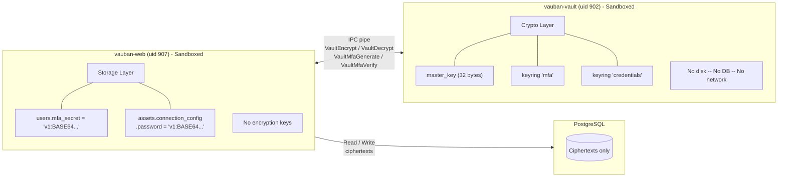
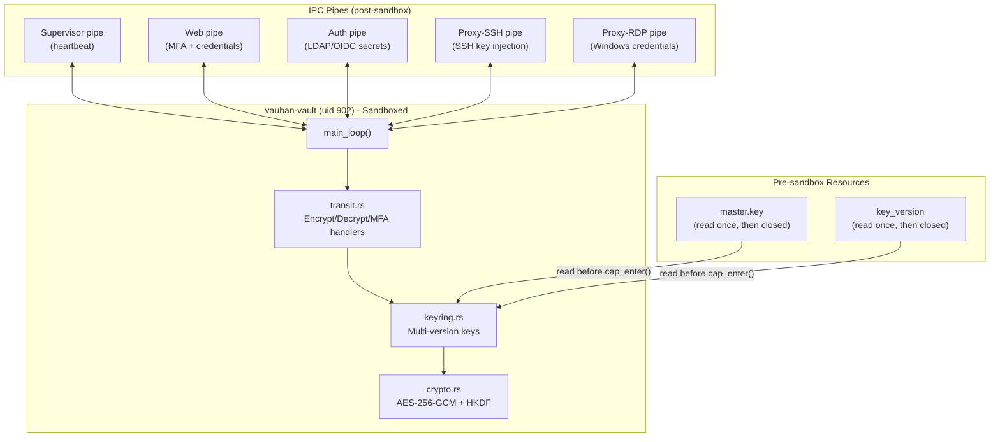
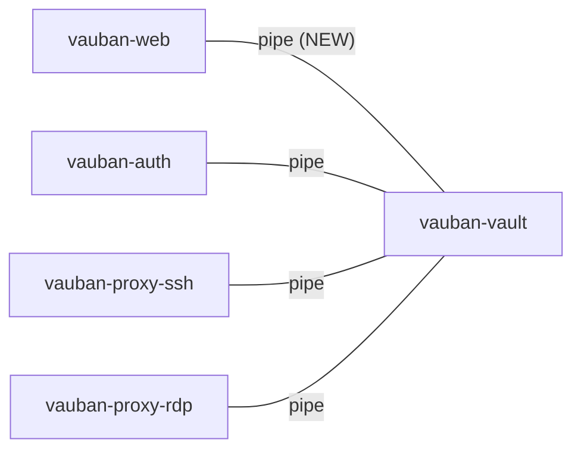
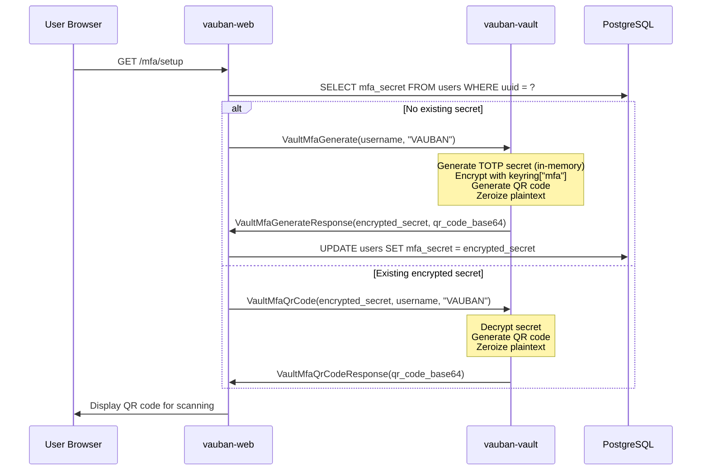
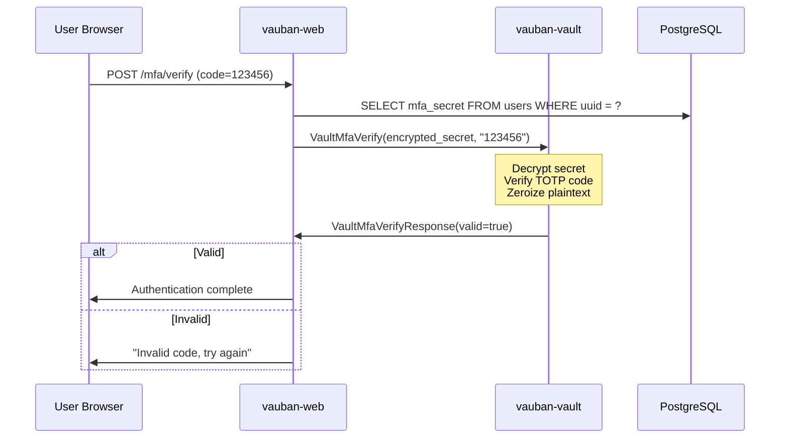
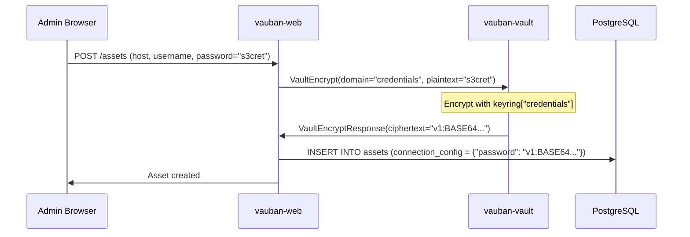
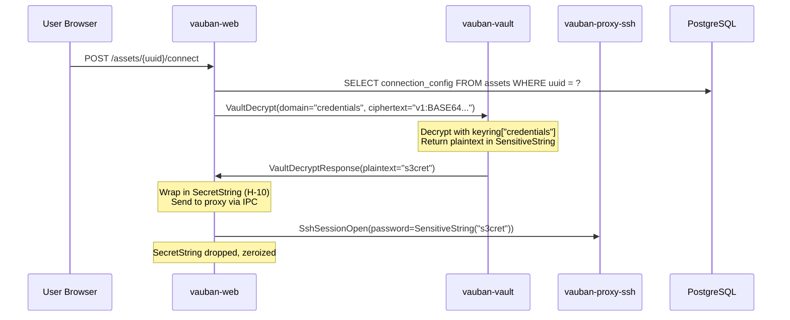
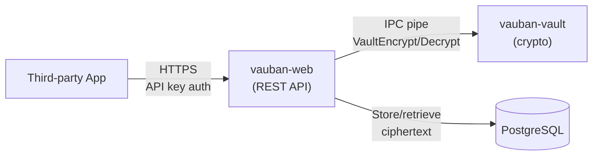
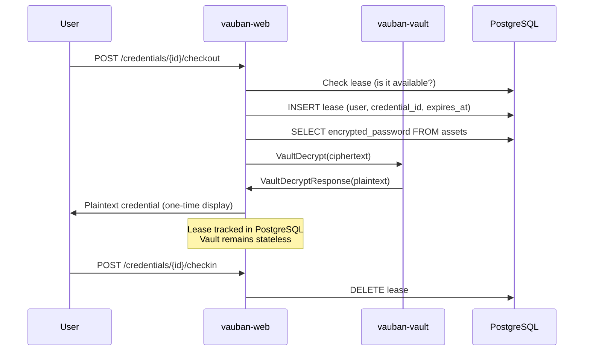
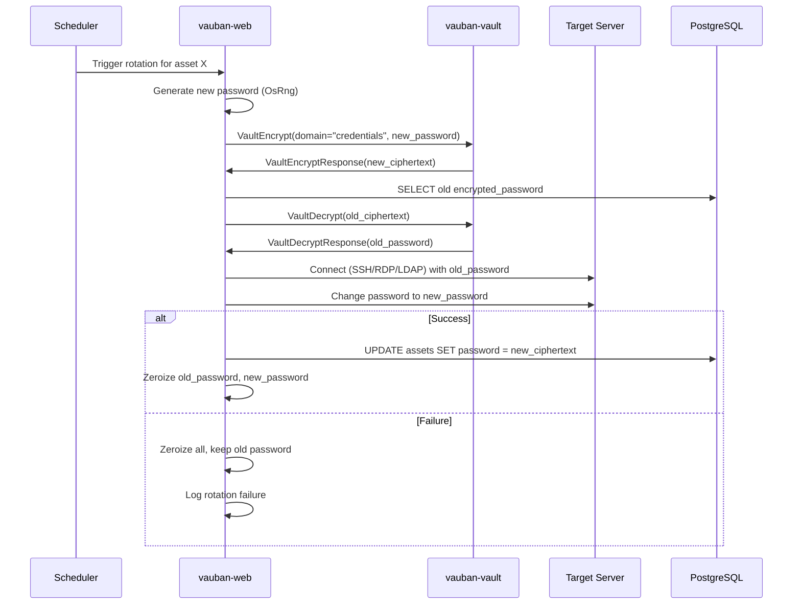

# Vauban Vault Architecture

**Version:** 1.0  
**Date:** 6 February 2026  
**Author:** Richard Ben Aleya

---

## Table of Contents

1. [Introduction](#1-introduction)
2. [Architecture Overview](#2-architecture-overview)
3. [Cryptographic Design](#3-cryptographic-design)
4. [IPC Protocol](#4-ipc-protocol)
5. [Capsicum Sandboxing](#5-capsicum-sandboxing)
6. [Key Management](#6-key-management)
7. [Integration with Vauban Services](#7-integration-with-vauban-services)
8. [Security Analysis](#8-security-analysis)
9. [Testing Strategy](#9-testing-strategy)
10. [Architecture Decisions](#10-architecture-decisions)

---

## 1. Introduction

### 1.1 Background

Vauban stores sensitive data that must be recoverable (i.e. cannot be hashed):

| Data | Location | Vulnerability |
|------|----------|---------------|
| TOTP MFA secrets | `users.mfa_secret` | M-1: Stored in plaintext |
| SSH passwords | `assets.connection_config` (JSONB) | C-2: Stored in plaintext |
| SSH private keys | `assets.connection_config` (JSONB) | C-2: Stored in plaintext |
| SSH passphrases | `assets.connection_config` (JSONB) | C-2: Stored in plaintext |

These secrets must be encrypted at rest while remaining available for legitimate operations (TOTP verification, SSH session establishment).

### 1.2 Design Principles

The vault follows Vauban's core philosophy (see Privsep Architecture, Section 2.3):

1. **KISS**: Native Rust implementation -- no external secret management system
2. **Minimal dependencies**: Only well-audited, focused cryptographic crates
3. **No database**: Stateless transactional service -- encrypts/decrypts on demand
4. **No async runtime**: Synchronous `poll(2)`-based event loop like all core services
5. **Separation of concerns**: `vauban-web` stores ciphertexts; `vauban-vault` holds the keys
6. **Defense in depth**: Capsicum sandbox, privilege separation, memory zeroization

### 1.3 Scope

This document covers the internal architecture of `vauban-vault`. It is a companion to the [Privilege Separation Architecture](Vauban_Privsep_Architecture_EN(1.1).md) which describes the overall system design.

### 1.4 Threat Model

| Threat | Mitigation |
|--------|------------|
| Database compromise (SQL injection, backup theft) | Secrets are ciphertext; master key is not in the database |
| `vauban-web` process compromise | Web process never sees plaintext secrets or encryption keys |
| `vauban-vault` memory dump | Plaintext zeroized immediately after use; master key zeroized on drop |
| Log leakage | `SensitiveString` and `SecretString` redact on `Debug`/`Display` |
| Master key file theft | File permissions `0400` owner `vauban_vault`; read once then closed |
| Compromised vault process (post-sandbox) | Capsicum limits to IPC pipes only; no filesystem, no network |

---

## 2. Architecture Overview

### 2.1 Role in the System

`vauban-vault` is a **pure cryptographic service** with no storage, no database, and no network access. It receives plaintext via IPC, encrypts it, and returns ciphertext -- or receives ciphertext and returns plaintext. The encryption keys never leave the vault process.



### 2.2 Component Diagram



### 2.3 Module Structure

```
vauban-vault/
├── Cargo.toml
└── src/
    ├── main.rs           # Entry point, sandbox setup, main loop
    ├── crypto.rs         # AES-256-GCM encrypt/decrypt primitives
    ├── keyring.rs        # Versioned key derivation, rotation, rewrap
    └── transit.rs        # IPC message handlers (encrypt, decrypt, MFA)
```

### 2.4 Dependencies

Strict minimal set -- every dependency must be justified:

```toml
[dependencies]
shared.workspace = true            # IPC channel, messages, Capsicum stubs
aes-gcm = "0.10"                   # AES-256-GCM (AEAD, RustCrypto audited)
hkdf = "0.12"                      # HKDF-SHA256 key derivation (RFC 5869)
sha3 = "0.10"                      # SHA3-256 for HKDF (RustCrypto, PQC-aligned)
base64 = "0.22"                    # Ciphertext encoding for DB storage
zeroize = { workspace = true }     # Memory scrubbing on drop
totp-rs = "5"                      # TOTP generation and verification
qrcode = "0.14"                    # QR code generation for MFA setup
image = { version = "0.25", default-features = false, features = ["png"] }
tracing.workspace = true           # Structured logging
tracing-subscriber.workspace = true
anyhow.workspace = true            # Error handling
libc.workspace = true              # System calls
```

**Explicitly excluded:**
- `tokio` -- synchronous service, no async runtime needed
- `reqwest`/`ureq` -- no HTTP, no network access
- `diesel`/`sqlx` -- no database access
- `sha2` -- replaced by `sha3` for PQC alignment
- `serde_json` -- no JSON; IPC uses bincode via `shared`
- `secrecy` -- used by callers (`vauban-web`); vault uses `zeroize` directly on raw buffers

---

## 3. Cryptographic Design

### 3.1 Algorithm Selection

| Purpose | Algorithm | Justification |
|---------|-----------|---------------|
| Symmetric encryption | **AES-256-GCM** | NIST approved, 256-bit key, authenticated encryption with AEAD |
| Key derivation | **HKDF-SHA3-256** | RFC 5869, deterministic, domain separation via context labels, PQC-aligned |
| Random nonce | **OS RNG** | `aes_gcm::aead::OsRng`, backed by `getrandom` (arc4random on FreeBSD) |
| TOTP | **HMAC-SHA1** | RFC 6238 standard, required for authenticator app compatibility |

### 3.2 Key Hierarchy

```
Master Key (32 bytes, from file)
│
├── HKDF-SHA3-256(info="vauban-mfa-v1")           → AES-256-GCM key for MFA secrets
├── HKDF-SHA3-256(info="vauban-mfa-v2")           → (after rotation)
│
├── HKDF-SHA3-256(info="vauban-credentials-v1")   → AES-256-GCM key for SSH credentials
├── HKDF-SHA3-256(info="vauban-credentials-v2")   → (after rotation)
│
└── (future domains derived the same way)
```

Each **domain** (e.g. `mfa`, `credentials`) has its own keyring with independently versioned derived keys. Compromising one domain's ciphertext provides zero information about another domain.

### 3.3 Ciphertext Format

```
v{VERSION}:{BASE64(NONCE || CIPHERTEXT || TAG)}
```

| Field | Size | Description |
|-------|------|-------------|
| Version prefix | Variable | Key version, e.g. `v1:`, `v2:` |
| Nonce | 12 bytes | Unique per encryption, generated from OS RNG |
| Ciphertext | Variable | AES-256-GCM encrypted data |
| Tag | 16 bytes | GCM authentication tag (integrity + authenticity) |

Example stored value: `v1:nGxkV2F1bHQtbWZhLXYxAAAAAAAA...`

This format is:
- **Self-describing**: the version prefix identifies which derived key to use for decryption
- **Compact**: a 32-character TOTP secret encrypts to ~80 characters in base64, well within `VARCHAR(255)`
- **Database-friendly**: plain ASCII string, stored in existing columns without schema changes

### 3.4 Memory Safety

All sensitive data follows strict zeroization rules:

```rust
use zeroize::Zeroize;

// Plaintext buffers are zeroized immediately after use
let mut plaintext = decrypt(ciphertext, key)?;
let result = process(&plaintext);
plaintext.zeroize();  // Overwrite with zeros before deallocation
return result;

// Master key is zeroized on drop
struct MasterKey([u8; 32]);
impl Drop for MasterKey {
    fn drop(&mut self) {
        self.0.zeroize();
    }
}

// Derived keys are zeroized when the keyring is dropped
struct DerivedKey {
    version: u32,
    key: Key<Aes256Gcm>,  // 32 bytes
}
impl Drop for DerivedKey {
    fn drop(&mut self) {
        // Key<Aes256Gcm> is GenericArray<u8, U32>; zeroize the backing memory
        self.key.as_mut_slice().zeroize();
    }
}
```

### 3.5 Nonce Management

AES-256-GCM requires a unique nonce per encryption with the same key. The nonce is:
- **96 bits** (12 bytes), generated from `OsRng` (arc4random on FreeBSD)
- **Stored alongside the ciphertext** (prepended before base64 encoding)
- **Never reused**: the probability of collision with 96-bit random nonces is negligible for the expected volume (~10^6 encryptions over the lifetime of a deployment)

### 3.6 Constant-Time Operations

Decryption failures (wrong key version, tampered ciphertext) are reported as generic errors without timing side-channels. AES-GCM's tag verification in the `aes-gcm` crate uses constant-time comparison internally.

---

## 4. IPC Protocol

### 4.1 Pipe Topology Change

The current topology (Privsep Architecture, Section 3.2) does **not** include a `Web <-> Vault` pipe. This must be added:



**Updated total: 14 pipe pairs (28 file descriptors)** (was 13).

The supervisor topology constant must include:

```rust
PipeTopology { from: Service::Web, to: Service::Vault },  // NEW
```

### 4.2 New Message Types

Added to `shared/src/messages.rs`:

```rust
// ========== Vault Crypto (Any service -> Vault) ==========

/// Encrypt plaintext with a named key domain.
VaultEncrypt {
    request_id: u64,
    /// Key domain: "credentials", "mfa", etc.
    domain: String,
    /// Plaintext to encrypt.
    /// Wrapped in SensitiveString for zeroize-on-drop during IPC transport.
    plaintext: SensitiveString,
},
VaultEncryptResponse {
    request_id: u64,
    /// Versioned ciphertext (e.g. "v1:BASE64..."), None on error.
    ciphertext: Option<String>,
    error: Option<String>,
},

/// Decrypt ciphertext with a named key domain.
VaultDecrypt {
    request_id: u64,
    domain: String,
    /// Versioned ciphertext as stored in the database.
    ciphertext: String,
},
VaultDecryptResponse {
    request_id: u64,
    /// Decrypted plaintext, None on error.
    /// Wrapped in SensitiveString for zeroize-on-drop during IPC transport.
    plaintext: Option<SensitiveString>,
    error: Option<String>,
},

// ========== Vault MFA (Web -> Vault) ==========

/// Generate a new TOTP secret, encrypt it, and return the QR code.
/// The plaintext secret NEVER leaves the vault process.
VaultMfaGenerate {
    request_id: u64,
    /// Username for the provisioning URI.
    username: String,
    /// Issuer for the provisioning URI (e.g. "VAUBAN").
    issuer: String,
},
VaultMfaGenerateResponse {
    request_id: u64,
    /// Encrypted TOTP secret (store in DB as mfa_secret).
    encrypted_secret: Option<String>,
    /// Base64-encoded PNG QR code (display once to user).
    qr_code_base64: Option<String>,
    error: Option<String>,
},

/// Verify a TOTP code against an encrypted secret.
VaultMfaVerify {
    request_id: u64,
    /// Encrypted TOTP secret as stored in DB.
    encrypted_secret: String,
    /// 6-digit TOTP code entered by the user.
    code: String,
},
VaultMfaVerifyResponse {
    request_id: u64,
    /// true if the code is valid for the current or adjacent time step.
    valid: bool,
    error: Option<String>,
},

/// Re-generate the QR code from an existing encrypted secret.
/// Used when the MFA setup page is reloaded.
VaultMfaQrCode {
    request_id: u64,
    encrypted_secret: String,
    username: String,
    issuer: String,
},
VaultMfaQrCodeResponse {
    request_id: u64,
    qr_code_base64: Option<String>,
    error: Option<String>,
},
```

### 4.3 Message Flow: MFA Setup



### 4.4 Message Flow: MFA Verification



### 4.5 Message Flow: SSH Credential Encryption (Asset Creation)



### 4.6 Message Flow: SSH Credential Decryption (Session Start)



### 4.7 Multi-Pipe Polling

`vauban-vault` listens on 5 IPC pipes simultaneously using `poll(2)`:

```rust
fn main_loop(
    supervisor: &IpcChannel,
    web: &IpcChannel,
    auth: &IpcChannel,
    proxy_ssh: &IpcChannel,
    proxy_rdp: &IpcChannel,
    state: &mut ServiceState,
) -> Result<()> {
    let fds = [
        supervisor.read_fd(),
        web.read_fd(),
        auth.read_fd(),
        proxy_ssh.read_fd(),
        proxy_rdp.read_fd(),
    ];

    loop {
        let ready = poll_readable(&fds, 1000)?;  // 1s timeout

        for &fd in &ready {
            let channel = match fd {
                f if f == fds[0] => supervisor,
                f if f == fds[1] => web,
                f if f == fds[2] => auth,
                f if f == fds[3] => proxy_ssh,
                f if f == fds[4] => proxy_rdp,
                _ => continue,
            };
            // ... recv and handle message
        }
    }
}
```

---

## 5. Capsicum Sandboxing

### 5.1 Sandbox Entry Sequence

```rust
fn run_service() -> Result<()> {
    // 1. Parse IPC file descriptors from environment
    let ipc_read_fd = parse_env_fd("VAUBAN_IPC_READ")?;
    let ipc_write_fd = parse_env_fd("VAUBAN_IPC_WRITE")?;
    // ... topology pipes (VAUBAN_WEB_IPC_READ, etc.)

    // 2. Read master key from file (BEFORE sandbox)
    let master_key = read_master_key()?;  // /var/vauban/vault/master.key
    let key_version = read_key_version()?; // /var/vauban/vault/key_version

    // 3. Clear environment variables immediately
    unsafe {
        std::env::remove_var("VAUBAN_IPC_READ");
        std::env::remove_var("VAUBAN_IPC_WRITE");
        // ... all topology env vars
    }

    // 4. Build keyrings (deterministic derivation from master key)
    let keyrings = build_keyrings(&master_key, key_version);

    // 5. File descriptors for master.key and key_version are now CLOSED
    //    (they were opened by read_master_key/read_key_version and dropped)

    // 6. Enter Capsicum sandbox (point of no return)
    let ipc_fds = [ipc_read_fd, ipc_write_fd, /* topology fds... */];
    capsicum::setup_service_sandbox(&ipc_fds, None)?;

    // 7. Master key exists only in memory, in the keyring
    //    No file descriptors remain except IPC pipes
    // 8. Main event loop
    main_loop(/* channels */, &mut state)
}
```

### 5.2 Post-Sandbox Capabilities

| File Descriptor | Capability Rights | Purpose |
|-----------------|-------------------|---------|
| Supervisor pipe (read) | `CAP_READ`, `CAP_EVENT` | Receive heartbeat Ping |
| Supervisor pipe (write) | `CAP_WRITE` | Send heartbeat Pong |
| Web pipe (read) | `CAP_READ`, `CAP_EVENT` | Receive encrypt/decrypt/MFA requests |
| Web pipe (write) | `CAP_WRITE` | Send responses |
| Auth pipe (read/write) | Same pattern | LDAP/OIDC credential requests |
| Proxy-SSH pipe (read/write) | Same pattern | SSH key injection |
| Proxy-RDP pipe (read/write) | Same pattern | Windows credential requests |

**No other file descriptors exist.** After `cap_enter()`:
- No filesystem access (master key file is already closed)
- No network access (no sockets)
- No database access (no connections)
- No new file descriptors can be created

### 5.3 Attack Surface After Sandbox

If an attacker achieves code execution within the sandboxed `vauban-vault` process:

| Action | Possible? | Why |
|--------|-----------|-----|
| Read master key file | No | File descriptor closed before `cap_enter()` |
| Open network connections | No | `connect()` blocked by Capsicum |
| Read other files | No | `open()` blocked by Capsicum |
| Send data to external server | No | No network FDs exist |
| Decrypt arbitrary ciphertexts | Yes | The process holds the keys (inherent to any encryption service) |
| Read IPC messages from other services | Yes | Only on the pipes it owns |

The residual risk (decrypt capability) is the minimum possible for any encryption service. It is mitigated by:
- The vault only decrypts what is sent to it via authorized IPC pipes
- Each pipe is owned by a specific peer (Web, Auth, Proxy) running as a different UID
- The supervisor monitors vault health via heartbeat

---

## 6. Key Management

### 6.1 Master Key Storage

The master key is a 32-byte (256-bit) random value stored in a file:

```
/var/vauban/vault/master.key
```

| Property | Value |
|----------|-------|
| Size | 32 bytes (raw binary) |
| Permissions | `0400` (owner read-only) |
| Owner | `vauban_vault:vauban_vault` (uid 902) |
| Read | Once at startup, before `cap_enter()` |
| In memory | Zeroized on `Drop` |

### 6.2 Master Key Generation

```sh
# Generate a cryptographically secure master key (one-time operation)
dd if=/dev/urandom of=/var/vauban/vault/master.key bs=32 count=1
chmod 0400 /var/vauban/vault/master.key
chown vauban_vault:vauban_vault /var/vauban/vault/master.key
```

### 6.3 Key Derivation

Each domain derives its encryption keys from the master key using HKDF-SHA3-256 (PQC-aligned):

```rust
use sha3::Sha3_256;

fn derive_key(master_key: &[u8; 32], domain: &str, version: u32) -> Key<Aes256Gcm> {
    let hkdf = Hkdf::<Sha3_256>::new(None, master_key);
    let info = format!("vauban-{}-v{}", domain, version);
    let mut derived = [0u8; 32];
    hkdf.expand(info.as_bytes(), &mut derived)
        .expect("32 bytes is valid for HKDF-SHA3-256");
    let key = *Key::<Aes256Gcm>::from_slice(&derived);
    derived.zeroize();
    key
}
```

Properties:
- **Deterministic**: same master key + same info = same derived key (allows restart without loss)
- **Domain-separated**: different info labels produce cryptographically independent keys
- **Version-separated**: rotating increments the version, producing a new independent key
- **PQC-aligned**: SHA3-256 is a Keccak-based hash, structurally different from SHA-2 family, recommended by NIST for post-quantum resilience

### 6.4 Key Rotation

#### 6.4.1 Version File

```
/var/vauban/vault/key_version
```

Contains a single integer (e.g. `3`), indicating the current number of key versions. Read once at startup.

| Property | Value |
|----------|-------|
| Format | ASCII integer (e.g. `3`) |
| Permissions | `0600` (owner read-write) |
| Owner | `vauban_vault:vauban_vault` (uid 902) |

#### 6.4.2 Rotation Procedure

Key rotation does NOT require re-encrypting existing data:

```sh
# 1. Increment the version (e.g. from 2 to 3)
echo 3 > /var/vauban/vault/key_version

# 2. Restart vauban-vault (SIGHUP to supervisor or direct restart)
# The vault rebuilds keyrings with versions 1, 2, 3
# New encryptions use v3; old ciphertexts (v1, v2) remain decryptable
```

#### 6.4.3 Keyring Construction at Startup

```rust
fn build_keyrings(master_key: &[u8; 32], max_version: u32) -> HashMap<String, Keyring> {
    let mut keyrings = HashMap::new();

    for domain in ["mfa", "credentials"] {
        let mut keyring = Keyring::new(domain);
        for v in 1..=max_version {
            let key = derive_key(master_key, domain, v);
            keyring.add_version(v, key);
        }
        keyrings.insert(domain.to_string(), keyring);
    }

    keyrings
}
```

#### 6.4.4 Optional Rewrap (Batch Migration)

To migrate all ciphertexts to the latest key version (e.g. before decommissioning an old version), a rewrap utility can be run:

```
VaultEncrypt + VaultDecrypt in sequence (handled by vauban-web):
1. SELECT all rows with mfa_secret LIKE 'v1:%'
2. For each: VaultDecrypt(v1:...) -> VaultEncrypt() -> UPDATE with v2:...
```

This is optional and can be done incrementally. Old key versions are retained until all ciphertexts are migrated.

### 6.5 Master Key Backup

The master key is the **single point of recovery**. If lost, all encrypted data is unrecoverable.

Recommended backup strategy:
1. Store a copy in a physically secured location (safe, security envelope)
2. Consider splitting with Shamir's Secret Sharing (future enhancement)
3. **Never** store the master key in the database, in version control, or on the same disk as the database backups

---

## 7. Integration with Vauban Services

### 7.1 Changes to Existing Services

#### 7.1.1 Supervisor: Topology Update

Add `Web <-> Vault` pipe to the topology constant:

```rust
const TOPOLOGY: &[PipeTopology] = &[
    // ... existing pipes ...
    PipeTopology { from: Service::Web, to: Service::Vault },  // NEW for M-1 and C-2
];
```

Updated startup order (unchanged -- vault already starts in Phase 2):
1. `vauban-audit` -- No dependencies
2. `vauban-vault` -- No dependencies (reads master key file only)
3. `vauban-rbac` -- No dependencies
4. `vauban-auth` -- Depends on rbac, vault
5. `vauban-proxy-ssh` -- Depends on rbac, vault, audit
6. `vauban-proxy-rdp` -- Depends on rbac, vault, audit
7. `vauban-web` -- Depends on auth, rbac, audit, **vault**

#### 7.1.2 vauban-web: MFA Handlers

Five points of intervention in `vauban-web`:

| File | Function | Current (plaintext) | Target (encrypted) |
|------|----------|--------------------|--------------------|
| `handlers/auth.rs:282` | Login API (MFA inline) | `AuthService::verify_totp(secret, code)` | `vault_client.mfa_verify(encrypted_secret, code)` |
| `handlers/auth.rs:652` | MFA setup page | `generate_totp_secret()` + store plaintext | `vault_client.mfa_generate()` + store ciphertext |
| `handlers/auth.rs:764` | MFA setup confirm | `AuthService::verify_totp(&secret, code)` | `vault_client.mfa_verify(encrypted_secret, code)` |
| `handlers/auth.rs:929` | MFA verify page | `AuthService::verify_totp(&secret, code)` | `vault_client.mfa_verify(encrypted_secret, code)` |
| `handlers/web.rs:1409` | Profile MFA setup | `generate_totp_secret()` + `generate_qr_code()` | `vault_client.mfa_generate()` |

#### 7.1.3 vauban-web: SSH Credential Handlers

| File | Function | Current | Target |
|------|----------|---------|--------|
| `handlers/web.rs:build_connection_config()` | Asset create/edit | Store plaintext in JSON | `vault_client.encrypt("credentials", plaintext)` |
| `handlers/web.rs:connect_ssh()` (L.7082) | SSH session start | Read plaintext from JSON | `vault_client.decrypt("credentials", ciphertext)` |
| `handlers/api/assets.rs` | API create/edit | Store plaintext | Encrypt before storage |

#### 7.1.4 vauban-web: Vault IPC Client

A new async IPC client for vault communication, following the same pattern as `ProxySshClient`:

```rust
/// Async client for vauban-vault cryptographic operations.
pub struct VaultCryptoClient {
    channel: IpcChannel,
    read_async_fd: AsyncFd<RawFd>,
    next_request_id: AtomicU64,
    pending_requests: Mutex<HashMap<u64, oneshot::Sender<VaultResponse>>>,
}
```

#### 7.1.5 Database Schema

**No schema changes required.** The ciphertext format fits within existing column types:
- `users.mfa_secret`: `VARCHAR(255)` -- encrypted TOTP secret (~80 chars)
- `assets.connection_config`: `JSONB` -- encrypted values within the JSON structure

#### 7.1.6 Data Migration

A one-time migration script encrypts existing plaintext secrets:

```sql
-- No SQL migration needed; migration is done at the application level.
-- A Rust binary reads plaintext secrets and writes encrypted versions.
```

```
bin/migrate_secrets.rs:
1. Connect to PostgreSQL (before cap_enter)
2. Connect to vauban-vault via IPC (or use keyring directly)
3. SELECT id, mfa_secret FROM users WHERE mfa_secret IS NOT NULL
4. For each: encrypt -> UPDATE
5. SELECT id, connection_config FROM assets
6. For each: encrypt password/private_key/passphrase fields -> UPDATE
```

### 7.2 Backward Compatibility

During migration, the system must handle both plaintext and encrypted secrets:

```rust
fn is_encrypted(value: &str) -> bool {
    // Encrypted values start with "v" followed by a digit and ":"
    value.len() > 3
        && value.starts_with('v')
        && value[1..].starts_with(|c: char| c.is_ascii_digit())
        && value.contains(':')
}
```

Handlers check this before deciding whether to call `VaultDecrypt`:
- If encrypted (`v1:...`): send to vault for decryption
- If plaintext (legacy): use directly, optionally encrypt and update in place

---

## 8. Security Analysis

### 8.1 Cryptographic Strength

| Property | Value |
|----------|-------|
| Key size | 256 bits (AES-256) |
| Nonce size | 96 bits (random) |
| Auth tag | 128 bits (GCM) |
| Key derivation | HKDF-SHA3-256 with domain separation |
| Brute force resistance | 2^256 operations (infeasible) |

### 8.2 Compliance

| Requirement | Implementation |
|---------------------------|----------------|
| Encrypt sensitive data at rest using AES-256-GCM | AES-256-GCM via `aes-gcm` crate |
| Never hardcode secrets in source code | Master key from file, cleared from env |
| Mask and redact sensitive data in all outputs and logs | `SensitiveString` (IPC), `Zeroize` on drop |

| Requirement | Implementation |
|---------------------------|----------------|
| SHA-3 or BLAKE3 for hashing (not SHA-256) | HKDF uses SHA3-256 (`sha3` crate) |
| Symmetric keys minimum 256-bit (AES-256) | AES-256-GCM (256-bit keys) |
| All cryptographic material zeroized after use | `Zeroize` on drop for all key types |

| Requirement | Implementation |
|---------------------------|----------------|
| Implement `Zeroize` trait for all secret-containing types | `MasterKey`, `DerivedKey`, plaintext buffers |
| Redact secrets in Debug/Display | `SensitiveString` prints `[REDACTED]` |
| Clear environment variables immediately after reading | `remove_var()` before sandbox entry |
| Keep secrets in memory for the shortest time possible | Decrypt -> process -> zeroize in same function |

### 8.3 Defense in Depth

```
Layer 1: PostgreSQL access control
  └── Only vauban-web can read encrypted data

Layer 2: Encryption at rest
  └── Data is AES-256-GCM encrypted; useless without keys

Layer 3: Key isolation
  └── Keys exist only in vauban-vault memory (uid 902)

Layer 4: Capsicum sandbox
  └── Vault cannot access filesystem, network, or other processes

Layer 5: Memory zeroization
  └── Plaintext scrubbed immediately after use

Layer 6: Privilege separation
  └── Each layer runs as a different Unix user
```

### 8.4 Comparison with Alternative Approaches

| Approach | Key in web process? | DB compromise exposure | External dependency | Capsicum compatible |
|----------|--------------------|-----------------------|--------------------|--------------------|
| Plaintext (current) | N/A | Full exposure | None | Yes |
| Application-level AES in web | **Yes** | Protected | aes-gcm crate | Yes |
| **vauban-vault (this design)** | **No** | Protected | aes-gcm + hkdf | **Yes** |
| OpenBao/HashiCorp Vault | No | Protected | **150 MB Go binary** | Socket FD management |

The vault design provides the same security as an external secret manager while maintaining zero external dependencies, minimal binary size, and full Capsicum compatibility.

---

## 9. Testing Strategy

### 9.1 Unit Tests (crypto.rs)

```rust
#[test]
fn test_encrypt_decrypt_roundtrip() { ... }

#[test]
fn test_encrypt_produces_different_ciphertext_each_time() { ... }

#[test]
fn test_decrypt_with_wrong_key_fails() { ... }

#[test]
fn test_decrypt_with_tampered_ciphertext_fails() { ... }

#[test]
fn test_decrypt_with_tampered_nonce_fails() { ... }

#[test]
fn test_ciphertext_format_has_version_prefix() { ... }

#[test]
fn test_ciphertext_fits_in_varchar_255() { ... }
```

### 9.2 Unit Tests (keyring.rs)

```rust
#[test]
fn test_derive_key_is_deterministic() { ... }

#[test]
fn test_different_domains_produce_different_keys() { ... }

#[test]
fn test_different_versions_produce_different_keys() { ... }

#[test]
fn test_encrypt_uses_latest_version() { ... }

#[test]
fn test_decrypt_with_old_version_succeeds() { ... }

#[test]
fn test_rewrap_upgrades_to_latest_version() { ... }

#[test]
fn test_decrypt_with_unknown_version_fails() { ... }
```

### 9.3 Unit Tests (transit.rs)

```rust
#[test]
fn test_mfa_generate_returns_encrypted_secret_and_qr() { ... }

#[test]
fn test_mfa_generate_secret_never_in_response_plaintext() { ... }

#[test]
fn test_mfa_verify_valid_code_returns_true() { ... }

#[test]
fn test_mfa_verify_invalid_code_returns_false() { ... }

#[test]
fn test_mfa_verify_with_tampered_secret_fails() { ... }

#[test]
fn test_encrypt_decrypt_credential_roundtrip() { ... }
```

### 9.4 Integration Tests (IPC)

```rust
#[test]
fn test_vault_encrypt_decrypt_via_ipc() {
    let (client, service) = IpcChannel::pair().unwrap();
    // Send VaultEncrypt, receive VaultEncryptResponse
    // Send VaultDecrypt with returned ciphertext
    // Verify plaintext matches original
}

#[test]
fn test_vault_mfa_generate_verify_via_ipc() {
    // Generate -> extract encrypted_secret -> Verify with current TOTP code
}
```

### 9.5 Security Regression Tests

```rust
#[test]
fn test_master_key_type_implements_zeroize_on_drop() { ... }

#[test]
fn test_derived_key_type_implements_zeroize_on_drop() { ... }

#[test]
fn test_plaintext_buffer_zeroized_after_decrypt() { ... }

#[test]
fn test_sensitive_string_debug_is_redacted() { ... }

#[test]
fn test_ciphertext_does_not_contain_plaintext() { ... }

#[test]
fn test_qr_code_base64_does_not_contain_raw_secret() { ... }
```

### 9.6 Structural Tests (Compile-Time Guarantees)

```rust
#[test]
fn test_vault_has_no_tokio_dependency() {
    // Verify Cargo.toml does not contain tokio
    let cargo_toml = include_str!("../../Cargo.toml");
    assert!(!cargo_toml.contains("tokio"));
}

#[test]
fn test_vault_has_no_database_dependency() {
    let cargo_toml = include_str!("../../Cargo.toml");
    assert!(!cargo_toml.contains("diesel"));
    assert!(!cargo_toml.contains("sqlx"));
}

#[test]
fn test_vault_has_no_network_dependency() {
    let cargo_toml = include_str!("../../Cargo.toml");
    assert!(!cargo_toml.contains("reqwest"));
    assert!(!cargo_toml.contains("ureq"));
    assert!(!cargo_toml.contains("hyper"));
}
```

---

## 10. Architecture Decisions

### 10.1 Summary of Key Decisions

| Decision | Choice | Rationale |
|----------|--------|-----------|
| Crypto implementation | Native Rust (`aes-gcm`, `hkdf`, `sha3`) | Zero external dependencies, ~200 lines of code, full Capsicum compat |
| External secret manager | None (no OpenBao/Vault) | Eliminates 150 MB Go binary, Go toolchain, Unix socket management |
| Database | None | Stateless service; ciphertexts stored by callers in existing schema |
| Async runtime | None (synchronous `poll(2)`) | Consistent with all core services; low throughput doesn't justify async |
| Key storage | File (`master.key`) read once | Simplest secure option; cleared from memory path after `cap_enter()` |
| Key derivation | HKDF-SHA3-256 with domain labels | Deterministic, restartable, domain-separated, PQC-aligned |
| Key rotation | Version counter + multi-version keyring | No downtime, no re-encryption required, rewrap optional |
| Ciphertext format | `v{N}:{base64}` | Self-describing, compact, fits existing DB columns |
| TOTP handling | In-process generation and verification | Secret never leaves vault; only QR code and boolean result are returned |
| IPC transport of secrets | `SensitiveString` | Zeroize-on-drop + redacted Debug, compatible with bincode (H-10) |

### 10.2 Scope and Boundaries

The vault is a **pure cryptographic service**. Business logic belongs in higher layers (`vauban-web`, future dedicated services). This table clarifies the responsibility split:

| Capability | Vault responsibility | Higher-layer responsibility |
|------------|---------------------|-----------------------------|
| Symmetric encrypt/decrypt | Yes (AES-256-GCM) | Calls vault via IPC |
| Key derivation and rotation | Yes (HKDF-SHA3-256, keyring) | Triggers rotation via restart |
| TOTP generate/verify | Yes (secret never leaves vault) | Stores encrypted secret in DB |
| SSH/Unix/Windows credentials | Yes (encrypt/decrypt any string) | Stores ciphertext in DB, manages asset model |
| Third-party secrets (config files, API keys) | Yes (encrypt/decrypt any blob) | `vauban-web` exposes REST API, handles authN/authZ |
| SSH certificate signing (CA) | Future (asymmetric crypto extension) | Certificate lifecycle, policy |
| Check-in/check-out (PAM vault) | No -- requires state | `vauban-web`: lease tracking, locks, expiration in PostgreSQL |
| Password rotation | No -- requires network access | `vauban-web` or future `vauban-rotator`: connect to target, change password, then call vault to encrypt |
| Dynamic secrets (lease/revocation) | No | Not planned; Vauban manages static credentials |
| Multi-tenant key isolation | No | Single-appliance deployment model |
| Distributed vault (HA) | No | Single-machine architecture per Privsep design |

### 10.3 Extensibility Roadmap

#### Phase 1 -- Current (v1.0)

Core encryption-at-rest resolving M-1 and C-2:

- `VaultEncrypt` / `VaultDecrypt` with domain-separated keyrings
- `VaultMfaGenerate` / `VaultMfaVerify` / `VaultMfaQrCode`
- Supports: SSH passwords, private keys, passphrases, TOTP secrets

#### Phase 2 -- Credential Types Expansion

Extend to all credential types with zero vault code changes (new domains only):

| Credential Type | Domain Label | Stored In |
|-----------------|-------------|-----------|
| SSH password/key/passphrase | `credentials` | `assets.connection_config` (JSONB) |
| Windows/RDP credentials | `credentials` | `assets.connection_config` (JSONB) |
| Unix credentials | `credentials` | `assets.connection_config` (JSONB) |
| LDAP/OIDC bind secrets | `credentials` | Auth service config |
| Third-party application secrets | `external` | New `secrets` table via REST API |

**IPC message size**: the current 16 KB limit accommodates all credential types (SSH private keys are typically 2-4 KB in PEM). For larger blobs (e.g. configuration files > 10 KB), the IPC message size limit in `shared/src/ipc.rs` can be increased or a chunked transfer protocol added.

#### Phase 3 -- Third-Party Secrets API

`vauban-web` exposes a REST API for external applications:

```
POST   /api/v1/secrets/encrypt   { domain, plaintext }  -> { ciphertext }
POST   /api/v1/secrets/decrypt   { domain, ciphertext } -> { plaintext }
GET    /api/v1/secrets/:id                               -> { metadata }
DELETE /api/v1/secrets/:id                               -> 204
```

The vault itself does not change. `vauban-web` handles:
- API key authentication (per-application)
- RBAC authorization (which app can access which domain)
- Rate limiting and audit logging
- Ciphertext storage in a dedicated `secrets` table



#### Phase 4 -- SSH Certificate Authority

Add asymmetric signing capability to the vault:

| Component | Description |
|-----------|-------------|
| CA key pair | Ed25519 private key, read from file at startup (like master key) |
| New messages | `VaultSignSshCert { public_key, principals, validity, ... }` |
| New dependency | `ssh-key` crate (pure Rust, MIT/Apache-2.0) |
| Security | CA private key never leaves vault; only signed certificates are returned |

The CA key follows the same lifecycle as the master key: read before `cap_enter()`, held in memory, zeroized on drop.

#### Phase 5 -- Check-in / Check-out

PAM-style credential checkout with vault providing only the crypto layer:



The vault remains stateless. All lease/lock logic resides in `vauban-web` and PostgreSQL.

#### Phase 6 -- Password Rotation

Automated credential rotation with vault providing encryption only:



Password rotation requires network access to target servers, which is incompatible with the vault's Capsicum sandbox. This logic must reside in `vauban-web` or a future dedicated `vauban-rotator` service.

### 10.4 Future Enhancements (Vault-Internal)

1. **HSM support**: Replace software AES with PKCS#11 calls via `cryptoki` crate; master key never in software
2. **Shamir's Secret Sharing**: Split master key for M-of-N recovery
3. **Audit integration**: Send `AuditEvent` for every encrypt/decrypt operation via `vault -> audit` pipe (requires topology addition)
4. **Post-quantum key encapsulation**: When ML-KEM becomes production-ready, wrap the master key with a hybrid X25519+ML-KEM-768 scheme for key transport between deployments

---

## Appendix A: Ciphertext Size Budget

| Secret Type | Max Plaintext | Nonce | Ciphertext + Tag | Base64 | Version Prefix | Total | Storage |
|-------------|---------------|-------|------------------|--------|----------------|-------|---------|
| TOTP secret (base32) | 32 chars | 12 B | 48 B | 64 chars | 3 chars | ~67 chars | `VARCHAR(255)` |
| SSH password | 128 chars | 12 B | 160 B | 214 chars | 3 chars | ~217 chars | `VARCHAR(255)` |
| SSH passphrase | 128 chars | 12 B | 160 B | 214 chars | 3 chars | ~217 chars | `VARCHAR(255)` |
| Windows/RDP password | 128 chars | 12 B | 160 B | 214 chars | 3 chars | ~217 chars | `VARCHAR(255)` |
| Unix password | 128 chars | 12 B | 160 B | 214 chars | 3 chars | ~217 chars | `VARCHAR(255)` |
| SSH private key (Ed25519 PEM) | ~400 B | 12 B | 428 B | 572 chars | 3 chars | ~575 chars | `JSONB` |
| SSH private key (RSA 4096 PEM) | ~3.2 KB | 12 B | 3.3 KB | ~4.4 KB | 3 chars | ~4.4 KB | `JSONB` |
| LDAP bind password | 128 chars | 12 B | 160 B | 214 chars | 3 chars | ~217 chars | `VARCHAR(255)` |
| Third-party app secret | < 10 KB | 12 B | ~10 KB | ~13.4 KB | 3 chars | ~13.4 KB | `TEXT` |

All credential-type values fit within `VARCHAR(255)`. Larger secrets (SSH private keys, third-party config files) are stored in `JSONB` or `TEXT` columns with no practical size limit. The IPC message limit of 16 KB accommodates all current use cases.

---

## Appendix B: Dependency Audit

| Crate | Version | License | Audit Status | Purpose |
|-------|---------|---------|--------------|---------|
| `aes-gcm` | 0.10 | MIT/Apache-2.0 | RustCrypto, widely audited | AES-256-GCM AEAD |
| `hkdf` | 0.12 | MIT/Apache-2.0 | RustCrypto | HKDF-SHA256 key derivation |
| `sha3` | 0.10 | MIT/Apache-2.0 | RustCrypto, NIST FIPS 202 | SHA3-256 for HKDF (PQC-aligned) |
| `base64` | 0.22 | MIT/Apache-2.0 | Widely used | Ciphertext encoding |
| `zeroize` | 1.8 | MIT/Apache-2.0 | RustCrypto, security-focused | Memory scrubbing |
| `totp-rs` | 5 | MIT | TOTP-focused | TOTP generation/verification |
| `qrcode` | 0.14 | MIT/Apache-2.0 | QR generation | MFA setup QR codes |
| `image` | 0.25 | MIT/Apache-2.0 | PNG encoding only | QR code to PNG |

Total new dependencies: 8 crates (+ their transitive deps from RustCrypto which are already in the workspace via `secrecy`/`zeroize`).

---
