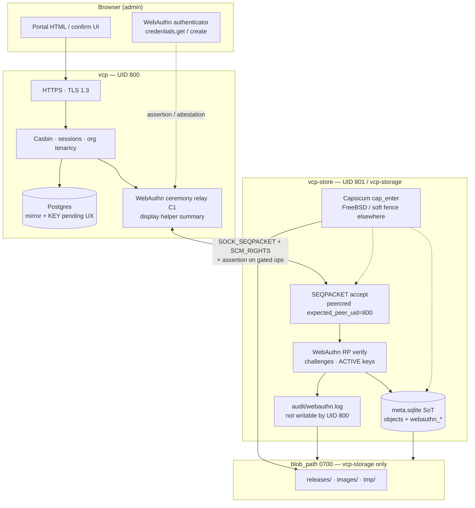
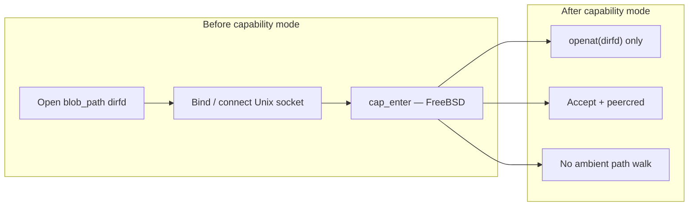
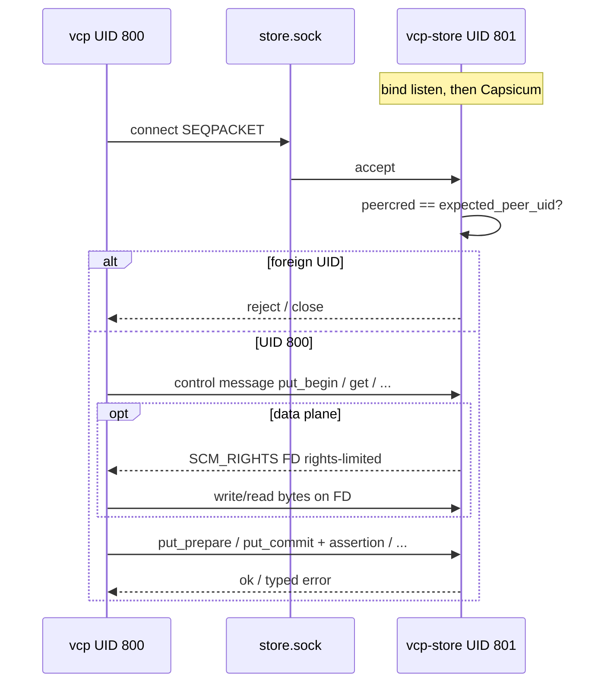
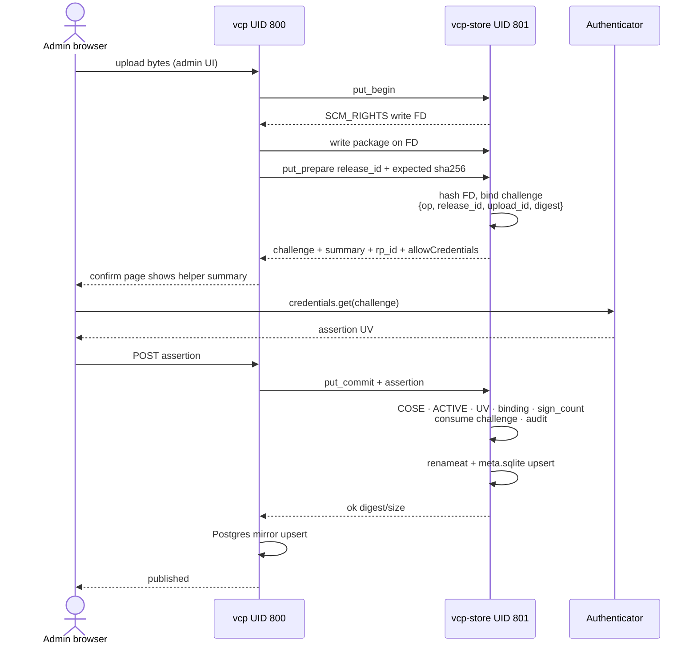
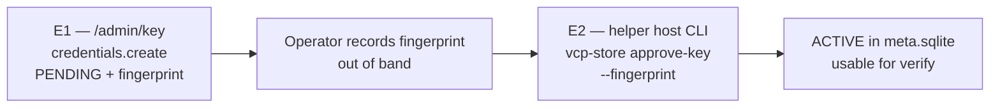

# VCP privsep visualization — Capsicum, IPC socket, WebAuthn E2E

**Audience:** engineers and operators who need a picture of the trust
boundaries.  
**Normative design:**
[`VCP_Storage_Helper_Architecture_EN(1.2).md`](VCP_Storage_Helper_Architecture_EN(1.2).md).  
**ADRs:** [002](../adr/002-storage-webauthn-ceremony-channel-c1.md) (C1
ceremony), [003](../adr/003-ctap2-enrol-revoke-asymmetry.md) (E1/E2 KEY),
[004](../adr/004-webauthn-sign-count-policy.md) (`sign_count`).

This note is a **visualization** of three layers that work together:

1. Process privilege separation (`vcp` vs `vcp-store`) and Capsicum.
2. The Unix SEQPACKET socket (control plane + `SCM_RIGHTS` data plane).
3. End-to-end WebAuthn: browser assertion verified **inside** `vcp-store`
   (portal `vcp` is only a C1 relay for gated mutations).

---

## 1. Trust map (who may do what)



| Principal | Trust for sensitive storage mutations |
|-----------|----------------------------------------|
| Browser admin | Human presence + UV (PIN/biometric) via authenticator |
| `vcp` (800) | **Untrusted** for finalize/delete (D10); Casbin/session only |
| `vcp-store` (801) | **TCB** for digests, rename, WebAuthn verify, audit |
| Capsicum | Kernel fence on FreeBSD after bind/connect; not the only control |

---

## 2. Privilege separation and Capsicum

`cap_enter(2)` is **process-wide**. Capsicum therefore lives on
`vcp-store` only: the portal keeps ACME, TLS, and Postgres (D1).



Portable baseline (always on, Capsicum or not):

- Distinct UIDs **800** / **801**; `blob_path` mode **0700**.
- Helper I/O via `dirfd` + `openat`; opaque object IDs.
- `expected_peer_uid` on the listen socket (required with `--production`).

Non-FreeBSD builds: same IPC and WebAuthn behavior; Capsicum is a WARN /
soft fence (D4).

---

## 3. Socket between `vcp` and `vcp-store`

Production layout:

| Item | Typical value |
|------|----------------|
| Portal `[storage]` | `ipc = "socket"`, `socket_path = "/var/run/vcp/store.sock"` |
| Helper | `listen` same path; `blob_path = "/var/db/vcp/storage"` |
| Socket type | `SOCK_SEQPACKET` (message boundaries) |
| AuthN of peer | `getpeereid` / `SO_PEERCRED` → UID **800** |
| Data plane | `SCM_RIGHTS` file descriptors for upload/download streams |



**Control plane** carries JSON-ish protocol messages (prepare, commit,
challenge, delete, key ops).  
**Data plane** moves artifact bytes on FDs; finalize still requires a
control message (and WebAuthn when gated).

Dev/test may use `ipc = "spawn"` (parent passes `--blob-path` /
`--listen`); production portal config must stay on **socket** mode.

---

## 4. WebAuthn E2E — browser to helper verify (C1)

Ceremony channel **C1**: the browser never talks to `vcp-store` directly.
`vcp` relays challenges and assertions. Verification of the assertion
runs **only** in the helper (D10, D11).

### 4.1 Gated release publish (happy path)



Cross-check on the helper host (ops): `vcp-store pending-ops` shows the
same canonical `summary` while the challenge is in flight.

### 4.2 What the helper checks on every gated assertion

```text
ACTIVE credential  →  COSE signature OK  →  UV required
       →  challenge unconsumed + unexpired  →  binding match (incl. digest)
       →  sign_count policy  →  consume + audit  →  mutate disk/SQLite
```

Without a valid assertion, `put_commit` (release) / `delete*` do not
materialize.

### 4.3 Deletes (same E2E shape)

```text
challenge_begin → C1 ceremony (summary in UI) → delete|delete_org + assertion
```

When an object exists at challenge time, the binding includes its SoT
`sha256`. If content changed before execute → `object_modified` (retry).

---

## 5. KEY enrolment (E1 web / E2 CLI) — why the browser alone is not enough



A compromised `vcp` can create PENDING artefacts in the portal UX; it
**cannot** write ACTIVE rows without helper-host CLI approve (ADR 003).
Revocation stays dashboard-driven (accept revoke-DoS residual).

---

## 6. One-page mental model

```text
  Browser ──HTTPS──► vcp (800) ──SEQPACKET──► vcp-store (801) ──openat──► blobs
     │                  │                         │
     │                  │ Casbin / session        │ Capsicum + peercred
     │                  │ relay only (C1)         │ WebAuthn RP + SoT
     └── authenticator ─┘                         └── audit under blob_path
```

| Question | Answer |
|----------|--------|
| Who verifies WebAuthn for release finalize? | `vcp-store` |
| Who sees the human? | Browser authenticator (+ UV) |
| Who may open `blob_path` by path? | UID **801** only |
| Who invents the op summary? | Helper (`summary`); UI must display it |
| Separate ceremony HTTPS (C2)? | Deferred — ADR 002 |

---

## Related docs

| Doc | Role |
|-----|------|
| [Architecture 1.2](VCP_Storage_Helper_Architecture_EN(1.2).md) | Normative design |
| [Ops runbook](../runbooks/storage_helper_ops.md) | Socket ownership, restart, KEY CLI |
| [Smoke](../runbooks/storage_helper_smoke_test.md) | Staging Pass / Fail |
| Capsicum audit | `.cursor/audits/vcp_capsicum_storage_sandbox_2026-08-02.md` |
