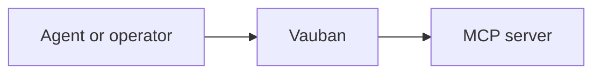
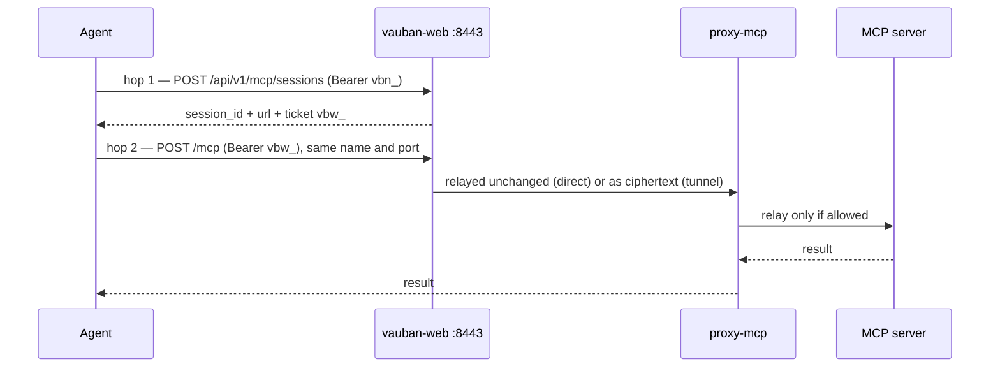
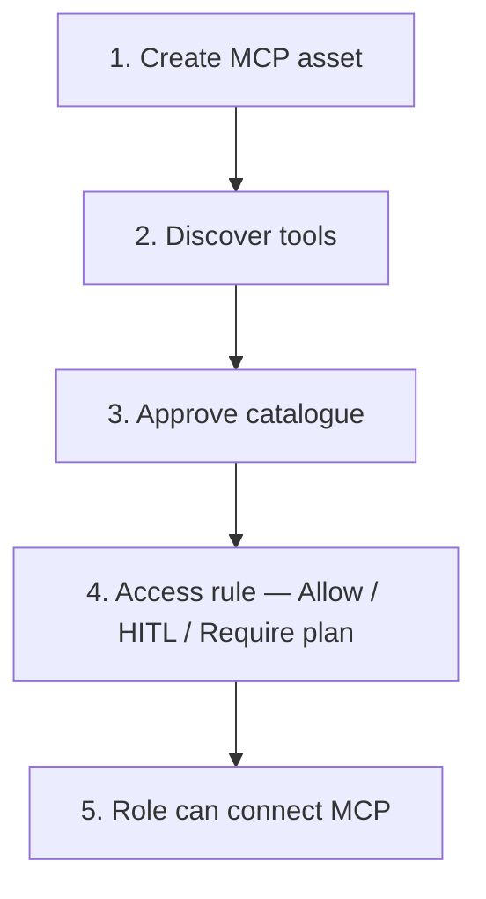
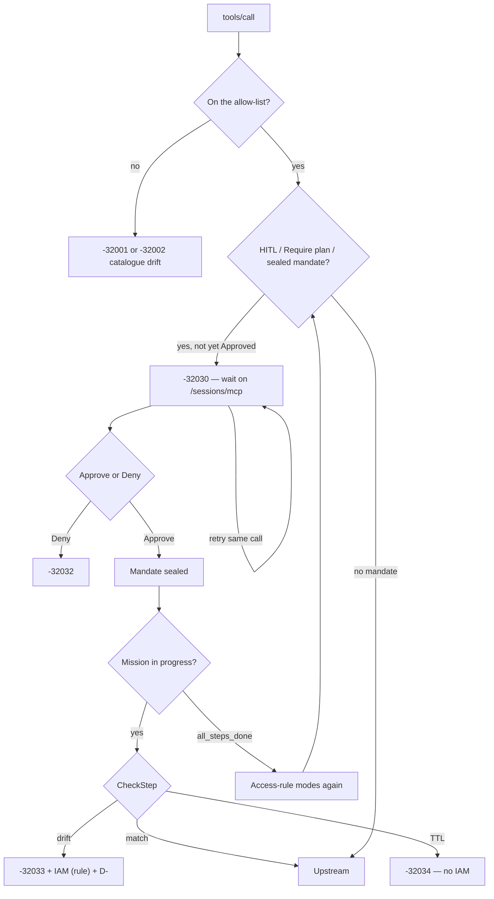
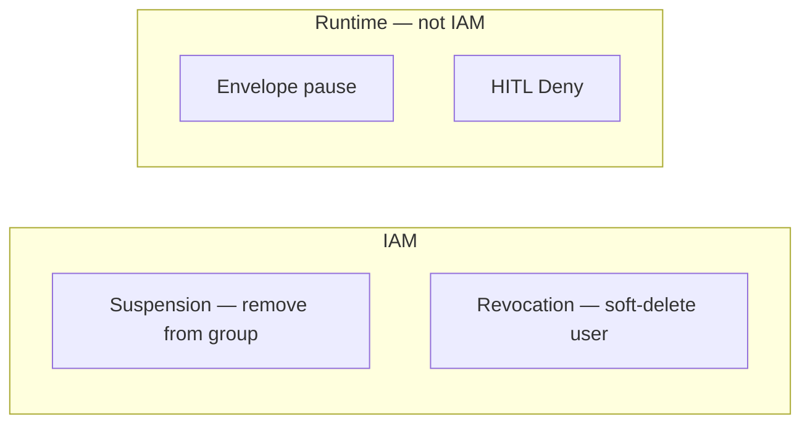

# User guide — MCP in Vauban

> For administrators and operators who use the UI.  
> Date: 2026-09-05  
> Architecture (hops, Mission Seal, agent view): [`../technical/Vauban_MCP_Architecture_EN(1.0).md`](../technical/Vauban_MCP_Architecture_EN(1.0).md)  
> Authorization choice: [`../adr/009-mcp-no-oauth-for-now.md`](../adr/009-mcp-no-oauth-for-now.md)

---

## What it is

Vauban protects **MCP tool servers** the same way it already protects SSH, RDP, and industrial assets: **who**, **which tools**, **how long**, **what is recorded**.

The agent (or a human via Connect) never talks to the tool server directly.



Without Vauban, the agent calls the server directly — no PAM control.

---

## Words you will see

| Term | Meaning |
|------|---------|
| **MCP asset** | The tool-server record (host, port, secret) |
| **Access rule** | Who may use which asset, with which tools |
| **API key `vbn_…`** | Machine identity. Used only to **open** a session |
| **Ticket `vbw_…`** | Short-lived bearer for the **proxy** during the visit |
| **Catalogue / TOFU** | Discover tools → they stay *pending* until an admin approves them |
| **HITL** | One tool call waits for a human Approve / Deny |
| **Mission Seal / mandat** | The agent declares a plan; after Approve, Vauban refuses any drift |
| **Recording** | Replayable session trace (same player family as SSH) |

---

## Two hops (always)



- `vbn_` never talks to the proxy.
- `vbw_` is accepted on `/mcp` only; it cannot open a hop 1.
- A fake key or fake ticket is refused. Nothing opens upstream.
- The visit (`vbw_`) is not one TCP socket. If the upstream closes the pipe (long HITL wait, MCP server restart), Vauban opens a **new brokered FD** with the same ticket and retries **once**. That is not a new Connect. You only need a new hop 1 if the session itself is dead (`-32003` / `-32004`) or recording cannot be written.

UI Connect is the same hop 1, with a cookie instead of `vbn_`.

---

## Administrator path



### 1. Create the asset

**Assets** → type **MCP** → host, port, path, upstream secret (vaulted like an SSH password).

On a packaged FreeBSD install, MCP is **off by default**. Set `[mcp].enabled = true` and restart, or the proxy does not start.

### 2–3. Discover and approve tools

Run **discover**. New or changed tools appear as **pending**. Approve the ones you accept. An unapproved tool cannot be used in a useful session.

### 4. Grant access

Sidebar **MCP** → **Access Rules** (`/sessions/mcp/access`).

Link a user group to an asset group. **One mode per tool name** (a single select — not three independent flags). The matrix is grouped by MCP asset; a name that several assets expose is one row (one mode for the group):

| Mode | Effect |
|------|--------|
| **Off** | This rule does not grant that tool |
| **Allow** | The tool may run with no extra gate |
| **HITL** | Granted + first call waits on `/sessions/mcp` |
| **Require plan** | Granted + Mission Seal (Story + Contract, then anti-drift). Implies HITL. |

All Off = this rule does not write an allow-list (it does not restrict tools by itself). Any other mode starts an allow-list. HITL / Require plan are always on that list (otherwise the proxy would return `-32001` before the queue). Session open unions those columns even on older rows that only stored the gates.

Discover / **Approve** on an asset only adds the name to the matrix as **Off**. It does not set Allow, HITL, or Require plan. Edit and detail show the same modes as this rule — never a dump of the SQL arrays.

Several rules: **Allow** is the **intersection** (empty ∩ → deny). **HITL** and **Require plan** are the **union**. SSH / RDP / IACS rules stay under **Access Rules** (`/assets/access`).

---

## Operator path (human)

1. Open the MCP asset → **Connect**.
2. Enter a **justification** (always required, 10 to 1000 characters after trim).
3. Success: proxy URL + ticket. Failure: an error toast, as for SSH.

During the visit:



- HITL Approve / Deny is **one call**. It does **not** remove anyone from a group. Retrying before Approve stays `-32030` (pending). The opener cannot Approve their own pending (SoD). The `vbn_` that opened the session cannot decide it either.
- After Approve, **every** `tools/call` is CheckStepped **while the mission is in progress**. Drift always cuts the session and mints a contestable `D-…` (`mandate_drift`). The IAM consequence is set on the MCP access rule (`Mission Seal drift`): cut visit only, suspend group (default), revoke the hop-1 API key, or soft-delete the user. Overturn restores the group only when the rule used suspend group. After every Contract step is done, tools revert to their access-rule modes (Allow runs; HITL waits; Require plan needs a new Story + Contract). The tool is not banned.
- If rights disappear mid-session, the live session is cut. The old ticket does not come back.

Replay is the same player as SSH. Full audit evidence stays on the server.

---

## AI agent path

1. Authenticate with `vbn_…` (rights ≤ the human owner).
2. `POST /api/v1/mcp/sessions` with the asset id and a justification of 10 to 1000 characters.
3. Keep `url` + `vbw_…` + expiry.
4. Every MCP request goes to `url` (`https://<bastion>/mcp`) with that ticket. A client that can set `Authorization: Bearer` posts there directly. A client that only speaks stdio runs the `vauban-mcp` shim, which opens the same URL through the tunnel. Hosted connectors that require MCP OAuth are not supported ([ADR 009](../adr/009-mcp-no-oauth-for-now.md)).

When a tool has **Require plan**, hop 2 `tools/list` adds `arguments.vauban` (Story + Contract) to that tool’s `inputSchema`. The first `tools/call` must include `arguments.vauban.story` and `arguments.vauban.contract` (that call always queues `-32030` HITL). Retrying before a human Approves stays `-32030`; upstream is not called. `_meta.vauban` is still accepted (curl). After Approve, later **Contract** steps send the tool + args only — Vauban CheckSteps. During the mission, a call that is not in the Contract (even an Allow tool) is **drift** (`-32033`), not `-32001`. After every step is done, an Allow tool is a normal call; a Require plan tool without `vauban` is `-32602` (not IAM). Story+Contract again starts a **new** mission (replace).

- **Story** (`summary`, `context`, `objective`, `risks`) is for the **human**. Vauban does not authorize from it.
- **Contract** is the only perimeter Vauban checks after Approve.

Write the Story in clear English. The HITL UI is English.

### Direct client

A client that can set a static header posts to the hop-1 `url` (`https://<bastion>/mcp`):

```json
{
  "mcpServers": {
    "vauban": {
      "url": "https://bastion.example/mcp",
      "headers": { "Authorization": "Bearer vbw_…" }
    }
  }
}
```

The `vbw_` value is the one-time ticket from hop 1, not the `vbn_` API key.

### Tunnel client

A client that only speaks stdio runs the shim. The API key stays in the environment or a file, never on the command line:

```text
VAUBAN_API_KEY=vbn_… vauban-mcp \
  --url https://bastion.example \
  --asset <asset-uuid> \
  --justification "read the ticket queue for the morning review" \
  --transport tunnel
```

Point the assistant at that command as a stdio MCP server. The first connection records the leaf pin. A later pin change is refused.

Hosted connectors that require MCP OAuth are not supported.

DTO and sequence: [`Vauban_MCP_Architecture_EN(1.0).md`, §7 The Agent View](../technical/Vauban_MCP_Architecture_EN(1.0).md#7-the-agent-view).

---

## Cutting access — do not mix these four



| Need | Action in Vauban | Effect |
|------|------------------|--------|
| Suspend (temporary) | Remove the user from the **group** on the MCP rule | Live MCP sessions cut; account remains |
| Revoke (final) | **Soft-delete** the user | Account tombstoned; sessions and keys dead; row kept for audit |
| Hard-delete | **Forbidden** | Traceability stays |
| Envelope | Automatic when call rate exceeds the rule | UI “Envelope paused” — Resume is ops, not IAM |
| HITL Deny | Refuse one pending call | Session may continue for other tools |

Re-adding someone to the group does **not** resurrect the old `vbw_`. They need a **new Connect** (or a new API open).

When a session is cut, the session page shows an **Access decision**: `D-…`, reason, who, when.

- **Subject** (the session owner): open and follow from **User Zone → My Requests** or the session page. Status is read-only at `/sessions/contestations/{uuid}`.
- **Reviewers**: claim / uphold / overturn stay under **Administration → MCP → Contestations** (separation of duties). The subject cannot open that nest.

Opening a contestation emails reviewers; uphold / overturn emails the opener (and the subject if they are not the opener). **Claim does not mail.**

Compromised `vbn_…`: **Revoke** or **Regenerate** under API keys — live MCP sessions opened with that key are cut immediately. See [`mcp_api_key_compromise.md`](../runbooks/mcp_api_key_compromise.md).

---

## Limits to remember

- MCP justification is **always** required, even when SSH does not require one.
- Every MCP session has an end time (default 1 hour). After that it is cut.
- About every 30 s Vauban rechecks rights. Gone → cut.
- Too many tool calls too fast may throttle or pause the session (envelope).
- If the agent changes name / version (`clientInfo`) mid-session, the session may be terminated.
- If the session recording cannot be written (supervised FD lease), the proxy returns `-32010` `recording_sync_failed` even if upstream already ran. Open a **new** hop 1 after restarting Vauban. A dead upstream TCP after HITL or an MCP-server bounce is **not** that case: the same `vbw_` is retried on a new FD.
- Supervisors with a mailbox get HITL / Mission Seal / contestation / drift mail. Empty mailbox or mailer off: no email, the action is still recorded.

---

## Where next

| Need | Document |
|------|----------|
| Hops, hop-2 exposure, errors, recording | [`Vauban_MCP_Architecture_EN(1.0).md`](../technical/Vauban_MCP_Architecture_EN(1.0).md) |
| Story / Contract / drift | [`Vauban_MCP_Architecture_EN(1.0).md`, §6](../technical/Vauban_MCP_Architecture_EN(1.0).md#6-human-in-the-loop-and-mission-seal) |
| Agent `tools/list` DTO | [`Vauban_MCP_Architecture_EN(1.0).md`, §7](../technical/Vauban_MCP_Architecture_EN(1.0).md#7-the-agent-view) |
| Why no MCP OAuth | [`009-mcp-no-oauth-for-now.md`](../adr/009-mcp-no-oauth-for-now.md) |
| Compromised `vbn_` | [`mcp_api_key_compromise.md`](../runbooks/mcp_api_key_compromise.md) |
| FreeBSD staging | [`mcp_staging_gwt_acceptance.md`](../runbooks/mcp_staging_gwt_acceptance.md) |
